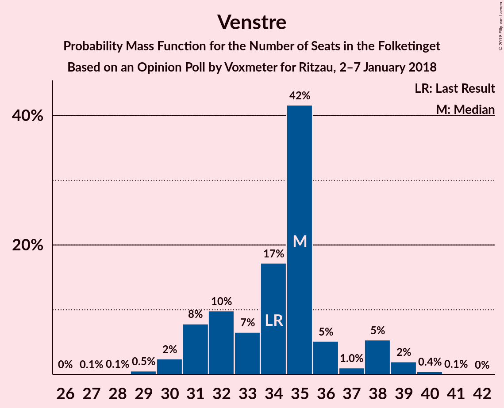
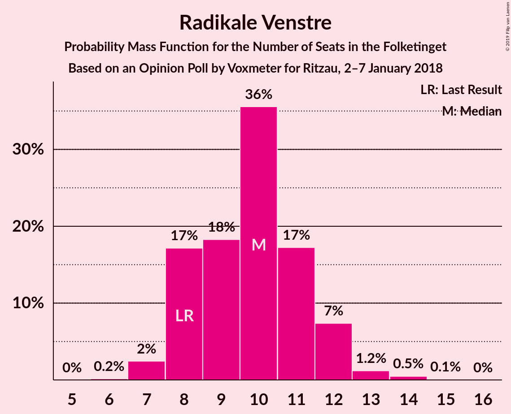
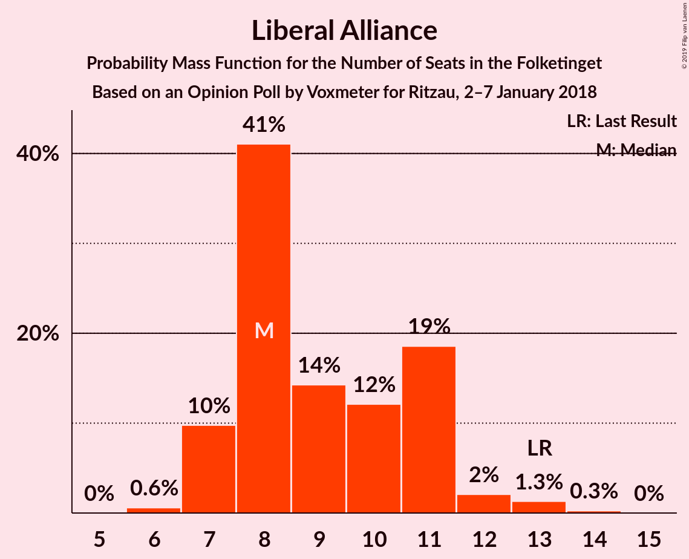
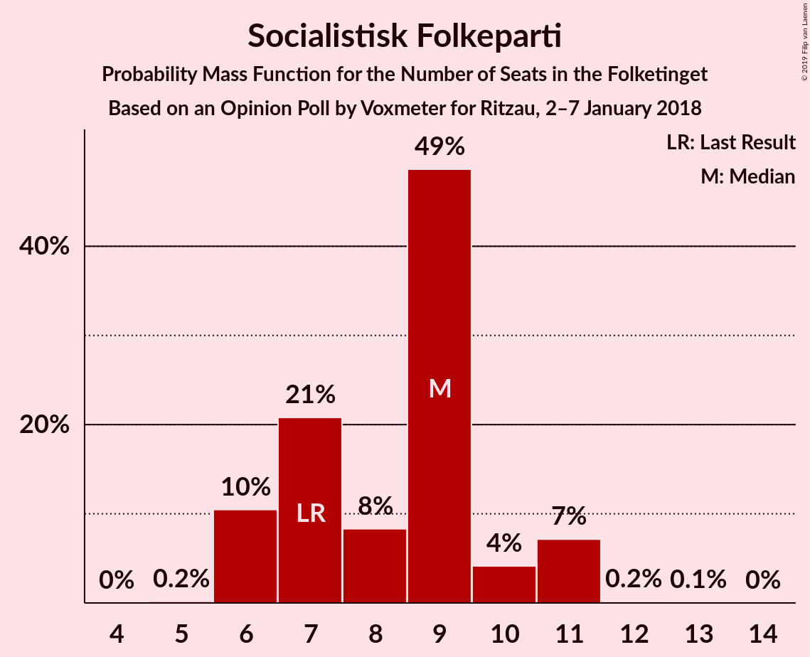
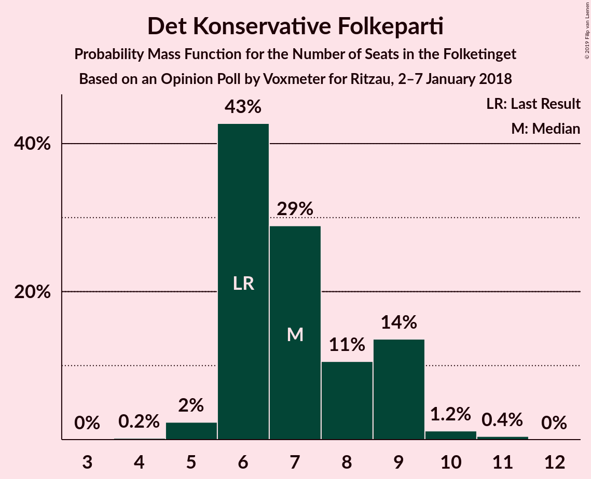
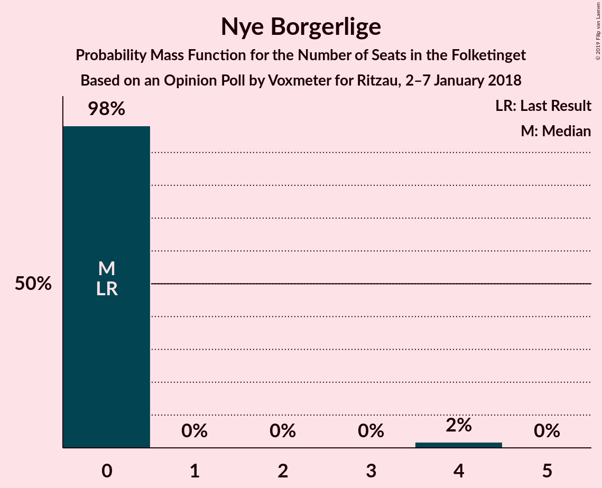

# Opinion Poll by Voxmeter for Ritzau, 2–7 January 2018

<a href="#voting-intentions">Voting Intentions</a> | <a href="#seats">Seats</a> | <a href="#coalitions">Coalitions</a> | <a href="#technical-information">Technical Information</a>

## Voting Intentions

### Confidence Intervals

| Party | Last Result | Poll Result | 80% Confidence Interval | 90% Confidence Interval | 95% Confidence Interval | 99% Confidence Interval |
|:-----:|:-----------:|:-----------:|:-----------------------:|:-----------------------:|:-----------------------:|:-----------------------:|
| Socialdemokraterne | 26.3% | 28.8% | 27.0–30.7% |26.5–31.2% |26.1–31.6% |25.3–32.5% |
| Venstre | 19.5% | 19.1% | 17.6–20.8% |17.2–21.2% |16.8–21.6% |16.2–22.5% |
| Dansk Folkeparti | 21.1% | 17.1% | 15.7–18.7% |15.3–19.1% |14.9–19.5% |14.3–20.3% |
| Enhedslisten–De Rød-Grønne | 7.8% | 8.8% | 7.8–10.0% |7.5–10.4% |7.2–10.7% |6.7–11.3% |
| Radikale Venstre | 4.6% | 5.4% | 4.6–6.4% |4.4–6.7% |4.2–7.0% |3.8–7.5% |
| Liberal Alliance | 7.5% | 5.1% | 4.3–6.1% |4.1–6.4% |3.9–6.6% |3.6–7.1% |
| Alternativet | 4.8% | 4.9% | 4.2–5.9% |3.9–6.2% |3.8–6.4% |3.4–6.9% |
| Socialistisk Folkeparti | 4.2% | 4.5% | 3.8–5.5% |3.6–5.8% |3.4–6.0% |3.1–6.5% |
| Det Konservative Folkeparti | 3.4% | 4.0% | 3.3–4.9% |3.1–5.1% |2.9–5.3% |2.6–5.8% |
| Nye Borgerlige | 0.0% | 1.1% | 0.7–1.6% |0.7–1.8% |0.6–1.9% |0.5–2.2% |
| Kristendemokraterne | 0.8% | 0.5% | 0.3–0.9% |0.2–1.0% |0.2–1.1% |0.1–1.4% |

*Note:* The poll result column reflects the actual value used in the calculations. Published results may vary slightly, and in addition be rounded to fewer digits.

## Seats

### Confidence Intervals

| Party | Last Result | Median | 80% Confidence Interval | 90% Confidence Interval | 95% Confidence Interval | 99% Confidence Interval |
|:-----:|:-----------:|:------:|:-----------------------:|:-----------------------:|:-----------------------:|:-----------------------:|
| <a href="#socialdemokraterne">Socialdemokraterne</a> | 47 | 52 | 47–52 |47–62 |44–62 |41–62 |
| <a href="#venstre">Venstre</a> | 34 | 33 | 28–33 |28–33 |28–37 |28–37 |
| <a href="#dansk-folkeparti">Dansk Folkeparti</a> | 37 | 29 | 29–30 |27–30 |27–31 |27–31 |
| <a href="#enhedslisten–de-rød-grønne">Enhedslisten–De Rød-Grønne</a> | 14 | 15 | 15–22 |13–22 |13–22 |13–22 |
| <a href="#radikale-venstre">Radikale Venstre</a> | 8 | 11 | 9–12 |8–12 |8–12 |8–15 |
| <a href="#liberal-alliance">Liberal Alliance</a> | 13 | 8 | 7–10 |7–10 |7–11 |7–14 |
| <a href="#alternativet">Alternativet</a> | 9 | 12 | 9–12 |9–12 |9–12 |9–14 |
| <a href="#socialistisk-folkeparti">Socialistisk Folkeparti</a> | 7 | 8 | 8–9 |7–9 |7–9 |7–11 |
| <a href="#det-konservative-folkeparti">Det Konservative Folkeparti</a> | 6 | 7 | 6–10 |5–10 |5–10 |5–11 |
| <a href="#nye-borgerlige">Nye Borgerlige</a> | 0 | 0 | 0 |0 |0 |0–4 |
| <a href="#kristendemokraterne">Kristendemokraterne</a> | 0 | 0 | 0 |0 |0 |0 |

### Socialdemokraterne

*For a full overview of the results for this party, see the [Socialdemokraterne](party-socialdemokraterne.html) page.*

| Number of Seats | Probability | Accumulated | Special Marks |
|:---------------:|:-----------:|:-----------:|:-------------:|
| 41 | 2% | 100% |  |
| 42 | 0% | 98% |  |
| 43 | 0% | 98% |  |
| 44 | 0.3% | 98% |  |
| 45 | 0% | 97% |  |
| 46 | 0.5% | 97% |  |
| 47 | 14% | 97% | Last Result |
| 48 | 0.1% | 83% |  |
| 49 | 28% | 83% |  |
| 50 | 0.1% | 55% |  |
| 51 | 0.3% | 55% |  |
| 52 | 45% | 54% | Median |
| 53 | 0.2% | 10% |  |
| 54 | 0.9% | 9% |  |
| 55 | 0% | 8% |  |
| 56 | 0% | 8% |  |
| 57 | 0% | 8% |  |
| 58 | 0% | 8% |  |
| 59 | 0% | 8% |  |
| 60 | 0% | 8% |  |
| 61 | 0% | 8% |  |
| 62 | 8% | 8% |  |
| 63 | 0% | 0% |  |

### Venstre

*For a full overview of the results for this party, see the [Venstre](party-venstre.html) page.*

| Number of Seats | Probability | Accumulated | Special Marks |
|:---------------:|:-----------:|:-----------:|:-------------:|
| 27 | 0.2% | 100% |  |
| 28 | 45% | 99.7% |  |
| 29 | 0.9% | 55% |  |
| 30 | 0.5% | 54% |  |
| 31 | 0.2% | 53% |  |
| 32 | 0% | 53% |  |
| 33 | 50% | 53% | Median |
| 34 | 0% | 3% | Last Result |
| 35 | 0% | 3% |  |
| 36 | 0% | 3% |  |
| 37 | 3% | 3% |  |
| 38 | 0% | 0.1% |  |
| 39 | 0% | 0.1% |  |
| 40 | 0% | 0.1% |  |
| 41 | 0% | 0.1% |  |
| 42 | 0% | 0.1% |  |
| 43 | 0% | 0.1% |  |
| 44 | 0% | 0.1% |  |
| 45 | 0.1% | 0.1% |  |
| 46 | 0% | 0% |  |

### Dansk Folkeparti

*For a full overview of the results for this party, see the [Dansk Folkeparti](party-danskfolkeparti.html) page.*

| Number of Seats | Probability | Accumulated | Special Marks |
|:---------------:|:-----------:|:-----------:|:-------------:|
| 24 | 0.1% | 100% |  |
| 25 | 0.3% | 99.9% |  |
| 26 | 0% | 99.6% |  |
| 27 | 9% | 99.6% |  |
| 28 | 0.1% | 91% |  |
| 29 | 74% | 90% | Median |
| 30 | 14% | 17% |  |
| 31 | 2% | 3% |  |
| 32 | 0.1% | 0.2% |  |
| 33 | 0% | 0.1% |  |
| 34 | 0% | 0.1% |  |
| 35 | 0% | 0% |  |
| 36 | 0% | 0% |  |
| 37 | 0% | 0% | Last Result |

### Enhedslisten–De Rød-Grønne

*For a full overview of the results for this party, see the [Enhedslisten–De Rød-Grønne](party-enhedslisten–derød-grønne.html) page.*

| Number of Seats | Probability | Accumulated | Special Marks |
|:---------------:|:-----------:|:-----------:|:-------------:|
| 12 | 0.3% | 100% |  |
| 13 | 10% | 99.7% |  |
| 14 | 0.1% | 90% | Last Result |
| 15 | 45% | 90% | Median |
| 16 | 31% | 45% |  |
| 17 | 0.6% | 15% |  |
| 18 | 0.1% | 14% |  |
| 19 | 0% | 14% |  |
| 20 | 0.2% | 14% |  |
| 21 | 0% | 14% |  |
| 22 | 14% | 14% |  |
| 23 | 0% | 0% |  |

### Radikale Venstre

*For a full overview of the results for this party, see the [Radikale Venstre](party-radikalevenstre.html) page.*

| Number of Seats | Probability | Accumulated | Special Marks |
|:---------------:|:-----------:|:-----------:|:-------------:|
| 8 | 8% | 100% | Last Result |
| 9 | 15% | 92% |  |
| 10 | 0.3% | 76% |  |
| 11 | 31% | 76% | Median |
| 12 | 45% | 45% |  |
| 13 | 0% | 0.6% |  |
| 14 | 0.1% | 0.6% |  |
| 15 | 0% | 0.5% |  |
| 16 | 0.5% | 0.5% |  |
| 17 | 0% | 0% |  |

### Liberal Alliance

*For a full overview of the results for this party, see the [Liberal Alliance](party-liberalalliance.html) page.*

| Number of Seats | Probability | Accumulated | Special Marks |
|:---------------:|:-----------:|:-----------:|:-------------:|
| 5 | 0% | 100% |  |
| 6 | 0% | 99.9% |  |
| 7 | 14% | 99.9% |  |
| 8 | 45% | 86% | Median |
| 9 | 9% | 41% |  |
| 10 | 28% | 33% |  |
| 11 | 3% | 4% |  |
| 12 | 0% | 1.0% |  |
| 13 | 0% | 1.0% | Last Result |
| 14 | 0.9% | 1.0% |  |
| 15 | 0.1% | 0.1% |  |
| 16 | 0% | 0% |  |

### Alternativet

*For a full overview of the results for this party, see the [Alternativet](party-alternativet.html) page.*

| Number of Seats | Probability | Accumulated | Special Marks |
|:---------------:|:-----------:|:-----------:|:-------------:|
| 7 | 0.1% | 100% |  |
| 8 | 0.1% | 99.9% |  |
| 9 | 28% | 99.7% | Last Result |
| 10 | 0.9% | 72% |  |
| 11 | 9% | 71% |  |
| 12 | 60% | 62% | Median |
| 13 | 0% | 2% |  |
| 14 | 2% | 2% |  |
| 15 | 0% | 0% |  |

### Socialistisk Folkeparti

*For a full overview of the results for this party, see the [Socialistisk Folkeparti](party-socialistiskfolkeparti.html) page.*

| Number of Seats | Probability | Accumulated | Special Marks |
|:---------------:|:-----------:|:-----------:|:-------------:|
| 7 | 8% | 100% | Last Result |
| 8 | 45% | 91% | Median |
| 9 | 45% | 47% |  |
| 10 | 2% | 2% |  |
| 11 | 0.3% | 0.6% |  |
| 12 | 0.3% | 0.3% |  |
| 13 | 0% | 0% |  |

### Det Konservative Folkeparti

*For a full overview of the results for this party, see the [Det Konservative Folkeparti](party-detkonservativefolkeparti.html) page.*

| Number of Seats | Probability | Accumulated | Special Marks |
|:---------------:|:-----------:|:-----------:|:-------------:|
| 4 | 0.3% | 100% |  |
| 5 | 9% | 99.7% |  |
| 6 | 30% | 90% | Last Result |
| 7 | 14% | 60% | Median |
| 8 | 0.3% | 46% |  |
| 9 | 0.3% | 46% |  |
| 10 | 45% | 45% |  |
| 11 | 0.5% | 0.5% |  |
| 12 | 0% | 0% |  |

### Nye Borgerlige

*For a full overview of the results for this party, see the [Nye Borgerlige](party-nyeborgerlige.html) page.*

| Number of Seats | Probability | Accumulated | Special Marks |
|:---------------:|:-----------:|:-----------:|:-------------:|
| 0 | 99.4% | 100% | Last Result, Median |
| 1 | 0% | 0.6% |  |
| 2 | 0% | 0.6% |  |
| 3 | 0% | 0.6% |  |
| 4 | 0.3% | 0.6% |  |
| 5 | 0.3% | 0.3% |  |
| 6 | 0% | 0% |  |

### Kristendemokraterne

*For a full overview of the results for this party, see the [Kristendemokraterne](party-kristendemokraterne.html) page.*

| Number of Seats | Probability | Accumulated | Special Marks |
|:---------------:|:-----------:|:-----------:|:-------------:|
| 0 | 99.9% | 100% | Last Result, Median |
| 1 | 0% | 0.1% |  |
| 2 | 0% | 0.1% |  |
| 3 | 0% | 0.1% |  |
| 4 | 0.1% | 0.1% |  |
| 5 | 0% | 0% |  |

## Coalitions

### Confidence Intervals

| Coalition | Last Result | Median | Majority? | 80% Confidence Interval | 90% Confidence Interval | 95% Confidence Interval | 99% Confidence Interval |
|:---------:|:-----------:|:------:|:---------:|:-----------------------:|:-----------------------:|:-----------------------:|:-----------------------:|
| Socialdemokraterne – Enhedslisten–De Rød-Grønne – Radikale Venstre – Alternativet – Socialistisk Folkeparti | 85 | 100 | 99.9% | 93–100 | 93–101 | 90–101 | 90–101 |
| Socialdemokraterne – Enhedslisten–De Rød-Grønne – Radikale Venstre – Socialistisk Folkeparti | 76 | 88 | 9% | 84–88 | 84–90 | 81–90 | 76–90 |
| Venstre – Dansk Folkeparti – Liberal Alliance – Det Konservative Folkeparti – Nye Borgerlige – Kristendemokraterne | 90 | 75 | 0% | 75–78 | 74–78 | 74–85 | 74–85 |
| Venstre – Dansk Folkeparti – Liberal Alliance – Det Konservative Folkeparti – Kristendemokraterne | 90 | 75 | 0% | 75–78 | 74–78 | 74–85 | 74–85 |
| Venstre – Dansk Folkeparti – Liberal Alliance – Det Konservative Folkeparti – Nye Borgerlige | 90 | 75 | 0% | 75–78 | 74–78 | 74–85 | 74–85 |
| Venstre – Dansk Folkeparti – Liberal Alliance – Det Konservative Folkeparti | 90 | 75 | 0% | 75–78 | 74–78 | 74–85 | 74–85 |
| Socialdemokraterne – Radikale Venstre – Socialistisk Folkeparti | 62 | 73 | 0% | 64–73 | 64–77 | 64–77 | 60–77 |
| Socialdemokraterne – Radikale Venstre | 55 | 64 | 0% | 56–64 | 56–70 | 54–70 | 52–70 |
| Venstre – Liberal Alliance – Det Konservative Folkeparti | 53 | 47 | 0% | 46–49 | 46–49 | 46–54 | 45–54 |
| Venstre – Det Konservative Folkeparti | 40 | 38 | 0% | 38–40 | 38–40 | 38–43 | 34–43 |
| Venstre | 34 | 33 | 0% | 28–33 | 28–33 | 28–37 | 28–37 |

### Socialdemokraterne – Enhedslisten–De Rød-Grønne – Radikale Venstre – Alternativet – Socialistisk Folkeparti

| Number of Seats | Probability | Accumulated | Special Marks |
|:---------------:|:-----------:|:-----------:|:-------------:|
| 85 | 0% | 100% | Last Result |
| 86 | 0% | 100% |  |
| 87 | 0% | 100% |  |
| 88 | 0% | 100% |  |
| 89 | 0.1% | 99.9% |  |
| 90 | 2% | 99.9% | Majority |
| 91 | 0% | 97% |  |
| 92 | 0.1% | 97% |  |
| 93 | 29% | 97% |  |
| 94 | 0% | 69% |  |
| 95 | 0.1% | 69% |  |
| 96 | 0.3% | 69% |  |
| 97 | 0.5% | 68% |  |
| 98 | 15% | 68% | Median |
| 99 | 0% | 53% |  |
| 100 | 45% | 53% |  |
| 101 | 8% | 9% |  |
| 102 | 0% | 0.3% |  |
| 103 | 0.2% | 0.2% |  |
| 104 | 0% | 0% |  |

### Socialdemokraterne – Enhedslisten–De Rød-Grønne – Radikale Venstre – Socialistisk Folkeparti

| Number of Seats | Probability | Accumulated | Special Marks |
|:---------------:|:-----------:|:-----------:|:-------------:|
| 76 | 2% | 100% | Last Result |
| 77 | 0% | 98% |  |
| 78 | 0% | 98% |  |
| 79 | 0% | 98% |  |
| 80 | 0% | 98% |  |
| 81 | 0.1% | 98% |  |
| 82 | 0.3% | 97% |  |
| 83 | 0.4% | 97% |  |
| 84 | 28% | 97% |  |
| 85 | 0.2% | 69% |  |
| 86 | 15% | 68% | Median |
| 87 | 0.5% | 54% |  |
| 88 | 45% | 53% |  |
| 89 | 0% | 9% |  |
| 90 | 8% | 9% | Majority |
| 91 | 0% | 0.3% |  |
| 92 | 0% | 0.2% |  |
| 93 | 0% | 0.2% |  |
| 94 | 0.2% | 0.2% |  |
| 95 | 0% | 0% |  |

### Venstre – Dansk Folkeparti – Liberal Alliance – Det Konservative Folkeparti – Nye Borgerlige – Kristendemokraterne

| Number of Seats | Probability | Accumulated | Special Marks |
|:---------------:|:-----------:|:-----------:|:-------------:|
| 72 | 0.2% | 100% |  |
| 73 | 0% | 99.8% |  |
| 74 | 8% | 99.7% |  |
| 75 | 45% | 91% |  |
| 76 | 0% | 47% |  |
| 77 | 15% | 47% | Median |
| 78 | 28% | 32% |  |
| 79 | 0.3% | 4% |  |
| 80 | 0.1% | 3% |  |
| 81 | 0% | 3% |  |
| 82 | 0.6% | 3% |  |
| 83 | 0.1% | 3% |  |
| 84 | 0% | 3% |  |
| 85 | 2% | 3% |  |
| 86 | 0.1% | 0.1% |  |
| 87 | 0% | 0.1% |  |
| 88 | 0% | 0% |  |
| 89 | 0% | 0% |  |
| 90 | 0% | 0% | Last Result, Majority |

### Venstre – Dansk Folkeparti – Liberal Alliance – Det Konservative Folkeparti – Kristendemokraterne

| Number of Seats | Probability | Accumulated | Special Marks |
|:---------------:|:-----------:|:-----------:|:-------------:|
| 72 | 0.2% | 100% |  |
| 73 | 0% | 99.8% |  |
| 74 | 9% | 99.7% |  |
| 75 | 45% | 91% |  |
| 76 | 0% | 46% |  |
| 77 | 15% | 46% | Median |
| 78 | 29% | 32% |  |
| 79 | 0% | 3% |  |
| 80 | 0.1% | 3% |  |
| 81 | 0% | 3% |  |
| 82 | 0.3% | 3% |  |
| 83 | 0.1% | 3% |  |
| 84 | 0% | 3% |  |
| 85 | 2% | 3% |  |
| 86 | 0.1% | 0.1% |  |
| 87 | 0% | 0.1% |  |
| 88 | 0% | 0% |  |
| 89 | 0% | 0% |  |
| 90 | 0% | 0% | Last Result, Majority |

### Venstre – Dansk Folkeparti – Liberal Alliance – Det Konservative Folkeparti – Nye Borgerlige

| Number of Seats | Probability | Accumulated | Special Marks |
|:---------------:|:-----------:|:-----------:|:-------------:|
| 72 | 0.2% | 100% |  |
| 73 | 0% | 99.8% |  |
| 74 | 8% | 99.7% |  |
| 75 | 45% | 91% |  |
| 76 | 0% | 47% |  |
| 77 | 15% | 47% | Median |
| 78 | 28% | 32% |  |
| 79 | 0.3% | 4% |  |
| 80 | 0.1% | 3% |  |
| 81 | 0% | 3% |  |
| 82 | 0.7% | 3% |  |
| 83 | 0.1% | 3% |  |
| 84 | 0% | 3% |  |
| 85 | 2% | 3% |  |
| 86 | 0% | 0.1% |  |
| 87 | 0% | 0.1% |  |
| 88 | 0% | 0% |  |
| 89 | 0% | 0% |  |
| 90 | 0% | 0% | Last Result, Majority |

### Venstre – Dansk Folkeparti – Liberal Alliance – Det Konservative Folkeparti

| Number of Seats | Probability | Accumulated | Special Marks |
|:---------------:|:-----------:|:-----------:|:-------------:|
| 72 | 0.2% | 100% |  |
| 73 | 0% | 99.8% |  |
| 74 | 9% | 99.7% |  |
| 75 | 45% | 91% |  |
| 76 | 0% | 46% |  |
| 77 | 15% | 46% | Median |
| 78 | 29% | 32% |  |
| 79 | 0% | 3% |  |
| 80 | 0.1% | 3% |  |
| 81 | 0% | 3% |  |
| 82 | 0.4% | 3% |  |
| 83 | 0.1% | 3% |  |
| 84 | 0% | 3% |  |
| 85 | 2% | 3% |  |
| 86 | 0% | 0.1% |  |
| 87 | 0% | 0.1% |  |
| 88 | 0% | 0% |  |
| 89 | 0% | 0% |  |
| 90 | 0% | 0% | Last Result, Majority |

### Socialdemokraterne – Radikale Venstre – Socialistisk Folkeparti

| Number of Seats | Probability | Accumulated | Special Marks |
|:---------------:|:-----------:|:-----------:|:-------------:|
| 60 | 2% | 100% |  |
| 61 | 0% | 98% |  |
| 62 | 0% | 98% | Last Result |
| 63 | 0% | 98% |  |
| 64 | 14% | 98% |  |
| 65 | 0% | 84% |  |
| 66 | 0.3% | 84% |  |
| 67 | 0.2% | 83% |  |
| 68 | 28% | 83% |  |
| 69 | 0% | 55% |  |
| 70 | 0.8% | 55% |  |
| 71 | 0.1% | 55% | Median |
| 72 | 0.3% | 54% |  |
| 73 | 45% | 54% |  |
| 74 | 0.2% | 9% |  |
| 75 | 0% | 8% |  |
| 76 | 0% | 8% |  |
| 77 | 8% | 8% |  |
| 78 | 0% | 0% |  |

### Socialdemokraterne – Radikale Venstre

| Number of Seats | Probability | Accumulated | Special Marks |
|:---------------:|:-----------:|:-----------:|:-------------:|
| 52 | 2% | 100% |  |
| 53 | 0% | 98% |  |
| 54 | 0.3% | 98% |  |
| 55 | 0% | 97% | Last Result |
| 56 | 14% | 97% |  |
| 57 | 0.1% | 83% |  |
| 58 | 0% | 83% |  |
| 59 | 0.1% | 83% |  |
| 60 | 28% | 83% |  |
| 61 | 0.4% | 55% |  |
| 62 | 0.5% | 55% |  |
| 63 | 0.9% | 54% | Median |
| 64 | 45% | 53% |  |
| 65 | 0% | 8% |  |
| 66 | 0% | 8% |  |
| 67 | 0% | 8% |  |
| 68 | 0% | 8% |  |
| 69 | 0% | 8% |  |
| 70 | 8% | 8% |  |
| 71 | 0% | 0% |  |

### Venstre – Liberal Alliance – Det Konservative Folkeparti

| Number of Seats | Probability | Accumulated | Special Marks |
|:---------------:|:-----------:|:-----------:|:-------------:|
| 44 | 0% | 100% |  |
| 45 | 0.5% | 99.9% |  |
| 46 | 45% | 99.4% |  |
| 47 | 22% | 55% |  |
| 48 | 1.2% | 33% | Median |
| 49 | 28% | 31% |  |
| 50 | 0.1% | 4% |  |
| 51 | 0.5% | 4% |  |
| 52 | 0.1% | 3% |  |
| 53 | 0% | 3% | Last Result |
| 54 | 2% | 3% |  |
| 55 | 0% | 0.5% |  |
| 56 | 0% | 0.5% |  |
| 57 | 0.3% | 0.5% |  |
| 58 | 0% | 0.1% |  |
| 59 | 0.1% | 0.1% |  |
| 60 | 0% | 0% |  |

### Venstre – Det Konservative Folkeparti

| Number of Seats | Probability | Accumulated | Special Marks |
|:---------------:|:-----------:|:-----------:|:-------------:|
| 34 | 1.1% | 100% |  |
| 35 | 0% | 98.9% |  |
| 36 | 0.3% | 98.9% |  |
| 37 | 0.4% | 98.6% |  |
| 38 | 53% | 98% |  |
| 39 | 28% | 45% |  |
| 40 | 14% | 17% | Last Result, Median |
| 41 | 0.5% | 3% |  |
| 42 | 0.1% | 3% |  |
| 43 | 2% | 3% |  |
| 44 | 0% | 0.5% |  |
| 45 | 0% | 0.5% |  |
| 46 | 0.3% | 0.4% |  |
| 47 | 0% | 0.1% |  |
| 48 | 0% | 0.1% |  |
| 49 | 0% | 0.1% |  |
| 50 | 0.1% | 0.1% |  |
| 51 | 0% | 0% |  |

### Venstre

| Number of Seats | Probability | Accumulated | Special Marks |
|:---------------:|:-----------:|:-----------:|:-------------:|
| 27 | 0.2% | 100% |  |
| 28 | 45% | 99.7% |  |
| 29 | 0.9% | 55% |  |
| 30 | 0.5% | 54% |  |
| 31 | 0.2% | 53% |  |
| 32 | 0% | 53% |  |
| 33 | 50% | 53% | Median |
| 34 | 0% | 3% | Last Result |
| 35 | 0% | 3% |  |
| 36 | 0% | 3% |  |
| 37 | 3% | 3% |  |
| 38 | 0% | 0.1% |  |
| 39 | 0% | 0.1% |  |
| 40 | 0% | 0.1% |  |
| 41 | 0% | 0.1% |  |
| 42 | 0% | 0.1% |  |
| 43 | 0% | 0.1% |  |
| 44 | 0% | 0.1% |  |
| 45 | 0.1% | 0.1% |  |
| 46 | 0% | 0% |  |

## Technical Information

### Opinion Poll

+ **Polling firm:** Voxmeter
+ **Commissioner(s):** Ritzau
+ **Fieldwork period:** 2–7 January 2018

### Calculations

+ **Sample size:** 1035
+ **Simulations done:** 1,024
+ **Error estimate:** 5.93%

