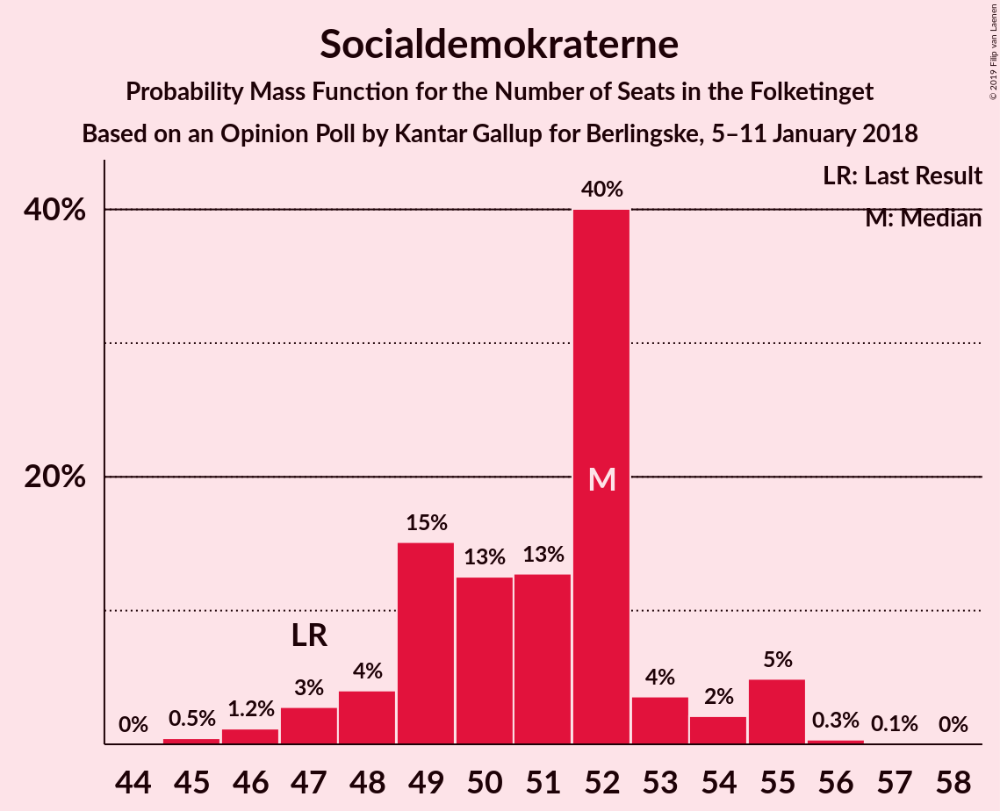
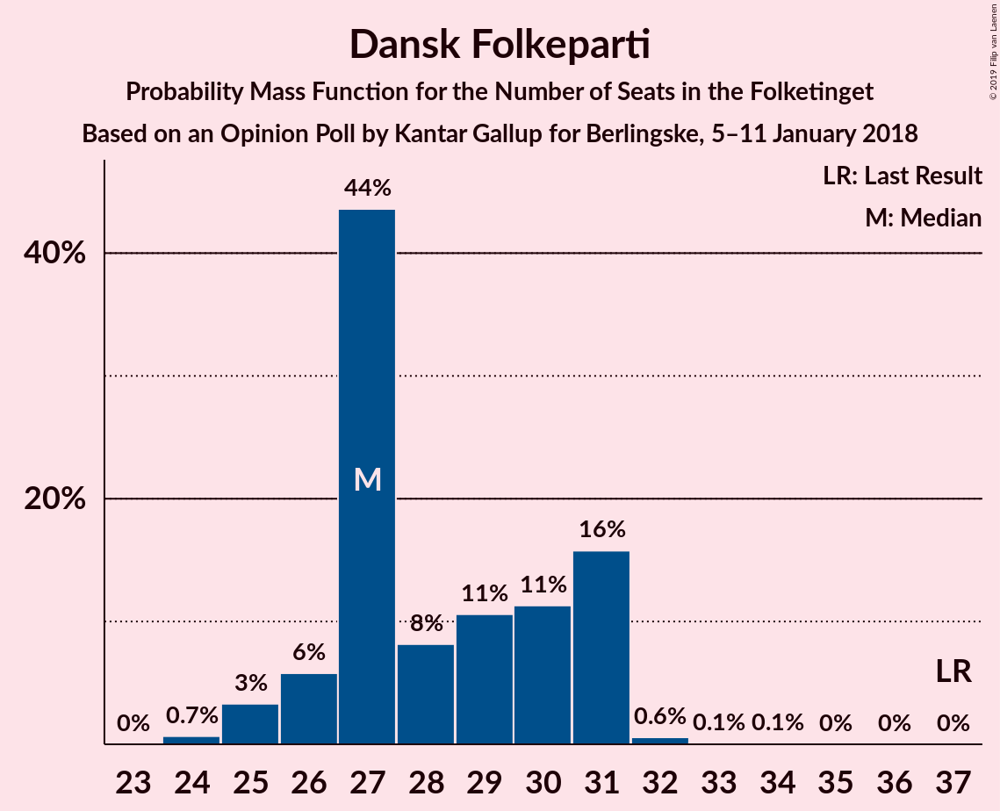
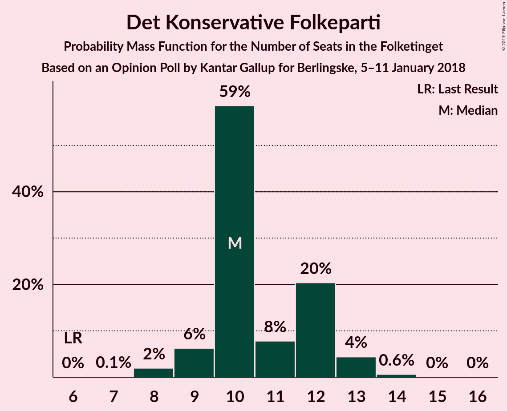
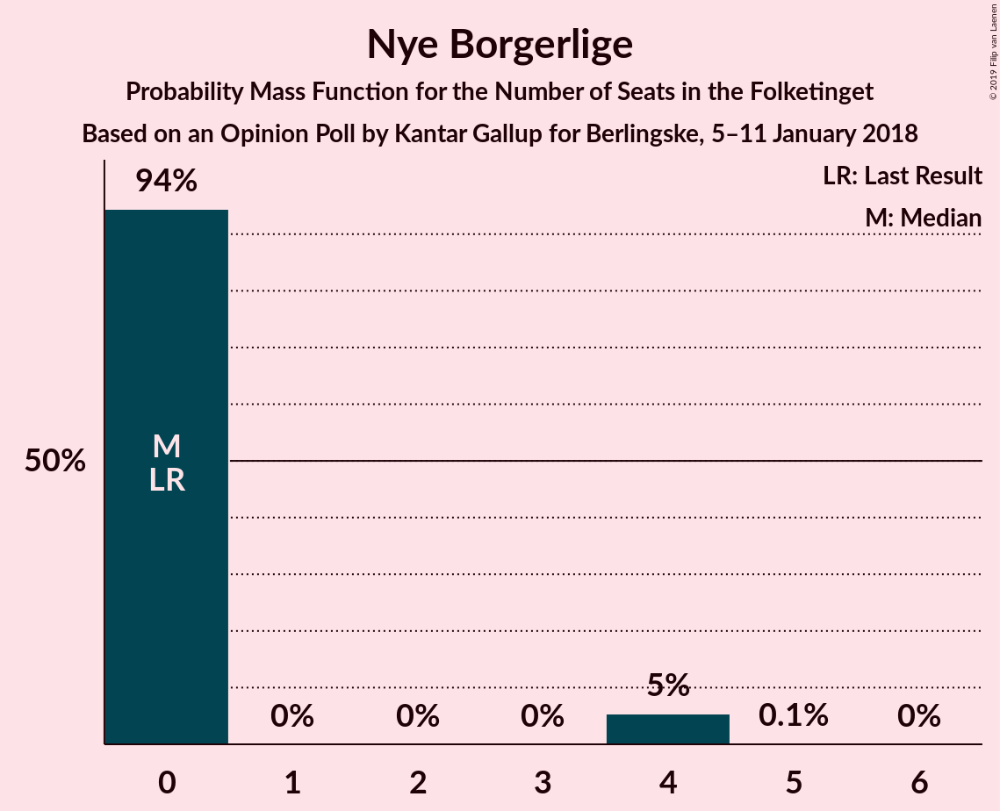
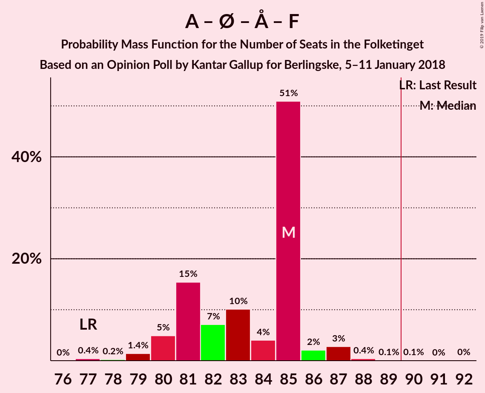

# Opinion Poll by Kantar Gallup for Berlingske, 5–11 January 2018

<a href="#voting-intentions">Voting Intentions</a> | <a href="#seats">Seats</a> | <a href="#coalitions">Coalitions</a> | <a href="#technical-information">Technical Information</a>

## Voting Intentions

### Confidence Intervals

| Party | Last Result | Poll Result | 80% Confidence Interval | 90% Confidence Interval | 95% Confidence Interval | 99% Confidence Interval |
|:-----:|:-----------:|:-----------:|:-----------------------:|:-----------------------:|:-----------------------:|:-----------------------:|
| Socialdemokraterne | 26.3% | 28.5% | 27.0–30.0% |26.6–30.4% |26.3–30.8% |25.6–31.5% |
| Venstre | 19.5% | 21.5% | 20.2–22.9% |19.8–23.3% |19.5–23.6% |18.9–24.3% |
| Dansk Folkeparti | 21.1% | 15.9% | 14.7–17.1% |14.4–17.5% |14.1–17.8% |13.6–18.4% |
| Enhedslisten–De Rød-Grønne | 7.8% | 8.3% | 7.4–9.3% |7.2–9.5% |7.0–9.8% |6.6–10.3% |
| Det Konservative Folkeparti | 3.4% | 5.9% | 5.2–6.8% |5.0–7.0% |4.8–7.2% |4.5–7.7% |
| Alternativet | 4.8% | 5.1% | 4.4–5.9% |4.2–6.1% |4.1–6.3% |3.8–6.7% |
| Socialistisk Folkeparti | 4.2% | 4.7% | 4.1–5.5% |3.9–5.7% |3.7–5.9% |3.5–6.3% |
| Radikale Venstre | 4.6% | 4.4% | 3.8–5.2% |3.6–5.4% |3.5–5.6% |3.2–6.0% |
| Liberal Alliance | 7.5% | 3.4% | 2.9–4.1% |2.7–4.3% |2.6–4.4% |2.4–4.8% |
| Nye Borgerlige | 0.0% | 1.5% | 1.2–2.0% |1.1–2.1% |1.0–2.2% |0.9–2.5% |
| Kristendemokraterne | 0.8% | 0.7% | 0.5–1.1% |0.4–1.2% |0.4–1.3% |0.3–1.5% |

*Note:* The poll result column reflects the actual value used in the calculations. Published results may vary slightly, and in addition be rounded to fewer digits.

## Seats

### Confidence Intervals

| Party | Last Result | Median | 80% Confidence Interval | 90% Confidence Interval | 95% Confidence Interval | 99% Confidence Interval |
|:-----:|:-----------:|:------:|:-----------------------:|:-----------------------:|:-----------------------:|:-----------------------:|
| <a href="#socialdemokraterne">Socialdemokraterne</a> | 47 | 52 | 49–53 |48–55 |47–55 |45–55 |
| <a href="#venstre">Venstre</a> | 34 | 38 | 36–40 |35–40 |35–43 |34–43 |
| <a href="#dansk-folkeparti">Dansk Folkeparti</a> | 37 | 27 | 27–31 |26–31 |25–31 |24–32 |
| <a href="#enhedslisten–de-rød-grønne">Enhedslisten–De Rød-Grønne</a> | 14 | 14 | 14–16 |13–16 |12–17 |11–18 |
| <a href="#det-konservative-folkeparti">Det Konservative Folkeparti</a> | 6 | 10 | 10–12 |9–13 |9–13 |8–14 |
| <a href="#alternativet">Alternativet</a> | 9 | 10 | 8–11 |8–11 |7–11 |7–12 |
| <a href="#socialistisk-folkeparti">Socialistisk Folkeparti</a> | 7 | 8 | 8–9 |7–10 |7–10 |7–10 |
| <a href="#radikale-venstre">Radikale Venstre</a> | 8 | 9 | 7–9 |7–10 |6–10 |6–10 |
| <a href="#liberal-alliance">Liberal Alliance</a> | 13 | 6 | 6–7 |5–7 |5–8 |4–8 |
| <a href="#nye-borgerlige">Nye Borgerlige</a> | 0 | 0 | 0 |0–4 |0–4 |0–4 |
| <a href="#kristendemokraterne">Kristendemokraterne</a> | 0 | 0 | 0 |0 |0 |0 |

### Socialdemokraterne

*For a full overview of the results for this party, see the [Socialdemokraterne](party-socialdemokraterne.html) page.*

| Number of Seats | Probability | Accumulated | Special Marks |
|:---------------:|:-----------:|:-----------:|:-------------:|
| 44 | 0% | 100% |  |
| 45 | 0.5% | 99.9% |  |
| 46 | 1.2% | 99.5% |  |
| 47 | 3% | 98% | Last Result |
| 48 | 4% | 96% |  |
| 49 | 15% | 92% |  |
| 50 | 13% | 76% |  |
| 51 | 13% | 64% |  |
| 52 | 40% | 51% | Median |
| 53 | 4% | 11% |  |
| 54 | 2% | 7% |  |
| 55 | 5% | 5% |  |
| 56 | 0.3% | 0.5% |  |
| 57 | 0.1% | 0.1% |  |
| 58 | 0% | 0% |  |

### Venstre

*For a full overview of the results for this party, see the [Venstre](party-venstre.html) page.*

| Number of Seats | Probability | Accumulated | Special Marks |
|:---------------:|:-----------:|:-----------:|:-------------:|
| 33 | 0.2% | 100% |  |
| 34 | 0.3% | 99.7% | Last Result |
| 35 | 8% | 99.4% |  |
| 36 | 28% | 92% |  |
| 37 | 1.4% | 64% |  |
| 38 | 40% | 63% | Median |
| 39 | 9% | 22% |  |
| 40 | 9% | 13% |  |
| 41 | 0.5% | 4% |  |
| 42 | 0.7% | 4% |  |
| 43 | 3% | 3% |  |
| 44 | 0% | 0.1% |  |
| 45 | 0% | 0% |  |

### Dansk Folkeparti

*For a full overview of the results for this party, see the [Dansk Folkeparti](party-danskfolkeparti.html) page.*

| Number of Seats | Probability | Accumulated | Special Marks |
|:---------------:|:-----------:|:-----------:|:-------------:|
| 24 | 0.7% | 100% |  |
| 25 | 3% | 99.3% |  |
| 26 | 6% | 96% |  |
| 27 | 44% | 90% | Median |
| 28 | 8% | 47% |  |
| 29 | 11% | 38% |  |
| 30 | 11% | 28% |  |
| 31 | 16% | 17% |  |
| 32 | 0.6% | 0.8% |  |
| 33 | 0.1% | 0.2% |  |
| 34 | 0.1% | 0.1% |  |
| 35 | 0% | 0% |  |
| 36 | 0% | 0% |  |
| 37 | 0% | 0% | Last Result |

### Enhedslisten–De Rød-Grønne

*For a full overview of the results for this party, see the [Enhedslisten–De Rød-Grønne](party-enhedslisten–derød-grønne.html) page.*

| Number of Seats | Probability | Accumulated | Special Marks |
|:---------------:|:-----------:|:-----------:|:-------------:|
| 11 | 1.4% | 100% |  |
| 12 | 2% | 98.6% |  |
| 13 | 6% | 97% |  |
| 14 | 57% | 91% | Last Result, Median |
| 15 | 17% | 34% |  |
| 16 | 13% | 17% |  |
| 17 | 2% | 4% |  |
| 18 | 1.2% | 1.5% |  |
| 19 | 0.2% | 0.3% |  |
| 20 | 0% | 0% |  |

### Det Konservative Folkeparti

*For a full overview of the results for this party, see the [Det Konservative Folkeparti](party-detkonservativefolkeparti.html) page.*

| Number of Seats | Probability | Accumulated | Special Marks |
|:---------------:|:-----------:|:-----------:|:-------------:|
| 6 | 0% | 100% | Last Result |
| 7 | 0.1% | 100% |  |
| 8 | 2% | 99.9% |  |
| 9 | 6% | 98% |  |
| 10 | 59% | 92% | Median |
| 11 | 8% | 33% |  |
| 12 | 20% | 25% |  |
| 13 | 4% | 5% |  |
| 14 | 0.6% | 0.7% |  |
| 15 | 0% | 0.1% |  |
| 16 | 0% | 0% |  |

### Alternativet

*For a full overview of the results for this party, see the [Alternativet](party-alternativet.html) page.*

| Number of Seats | Probability | Accumulated | Special Marks |
|:---------------:|:-----------:|:-----------:|:-------------:|
| 7 | 5% | 100% |  |
| 8 | 13% | 95% |  |
| 9 | 28% | 82% | Last Result |
| 10 | 13% | 54% | Median |
| 11 | 40% | 41% |  |
| 12 | 2% | 2% |  |
| 13 | 0.1% | 0.1% |  |
| 14 | 0% | 0% |  |

### Socialistisk Folkeparti

*For a full overview of the results for this party, see the [Socialistisk Folkeparti](party-socialistiskfolkeparti.html) page.*

| Number of Seats | Probability | Accumulated | Special Marks |
|:---------------:|:-----------:|:-----------:|:-------------:|
| 6 | 0.2% | 100% |  |
| 7 | 6% | 99.8% | Last Result |
| 8 | 49% | 94% | Median |
| 9 | 38% | 45% |  |
| 10 | 7% | 7% |  |
| 11 | 0.2% | 0.3% |  |
| 12 | 0.1% | 0.1% |  |
| 13 | 0% | 0% |  |

### Radikale Venstre

*For a full overview of the results for this party, see the [Radikale Venstre](party-radikalevenstre.html) page.*

| Number of Seats | Probability | Accumulated | Special Marks |
|:---------------:|:-----------:|:-----------:|:-------------:|
| 5 | 0.2% | 100% |  |
| 6 | 3% | 99.8% |  |
| 7 | 10% | 97% |  |
| 8 | 14% | 87% | Last Result |
| 9 | 67% | 73% | Median |
| 10 | 6% | 6% |  |
| 11 | 0.3% | 0.3% |  |
| 12 | 0% | 0% |  |

### Liberal Alliance

*For a full overview of the results for this party, see the [Liberal Alliance](party-liberalalliance.html) page.*

| Number of Seats | Probability | Accumulated | Special Marks |
|:---------------:|:-----------:|:-----------:|:-------------:|
| 4 | 2% | 100% |  |
| 5 | 7% | 98% |  |
| 6 | 68% | 91% | Median |
| 7 | 21% | 24% |  |
| 8 | 2% | 3% |  |
| 9 | 0.3% | 0.3% |  |
| 10 | 0% | 0% |  |
| 11 | 0% | 0% |  |
| 12 | 0% | 0% |  |
| 13 | 0% | 0% | Last Result |

### Nye Borgerlige

*For a full overview of the results for this party, see the [Nye Borgerlige](party-nyeborgerlige.html) page.*

| Number of Seats | Probability | Accumulated | Special Marks |
|:---------------:|:-----------:|:-----------:|:-------------:|
| 0 | 94% | 100% | Last Result, Median |
| 1 | 0% | 6% |  |
| 2 | 0% | 6% |  |
| 3 | 0% | 6% |  |
| 4 | 5% | 6% |  |
| 5 | 0.1% | 0.1% |  |
| 6 | 0% | 0% |  |

### Kristendemokraterne

*For a full overview of the results for this party, see the [Kristendemokraterne](party-kristendemokraterne.html) page.*

| Number of Seats | Probability | Accumulated | Special Marks |
|:---------------:|:-----------:|:-----------:|:-------------:|
| 0 | 100% | 100% | Last Result, Median |

## Coalitions

### Confidence Intervals

| Coalition | Last Result | Median | Majority? | 80% Confidence Interval | 90% Confidence Interval | 95% Confidence Interval | 99% Confidence Interval |
|:---------:|:-----------:|:------:|:---------:|:-----------------------:|:-----------------------:|:-----------------------:|:-----------------------:|
| Socialdemokraterne – Enhedslisten–De Rød-Grønne – Alternativet – Socialistisk Folkeparti – Radikale Venstre | 85 | 94 | 88% | 89–94 | 88–94 | 87–95 | 86–96 |
| Venstre – Dansk Folkeparti – Det Konservative Folkeparti – Liberal Alliance – Nye Borgerlige – Kristendemokraterne | 90 | 81 | 0.3% | 81–86 | 81–87 | 80–88 | 79–89 |
| Venstre – Dansk Folkeparti – Det Konservative Folkeparti – Liberal Alliance – Kristendemokraterne | 90 | 81 | 0.3% | 81–85 | 81–87 | 80–88 | 78–88 |
| Venstre – Dansk Folkeparti – Det Konservative Folkeparti – Liberal Alliance – Nye Borgerlige | 90 | 81 | 0.3% | 81–86 | 81–87 | 80–88 | 79–89 |
| Venstre – Dansk Folkeparti – Det Konservative Folkeparti – Liberal Alliance | 90 | 81 | 0.3% | 81–85 | 81–87 | 80–88 | 78–88 |
| Socialdemokraterne – Enhedslisten–De Rød-Grønne – Alternativet – Socialistisk Folkeparti | 77 | 85 | 0.1% | 81–85 | 80–86 | 80–87 | 78–88 |
| Socialdemokraterne – Enhedslisten–De Rød-Grønne – Socialistisk Folkeparti – Radikale Venstre | 76 | 83 | 0% | 79–85 | 78–87 | 78–87 | 77–87 |
| Socialdemokraterne – Enhedslisten–De Rød-Grønne – Socialistisk Folkeparti | 68 | 74 | 0% | 72–76 | 71–78 | 71–79 | 68–79 |
| Socialdemokraterne – Socialistisk Folkeparti – Radikale Venstre | 62 | 69 | 0% | 65–70 | 63–71 | 63–73 | 62–73 |
| Socialdemokraterne – Radikale Venstre | 55 | 61 | 0% | 57–61 | 55–62 | 54–64 | 53–64 |
| Venstre – Det Konservative Folkeparti – Liberal Alliance | 53 | 54 | 0% | 52–57 | 51–59 | 51–60 | 50–61 |
| Venstre – Det Konservative Folkeparti | 40 | 48 | 0% | 46–50 | 45–52 | 45–53 | 44–55 |
| Venstre | 34 | 38 | 0% | 36–40 | 35–40 | 35–43 | 34–43 |

### Socialdemokraterne – Enhedslisten–De Rød-Grønne – Alternativet – Socialistisk Folkeparti – Radikale Venstre

| Number of Seats | Probability | Accumulated | Special Marks |
|:---------------:|:-----------:|:-----------:|:-------------:|
| 85 | 0.3% | 100% | Last Result |
| 86 | 0.2% | 99.7% |  |
| 87 | 4% | 99.5% |  |
| 88 | 5% | 96% |  |
| 89 | 3% | 91% |  |
| 90 | 18% | 88% | Majority |
| 91 | 6% | 71% |  |
| 92 | 6% | 65% |  |
| 93 | 6% | 59% | Median |
| 94 | 49% | 53% |  |
| 95 | 4% | 4% |  |
| 96 | 0.4% | 0.7% |  |
| 97 | 0.2% | 0.3% |  |
| 98 | 0.1% | 0.1% |  |
| 99 | 0% | 0.1% |  |
| 100 | 0% | 0% |  |

### Venstre – Dansk Folkeparti – Det Konservative Folkeparti – Liberal Alliance – Nye Borgerlige – Kristendemokraterne

| Number of Seats | Probability | Accumulated | Special Marks |
|:---------------:|:-----------:|:-----------:|:-------------:|
| 76 | 0% | 100% |  |
| 77 | 0.1% | 99.9% |  |
| 78 | 0.2% | 99.9% |  |
| 79 | 0.4% | 99.7% |  |
| 80 | 4% | 99.3% |  |
| 81 | 49% | 96% | Median |
| 82 | 6% | 47% |  |
| 83 | 6% | 41% |  |
| 84 | 6% | 35% |  |
| 85 | 18% | 29% |  |
| 86 | 3% | 12% |  |
| 87 | 5% | 9% |  |
| 88 | 4% | 4% |  |
| 89 | 0.2% | 0.5% |  |
| 90 | 0.3% | 0.3% | Last Result, Majority |
| 91 | 0% | 0% |  |

### Venstre – Dansk Folkeparti – Det Konservative Folkeparti – Liberal Alliance – Kristendemokraterne

| Number of Seats | Probability | Accumulated | Special Marks |
|:---------------:|:-----------:|:-----------:|:-------------:|
| 75 | 0.2% | 100% |  |
| 76 | 0% | 99.8% |  |
| 77 | 0.2% | 99.8% |  |
| 78 | 0.3% | 99.6% |  |
| 79 | 0.6% | 99.3% |  |
| 80 | 4% | 98.8% |  |
| 81 | 51% | 95% | Median |
| 82 | 6% | 44% |  |
| 83 | 6% | 37% |  |
| 84 | 7% | 31% |  |
| 85 | 15% | 25% |  |
| 86 | 2% | 9% |  |
| 87 | 4% | 7% |  |
| 88 | 3% | 3% |  |
| 89 | 0.1% | 0.4% |  |
| 90 | 0.3% | 0.3% | Last Result, Majority |
| 91 | 0% | 0% |  |

### Venstre – Dansk Folkeparti – Det Konservative Folkeparti – Liberal Alliance – Nye Borgerlige

| Number of Seats | Probability | Accumulated | Special Marks |
|:---------------:|:-----------:|:-----------:|:-------------:|
| 76 | 0% | 100% |  |
| 77 | 0.1% | 99.9% |  |
| 78 | 0.2% | 99.9% |  |
| 79 | 0.4% | 99.7% |  |
| 80 | 4% | 99.3% |  |
| 81 | 49% | 96% | Median |
| 82 | 6% | 47% |  |
| 83 | 6% | 41% |  |
| 84 | 6% | 35% |  |
| 85 | 18% | 29% |  |
| 86 | 3% | 12% |  |
| 87 | 5% | 9% |  |
| 88 | 4% | 4% |  |
| 89 | 0.2% | 0.5% |  |
| 90 | 0.3% | 0.3% | Last Result, Majority |
| 91 | 0% | 0% |  |

### Venstre – Dansk Folkeparti – Det Konservative Folkeparti – Liberal Alliance

| Number of Seats | Probability | Accumulated | Special Marks |
|:---------------:|:-----------:|:-----------:|:-------------:|
| 75 | 0.2% | 100% |  |
| 76 | 0% | 99.8% |  |
| 77 | 0.2% | 99.8% |  |
| 78 | 0.3% | 99.6% |  |
| 79 | 0.6% | 99.3% |  |
| 80 | 4% | 98.8% |  |
| 81 | 51% | 95% | Median |
| 82 | 6% | 44% |  |
| 83 | 6% | 37% |  |
| 84 | 7% | 31% |  |
| 85 | 15% | 25% |  |
| 86 | 2% | 9% |  |
| 87 | 4% | 7% |  |
| 88 | 3% | 3% |  |
| 89 | 0.1% | 0.4% |  |
| 90 | 0.3% | 0.3% | Last Result, Majority |
| 91 | 0% | 0% |  |

### Socialdemokraterne – Enhedslisten–De Rød-Grønne – Alternativet – Socialistisk Folkeparti

| Number of Seats | Probability | Accumulated | Special Marks |
|:---------------:|:-----------:|:-----------:|:-------------:|
| 77 | 0.4% | 100% | Last Result |
| 78 | 0.2% | 99.6% |  |
| 79 | 1.4% | 99.3% |  |
| 80 | 5% | 98% |  |
| 81 | 15% | 93% |  |
| 82 | 7% | 78% |  |
| 83 | 10% | 71% |  |
| 84 | 4% | 60% | Median |
| 85 | 51% | 56% |  |
| 86 | 2% | 5% |  |
| 87 | 3% | 3% |  |
| 88 | 0.4% | 0.7% |  |
| 89 | 0.1% | 0.3% |  |
| 90 | 0.1% | 0.1% | Majority |
| 91 | 0% | 0.1% |  |
| 92 | 0% | 0% |  |

### Socialdemokraterne – Enhedslisten–De Rød-Grønne – Socialistisk Folkeparti – Radikale Venstre

| Number of Seats | Probability | Accumulated | Special Marks |
|:---------------:|:-----------:|:-----------:|:-------------:|
| 75 | 0.1% | 100% |  |
| 76 | 0.3% | 99.9% | Last Result |
| 77 | 1.1% | 99.6% |  |
| 78 | 4% | 98% |  |
| 79 | 6% | 95% |  |
| 80 | 4% | 89% |  |
| 81 | 15% | 85% |  |
| 82 | 5% | 70% |  |
| 83 | 42% | 65% | Median |
| 84 | 9% | 23% |  |
| 85 | 7% | 14% |  |
| 86 | 2% | 7% |  |
| 87 | 5% | 5% |  |
| 88 | 0.2% | 0.3% |  |
| 89 | 0.1% | 0.1% |  |
| 90 | 0% | 0% | Majority |

### Socialdemokraterne – Enhedslisten–De Rød-Grønne – Socialistisk Folkeparti

| Number of Seats | Probability | Accumulated | Special Marks |
|:---------------:|:-----------:|:-----------:|:-------------:|
| 67 | 0.1% | 100% |  |
| 68 | 0.4% | 99.9% | Last Result |
| 69 | 0.9% | 99.5% |  |
| 70 | 0.9% | 98.6% |  |
| 71 | 7% | 98% |  |
| 72 | 16% | 91% |  |
| 73 | 3% | 75% |  |
| 74 | 45% | 72% | Median |
| 75 | 14% | 27% |  |
| 76 | 4% | 12% |  |
| 77 | 2% | 8% |  |
| 78 | 4% | 6% |  |
| 79 | 2% | 3% |  |
| 80 | 0.1% | 0.2% |  |
| 81 | 0.1% | 0.1% |  |
| 82 | 0% | 0% |  |

### Socialdemokraterne – Socialistisk Folkeparti – Radikale Venstre

| Number of Seats | Probability | Accumulated | Special Marks |
|:---------------:|:-----------:|:-----------:|:-------------:|
| 60 | 0% | 100% |  |
| 61 | 0.2% | 99.9% |  |
| 62 | 2% | 99.7% | Last Result |
| 63 | 3% | 98% |  |
| 64 | 3% | 95% |  |
| 65 | 3% | 92% |  |
| 66 | 4% | 89% |  |
| 67 | 16% | 84% |  |
| 68 | 10% | 68% |  |
| 69 | 43% | 57% | Median |
| 70 | 9% | 15% |  |
| 71 | 1.3% | 6% |  |
| 72 | 1.4% | 5% |  |
| 73 | 3% | 3% |  |
| 74 | 0.1% | 0.1% |  |
| 75 | 0% | 0% |  |

### Socialdemokraterne – Radikale Venstre

| Number of Seats | Probability | Accumulated | Special Marks |
|:---------------:|:-----------:|:-----------:|:-------------:|
| 52 | 0.1% | 100% |  |
| 53 | 0.4% | 99.9% |  |
| 54 | 4% | 99.5% |  |
| 55 | 0.8% | 95% | Last Result |
| 56 | 4% | 95% |  |
| 57 | 4% | 91% |  |
| 58 | 17% | 87% |  |
| 59 | 13% | 70% |  |
| 60 | 3% | 57% |  |
| 61 | 47% | 54% | Median |
| 62 | 3% | 7% |  |
| 63 | 1.3% | 5% |  |
| 64 | 3% | 3% |  |
| 65 | 0.1% | 0.2% |  |
| 66 | 0.1% | 0.1% |  |
| 67 | 0% | 0% |  |

### Venstre – Det Konservative Folkeparti – Liberal Alliance

| Number of Seats | Probability | Accumulated | Special Marks |
|:---------------:|:-----------:|:-----------:|:-------------:|
| 48 | 0.1% | 100% |  |
| 49 | 0.2% | 99.9% |  |
| 50 | 0.3% | 99.8% |  |
| 51 | 8% | 99.5% |  |
| 52 | 4% | 92% |  |
| 53 | 9% | 88% | Last Result |
| 54 | 53% | 79% | Median |
| 55 | 6% | 26% |  |
| 56 | 9% | 20% |  |
| 57 | 4% | 11% |  |
| 58 | 2% | 7% |  |
| 59 | 2% | 5% |  |
| 60 | 0.4% | 3% |  |
| 61 | 2% | 2% |  |
| 62 | 0% | 0% |  |

### Venstre – Det Konservative Folkeparti

| Number of Seats | Probability | Accumulated | Special Marks |
|:---------------:|:-----------:|:-----------:|:-------------:|
| 40 | 0% | 100% | Last Result |
| 41 | 0% | 100% |  |
| 42 | 0% | 100% |  |
| 43 | 0.2% | 100% |  |
| 44 | 0.9% | 99.7% |  |
| 45 | 7% | 98.8% |  |
| 46 | 9% | 92% |  |
| 47 | 2% | 83% |  |
| 48 | 56% | 81% | Median |
| 49 | 9% | 25% |  |
| 50 | 6% | 15% |  |
| 51 | 3% | 9% |  |
| 52 | 2% | 6% |  |
| 53 | 2% | 4% |  |
| 54 | 0.1% | 2% |  |
| 55 | 2% | 2% |  |
| 56 | 0% | 0% |  |

### Venstre

| Number of Seats | Probability | Accumulated | Special Marks |
|:---------------:|:-----------:|:-----------:|:-------------:|
| 33 | 0.2% | 100% |  |
| 34 | 0.3% | 99.7% | Last Result |
| 35 | 8% | 99.4% |  |
| 36 | 28% | 92% |  |
| 37 | 1.4% | 64% |  |
| 38 | 40% | 63% | Median |
| 39 | 9% | 22% |  |
| 40 | 9% | 13% |  |
| 41 | 0.5% | 4% |  |
| 42 | 0.7% | 4% |  |
| 43 | 3% | 3% |  |
| 44 | 0% | 0.1% |  |
| 45 | 0% | 0% |  |

## Technical Information

### Opinion Poll

+ **Polling firm:** Kantar Gallup
+ **Commissioner(s):** Berlingske
+ **Fieldwork period:** 5–11 January 2018

### Calculations

+ **Sample size:** 1535
+ **Simulations done:** 1,048,576
+ **Error estimate:** 2.03%

