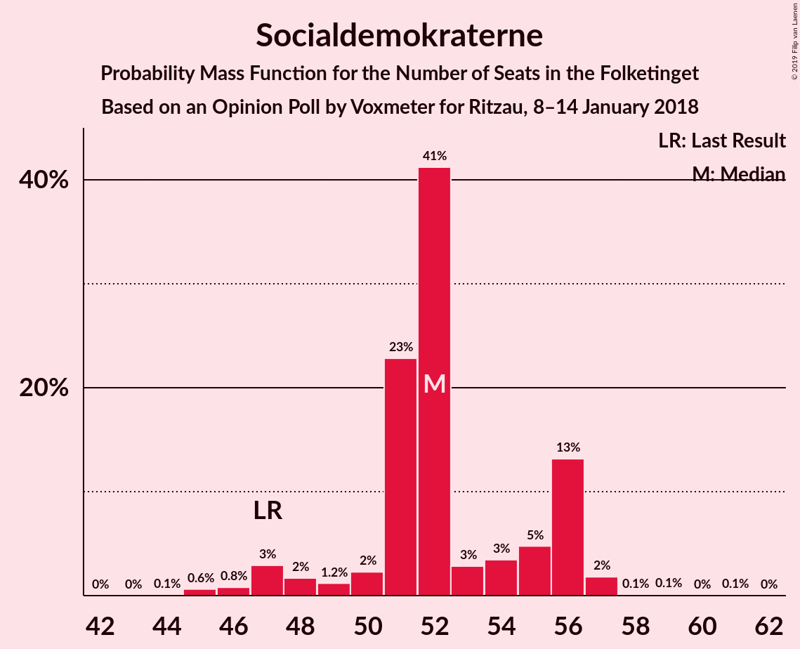
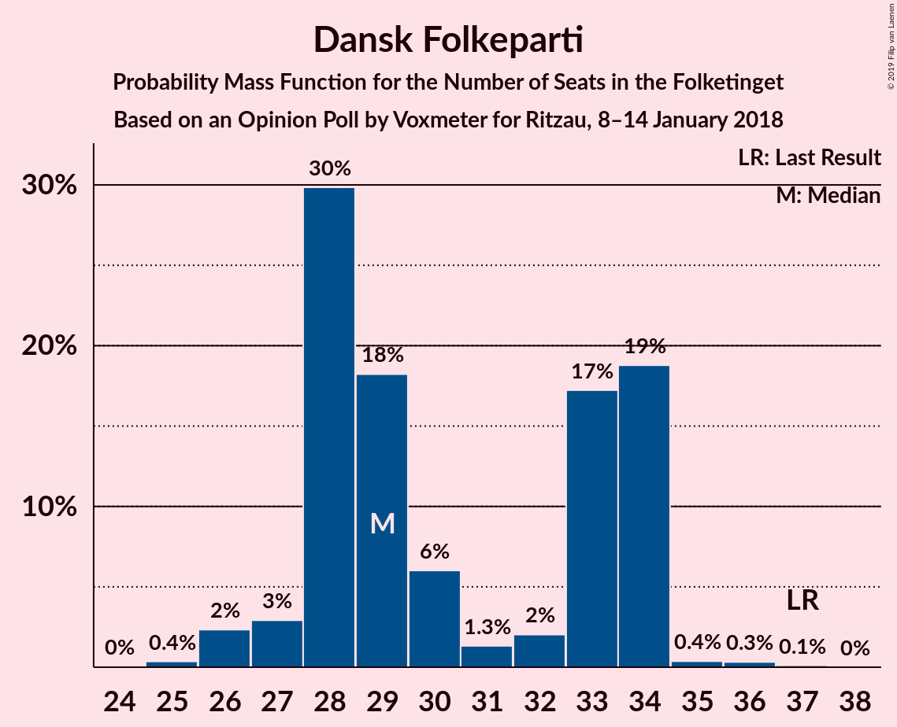
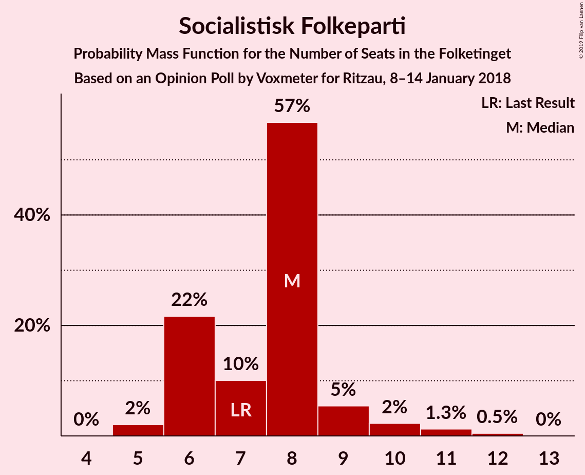
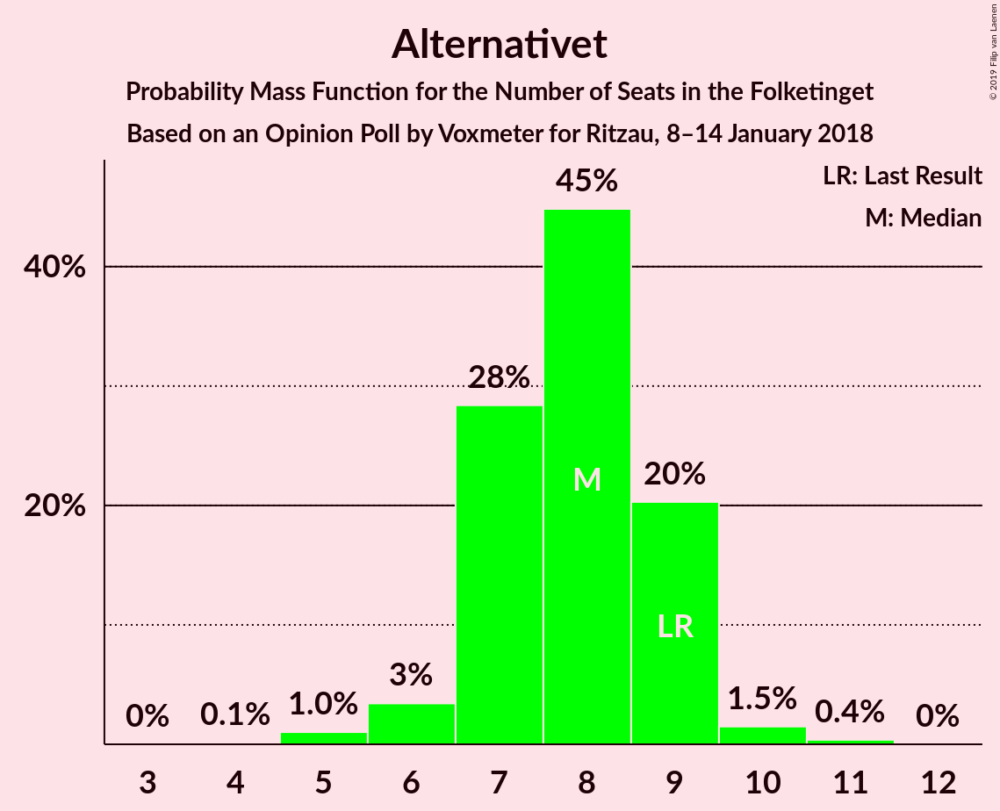

# Opinion Poll by Voxmeter for Ritzau, 8–14 January 2018

<a href="#voting-intentions">Voting Intentions</a> | <a href="#seats">Seats</a> | <a href="#coalitions">Coalitions</a> | <a href="#technical-information">Technical Information</a>

## Voting Intentions

### Confidence Intervals

| Party | Last Result | Poll Result | 80% Confidence Interval | 90% Confidence Interval | 95% Confidence Interval | 99% Confidence Interval |
|:-----:|:-----------:|:-----------:|:-----------------------:|:-----------------------:|:-----------------------:|:-----------------------:|
| Socialdemokraterne | 26.3% | 29.3% | 27.5–31.2% |27.0–31.7% |26.6–32.1% |25.7–33.1% |
| Venstre | 19.5% | 19.9% | 18.4–21.6% |18.0–22.1% |17.6–22.5% |16.9–23.3% |
| Dansk Folkeparti | 21.1% | 17.3% | 15.8–18.9% |15.4–19.3% |15.1–19.7% |14.4–20.5% |
| Enhedslisten–De Rød-Grønne | 7.8% | 9.3% | 8.2–10.6% |7.9–11.0% |7.7–11.3% |7.2–11.9% |
| Liberal Alliance | 7.5% | 5.7% | 4.9–6.8% |4.6–7.0% |4.4–7.3% |4.1–7.8% |
| Radikale Venstre | 4.6% | 4.6% | 3.9–5.6% |3.7–5.9% |3.5–6.1% |3.2–6.6% |
| Socialistisk Folkeparti | 4.2% | 4.4% | 3.7–5.4% |3.5–5.6% |3.3–5.9% |3.0–6.4% |
| Alternativet | 4.8% | 4.1% | 3.4–5.0% |3.2–5.3% |3.1–5.5% |2.8–6.0% |
| Det Konservative Folkeparti | 3.4% | 3.8% | 3.2–4.7% |3.0–5.0% |2.8–5.2% |2.5–5.7% |
| Kristendemokraterne | 0.8% | 0.7% | 0.5–1.2% |0.4–1.3% |0.3–1.4% |0.2–1.7% |
| Nye Borgerlige | 0.0% | 0.6% | 0.4–1.0% |0.3–1.2% |0.3–1.3% |0.2–1.5% |

*Note:* The poll result column reflects the actual value used in the calculations. Published results may vary slightly, and in addition be rounded to fewer digits.

## Seats

### Confidence Intervals

| Party | Last Result | Median | 80% Confidence Interval | 90% Confidence Interval | 95% Confidence Interval | 99% Confidence Interval |
|:-----:|:-----------:|:------:|:-----------------------:|:-----------------------:|:-----------------------:|:-----------------------:|
| <a href="#socialdemokraterne">Socialdemokraterne</a> | 47 | 51 | 50–55 |48–57 |46–57 |45–57 |
| <a href="#venstre">Venstre</a> | 34 | 36 | 35–36 |34–39 |33–39 |29–41 |
| <a href="#dansk-folkeparti">Dansk Folkeparti</a> | 37 | 34 | 29–34 |26–34 |26–34 |26–34 |
| <a href="#enhedslisten–de-rød-grønne">Enhedslisten–De Rød-Grønne</a> | 14 | 16 | 16–18 |16–20 |15–20 |13–21 |
| <a href="#liberal-alliance">Liberal Alliance</a> | 13 | 10 | 9–10 |9–11 |8–12 |8–14 |
| <a href="#radikale-venstre">Radikale Venstre</a> | 8 | 10 | 7–10 |7–10 |7–10 |6–12 |
| <a href="#socialistisk-folkeparti">Socialistisk Folkeparti</a> | 7 | 6 | 6–9 |6–9 |6–9 |5–10 |
| <a href="#alternativet">Alternativet</a> | 9 | 7 | 7 |7–9 |6–9 |6–9 |
| <a href="#det-konservative-folkeparti">Det Konservative Folkeparti</a> | 6 | 5 | 5–7 |5–8 |5–8 |5–9 |
| <a href="#kristendemokraterne">Kristendemokraterne</a> | 0 | 0 | 0 |0 |0 |0 |
| <a href="#nye-borgerlige">Nye Borgerlige</a> | 0 | 0 | 0 |0 |0 |0 |

### Socialdemokraterne

*For a full overview of the results for this party, see the [Socialdemokraterne](party-socialdemokraterne.html) page.*

| Number of Seats | Probability | Accumulated | Special Marks |
|:---------------:|:-----------:|:-----------:|:-------------:|
| 45 | 0.5% | 100% |  |
| 46 | 3% | 99.5% |  |
| 47 | 0.9% | 97% | Last Result |
| 48 | 5% | 96% |  |
| 49 | 0.4% | 91% |  |
| 50 | 2% | 90% |  |
| 51 | 74% | 89% | Median |
| 52 | 0.1% | 14% |  |
| 53 | 1.1% | 14% |  |
| 54 | 2% | 13% |  |
| 55 | 5% | 11% |  |
| 56 | 0.3% | 6% |  |
| 57 | 6% | 6% |  |
| 58 | 0% | 0.4% |  |
| 59 | 0.2% | 0.4% |  |
| 60 | 0% | 0.2% |  |
| 61 | 0.2% | 0.2% |  |
| 62 | 0% | 0% |  |

### Venstre

*For a full overview of the results for this party, see the [Venstre](party-venstre.html) page.*

| Number of Seats | Probability | Accumulated | Special Marks |
|:---------------:|:-----------:|:-----------:|:-------------:|
| 29 | 0.7% | 100% |  |
| 30 | 0.3% | 99.3% |  |
| 31 | 0.6% | 99.0% |  |
| 32 | 0.3% | 98% |  |
| 33 | 2% | 98% |  |
| 34 | 5% | 96% | Last Result |
| 35 | 9% | 91% |  |
| 36 | 74% | 82% | Median |
| 37 | 0.3% | 8% |  |
| 38 | 0.3% | 8% |  |
| 39 | 7% | 8% |  |
| 40 | 0.3% | 0.8% |  |
| 41 | 0.5% | 0.6% |  |
| 42 | 0% | 0.1% |  |
| 43 | 0% | 0% |  |

### Dansk Folkeparti

*For a full overview of the results for this party, see the [Dansk Folkeparti](party-danskfolkeparti.html) page.*

| Number of Seats | Probability | Accumulated | Special Marks |
|:---------------:|:-----------:|:-----------:|:-------------:|
| 25 | 0% | 100% |  |
| 26 | 6% | 99.9% |  |
| 27 | 0.5% | 94% |  |
| 28 | 2% | 94% |  |
| 29 | 5% | 92% |  |
| 30 | 3% | 87% |  |
| 31 | 0.5% | 83% |  |
| 32 | 5% | 83% |  |
| 33 | 4% | 78% |  |
| 34 | 73% | 74% | Median |
| 35 | 0.1% | 0.3% |  |
| 36 | 0.2% | 0.2% |  |
| 37 | 0% | 0% | Last Result |

### Enhedslisten–De Rød-Grønne

*For a full overview of the results for this party, see the [Enhedslisten–De Rød-Grønne](party-enhedslisten–derød-grønne.html) page.*

| Number of Seats | Probability | Accumulated | Special Marks |
|:---------------:|:-----------:|:-----------:|:-------------:|
| 11 | 0.1% | 100% |  |
| 12 | 0.1% | 99.9% |  |
| 13 | 0.9% | 99.8% |  |
| 14 | 1.4% | 98.9% | Last Result |
| 15 | 2% | 98% |  |
| 16 | 78% | 96% | Median |
| 17 | 6% | 18% |  |
| 18 | 4% | 13% |  |
| 19 | 0.6% | 8% |  |
| 20 | 5% | 8% |  |
| 21 | 2% | 2% |  |
| 22 | 0.4% | 0.4% |  |
| 23 | 0% | 0% |  |

### Liberal Alliance

*For a full overview of the results for this party, see the [Liberal Alliance](party-liberalalliance.html) page.*

| Number of Seats | Probability | Accumulated | Special Marks |
|:---------------:|:-----------:|:-----------:|:-------------:|
| 7 | 0.2% | 100% |  |
| 8 | 4% | 99.8% |  |
| 9 | 11% | 96% |  |
| 10 | 78% | 86% | Median |
| 11 | 4% | 8% |  |
| 12 | 2% | 4% |  |
| 13 | 1.5% | 2% | Last Result |
| 14 | 0.5% | 0.6% |  |
| 15 | 0.1% | 0.1% |  |
| 16 | 0% | 0% |  |

### Radikale Venstre

*For a full overview of the results for this party, see the [Radikale Venstre](party-radikalevenstre.html) page.*

| Number of Seats | Probability | Accumulated | Special Marks |
|:---------------:|:-----------:|:-----------:|:-------------:|
| 5 | 0.1% | 100% |  |
| 6 | 2% | 99.9% |  |
| 7 | 11% | 98% |  |
| 8 | 6% | 86% | Last Result |
| 9 | 5% | 80% |  |
| 10 | 73% | 75% | Median |
| 11 | 1.2% | 2% |  |
| 12 | 1.0% | 1.1% |  |
| 13 | 0.1% | 0.1% |  |
| 14 | 0% | 0% |  |

### Socialistisk Folkeparti

*For a full overview of the results for this party, see the [Socialistisk Folkeparti](party-socialistiskfolkeparti.html) page.*

| Number of Seats | Probability | Accumulated | Special Marks |
|:---------------:|:-----------:|:-----------:|:-------------:|
| 5 | 0.7% | 100% |  |
| 6 | 75% | 99.3% | Median |
| 7 | 5% | 25% | Last Result |
| 8 | 9% | 20% |  |
| 9 | 8% | 10% |  |
| 10 | 1.5% | 2% |  |
| 11 | 0.2% | 0.2% |  |
| 12 | 0.1% | 0.1% |  |
| 13 | 0% | 0% |  |

### Alternativet

*For a full overview of the results for this party, see the [Alternativet](party-alternativet.html) page.*

| Number of Seats | Probability | Accumulated | Special Marks |
|:---------------:|:-----------:|:-----------:|:-------------:|
| 4 | 0.1% | 100% |  |
| 5 | 0.3% | 99.9% |  |
| 6 | 4% | 99.7% |  |
| 7 | 88% | 96% | Median |
| 8 | 2% | 8% |  |
| 9 | 6% | 6% | Last Result |
| 10 | 0.3% | 0.4% |  |
| 11 | 0.1% | 0.1% |  |
| 12 | 0% | 0% |  |

### Det Konservative Folkeparti

*For a full overview of the results for this party, see the [Det Konservative Folkeparti](party-detkonservativefolkeparti.html) page.*

| Number of Seats | Probability | Accumulated | Special Marks |
|:---------------:|:-----------:|:-----------:|:-------------:|
| 4 | 0.2% | 100% |  |
| 5 | 71% | 99.8% | Median |
| 6 | 14% | 29% | Last Result |
| 7 | 9% | 15% |  |
| 8 | 5% | 6% |  |
| 9 | 1.3% | 1.4% |  |
| 10 | 0% | 0.1% |  |
| 11 | 0.1% | 0.1% |  |
| 12 | 0% | 0% |  |

### Kristendemokraterne

*For a full overview of the results for this party, see the [Kristendemokraterne](party-kristendemokraterne.html) page.*

| Number of Seats | Probability | Accumulated | Special Marks |
|:---------------:|:-----------:|:-----------:|:-------------:|
| 0 | 100% | 100% | Last Result, Median |

### Nye Borgerlige

*For a full overview of the results for this party, see the [Nye Borgerlige](party-nyeborgerlige.html) page.*

| Number of Seats | Probability | Accumulated | Special Marks |
|:---------------:|:-----------:|:-----------:|:-------------:|
| 0 | 100% | 100% | Last Result, Median |

## Coalitions

### Confidence Intervals

| Coalition | Last Result | Median | Majority? | 80% Confidence Interval | 90% Confidence Interval | 95% Confidence Interval | 99% Confidence Interval |
|:---------:|:-----------:|:------:|:---------:|:-----------------------:|:-----------------------:|:-----------------------:|:-----------------------:|
| Socialdemokraterne – Enhedslisten–De Rød-Grønne – Radikale Venstre – Socialistisk Folkeparti – Alternativet | 85 | 90 | 93% | 90–95 | 89–95 | 89–96 | 86–98 |
| Socialdemokraterne – Enhedslisten–De Rød-Grønne – Radikale Venstre – Socialistisk Folkeparti | 76 | 83 | 1.2% | 83–87 | 82–88 | 82–88 | 78–90 |
| Socialdemokraterne – Enhedslisten–De Rød-Grønne – Socialistisk Folkeparti – Alternativet | 77 | 80 | 0.3% | 80–88 | 80–88 | 80–88 | 78–89 |
| Venstre – Dansk Folkeparti – Liberal Alliance – Det Konservative Folkeparti – Kristendemokraterne – Nye Borgerlige | 90 | 85 | 0.4% | 80–85 | 80–86 | 79–86 | 77–89 |
| Venstre – Dansk Folkeparti – Liberal Alliance – Det Konservative Folkeparti – Kristendemokraterne | 90 | 85 | 0.4% | 80–85 | 80–86 | 79–86 | 77–89 |
| Venstre – Dansk Folkeparti – Liberal Alliance – Det Konservative Folkeparti – Nye Borgerlige | 90 | 85 | 0.4% | 80–85 | 80–86 | 79–86 | 77–89 |
| Venstre – Dansk Folkeparti – Liberal Alliance – Det Konservative Folkeparti | 90 | 85 | 0.4% | 80–85 | 80–86 | 79–86 | 77–89 |
| Socialdemokraterne – Enhedslisten–De Rød-Grønne – Socialistisk Folkeparti | 68 | 73 | 0% | 73–79 | 73–81 | 73–81 | 70–81 |
| Socialdemokraterne – Radikale Venstre – Socialistisk Folkeparti | 62 | 67 | 0% | 65–70 | 64–72 | 64–72 | 60–74 |
| Socialdemokraterne – Radikale Venstre | 55 | 61 | 0% | 58–63 | 55–64 | 55–64 | 53–66 |
| Venstre – Liberal Alliance – Det Konservative Folkeparti | 53 | 51 | 0% | 51–53 | 50–54 | 50–55 | 44–57 |
| Venstre – Det Konservative Folkeparti | 40 | 41 | 0% | 41–42 | 41–45 | 39–45 | 35–47 |
| Venstre | 34 | 36 | 0% | 35–36 | 34–39 | 33–39 | 29–41 |

### Socialdemokraterne – Enhedslisten–De Rød-Grønne – Radikale Venstre – Socialistisk Folkeparti – Alternativet

| Number of Seats | Probability | Accumulated | Special Marks |
|:---------------:|:-----------:|:-----------:|:-------------:|
| 83 | 0% | 100% |  |
| 84 | 0.2% | 99.9% |  |
| 85 | 0.1% | 99.7% | Last Result |
| 86 | 0.3% | 99.6% |  |
| 87 | 0.6% | 99.3% |  |
| 88 | 0% | 98.7% |  |
| 89 | 5% | 98.6% |  |
| 90 | 71% | 93% | Median, Majority |
| 91 | 6% | 22% |  |
| 92 | 0.6% | 17% |  |
| 93 | 2% | 16% |  |
| 94 | 3% | 15% |  |
| 95 | 7% | 12% |  |
| 96 | 4% | 5% |  |
| 97 | 0.7% | 1.3% |  |
| 98 | 0.2% | 0.6% |  |
| 99 | 0.1% | 0.4% |  |
| 100 | 0.2% | 0.2% |  |
| 101 | 0% | 0% |  |

### Socialdemokraterne – Enhedslisten–De Rød-Grønne – Radikale Venstre – Socialistisk Folkeparti

| Number of Seats | Probability | Accumulated | Special Marks |
|:---------------:|:-----------:|:-----------:|:-------------:|
| 76 | 0% | 100% | Last Result |
| 77 | 0.3% | 99.9% |  |
| 78 | 0.2% | 99.6% |  |
| 79 | 0.6% | 99.3% |  |
| 80 | 0.1% | 98.7% |  |
| 81 | 0.8% | 98.6% |  |
| 82 | 5% | 98% |  |
| 83 | 71% | 93% | Median |
| 84 | 5% | 22% |  |
| 85 | 1.1% | 17% |  |
| 86 | 3% | 16% |  |
| 87 | 4% | 13% |  |
| 88 | 8% | 9% |  |
| 89 | 0.5% | 2% |  |
| 90 | 0.8% | 1.2% | Majority |
| 91 | 0% | 0.4% |  |
| 92 | 0.1% | 0.3% |  |
| 93 | 0.2% | 0.2% |  |
| 94 | 0% | 0% |  |

### Socialdemokraterne – Enhedslisten–De Rød-Grønne – Socialistisk Folkeparti – Alternativet

| Number of Seats | Probability | Accumulated | Special Marks |
|:---------------:|:-----------:|:-----------:|:-------------:|
| 74 | 0% | 100% |  |
| 75 | 0% | 99.9% |  |
| 76 | 0% | 99.9% |  |
| 77 | 0% | 99.9% | Last Result |
| 78 | 0.6% | 99.9% |  |
| 79 | 1.0% | 99.2% |  |
| 80 | 74% | 98% | Median |
| 81 | 2% | 25% |  |
| 82 | 1.3% | 23% |  |
| 83 | 0.3% | 21% |  |
| 84 | 8% | 21% |  |
| 85 | 0.4% | 12% |  |
| 86 | 1.1% | 12% |  |
| 87 | 0.1% | 11% |  |
| 88 | 9% | 11% |  |
| 89 | 2% | 2% |  |
| 90 | 0.2% | 0.3% | Majority |
| 91 | 0% | 0.1% |  |
| 92 | 0% | 0% |  |

### Venstre – Dansk Folkeparti – Liberal Alliance – Det Konservative Folkeparti – Kristendemokraterne – Nye Borgerlige

| Number of Seats | Probability | Accumulated | Special Marks |
|:---------------:|:-----------:|:-----------:|:-------------:|
| 75 | 0.2% | 100% |  |
| 76 | 0.1% | 99.8% |  |
| 77 | 0.2% | 99.6% |  |
| 78 | 0.7% | 99.4% |  |
| 79 | 4% | 98.7% |  |
| 80 | 7% | 95% |  |
| 81 | 3% | 88% |  |
| 82 | 2% | 85% |  |
| 83 | 0.6% | 84% |  |
| 84 | 6% | 83% |  |
| 85 | 71% | 78% | Median |
| 86 | 5% | 7% |  |
| 87 | 0% | 1.4% |  |
| 88 | 0.6% | 1.3% |  |
| 89 | 0.3% | 0.7% |  |
| 90 | 0.1% | 0.4% | Last Result, Majority |
| 91 | 0.2% | 0.3% |  |
| 92 | 0% | 0.1% |  |
| 93 | 0% | 0% |  |

### Venstre – Dansk Folkeparti – Liberal Alliance – Det Konservative Folkeparti – Kristendemokraterne

| Number of Seats | Probability | Accumulated | Special Marks |
|:---------------:|:-----------:|:-----------:|:-------------:|
| 75 | 0.2% | 100% |  |
| 76 | 0.1% | 99.8% |  |
| 77 | 0.2% | 99.6% |  |
| 78 | 0.7% | 99.4% |  |
| 79 | 4% | 98.7% |  |
| 80 | 7% | 95% |  |
| 81 | 3% | 88% |  |
| 82 | 2% | 85% |  |
| 83 | 0.6% | 84% |  |
| 84 | 6% | 83% |  |
| 85 | 71% | 78% | Median |
| 86 | 5% | 6% |  |
| 87 | 0% | 1.3% |  |
| 88 | 0.6% | 1.3% |  |
| 89 | 0.3% | 0.7% |  |
| 90 | 0.1% | 0.4% | Last Result, Majority |
| 91 | 0.2% | 0.3% |  |
| 92 | 0% | 0.1% |  |
| 93 | 0% | 0% |  |

### Venstre – Dansk Folkeparti – Liberal Alliance – Det Konservative Folkeparti – Nye Borgerlige

| Number of Seats | Probability | Accumulated | Special Marks |
|:---------------:|:-----------:|:-----------:|:-------------:|
| 75 | 0.2% | 100% |  |
| 76 | 0.1% | 99.8% |  |
| 77 | 0.2% | 99.6% |  |
| 78 | 0.7% | 99.4% |  |
| 79 | 4% | 98.7% |  |
| 80 | 7% | 95% |  |
| 81 | 3% | 88% |  |
| 82 | 2% | 85% |  |
| 83 | 0.6% | 84% |  |
| 84 | 6% | 83% |  |
| 85 | 71% | 78% | Median |
| 86 | 5% | 6% |  |
| 87 | 0% | 1.3% |  |
| 88 | 0.6% | 1.3% |  |
| 89 | 0.3% | 0.7% |  |
| 90 | 0.1% | 0.4% | Last Result, Majority |
| 91 | 0.2% | 0.3% |  |
| 92 | 0% | 0.1% |  |
| 93 | 0% | 0% |  |

### Venstre – Dansk Folkeparti – Liberal Alliance – Det Konservative Folkeparti

| Number of Seats | Probability | Accumulated | Special Marks |
|:---------------:|:-----------:|:-----------:|:-------------:|
| 75 | 0.2% | 100% |  |
| 76 | 0.1% | 99.8% |  |
| 77 | 0.2% | 99.6% |  |
| 78 | 0.7% | 99.4% |  |
| 79 | 4% | 98.7% |  |
| 80 | 7% | 95% |  |
| 81 | 3% | 88% |  |
| 82 | 2% | 85% |  |
| 83 | 0.6% | 84% |  |
| 84 | 6% | 83% |  |
| 85 | 71% | 78% | Median |
| 86 | 5% | 6% |  |
| 87 | 0% | 1.3% |  |
| 88 | 0.6% | 1.3% |  |
| 89 | 0.3% | 0.7% |  |
| 90 | 0.1% | 0.4% | Last Result, Majority |
| 91 | 0.2% | 0.3% |  |
| 92 | 0% | 0.1% |  |
| 93 | 0% | 0% |  |

### Socialdemokraterne – Enhedslisten–De Rød-Grønne – Socialistisk Folkeparti

| Number of Seats | Probability | Accumulated | Special Marks |
|:---------------:|:-----------:|:-----------:|:-------------:|
| 67 | 0% | 100% |  |
| 68 | 0% | 99.9% | Last Result |
| 69 | 0% | 99.9% |  |
| 70 | 0.4% | 99.9% |  |
| 71 | 0.6% | 99.5% |  |
| 72 | 0.5% | 98.9% |  |
| 73 | 74% | 98% | Median |
| 74 | 3% | 24% |  |
| 75 | 0.2% | 22% |  |
| 76 | 0.7% | 21% |  |
| 77 | 6% | 21% |  |
| 78 | 2% | 15% |  |
| 79 | 4% | 12% |  |
| 80 | 2% | 8% |  |
| 81 | 6% | 6% |  |
| 82 | 0.2% | 0.4% |  |
| 83 | 0.2% | 0.2% |  |
| 84 | 0% | 0.1% |  |
| 85 | 0% | 0% |  |

### Socialdemokraterne – Radikale Venstre – Socialistisk Folkeparti

| Number of Seats | Probability | Accumulated | Special Marks |
|:---------------:|:-----------:|:-----------:|:-------------:|
| 58 | 0.3% | 100% |  |
| 59 | 0% | 99.7% |  |
| 60 | 0.3% | 99.7% |  |
| 61 | 0.5% | 99.4% |  |
| 62 | 0.7% | 98.9% | Last Result |
| 63 | 0.1% | 98% |  |
| 64 | 7% | 98% |  |
| 65 | 2% | 91% |  |
| 66 | 0.4% | 89% |  |
| 67 | 73% | 88% | Median |
| 68 | 0.2% | 16% |  |
| 69 | 2% | 16% |  |
| 70 | 6% | 14% |  |
| 71 | 0.2% | 8% |  |
| 72 | 8% | 8% |  |
| 73 | 0.1% | 0.7% |  |
| 74 | 0.2% | 0.6% |  |
| 75 | 0% | 0.4% |  |
| 76 | 0.2% | 0.3% |  |
| 77 | 0% | 0.2% |  |
| 78 | 0.2% | 0.2% |  |
| 79 | 0% | 0% |  |

### Socialdemokraterne – Radikale Venstre

| Number of Seats | Probability | Accumulated | Special Marks |
|:---------------:|:-----------:|:-----------:|:-------------:|
| 50 | 0.1% | 100% |  |
| 51 | 0% | 99.9% |  |
| 52 | 0.3% | 99.9% |  |
| 53 | 0.2% | 99.6% |  |
| 54 | 0.9% | 99.4% |  |
| 55 | 7% | 98.5% | Last Result |
| 56 | 0.2% | 91% |  |
| 57 | 0.4% | 91% |  |
| 58 | 0.5% | 90% |  |
| 59 | 2% | 90% |  |
| 60 | 2% | 88% |  |
| 61 | 73% | 86% | Median |
| 62 | 1.4% | 13% |  |
| 63 | 4% | 12% |  |
| 64 | 7% | 8% |  |
| 65 | 0.4% | 0.9% |  |
| 66 | 0.2% | 0.5% |  |
| 67 | 0% | 0.4% |  |
| 68 | 0.2% | 0.3% |  |
| 69 | 0% | 0.2% |  |
| 70 | 0% | 0.2% |  |
| 71 | 0.2% | 0.2% |  |
| 72 | 0% | 0% |  |

### Venstre – Liberal Alliance – Det Konservative Folkeparti

| Number of Seats | Probability | Accumulated | Special Marks |
|:---------------:|:-----------:|:-----------:|:-------------:|
| 44 | 0.6% | 100% |  |
| 45 | 0% | 99.4% |  |
| 46 | 0.2% | 99.3% |  |
| 47 | 0% | 99.1% |  |
| 48 | 0.4% | 99.1% |  |
| 49 | 0.3% | 98.7% |  |
| 50 | 4% | 98% |  |
| 51 | 75% | 95% | Median |
| 52 | 7% | 20% |  |
| 53 | 3% | 13% | Last Result |
| 54 | 7% | 10% |  |
| 55 | 2% | 3% |  |
| 56 | 0.3% | 1.0% |  |
| 57 | 0.4% | 0.7% |  |
| 58 | 0% | 0.4% |  |
| 59 | 0.3% | 0.3% |  |
| 60 | 0% | 0% |  |

### Venstre – Det Konservative Folkeparti

| Number of Seats | Probability | Accumulated | Special Marks |
|:---------------:|:-----------:|:-----------:|:-------------:|
| 35 | 0.6% | 100% |  |
| 36 | 0.2% | 99.3% |  |
| 37 | 0% | 99.1% |  |
| 38 | 0.2% | 99.1% |  |
| 39 | 2% | 98.9% |  |
| 40 | 0.8% | 97% | Last Result |
| 41 | 73% | 96% | Median |
| 42 | 14% | 23% |  |
| 43 | 0.5% | 9% |  |
| 44 | 0.6% | 9% |  |
| 45 | 7% | 8% |  |
| 46 | 0.2% | 1.0% |  |
| 47 | 0.5% | 0.8% |  |
| 48 | 0.1% | 0.4% |  |
| 49 | 0.2% | 0.2% |  |
| 50 | 0% | 0% |  |

### Venstre

| Number of Seats | Probability | Accumulated | Special Marks |
|:---------------:|:-----------:|:-----------:|:-------------:|
| 29 | 0.7% | 100% |  |
| 30 | 0.3% | 99.3% |  |
| 31 | 0.6% | 99.0% |  |
| 32 | 0.3% | 98% |  |
| 33 | 2% | 98% |  |
| 34 | 5% | 96% | Last Result |
| 35 | 9% | 91% |  |
| 36 | 74% | 82% | Median |
| 37 | 0.3% | 8% |  |
| 38 | 0.3% | 8% |  |
| 39 | 7% | 8% |  |
| 40 | 0.3% | 0.8% |  |
| 41 | 0.5% | 0.6% |  |
| 42 | 0% | 0.1% |  |
| 43 | 0% | 0% |  |

## Technical Information

### Opinion Poll

+ **Polling firm:** Voxmeter
+ **Commissioner(s):** Ritzau
+ **Fieldwork period:** 8–14 January 2018

### Calculations

+ **Sample size:** 1018
+ **Simulations done:** 131,072
+ **Error estimate:** 4.47%

