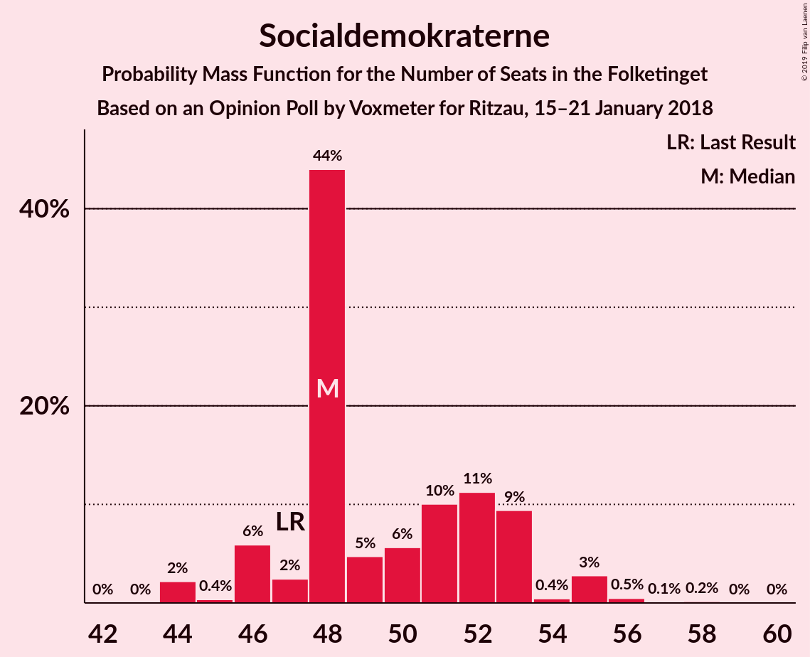
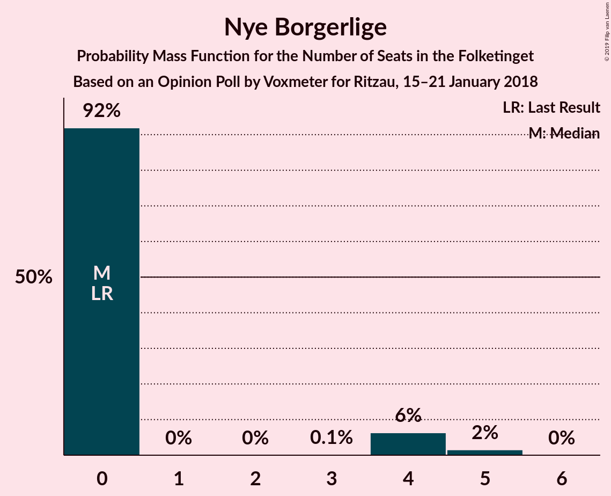

# Opinion Poll by Voxmeter for Ritzau, 15–21 January 2018

<a href="#voting-intentions">Voting Intentions</a> | <a href="#seats">Seats</a> | <a href="#coalitions">Coalitions</a> | <a href="#technical-information">Technical Information</a>

## Voting Intentions

### Confidence Intervals

| Party | Last Result | Poll Result | 80% Confidence Interval | 90% Confidence Interval | 95% Confidence Interval | 99% Confidence Interval |
|:-----:|:-----------:|:-----------:|:-----------------------:|:-----------------------:|:-----------------------:|:-----------------------:|
| Socialdemokraterne | 26.3% | 28.7% | 26.9–30.6% |26.4–31.1% |26.0–31.6% |25.1–32.4% |
| Venstre | 19.5% | 20.7% | 19.2–22.4% |18.7–22.9% |18.4–23.3% |17.6–24.2% |
| Dansk Folkeparti | 21.1% | 16.5% | 15.1–18.1% |14.7–18.5% |14.3–18.9% |13.7–19.7% |
| Enhedslisten–De Rød-Grønne | 7.8% | 8.9% | 7.9–10.2% |7.6–10.5% |7.3–10.9% |6.9–11.5% |
| Liberal Alliance | 7.5% | 5.1% | 4.3–6.1% |4.1–6.4% |3.9–6.6% |3.6–7.1% |
| Radikale Venstre | 4.6% | 5.0% | 4.2–6.0% |4.0–6.3% |3.8–6.5% |3.5–7.0% |
| Socialistisk Folkeparti | 4.2% | 4.9% | 4.1–5.9% |3.9–6.2% |3.7–6.4% |3.4–6.9% |
| Alternativet | 4.8% | 4.0% | 3.3–4.9% |3.1–5.2% |3.0–5.4% |2.7–5.9% |
| Det Konservative Folkeparti | 3.4% | 3.7% | 3.1–4.6% |2.9–4.9% |2.7–5.1% |2.4–5.5% |
| Nye Borgerlige | 0.0% | 1.7% | 1.2–2.3% |1.1–2.5% |1.0–2.7% |0.9–3.0% |
| Kristendemokraterne | 0.8% | 0.7% | 0.5–1.2% |0.4–1.3% |0.3–1.4% |0.2–1.7% |

*Note:* The poll result column reflects the actual value used in the calculations. Published results may vary slightly, and in addition be rounded to fewer digits.

## Seats

### Confidence Intervals

| Party | Last Result | Median | 80% Confidence Interval | 90% Confidence Interval | 95% Confidence Interval | 99% Confidence Interval |
|:-----:|:-----------:|:------:|:-----------------------:|:-----------------------:|:-----------------------:|:-----------------------:|
| <a href="#socialdemokraterne">Socialdemokraterne</a> | 47 | 53 | 49–53 |49–53 |47–55 |45–56 |
| <a href="#venstre">Venstre</a> | 34 | 36 | 34–39 |34–39 |33–39 |30–43 |
| <a href="#dansk-folkeparti">Dansk Folkeparti</a> | 37 | 27 | 26–28 |26–31 |26–35 |24–35 |
| <a href="#enhedslisten–de-rød-grønne">Enhedslisten–De Rød-Grønne</a> | 14 | 19 | 16–19 |14–19 |14–19 |13–20 |
| <a href="#liberal-alliance">Liberal Alliance</a> | 13 | 10 | 10–11 |8–12 |7–12 |6–13 |
| <a href="#radikale-venstre">Radikale Venstre</a> | 8 | 7 | 7–10 |7–10 |7–10 |6–12 |
| <a href="#socialistisk-folkeparti">Socialistisk Folkeparti</a> | 7 | 11 | 9–11 |9–11 |9–11 |8–12 |
| <a href="#alternativet">Alternativet</a> | 9 | 6 | 6–7 |6–9 |6–9 |5–11 |
| <a href="#det-konservative-folkeparti">Det Konservative Folkeparti</a> | 6 | 6 | 6–7 |5–9 |5–9 |5–9 |
| <a href="#nye-borgerlige">Nye Borgerlige</a> | 0 | 0 | 0 |0–4 |0–4 |0–5 |
| <a href="#kristendemokraterne">Kristendemokraterne</a> | 0 | 0 | 0 |0 |0 |0 |

### Socialdemokraterne

*For a full overview of the results for this party, see the [Socialdemokraterne](party-socialdemokraterne.html) page.*

| Number of Seats | Probability | Accumulated | Special Marks |
|:---------------:|:-----------:|:-----------:|:-------------:|
| 45 | 1.0% | 100% |  |
| 46 | 0.5% | 99.0% |  |
| 47 | 1.3% | 98.5% | Last Result |
| 48 | 0.5% | 97% |  |
| 49 | 28% | 97% |  |
| 50 | 9% | 68% |  |
| 51 | 1.5% | 59% |  |
| 52 | 2% | 58% |  |
| 53 | 51% | 56% | Median |
| 54 | 0.6% | 5% |  |
| 55 | 3% | 4% |  |
| 56 | 1.1% | 1.2% |  |
| 57 | 0% | 0.1% |  |
| 58 | 0% | 0.1% |  |
| 59 | 0% | 0% |  |

### Venstre

*For a full overview of the results for this party, see the [Venstre](party-venstre.html) page.*

| Number of Seats | Probability | Accumulated | Special Marks |
|:---------------:|:-----------:|:-----------:|:-------------:|
| 30 | 1.4% | 100% |  |
| 31 | 0.2% | 98.5% |  |
| 32 | 0.8% | 98% |  |
| 33 | 0.8% | 98% |  |
| 34 | 8% | 97% | Last Result |
| 35 | 0.6% | 89% |  |
| 36 | 52% | 88% | Median |
| 37 | 1.1% | 36% |  |
| 38 | 5% | 35% |  |
| 39 | 29% | 30% |  |
| 40 | 0.1% | 2% |  |
| 41 | 0.3% | 2% |  |
| 42 | 0.4% | 1.4% |  |
| 43 | 0.9% | 0.9% |  |
| 44 | 0% | 0.1% |  |
| 45 | 0% | 0% |  |

### Dansk Folkeparti

*For a full overview of the results for this party, see the [Dansk Folkeparti](party-danskfolkeparti.html) page.*

| Number of Seats | Probability | Accumulated | Special Marks |
|:---------------:|:-----------:|:-----------:|:-------------:|
| 22 | 0.1% | 100% |  |
| 23 | 0.2% | 99.9% |  |
| 24 | 0.5% | 99.8% |  |
| 25 | 0.8% | 99.3% |  |
| 26 | 36% | 98.5% |  |
| 27 | 51% | 63% | Median |
| 28 | 2% | 12% |  |
| 29 | 3% | 10% |  |
| 30 | 0.4% | 7% |  |
| 31 | 1.5% | 6% |  |
| 32 | 0.2% | 5% |  |
| 33 | 0.5% | 5% |  |
| 34 | 0.9% | 4% |  |
| 35 | 3% | 3% |  |
| 36 | 0% | 0.2% |  |
| 37 | 0% | 0.2% | Last Result |
| 38 | 0% | 0.2% |  |
| 39 | 0.2% | 0.2% |  |
| 40 | 0% | 0% |  |

### Enhedslisten–De Rød-Grønne

*For a full overview of the results for this party, see the [Enhedslisten–De Rød-Grønne](party-enhedslisten–derød-grønne.html) page.*

| Number of Seats | Probability | Accumulated | Special Marks |
|:---------------:|:-----------:|:-----------:|:-------------:|
| 11 | 0.1% | 100% |  |
| 12 | 0.4% | 99.9% |  |
| 13 | 2% | 99.5% |  |
| 14 | 4% | 98% | Last Result |
| 15 | 2% | 93% |  |
| 16 | 7% | 91% |  |
| 17 | 32% | 85% |  |
| 18 | 0.5% | 52% |  |
| 19 | 51% | 52% | Median |
| 20 | 1.1% | 1.2% |  |
| 21 | 0.1% | 0.1% |  |
| 22 | 0% | 0% |  |

### Liberal Alliance

*For a full overview of the results for this party, see the [Liberal Alliance](party-liberalalliance.html) page.*

| Number of Seats | Probability | Accumulated | Special Marks |
|:---------------:|:-----------:|:-----------:|:-------------:|
| 5 | 0.1% | 100% |  |
| 6 | 0.4% | 99.9% |  |
| 7 | 2% | 99.5% |  |
| 8 | 5% | 97% |  |
| 9 | 0.7% | 92% |  |
| 10 | 57% | 91% | Median |
| 11 | 28% | 34% |  |
| 12 | 4% | 6% |  |
| 13 | 2% | 2% | Last Result |
| 14 | 0.1% | 0.1% |  |
| 15 | 0% | 0% |  |

### Radikale Venstre

*For a full overview of the results for this party, see the [Radikale Venstre](party-radikalevenstre.html) page.*

| Number of Seats | Probability | Accumulated | Special Marks |
|:---------------:|:-----------:|:-----------:|:-------------:|
| 6 | 1.4% | 100% |  |
| 7 | 54% | 98.6% | Median |
| 8 | 2% | 45% | Last Result |
| 9 | 10% | 42% |  |
| 10 | 31% | 33% |  |
| 11 | 1.3% | 2% |  |
| 12 | 0.8% | 1.0% |  |
| 13 | 0.2% | 0.2% |  |
| 14 | 0% | 0% |  |

### Socialistisk Folkeparti

*For a full overview of the results for this party, see the [Socialistisk Folkeparti](party-socialistiskfolkeparti.html) page.*

| Number of Seats | Probability | Accumulated | Special Marks |
|:---------------:|:-----------:|:-----------:|:-------------:|
| 6 | 0.1% | 100% |  |
| 7 | 0.4% | 99.9% | Last Result |
| 8 | 2% | 99.5% |  |
| 9 | 30% | 98% |  |
| 10 | 15% | 67% |  |
| 11 | 51% | 52% | Median |
| 12 | 0.8% | 0.8% |  |
| 13 | 0% | 0% |  |

### Alternativet

*For a full overview of the results for this party, see the [Alternativet](party-alternativet.html) page.*

| Number of Seats | Probability | Accumulated | Special Marks |
|:---------------:|:-----------:|:-----------:|:-------------:|
| 4 | 0.2% | 100% |  |
| 5 | 2% | 99.8% |  |
| 6 | 55% | 98% | Median |
| 7 | 34% | 43% |  |
| 8 | 5% | 10% |  |
| 9 | 3% | 5% | Last Result |
| 10 | 1.0% | 2% |  |
| 11 | 0.7% | 0.9% |  |
| 12 | 0.2% | 0.2% |  |
| 13 | 0% | 0% |  |

### Det Konservative Folkeparti

*For a full overview of the results for this party, see the [Det Konservative Folkeparti](party-detkonservativefolkeparti.html) page.*

| Number of Seats | Probability | Accumulated | Special Marks |
|:---------------:|:-----------:|:-----------:|:-------------:|
| 4 | 0.1% | 100% |  |
| 5 | 5% | 99.9% |  |
| 6 | 56% | 94% | Last Result, Median |
| 7 | 31% | 38% |  |
| 8 | 1.3% | 8% |  |
| 9 | 6% | 7% |  |
| 10 | 0.2% | 0.2% |  |
| 11 | 0% | 0% |  |

### Nye Borgerlige

*For a full overview of the results for this party, see the [Nye Borgerlige](party-nyeborgerlige.html) page.*

| Number of Seats | Probability | Accumulated | Special Marks |
|:---------------:|:-----------:|:-----------:|:-------------:|
| 0 | 93% | 100% | Last Result, Median |
| 1 | 0% | 7% |  |
| 2 | 0% | 7% |  |
| 3 | 0.1% | 7% |  |
| 4 | 5% | 7% |  |
| 5 | 2% | 2% |  |
| 6 | 0% | 0.1% |  |
| 7 | 0% | 0% |  |

### Kristendemokraterne

*For a full overview of the results for this party, see the [Kristendemokraterne](party-kristendemokraterne.html) page.*

| Number of Seats | Probability | Accumulated | Special Marks |
|:---------------:|:-----------:|:-----------:|:-------------:|
| 0 | 100% | 100% | Last Result, Median |

## Coalitions

### Confidence Intervals

| Coalition | Last Result | Median | Majority? | 80% Confidence Interval | 90% Confidence Interval | 95% Confidence Interval | 99% Confidence Interval |
|:---------:|:-----------:|:------:|:---------:|:-----------------------:|:-----------------------:|:-----------------------:|:-----------------------:|
| Socialdemokraterne – Enhedslisten–De Rød-Grønne – Radikale Venstre – Socialistisk Folkeparti – Alternativet | 85 | 96 | 94% | 92–96 | 89–96 | 89–97 | 87–98 |
| Socialdemokraterne – Enhedslisten–De Rød-Grønne – Radikale Venstre – Socialistisk Folkeparti | 76 | 90 | 51% | 85–90 | 83–90 | 82–90 | 80–91 |
| Socialdemokraterne – Enhedslisten–De Rød-Grønne – Socialistisk Folkeparti – Alternativet | 77 | 89 | 3% | 82–89 | 80–89 | 80–90 | 76–90 |
| Venstre – Dansk Folkeparti – Liberal Alliance – Det Konservative Folkeparti – Nye Borgerlige – Kristendemokraterne | 90 | 79 | 0.3% | 79–83 | 79–86 | 78–86 | 77–88 |
| Venstre – Dansk Folkeparti – Liberal Alliance – Det Konservative Folkeparti – Nye Borgerlige | 90 | 79 | 0.3% | 79–83 | 79–86 | 78–86 | 77–88 |
| Venstre – Dansk Folkeparti – Liberal Alliance – Det Konservative Folkeparti – Kristendemokraterne | 90 | 79 | 0.2% | 79–83 | 78–83 | 77–84 | 76–88 |
| Venstre – Dansk Folkeparti – Liberal Alliance – Det Konservative Folkeparti | 90 | 79 | 0.2% | 79–83 | 78–83 | 77–84 | 76–88 |
| Socialdemokraterne – Enhedslisten–De Rød-Grønne – Socialistisk Folkeparti | 68 | 83 | 0% | 75–83 | 74–83 | 73–83 | 69–83 |
| Socialdemokraterne – Radikale Venstre – Socialistisk Folkeparti | 62 | 71 | 0% | 68–71 | 68–72 | 67–72 | 63–74 |
| Socialdemokraterne – Radikale Venstre | 55 | 60 | 0% | 59–60 | 59–62 | 57–62 | 53–64 |
| Venstre – Liberal Alliance – Det Konservative Folkeparti | 53 | 52 | 0% | 51–57 | 48–57 | 47–58 | 45–60 |
| Venstre – Det Konservative Folkeparti | 40 | 42 | 0% | 40–46 | 39–47 | 39–48 | 37–48 |
| Venstre | 34 | 36 | 0% | 34–39 | 34–39 | 33–39 | 30–43 |

### Socialdemokraterne – Enhedslisten–De Rød-Grønne – Radikale Venstre – Socialistisk Folkeparti – Alternativet

| Number of Seats | Probability | Accumulated | Special Marks |
|:---------------:|:-----------:|:-----------:|:-------------:|
| 84 | 0.2% | 100% |  |
| 85 | 0% | 99.8% | Last Result |
| 86 | 0.2% | 99.7% |  |
| 87 | 1.2% | 99.6% |  |
| 88 | 0.4% | 98% |  |
| 89 | 4% | 98% |  |
| 90 | 0.1% | 94% | Majority |
| 91 | 2% | 94% |  |
| 92 | 31% | 92% |  |
| 93 | 2% | 61% |  |
| 94 | 2% | 59% |  |
| 95 | 0.7% | 57% |  |
| 96 | 52% | 56% | Median |
| 97 | 3% | 4% |  |
| 98 | 0.9% | 1.0% |  |
| 99 | 0% | 0.1% |  |
| 100 | 0% | 0.1% |  |
| 101 | 0% | 0% |  |

### Socialdemokraterne – Enhedslisten–De Rød-Grønne – Radikale Venstre – Socialistisk Folkeparti

| Number of Seats | Probability | Accumulated | Special Marks |
|:---------------:|:-----------:|:-----------:|:-------------:|
| 76 | 0.2% | 100% | Last Result |
| 77 | 0.1% | 99.8% |  |
| 78 | 0.1% | 99.7% |  |
| 79 | 0.1% | 99.6% |  |
| 80 | 1.1% | 99.6% |  |
| 81 | 0.4% | 98% |  |
| 82 | 0.6% | 98% |  |
| 83 | 5% | 97% |  |
| 84 | 0.4% | 92% |  |
| 85 | 33% | 92% |  |
| 86 | 1.1% | 58% |  |
| 87 | 2% | 57% |  |
| 88 | 0.5% | 55% |  |
| 89 | 4% | 55% |  |
| 90 | 51% | 51% | Median, Majority |
| 91 | 0.6% | 0.8% |  |
| 92 | 0.1% | 0.1% |  |
| 93 | 0% | 0.1% |  |
| 94 | 0% | 0% |  |

### Socialdemokraterne – Enhedslisten–De Rød-Grønne – Socialistisk Folkeparti – Alternativet

| Number of Seats | Probability | Accumulated | Special Marks |
|:---------------:|:-----------:|:-----------:|:-------------:|
| 74 | 0.1% | 100% |  |
| 75 | 0.3% | 99.9% |  |
| 76 | 0.5% | 99.6% |  |
| 77 | 0.1% | 99.1% | Last Result |
| 78 | 0.2% | 99.0% |  |
| 79 | 1.0% | 98.9% |  |
| 80 | 3% | 98% |  |
| 81 | 1.1% | 94% |  |
| 82 | 27% | 93% |  |
| 83 | 6% | 66% |  |
| 84 | 2% | 60% |  |
| 85 | 0.2% | 58% |  |
| 86 | 2% | 58% |  |
| 87 | 0.7% | 56% |  |
| 88 | 1.1% | 55% |  |
| 89 | 51% | 54% | Median |
| 90 | 3% | 3% | Majority |
| 91 | 0.3% | 0.3% |  |
| 92 | 0% | 0% |  |

### Venstre – Dansk Folkeparti – Liberal Alliance – Det Konservative Folkeparti – Nye Borgerlige – Kristendemokraterne

| Number of Seats | Probability | Accumulated | Special Marks |
|:---------------:|:-----------:|:-----------:|:-------------:|
| 75 | 0% | 100% |  |
| 76 | 0% | 99.9% |  |
| 77 | 0.9% | 99.9% |  |
| 78 | 3% | 99.0% |  |
| 79 | 52% | 96% | Median |
| 80 | 0.7% | 44% |  |
| 81 | 2% | 43% |  |
| 82 | 2% | 41% |  |
| 83 | 31% | 39% |  |
| 84 | 2% | 8% |  |
| 85 | 0.1% | 6% |  |
| 86 | 4% | 6% |  |
| 87 | 0.4% | 2% |  |
| 88 | 1.2% | 2% |  |
| 89 | 0.2% | 0.4% |  |
| 90 | 0% | 0.3% | Last Result, Majority |
| 91 | 0.2% | 0.2% |  |
| 92 | 0% | 0% |  |

### Venstre – Dansk Folkeparti – Liberal Alliance – Det Konservative Folkeparti – Nye Borgerlige

| Number of Seats | Probability | Accumulated | Special Marks |
|:---------------:|:-----------:|:-----------:|:-------------:|
| 75 | 0% | 100% |  |
| 76 | 0.1% | 99.9% |  |
| 77 | 0.9% | 99.9% |  |
| 78 | 3% | 99.0% |  |
| 79 | 52% | 96% | Median |
| 80 | 0.7% | 44% |  |
| 81 | 2% | 43% |  |
| 82 | 2% | 41% |  |
| 83 | 31% | 39% |  |
| 84 | 2% | 8% |  |
| 85 | 0.1% | 6% |  |
| 86 | 4% | 6% |  |
| 87 | 0.4% | 2% |  |
| 88 | 1.2% | 2% |  |
| 89 | 0.2% | 0.4% |  |
| 90 | 0% | 0.3% | Last Result, Majority |
| 91 | 0.2% | 0.2% |  |
| 92 | 0% | 0% |  |

### Venstre – Dansk Folkeparti – Liberal Alliance – Det Konservative Folkeparti – Kristendemokraterne

| Number of Seats | Probability | Accumulated | Special Marks |
|:---------------:|:-----------:|:-----------:|:-------------:|
| 73 | 0.1% | 100% |  |
| 74 | 0% | 99.9% |  |
| 75 | 0% | 99.8% |  |
| 76 | 0.6% | 99.8% |  |
| 77 | 2% | 99.2% |  |
| 78 | 3% | 97% |  |
| 79 | 52% | 94% | Median |
| 80 | 0.2% | 42% |  |
| 81 | 2% | 41% |  |
| 82 | 4% | 39% |  |
| 83 | 32% | 35% |  |
| 84 | 2% | 3% |  |
| 85 | 0.2% | 2% |  |
| 86 | 0.3% | 2% |  |
| 87 | 0% | 1.4% |  |
| 88 | 1.1% | 1.4% |  |
| 89 | 0.1% | 0.2% |  |
| 90 | 0% | 0.2% | Last Result, Majority |
| 91 | 0.2% | 0.2% |  |
| 92 | 0% | 0% |  |

### Venstre – Dansk Folkeparti – Liberal Alliance – Det Konservative Folkeparti

| Number of Seats | Probability | Accumulated | Special Marks |
|:---------------:|:-----------:|:-----------:|:-------------:|
| 73 | 0.1% | 100% |  |
| 74 | 0% | 99.9% |  |
| 75 | 0% | 99.8% |  |
| 76 | 0.6% | 99.8% |  |
| 77 | 2% | 99.2% |  |
| 78 | 3% | 97% |  |
| 79 | 52% | 94% | Median |
| 80 | 0.2% | 42% |  |
| 81 | 2% | 41% |  |
| 82 | 4% | 39% |  |
| 83 | 32% | 35% |  |
| 84 | 2% | 3% |  |
| 85 | 0.2% | 2% |  |
| 86 | 0.3% | 2% |  |
| 87 | 0% | 1.4% |  |
| 88 | 1.1% | 1.4% |  |
| 89 | 0.1% | 0.2% |  |
| 90 | 0% | 0.2% | Last Result, Majority |
| 91 | 0.2% | 0.2% |  |
| 92 | 0% | 0% |  |

### Socialdemokraterne – Enhedslisten–De Rød-Grønne – Socialistisk Folkeparti

| Number of Seats | Probability | Accumulated | Special Marks |
|:---------------:|:-----------:|:-----------:|:-------------:|
| 68 | 0.4% | 100% | Last Result |
| 69 | 0.3% | 99.5% |  |
| 70 | 0.3% | 99.2% |  |
| 71 | 0.1% | 98.9% |  |
| 72 | 1.2% | 98.9% |  |
| 73 | 0.3% | 98% |  |
| 74 | 5% | 97% |  |
| 75 | 28% | 92% |  |
| 76 | 5% | 64% |  |
| 77 | 2% | 59% |  |
| 78 | 0.3% | 57% |  |
| 79 | 2% | 56% |  |
| 80 | 1.0% | 55% |  |
| 81 | 0.2% | 54% |  |
| 82 | 3% | 54% |  |
| 83 | 50% | 50% | Median |
| 84 | 0% | 0.1% |  |
| 85 | 0% | 0% |  |

### Socialdemokraterne – Radikale Venstre – Socialistisk Folkeparti

| Number of Seats | Probability | Accumulated | Special Marks |
|:---------------:|:-----------:|:-----------:|:-------------:|
| 61 | 0.2% | 100% |  |
| 62 | 0% | 99.8% | Last Result |
| 63 | 1.1% | 99.8% |  |
| 64 | 0.1% | 98.7% |  |
| 65 | 0.2% | 98.7% |  |
| 66 | 0.2% | 98% |  |
| 67 | 1.4% | 98% |  |
| 68 | 28% | 97% |  |
| 69 | 9% | 69% |  |
| 70 | 3% | 60% |  |
| 71 | 51% | 57% | Median |
| 72 | 5% | 6% |  |
| 73 | 0.1% | 0.7% |  |
| 74 | 0.5% | 0.5% |  |
| 75 | 0% | 0% |  |

### Socialdemokraterne – Radikale Venstre

| Number of Seats | Probability | Accumulated | Special Marks |
|:---------------:|:-----------:|:-----------:|:-------------:|
| 53 | 0.9% | 100% |  |
| 54 | 0.2% | 99.1% |  |
| 55 | 0.9% | 98.9% | Last Result |
| 56 | 0.4% | 98% |  |
| 57 | 0.3% | 98% |  |
| 58 | 1.5% | 97% |  |
| 59 | 35% | 96% |  |
| 60 | 53% | 61% | Median |
| 61 | 2% | 8% |  |
| 62 | 5% | 7% |  |
| 63 | 1.4% | 2% |  |
| 64 | 0.1% | 0.5% |  |
| 65 | 0.4% | 0.5% |  |
| 66 | 0.1% | 0.1% |  |
| 67 | 0% | 0% |  |

### Venstre – Liberal Alliance – Det Konservative Folkeparti

| Number of Seats | Probability | Accumulated | Special Marks |
|:---------------:|:-----------:|:-----------:|:-------------:|
| 43 | 0.1% | 100% |  |
| 44 | 0.4% | 99.9% |  |
| 45 | 0% | 99.5% |  |
| 46 | 0% | 99.5% |  |
| 47 | 4% | 99.5% |  |
| 48 | 1.4% | 95% |  |
| 49 | 0.4% | 94% |  |
| 50 | 3% | 94% |  |
| 51 | 0.7% | 90% |  |
| 52 | 54% | 90% | Median |
| 53 | 0.3% | 36% | Last Result |
| 54 | 0.4% | 36% |  |
| 55 | 0.6% | 35% |  |
| 56 | 0.2% | 35% |  |
| 57 | 32% | 35% |  |
| 58 | 1.5% | 3% |  |
| 59 | 0.6% | 1.5% |  |
| 60 | 0.9% | 0.9% |  |
| 61 | 0% | 0% |  |

### Venstre – Det Konservative Folkeparti

| Number of Seats | Probability | Accumulated | Special Marks |
|:---------------:|:-----------:|:-----------:|:-------------:|
| 36 | 0.1% | 100% |  |
| 37 | 2% | 99.8% |  |
| 38 | 0% | 98% |  |
| 39 | 3% | 98% |  |
| 40 | 5% | 94% | Last Result |
| 41 | 0.6% | 89% |  |
| 42 | 51% | 89% | Median |
| 43 | 2% | 38% |  |
| 44 | 0.2% | 36% |  |
| 45 | 0.2% | 36% |  |
| 46 | 28% | 36% |  |
| 47 | 5% | 7% |  |
| 48 | 3% | 3% |  |
| 49 | 0% | 0.1% |  |
| 50 | 0% | 0% |  |

### Venstre

| Number of Seats | Probability | Accumulated | Special Marks |
|:---------------:|:-----------:|:-----------:|:-------------:|
| 30 | 1.4% | 100% |  |
| 31 | 0.2% | 98.5% |  |
| 32 | 0.8% | 98% |  |
| 33 | 0.8% | 98% |  |
| 34 | 8% | 97% | Last Result |
| 35 | 0.6% | 89% |  |
| 36 | 52% | 88% | Median |
| 37 | 1.1% | 36% |  |
| 38 | 5% | 35% |  |
| 39 | 29% | 30% |  |
| 40 | 0.1% | 2% |  |
| 41 | 0.3% | 2% |  |
| 42 | 0.4% | 1.4% |  |
| 43 | 0.9% | 0.9% |  |
| 44 | 0% | 0.1% |  |
| 45 | 0% | 0% |  |

## Technical Information

### Opinion Poll

+ **Polling firm:** Voxmeter
+ **Commissioner(s):** Ritzau
+ **Fieldwork period:** 15–21 January 2018

### Calculations

+ **Sample size:** 1018
+ **Simulations done:** 131,072
+ **Error estimate:** 2.09%

