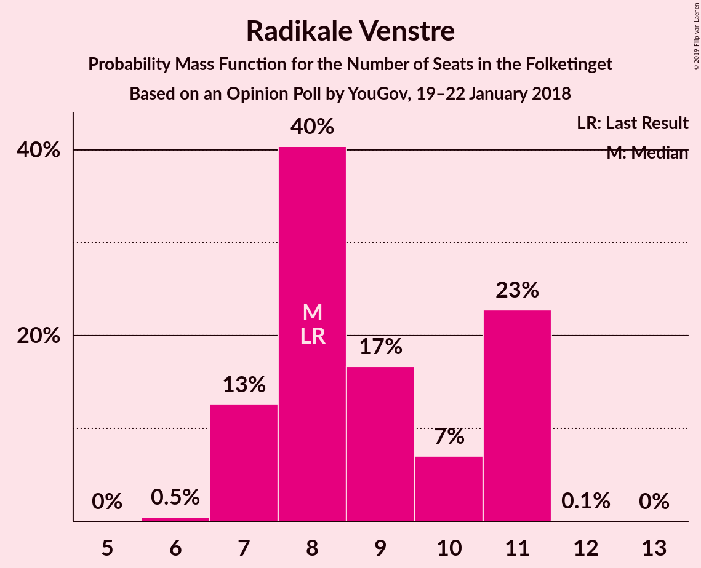
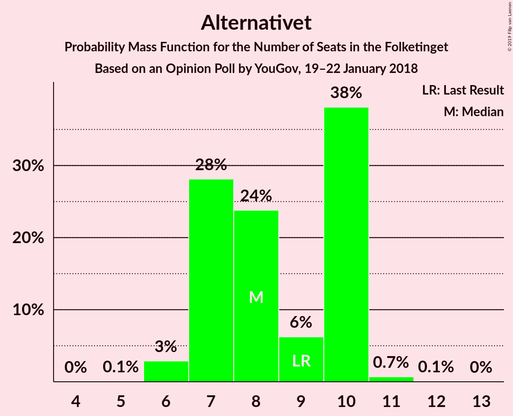

# Opinion Poll by YouGov, 19–22 January 2018

<a href="#voting-intentions">Voting Intentions</a> | <a href="#seats">Seats</a> | <a href="#coalitions">Coalitions</a> | <a href="#technical-information">Technical Information</a>

## Voting Intentions

### Confidence Intervals

| Party | Last Result | Poll Result | 80% Confidence Interval | 90% Confidence Interval | 95% Confidence Interval | 99% Confidence Interval |
|:-----:|:-----------:|:-----------:|:-----------------------:|:-----------------------:|:-----------------------:|:-----------------------:|
| Socialdemokraterne | 26.3% | 28.1% | 26.6–29.6% |26.2–30.1% |25.8–30.5% |25.1–31.2% |
| Venstre | 19.5% | 19.7% | 18.4–21.1% |18.1–21.5% |17.8–21.9% |17.2–22.5% |
| Dansk Folkeparti | 21.1% | 17.0% | 15.8–18.3% |15.4–18.7% |15.1–19.0% |14.6–19.6% |
| Enhedslisten–De Rød-Grønne | 7.8% | 8.6% | 7.7–9.6% |7.5–9.9% |7.3–10.2% |6.9–10.7% |
| Det Konservative Folkeparti | 3.4% | 4.9% | 4.3–5.7% |4.1–6.0% |3.9–6.2% |3.6–6.6% |
| Radikale Venstre | 4.6% | 4.8% | 4.1–5.6% |4.0–5.8% |3.8–6.0% |3.5–6.4% |
| Liberal Alliance | 7.5% | 4.7% | 4.1–5.5% |3.9–5.7% |3.7–5.9% |3.5–6.3% |
| Socialistisk Folkeparti | 4.2% | 4.7% | 4.1–5.5% |3.9–5.7% |3.7–5.9% |3.5–6.3% |
| Alternativet | 4.8% | 4.5% | 3.9–5.3% |3.7–5.5% |3.6–5.7% |3.3–6.1% |
| Nye Borgerlige | 0.0% | 2.3% | 1.9–2.9% |1.8–3.1% |1.7–3.2% |1.5–3.6% |
| Kristendemokraterne | 0.8% | 0.7% | 0.5–1.1% |0.4–1.2% |0.4–1.3% |0.3–1.5% |

*Note:* The poll result column reflects the actual value used in the calculations. Published results may vary slightly, and in addition be rounded to fewer digits.

## Seats

### Confidence Intervals

| Party | Last Result | Median | 80% Confidence Interval | 90% Confidence Interval | 95% Confidence Interval | 99% Confidence Interval |
|:-----:|:-----------:|:------:|:-----------------------:|:-----------------------:|:-----------------------:|:-----------------------:|
| <a href="#socialdemokraterne">Socialdemokraterne</a> | 47 | 47 | 45–52 |45–53 |45–53 |45–53 |
| <a href="#venstre">Venstre</a> | 34 | 38 | 35–38 |31–38 |31–38 |31–38 |
| <a href="#dansk-folkeparti">Dansk Folkeparti</a> | 37 | 29 | 29–31 |27–31 |27–33 |27–34 |
| <a href="#enhedslisten–de-rød-grønne">Enhedslisten–De Rød-Grønne</a> | 14 | 14 | 14–15 |14–17 |14–17 |13–18 |
| <a href="#det-konservative-folkeparti">Det Konservative Folkeparti</a> | 6 | 9 | 9–10 |9–10 |8–10 |7–11 |
| <a href="#radikale-venstre">Radikale Venstre</a> | 8 | 7 | 7–9 |7–9 |7–9 |7–10 |
| <a href="#liberal-alliance">Liberal Alliance</a> | 13 | 9 | 7–9 |7–9 |7–9 |6–10 |
| <a href="#socialistisk-folkeparti">Socialistisk Folkeparti</a> | 7 | 9 | 9 |7–11 |7–11 |6–11 |
| <a href="#alternativet">Alternativet</a> | 9 | 8 | 7–8 |6–9 |6–9 |6–10 |
| <a href="#nye-borgerlige">Nye Borgerlige</a> | 0 | 5 | 4–5 |4–5 |4–5 |4–5 |
| <a href="#kristendemokraterne">Kristendemokraterne</a> | 0 | 0 | 0 |0 |0 |0 |

### Socialdemokraterne

*For a full overview of the results for this party, see the [Socialdemokraterne](party-socialdemokraterne.html) page.*

| Number of Seats | Probability | Accumulated | Special Marks |
|:---------------:|:-----------:|:-----------:|:-------------:|
| 44 | 0% | 100% |  |
| 45 | 27% | 99.9% |  |
| 46 | 0.4% | 73% |  |
| 47 | 58% | 72% | Last Result, Median |
| 48 | 0.2% | 14% |  |
| 49 | 0.2% | 14% |  |
| 50 | 2% | 14% |  |
| 51 | 0.3% | 12% |  |
| 52 | 6% | 11% |  |
| 53 | 5% | 5% |  |
| 54 | 0% | 0.1% |  |
| 55 | 0% | 0.1% |  |
| 56 | 0.1% | 0.1% |  |
| 57 | 0% | 0% |  |

### Venstre

*For a full overview of the results for this party, see the [Venstre](party-venstre.html) page.*

| Number of Seats | Probability | Accumulated | Special Marks |
|:---------------:|:-----------:|:-----------:|:-------------:|
| 31 | 5% | 100% |  |
| 32 | 0.4% | 95% |  |
| 33 | 0.2% | 94% |  |
| 34 | 0.5% | 94% | Last Result |
| 35 | 6% | 94% |  |
| 36 | 28% | 88% |  |
| 37 | 2% | 60% |  |
| 38 | 57% | 58% | Median |
| 39 | 0.4% | 0.4% |  |
| 40 | 0% | 0% |  |

### Dansk Folkeparti

*For a full overview of the results for this party, see the [Dansk Folkeparti](party-danskfolkeparti.html) page.*

| Number of Seats | Probability | Accumulated | Special Marks |
|:---------------:|:-----------:|:-----------:|:-------------:|
| 27 | 7% | 100% |  |
| 28 | 0.2% | 93% |  |
| 29 | 63% | 93% | Median |
| 30 | 2% | 30% |  |
| 31 | 26% | 29% |  |
| 32 | 0.1% | 3% |  |
| 33 | 0.7% | 3% |  |
| 34 | 2% | 2% |  |
| 35 | 0.2% | 0.2% |  |
| 36 | 0% | 0% |  |
| 37 | 0% | 0% | Last Result |

### Enhedslisten–De Rød-Grønne

*For a full overview of the results for this party, see the [Enhedslisten–De Rød-Grønne](party-enhedslisten–derød-grønne.html) page.*

| Number of Seats | Probability | Accumulated | Special Marks |
|:---------------:|:-----------:|:-----------:|:-------------:|
| 12 | 0.5% | 100% |  |
| 13 | 0.4% | 99.5% |  |
| 14 | 59% | 99.1% | Last Result, Median |
| 15 | 34% | 40% |  |
| 16 | 0.6% | 6% |  |
| 17 | 5% | 6% |  |
| 18 | 0% | 0.5% |  |
| 19 | 0.5% | 0.5% |  |
| 20 | 0% | 0% |  |

### Det Konservative Folkeparti

*For a full overview of the results for this party, see the [Det Konservative Folkeparti](party-detkonservativefolkeparti.html) page.*

| Number of Seats | Probability | Accumulated | Special Marks |
|:---------------:|:-----------:|:-----------:|:-------------:|
| 6 | 0.1% | 100% | Last Result |
| 7 | 2% | 99.9% |  |
| 8 | 2% | 98% |  |
| 9 | 69% | 96% | Median |
| 10 | 26% | 27% |  |
| 11 | 1.0% | 1.1% |  |
| 12 | 0.1% | 0.1% |  |
| 13 | 0% | 0% |  |

### Radikale Venstre

*For a full overview of the results for this party, see the [Radikale Venstre](party-radikalevenstre.html) page.*

| Number of Seats | Probability | Accumulated | Special Marks |
|:---------------:|:-----------:|:-----------:|:-------------:|
| 6 | 0.1% | 100% |  |
| 7 | 58% | 99.9% | Median |
| 8 | 8% | 42% | Last Result |
| 9 | 32% | 34% |  |
| 10 | 2% | 2% |  |
| 11 | 0.2% | 0.3% |  |
| 12 | 0% | 0% |  |

### Liberal Alliance

*For a full overview of the results for this party, see the [Liberal Alliance](party-liberalalliance.html) page.*

| Number of Seats | Probability | Accumulated | Special Marks |
|:---------------:|:-----------:|:-----------:|:-------------:|
| 6 | 2% | 100% |  |
| 7 | 12% | 98% |  |
| 8 | 2% | 86% |  |
| 9 | 84% | 84% | Median |
| 10 | 0.5% | 0.8% |  |
| 11 | 0.1% | 0.3% |  |
| 12 | 0.2% | 0.2% |  |
| 13 | 0% | 0% | Last Result |

### Socialistisk Folkeparti

*For a full overview of the results for this party, see the [Socialistisk Folkeparti](party-socialistiskfolkeparti.html) page.*

| Number of Seats | Probability | Accumulated | Special Marks |
|:---------------:|:-----------:|:-----------:|:-------------:|
| 6 | 2% | 100% |  |
| 7 | 7% | 98% | Last Result |
| 8 | 0.6% | 91% |  |
| 9 | 83% | 90% | Median |
| 10 | 2% | 7% |  |
| 11 | 5% | 5% |  |
| 12 | 0% | 0% |  |

### Alternativet

*For a full overview of the results for this party, see the [Alternativet](party-alternativet.html) page.*

| Number of Seats | Probability | Accumulated | Special Marks |
|:---------------:|:-----------:|:-----------:|:-------------:|
| 6 | 6% | 100% |  |
| 7 | 26% | 94% |  |
| 8 | 60% | 68% | Median |
| 9 | 7% | 9% | Last Result |
| 10 | 2% | 2% |  |
| 11 | 0.1% | 0.1% |  |
| 12 | 0% | 0% |  |

### Nye Borgerlige

*For a full overview of the results for this party, see the [Nye Borgerlige](party-nyeborgerlige.html) page.*

| Number of Seats | Probability | Accumulated | Special Marks |
|:---------------:|:-----------:|:-----------:|:-------------:|
| 0 | 0.3% | 100% | Last Result |
| 1 | 0% | 99.7% |  |
| 2 | 0% | 99.7% |  |
| 3 | 0% | 99.7% |  |
| 4 | 35% | 99.7% |  |
| 5 | 64% | 65% | Median |
| 6 | 0.1% | 0.1% |  |
| 7 | 0% | 0% |  |

### Kristendemokraterne

*For a full overview of the results for this party, see the [Kristendemokraterne](party-kristendemokraterne.html) page.*

| Number of Seats | Probability | Accumulated | Special Marks |
|:---------------:|:-----------:|:-----------:|:-------------:|
| 0 | 100% | 100% | Last Result, Median |

## Coalitions

### Confidence Intervals

| Coalition | Last Result | Median | Majority? | 80% Confidence Interval | 90% Confidence Interval | 95% Confidence Interval | 99% Confidence Interval |
|:---------:|:-----------:|:------:|:---------:|:-----------------------:|:-----------------------:|:-----------------------:|:-----------------------:|
| Socialdemokraterne – Enhedslisten–De Rød-Grønne – Radikale Venstre – Socialistisk Folkeparti – Alternativet | 85 | 85 | 12% | 85–92 | 85–95 | 85–95 | 84–95 |
| Venstre – Dansk Folkeparti – Det Konservative Folkeparti – Liberal Alliance – Nye Borgerlige – Kristendemokraterne | 90 | 90 | 84% | 83–90 | 80–90 | 80–90 | 80–91 |
| Venstre – Dansk Folkeparti – Det Konservative Folkeparti – Liberal Alliance – Nye Borgerlige | 90 | 90 | 84% | 83–90 | 80–90 | 80–90 | 80–91 |
| Socialdemokraterne – Enhedslisten–De Rød-Grønne – Radikale Venstre – Socialistisk Folkeparti | 76 | 77 | 0% | 77–83 | 77–89 | 77–89 | 76–89 |
| Socialdemokraterne – Enhedslisten–De Rød-Grønne – Socialistisk Folkeparti – Alternativet | 77 | 78 | 0% | 76–83 | 76–87 | 76–87 | 76–87 |
| Venstre – Dansk Folkeparti – Det Konservative Folkeparti – Liberal Alliance – Kristendemokraterne | 90 | 85 | 0% | 78–86 | 76–86 | 76–86 | 76–86 |
| Venstre – Dansk Folkeparti – Det Konservative Folkeparti – Liberal Alliance | 90 | 85 | 0% | 78–86 | 76–86 | 76–86 | 76–86 |
| Socialdemokraterne – Enhedslisten–De Rød-Grønne – Socialistisk Folkeparti | 68 | 70 | 0% | 69–74 | 69–81 | 69–81 | 68–81 |
| Socialdemokraterne – Radikale Venstre – Socialistisk Folkeparti | 62 | 63 | 0% | 63–68 | 63–72 | 63–72 | 62–72 |
| Socialdemokraterne – Radikale Venstre | 55 | 54 | 0% | 54–61 | 54–61 | 54–61 | 53–61 |
| Venstre – Det Konservative Folkeparti – Liberal Alliance | 53 | 56 | 0% | 51–56 | 47–56 | 47–56 | 47–58 |
| Venstre – Det Konservative Folkeparti | 40 | 47 | 0% | 44–47 | 40–47 | 40–47 | 40–49 |
| Venstre | 34 | 38 | 0% | 35–38 | 31–38 | 31–38 | 31–38 |

### Socialdemokraterne – Enhedslisten–De Rød-Grønne – Radikale Venstre – Socialistisk Folkeparti – Alternativet

| Number of Seats | Probability | Accumulated | Special Marks |
|:---------------:|:-----------:|:-----------:|:-------------:|
| 84 | 0.8% | 100% |  |
| 85 | 83% | 99.1% | Last Result, Median |
| 86 | 0.3% | 16% |  |
| 87 | 0.1% | 16% |  |
| 88 | 3% | 16% |  |
| 89 | 0.7% | 12% |  |
| 90 | 0.1% | 12% | Majority |
| 91 | 0.1% | 11% |  |
| 92 | 6% | 11% |  |
| 93 | 0.1% | 5% |  |
| 94 | 0% | 5% |  |
| 95 | 5% | 5% |  |
| 96 | 0% | 0% |  |

### Venstre – Dansk Folkeparti – Det Konservative Folkeparti – Liberal Alliance – Nye Borgerlige – Kristendemokraterne

| Number of Seats | Probability | Accumulated | Special Marks |
|:---------------:|:-----------:|:-----------:|:-------------:|
| 80 | 5% | 100% |  |
| 81 | 0% | 95% |  |
| 82 | 0.1% | 95% |  |
| 83 | 6% | 95% |  |
| 84 | 0.1% | 89% |  |
| 85 | 0.1% | 89% |  |
| 86 | 0.7% | 88% |  |
| 87 | 3% | 88% |  |
| 88 | 0.1% | 84% |  |
| 89 | 0.3% | 84% |  |
| 90 | 83% | 84% | Last Result, Median, Majority |
| 91 | 0.8% | 0.9% |  |
| 92 | 0% | 0% |  |

### Venstre – Dansk Folkeparti – Det Konservative Folkeparti – Liberal Alliance – Nye Borgerlige

| Number of Seats | Probability | Accumulated | Special Marks |
|:---------------:|:-----------:|:-----------:|:-------------:|
| 80 | 5% | 100% |  |
| 81 | 0% | 95% |  |
| 82 | 0.1% | 95% |  |
| 83 | 6% | 95% |  |
| 84 | 0.1% | 89% |  |
| 85 | 0.1% | 89% |  |
| 86 | 0.7% | 88% |  |
| 87 | 3% | 88% |  |
| 88 | 0.1% | 84% |  |
| 89 | 0.3% | 84% |  |
| 90 | 83% | 84% | Last Result, Median, Majority |
| 91 | 0.8% | 0.9% |  |
| 92 | 0% | 0% |  |

### Socialdemokraterne – Enhedslisten–De Rød-Grønne – Radikale Venstre – Socialistisk Folkeparti

| Number of Seats | Probability | Accumulated | Special Marks |
|:---------------:|:-----------:|:-----------:|:-------------:|
| 75 | 0.4% | 100% |  |
| 76 | 0.1% | 99.6% | Last Result |
| 77 | 58% | 99.5% | Median |
| 78 | 28% | 42% |  |
| 79 | 0.2% | 14% |  |
| 80 | 2% | 14% |  |
| 81 | 0.5% | 12% |  |
| 82 | 0.3% | 12% |  |
| 83 | 6% | 11% |  |
| 84 | 0.2% | 6% |  |
| 85 | 0.1% | 5% |  |
| 86 | 0.1% | 5% |  |
| 87 | 0% | 5% |  |
| 88 | 0% | 5% |  |
| 89 | 5% | 5% |  |
| 90 | 0% | 0% | Majority |

### Socialdemokraterne – Enhedslisten–De Rød-Grønne – Socialistisk Folkeparti – Alternativet

| Number of Seats | Probability | Accumulated | Special Marks |
|:---------------:|:-----------:|:-----------:|:-------------:|
| 75 | 0.3% | 100% |  |
| 76 | 26% | 99.6% |  |
| 77 | 0.4% | 74% | Last Result |
| 78 | 59% | 74% | Median |
| 79 | 0.4% | 14% |  |
| 80 | 2% | 14% |  |
| 81 | 0.6% | 12% |  |
| 82 | 0.3% | 11% |  |
| 83 | 6% | 11% |  |
| 84 | 0% | 5% |  |
| 85 | 0.1% | 5% |  |
| 86 | 0% | 5% |  |
| 87 | 5% | 5% |  |
| 88 | 0% | 0% |  |

### Venstre – Dansk Folkeparti – Det Konservative Folkeparti – Liberal Alliance – Kristendemokraterne

| Number of Seats | Probability | Accumulated | Special Marks |
|:---------------:|:-----------:|:-----------:|:-------------:|
| 76 | 5% | 100% |  |
| 77 | 0% | 95% |  |
| 78 | 6% | 95% |  |
| 79 | 0.2% | 89% |  |
| 80 | 0.1% | 89% |  |
| 81 | 0.1% | 89% |  |
| 82 | 0.7% | 88% |  |
| 83 | 3% | 88% |  |
| 84 | 0.3% | 84% |  |
| 85 | 57% | 84% | Median |
| 86 | 27% | 27% |  |
| 87 | 0.1% | 0.1% |  |
| 88 | 0% | 0% |  |
| 89 | 0% | 0% |  |
| 90 | 0% | 0% | Last Result, Majority |

### Venstre – Dansk Folkeparti – Det Konservative Folkeparti – Liberal Alliance

| Number of Seats | Probability | Accumulated | Special Marks |
|:---------------:|:-----------:|:-----------:|:-------------:|
| 76 | 5% | 100% |  |
| 77 | 0% | 95% |  |
| 78 | 6% | 95% |  |
| 79 | 0.2% | 89% |  |
| 80 | 0.1% | 89% |  |
| 81 | 0.1% | 89% |  |
| 82 | 0.7% | 88% |  |
| 83 | 3% | 88% |  |
| 84 | 0.3% | 84% |  |
| 85 | 57% | 84% | Median |
| 86 | 27% | 27% |  |
| 87 | 0.1% | 0.1% |  |
| 88 | 0% | 0% |  |
| 89 | 0% | 0% |  |
| 90 | 0% | 0% | Last Result, Majority |

### Socialdemokraterne – Enhedslisten–De Rød-Grønne – Socialistisk Folkeparti

| Number of Seats | Probability | Accumulated | Special Marks |
|:---------------:|:-----------:|:-----------:|:-------------:|
| 66 | 0.4% | 100% |  |
| 67 | 0% | 99.6% |  |
| 68 | 0.1% | 99.6% | Last Result |
| 69 | 26% | 99.5% |  |
| 70 | 61% | 74% | Median |
| 71 | 0.5% | 13% |  |
| 72 | 0.1% | 12% |  |
| 73 | 0.7% | 12% |  |
| 74 | 6% | 12% |  |
| 75 | 0% | 5% |  |
| 76 | 0.1% | 5% |  |
| 77 | 0% | 5% |  |
| 78 | 0.1% | 5% |  |
| 79 | 0% | 5% |  |
| 80 | 0% | 5% |  |
| 81 | 5% | 5% |  |
| 82 | 0% | 0% |  |

### Socialdemokraterne – Radikale Venstre – Socialistisk Folkeparti

| Number of Seats | Probability | Accumulated | Special Marks |
|:---------------:|:-----------:|:-----------:|:-------------:|
| 60 | 0% | 100% |  |
| 61 | 0.4% | 99.9% |  |
| 62 | 0.4% | 99.6% | Last Result |
| 63 | 85% | 99.2% | Median |
| 64 | 0.4% | 14% |  |
| 65 | 0.4% | 14% |  |
| 66 | 2% | 13% |  |
| 67 | 0.2% | 12% |  |
| 68 | 6% | 12% |  |
| 69 | 0.1% | 5% |  |
| 70 | 0.1% | 5% |  |
| 71 | 0% | 5% |  |
| 72 | 5% | 5% |  |
| 73 | 0% | 0.1% |  |
| 74 | 0% | 0% |  |

### Socialdemokraterne – Radikale Venstre

| Number of Seats | Probability | Accumulated | Special Marks |
|:---------------:|:-----------:|:-----------:|:-------------:|
| 52 | 0% | 100% |  |
| 53 | 2% | 99.9% |  |
| 54 | 83% | 98% | Median |
| 55 | 1.0% | 15% | Last Result |
| 56 | 0% | 14% |  |
| 57 | 0.3% | 14% |  |
| 58 | 0.1% | 14% |  |
| 59 | 0.6% | 14% |  |
| 60 | 2% | 13% |  |
| 61 | 11% | 11% |  |
| 62 | 0.1% | 0.2% |  |
| 63 | 0% | 0.1% |  |
| 64 | 0.1% | 0.1% |  |
| 65 | 0% | 0% |  |

### Venstre – Det Konservative Folkeparti – Liberal Alliance

| Number of Seats | Probability | Accumulated | Special Marks |
|:---------------:|:-----------:|:-----------:|:-------------:|
| 47 | 5% | 100% |  |
| 48 | 0.1% | 95% |  |
| 49 | 2% | 95% |  |
| 50 | 0% | 93% |  |
| 51 | 6% | 93% |  |
| 52 | 0.1% | 86% |  |
| 53 | 2% | 86% | Last Result |
| 54 | 0.2% | 84% |  |
| 55 | 26% | 84% |  |
| 56 | 57% | 58% | Median |
| 57 | 0% | 0.5% |  |
| 58 | 0.1% | 0.5% |  |
| 59 | 0.4% | 0.4% |  |
| 60 | 0% | 0% |  |

### Venstre – Det Konservative Folkeparti

| Number of Seats | Probability | Accumulated | Special Marks |
|:---------------:|:-----------:|:-----------:|:-------------:|
| 38 | 0.1% | 100% |  |
| 39 | 0.2% | 99.9% |  |
| 40 | 5% | 99.8% | Last Result |
| 41 | 0.1% | 94% |  |
| 42 | 0.4% | 94% |  |
| 43 | 2% | 94% |  |
| 44 | 6% | 92% |  |
| 45 | 2% | 86% |  |
| 46 | 26% | 84% |  |
| 47 | 57% | 58% | Median |
| 48 | 0% | 0.5% |  |
| 49 | 0.1% | 0.5% |  |
| 50 | 0.4% | 0.4% |  |
| 51 | 0% | 0% |  |

### Venstre

| Number of Seats | Probability | Accumulated | Special Marks |
|:---------------:|:-----------:|:-----------:|:-------------:|
| 31 | 5% | 100% |  |
| 32 | 0.4% | 95% |  |
| 33 | 0.2% | 94% |  |
| 34 | 0.5% | 94% | Last Result |
| 35 | 6% | 94% |  |
| 36 | 28% | 88% |  |
| 37 | 2% | 60% |  |
| 38 | 57% | 58% | Median |
| 39 | 0.4% | 0.4% |  |
| 40 | 0% | 0% |  |

## Technical Information

### Opinion Poll

+ **Polling firm:** YouGov
+ **Commissioner(s):** —
+ **Fieldwork period:** 19–22 January 2018

### Calculations

+ **Sample size:** 1460
+ **Simulations done:** 131,072
+ **Error estimate:** 2.99%

