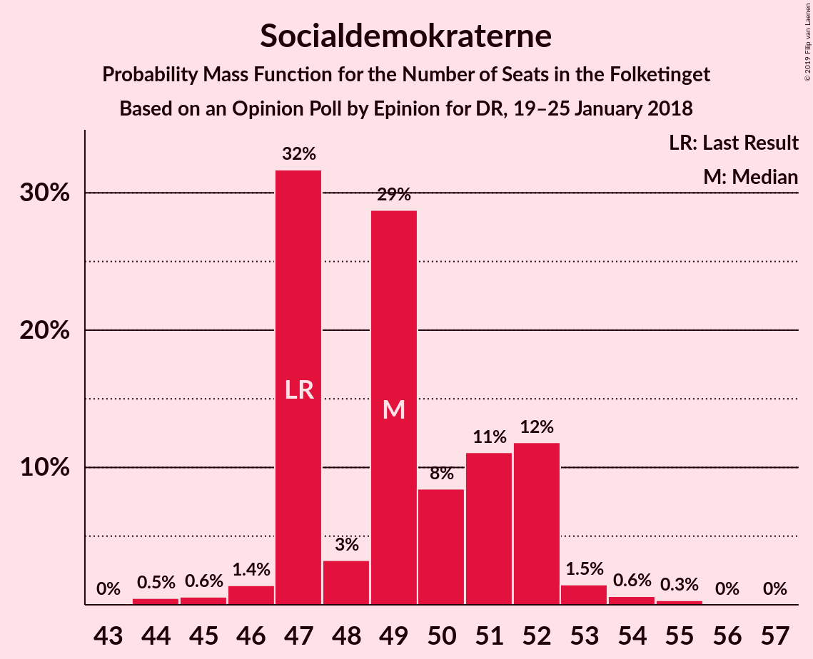
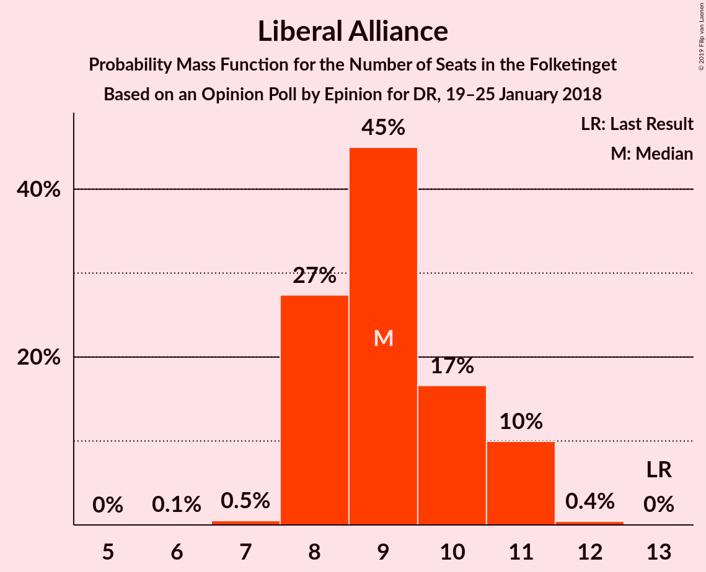
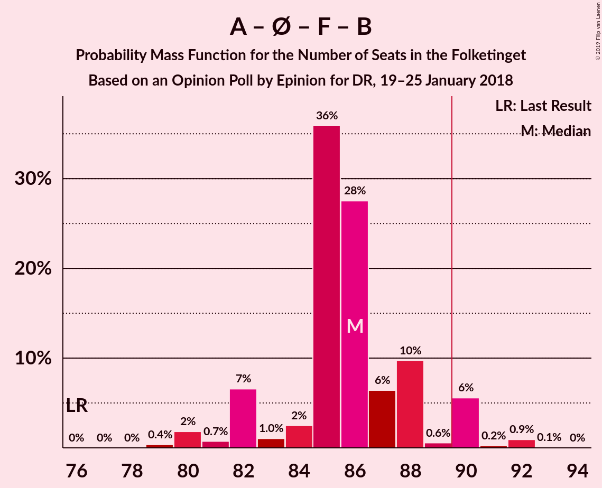
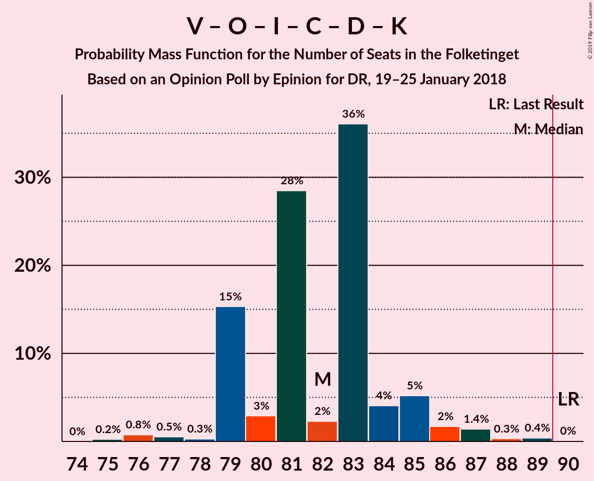

# Opinion Poll by Epinion for DR, 19–25 January 2018

<a href="#voting-intentions">Voting Intentions</a> | <a href="#seats">Seats</a> | <a href="#coalitions">Coalitions</a> | <a href="#technical-information">Technical Information</a>

## Voting Intentions

### Confidence Intervals

| Party | Last Result | Poll Result | 80% Confidence Interval | 90% Confidence Interval | 95% Confidence Interval | 99% Confidence Interval |
|:-----:|:-----------:|:-----------:|:-----------------------:|:-----------------------:|:-----------------------:|:-----------------------:|
| Socialdemokraterne | 26.3% | 28.3% | 27.0–29.7% |26.6–30.1% |26.3–30.5% |25.6–31.2% |
| Venstre | 19.5% | 17.9% | 16.8–19.1% |16.4–19.4% |16.2–19.7% |15.6–20.3% |
| Dansk Folkeparti | 21.1% | 17.4% | 16.3–18.6% |16.0–19.0% |15.7–19.3% |15.2–19.9% |
| Enhedslisten–De Rød-Grønne | 7.8% | 8.7% | 7.9–9.6% |7.7–9.9% |7.5–10.1% |7.1–10.5% |
| Socialistisk Folkeparti | 4.2% | 5.8% | 5.1–6.6% |4.9–6.8% |4.8–7.0% |4.5–7.4% |
| Radikale Venstre | 4.6% | 5.6% | 5.0–6.4% |4.8–6.6% |4.6–6.8% |4.3–7.2% |
| Liberal Alliance | 7.5% | 5.2% | 4.6–6.0% |4.4–6.2% |4.3–6.4% |4.0–6.7% |
| Det Konservative Folkeparti | 3.4% | 4.4% | 3.9–5.1% |3.7–5.3% |3.6–5.5% |3.3–5.9% |
| Alternativet | 4.8% | 4.1% | 3.5–4.8% |3.4–5.0% |3.2–5.1% |3.0–5.5% |
| Nye Borgerlige | 0.0% | 2.2% | 1.8–2.7% |1.7–2.9% |1.6–3.0% |1.4–3.3% |
| Kristendemokraterne | 0.8% | 0.4% | 0.3–0.7% |0.2–0.7% |0.2–0.8% |0.1–1.0% |

*Note:* The poll result column reflects the actual value used in the calculations. Published results may vary slightly, and in addition be rounded to fewer digits.

## Seats

### Confidence Intervals

| Party | Last Result | Median | 80% Confidence Interval | 90% Confidence Interval | 95% Confidence Interval | 99% Confidence Interval |
|:-----:|:-----------:|:------:|:-----------------------:|:-----------------------:|:-----------------------:|:-----------------------:|
| <a href="#socialdemokraterne">Socialdemokraterne</a> | 47 | 44 | 44–46 |44–55 |44–55 |44–55 |
| <a href="#venstre">Venstre</a> | 34 | 31 | 27–31 |27–31 |27–31 |27–31 |
| <a href="#dansk-folkeparti">Dansk Folkeparti</a> | 37 | 32 | 32–35 |29–35 |29–35 |26–35 |
| <a href="#enhedslisten–de-rød-grønne">Enhedslisten–De Rød-Grønne</a> | 14 | 15 | 15–17 |15–19 |15–19 |15–20 |
| <a href="#socialistisk-folkeparti">Socialistisk Folkeparti</a> | 7 | 14 | 9–14 |9–14 |9–14 |9–14 |
| <a href="#radikale-venstre">Radikale Venstre</a> | 8 | 7 | 7–11 |7–11 |7–11 |7–14 |
| <a href="#liberal-alliance">Liberal Alliance</a> | 13 | 10 | 10 |9–10 |9–10 |8–10 |
| <a href="#det-konservative-folkeparti">Det Konservative Folkeparti</a> | 6 | 8 | 8 |6–8 |6–8 |6–8 |
| <a href="#alternativet">Alternativet</a> | 9 | 10 | 7–10 |5–10 |5–10 |5–10 |
| <a href="#nye-borgerlige">Nye Borgerlige</a> | 0 | 4 | 4–5 |4–5 |4–5 |4–5 |
| <a href="#kristendemokraterne">Kristendemokraterne</a> | 0 | 0 | 0 |0 |0 |0 |

### Socialdemokraterne

*For a full overview of the results for this party, see the [Socialdemokraterne](party-socialdemokraterne.html) page.*

| Number of Seats | Probability | Accumulated | Special Marks |
|:---------------:|:-----------:|:-----------:|:-------------:|
| 44 | 58% | 100% | Median |
| 45 | 0% | 42% |  |
| 46 | 34% | 42% |  |
| 47 | 0% | 8% | Last Result |
| 48 | 0.4% | 8% |  |
| 49 | 0.6% | 8% |  |
| 50 | 0% | 7% |  |
| 51 | 0.7% | 7% |  |
| 52 | 0% | 6% |  |
| 53 | 0% | 6% |  |
| 54 | 0% | 6% |  |
| 55 | 6% | 6% |  |
| 56 | 0% | 0% |  |

### Venstre

*For a full overview of the results for this party, see the [Venstre](party-venstre.html) page.*

| Number of Seats | Probability | Accumulated | Special Marks |
|:---------------:|:-----------:|:-----------:|:-------------:|
| 27 | 35% | 100% |  |
| 28 | 0% | 65% |  |
| 29 | 6% | 65% |  |
| 30 | 0% | 59% |  |
| 31 | 58% | 59% | Median |
| 32 | 0.1% | 0.5% |  |
| 33 | 0% | 0.4% |  |
| 34 | 0.1% | 0.4% | Last Result |
| 35 | 0% | 0.3% |  |
| 36 | 0% | 0.3% |  |
| 37 | 0% | 0.3% |  |
| 38 | 0.3% | 0.3% |  |
| 39 | 0% | 0% |  |

### Dansk Folkeparti

*For a full overview of the results for this party, see the [Dansk Folkeparti](party-danskfolkeparti.html) page.*

| Number of Seats | Probability | Accumulated | Special Marks |
|:---------------:|:-----------:|:-----------:|:-------------:|
| 26 | 0.7% | 100% |  |
| 27 | 0% | 99.2% |  |
| 28 | 0% | 99.2% |  |
| 29 | 6% | 99.2% |  |
| 30 | 0% | 93% |  |
| 31 | 0.6% | 93% |  |
| 32 | 58% | 92% | Median |
| 33 | 0% | 34% |  |
| 34 | 0.4% | 34% |  |
| 35 | 34% | 34% |  |
| 36 | 0% | 0% |  |
| 37 | 0% | 0% | Last Result |

### Enhedslisten–De Rød-Grønne

*For a full overview of the results for this party, see the [Enhedslisten–De Rød-Grønne](party-enhedslisten–derød-grønne.html) page.*

| Number of Seats | Probability | Accumulated | Special Marks |
|:---------------:|:-----------:|:-----------:|:-------------:|
| 11 | 0.1% | 100% |  |
| 12 | 0% | 99.9% |  |
| 13 | 0% | 99.9% |  |
| 14 | 0% | 99.9% | Last Result |
| 15 | 59% | 99.9% | Median |
| 16 | 0% | 41% |  |
| 17 | 34% | 41% |  |
| 18 | 0% | 7% |  |
| 19 | 6% | 7% |  |
| 20 | 0.6% | 0.6% |  |
| 21 | 0% | 0% |  |

### Socialistisk Folkeparti

*For a full overview of the results for this party, see the [Socialistisk Folkeparti](party-socialistiskfolkeparti.html) page.*

| Number of Seats | Probability | Accumulated | Special Marks |
|:---------------:|:-----------:|:-----------:|:-------------:|
| 7 | 0% | 100% | Last Result |
| 8 | 0% | 100% |  |
| 9 | 40% | 100% |  |
| 10 | 0.1% | 60% |  |
| 11 | 0.1% | 60% |  |
| 12 | 0.7% | 60% |  |
| 13 | 0% | 59% |  |
| 14 | 59% | 59% | Median |
| 15 | 0% | 0% |  |

### Radikale Venstre

*For a full overview of the results for this party, see the [Radikale Venstre](party-radikalevenstre.html) page.*

| Number of Seats | Probability | Accumulated | Special Marks |
|:---------------:|:-----------:|:-----------:|:-------------:|
| 7 | 58% | 100% | Median |
| 8 | 0.6% | 42% | Last Result |
| 9 | 0.4% | 41% |  |
| 10 | 6% | 41% |  |
| 11 | 34% | 35% |  |
| 12 | 0.1% | 0.8% |  |
| 13 | 0% | 0.7% |  |
| 14 | 0.7% | 0.7% |  |
| 15 | 0% | 0% |  |

### Liberal Alliance

*For a full overview of the results for this party, see the [Liberal Alliance](party-liberalalliance.html) page.*

| Number of Seats | Probability | Accumulated | Special Marks |
|:---------------:|:-----------:|:-----------:|:-------------:|
| 6 | 0.4% | 100% |  |
| 7 | 0% | 99.6% |  |
| 8 | 0.8% | 99.6% |  |
| 9 | 6% | 98.8% |  |
| 10 | 93% | 93% | Median |
| 11 | 0% | 0.1% |  |
| 12 | 0% | 0% |  |
| 13 | 0% | 0% | Last Result |

### Det Konservative Folkeparti

*For a full overview of the results for this party, see the [Det Konservative Folkeparti](party-detkonservativefolkeparti.html) page.*

| Number of Seats | Probability | Accumulated | Special Marks |
|:---------------:|:-----------:|:-----------:|:-------------:|
| 5 | 0.1% | 100% |  |
| 6 | 7% | 99.9% | Last Result |
| 7 | 0.3% | 93% |  |
| 8 | 93% | 93% | Median |
| 9 | 0% | 0.1% |  |
| 10 | 0.1% | 0.1% |  |
| 11 | 0% | 0% |  |

### Alternativet

*For a full overview of the results for this party, see the [Alternativet](party-alternativet.html) page.*

| Number of Seats | Probability | Accumulated | Special Marks |
|:---------------:|:-----------:|:-----------:|:-------------:|
| 5 | 6% | 100% |  |
| 6 | 0.6% | 94% |  |
| 7 | 34% | 93% |  |
| 8 | 0.1% | 59% |  |
| 9 | 0.8% | 59% | Last Result |
| 10 | 58% | 58% | Median |
| 11 | 0% | 0% |  |

### Nye Borgerlige

*For a full overview of the results for this party, see the [Nye Borgerlige](party-nyeborgerlige.html) page.*

| Number of Seats | Probability | Accumulated | Special Marks |
|:---------------:|:-----------:|:-----------:|:-------------:|
| 0 | 0.4% | 100% | Last Result |
| 1 | 0% | 99.6% |  |
| 2 | 0% | 99.6% |  |
| 3 | 0% | 99.6% |  |
| 4 | 65% | 99.6% | Median |
| 5 | 35% | 35% |  |
| 6 | 0% | 0% |  |

### Kristendemokraterne

*For a full overview of the results for this party, see the [Kristendemokraterne](party-kristendemokraterne.html) page.*

| Number of Seats | Probability | Accumulated | Special Marks |
|:---------------:|:-----------:|:-----------:|:-------------:|
| 0 | 100% | 100% | Last Result, Median |

## Coalitions

### Confidence Intervals

| Coalition | Last Result | Median | Majority? | 80% Confidence Interval | 90% Confidence Interval | 95% Confidence Interval | 99% Confidence Interval |
|:---------:|:-----------:|:------:|:---------:|:-----------------------:|:-----------------------:|:-----------------------:|:-----------------------:|
| Socialdemokraterne – Enhedslisten–De Rød-Grønne – Socialistisk Folkeparti – Radikale Venstre – Alternativet | 85 | 90 | 100% | 90 | 90–98 | 90–98 | 90–101 |
| Socialdemokraterne – Enhedslisten–De Rød-Grønne – Socialistisk Folkeparti – Radikale Venstre | 76 | 80 | 8% | 80–83 | 80–93 | 80–93 | 80–93 |
| Venstre – Dansk Folkeparti – Liberal Alliance – Det Konservative Folkeparti – Nye Borgerlige – Kristendemokraterne | 90 | 85 | 0% | 85 | 77–85 | 77–85 | 74–85 |
| Venstre – Dansk Folkeparti – Liberal Alliance – Det Konservative Folkeparti – Nye Borgerlige | 90 | 85 | 0% | 85 | 77–85 | 77–85 | 74–85 |
| Venstre – Dansk Folkeparti – Liberal Alliance – Det Konservative Folkeparti – Kristendemokraterne | 90 | 81 | 0% | 80–81 | 73–81 | 73–81 | 69–81 |
| Venstre – Dansk Folkeparti – Liberal Alliance – Det Konservative Folkeparti | 90 | 81 | 0% | 80–81 | 73–81 | 73–81 | 69–81 |
| Socialdemokraterne – Socialistisk Folkeparti – Radikale Venstre | 62 | 65 | 0% | 65–66 | 65–74 | 65–74 | 65–77 |
| Socialdemokraterne – Radikale Venstre | 55 | 51 | 0% | 51–57 | 51–65 | 51–65 | 51–65 |
| Venstre – Liberal Alliance – Det Konservative Folkeparti | 53 | 49 | 0% | 45–49 | 44–49 | 44–49 | 43–49 |
| Venstre – Det Konservative Folkeparti | 40 | 39 | 0% | 35–39 | 35–39 | 35–39 | 33–39 |
| Venstre | 34 | 31 | 0% | 27–31 | 27–31 | 27–31 | 27–31 |

### Socialdemokraterne – Enhedslisten–De Rød-Grønne – Socialistisk Folkeparti – Radikale Venstre – Alternativet

| Number of Seats | Probability | Accumulated | Special Marks |
|:---------------:|:-----------:|:-----------:|:-------------:|
| 85 | 0% | 100% | Last Result |
| 86 | 0% | 100% |  |
| 87 | 0% | 100% |  |
| 88 | 0% | 100% |  |
| 89 | 0% | 100% |  |
| 90 | 92% | 100% | Median, Majority |
| 91 | 0% | 8% |  |
| 92 | 0% | 8% |  |
| 93 | 0% | 8% |  |
| 94 | 0% | 8% |  |
| 95 | 0% | 8% |  |
| 96 | 0% | 8% |  |
| 97 | 0.6% | 8% |  |
| 98 | 6% | 7% |  |
| 99 | 0% | 0.8% |  |
| 100 | 0% | 0.8% |  |
| 101 | 0.7% | 0.7% |  |
| 102 | 0% | 0% |  |

### Socialdemokraterne – Enhedslisten–De Rød-Grønne – Socialistisk Folkeparti – Radikale Venstre

| Number of Seats | Probability | Accumulated | Special Marks |
|:---------------:|:-----------:|:-----------:|:-------------:|
| 76 | 0% | 100% | Last Result |
| 77 | 0% | 100% |  |
| 78 | 0% | 100% |  |
| 79 | 0% | 100% |  |
| 80 | 58% | 100% | Median |
| 81 | 0% | 42% |  |
| 82 | 0.1% | 42% |  |
| 83 | 34% | 42% |  |
| 84 | 0% | 8% |  |
| 85 | 0% | 8% |  |
| 86 | 0% | 8% |  |
| 87 | 0% | 8% |  |
| 88 | 0% | 8% |  |
| 89 | 0% | 8% |  |
| 90 | 0% | 8% | Majority |
| 91 | 0.6% | 8% |  |
| 92 | 0.8% | 7% |  |
| 93 | 6% | 6% |  |
| 94 | 0% | 0% |  |

### Venstre – Dansk Folkeparti – Liberal Alliance – Det Konservative Folkeparti – Nye Borgerlige – Kristendemokraterne

| Number of Seats | Probability | Accumulated | Special Marks |
|:---------------:|:-----------:|:-----------:|:-------------:|
| 74 | 0.7% | 100% |  |
| 75 | 0% | 99.3% |  |
| 76 | 0% | 99.2% |  |
| 77 | 6% | 99.2% |  |
| 78 | 0.6% | 93% |  |
| 79 | 0% | 92% |  |
| 80 | 0% | 92% |  |
| 81 | 0% | 92% |  |
| 82 | 0% | 92% |  |
| 83 | 0% | 92% |  |
| 84 | 0% | 92% |  |
| 85 | 92% | 92% | Median |
| 86 | 0% | 0% |  |
| 87 | 0% | 0% |  |
| 88 | 0% | 0% |  |
| 89 | 0% | 0% |  |
| 90 | 0% | 0% | Last Result, Majority |

### Venstre – Dansk Folkeparti – Liberal Alliance – Det Konservative Folkeparti – Nye Borgerlige

| Number of Seats | Probability | Accumulated | Special Marks |
|:---------------:|:-----------:|:-----------:|:-------------:|
| 74 | 0.7% | 100% |  |
| 75 | 0% | 99.3% |  |
| 76 | 0% | 99.2% |  |
| 77 | 6% | 99.2% |  |
| 78 | 0.6% | 93% |  |
| 79 | 0% | 92% |  |
| 80 | 0% | 92% |  |
| 81 | 0% | 92% |  |
| 82 | 0% | 92% |  |
| 83 | 0% | 92% |  |
| 84 | 0% | 92% |  |
| 85 | 92% | 92% | Median |
| 86 | 0% | 0% |  |
| 87 | 0% | 0% |  |
| 88 | 0% | 0% |  |
| 89 | 0% | 0% |  |
| 90 | 0% | 0% | Last Result, Majority |

### Venstre – Dansk Folkeparti – Liberal Alliance – Det Konservative Folkeparti – Kristendemokraterne

| Number of Seats | Probability | Accumulated | Special Marks |
|:---------------:|:-----------:|:-----------:|:-------------:|
| 69 | 0.7% | 100% |  |
| 70 | 0% | 99.3% |  |
| 71 | 0% | 99.3% |  |
| 72 | 0% | 99.2% |  |
| 73 | 6% | 99.2% |  |
| 74 | 0.6% | 93% |  |
| 75 | 0% | 92% |  |
| 76 | 0% | 92% |  |
| 77 | 0% | 92% |  |
| 78 | 0% | 92% |  |
| 79 | 0% | 92% |  |
| 80 | 34% | 92% |  |
| 81 | 58% | 59% | Median |
| 82 | 0% | 0.4% |  |
| 83 | 0% | 0.4% |  |
| 84 | 0% | 0.3% |  |
| 85 | 0.3% | 0.3% |  |
| 86 | 0% | 0% |  |
| 87 | 0% | 0% |  |
| 88 | 0% | 0% |  |
| 89 | 0% | 0% |  |
| 90 | 0% | 0% | Last Result, Majority |

### Venstre – Dansk Folkeparti – Liberal Alliance – Det Konservative Folkeparti

| Number of Seats | Probability | Accumulated | Special Marks |
|:---------------:|:-----------:|:-----------:|:-------------:|
| 69 | 0.7% | 100% |  |
| 70 | 0% | 99.3% |  |
| 71 | 0% | 99.3% |  |
| 72 | 0% | 99.2% |  |
| 73 | 6% | 99.2% |  |
| 74 | 0.6% | 93% |  |
| 75 | 0% | 92% |  |
| 76 | 0% | 92% |  |
| 77 | 0% | 92% |  |
| 78 | 0% | 92% |  |
| 79 | 0% | 92% |  |
| 80 | 34% | 92% |  |
| 81 | 58% | 59% | Median |
| 82 | 0% | 0.4% |  |
| 83 | 0% | 0.4% |  |
| 84 | 0% | 0.3% |  |
| 85 | 0.3% | 0.3% |  |
| 86 | 0% | 0% |  |
| 87 | 0% | 0% |  |
| 88 | 0% | 0% |  |
| 89 | 0% | 0% |  |
| 90 | 0% | 0% | Last Result, Majority |

### Socialdemokraterne – Socialistisk Folkeparti – Radikale Venstre

| Number of Seats | Probability | Accumulated | Special Marks |
|:---------------:|:-----------:|:-----------:|:-------------:|
| 62 | 0% | 100% | Last Result |
| 63 | 0% | 100% |  |
| 64 | 0% | 100% |  |
| 65 | 58% | 100% | Median |
| 66 | 34% | 42% |  |
| 67 | 0% | 8% |  |
| 68 | 0% | 8% |  |
| 69 | 0% | 8% |  |
| 70 | 0% | 8% |  |
| 71 | 0.7% | 8% |  |
| 72 | 0% | 7% |  |
| 73 | 0% | 7% |  |
| 74 | 6% | 7% |  |
| 75 | 0% | 0.7% |  |
| 76 | 0% | 0.7% |  |
| 77 | 0.7% | 0.7% |  |
| 78 | 0% | 0% |  |

### Socialdemokraterne – Radikale Venstre

| Number of Seats | Probability | Accumulated | Special Marks |
|:---------------:|:-----------:|:-----------:|:-------------:|
| 51 | 58% | 100% | Median |
| 52 | 0% | 42% |  |
| 53 | 0% | 42% |  |
| 54 | 0% | 42% |  |
| 55 | 0% | 42% | Last Result |
| 56 | 0% | 42% |  |
| 57 | 35% | 42% |  |
| 58 | 0% | 7% |  |
| 59 | 0% | 7% |  |
| 60 | 0.1% | 7% |  |
| 61 | 0.1% | 7% |  |
| 62 | 0% | 7% |  |
| 63 | 0% | 7% |  |
| 64 | 0% | 7% |  |
| 65 | 7% | 7% |  |
| 66 | 0% | 0% |  |

### Venstre – Liberal Alliance – Det Konservative Folkeparti

| Number of Seats | Probability | Accumulated | Special Marks |
|:---------------:|:-----------:|:-----------:|:-------------:|
| 43 | 1.3% | 100% |  |
| 44 | 6% | 98.7% |  |
| 45 | 34% | 93% |  |
| 46 | 0% | 59% |  |
| 47 | 0.1% | 59% |  |
| 48 | 0% | 59% |  |
| 49 | 58% | 59% | Median |
| 50 | 0% | 0.4% |  |
| 51 | 0.3% | 0.4% |  |
| 52 | 0% | 0.1% |  |
| 53 | 0.1% | 0.1% | Last Result |
| 54 | 0% | 0% |  |

### Venstre – Det Konservative Folkeparti

| Number of Seats | Probability | Accumulated | Special Marks |
|:---------------:|:-----------:|:-----------:|:-------------:|
| 33 | 0.6% | 100% |  |
| 34 | 0% | 99.4% |  |
| 35 | 41% | 99.4% |  |
| 36 | 0% | 59% |  |
| 37 | 0% | 59% |  |
| 38 | 0% | 59% |  |
| 39 | 58% | 59% | Median |
| 40 | 0% | 0.4% | Last Result |
| 41 | 0% | 0.4% |  |
| 42 | 0.1% | 0.4% |  |
| 43 | 0% | 0.3% |  |
| 44 | 0% | 0.3% |  |
| 45 | 0.3% | 0.3% |  |
| 46 | 0% | 0% |  |

### Venstre

| Number of Seats | Probability | Accumulated | Special Marks |
|:---------------:|:-----------:|:-----------:|:-------------:|
| 27 | 35% | 100% |  |
| 28 | 0% | 65% |  |
| 29 | 6% | 65% |  |
| 30 | 0% | 59% |  |
| 31 | 58% | 59% | Median |
| 32 | 0.1% | 0.5% |  |
| 33 | 0% | 0.4% |  |
| 34 | 0.1% | 0.4% | Last Result |
| 35 | 0% | 0.3% |  |
| 36 | 0% | 0.3% |  |
| 37 | 0% | 0.3% |  |
| 38 | 0.3% | 0.3% |  |
| 39 | 0% | 0% |  |

## Technical Information

### Opinion Poll

+ **Polling firm:** Epinion
+ **Commissioner(s):** DR
+ **Fieldwork period:** 19–25 January 2018

### Calculations

+ **Sample size:** 1762
+ **Simulations done:** 1,024
+ **Error estimate:** 2.90%

