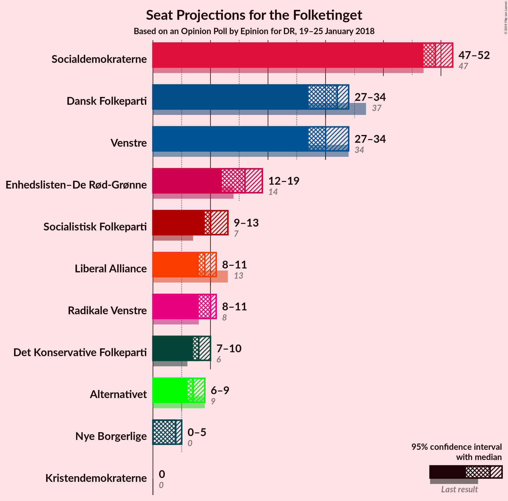
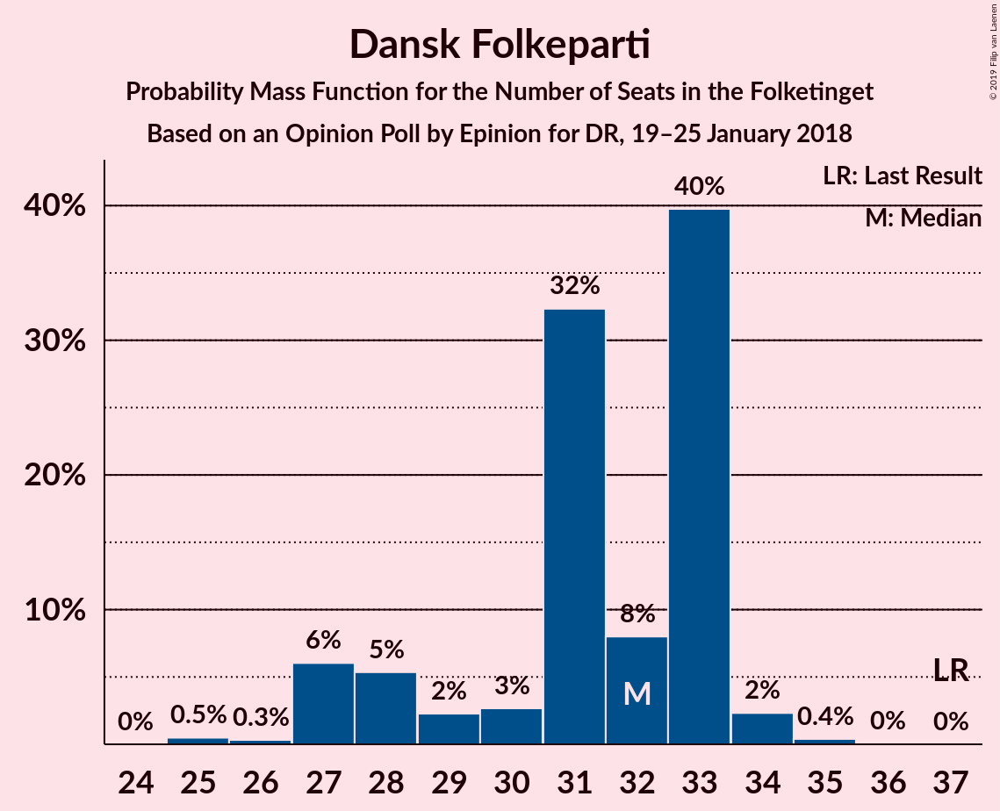
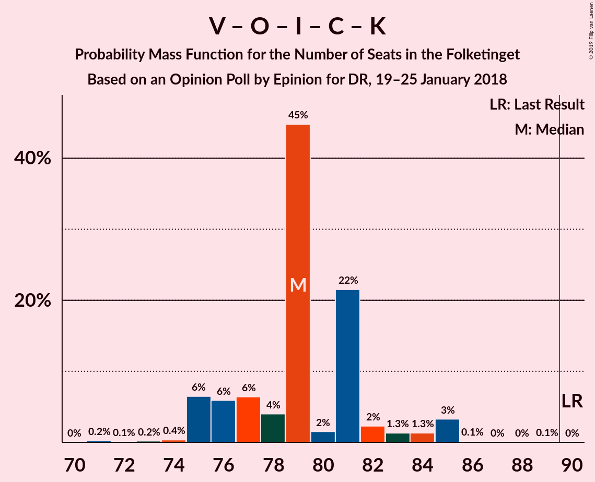
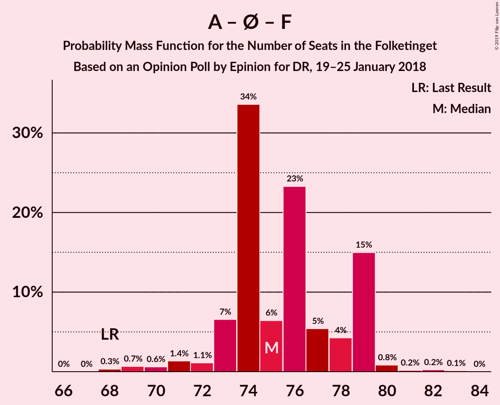
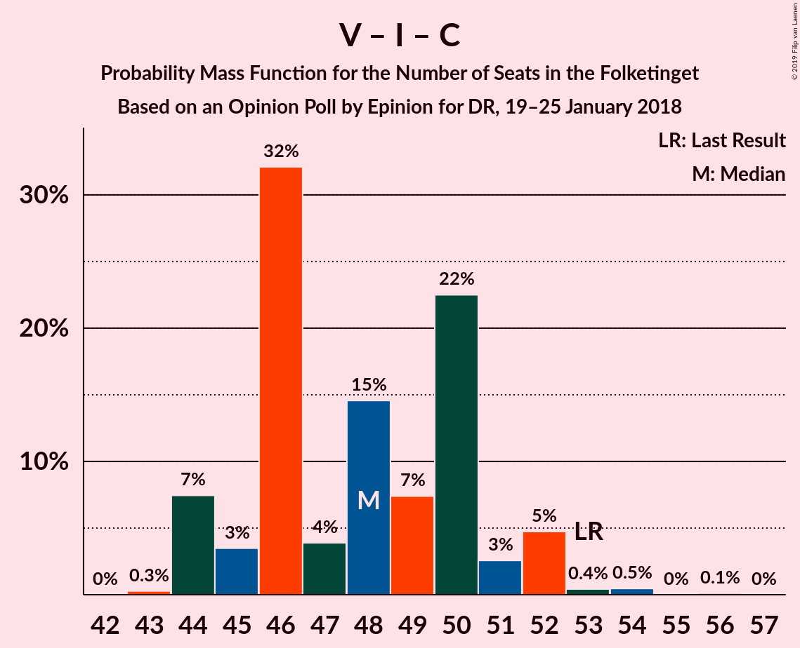

# Opinion Poll by Epinion for DR, 19–25 January 2018

<a href="#voting-intentions">Voting Intentions</a> | <a href="#seats">Seats</a> | <a href="#coalitions">Coalitions</a> | <a href="#technical-information">Technical Information</a>

## Voting Intentions

### Confidence Intervals

| Party | Last Result | Poll Result | 80% Confidence Interval | 90% Confidence Interval | 95% Confidence Interval | 99% Confidence Interval |
|:-----:|:-----------:|:-----------:|:-----------------------:|:-----------------------:|:-----------------------:|:-----------------------:|
| Socialdemokraterne | 26.3% | 28.3% | 27.0–29.7% |26.6–30.1% |26.3–30.5% |25.6–31.2% |
| Venstre | 19.5% | 17.9% | 16.8–19.1% |16.4–19.4% |16.2–19.7% |15.6–20.3% |
| Dansk Folkeparti | 21.1% | 17.4% | 16.3–18.6% |16.0–19.0% |15.7–19.3% |15.2–19.9% |
| Enhedslisten–De Rød-Grønne | 7.8% | 8.7% | 7.9–9.6% |7.7–9.9% |7.5–10.1% |7.1–10.5% |
| Socialistisk Folkeparti | 4.2% | 5.8% | 5.1–6.6% |4.9–6.8% |4.8–7.0% |4.5–7.4% |
| Radikale Venstre | 4.6% | 5.6% | 5.0–6.4% |4.8–6.6% |4.6–6.8% |4.3–7.2% |
| Liberal Alliance | 7.5% | 5.2% | 4.6–6.0% |4.4–6.2% |4.3–6.4% |4.0–6.7% |
| Det Konservative Folkeparti | 3.4% | 4.4% | 3.9–5.1% |3.7–5.3% |3.6–5.5% |3.3–5.9% |
| Alternativet | 4.8% | 4.1% | 3.5–4.8% |3.4–5.0% |3.2–5.1% |3.0–5.5% |
| Nye Borgerlige | 0.0% | 2.2% | 1.8–2.7% |1.7–2.9% |1.6–3.0% |1.4–3.3% |
| Kristendemokraterne | 0.8% | 0.4% | 0.3–0.7% |0.2–0.7% |0.2–0.8% |0.1–1.0% |

*Note:* The poll result column reflects the actual value used in the calculations. Published results may vary slightly, and in addition be rounded to fewer digits.

## Seats

### Confidence Intervals

| Party | Last Result | Median | 80% Confidence Interval | 90% Confidence Interval | 95% Confidence Interval | 99% Confidence Interval |
|:-----:|:-----------:|:------:|:-----------------------:|:-----------------------:|:-----------------------:|:-----------------------:|
| <a href="#socialdemokraterne">Socialdemokraterne</a> | 47 | 50 | 49–50 |49–51 |48–51 |47–54 |
| <a href="#venstre">Venstre</a> | 34 | 29 | 29–33 |29–33 |29–36 |28–36 |
| <a href="#dansk-folkeparti">Dansk Folkeparti</a> | 37 | 31 | 30–34 |29–34 |29–34 |26–34 |
| <a href="#enhedslisten–de-rød-grønne">Enhedslisten–De Rød-Grønne</a> | 14 | 16 | 14–16 |14–16 |14–18 |14–18 |
| <a href="#socialistisk-folkeparti">Socialistisk Folkeparti</a> | 7 | 13 | 9–13 |9–13 |9–13 |9–13 |
| <a href="#radikale-venstre">Radikale Venstre</a> | 8 | 11 | 8–11 |8–11 |8–11 |8–13 |
| <a href="#liberal-alliance">Liberal Alliance</a> | 13 | 8 | 8–9 |8–9 |8–10 |8–11 |
| <a href="#det-konservative-folkeparti">Det Konservative Folkeparti</a> | 6 | 7 | 7–10 |7–10 |7–10 |6–10 |
| <a href="#alternativet">Alternativet</a> | 9 | 6 | 6–9 |6–9 |6–9 |5–9 |
| <a href="#nye-borgerlige">Nye Borgerlige</a> | 0 | 4 | 4–5 |4–5 |4–5 |0–6 |
| <a href="#kristendemokraterne">Kristendemokraterne</a> | 0 | 0 | 0 |0 |0 |0 |

### Socialdemokraterne

*For a full overview of the results for this party, see the [Socialdemokraterne](party-socialdemokraterne.html) page.*

| Number of Seats | Probability | Accumulated | Special Marks |
|:---------------:|:-----------:|:-----------:|:-------------:|
| 45 | 0.1% | 100% |  |
| 46 | 0.3% | 99.9% |  |
| 47 | 0.2% | 99.6% | Last Result |
| 48 | 4% | 99.4% |  |
| 49 | 15% | 96% |  |
| 50 | 75% | 81% | Median |
| 51 | 4% | 6% |  |
| 52 | 0.5% | 2% |  |
| 53 | 1.1% | 2% |  |
| 54 | 0.4% | 0.8% |  |
| 55 | 0.1% | 0.4% |  |
| 56 | 0% | 0.3% |  |
| 57 | 0.3% | 0.3% |  |
| 58 | 0% | 0% |  |

### Venstre

*For a full overview of the results for this party, see the [Venstre](party-venstre.html) page.*

| Number of Seats | Probability | Accumulated | Special Marks |
|:---------------:|:-----------:|:-----------:|:-------------:|
| 27 | 0.3% | 100% |  |
| 28 | 0.2% | 99.7% |  |
| 29 | 72% | 99.4% | Median |
| 30 | 4% | 27% |  |
| 31 | 2% | 23% |  |
| 32 | 1.0% | 22% |  |
| 33 | 18% | 21% |  |
| 34 | 0% | 3% | Last Result |
| 35 | 0% | 3% |  |
| 36 | 3% | 3% |  |
| 37 | 0% | 0% |  |

### Dansk Folkeparti

*For a full overview of the results for this party, see the [Dansk Folkeparti](party-danskfolkeparti.html) page.*

| Number of Seats | Probability | Accumulated | Special Marks |
|:---------------:|:-----------:|:-----------:|:-------------:|
| 26 | 0.6% | 100% |  |
| 27 | 0.4% | 99.4% |  |
| 28 | 0.9% | 98.9% |  |
| 29 | 6% | 98% |  |
| 30 | 17% | 92% |  |
| 31 | 58% | 74% | Median |
| 32 | 0.1% | 16% |  |
| 33 | 0.5% | 16% |  |
| 34 | 16% | 16% |  |
| 35 | 0% | 0.1% |  |
| 36 | 0% | 0% |  |
| 37 | 0% | 0% | Last Result |

### Enhedslisten–De Rød-Grønne

*For a full overview of the results for this party, see the [Enhedslisten–De Rød-Grønne](party-enhedslisten–derød-grønne.html) page.*

| Number of Seats | Probability | Accumulated | Special Marks |
|:---------------:|:-----------:|:-----------:|:-------------:|
| 12 | 0.3% | 100% |  |
| 13 | 0.1% | 99.7% |  |
| 14 | 21% | 99.6% | Last Result |
| 15 | 2% | 79% |  |
| 16 | 73% | 77% | Median |
| 17 | 0.8% | 5% |  |
| 18 | 4% | 4% |  |
| 19 | 0% | 0% |  |

### Socialistisk Folkeparti

*For a full overview of the results for this party, see the [Socialistisk Folkeparti](party-socialistiskfolkeparti.html) page.*

| Number of Seats | Probability | Accumulated | Special Marks |
|:---------------:|:-----------:|:-----------:|:-------------:|
| 7 | 0% | 100% | Last Result |
| 8 | 0.5% | 100% |  |
| 9 | 25% | 99.5% |  |
| 10 | 1.2% | 75% |  |
| 11 | 16% | 74% |  |
| 12 | 0.8% | 58% |  |
| 13 | 57% | 57% | Median |
| 14 | 0% | 0% |  |

### Radikale Venstre

*For a full overview of the results for this party, see the [Radikale Venstre](party-radikalevenstre.html) page.*

| Number of Seats | Probability | Accumulated | Special Marks |
|:---------------:|:-----------:|:-----------:|:-------------:|
| 7 | 0% | 100% |  |
| 8 | 16% | 99.9% | Last Result |
| 9 | 22% | 84% |  |
| 10 | 4% | 63% |  |
| 11 | 58% | 59% | Median |
| 12 | 0.5% | 1.1% |  |
| 13 | 0.6% | 0.6% |  |
| 14 | 0% | 0% |  |

### Liberal Alliance

*For a full overview of the results for this party, see the [Liberal Alliance](party-liberalalliance.html) page.*

| Number of Seats | Probability | Accumulated | Special Marks |
|:---------------:|:-----------:|:-----------:|:-------------:|
| 7 | 0.3% | 100% |  |
| 8 | 76% | 99.7% | Median |
| 9 | 21% | 23% |  |
| 10 | 1.4% | 3% |  |
| 11 | 1.2% | 1.5% |  |
| 12 | 0.3% | 0.3% |  |
| 13 | 0% | 0% | Last Result |

### Det Konservative Folkeparti

*For a full overview of the results for this party, see the [Det Konservative Folkeparti](party-detkonservativefolkeparti.html) page.*

| Number of Seats | Probability | Accumulated | Special Marks |
|:---------------:|:-----------:|:-----------:|:-------------:|
| 5 | 0.1% | 100% |  |
| 6 | 2% | 99.9% | Last Result |
| 7 | 76% | 98% | Median |
| 8 | 3% | 22% |  |
| 9 | 4% | 19% |  |
| 10 | 15% | 15% |  |
| 11 | 0% | 0% |  |

### Alternativet

*For a full overview of the results for this party, see the [Alternativet](party-alternativet.html) page.*

| Number of Seats | Probability | Accumulated | Special Marks |
|:---------------:|:-----------:|:-----------:|:-------------:|
| 5 | 0.5% | 100% |  |
| 6 | 73% | 99.5% | Median |
| 7 | 4% | 27% |  |
| 8 | 4% | 23% |  |
| 9 | 18% | 18% | Last Result |
| 10 | 0.3% | 0.3% |  |
| 11 | 0.1% | 0.1% |  |
| 12 | 0% | 0% |  |

### Nye Borgerlige

*For a full overview of the results for this party, see the [Nye Borgerlige](party-nyeborgerlige.html) page.*

| Number of Seats | Probability | Accumulated | Special Marks |
|:---------------:|:-----------:|:-----------:|:-------------:|
| 0 | 1.3% | 100% | Last Result |
| 1 | 0% | 98.7% |  |
| 2 | 0% | 98.7% |  |
| 3 | 0% | 98.7% |  |
| 4 | 77% | 98.7% | Median |
| 5 | 21% | 22% |  |
| 6 | 0.5% | 0.5% |  |
| 7 | 0% | 0% |  |

### Kristendemokraterne

*For a full overview of the results for this party, see the [Kristendemokraterne](party-kristendemokraterne.html) page.*

| Number of Seats | Probability | Accumulated | Special Marks |
|:---------------:|:-----------:|:-----------:|:-------------:|
| 0 | 100% | 100% | Last Result, Median |

## Coalitions

### Confidence Intervals

| Coalition | Last Result | Median | Majority? | 80% Confidence Interval | 90% Confidence Interval | 95% Confidence Interval | 99% Confidence Interval |
|:---------:|:-----------:|:------:|:---------:|:-----------------------:|:-----------------------:|:-----------------------:|:-----------------------:|
| Socialdemokraterne – Enhedslisten–De Rød-Grønne – Socialistisk Folkeparti – Radikale Venstre – Alternativet | 85 | 96 | 97% | 90–96 | 90–96 | 88–96 | 88–98 |
| Socialdemokraterne – Enhedslisten–De Rød-Grønne – Socialistisk Folkeparti – Radikale Venstre | 76 | 90 | 57% | 82–90 | 82–90 | 81–90 | 81–90 |
| Venstre – Dansk Folkeparti – Liberal Alliance – Det Konservative Folkeparti – Nye Borgerlige – Kristendemokraterne | 90 | 79 | 0% | 79–85 | 79–85 | 79–87 | 77–87 |
| Venstre – Dansk Folkeparti – Liberal Alliance – Det Konservative Folkeparti – Nye Borgerlige | 90 | 79 | 0% | 79–85 | 79–85 | 79–87 | 77–87 |
| Socialdemokraterne – Enhedslisten–De Rød-Grønne – Socialistisk Folkeparti – Alternativet | 77 | 85 | 0% | 82–85 | 82–85 | 78–86 | 78–89 |
| Venstre – Dansk Folkeparti – Liberal Alliance – Det Konservative Folkeparti – Kristendemokraterne | 90 | 75 | 0% | 75–81 | 75–81 | 75–82 | 73–82 |
| Venstre – Dansk Folkeparti – Liberal Alliance – Det Konservative Folkeparti | 90 | 75 | 0% | 75–81 | 75–81 | 75–82 | 73–82 |
| Socialdemokraterne – Enhedslisten–De Rød-Grønne – Socialistisk Folkeparti | 68 | 79 | 0% | 73–79 | 73–79 | 71–79 | 71–80 |
| Socialdemokraterne – Socialistisk Folkeparti – Radikale Venstre | 62 | 74 | 0% | 68–74 | 68–74 | 67–74 | 67–75 |
| Socialdemokraterne – Radikale Venstre | 55 | 61 | 0% | 57–61 | 57–61 | 57–62 | 57–65 |
| Venstre – Liberal Alliance – Det Konservative Folkeparti | 53 | 44 | 0% | 44–49 | 44–49 | 44–53 | 44–53 |
| Venstre – Det Konservative Folkeparti | 40 | 36 | 0% | 36–40 | 36–40 | 36–44 | 35–44 |
| Venstre | 34 | 29 | 0% | 29–33 | 29–33 | 29–36 | 28–36 |

### Socialdemokraterne – Enhedslisten–De Rød-Grønne – Socialistisk Folkeparti – Radikale Venstre – Alternativet

| Number of Seats | Probability | Accumulated | Special Marks |
|:---------------:|:-----------:|:-----------:|:-------------:|
| 85 | 0% | 100% | Last Result |
| 86 | 0% | 100% |  |
| 87 | 0% | 100% |  |
| 88 | 3% | 100% |  |
| 89 | 0.1% | 97% |  |
| 90 | 15% | 97% | Majority |
| 91 | 17% | 81% |  |
| 92 | 0.2% | 64% |  |
| 93 | 0.8% | 64% |  |
| 94 | 0.6% | 63% |  |
| 95 | 4% | 63% |  |
| 96 | 57% | 58% | Median |
| 97 | 0.1% | 1.1% |  |
| 98 | 0.9% | 1.0% |  |
| 99 | 0.1% | 0.1% |  |
| 100 | 0% | 0% |  |

### Socialdemokraterne – Enhedslisten–De Rød-Grønne – Socialistisk Folkeparti – Radikale Venstre

| Number of Seats | Probability | Accumulated | Special Marks |
|:---------------:|:-----------:|:-----------:|:-------------:|
| 76 | 0% | 100% | Last Result |
| 77 | 0% | 100% |  |
| 78 | 0% | 100% |  |
| 79 | 0% | 100% |  |
| 80 | 0% | 100% |  |
| 81 | 3% | 99.9% |  |
| 82 | 18% | 97% |  |
| 83 | 0.1% | 79% |  |
| 84 | 15% | 79% |  |
| 85 | 0.5% | 64% |  |
| 86 | 1.1% | 64% |  |
| 87 | 4% | 63% |  |
| 88 | 0.4% | 59% |  |
| 89 | 0.9% | 58% |  |
| 90 | 57% | 57% | Median, Majority |
| 91 | 0% | 0.5% |  |
| 92 | 0.5% | 0.5% |  |
| 93 | 0% | 0% |  |

### Venstre – Dansk Folkeparti – Liberal Alliance – Det Konservative Folkeparti – Nye Borgerlige – Kristendemokraterne

| Number of Seats | Probability | Accumulated | Special Marks |
|:---------------:|:-----------:|:-----------:|:-------------:|
| 76 | 0.1% | 100% |  |
| 77 | 0.9% | 99.9% |  |
| 78 | 0.1% | 99.0% |  |
| 79 | 57% | 98.9% | Median |
| 80 | 4% | 42% |  |
| 81 | 0.6% | 37% |  |
| 82 | 0.8% | 37% |  |
| 83 | 0.2% | 36% |  |
| 84 | 17% | 36% |  |
| 85 | 15% | 19% |  |
| 86 | 0.1% | 3% |  |
| 87 | 3% | 3% |  |
| 88 | 0% | 0% |  |
| 89 | 0% | 0% |  |
| 90 | 0% | 0% | Last Result, Majority |

### Venstre – Dansk Folkeparti – Liberal Alliance – Det Konservative Folkeparti – Nye Borgerlige

| Number of Seats | Probability | Accumulated | Special Marks |
|:---------------:|:-----------:|:-----------:|:-------------:|
| 76 | 0.1% | 100% |  |
| 77 | 0.9% | 99.9% |  |
| 78 | 0.1% | 99.0% |  |
| 79 | 57% | 98.9% | Median |
| 80 | 4% | 42% |  |
| 81 | 0.6% | 37% |  |
| 82 | 0.8% | 37% |  |
| 83 | 0.2% | 36% |  |
| 84 | 17% | 36% |  |
| 85 | 15% | 19% |  |
| 86 | 0.1% | 3% |  |
| 87 | 3% | 3% |  |
| 88 | 0% | 0% |  |
| 89 | 0% | 0% |  |
| 90 | 0% | 0% | Last Result, Majority |

### Socialdemokraterne – Enhedslisten–De Rød-Grønne – Socialistisk Folkeparti – Alternativet

| Number of Seats | Probability | Accumulated | Special Marks |
|:---------------:|:-----------:|:-----------:|:-------------:|
| 77 | 0% | 100% | Last Result |
| 78 | 3% | 100% |  |
| 79 | 0.1% | 97% |  |
| 80 | 0.1% | 97% |  |
| 81 | 0.2% | 97% |  |
| 82 | 34% | 97% |  |
| 83 | 0.6% | 63% |  |
| 84 | 0.3% | 62% |  |
| 85 | 57% | 62% | Median |
| 86 | 4% | 5% |  |
| 87 | 0.5% | 1.1% |  |
| 88 | 0% | 0.6% |  |
| 89 | 0.6% | 0.6% |  |
| 90 | 0% | 0% | Majority |

### Venstre – Dansk Folkeparti – Liberal Alliance – Det Konservative Folkeparti – Kristendemokraterne

| Number of Seats | Probability | Accumulated | Special Marks |
|:---------------:|:-----------:|:-----------:|:-------------:|
| 73 | 0.5% | 100% |  |
| 74 | 0.4% | 99.5% |  |
| 75 | 57% | 99.0% | Median |
| 76 | 4% | 42% |  |
| 77 | 1.2% | 38% |  |
| 78 | 0.3% | 37% |  |
| 79 | 17% | 37% |  |
| 80 | 0.9% | 19% |  |
| 81 | 15% | 18% |  |
| 82 | 3% | 3% |  |
| 83 | 0.1% | 0.2% |  |
| 84 | 0% | 0.1% |  |
| 85 | 0% | 0% |  |
| 86 | 0% | 0% |  |
| 87 | 0% | 0% |  |
| 88 | 0% | 0% |  |
| 89 | 0% | 0% |  |
| 90 | 0% | 0% | Last Result, Majority |

### Venstre – Dansk Folkeparti – Liberal Alliance – Det Konservative Folkeparti

| Number of Seats | Probability | Accumulated | Special Marks |
|:---------------:|:-----------:|:-----------:|:-------------:|
| 73 | 0.5% | 100% |  |
| 74 | 0.4% | 99.5% |  |
| 75 | 57% | 99.0% | Median |
| 76 | 4% | 42% |  |
| 77 | 1.2% | 38% |  |
| 78 | 0.3% | 37% |  |
| 79 | 17% | 37% |  |
| 80 | 0.9% | 19% |  |
| 81 | 15% | 18% |  |
| 82 | 3% | 3% |  |
| 83 | 0.1% | 0.2% |  |
| 84 | 0% | 0.1% |  |
| 85 | 0% | 0% |  |
| 86 | 0% | 0% |  |
| 87 | 0% | 0% |  |
| 88 | 0% | 0% |  |
| 89 | 0% | 0% |  |
| 90 | 0% | 0% | Last Result, Majority |

### Socialdemokraterne – Enhedslisten–De Rød-Grønne – Socialistisk Folkeparti

| Number of Seats | Probability | Accumulated | Special Marks |
|:---------------:|:-----------:|:-----------:|:-------------:|
| 68 | 0% | 100% | Last Result |
| 69 | 0% | 100% |  |
| 70 | 0% | 100% |  |
| 71 | 3% | 99.9% |  |
| 72 | 0.3% | 97% |  |
| 73 | 17% | 97% |  |
| 74 | 0.8% | 79% |  |
| 75 | 0.4% | 78% |  |
| 76 | 15% | 78% |  |
| 77 | 0.5% | 63% |  |
| 78 | 4% | 62% |  |
| 79 | 57% | 58% | Median |
| 80 | 0.3% | 0.7% |  |
| 81 | 0% | 0.5% |  |
| 82 | 0% | 0.4% |  |
| 83 | 0.4% | 0.4% |  |
| 84 | 0% | 0% |  |

### Socialdemokraterne – Socialistisk Folkeparti – Radikale Venstre

| Number of Seats | Probability | Accumulated | Special Marks |
|:---------------:|:-----------:|:-----------:|:-------------:|
| 62 | 0% | 100% | Last Result |
| 63 | 0% | 100% |  |
| 64 | 0.2% | 100% |  |
| 65 | 0% | 99.8% |  |
| 66 | 0.1% | 99.7% |  |
| 67 | 4% | 99.6% |  |
| 68 | 32% | 96% |  |
| 69 | 3% | 64% |  |
| 70 | 1.1% | 61% |  |
| 71 | 0.3% | 60% |  |
| 72 | 0.7% | 60% |  |
| 73 | 0.7% | 59% |  |
| 74 | 58% | 58% | Median |
| 75 | 0.5% | 0.6% |  |
| 76 | 0% | 0.2% |  |
| 77 | 0.1% | 0.1% |  |
| 78 | 0% | 0% |  |

### Socialdemokraterne – Radikale Venstre

| Number of Seats | Probability | Accumulated | Special Marks |
|:---------------:|:-----------:|:-----------:|:-------------:|
| 55 | 0.2% | 100% | Last Result |
| 56 | 0.1% | 99.7% |  |
| 57 | 15% | 99.6% |  |
| 58 | 4% | 85% |  |
| 59 | 17% | 81% |  |
| 60 | 4% | 64% |  |
| 61 | 58% | 60% | Median |
| 62 | 1.3% | 3% |  |
| 63 | 0.4% | 1.3% |  |
| 64 | 0.1% | 1.0% |  |
| 65 | 0.5% | 0.8% |  |
| 66 | 0.3% | 0.3% |  |
| 67 | 0% | 0% |  |

### Venstre – Liberal Alliance – Det Konservative Folkeparti

| Number of Seats | Probability | Accumulated | Special Marks |
|:---------------:|:-----------:|:-----------:|:-------------:|
| 44 | 57% | 100% | Median |
| 45 | 0.8% | 43% |  |
| 46 | 1.5% | 42% |  |
| 47 | 19% | 41% |  |
| 48 | 0.4% | 22% |  |
| 49 | 18% | 22% |  |
| 50 | 0.6% | 4% |  |
| 51 | 0.2% | 3% |  |
| 52 | 0.1% | 3% |  |
| 53 | 3% | 3% | Last Result |
| 54 | 0% | 0% |  |

### Venstre – Det Konservative Folkeparti

| Number of Seats | Probability | Accumulated | Special Marks |
|:---------------:|:-----------:|:-----------:|:-------------:|
| 34 | 0% | 100% |  |
| 35 | 0.6% | 99.9% |  |
| 36 | 57% | 99.3% | Median |
| 37 | 0.8% | 42% |  |
| 38 | 2% | 41% |  |
| 39 | 18% | 39% |  |
| 40 | 18% | 21% | Last Result |
| 41 | 0.1% | 3% |  |
| 42 | 0% | 3% |  |
| 43 | 0% | 3% |  |
| 44 | 3% | 3% |  |
| 45 | 0% | 0% |  |

### Venstre

| Number of Seats | Probability | Accumulated | Special Marks |
|:---------------:|:-----------:|:-----------:|:-------------:|
| 27 | 0.3% | 100% |  |
| 28 | 0.2% | 99.7% |  |
| 29 | 72% | 99.4% | Median |
| 30 | 4% | 27% |  |
| 31 | 2% | 23% |  |
| 32 | 1.0% | 22% |  |
| 33 | 18% | 21% |  |
| 34 | 0% | 3% | Last Result |
| 35 | 0% | 3% |  |
| 36 | 3% | 3% |  |
| 37 | 0% | 0% |  |

## Technical Information

### Opinion Poll

+ **Polling firm:** Epinion
+ **Commissioner(s):** DR
+ **Fieldwork period:** 19–25 January 2018

### Calculations

+ **Sample size:** 1762
+ **Simulations done:** 131,072
+ **Error estimate:** 2.01%

