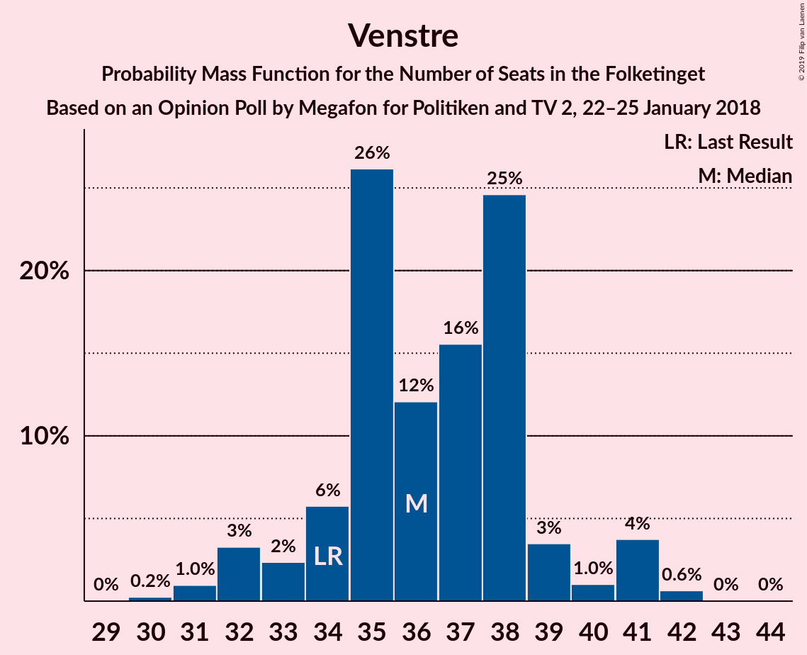
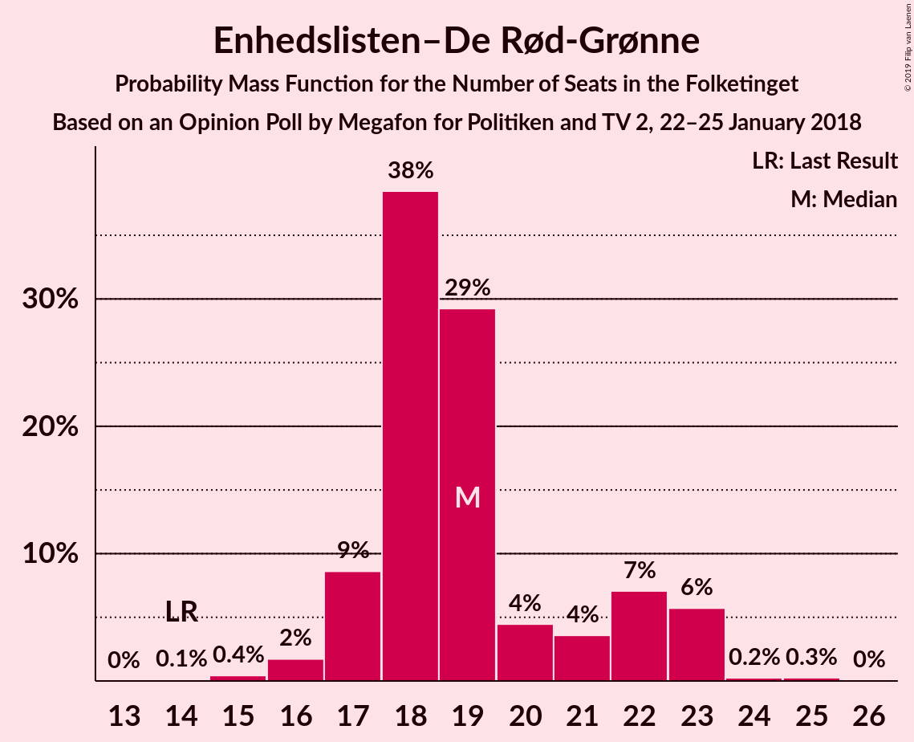
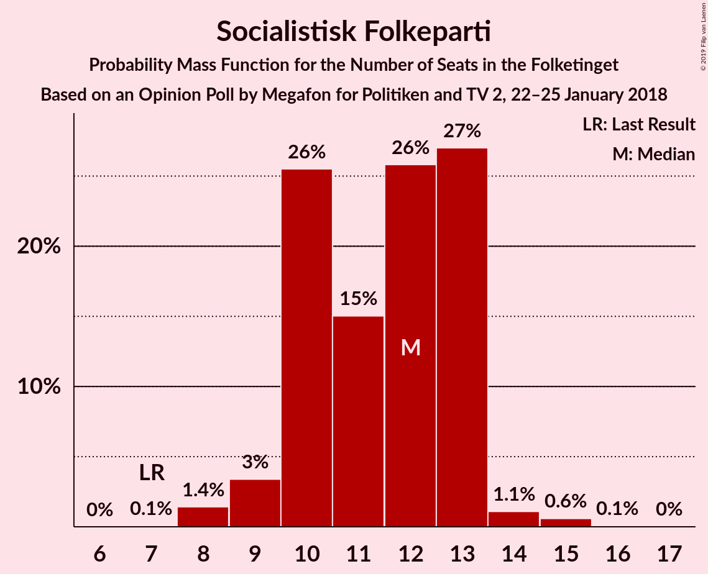
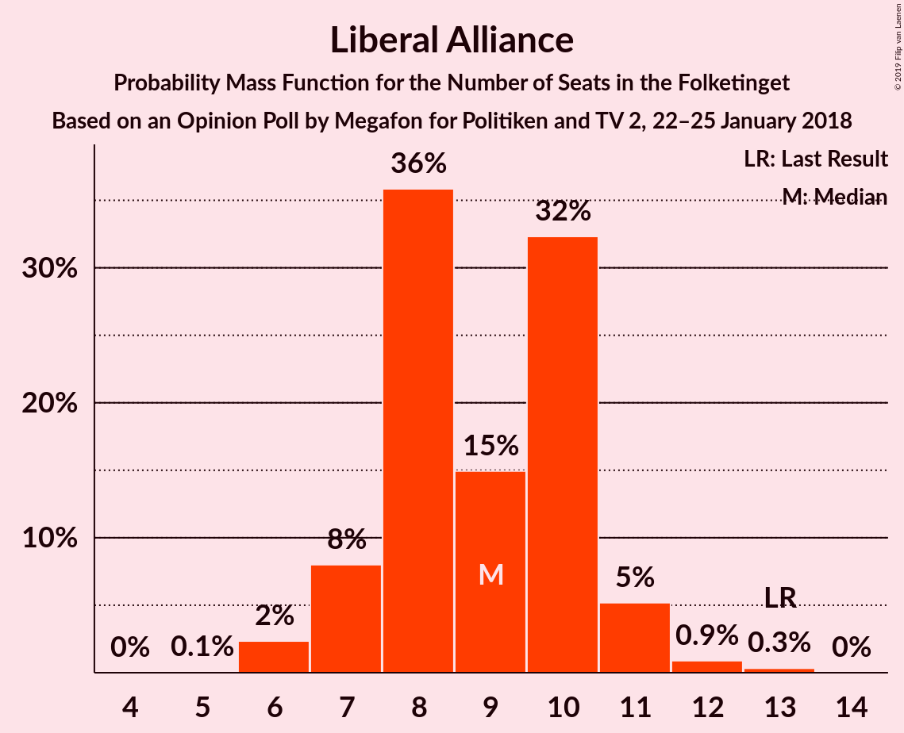

# Opinion Poll by Megafon for Politiken and TV 2, 22–25 January 2018

<a href="#voting-intentions">Voting Intentions</a> | <a href="#seats">Seats</a> | <a href="#coalitions">Coalitions</a> | <a href="#technical-information">Technical Information</a>

## Voting Intentions

### Confidence Intervals

| Party | Last Result | Poll Result | 80% Confidence Interval | 90% Confidence Interval | 95% Confidence Interval | 99% Confidence Interval |
|:-----:|:-----------:|:-----------:|:-----------------------:|:-----------------------:|:-----------------------:|:-----------------------:|
| Socialdemokraterne | 26.3% | 25.9% | 24.2–27.8% |23.7–28.3% |23.3–28.7% |22.5–29.6% |
| Venstre | 19.5% | 20.5% | 18.9–22.2% |18.5–22.7% |18.1–23.1% |17.4–23.9% |
| Dansk Folkeparti | 21.1% | 14.2% | 12.9–15.7% |12.5–16.1% |12.2–16.5% |11.6–17.2% |
| Enhedslisten–De Rød-Grønne | 7.8% | 10.9% | 9.8–12.3% |9.4–12.7% |9.2–13.0% |8.6–13.7% |
| Socialistisk Folkeparti | 4.2% | 6.3% | 5.4–7.4% |5.2–7.7% |5.0–8.0% |4.6–8.5% |
| Radikale Venstre | 4.6% | 5.4% | 4.6–6.4% |4.4–6.7% |4.2–7.0% |3.8–7.5% |
| Liberal Alliance | 7.5% | 4.8% | 4.1–5.8% |3.9–6.1% |3.7–6.3% |3.3–6.8% |
| Alternativet | 4.8% | 3.6% | 3.0–4.5% |2.8–4.8% |2.7–5.0% |2.4–5.4% |
| Det Konservative Folkeparti | 3.4% | 3.6% | 3.0–4.5% |2.8–4.8% |2.7–5.0% |2.4–5.4% |
| Nye Borgerlige | 0.0% | 3.2% | 2.5–4.0% |2.4–4.2% |2.2–4.4% |2.0–4.9% |
| Kristendemokraterne | 0.8% | 1.0% | 0.7–1.5% |0.6–1.7% |0.5–1.8% |0.4–2.1% |

*Note:* The poll result column reflects the actual value used in the calculations. Published results may vary slightly, and in addition be rounded to fewer digits.

## Seats

### Confidence Intervals

| Party | Last Result | Median | 80% Confidence Interval | 90% Confidence Interval | 95% Confidence Interval | 99% Confidence Interval |
|:-----:|:-----------:|:------:|:-----------------------:|:-----------------------:|:-----------------------:|:-----------------------:|
| <a href="#socialdemokraterne">Socialdemokraterne</a> | 47 | 46 | 44–47 |43–48 |42–50 |40–51 |
| <a href="#venstre">Venstre</a> | 34 | 36 | 34–38 |33–40 |32–41 |31–42 |
| <a href="#dansk-folkeparti">Dansk Folkeparti</a> | 37 | 25 | 23–27 |22–28 |22–28 |21–30 |
| <a href="#enhedslisten–de-rød-grønne">Enhedslisten–De Rød-Grønne</a> | 14 | 19 | 17–22 |17–23 |17–23 |15–24 |
| <a href="#socialistisk-folkeparti">Socialistisk Folkeparti</a> | 7 | 12 | 10–13 |10–13 |9–13 |8–15 |
| <a href="#radikale-venstre">Radikale Venstre</a> | 8 | 10 | 8–12 |8–12 |8–12 |7–13 |
| <a href="#liberal-alliance">Liberal Alliance</a> | 13 | 9 | 7–10 |7–11 |7–11 |6–12 |
| <a href="#alternativet">Alternativet</a> | 9 | 7 | 5–8 |5–8 |5–9 |4–9 |
| <a href="#det-konservative-folkeparti">Det Konservative Folkeparti</a> | 6 | 6 | 5–8 |5–9 |5–9 |4–9 |
| <a href="#nye-borgerlige">Nye Borgerlige</a> | 0 | 5 | 5–7 |4–7 |4–7 |4–8 |
| <a href="#kristendemokraterne">Kristendemokraterne</a> | 0 | 0 | 0 |0 |0 |0–3 |

### Socialdemokraterne

*For a full overview of the results for this party, see the [Socialdemokraterne](party-socialdemokraterne.html) page.*

| Number of Seats | Probability | Accumulated | Special Marks |
|:---------------:|:-----------:|:-----------:|:-------------:|
| 37 | 0% | 100% |  |
| 38 | 0.2% | 99.9% |  |
| 39 | 0.1% | 99.8% |  |
| 40 | 0.2% | 99.6% |  |
| 41 | 0.9% | 99.4% |  |
| 42 | 2% | 98% |  |
| 43 | 3% | 97% |  |
| 44 | 22% | 94% |  |
| 45 | 6% | 72% |  |
| 46 | 26% | 66% | Median |
| 47 | 32% | 40% | Last Result |
| 48 | 3% | 8% |  |
| 49 | 1.0% | 5% |  |
| 50 | 2% | 4% |  |
| 51 | 2% | 2% |  |
| 52 | 0.1% | 0.5% |  |
| 53 | 0.4% | 0.4% |  |
| 54 | 0% | 0% |  |

### Venstre

*For a full overview of the results for this party, see the [Venstre](party-venstre.html) page.*

| Number of Seats | Probability | Accumulated | Special Marks |
|:---------------:|:-----------:|:-----------:|:-------------:|
| 30 | 0.2% | 100% |  |
| 31 | 1.0% | 99.7% |  |
| 32 | 3% | 98.8% |  |
| 33 | 2% | 95% |  |
| 34 | 6% | 93% | Last Result |
| 35 | 26% | 87% |  |
| 36 | 12% | 61% | Median |
| 37 | 16% | 49% |  |
| 38 | 25% | 34% |  |
| 39 | 3% | 9% |  |
| 40 | 1.0% | 5% |  |
| 41 | 4% | 4% |  |
| 42 | 0.6% | 0.7% |  |
| 43 | 0% | 0.1% |  |
| 44 | 0% | 0% |  |

### Dansk Folkeparti

*For a full overview of the results for this party, see the [Dansk Folkeparti](party-danskfolkeparti.html) page.*

| Number of Seats | Probability | Accumulated | Special Marks |
|:---------------:|:-----------:|:-----------:|:-------------:|
| 19 | 0.1% | 100% |  |
| 20 | 0.2% | 99.9% |  |
| 21 | 1.4% | 99.7% |  |
| 22 | 5% | 98% |  |
| 23 | 10% | 94% |  |
| 24 | 5% | 84% |  |
| 25 | 56% | 79% | Median |
| 26 | 4% | 24% |  |
| 27 | 11% | 20% |  |
| 28 | 6% | 8% |  |
| 29 | 2% | 2% |  |
| 30 | 0.5% | 0.8% |  |
| 31 | 0.3% | 0.3% |  |
| 32 | 0.1% | 0.1% |  |
| 33 | 0% | 0% |  |
| 34 | 0% | 0% |  |
| 35 | 0% | 0% |  |
| 36 | 0% | 0% |  |
| 37 | 0% | 0% | Last Result |

### Enhedslisten–De Rød-Grønne

*For a full overview of the results for this party, see the [Enhedslisten–De Rød-Grønne](party-enhedslisten–derød-grønne.html) page.*

| Number of Seats | Probability | Accumulated | Special Marks |
|:---------------:|:-----------:|:-----------:|:-------------:|
| 14 | 0.1% | 100% | Last Result |
| 15 | 0.4% | 99.9% |  |
| 16 | 2% | 99.4% |  |
| 17 | 9% | 98% |  |
| 18 | 38% | 89% |  |
| 19 | 29% | 51% | Median |
| 20 | 4% | 21% |  |
| 21 | 4% | 17% |  |
| 22 | 7% | 13% |  |
| 23 | 6% | 6% |  |
| 24 | 0.2% | 0.5% |  |
| 25 | 0.3% | 0.3% |  |
| 26 | 0% | 0% |  |

### Socialistisk Folkeparti

*For a full overview of the results for this party, see the [Socialistisk Folkeparti](party-socialistiskfolkeparti.html) page.*

| Number of Seats | Probability | Accumulated | Special Marks |
|:---------------:|:-----------:|:-----------:|:-------------:|
| 7 | 0.1% | 100% | Last Result |
| 8 | 1.4% | 99.9% |  |
| 9 | 3% | 98.5% |  |
| 10 | 26% | 95% |  |
| 11 | 15% | 70% |  |
| 12 | 26% | 55% | Median |
| 13 | 27% | 29% |  |
| 14 | 1.1% | 2% |  |
| 15 | 0.6% | 0.7% |  |
| 16 | 0.1% | 0.1% |  |
| 17 | 0% | 0% |  |

### Radikale Venstre

*For a full overview of the results for this party, see the [Radikale Venstre](party-radikalevenstre.html) page.*

| Number of Seats | Probability | Accumulated | Special Marks |
|:---------------:|:-----------:|:-----------:|:-------------:|
| 6 | 0.2% | 100% |  |
| 7 | 1.3% | 99.8% |  |
| 8 | 12% | 98% | Last Result |
| 9 | 7% | 87% |  |
| 10 | 57% | 80% | Median |
| 11 | 11% | 22% |  |
| 12 | 10% | 11% |  |
| 13 | 0.8% | 1.0% |  |
| 14 | 0.2% | 0.2% |  |
| 15 | 0% | 0% |  |

### Liberal Alliance

*For a full overview of the results for this party, see the [Liberal Alliance](party-liberalalliance.html) page.*

| Number of Seats | Probability | Accumulated | Special Marks |
|:---------------:|:-----------:|:-----------:|:-------------:|
| 5 | 0.1% | 100% |  |
| 6 | 2% | 99.9% |  |
| 7 | 8% | 98% |  |
| 8 | 36% | 90% |  |
| 9 | 15% | 54% | Median |
| 10 | 32% | 39% |  |
| 11 | 5% | 6% |  |
| 12 | 0.9% | 1.2% |  |
| 13 | 0.3% | 0.3% | Last Result |
| 14 | 0% | 0% |  |

### Alternativet

*For a full overview of the results for this party, see the [Alternativet](party-alternativet.html) page.*

| Number of Seats | Probability | Accumulated | Special Marks |
|:---------------:|:-----------:|:-----------:|:-------------:|
| 0 | 0.1% | 100% |  |
| 1 | 0% | 99.9% |  |
| 2 | 0% | 99.9% |  |
| 3 | 0% | 99.9% |  |
| 4 | 1.3% | 99.9% |  |
| 5 | 10% | 98.6% |  |
| 6 | 36% | 89% |  |
| 7 | 41% | 53% | Median |
| 8 | 9% | 12% |  |
| 9 | 3% | 3% | Last Result |
| 10 | 0.3% | 0.3% |  |
| 11 | 0% | 0% |  |

### Det Konservative Folkeparti

*For a full overview of the results for this party, see the [Det Konservative Folkeparti](party-detkonservativefolkeparti.html) page.*

| Number of Seats | Probability | Accumulated | Special Marks |
|:---------------:|:-----------:|:-----------:|:-------------:|
| 4 | 0.9% | 100% |  |
| 5 | 33% | 99.1% |  |
| 6 | 33% | 66% | Last Result, Median |
| 7 | 15% | 34% |  |
| 8 | 11% | 19% |  |
| 9 | 8% | 8% |  |
| 10 | 0.5% | 0.5% |  |
| 11 | 0% | 0% |  |

### Nye Borgerlige

*For a full overview of the results for this party, see the [Nye Borgerlige](party-nyeborgerlige.html) page.*

| Number of Seats | Probability | Accumulated | Special Marks |
|:---------------:|:-----------:|:-----------:|:-------------:|
| 0 | 0.2% | 100% | Last Result |
| 1 | 0% | 99.8% |  |
| 2 | 0% | 99.8% |  |
| 3 | 0% | 99.8% |  |
| 4 | 5% | 99.8% |  |
| 5 | 58% | 95% | Median |
| 6 | 19% | 37% |  |
| 7 | 16% | 18% |  |
| 8 | 1.3% | 2% |  |
| 9 | 0.2% | 0.3% |  |
| 10 | 0.1% | 0.1% |  |
| 11 | 0% | 0% |  |

### Kristendemokraterne

*For a full overview of the results for this party, see the [Kristendemokraterne](party-kristendemokraterne.html) page.*

| Number of Seats | Probability | Accumulated | Special Marks |
|:---------------:|:-----------:|:-----------:|:-------------:|
| 0 | 99.5% | 100% | Last Result, Median |
| 1 | 0% | 0.5% |  |
| 2 | 0% | 0.5% |  |
| 3 | 0% | 0.5% |  |
| 4 | 0.4% | 0.5% |  |
| 5 | 0% | 0% |  |

## Coalitions

### Confidence Intervals

| Coalition | Last Result | Median | Majority? | 80% Confidence Interval | 90% Confidence Interval | 95% Confidence Interval | 99% Confidence Interval |
|:---------:|:-----------:|:------:|:---------:|:-----------------------:|:-----------------------:|:-----------------------:|:-----------------------:|
| Socialdemokraterne – Enhedslisten–De Rød-Grønne – Socialistisk Folkeparti – Radikale Venstre – Alternativet | 85 | 93 | 86% | 89–95 | 87–95 | 86–96 | 86–100 |
| Socialdemokraterne – Enhedslisten–De Rød-Grønne – Socialistisk Folkeparti – Radikale Venstre | 76 | 87 | 3% | 82–88 | 80–89 | 80–90 | 79–94 |
| Venstre – Dansk Folkeparti – Liberal Alliance – Det Konservative Folkeparti – Nye Borgerlige – Kristendemokraterne | 90 | 82 | 0.3% | 80–86 | 80–88 | 79–89 | 75–89 |
| Venstre – Dansk Folkeparti – Liberal Alliance – Det Konservative Folkeparti – Nye Borgerlige | 90 | 82 | 0.3% | 80–86 | 80–88 | 78–89 | 75–89 |
| Socialdemokraterne – Enhedslisten–De Rød-Grønne – Socialistisk Folkeparti – Alternativet | 77 | 83 | 0.8% | 79–86 | 78–86 | 78–86 | 76–90 |
| Venstre – Dansk Folkeparti – Liberal Alliance – Det Konservative Folkeparti – Kristendemokraterne | 90 | 76 | 0% | 74–80 | 74–82 | 73–82 | 69–83 |
| Venstre – Dansk Folkeparti – Liberal Alliance – Det Konservative Folkeparti | 90 | 76 | 0% | 74–80 | 74–82 | 73–82 | 69–83 |
| Socialdemokraterne – Enhedslisten–De Rød-Grønne – Socialistisk Folkeparti | 68 | 77 | 0% | 72–78 | 72–79 | 72–80 | 70–84 |
| Socialdemokraterne – Socialistisk Folkeparti – Radikale Venstre | 62 | 68 | 0% | 64–70 | 63–70 | 63–70 | 61–73 |
| Socialdemokraterne – Radikale Venstre | 55 | 56 | 0% | 52–59 | 52–59 | 52–60 | 49–61 |
| Venstre – Liberal Alliance – Det Konservative Folkeparti | 53 | 51 | 0% | 50–55 | 48–56 | 47–58 | 45–58 |
| Venstre – Det Konservative Folkeparti | 40 | 43 | 0% | 40–47 | 40–47 | 39–48 | 37–48 |
| Venstre | 34 | 36 | 0% | 34–38 | 33–40 | 32–41 | 31–42 |

### Socialdemokraterne – Enhedslisten–De Rød-Grønne – Socialistisk Folkeparti – Radikale Venstre – Alternativet

| Number of Seats | Probability | Accumulated | Special Marks |
|:---------------:|:-----------:|:-----------:|:-------------:|
| 84 | 0% | 100% |  |
| 85 | 0.3% | 99.9% | Last Result |
| 86 | 3% | 99.7% |  |
| 87 | 1.5% | 96% |  |
| 88 | 3% | 95% |  |
| 89 | 6% | 92% |  |
| 90 | 3% | 86% | Majority |
| 91 | 8% | 83% |  |
| 92 | 7% | 75% |  |
| 93 | 20% | 68% |  |
| 94 | 14% | 48% | Median |
| 95 | 30% | 33% |  |
| 96 | 0.9% | 3% |  |
| 97 | 0.5% | 2% |  |
| 98 | 0.5% | 2% |  |
| 99 | 0.8% | 1.4% |  |
| 100 | 0.5% | 0.7% |  |
| 101 | 0.2% | 0.2% |  |
| 102 | 0% | 0% |  |

### Socialdemokraterne – Enhedslisten–De Rød-Grønne – Socialistisk Folkeparti – Radikale Venstre

| Number of Seats | Probability | Accumulated | Special Marks |
|:---------------:|:-----------:|:-----------:|:-------------:|
| 76 | 0% | 100% | Last Result |
| 77 | 0% | 100% |  |
| 78 | 0.2% | 99.9% |  |
| 79 | 0.4% | 99.8% |  |
| 80 | 5% | 99.3% |  |
| 81 | 1.1% | 94% |  |
| 82 | 6% | 93% |  |
| 83 | 3% | 87% |  |
| 84 | 3% | 84% |  |
| 85 | 3% | 81% |  |
| 86 | 16% | 78% |  |
| 87 | 24% | 62% | Median |
| 88 | 32% | 38% |  |
| 89 | 3% | 6% |  |
| 90 | 0.7% | 3% | Majority |
| 91 | 0.5% | 2% |  |
| 92 | 0.6% | 2% |  |
| 93 | 0.3% | 0.9% |  |
| 94 | 0.6% | 0.7% |  |
| 95 | 0% | 0% |  |

### Venstre – Dansk Folkeparti – Liberal Alliance – Det Konservative Folkeparti – Nye Borgerlige – Kristendemokraterne

| Number of Seats | Probability | Accumulated | Special Marks |
|:---------------:|:-----------:|:-----------:|:-------------:|
| 74 | 0.2% | 100% |  |
| 75 | 0.5% | 99.8% |  |
| 76 | 0.8% | 99.3% |  |
| 77 | 0.5% | 98.6% |  |
| 78 | 0.5% | 98% |  |
| 79 | 0.9% | 98% |  |
| 80 | 30% | 97% |  |
| 81 | 14% | 67% | Median |
| 82 | 20% | 52% |  |
| 83 | 7% | 32% |  |
| 84 | 8% | 25% |  |
| 85 | 3% | 17% |  |
| 86 | 6% | 14% |  |
| 87 | 3% | 8% |  |
| 88 | 1.5% | 5% |  |
| 89 | 3% | 4% |  |
| 90 | 0.3% | 0.3% | Last Result, Majority |
| 91 | 0% | 0.1% |  |
| 92 | 0% | 0% |  |

### Venstre – Dansk Folkeparti – Liberal Alliance – Det Konservative Folkeparti – Nye Borgerlige

| Number of Seats | Probability | Accumulated | Special Marks |
|:---------------:|:-----------:|:-----------:|:-------------:|
| 74 | 0.2% | 100% |  |
| 75 | 0.5% | 99.8% |  |
| 76 | 0.8% | 99.3% |  |
| 77 | 0.5% | 98.5% |  |
| 78 | 0.6% | 98% |  |
| 79 | 1.0% | 97% |  |
| 80 | 30% | 96% |  |
| 81 | 14% | 66% | Median |
| 82 | 20% | 52% |  |
| 83 | 6% | 32% |  |
| 84 | 8% | 25% |  |
| 85 | 3% | 17% |  |
| 86 | 6% | 14% |  |
| 87 | 3% | 8% |  |
| 88 | 1.4% | 5% |  |
| 89 | 3% | 4% |  |
| 90 | 0.3% | 0.3% | Last Result, Majority |
| 91 | 0% | 0% |  |

### Socialdemokraterne – Enhedslisten–De Rød-Grønne – Socialistisk Folkeparti – Alternativet

| Number of Seats | Probability | Accumulated | Special Marks |
|:---------------:|:-----------:|:-----------:|:-------------:|
| 74 | 0.1% | 100% |  |
| 75 | 0.1% | 99.9% |  |
| 76 | 0.6% | 99.8% |  |
| 77 | 1.3% | 99.3% | Last Result |
| 78 | 4% | 98% |  |
| 79 | 7% | 94% |  |
| 80 | 5% | 87% |  |
| 81 | 12% | 82% |  |
| 82 | 11% | 70% |  |
| 83 | 19% | 60% |  |
| 84 | 5% | 41% | Median |
| 85 | 25% | 36% |  |
| 86 | 9% | 11% |  |
| 87 | 0.5% | 2% |  |
| 88 | 0.8% | 2% |  |
| 89 | 0.4% | 1.1% |  |
| 90 | 0.3% | 0.8% | Majority |
| 91 | 0.3% | 0.5% |  |
| 92 | 0.1% | 0.1% |  |
| 93 | 0% | 0% |  |

### Venstre – Dansk Folkeparti – Liberal Alliance – Det Konservative Folkeparti – Kristendemokraterne

| Number of Seats | Probability | Accumulated | Special Marks |
|:---------------:|:-----------:|:-----------:|:-------------:|
| 68 | 0.1% | 100% |  |
| 69 | 0.5% | 99.9% |  |
| 70 | 0.5% | 99.4% |  |
| 71 | 0.3% | 98.9% |  |
| 72 | 0.8% | 98.6% |  |
| 73 | 1.1% | 98% |  |
| 74 | 8% | 97% |  |
| 75 | 26% | 89% |  |
| 76 | 14% | 63% | Median |
| 77 | 25% | 48% |  |
| 78 | 4% | 23% |  |
| 79 | 3% | 19% |  |
| 80 | 8% | 16% |  |
| 81 | 3% | 8% |  |
| 82 | 5% | 5% |  |
| 83 | 0.3% | 0.7% |  |
| 84 | 0.3% | 0.4% |  |
| 85 | 0% | 0.1% |  |
| 86 | 0% | 0% |  |
| 87 | 0% | 0% |  |
| 88 | 0% | 0% |  |
| 89 | 0% | 0% |  |
| 90 | 0% | 0% | Last Result, Majority |

### Venstre – Dansk Folkeparti – Liberal Alliance – Det Konservative Folkeparti

| Number of Seats | Probability | Accumulated | Special Marks |
|:---------------:|:-----------:|:-----------:|:-------------:|
| 68 | 0.1% | 100% |  |
| 69 | 0.5% | 99.9% |  |
| 70 | 0.5% | 99.4% |  |
| 71 | 0.3% | 98.9% |  |
| 72 | 0.9% | 98.5% |  |
| 73 | 1.1% | 98% |  |
| 74 | 8% | 96% |  |
| 75 | 26% | 89% |  |
| 76 | 14% | 63% | Median |
| 77 | 25% | 48% |  |
| 78 | 4% | 23% |  |
| 79 | 3% | 19% |  |
| 80 | 8% | 16% |  |
| 81 | 3% | 8% |  |
| 82 | 5% | 5% |  |
| 83 | 0.3% | 0.6% |  |
| 84 | 0.2% | 0.3% |  |
| 85 | 0% | 0.1% |  |
| 86 | 0% | 0% |  |
| 87 | 0% | 0% |  |
| 88 | 0% | 0% |  |
| 89 | 0% | 0% |  |
| 90 | 0% | 0% | Last Result, Majority |

### Socialdemokraterne – Enhedslisten–De Rød-Grønne – Socialistisk Folkeparti

| Number of Seats | Probability | Accumulated | Special Marks |
|:---------------:|:-----------:|:-----------:|:-------------:|
| 68 | 0.1% | 100% | Last Result |
| 69 | 0.2% | 99.9% |  |
| 70 | 0.7% | 99.7% |  |
| 71 | 0.4% | 99.0% |  |
| 72 | 11% | 98.6% |  |
| 73 | 4% | 87% |  |
| 74 | 4% | 83% |  |
| 75 | 6% | 79% |  |
| 76 | 17% | 73% |  |
| 77 | 19% | 56% | Median |
| 78 | 27% | 37% |  |
| 79 | 7% | 9% |  |
| 80 | 1.0% | 3% |  |
| 81 | 0.4% | 2% |  |
| 82 | 0.4% | 1.5% |  |
| 83 | 0.5% | 1.0% |  |
| 84 | 0.3% | 0.6% |  |
| 85 | 0.3% | 0.3% |  |
| 86 | 0% | 0% |  |

### Socialdemokraterne – Socialistisk Folkeparti – Radikale Venstre

| Number of Seats | Probability | Accumulated | Special Marks |
|:---------------:|:-----------:|:-----------:|:-------------:|
| 57 | 0.1% | 100% |  |
| 58 | 0% | 99.9% |  |
| 59 | 0.2% | 99.9% |  |
| 60 | 0.1% | 99.7% |  |
| 61 | 0.6% | 99.6% |  |
| 62 | 1.1% | 99.0% | Last Result |
| 63 | 7% | 98% |  |
| 64 | 16% | 91% |  |
| 65 | 4% | 75% |  |
| 66 | 4% | 71% |  |
| 67 | 5% | 67% |  |
| 68 | 23% | 62% | Median |
| 69 | 11% | 39% |  |
| 70 | 26% | 28% |  |
| 71 | 0.8% | 2% |  |
| 72 | 0.5% | 1.2% |  |
| 73 | 0.2% | 0.7% |  |
| 74 | 0.3% | 0.5% |  |
| 75 | 0.2% | 0.2% |  |
| 76 | 0% | 0% |  |

### Socialdemokraterne – Radikale Venstre

| Number of Seats | Probability | Accumulated | Special Marks |
|:---------------:|:-----------:|:-----------:|:-------------:|
| 47 | 0% | 100% |  |
| 48 | 0.2% | 99.9% |  |
| 49 | 0.5% | 99.7% |  |
| 50 | 0.4% | 99.2% |  |
| 51 | 0.9% | 98.8% |  |
| 52 | 8% | 98% |  |
| 53 | 5% | 90% |  |
| 54 | 12% | 84% |  |
| 55 | 6% | 72% | Last Result |
| 56 | 20% | 66% | Median |
| 57 | 29% | 46% |  |
| 58 | 7% | 17% |  |
| 59 | 7% | 10% |  |
| 60 | 2% | 3% |  |
| 61 | 0.4% | 0.8% |  |
| 62 | 0.2% | 0.4% |  |
| 63 | 0.1% | 0.1% |  |
| 64 | 0% | 0.1% |  |
| 65 | 0% | 0% |  |

### Venstre – Liberal Alliance – Det Konservative Folkeparti

| Number of Seats | Probability | Accumulated | Special Marks |
|:---------------:|:-----------:|:-----------:|:-------------:|
| 43 | 0.1% | 100% |  |
| 44 | 0.4% | 99.9% |  |
| 45 | 0.2% | 99.5% |  |
| 46 | 0.6% | 99.3% |  |
| 47 | 3% | 98.7% |  |
| 48 | 3% | 96% |  |
| 49 | 2% | 93% |  |
| 50 | 32% | 91% |  |
| 51 | 18% | 59% | Median |
| 52 | 17% | 41% |  |
| 53 | 4% | 24% | Last Result |
| 54 | 4% | 20% |  |
| 55 | 10% | 17% |  |
| 56 | 2% | 6% |  |
| 57 | 0.7% | 4% |  |
| 58 | 3% | 4% |  |
| 59 | 0.1% | 0.2% |  |
| 60 | 0.1% | 0.1% |  |
| 61 | 0% | 0% |  |

### Venstre – Det Konservative Folkeparti

| Number of Seats | Probability | Accumulated | Special Marks |
|:---------------:|:-----------:|:-----------:|:-------------:|
| 36 | 0.3% | 100% |  |
| 37 | 0.4% | 99.6% |  |
| 38 | 1.5% | 99.3% |  |
| 39 | 3% | 98% |  |
| 40 | 28% | 95% | Last Result |
| 41 | 8% | 67% |  |
| 42 | 3% | 59% | Median |
| 43 | 12% | 56% |  |
| 44 | 27% | 45% |  |
| 45 | 5% | 17% |  |
| 46 | 2% | 13% |  |
| 47 | 7% | 11% |  |
| 48 | 4% | 4% |  |
| 49 | 0.3% | 0.4% |  |
| 50 | 0% | 0.1% |  |
| 51 | 0% | 0.1% |  |
| 52 | 0% | 0% |  |

### Venstre

| Number of Seats | Probability | Accumulated | Special Marks |
|:---------------:|:-----------:|:-----------:|:-------------:|
| 30 | 0.2% | 100% |  |
| 31 | 1.0% | 99.7% |  |
| 32 | 3% | 98.8% |  |
| 33 | 2% | 95% |  |
| 34 | 6% | 93% | Last Result |
| 35 | 26% | 87% |  |
| 36 | 12% | 61% | Median |
| 37 | 16% | 49% |  |
| 38 | 25% | 34% |  |
| 39 | 3% | 9% |  |
| 40 | 1.0% | 5% |  |
| 41 | 4% | 4% |  |
| 42 | 0.6% | 0.7% |  |
| 43 | 0% | 0.1% |  |
| 44 | 0% | 0% |  |

## Technical Information

### Opinion Poll

+ **Polling firm:** Megafon
+ **Commissioner(s):** Politiken and TV 2
+ **Fieldwork period:** 22–25 January 2018

### Calculations

+ **Sample size:** 1014
+ **Simulations done:** 1,048,576
+ **Error estimate:** 1.65%

