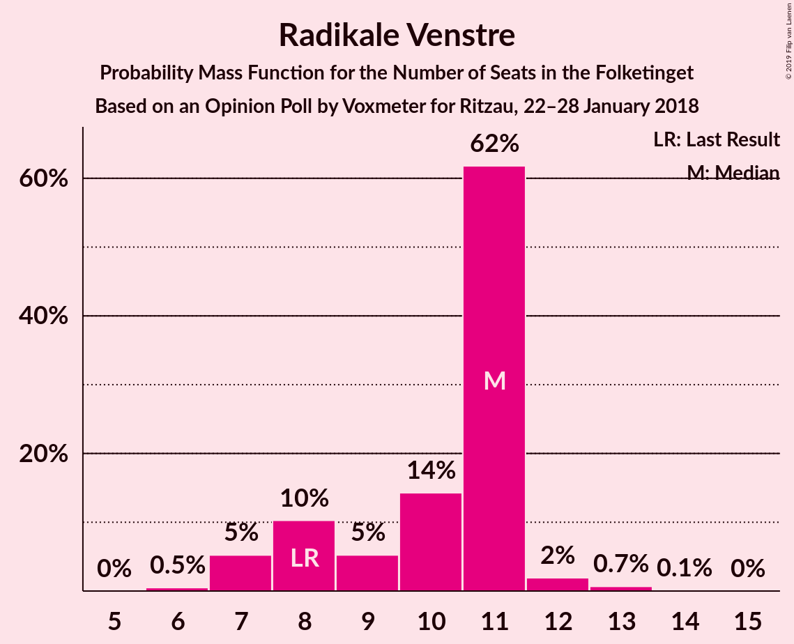
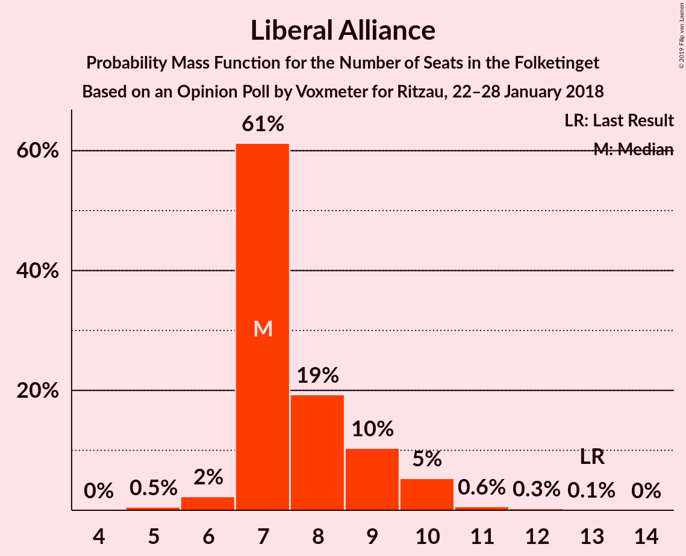
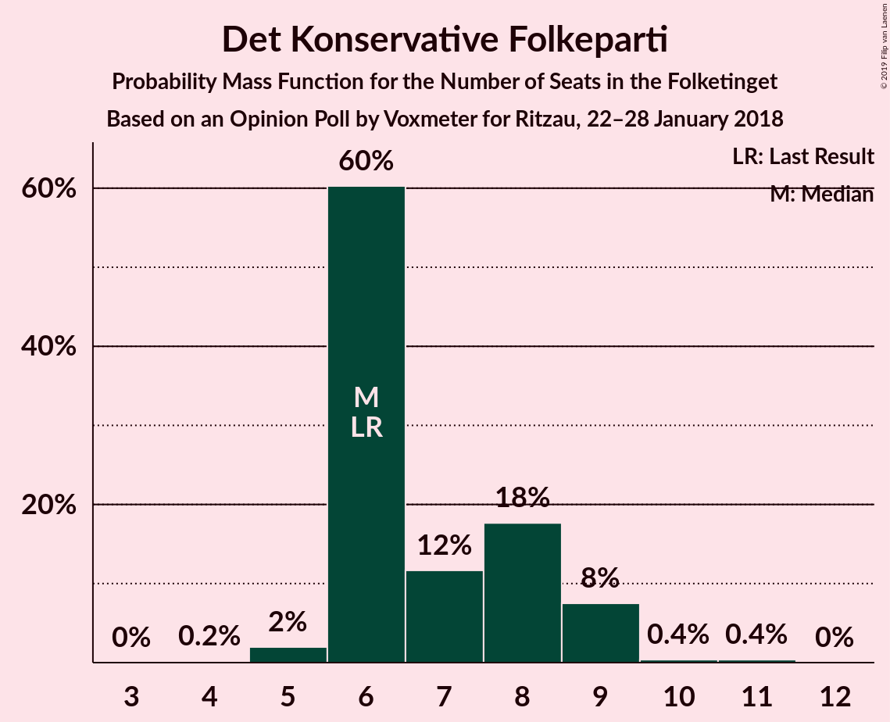

# Opinion Poll by Voxmeter for Ritzau, 22–28 January 2018

<a href="#voting-intentions">Voting Intentions</a> | <a href="#seats">Seats</a> | <a href="#coalitions">Coalitions</a> | <a href="#technical-information">Technical Information</a>

## Voting Intentions

### Confidence Intervals

| Party | Last Result | Poll Result | 80% Confidence Interval | 90% Confidence Interval | 95% Confidence Interval | 99% Confidence Interval |
|:-----:|:-----------:|:-----------:|:-----------------------:|:-----------------------:|:-----------------------:|:-----------------------:|
| Socialdemokraterne | 26.3% | 28.9% | 27.1–30.8% |26.6–31.3% |26.2–31.8% |25.4–32.7% |
| Venstre | 19.5% | 20.3% | 18.7–21.9% |18.3–22.4% |17.9–22.8% |17.2–23.7% |
| Dansk Folkeparti | 21.1% | 17.3% | 15.9–18.9% |15.5–19.4% |15.1–19.8% |14.4–20.5% |
| Enhedslisten–De Rød-Grønne | 7.8% | 8.1% | 7.1–9.3% |6.8–9.6% |6.5–9.9% |6.1–10.5% |
| Radikale Venstre | 4.6% | 5.1% | 4.3–6.1% |4.1–6.4% |3.9–6.6% |3.6–7.2% |
| Socialistisk Folkeparti | 4.2% | 4.7% | 4.0–5.7% |3.7–6.0% |3.6–6.2% |3.2–6.7% |
| Liberal Alliance | 7.5% | 4.6% | 3.9–5.6% |3.7–5.9% |3.5–6.1% |3.2–6.6% |
| Alternativet | 4.8% | 4.5% | 3.8–5.5% |3.6–5.7% |3.4–6.0% |3.1–6.5% |
| Det Konservative Folkeparti | 3.4% | 3.8% | 3.2–4.7% |3.0–5.0% |2.8–5.2% |2.5–5.7% |
| Nye Borgerlige | 0.0% | 1.7% | 1.2–2.3% |1.1–2.5% |1.0–2.7% |0.9–3.0% |
| Kristendemokraterne | 0.8% | 0.6% | 0.4–1.0% |0.3–1.2% |0.3–1.3% |0.2–1.5% |

*Note:* The poll result column reflects the actual value used in the calculations. Published results may vary slightly, and in addition be rounded to fewer digits.

## Seats

### Confidence Intervals

| Party | Last Result | Median | 80% Confidence Interval | 90% Confidence Interval | 95% Confidence Interval | 99% Confidence Interval |
|:-----:|:-----------:|:------:|:-----------------------:|:-----------------------:|:-----------------------:|:-----------------------:|
| <a href="#socialdemokraterne">Socialdemokraterne</a> | 47 | 53 | 49–57 |48–59 |48–59 |46–60 |
| <a href="#venstre">Venstre</a> | 34 | 37 | 33–38 |32–39 |32–39 |30–42 |
| <a href="#dansk-folkeparti">Dansk Folkeparti</a> | 37 | 29 | 26–32 |26–33 |26–33 |26–36 |
| <a href="#enhedslisten–de-rød-grønne">Enhedslisten–De Rød-Grønne</a> | 14 | 14 | 12–16 |12–17 |11–17 |11–18 |
| <a href="#radikale-venstre">Radikale Venstre</a> | 8 | 9 | 7–11 |7–12 |6–12 |6–13 |
| <a href="#socialistisk-folkeparti">Socialistisk Folkeparti</a> | 7 | 8 | 7–9 |7–10 |6–10 |6–12 |
| <a href="#liberal-alliance">Liberal Alliance</a> | 13 | 8 | 7–10 |7–10 |7–10 |6–12 |
| <a href="#alternativet">Alternativet</a> | 9 | 8 | 8–9 |7–10 |7–10 |5–11 |
| <a href="#det-konservative-folkeparti">Det Konservative Folkeparti</a> | 6 | 8 | 6–9 |5–9 |5–9 |5–10 |
| <a href="#nye-borgerlige">Nye Borgerlige</a> | 0 | 0 | 0–4 |0–5 |0–5 |0–5 |
| <a href="#kristendemokraterne">Kristendemokraterne</a> | 0 | 0 | 0 |0 |0 |0 |

### Socialdemokraterne

*For a full overview of the results for this party, see the [Socialdemokraterne](party-socialdemokraterne.html) page.*

| Number of Seats | Probability | Accumulated | Special Marks |
|:---------------:|:-----------:|:-----------:|:-------------:|
| 44 | 0.1% | 100% |  |
| 45 | 0.3% | 99.9% |  |
| 46 | 0.4% | 99.6% |  |
| 47 | 2% | 99.2% | Last Result |
| 48 | 6% | 98% |  |
| 49 | 4% | 91% |  |
| 50 | 3% | 88% |  |
| 51 | 5% | 85% |  |
| 52 | 27% | 80% |  |
| 53 | 32% | 53% | Median |
| 54 | 0.3% | 21% |  |
| 55 | 0.2% | 20% |  |
| 56 | 0% | 20% |  |
| 57 | 14% | 20% |  |
| 58 | 0.4% | 6% |  |
| 59 | 5% | 6% |  |
| 60 | 0.7% | 0.7% |  |
| 61 | 0% | 0% |  |

### Venstre

*For a full overview of the results for this party, see the [Venstre](party-venstre.html) page.*

| Number of Seats | Probability | Accumulated | Special Marks |
|:---------------:|:-----------:|:-----------:|:-------------:|
| 28 | 0.1% | 100% |  |
| 29 | 0.4% | 99.9% |  |
| 30 | 0.1% | 99.6% |  |
| 31 | 0.1% | 99.5% |  |
| 32 | 6% | 99.4% |  |
| 33 | 18% | 93% |  |
| 34 | 2% | 75% | Last Result |
| 35 | 1.1% | 73% |  |
| 36 | 8% | 72% |  |
| 37 | 31% | 65% | Median |
| 38 | 25% | 34% |  |
| 39 | 7% | 9% |  |
| 40 | 1.3% | 2% |  |
| 41 | 0.1% | 1.0% |  |
| 42 | 0.8% | 0.9% |  |
| 43 | 0.1% | 0.1% |  |
| 44 | 0% | 0% |  |

### Dansk Folkeparti

*For a full overview of the results for this party, see the [Dansk Folkeparti](party-danskfolkeparti.html) page.*

| Number of Seats | Probability | Accumulated | Special Marks |
|:---------------:|:-----------:|:-----------:|:-------------:|
| 25 | 0.1% | 100% |  |
| 26 | 21% | 99.9% |  |
| 27 | 1.2% | 79% |  |
| 28 | 26% | 78% |  |
| 29 | 9% | 52% | Median |
| 30 | 11% | 43% |  |
| 31 | 13% | 31% |  |
| 32 | 11% | 19% |  |
| 33 | 6% | 8% |  |
| 34 | 1.0% | 2% |  |
| 35 | 0.1% | 0.9% |  |
| 36 | 0.5% | 0.7% |  |
| 37 | 0.1% | 0.2% | Last Result |
| 38 | 0.1% | 0.1% |  |
| 39 | 0.1% | 0.1% |  |
| 40 | 0% | 0% |  |

### Enhedslisten–De Rød-Grønne

*For a full overview of the results for this party, see the [Enhedslisten–De Rød-Grønne](party-enhedslisten–derød-grønne.html) page.*

| Number of Seats | Probability | Accumulated | Special Marks |
|:---------------:|:-----------:|:-----------:|:-------------:|
| 9 | 0.1% | 100% |  |
| 10 | 0% | 99.9% |  |
| 11 | 4% | 99.9% |  |
| 12 | 8% | 96% |  |
| 13 | 18% | 88% |  |
| 14 | 26% | 71% | Last Result, Median |
| 15 | 23% | 44% |  |
| 16 | 11% | 21% |  |
| 17 | 9% | 10% |  |
| 18 | 0.7% | 1.0% |  |
| 19 | 0.2% | 0.2% |  |
| 20 | 0% | 0% |  |

### Radikale Venstre

*For a full overview of the results for this party, see the [Radikale Venstre](party-radikalevenstre.html) page.*

| Number of Seats | Probability | Accumulated | Special Marks |
|:---------------:|:-----------:|:-----------:|:-------------:|
| 6 | 3% | 100% |  |
| 7 | 10% | 97% |  |
| 8 | 14% | 87% | Last Result |
| 9 | 29% | 73% | Median |
| 10 | 16% | 44% |  |
| 11 | 21% | 28% |  |
| 12 | 6% | 7% |  |
| 13 | 0.2% | 0.5% |  |
| 14 | 0.4% | 0.4% |  |
| 15 | 0% | 0% |  |

### Socialistisk Folkeparti

*For a full overview of the results for this party, see the [Socialistisk Folkeparti](party-socialistiskfolkeparti.html) page.*

| Number of Seats | Probability | Accumulated | Special Marks |
|:---------------:|:-----------:|:-----------:|:-------------:|
| 5 | 0.2% | 100% |  |
| 6 | 4% | 99.8% |  |
| 7 | 38% | 96% | Last Result |
| 8 | 20% | 58% | Median |
| 9 | 29% | 38% |  |
| 10 | 8% | 10% |  |
| 11 | 0.6% | 1.3% |  |
| 12 | 0.3% | 0.7% |  |
| 13 | 0.3% | 0.4% |  |
| 14 | 0% | 0% |  |

### Liberal Alliance

*For a full overview of the results for this party, see the [Liberal Alliance](party-liberalalliance.html) page.*

| Number of Seats | Probability | Accumulated | Special Marks |
|:---------------:|:-----------:|:-----------:|:-------------:|
| 5 | 0.4% | 100% |  |
| 6 | 0.8% | 99.5% |  |
| 7 | 10% | 98.8% |  |
| 8 | 73% | 88% | Median |
| 9 | 3% | 15% |  |
| 10 | 10% | 13% |  |
| 11 | 2% | 2% |  |
| 12 | 0.7% | 0.7% |  |
| 13 | 0% | 0% | Last Result |

### Alternativet

*For a full overview of the results for this party, see the [Alternativet](party-alternativet.html) page.*

| Number of Seats | Probability | Accumulated | Special Marks |
|:---------------:|:-----------:|:-----------:|:-------------:|
| 5 | 0.6% | 100% |  |
| 6 | 0.7% | 99.4% |  |
| 7 | 8% | 98.7% |  |
| 8 | 44% | 91% | Median |
| 9 | 41% | 48% | Last Result |
| 10 | 6% | 7% |  |
| 11 | 0.4% | 0.7% |  |
| 12 | 0.1% | 0.3% |  |
| 13 | 0% | 0.2% |  |
| 14 | 0.2% | 0.2% |  |
| 15 | 0% | 0% |  |

### Det Konservative Folkeparti

*For a full overview of the results for this party, see the [Det Konservative Folkeparti](party-detkonservativefolkeparti.html) page.*

| Number of Seats | Probability | Accumulated | Special Marks |
|:---------------:|:-----------:|:-----------:|:-------------:|
| 4 | 0.1% | 100% |  |
| 5 | 10% | 99.9% |  |
| 6 | 10% | 90% | Last Result |
| 7 | 24% | 81% |  |
| 8 | 7% | 56% | Median |
| 9 | 48% | 50% |  |
| 10 | 2% | 2% |  |
| 11 | 0.1% | 0.1% |  |
| 12 | 0% | 0% |  |

### Nye Borgerlige

*For a full overview of the results for this party, see the [Nye Borgerlige](party-nyeborgerlige.html) page.*

| Number of Seats | Probability | Accumulated | Special Marks |
|:---------------:|:-----------:|:-----------:|:-------------:|
| 0 | 87% | 100% | Last Result, Median |
| 1 | 0% | 13% |  |
| 2 | 0% | 13% |  |
| 3 | 0% | 13% |  |
| 4 | 3% | 13% |  |
| 5 | 9% | 10% |  |
| 6 | 0.1% | 0.1% |  |
| 7 | 0% | 0% |  |

### Kristendemokraterne

*For a full overview of the results for this party, see the [Kristendemokraterne](party-kristendemokraterne.html) page.*

| Number of Seats | Probability | Accumulated | Special Marks |
|:---------------:|:-----------:|:-----------:|:-------------:|
| 0 | 100% | 100% | Last Result, Median |

## Coalitions

### Confidence Intervals

| Coalition | Last Result | Median | Majority? | 80% Confidence Interval | 90% Confidence Interval | 95% Confidence Interval | 99% Confidence Interval |
|:---------:|:-----------:|:------:|:---------:|:-----------------------:|:-----------------------:|:-----------------------:|:-----------------------:|
| Socialdemokraterne – Enhedslisten–De Rød-Grønne – Radikale Venstre – Socialistisk Folkeparti – Alternativet | 85 | 93 | 86% | 89–96 | 88–99 | 88–99 | 87–99 |
| Socialdemokraterne – Enhedslisten–De Rød-Grønne – Radikale Venstre – Socialistisk Folkeparti | 76 | 85 | 6% | 81–88 | 80–90 | 80–90 | 78–91 |
| Socialdemokraterne – Enhedslisten–De Rød-Grønne – Socialistisk Folkeparti – Alternativet | 77 | 84 | 0.8% | 79–88 | 77–89 | 77–89 | 77–91 |
| Venstre – Dansk Folkeparti – Liberal Alliance – Det Konservative Folkeparti – Nye Borgerlige – Kristendemokraterne | 90 | 82 | 0.2% | 79–86 | 76–87 | 76–87 | 76–88 |
| Venstre – Dansk Folkeparti – Liberal Alliance – Det Konservative Folkeparti – Nye Borgerlige | 90 | 82 | 0.2% | 79–86 | 76–87 | 76–87 | 76–88 |
| Venstre – Dansk Folkeparti – Liberal Alliance – Det Konservative Folkeparti – Kristendemokraterne | 90 | 81 | 0.1% | 79–85 | 76–86 | 76–86 | 76–88 |
| Venstre – Dansk Folkeparti – Liberal Alliance – Det Konservative Folkeparti | 90 | 81 | 0.1% | 79–85 | 76–86 | 76–86 | 76–88 |
| Socialdemokraterne – Enhedslisten–De Rød-Grønne – Socialistisk Folkeparti | 68 | 75 | 0% | 71–80 | 68–80 | 68–80 | 68–82 |
| Socialdemokraterne – Radikale Venstre – Socialistisk Folkeparti | 62 | 70 | 0% | 68–72 | 66–77 | 65–77 | 63–77 |
| Socialdemokraterne – Radikale Venstre | 55 | 62 | 0% | 59–65 | 59–69 | 57–69 | 53–69 |
| Venstre – Liberal Alliance – Det Konservative Folkeparti | 53 | 54 | 0% | 48–55 | 46–55 | 46–55 | 45–59 |
| Venstre – Det Konservative Folkeparti | 40 | 46 | 0% | 40–47 | 38–47 | 38–48 | 38–48 |
| Venstre | 34 | 37 | 0% | 33–38 | 32–39 | 32–39 | 30–42 |

### Socialdemokraterne – Enhedslisten–De Rød-Grønne – Radikale Venstre – Socialistisk Folkeparti – Alternativet

| Number of Seats | Probability | Accumulated | Special Marks |
|:---------------:|:-----------:|:-----------:|:-------------:|
| 83 | 0% | 100% |  |
| 84 | 0.1% | 99.9% |  |
| 85 | 0% | 99.9% | Last Result |
| 86 | 0.1% | 99.8% |  |
| 87 | 1.0% | 99.8% |  |
| 88 | 4% | 98.7% |  |
| 89 | 9% | 94% |  |
| 90 | 9% | 86% | Majority |
| 91 | 0.8% | 76% |  |
| 92 | 1.4% | 76% | Median |
| 93 | 29% | 74% |  |
| 94 | 28% | 46% |  |
| 95 | 0.8% | 18% |  |
| 96 | 11% | 17% |  |
| 97 | 0.6% | 7% |  |
| 98 | 0% | 6% |  |
| 99 | 6% | 6% |  |
| 100 | 0.3% | 0.4% |  |
| 101 | 0.1% | 0.1% |  |
| 102 | 0% | 0% |  |

### Socialdemokraterne – Enhedslisten–De Rød-Grønne – Radikale Venstre – Socialistisk Folkeparti

| Number of Seats | Probability | Accumulated | Special Marks |
|:---------------:|:-----------:|:-----------:|:-------------:|
| 74 | 0.1% | 100% |  |
| 75 | 0% | 99.9% |  |
| 76 | 0% | 99.9% | Last Result |
| 77 | 0.1% | 99.9% |  |
| 78 | 0.6% | 99.8% |  |
| 79 | 1.0% | 99.1% |  |
| 80 | 8% | 98% |  |
| 81 | 7% | 90% |  |
| 82 | 7% | 83% |  |
| 83 | 5% | 76% |  |
| 84 | 1.0% | 71% | Median |
| 85 | 48% | 70% |  |
| 86 | 3% | 22% |  |
| 87 | 1.3% | 19% |  |
| 88 | 11% | 17% |  |
| 89 | 0.2% | 7% |  |
| 90 | 6% | 6% | Majority |
| 91 | 0.4% | 0.5% |  |
| 92 | 0% | 0.2% |  |
| 93 | 0.1% | 0.1% |  |
| 94 | 0% | 0% |  |

### Socialdemokraterne – Enhedslisten–De Rød-Grønne – Socialistisk Folkeparti – Alternativet

| Number of Seats | Probability | Accumulated | Special Marks |
|:---------------:|:-----------:|:-----------:|:-------------:|
| 74 | 0% | 100% |  |
| 75 | 0.1% | 99.9% |  |
| 76 | 0.2% | 99.9% |  |
| 77 | 7% | 99.7% | Last Result |
| 78 | 0.4% | 93% |  |
| 79 | 4% | 93% |  |
| 80 | 4% | 89% |  |
| 81 | 2% | 84% |  |
| 82 | 2% | 83% |  |
| 83 | 28% | 80% | Median |
| 84 | 30% | 53% |  |
| 85 | 0.3% | 23% |  |
| 86 | 3% | 23% |  |
| 87 | 0% | 20% |  |
| 88 | 13% | 20% |  |
| 89 | 5% | 6% |  |
| 90 | 0.3% | 0.8% | Majority |
| 91 | 0.3% | 0.5% |  |
| 92 | 0.1% | 0.2% |  |
| 93 | 0% | 0% |  |

### Venstre – Dansk Folkeparti – Liberal Alliance – Det Konservative Folkeparti – Nye Borgerlige – Kristendemokraterne

| Number of Seats | Probability | Accumulated | Special Marks |
|:---------------:|:-----------:|:-----------:|:-------------:|
| 74 | 0.1% | 100% |  |
| 75 | 0.3% | 99.9% |  |
| 76 | 6% | 99.6% |  |
| 77 | 0% | 94% |  |
| 78 | 0.6% | 94% |  |
| 79 | 11% | 93% |  |
| 80 | 0.8% | 83% |  |
| 81 | 28% | 82% |  |
| 82 | 29% | 54% | Median |
| 83 | 1.4% | 26% |  |
| 84 | 0.8% | 24% |  |
| 85 | 9% | 24% |  |
| 86 | 9% | 14% |  |
| 87 | 4% | 6% |  |
| 88 | 1.0% | 1.3% |  |
| 89 | 0.1% | 0.2% |  |
| 90 | 0% | 0.2% | Last Result, Majority |
| 91 | 0.1% | 0.1% |  |
| 92 | 0% | 0.1% |  |
| 93 | 0% | 0% |  |

### Venstre – Dansk Folkeparti – Liberal Alliance – Det Konservative Folkeparti – Nye Borgerlige

| Number of Seats | Probability | Accumulated | Special Marks |
|:---------------:|:-----------:|:-----------:|:-------------:|
| 74 | 0.1% | 100% |  |
| 75 | 0.3% | 99.9% |  |
| 76 | 6% | 99.6% |  |
| 77 | 0% | 94% |  |
| 78 | 0.6% | 94% |  |
| 79 | 11% | 93% |  |
| 80 | 0.8% | 83% |  |
| 81 | 28% | 82% |  |
| 82 | 29% | 54% | Median |
| 83 | 1.4% | 26% |  |
| 84 | 0.8% | 24% |  |
| 85 | 9% | 24% |  |
| 86 | 9% | 14% |  |
| 87 | 4% | 6% |  |
| 88 | 1.0% | 1.3% |  |
| 89 | 0.1% | 0.2% |  |
| 90 | 0% | 0.2% | Last Result, Majority |
| 91 | 0.1% | 0.1% |  |
| 92 | 0% | 0.1% |  |
| 93 | 0% | 0% |  |

### Venstre – Dansk Folkeparti – Liberal Alliance – Det Konservative Folkeparti – Kristendemokraterne

| Number of Seats | Probability | Accumulated | Special Marks |
|:---------------:|:-----------:|:-----------:|:-------------:|
| 71 | 0.1% | 100% |  |
| 72 | 0% | 99.9% |  |
| 73 | 0% | 99.9% |  |
| 74 | 0.1% | 99.8% |  |
| 75 | 0.2% | 99.7% |  |
| 76 | 6% | 99.5% |  |
| 77 | 0.7% | 94% |  |
| 78 | 2% | 93% |  |
| 79 | 11% | 91% |  |
| 80 | 6% | 80% |  |
| 81 | 27% | 74% |  |
| 82 | 31% | 47% | Median |
| 83 | 2% | 16% |  |
| 84 | 0.5% | 14% |  |
| 85 | 4% | 14% |  |
| 86 | 8% | 9% |  |
| 87 | 0.3% | 1.2% |  |
| 88 | 0.8% | 0.9% |  |
| 89 | 0.1% | 0.1% |  |
| 90 | 0% | 0.1% | Last Result, Majority |
| 91 | 0% | 0.1% |  |
| 92 | 0% | 0% |  |

### Venstre – Dansk Folkeparti – Liberal Alliance – Det Konservative Folkeparti

| Number of Seats | Probability | Accumulated | Special Marks |
|:---------------:|:-----------:|:-----------:|:-------------:|
| 71 | 0.1% | 100% |  |
| 72 | 0% | 99.9% |  |
| 73 | 0% | 99.9% |  |
| 74 | 0.1% | 99.8% |  |
| 75 | 0.2% | 99.7% |  |
| 76 | 6% | 99.5% |  |
| 77 | 0.7% | 94% |  |
| 78 | 2% | 93% |  |
| 79 | 11% | 91% |  |
| 80 | 6% | 80% |  |
| 81 | 27% | 74% |  |
| 82 | 31% | 47% | Median |
| 83 | 2% | 16% |  |
| 84 | 0.5% | 14% |  |
| 85 | 4% | 14% |  |
| 86 | 8% | 9% |  |
| 87 | 0.3% | 1.2% |  |
| 88 | 0.8% | 0.9% |  |
| 89 | 0.1% | 0.1% |  |
| 90 | 0% | 0.1% | Last Result, Majority |
| 91 | 0% | 0.1% |  |
| 92 | 0% | 0% |  |

### Socialdemokraterne – Enhedslisten–De Rød-Grønne – Socialistisk Folkeparti

| Number of Seats | Probability | Accumulated | Special Marks |
|:---------------:|:-----------:|:-----------:|:-------------:|
| 66 | 0% | 100% |  |
| 67 | 0.1% | 99.9% |  |
| 68 | 6% | 99.8% | Last Result |
| 69 | 0.2% | 94% |  |
| 70 | 1.1% | 93% |  |
| 71 | 5% | 92% |  |
| 72 | 5% | 88% |  |
| 73 | 3% | 83% |  |
| 74 | 21% | 80% |  |
| 75 | 9% | 59% | Median |
| 76 | 28% | 50% |  |
| 77 | 2% | 22% |  |
| 78 | 0.2% | 20% |  |
| 79 | 0.8% | 20% |  |
| 80 | 18% | 19% |  |
| 81 | 0.2% | 1.0% |  |
| 82 | 0.6% | 0.9% |  |
| 83 | 0.1% | 0.2% |  |
| 84 | 0.1% | 0.1% |  |
| 85 | 0% | 0% |  |

### Socialdemokraterne – Radikale Venstre – Socialistisk Folkeparti

| Number of Seats | Probability | Accumulated | Special Marks |
|:---------------:|:-----------:|:-----------:|:-------------:|
| 61 | 0.2% | 100% |  |
| 62 | 0% | 99.7% | Last Result |
| 63 | 0.8% | 99.7% |  |
| 64 | 0.5% | 98.8% |  |
| 65 | 2% | 98% |  |
| 66 | 4% | 96% |  |
| 67 | 1.1% | 93% |  |
| 68 | 13% | 91% |  |
| 69 | 7% | 79% |  |
| 70 | 26% | 72% | Median |
| 71 | 26% | 46% |  |
| 72 | 12% | 20% |  |
| 73 | 0.1% | 8% |  |
| 74 | 1.4% | 8% |  |
| 75 | 0% | 6% |  |
| 76 | 0% | 6% |  |
| 77 | 6% | 6% |  |
| 78 | 0.4% | 0.5% |  |
| 79 | 0% | 0.1% |  |
| 80 | 0.1% | 0.1% |  |
| 81 | 0% | 0% |  |

### Socialdemokraterne – Radikale Venstre

| Number of Seats | Probability | Accumulated | Special Marks |
|:---------------:|:-----------:|:-----------:|:-------------:|
| 53 | 0.9% | 100% |  |
| 54 | 0.1% | 99.1% |  |
| 55 | 0.1% | 99.0% | Last Result |
| 56 | 0.5% | 98.9% |  |
| 57 | 0.9% | 98% |  |
| 58 | 2% | 97% |  |
| 59 | 9% | 95% |  |
| 60 | 12% | 86% |  |
| 61 | 3% | 74% |  |
| 62 | 28% | 70% | Median |
| 63 | 23% | 42% |  |
| 64 | 0.9% | 19% |  |
| 65 | 11% | 18% |  |
| 66 | 0.4% | 8% |  |
| 67 | 1.2% | 7% |  |
| 68 | 0.3% | 6% |  |
| 69 | 6% | 6% |  |
| 70 | 0% | 0% |  |

### Venstre – Liberal Alliance – Det Konservative Folkeparti

| Number of Seats | Probability | Accumulated | Special Marks |
|:---------------:|:-----------:|:-----------:|:-------------:|
| 42 | 0% | 100% |  |
| 43 | 0% | 99.9% |  |
| 44 | 0.3% | 99.9% |  |
| 45 | 0.5% | 99.7% |  |
| 46 | 6% | 99.2% |  |
| 47 | 0.6% | 94% |  |
| 48 | 17% | 93% |  |
| 49 | 0.4% | 76% |  |
| 50 | 2% | 75% |  |
| 51 | 7% | 73% |  |
| 52 | 6% | 67% |  |
| 53 | 6% | 61% | Last Result, Median |
| 54 | 31% | 54% |  |
| 55 | 21% | 24% |  |
| 56 | 0.4% | 2% |  |
| 57 | 1.1% | 2% |  |
| 58 | 0% | 0.9% |  |
| 59 | 0.8% | 0.8% |  |
| 60 | 0% | 0% |  |

### Venstre – Det Konservative Folkeparti

| Number of Seats | Probability | Accumulated | Special Marks |
|:---------------:|:-----------:|:-----------:|:-------------:|
| 35 | 0.2% | 100% |  |
| 36 | 0.3% | 99.8% |  |
| 37 | 0.1% | 99.6% |  |
| 38 | 9% | 99.5% |  |
| 39 | 0.6% | 91% |  |
| 40 | 13% | 90% | Last Result |
| 41 | 3% | 77% |  |
| 42 | 3% | 74% |  |
| 43 | 6% | 72% |  |
| 44 | 10% | 66% |  |
| 45 | 1.4% | 55% | Median |
| 46 | 30% | 54% |  |
| 47 | 21% | 23% |  |
| 48 | 3% | 3% |  |
| 49 | 0% | 0.1% |  |
| 50 | 0% | 0% |  |

### Venstre

| Number of Seats | Probability | Accumulated | Special Marks |
|:---------------:|:-----------:|:-----------:|:-------------:|
| 28 | 0.1% | 100% |  |
| 29 | 0.4% | 99.9% |  |
| 30 | 0.1% | 99.6% |  |
| 31 | 0.1% | 99.5% |  |
| 32 | 6% | 99.4% |  |
| 33 | 18% | 93% |  |
| 34 | 2% | 75% | Last Result |
| 35 | 1.1% | 73% |  |
| 36 | 8% | 72% |  |
| 37 | 31% | 65% | Median |
| 38 | 25% | 34% |  |
| 39 | 7% | 9% |  |
| 40 | 1.3% | 2% |  |
| 41 | 0.1% | 1.0% |  |
| 42 | 0.8% | 0.9% |  |
| 43 | 0.1% | 0.1% |  |
| 44 | 0% | 0% |  |

## Technical Information

### Opinion Poll

+ **Polling firm:** Voxmeter
+ **Commissioner(s):** Ritzau
+ **Fieldwork period:** 22–28 January 2018

### Calculations

+ **Sample size:** 1017
+ **Simulations done:** 131,072
+ **Error estimate:** 2.85%

