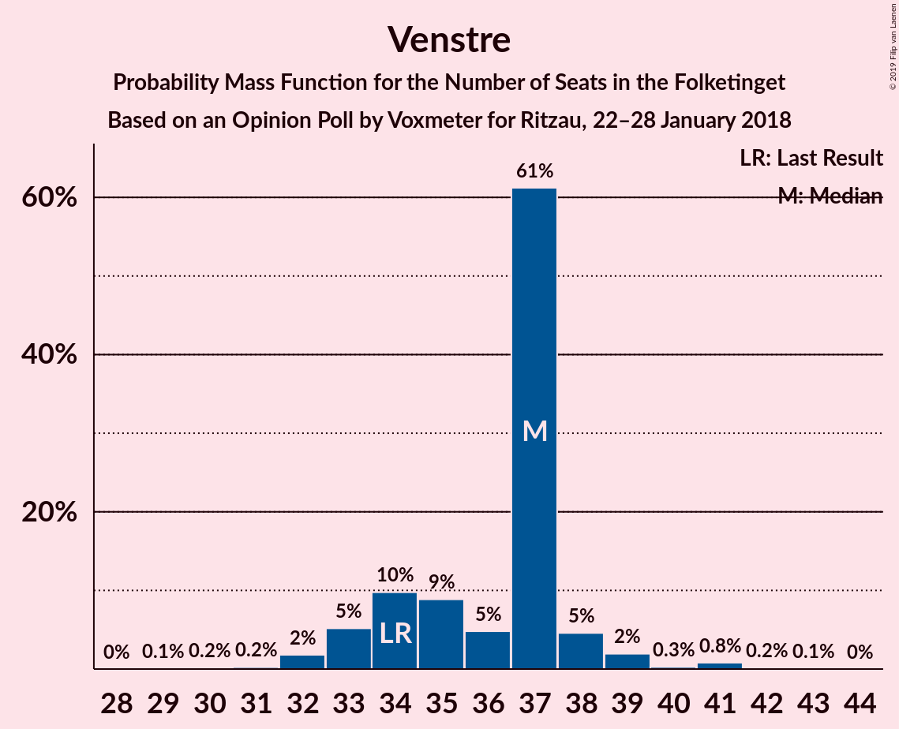
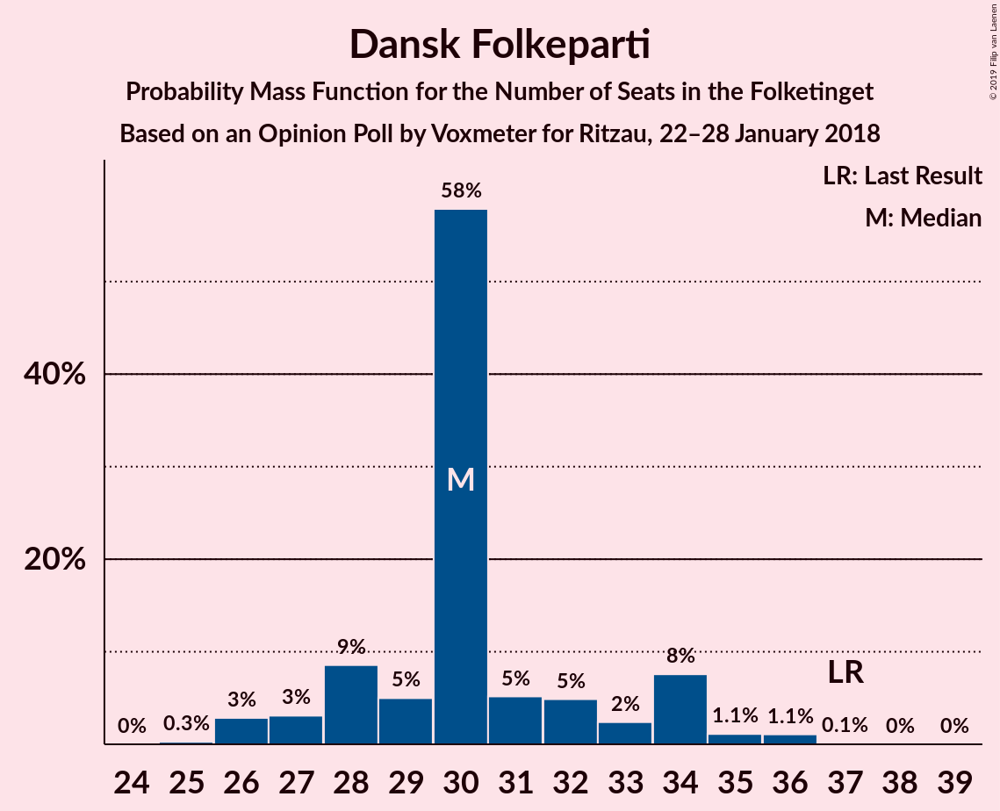
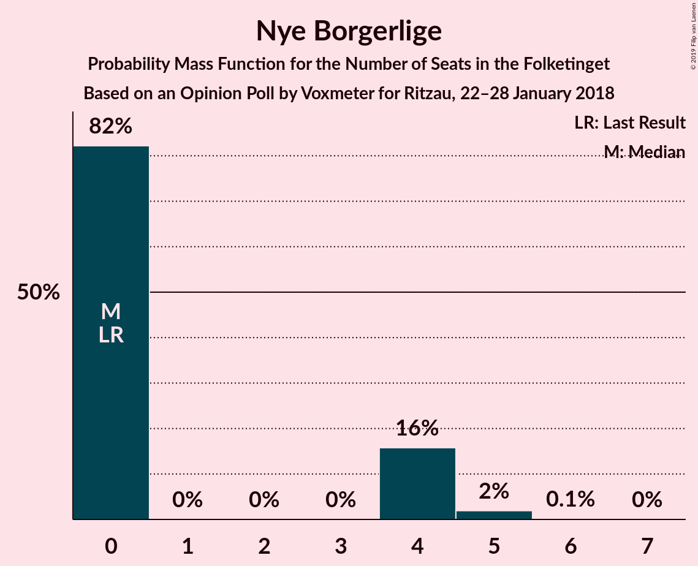

# Opinion Poll by Voxmeter for Ritzau, 22–28 January 2018

<a href="#voting-intentions">Voting Intentions</a> | <a href="#seats">Seats</a> | <a href="#coalitions">Coalitions</a> | <a href="#technical-information">Technical Information</a>

## Voting Intentions

### Confidence Intervals

| Party | Last Result | Poll Result | 80% Confidence Interval | 90% Confidence Interval | 95% Confidence Interval | 99% Confidence Interval |
|:-----:|:-----------:|:-----------:|:-----------------------:|:-----------------------:|:-----------------------:|:-----------------------:|
| Socialdemokraterne | 26.3% | 28.9% | 27.1–30.8% |26.6–31.3% |26.2–31.8% |25.4–32.7% |
| Venstre | 19.5% | 20.3% | 18.7–21.9% |18.3–22.4% |17.9–22.8% |17.2–23.7% |
| Dansk Folkeparti | 21.1% | 17.3% | 15.9–18.9% |15.5–19.4% |15.1–19.8% |14.4–20.5% |
| Enhedslisten–De Rød-Grønne | 7.8% | 8.1% | 7.1–9.3% |6.8–9.6% |6.5–9.9% |6.1–10.5% |
| Radikale Venstre | 4.6% | 5.1% | 4.3–6.1% |4.1–6.4% |3.9–6.6% |3.6–7.2% |
| Socialistisk Folkeparti | 4.2% | 4.7% | 4.0–5.7% |3.7–6.0% |3.6–6.2% |3.2–6.7% |
| Liberal Alliance | 7.5% | 4.6% | 3.9–5.6% |3.7–5.9% |3.5–6.1% |3.2–6.6% |
| Alternativet | 4.8% | 4.5% | 3.8–5.5% |3.6–5.7% |3.4–6.0% |3.1–6.5% |
| Det Konservative Folkeparti | 3.4% | 3.8% | 3.2–4.7% |3.0–5.0% |2.8–5.2% |2.5–5.7% |
| Nye Borgerlige | 0.0% | 1.7% | 1.2–2.3% |1.1–2.5% |1.0–2.7% |0.9–3.0% |
| Kristendemokraterne | 0.8% | 0.6% | 0.4–1.0% |0.3–1.2% |0.3–1.3% |0.2–1.5% |

*Note:* The poll result column reflects the actual value used in the calculations. Published results may vary slightly, and in addition be rounded to fewer digits.

## Seats

### Confidence Intervals

| Party | Last Result | Median | 80% Confidence Interval | 90% Confidence Interval | 95% Confidence Interval | 99% Confidence Interval |
|:-----:|:-----------:|:------:|:-----------------------:|:-----------------------:|:-----------------------:|:-----------------------:|
| <a href="#socialdemokraterne">Socialdemokraterne</a> | 47 | 53 | 53–56 |45–56 |45–56 |45–56 |
| <a href="#venstre">Venstre</a> | 34 | 32 | 28–32 |28–39 |28–39 |28–41 |
| <a href="#dansk-folkeparti">Dansk Folkeparti</a> | 37 | 36 | 34–36 |33–36 |33–36 |25–36 |
| <a href="#enhedslisten–de-rød-grønne">Enhedslisten–De Rød-Grønne</a> | 14 | 14 | 14–15 |14–15 |14–15 |11–15 |
| <a href="#radikale-venstre">Radikale Venstre</a> | 8 | 11 | 9–11 |8–11 |8–11 |8–11 |
| <a href="#socialistisk-folkeparti">Socialistisk Folkeparti</a> | 7 | 6 | 6–9 |6–9 |6–9 |6–10 |
| <a href="#liberal-alliance">Liberal Alliance</a> | 13 | 9 | 6–9 |6–9 |6–9 |6–9 |
| <a href="#alternativet">Alternativet</a> | 9 | 9 | 9–10 |7–10 |7–10 |7–11 |
| <a href="#det-konservative-folkeparti">Det Konservative Folkeparti</a> | 6 | 5 | 5–8 |5–9 |5–9 |5–9 |
| <a href="#nye-borgerlige">Nye Borgerlige</a> | 0 | 0 | 0 |0 |0 |0 |
| <a href="#kristendemokraterne">Kristendemokraterne</a> | 0 | 0 | 0 |0–4 |0–4 |0–4 |

### Socialdemokraterne

*For a full overview of the results for this party, see the [Socialdemokraterne](party-socialdemokraterne.html) page.*

| Number of Seats | Probability | Accumulated | Special Marks |
|:---------------:|:-----------:|:-----------:|:-------------:|
| 45 | 6% | 100% |  |
| 46 | 0% | 94% |  |
| 47 | 0% | 94% | Last Result |
| 48 | 0% | 93% |  |
| 49 | 0% | 93% |  |
| 50 | 0% | 93% |  |
| 51 | 0% | 93% |  |
| 52 | 0.6% | 93% |  |
| 53 | 57% | 93% | Median |
| 54 | 0% | 35% |  |
| 55 | 0% | 35% |  |
| 56 | 35% | 35% |  |
| 57 | 0% | 0% |  |

### Venstre

*For a full overview of the results for this party, see the [Venstre](party-venstre.html) page.*

| Number of Seats | Probability | Accumulated | Special Marks |
|:---------------:|:-----------:|:-----------:|:-------------:|
| 28 | 35% | 100% |  |
| 29 | 0% | 65% |  |
| 30 | 0% | 65% |  |
| 31 | 0% | 65% |  |
| 32 | 57% | 65% | Median |
| 33 | 0% | 7% |  |
| 34 | 0% | 7% | Last Result |
| 35 | 0% | 7% |  |
| 36 | 0% | 7% |  |
| 37 | 0% | 7% |  |
| 38 | 0% | 7% |  |
| 39 | 6% | 7% |  |
| 40 | 0% | 0.7% |  |
| 41 | 0.7% | 0.7% |  |
| 42 | 0% | 0% |  |

### Dansk Folkeparti

*For a full overview of the results for this party, see the [Dansk Folkeparti](party-danskfolkeparti.html) page.*

| Number of Seats | Probability | Accumulated | Special Marks |
|:---------------:|:-----------:|:-----------:|:-------------:|
| 25 | 0.7% | 100% |  |
| 26 | 0% | 99.3% |  |
| 27 | 0% | 99.3% |  |
| 28 | 0% | 99.3% |  |
| 29 | 0% | 99.3% |  |
| 30 | 0% | 99.3% |  |
| 31 | 0% | 99.3% |  |
| 32 | 0% | 99.3% |  |
| 33 | 6% | 99.3% |  |
| 34 | 35% | 93% |  |
| 35 | 0% | 57% |  |
| 36 | 57% | 57% | Median |
| 37 | 0% | 0% | Last Result |

### Enhedslisten–De Rød-Grønne

*For a full overview of the results for this party, see the [Enhedslisten–De Rød-Grønne](party-enhedslisten–derød-grønne.html) page.*

| Number of Seats | Probability | Accumulated | Special Marks |
|:---------------:|:-----------:|:-----------:|:-------------:|
| 11 | 0.7% | 100% |  |
| 12 | 0% | 99.3% |  |
| 13 | 0% | 99.3% |  |
| 14 | 57% | 99.3% | Last Result, Median |
| 15 | 42% | 42% |  |
| 16 | 0% | 0% |  |

### Radikale Venstre

*For a full overview of the results for this party, see the [Radikale Venstre](party-radikalevenstre.html) page.*

| Number of Seats | Probability | Accumulated | Special Marks |
|:---------------:|:-----------:|:-----------:|:-------------:|
| 8 | 6% | 100% | Last Result |
| 9 | 36% | 94% |  |
| 10 | 0% | 57% |  |
| 11 | 57% | 57% | Median |
| 12 | 0% | 0% |  |

### Socialistisk Folkeparti

*For a full overview of the results for this party, see the [Socialistisk Folkeparti](party-socialistiskfolkeparti.html) page.*

| Number of Seats | Probability | Accumulated | Special Marks |
|:---------------:|:-----------:|:-----------:|:-------------:|
| 6 | 57% | 100% | Median |
| 7 | 6% | 43% | Last Result |
| 8 | 0% | 36% |  |
| 9 | 35% | 36% |  |
| 10 | 0.6% | 0.7% |  |
| 11 | 0% | 0% |  |

### Liberal Alliance

*For a full overview of the results for this party, see the [Liberal Alliance](party-liberalalliance.html) page.*

| Number of Seats | Probability | Accumulated | Special Marks |
|:---------------:|:-----------:|:-----------:|:-------------:|
| 6 | 35% | 100% |  |
| 7 | 0% | 65% |  |
| 8 | 7% | 65% |  |
| 9 | 57% | 57% | Median |
| 10 | 0% | 0% |  |
| 11 | 0% | 0% |  |
| 12 | 0% | 0% |  |
| 13 | 0% | 0% | Last Result |

### Alternativet

*For a full overview of the results for this party, see the [Alternativet](party-alternativet.html) page.*

| Number of Seats | Probability | Accumulated | Special Marks |
|:---------------:|:-----------:|:-----------:|:-------------:|
| 7 | 6% | 100% |  |
| 8 | 0% | 94% |  |
| 9 | 57% | 94% | Last Result, Median |
| 10 | 35% | 36% |  |
| 11 | 0.7% | 0.7% |  |
| 12 | 0% | 0% |  |

### Det Konservative Folkeparti

*For a full overview of the results for this party, see the [Det Konservative Folkeparti](party-detkonservativefolkeparti.html) page.*

| Number of Seats | Probability | Accumulated | Special Marks |
|:---------------:|:-----------:|:-----------:|:-------------:|
| 5 | 57% | 100% | Median |
| 6 | 0% | 43% | Last Result |
| 7 | 0% | 43% |  |
| 8 | 36% | 43% |  |
| 9 | 6% | 6% |  |
| 10 | 0% | 0% |  |

### Nye Borgerlige

*For a full overview of the results for this party, see the [Nye Borgerlige](party-nyeborgerlige.html) page.*

| Number of Seats | Probability | Accumulated | Special Marks |
|:---------------:|:-----------:|:-----------:|:-------------:|
| 0 | 100% | 100% | Last Result, Median |

### Kristendemokraterne

*For a full overview of the results for this party, see the [Kristendemokraterne](party-kristendemokraterne.html) page.*

| Number of Seats | Probability | Accumulated | Special Marks |
|:---------------:|:-----------:|:-----------:|:-------------:|
| 0 | 94% | 100% | Last Result, Median |
| 1 | 0% | 6% |  |
| 2 | 0% | 6% |  |
| 3 | 0% | 6% |  |
| 4 | 6% | 6% |  |
| 5 | 0% | 0% |  |

## Coalitions

### Confidence Intervals

| Coalition | Last Result | Median | Majority? | 80% Confidence Interval | 90% Confidence Interval | 95% Confidence Interval | 99% Confidence Interval |
|:---------:|:-----------:|:------:|:---------:|:-----------------------:|:-----------------------:|:-----------------------:|:-----------------------:|
| Socialdemokraterne – Enhedslisten–De Rød-Grønne – Radikale Venstre – Socialistisk Folkeparti – Alternativet | 85 | 93 | 94% | 93–99 | 82–99 | 82–99 | 82–99 |
| Venstre – Dansk Folkeparti – Liberal Alliance – Det Konservative Folkeparti – Nye Borgerlige – Kristendemokraterne | 90 | 82 | 6% | 76–82 | 76–93 | 76–93 | 76–93 |
| Venstre – Dansk Folkeparti – Liberal Alliance – Det Konservative Folkeparti – Kristendemokraterne | 90 | 82 | 6% | 76–82 | 76–93 | 76–93 | 76–93 |
| Venstre – Dansk Folkeparti – Liberal Alliance – Det Konservative Folkeparti – Nye Borgerlige | 90 | 82 | 0% | 76–82 | 76–89 | 76–89 | 76–89 |
| Venstre – Dansk Folkeparti – Liberal Alliance – Det Konservative Folkeparti | 90 | 82 | 0% | 76–82 | 76–89 | 76–89 | 76–89 |
| Socialdemokraterne – Enhedslisten–De Rød-Grønne – Radikale Venstre – Socialistisk Folkeparti | 76 | 84 | 0% | 84–89 | 75–89 | 75–89 | 75–89 |
| Socialdemokraterne – Radikale Venstre – Socialistisk Folkeparti | 62 | 70 | 0% | 70–74 | 60–74 | 60–74 | 60–74 |
| Socialdemokraterne – Radikale Venstre | 55 | 64 | 0% | 64–65 | 53–65 | 53–65 | 53–65 |
| Venstre – Liberal Alliance – Det Konservative Folkeparti | 53 | 46 | 0% | 42–46 | 42–56 | 42–56 | 42–57 |
| Venstre – Det Konservative Folkeparti | 40 | 37 | 0% | 36–37 | 36–48 | 36–48 | 36–49 |
| Venstre | 34 | 32 | 0% | 28–32 | 28–39 | 28–39 | 28–41 |

### Socialdemokraterne – Enhedslisten–De Rød-Grønne – Radikale Venstre – Socialistisk Folkeparti – Alternativet

| Number of Seats | Probability | Accumulated | Special Marks |
|:---------------:|:-----------:|:-----------:|:-------------:|
| 82 | 6% | 100% |  |
| 83 | 0% | 94% |  |
| 84 | 0% | 94% |  |
| 85 | 0% | 94% | Last Result |
| 86 | 0% | 94% |  |
| 87 | 0% | 94% |  |
| 88 | 0% | 94% |  |
| 89 | 0% | 94% |  |
| 90 | 0% | 94% | Majority |
| 91 | 0.1% | 94% |  |
| 92 | 0% | 93% |  |
| 93 | 58% | 93% | Median |
| 94 | 0% | 35% |  |
| 95 | 0% | 35% |  |
| 96 | 0% | 35% |  |
| 97 | 0% | 35% |  |
| 98 | 0% | 35% |  |
| 99 | 35% | 35% |  |
| 100 | 0% | 0% |  |

### Venstre – Dansk Folkeparti – Liberal Alliance – Det Konservative Folkeparti – Nye Borgerlige – Kristendemokraterne

| Number of Seats | Probability | Accumulated | Special Marks |
|:---------------:|:-----------:|:-----------:|:-------------:|
| 76 | 35% | 100% |  |
| 77 | 0% | 65% |  |
| 78 | 0% | 65% |  |
| 79 | 0% | 65% |  |
| 80 | 0% | 65% |  |
| 81 | 0% | 65% |  |
| 82 | 58% | 65% | Median |
| 83 | 0% | 7% |  |
| 84 | 0.1% | 7% |  |
| 85 | 0% | 6% |  |
| 86 | 0% | 6% |  |
| 87 | 0% | 6% |  |
| 88 | 0% | 6% |  |
| 89 | 0% | 6% |  |
| 90 | 0% | 6% | Last Result, Majority |
| 91 | 0% | 6% |  |
| 92 | 0% | 6% |  |
| 93 | 6% | 6% |  |
| 94 | 0% | 0% |  |

### Venstre – Dansk Folkeparti – Liberal Alliance – Det Konservative Folkeparti – Kristendemokraterne

| Number of Seats | Probability | Accumulated | Special Marks |
|:---------------:|:-----------:|:-----------:|:-------------:|
| 76 | 35% | 100% |  |
| 77 | 0% | 65% |  |
| 78 | 0% | 65% |  |
| 79 | 0% | 65% |  |
| 80 | 0% | 65% |  |
| 81 | 0% | 65% |  |
| 82 | 58% | 65% | Median |
| 83 | 0% | 7% |  |
| 84 | 0.1% | 7% |  |
| 85 | 0% | 6% |  |
| 86 | 0% | 6% |  |
| 87 | 0% | 6% |  |
| 88 | 0% | 6% |  |
| 89 | 0% | 6% |  |
| 90 | 0% | 6% | Last Result, Majority |
| 91 | 0% | 6% |  |
| 92 | 0% | 6% |  |
| 93 | 6% | 6% |  |
| 94 | 0% | 0% |  |

### Venstre – Dansk Folkeparti – Liberal Alliance – Det Konservative Folkeparti – Nye Borgerlige

| Number of Seats | Probability | Accumulated | Special Marks |
|:---------------:|:-----------:|:-----------:|:-------------:|
| 76 | 35% | 100% |  |
| 77 | 0% | 65% |  |
| 78 | 0% | 65% |  |
| 79 | 0% | 65% |  |
| 80 | 0% | 65% |  |
| 81 | 0% | 65% |  |
| 82 | 58% | 65% | Median |
| 83 | 0% | 7% |  |
| 84 | 0.1% | 7% |  |
| 85 | 0% | 6% |  |
| 86 | 0% | 6% |  |
| 87 | 0% | 6% |  |
| 88 | 0% | 6% |  |
| 89 | 6% | 6% |  |
| 90 | 0% | 0% | Last Result, Majority |

### Venstre – Dansk Folkeparti – Liberal Alliance – Det Konservative Folkeparti

| Number of Seats | Probability | Accumulated | Special Marks |
|:---------------:|:-----------:|:-----------:|:-------------:|
| 76 | 35% | 100% |  |
| 77 | 0% | 65% |  |
| 78 | 0% | 65% |  |
| 79 | 0% | 65% |  |
| 80 | 0% | 65% |  |
| 81 | 0% | 65% |  |
| 82 | 58% | 65% | Median |
| 83 | 0% | 7% |  |
| 84 | 0.1% | 7% |  |
| 85 | 0% | 6% |  |
| 86 | 0% | 6% |  |
| 87 | 0% | 6% |  |
| 88 | 0% | 6% |  |
| 89 | 6% | 6% |  |
| 90 | 0% | 0% | Last Result, Majority |

### Socialdemokraterne – Enhedslisten–De Rød-Grønne – Radikale Venstre – Socialistisk Folkeparti

| Number of Seats | Probability | Accumulated | Special Marks |
|:---------------:|:-----------:|:-----------:|:-------------:|
| 75 | 6% | 100% |  |
| 76 | 0% | 94% | Last Result |
| 77 | 0% | 94% |  |
| 78 | 0% | 94% |  |
| 79 | 0% | 94% |  |
| 80 | 0% | 94% |  |
| 81 | 0% | 94% |  |
| 82 | 0.6% | 93% |  |
| 83 | 0% | 93% |  |
| 84 | 57% | 93% | Median |
| 85 | 0% | 35% |  |
| 86 | 0% | 35% |  |
| 87 | 0% | 35% |  |
| 88 | 0% | 35% |  |
| 89 | 35% | 35% |  |
| 90 | 0% | 0% | Majority |

### Socialdemokraterne – Radikale Venstre – Socialistisk Folkeparti

| Number of Seats | Probability | Accumulated | Special Marks |
|:---------------:|:-----------:|:-----------:|:-------------:|
| 60 | 6% | 100% |  |
| 61 | 0% | 94% |  |
| 62 | 0% | 94% | Last Result |
| 63 | 0% | 94% |  |
| 64 | 0% | 94% |  |
| 65 | 0% | 94% |  |
| 66 | 0% | 94% |  |
| 67 | 0% | 94% |  |
| 68 | 0% | 93% |  |
| 69 | 0% | 93% |  |
| 70 | 57% | 93% | Median |
| 71 | 0.7% | 36% |  |
| 72 | 0% | 35% |  |
| 73 | 0% | 35% |  |
| 74 | 35% | 35% |  |
| 75 | 0% | 0% |  |

### Socialdemokraterne – Radikale Venstre

| Number of Seats | Probability | Accumulated | Special Marks |
|:---------------:|:-----------:|:-----------:|:-------------:|
| 53 | 6% | 100% |  |
| 54 | 0% | 94% |  |
| 55 | 0% | 94% | Last Result |
| 56 | 0% | 94% |  |
| 57 | 0% | 94% |  |
| 58 | 0% | 94% |  |
| 59 | 0% | 93% |  |
| 60 | 0% | 93% |  |
| 61 | 0.7% | 93% |  |
| 62 | 0% | 93% |  |
| 63 | 0% | 93% |  |
| 64 | 57% | 93% | Median |
| 65 | 35% | 35% |  |
| 66 | 0% | 0% |  |

### Venstre – Liberal Alliance – Det Konservative Folkeparti

| Number of Seats | Probability | Accumulated | Special Marks |
|:---------------:|:-----------:|:-----------:|:-------------:|
| 42 | 35% | 100% |  |
| 43 | 0% | 65% |  |
| 44 | 0% | 65% |  |
| 45 | 0% | 65% |  |
| 46 | 57% | 65% | Median |
| 47 | 0% | 7% |  |
| 48 | 0% | 7% |  |
| 49 | 0% | 7% |  |
| 50 | 0% | 7% |  |
| 51 | 0% | 7% |  |
| 52 | 0% | 7% |  |
| 53 | 0% | 7% | Last Result |
| 54 | 0% | 7% |  |
| 55 | 0% | 7% |  |
| 56 | 6% | 7% |  |
| 57 | 0.7% | 0.7% |  |
| 58 | 0% | 0% |  |

### Venstre – Det Konservative Folkeparti

| Number of Seats | Probability | Accumulated | Special Marks |
|:---------------:|:-----------:|:-----------:|:-------------:|
| 36 | 35% | 100% |  |
| 37 | 57% | 65% | Median |
| 38 | 0% | 7% |  |
| 39 | 0% | 7% |  |
| 40 | 0% | 7% | Last Result |
| 41 | 0% | 7% |  |
| 42 | 0% | 7% |  |
| 43 | 0% | 7% |  |
| 44 | 0% | 7% |  |
| 45 | 0% | 7% |  |
| 46 | 0% | 7% |  |
| 47 | 0.1% | 7% |  |
| 48 | 6% | 7% |  |
| 49 | 0.6% | 0.7% |  |
| 50 | 0% | 0% |  |

### Venstre

| Number of Seats | Probability | Accumulated | Special Marks |
|:---------------:|:-----------:|:-----------:|:-------------:|
| 28 | 35% | 100% |  |
| 29 | 0% | 65% |  |
| 30 | 0% | 65% |  |
| 31 | 0% | 65% |  |
| 32 | 57% | 65% | Median |
| 33 | 0% | 7% |  |
| 34 | 0% | 7% | Last Result |
| 35 | 0% | 7% |  |
| 36 | 0% | 7% |  |
| 37 | 0% | 7% |  |
| 38 | 0% | 7% |  |
| 39 | 6% | 7% |  |
| 40 | 0% | 0.7% |  |
| 41 | 0.7% | 0.7% |  |
| 42 | 0% | 0% |  |

## Technical Information

### Opinion Poll

+ **Polling firm:** Voxmeter
+ **Commissioner(s):** Ritzau
+ **Fieldwork period:** 22–28 January 2018

### Calculations

+ **Sample size:** 1017
+ **Simulations done:** 1,024
+ **Error estimate:** 2.87%

