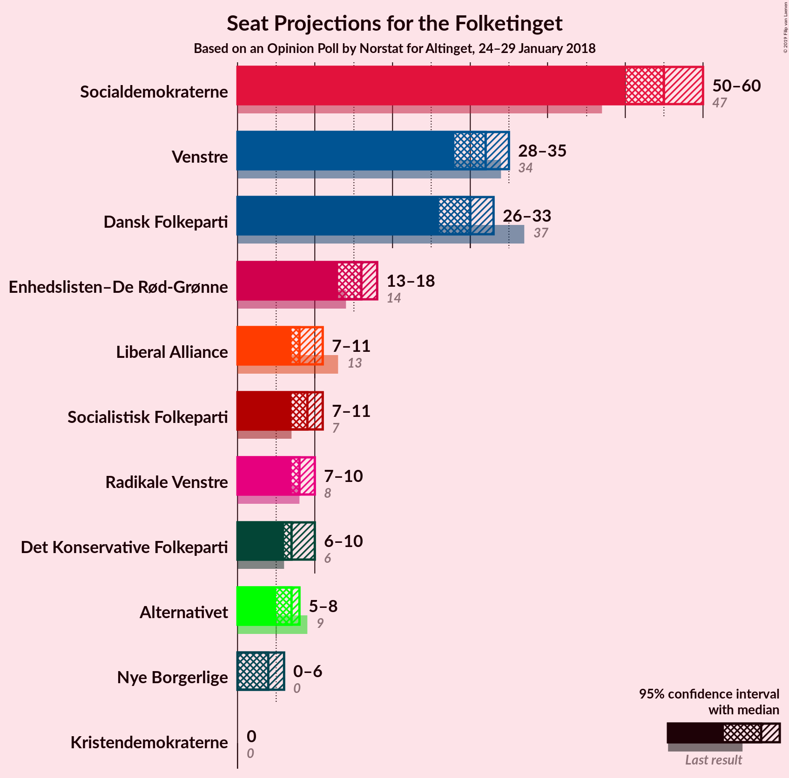
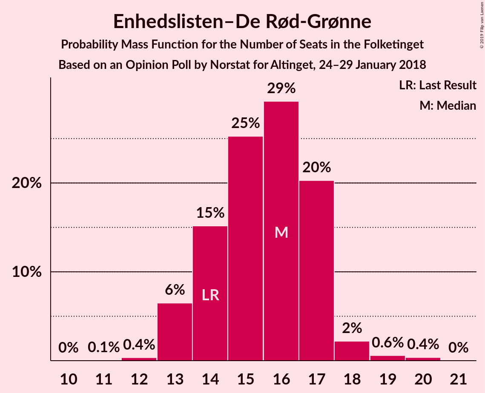
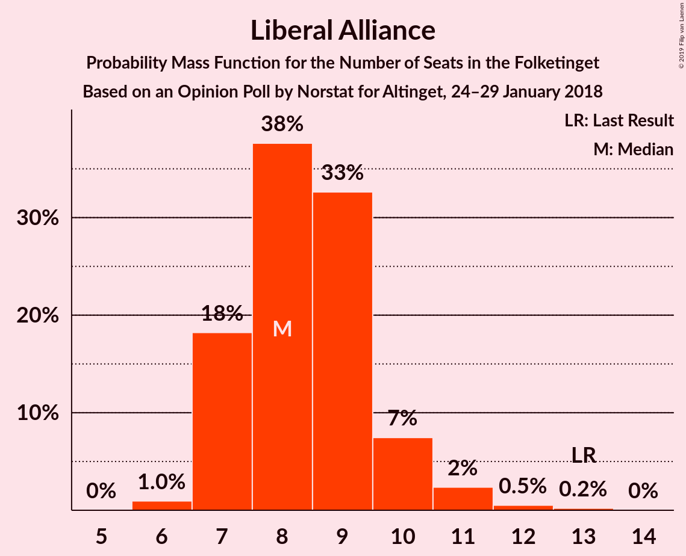
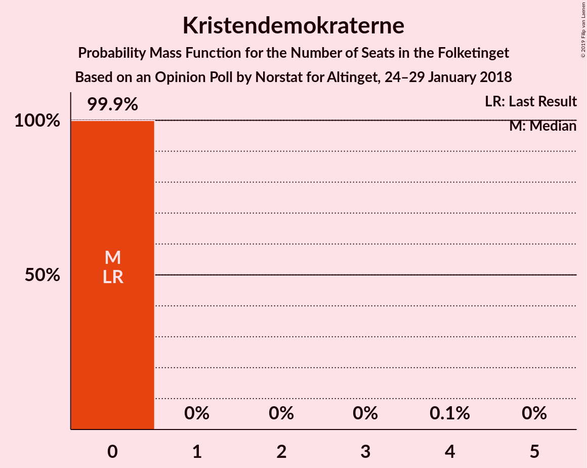

# Opinion Poll by Norstat for Altinget, 24–29 January 2018

<a href="#voting-intentions">Voting Intentions</a> | <a href="#seats">Seats</a> | <a href="#coalitions">Coalitions</a> | <a href="#technical-information">Technical Information</a>

## Voting Intentions

### Confidence Intervals

| Party | Last Result | Poll Result | 80% Confidence Interval | 90% Confidence Interval | 95% Confidence Interval | 99% Confidence Interval |
|:-----:|:-----------:|:-----------:|:-----------------------:|:-----------------------:|:-----------------------:|:-----------------------:|
| Socialdemokraterne | 26.3% | 30.9% | 29.4–32.5% |29.0–32.9% |28.6–33.3% |27.9–34.1% |
| Venstre | 19.5% | 17.6% | 16.4–18.9% |16.0–19.3% |15.7–19.6% |15.2–20.3% |
| Dansk Folkeparti | 21.1% | 16.7% | 15.5–18.0% |15.2–18.4% |14.9–18.7% |14.4–19.3% |
| Enhedslisten–De Rød-Grønne | 7.8% | 8.8% | 7.9–9.8% |7.7–10.1% |7.5–10.3% |7.1–10.8% |
| Socialistisk Folkeparti | 4.2% | 5.0% | 4.3–5.8% |4.2–6.0% |4.0–6.2% |3.7–6.6% |
| Liberal Alliance | 7.5% | 4.8% | 4.1–5.6% |4.0–5.8% |3.8–6.0% |3.5–6.4% |
| Radikale Venstre | 4.6% | 4.6% | 4.0–5.4% |3.8–5.6% |3.6–5.8% |3.4–6.2% |
| Det Konservative Folkeparti | 3.4% | 4.1% | 3.5–4.9% |3.4–5.1% |3.2–5.3% |3.0–5.6% |
| Alternativet | 4.8% | 3.6% | 3.0–4.3% |2.9–4.5% |2.8–4.7% |2.5–5.0% |
| Nye Borgerlige | 0.0% | 2.3% | 1.9–2.9% |1.8–3.1% |1.7–3.2% |1.5–3.5% |
| Kristendemokraterne | 0.8% | 0.9% | 0.7–1.3% |0.6–1.5% |0.5–1.6% |0.5–1.8% |

*Note:* The poll result column reflects the actual value used in the calculations. Published results may vary slightly, and in addition be rounded to fewer digits.

## Seats

### Confidence Intervals

| Party | Last Result | Median | 80% Confidence Interval | 90% Confidence Interval | 95% Confidence Interval | 99% Confidence Interval |
|:-----:|:-----------:|:------:|:-----------------------:|:-----------------------:|:-----------------------:|:-----------------------:|
| <a href="#socialdemokraterne">Socialdemokraterne</a> | 47 | 53 | 52–58 |51–60 |50–60 |50–60 |
| <a href="#venstre">Venstre</a> | 34 | 32 | 28–35 |28–35 |28–35 |28–36 |
| <a href="#dansk-folkeparti">Dansk Folkeparti</a> | 37 | 30 | 27–32 |27–34 |27–34 |26–35 |
| <a href="#enhedslisten–de-rød-grønne">Enhedslisten–De Rød-Grønne</a> | 14 | 14 | 13–17 |13–17 |13–17 |12–20 |
| <a href="#socialistisk-folkeparti">Socialistisk Folkeparti</a> | 7 | 9 | 8–11 |7–11 |7–12 |7–12 |
| <a href="#liberal-alliance">Liberal Alliance</a> | 13 | 9 | 7–10 |7–10 |7–11 |6–11 |
| <a href="#radikale-venstre">Radikale Venstre</a> | 8 | 9 | 8–9 |7–9 |6–10 |6–10 |
| <a href="#det-konservative-folkeparti">Det Konservative Folkeparti</a> | 6 | 8 | 7–9 |7–9 |6–10 |5–10 |
| <a href="#alternativet">Alternativet</a> | 9 | 6 | 5–7 |5–8 |5–8 |5–9 |
| <a href="#nye-borgerlige">Nye Borgerlige</a> | 0 | 4 | 0–5 |0–5 |0–5 |0–6 |
| <a href="#kristendemokraterne">Kristendemokraterne</a> | 0 | 0 | 0 |0 |0 |0 |

### Socialdemokraterne

*For a full overview of the results for this party, see the [Socialdemokraterne](party-socialdemokraterne.html) page.*

| Number of Seats | Probability | Accumulated | Special Marks |
|:---------------:|:-----------:|:-----------:|:-------------:|
| 47 | 0% | 100% | Last Result |
| 48 | 0.1% | 100% |  |
| 49 | 0.3% | 99.9% |  |
| 50 | 4% | 99.6% |  |
| 51 | 2% | 96% |  |
| 52 | 28% | 94% |  |
| 53 | 16% | 66% | Median |
| 54 | 5% | 49% |  |
| 55 | 6% | 44% |  |
| 56 | 4% | 38% |  |
| 57 | 0.8% | 34% |  |
| 58 | 25% | 33% |  |
| 59 | 0.1% | 8% |  |
| 60 | 8% | 8% |  |
| 61 | 0.1% | 0.2% |  |
| 62 | 0% | 0.1% |  |
| 63 | 0% | 0% |  |

### Venstre

*For a full overview of the results for this party, see the [Venstre](party-venstre.html) page.*

| Number of Seats | Probability | Accumulated | Special Marks |
|:---------------:|:-----------:|:-----------:|:-------------:|
| 26 | 0.1% | 100% |  |
| 27 | 0.2% | 99.9% |  |
| 28 | 11% | 99.7% |  |
| 29 | 3% | 89% |  |
| 30 | 10% | 86% |  |
| 31 | 0.8% | 76% |  |
| 32 | 30% | 75% | Median |
| 33 | 26% | 45% |  |
| 34 | 2% | 19% | Last Result |
| 35 | 17% | 17% |  |
| 36 | 0.3% | 0.8% |  |
| 37 | 0.5% | 0.5% |  |
| 38 | 0% | 0% |  |

### Dansk Folkeparti

*For a full overview of the results for this party, see the [Dansk Folkeparti](party-danskfolkeparti.html) page.*

| Number of Seats | Probability | Accumulated | Special Marks |
|:---------------:|:-----------:|:-----------:|:-------------:|
| 25 | 0.1% | 100% |  |
| 26 | 2% | 99.9% |  |
| 27 | 16% | 98% |  |
| 28 | 21% | 81% |  |
| 29 | 10% | 61% |  |
| 30 | 34% | 51% | Median |
| 31 | 6% | 17% |  |
| 32 | 2% | 11% |  |
| 33 | 2% | 9% |  |
| 34 | 6% | 7% |  |
| 35 | 0.5% | 0.5% |  |
| 36 | 0.1% | 0.1% |  |
| 37 | 0% | 0% | Last Result |

### Enhedslisten–De Rød-Grønne

*For a full overview of the results for this party, see the [Enhedslisten–De Rød-Grønne](party-enhedslisten–derød-grønne.html) page.*

| Number of Seats | Probability | Accumulated | Special Marks |
|:---------------:|:-----------:|:-----------:|:-------------:|
| 12 | 0.8% | 100% |  |
| 13 | 29% | 99.2% |  |
| 14 | 25% | 70% | Last Result, Median |
| 15 | 3% | 45% |  |
| 16 | 12% | 43% |  |
| 17 | 30% | 31% |  |
| 18 | 0.9% | 2% |  |
| 19 | 0.2% | 0.8% |  |
| 20 | 0.5% | 0.6% |  |
| 21 | 0.1% | 0.1% |  |
| 22 | 0% | 0% |  |

### Socialistisk Folkeparti

*For a full overview of the results for this party, see the [Socialistisk Folkeparti](party-socialistiskfolkeparti.html) page.*

| Number of Seats | Probability | Accumulated | Special Marks |
|:---------------:|:-----------:|:-----------:|:-------------:|
| 6 | 0.2% | 100% |  |
| 7 | 9% | 99.8% | Last Result |
| 8 | 3% | 91% |  |
| 9 | 48% | 88% | Median |
| 10 | 29% | 40% |  |
| 11 | 7% | 10% |  |
| 12 | 3% | 3% |  |
| 13 | 0% | 0% |  |

### Liberal Alliance

*For a full overview of the results for this party, see the [Liberal Alliance](party-liberalalliance.html) page.*

| Number of Seats | Probability | Accumulated | Special Marks |
|:---------------:|:-----------:|:-----------:|:-------------:|
| 6 | 1.2% | 100% |  |
| 7 | 14% | 98.8% |  |
| 8 | 17% | 85% |  |
| 9 | 44% | 68% | Median |
| 10 | 22% | 25% |  |
| 11 | 2% | 3% |  |
| 12 | 0.5% | 0.5% |  |
| 13 | 0% | 0% | Last Result |

### Radikale Venstre

*For a full overview of the results for this party, see the [Radikale Venstre](party-radikalevenstre.html) page.*

| Number of Seats | Probability | Accumulated | Special Marks |
|:---------------:|:-----------:|:-----------:|:-------------:|
| 5 | 0.3% | 100% |  |
| 6 | 4% | 99.7% |  |
| 7 | 4% | 96% |  |
| 8 | 42% | 92% | Last Result |
| 9 | 48% | 51% | Median |
| 10 | 2% | 3% |  |
| 11 | 0.2% | 0.4% |  |
| 12 | 0.1% | 0.2% |  |
| 13 | 0% | 0% |  |

### Det Konservative Folkeparti

*For a full overview of the results for this party, see the [Det Konservative Folkeparti](party-detkonservativefolkeparti.html) page.*

| Number of Seats | Probability | Accumulated | Special Marks |
|:---------------:|:-----------:|:-----------:|:-------------:|
| 5 | 0.8% | 100% |  |
| 6 | 3% | 99.2% | Last Result |
| 7 | 11% | 96% |  |
| 8 | 73% | 85% | Median |
| 9 | 7% | 12% |  |
| 10 | 5% | 5% |  |
| 11 | 0.1% | 0.1% |  |
| 12 | 0% | 0% |  |

### Alternativet

*For a full overview of the results for this party, see the [Alternativet](party-alternativet.html) page.*

| Number of Seats | Probability | Accumulated | Special Marks |
|:---------------:|:-----------:|:-----------:|:-------------:|
| 4 | 0.4% | 100% |  |
| 5 | 21% | 99.6% |  |
| 6 | 43% | 79% | Median |
| 7 | 30% | 36% |  |
| 8 | 5% | 6% |  |
| 9 | 2% | 2% | Last Result |
| 10 | 0% | 0% |  |

### Nye Borgerlige

*For a full overview of the results for this party, see the [Nye Borgerlige](party-nyeborgerlige.html) page.*

| Number of Seats | Probability | Accumulated | Special Marks |
|:---------------:|:-----------:|:-----------:|:-------------:|
| 0 | 30% | 100% | Last Result |
| 1 | 0% | 70% |  |
| 2 | 0% | 70% |  |
| 3 | 0% | 70% |  |
| 4 | 30% | 70% | Median |
| 5 | 38% | 40% |  |
| 6 | 1.4% | 2% |  |
| 7 | 0.1% | 0.1% |  |
| 8 | 0% | 0% |  |

### Kristendemokraterne

*For a full overview of the results for this party, see the [Kristendemokraterne](party-kristendemokraterne.html) page.*

| Number of Seats | Probability | Accumulated | Special Marks |
|:---------------:|:-----------:|:-----------:|:-------------:|
| 0 | 99.8% | 100% | Last Result, Median |
| 1 | 0% | 0.2% |  |
| 2 | 0% | 0.2% |  |
| 3 | 0.2% | 0.2% |  |
| 4 | 0% | 0% |  |

## Coalitions

### Confidence Intervals

| Coalition | Last Result | Median | Majority? | 80% Confidence Interval | 90% Confidence Interval | 95% Confidence Interval | 99% Confidence Interval |
|:---------:|:-----------:|:------:|:---------:|:-----------------------:|:-----------------------:|:-----------------------:|:-----------------------:|
| Socialdemokraterne – Enhedslisten–De Rød-Grønne – Socialistisk Folkeparti – Radikale Venstre – Alternativet | 85 | 92 | 97% | 91–98 | 90–98 | 89–98 | 87–100 |
| Socialdemokraterne – Enhedslisten–De Rød-Grønne – Socialistisk Folkeparti – Radikale Venstre | 76 | 87 | 14% | 84–90 | 83–92 | 83–92 | 82–93 |
| Socialdemokraterne – Enhedslisten–De Rød-Grønne – Socialistisk Folkeparti – Alternativet | 77 | 84 | 6% | 83–89 | 82–90 | 82–90 | 78–91 |
| Venstre – Dansk Folkeparti – Liberal Alliance – Det Konservative Folkeparti – Nye Borgerlige – Kristendemokraterne | 90 | 83 | 0% | 77–84 | 77–85 | 77–86 | 75–88 |
| Venstre – Dansk Folkeparti – Liberal Alliance – Det Konservative Folkeparti – Nye Borgerlige | 90 | 83 | 0% | 77–84 | 77–85 | 77–86 | 75–88 |
| Socialdemokraterne – Enhedslisten–De Rød-Grønne – Socialistisk Folkeparti | 68 | 78 | 0.1% | 76–83 | 75–83 | 74–83 | 72–84 |
| Venstre – Dansk Folkeparti – Liberal Alliance – Det Konservative Folkeparti – Kristendemokraterne | 90 | 79 | 0% | 74–81 | 72–81 | 72–82 | 72–84 |
| Venstre – Dansk Folkeparti – Liberal Alliance – Det Konservative Folkeparti | 90 | 79 | 0% | 74–81 | 72–81 | 72–82 | 72–84 |
| Socialdemokraterne – Socialistisk Folkeparti – Radikale Venstre | 62 | 71 | 0% | 69–76 | 67–78 | 67–78 | 67–78 |
| Socialdemokraterne – Radikale Venstre | 55 | 62 | 0% | 60–66 | 59–69 | 58–69 | 57–69 |
| Venstre – Liberal Alliance – Det Konservative Folkeparti | 53 | 50 | 0% | 44–52 | 42–52 | 42–52 | 41–52 |
| Venstre – Det Konservative Folkeparti | 40 | 40 | 0% | 36–43 | 35–43 | 35–43 | 34–44 |
| Venstre | 34 | 32 | 0% | 28–35 | 28–35 | 28–35 | 28–36 |

### Socialdemokraterne – Enhedslisten–De Rød-Grønne – Socialistisk Folkeparti – Radikale Venstre – Alternativet

| Number of Seats | Probability | Accumulated | Special Marks |
|:---------------:|:-----------:|:-----------:|:-------------:|
| 85 | 0% | 100% | Last Result |
| 86 | 0% | 100% |  |
| 87 | 0.6% | 99.9% |  |
| 88 | 0.9% | 99.3% |  |
| 89 | 1.0% | 98% |  |
| 90 | 6% | 97% | Majority |
| 91 | 3% | 91% | Median |
| 92 | 39% | 88% |  |
| 93 | 1.2% | 49% |  |
| 94 | 5% | 48% |  |
| 95 | 26% | 43% |  |
| 96 | 5% | 17% |  |
| 97 | 0.9% | 12% |  |
| 98 | 10% | 11% |  |
| 99 | 0.3% | 1.3% |  |
| 100 | 0.7% | 1.0% |  |
| 101 | 0.2% | 0.3% |  |
| 102 | 0.1% | 0.1% |  |
| 103 | 0% | 0.1% |  |
| 104 | 0.1% | 0.1% |  |
| 105 | 0% | 0% |  |

### Socialdemokraterne – Enhedslisten–De Rød-Grønne – Socialistisk Folkeparti – Radikale Venstre

| Number of Seats | Probability | Accumulated | Special Marks |
|:---------------:|:-----------:|:-----------:|:-------------:|
| 76 | 0% | 100% | Last Result |
| 77 | 0% | 100% |  |
| 78 | 0% | 100% |  |
| 79 | 0% | 100% |  |
| 80 | 0.1% | 100% |  |
| 81 | 0.4% | 99.9% |  |
| 82 | 1.2% | 99.5% |  |
| 83 | 8% | 98% |  |
| 84 | 1.3% | 91% |  |
| 85 | 17% | 89% | Median |
| 86 | 5% | 72% |  |
| 87 | 23% | 67% |  |
| 88 | 2% | 44% |  |
| 89 | 28% | 42% |  |
| 90 | 5% | 14% | Majority |
| 91 | 0.8% | 9% |  |
| 92 | 8% | 9% |  |
| 93 | 0.7% | 1.0% |  |
| 94 | 0.1% | 0.3% |  |
| 95 | 0% | 0.2% |  |
| 96 | 0.1% | 0.2% |  |
| 97 | 0.1% | 0.1% |  |
| 98 | 0% | 0% |  |

### Socialdemokraterne – Enhedslisten–De Rød-Grønne – Socialistisk Folkeparti – Alternativet

| Number of Seats | Probability | Accumulated | Special Marks |
|:---------------:|:-----------:|:-----------:|:-------------:|
| 77 | 0% | 100% | Last Result |
| 78 | 0.6% | 100% |  |
| 79 | 0.8% | 99.4% |  |
| 80 | 0.5% | 98.6% |  |
| 81 | 0.1% | 98% |  |
| 82 | 7% | 98% | Median |
| 83 | 36% | 91% |  |
| 84 | 4% | 54% |  |
| 85 | 2% | 50% |  |
| 86 | 4% | 48% |  |
| 87 | 29% | 44% |  |
| 88 | 2% | 15% |  |
| 89 | 8% | 14% |  |
| 90 | 4% | 6% | Majority |
| 91 | 0.7% | 1.0% |  |
| 92 | 0% | 0.3% |  |
| 93 | 0.1% | 0.3% |  |
| 94 | 0.1% | 0.2% |  |
| 95 | 0% | 0.1% |  |
| 96 | 0% | 0.1% |  |
| 97 | 0.1% | 0.1% |  |
| 98 | 0% | 0% |  |

### Venstre – Dansk Folkeparti – Liberal Alliance – Det Konservative Folkeparti – Nye Borgerlige – Kristendemokraterne

| Number of Seats | Probability | Accumulated | Special Marks |
|:---------------:|:-----------:|:-----------:|:-------------:|
| 71 | 0.1% | 100% |  |
| 72 | 0% | 99.9% |  |
| 73 | 0.1% | 99.9% |  |
| 74 | 0.2% | 99.9% |  |
| 75 | 0.7% | 99.7% |  |
| 76 | 0.3% | 99.0% |  |
| 77 | 10% | 98.7% |  |
| 78 | 0.9% | 89% |  |
| 79 | 5% | 88% |  |
| 80 | 26% | 83% |  |
| 81 | 5% | 57% |  |
| 82 | 1.2% | 52% |  |
| 83 | 39% | 51% | Median |
| 84 | 3% | 12% |  |
| 85 | 6% | 9% |  |
| 86 | 1.0% | 3% |  |
| 87 | 0.9% | 2% |  |
| 88 | 0.6% | 0.7% |  |
| 89 | 0% | 0.1% |  |
| 90 | 0% | 0% | Last Result, Majority |

### Venstre – Dansk Folkeparti – Liberal Alliance – Det Konservative Folkeparti – Nye Borgerlige

| Number of Seats | Probability | Accumulated | Special Marks |
|:---------------:|:-----------:|:-----------:|:-------------:|
| 71 | 0.1% | 100% |  |
| 72 | 0% | 99.9% |  |
| 73 | 0.1% | 99.9% |  |
| 74 | 0.2% | 99.9% |  |
| 75 | 0.7% | 99.7% |  |
| 76 | 0.3% | 99.0% |  |
| 77 | 10% | 98.7% |  |
| 78 | 0.9% | 89% |  |
| 79 | 6% | 88% |  |
| 80 | 26% | 82% |  |
| 81 | 5% | 57% |  |
| 82 | 1.0% | 52% |  |
| 83 | 39% | 51% | Median |
| 84 | 3% | 12% |  |
| 85 | 6% | 9% |  |
| 86 | 1.0% | 3% |  |
| 87 | 0.9% | 2% |  |
| 88 | 0.6% | 0.7% |  |
| 89 | 0% | 0.1% |  |
| 90 | 0% | 0% | Last Result, Majority |

### Socialdemokraterne – Enhedslisten–De Rød-Grønne – Socialistisk Folkeparti

| Number of Seats | Probability | Accumulated | Special Marks |
|:---------------:|:-----------:|:-----------:|:-------------:|
| 68 | 0% | 100% | Last Result |
| 69 | 0% | 100% |  |
| 70 | 0% | 100% |  |
| 71 | 0% | 100% |  |
| 72 | 0.6% | 100% |  |
| 73 | 0.7% | 99.4% |  |
| 74 | 1.2% | 98.7% |  |
| 75 | 7% | 97% |  |
| 76 | 16% | 91% | Median |
| 77 | 2% | 75% |  |
| 78 | 25% | 73% |  |
| 79 | 5% | 48% |  |
| 80 | 2% | 43% |  |
| 81 | 28% | 42% |  |
| 82 | 3% | 14% |  |
| 83 | 10% | 11% |  |
| 84 | 0.8% | 1.2% |  |
| 85 | 0.2% | 0.4% |  |
| 86 | 0% | 0.2% |  |
| 87 | 0.1% | 0.2% |  |
| 88 | 0% | 0.1% |  |
| 89 | 0% | 0.1% |  |
| 90 | 0.1% | 0.1% | Majority |
| 91 | 0% | 0% |  |

### Venstre – Dansk Folkeparti – Liberal Alliance – Det Konservative Folkeparti – Kristendemokraterne

| Number of Seats | Probability | Accumulated | Special Marks |
|:---------------:|:-----------:|:-----------:|:-------------:|
| 69 | 0.1% | 100% |  |
| 70 | 0.2% | 99.9% |  |
| 71 | 0.2% | 99.7% |  |
| 72 | 7% | 99.5% |  |
| 73 | 0.5% | 92% |  |
| 74 | 3% | 92% |  |
| 75 | 4% | 88% |  |
| 76 | 0.9% | 84% |  |
| 77 | 5% | 83% |  |
| 78 | 24% | 77% |  |
| 79 | 18% | 53% | Median |
| 80 | 24% | 35% |  |
| 81 | 8% | 11% |  |
| 82 | 2% | 3% |  |
| 83 | 0.2% | 1.0% |  |
| 84 | 0.5% | 0.8% |  |
| 85 | 0.1% | 0.3% |  |
| 86 | 0.2% | 0.2% |  |
| 87 | 0% | 0% |  |
| 88 | 0% | 0% |  |
| 89 | 0% | 0% |  |
| 90 | 0% | 0% | Last Result, Majority |

### Venstre – Dansk Folkeparti – Liberal Alliance – Det Konservative Folkeparti

| Number of Seats | Probability | Accumulated | Special Marks |
|:---------------:|:-----------:|:-----------:|:-------------:|
| 69 | 0.1% | 100% |  |
| 70 | 0.2% | 99.9% |  |
| 71 | 0.2% | 99.7% |  |
| 72 | 7% | 99.5% |  |
| 73 | 0.5% | 92% |  |
| 74 | 3% | 92% |  |
| 75 | 5% | 88% |  |
| 76 | 0.9% | 83% |  |
| 77 | 5% | 83% |  |
| 78 | 24% | 77% |  |
| 79 | 18% | 53% | Median |
| 80 | 24% | 35% |  |
| 81 | 8% | 11% |  |
| 82 | 2% | 3% |  |
| 83 | 0.2% | 1.0% |  |
| 84 | 0.5% | 0.8% |  |
| 85 | 0.1% | 0.3% |  |
| 86 | 0.2% | 0.2% |  |
| 87 | 0% | 0% |  |
| 88 | 0% | 0% |  |
| 89 | 0% | 0% |  |
| 90 | 0% | 0% | Last Result, Majority |

### Socialdemokraterne – Socialistisk Folkeparti – Radikale Venstre

| Number of Seats | Probability | Accumulated | Special Marks |
|:---------------:|:-----------:|:-----------:|:-------------:|
| 62 | 0% | 100% | Last Result |
| 63 | 0% | 100% |  |
| 64 | 0% | 100% |  |
| 65 | 0.3% | 100% |  |
| 66 | 0% | 99.6% |  |
| 67 | 8% | 99.6% |  |
| 68 | 0.5% | 92% |  |
| 69 | 1.3% | 91% |  |
| 70 | 25% | 90% |  |
| 71 | 19% | 65% | Median |
| 72 | 3% | 46% |  |
| 73 | 7% | 43% |  |
| 74 | 2% | 36% |  |
| 75 | 0.3% | 33% |  |
| 76 | 25% | 33% |  |
| 77 | 0.7% | 8% |  |
| 78 | 7% | 8% |  |
| 79 | 0.1% | 0.2% |  |
| 80 | 0% | 0.1% |  |
| 81 | 0% | 0% |  |

### Socialdemokraterne – Radikale Venstre

| Number of Seats | Probability | Accumulated | Special Marks |
|:---------------:|:-----------:|:-----------:|:-------------:|
| 55 | 0% | 100% | Last Result |
| 56 | 0.1% | 100% |  |
| 57 | 1.3% | 99.9% |  |
| 58 | 3% | 98.6% |  |
| 59 | 1.4% | 95% |  |
| 60 | 8% | 94% |  |
| 61 | 23% | 86% |  |
| 62 | 21% | 63% | Median |
| 63 | 2% | 42% |  |
| 64 | 5% | 40% |  |
| 65 | 1.0% | 35% |  |
| 66 | 25% | 34% |  |
| 67 | 0.9% | 9% |  |
| 68 | 0.2% | 8% |  |
| 69 | 8% | 8% |  |
| 70 | 0% | 0.1% |  |
| 71 | 0% | 0% |  |

### Venstre – Liberal Alliance – Det Konservative Folkeparti

| Number of Seats | Probability | Accumulated | Special Marks |
|:---------------:|:-----------:|:-----------:|:-------------:|
| 40 | 0.2% | 100% |  |
| 41 | 0.8% | 99.8% |  |
| 42 | 8% | 99.0% |  |
| 43 | 0.7% | 91% |  |
| 44 | 1.1% | 90% |  |
| 45 | 0.5% | 89% |  |
| 46 | 4% | 89% |  |
| 47 | 11% | 85% |  |
| 48 | 8% | 74% |  |
| 49 | 1.1% | 66% | Median |
| 50 | 46% | 65% |  |
| 51 | 1.4% | 18% |  |
| 52 | 17% | 17% |  |
| 53 | 0.2% | 0.2% | Last Result |
| 54 | 0% | 0% |  |

### Venstre – Det Konservative Folkeparti

| Number of Seats | Probability | Accumulated | Special Marks |
|:---------------:|:-----------:|:-----------:|:-------------:|
| 33 | 0.1% | 100% |  |
| 34 | 0.4% | 99.9% |  |
| 35 | 9% | 99.5% |  |
| 36 | 2% | 90% |  |
| 37 | 3% | 89% |  |
| 38 | 3% | 86% |  |
| 39 | 7% | 83% |  |
| 40 | 32% | 76% | Last Result, Median |
| 41 | 25% | 44% |  |
| 42 | 1.2% | 19% |  |
| 43 | 17% | 18% |  |
| 44 | 0.1% | 0.6% |  |
| 45 | 0.4% | 0.4% |  |
| 46 | 0% | 0% |  |

### Venstre

| Number of Seats | Probability | Accumulated | Special Marks |
|:---------------:|:-----------:|:-----------:|:-------------:|
| 26 | 0.1% | 100% |  |
| 27 | 0.2% | 99.9% |  |
| 28 | 11% | 99.7% |  |
| 29 | 3% | 89% |  |
| 30 | 10% | 86% |  |
| 31 | 0.8% | 76% |  |
| 32 | 30% | 75% | Median |
| 33 | 26% | 45% |  |
| 34 | 2% | 19% | Last Result |
| 35 | 17% | 17% |  |
| 36 | 0.3% | 0.8% |  |
| 37 | 0.5% | 0.5% |  |
| 38 | 0% | 0% |  |

## Technical Information

### Opinion Poll

+ **Polling firm:** Norstat
+ **Commissioner(s):** Altinget
+ **Fieldwork period:** 24–29 January 2018

### Calculations

+ **Sample size:** 1501
+ **Simulations done:** 131,072
+ **Error estimate:** 2.61%

