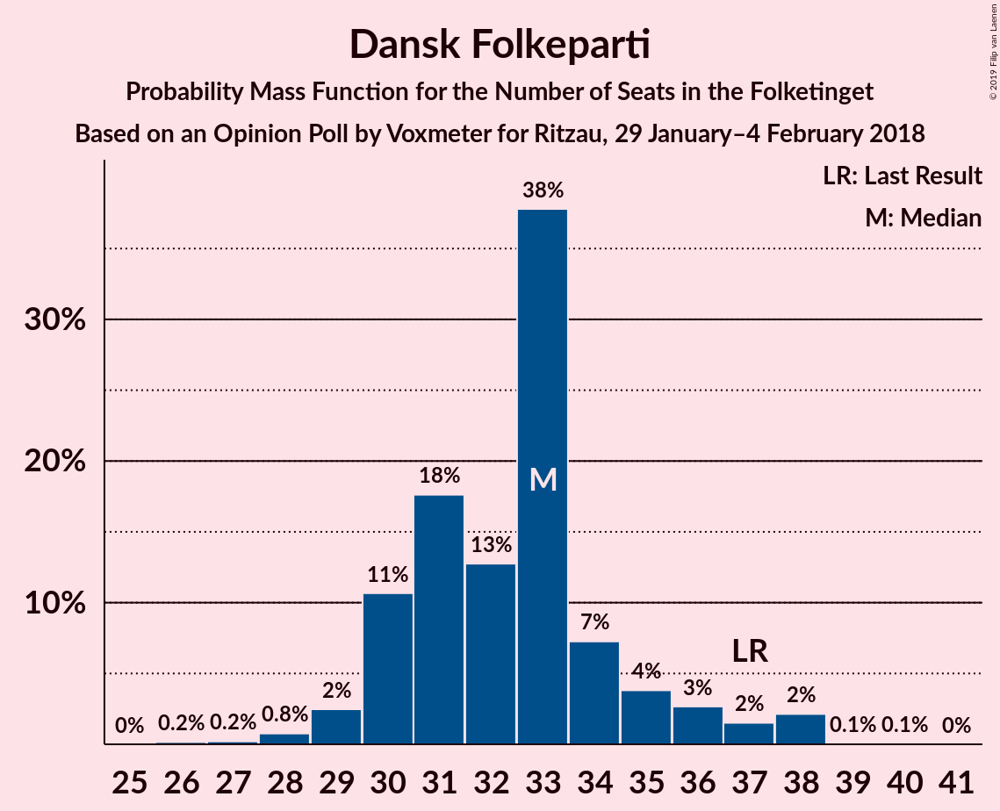
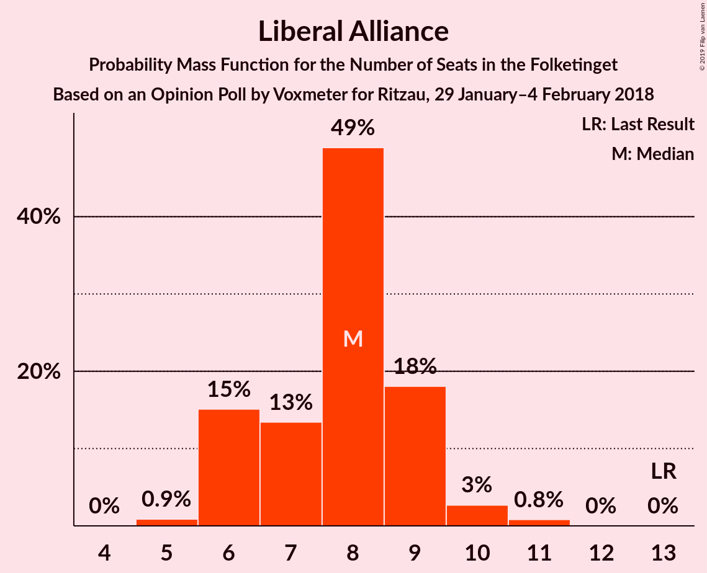

# Opinion Poll by Voxmeter for Ritzau, 29 January–4 February 2018

<a href="#voting-intentions">Voting Intentions</a> | <a href="#seats">Seats</a> | <a href="#coalitions">Coalitions</a> | <a href="#technical-information">Technical Information</a>

## Voting Intentions

### Confidence Intervals

| Party | Last Result | Poll Result | 80% Confidence Interval | 90% Confidence Interval | 95% Confidence Interval | 99% Confidence Interval |
|:-----:|:-----------:|:-----------:|:-----------------------:|:-----------------------:|:-----------------------:|:-----------------------:|
| Socialdemokraterne | 26.3% | 30.0% | 28.2–31.9% |27.7–32.4% |27.3–32.9% |26.4–33.8% |
| Venstre | 19.5% | 19.3% | 17.8–21.0% |17.4–21.5% |17.0–21.9% |16.3–22.7% |
| Dansk Folkeparti | 21.1% | 18.2% | 16.7–19.8% |16.3–20.3% |15.9–20.7% |15.2–21.4% |
| Enhedslisten–De Rød-Grønne | 7.8% | 7.5% | 6.6–8.7% |6.3–9.0% |6.1–9.3% |5.6–9.9% |
| Radikale Venstre | 4.6% | 5.0% | 4.2–6.0% |4.0–6.2% |3.8–6.5% |3.5–7.0% |
| Alternativet | 4.8% | 4.8% | 4.0–5.8% |3.8–6.0% |3.6–6.3% |3.3–6.8% |
| Socialistisk Folkeparti | 4.2% | 4.6% | 3.8–5.5% |3.6–5.8% |3.5–6.1% |3.1–6.6% |
| Liberal Alliance | 7.5% | 4.2% | 3.5–5.1% |3.3–5.4% |3.1–5.6% |2.8–6.1% |
| Det Konservative Folkeparti | 3.4% | 4.0% | 3.3–4.9% |3.1–5.2% |3.0–5.4% |2.7–5.9% |
| Nye Borgerlige | 0.0% | 1.5% | 1.1–2.1% |1.0–2.3% |0.9–2.4% |0.7–2.7% |
| Kristendemokraterne | 0.8% | 0.9% | 0.6–1.4% |0.5–1.5% |0.5–1.7% |0.4–2.0% |

*Note:* The poll result column reflects the actual value used in the calculations. Published results may vary slightly, and in addition be rounded to fewer digits.

## Seats

### Confidence Intervals

| Party | Last Result | Median | 80% Confidence Interval | 90% Confidence Interval | 95% Confidence Interval | 99% Confidence Interval |
|:-----:|:-----------:|:------:|:-----------------------:|:-----------------------:|:-----------------------:|:-----------------------:|
| <a href="#socialdemokraterne">Socialdemokraterne</a> | 47 | 56 | 51–57 |47–60 |46–60 |46–63 |
| <a href="#venstre">Venstre</a> | 34 | 33 | 30–36 |29–38 |29–40 |27–42 |
| <a href="#dansk-folkeparti">Dansk Folkeparti</a> | 37 | 31 | 31–35 |29–35 |29–36 |27–37 |
| <a href="#enhedslisten–de-rød-grønne">Enhedslisten–De Rød-Grønne</a> | 14 | 15 | 11–16 |11–16 |9–16 |9–18 |
| <a href="#radikale-venstre">Radikale Venstre</a> | 8 | 9 | 7–12 |7–12 |7–12 |6–12 |
| <a href="#alternativet">Alternativet</a> | 9 | 8 | 7–9 |7–9 |7–10 |6–11 |
| <a href="#socialistisk-folkeparti">Socialistisk Folkeparti</a> | 7 | 7 | 6–9 |6–10 |5–10 |5–12 |
| <a href="#liberal-alliance">Liberal Alliance</a> | 13 | 7 | 6–9 |6–10 |6–10 |5–10 |
| <a href="#det-konservative-folkeparti">Det Konservative Folkeparti</a> | 6 | 7 | 7–9 |6–9 |6–9 |5–10 |
| <a href="#nye-borgerlige">Nye Borgerlige</a> | 0 | 0 | 0–4 |0–4 |0–4 |0–5 |
| <a href="#kristendemokraterne">Kristendemokraterne</a> | 0 | 0 | 0 |0 |0 |0 |

### Socialdemokraterne

*For a full overview of the results for this party, see the [Socialdemokraterne](party-socialdemokraterne.html) page.*

| Number of Seats | Probability | Accumulated | Special Marks |
|:---------------:|:-----------:|:-----------:|:-------------:|
| 45 | 0.1% | 100% |  |
| 46 | 3% | 99.8% |  |
| 47 | 2% | 97% | Last Result |
| 48 | 0.3% | 95% |  |
| 49 | 1.5% | 95% |  |
| 50 | 2% | 93% |  |
| 51 | 1.3% | 91% |  |
| 52 | 4% | 90% |  |
| 53 | 2% | 86% |  |
| 54 | 0.5% | 84% |  |
| 55 | 17% | 84% |  |
| 56 | 18% | 67% | Median |
| 57 | 42% | 49% |  |
| 58 | 0.1% | 6% |  |
| 59 | 0.1% | 6% |  |
| 60 | 5% | 6% |  |
| 61 | 0.1% | 0.7% |  |
| 62 | 0% | 0.6% |  |
| 63 | 0.6% | 0.6% |  |
| 64 | 0% | 0% |  |

### Venstre

*For a full overview of the results for this party, see the [Venstre](party-venstre.html) page.*

| Number of Seats | Probability | Accumulated | Special Marks |
|:---------------:|:-----------:|:-----------:|:-------------:|
| 27 | 2% | 100% |  |
| 28 | 0.2% | 98% |  |
| 29 | 4% | 98% |  |
| 30 | 7% | 94% |  |
| 31 | 16% | 86% |  |
| 32 | 3% | 71% |  |
| 33 | 33% | 67% | Median |
| 34 | 7% | 34% | Last Result |
| 35 | 1.0% | 28% |  |
| 36 | 18% | 27% |  |
| 37 | 1.3% | 9% |  |
| 38 | 4% | 7% |  |
| 39 | 1.0% | 4% |  |
| 40 | 2% | 3% |  |
| 41 | 0.5% | 1.2% |  |
| 42 | 0.3% | 0.7% |  |
| 43 | 0.4% | 0.4% |  |
| 44 | 0% | 0% |  |

### Dansk Folkeparti

*For a full overview of the results for this party, see the [Dansk Folkeparti](party-danskfolkeparti.html) page.*

| Number of Seats | Probability | Accumulated | Special Marks |
|:---------------:|:-----------:|:-----------:|:-------------:|
| 26 | 0.2% | 100% |  |
| 27 | 0.3% | 99.8% |  |
| 28 | 0.4% | 99.4% |  |
| 29 | 7% | 99.1% |  |
| 30 | 2% | 92% |  |
| 31 | 48% | 91% | Median |
| 32 | 16% | 43% |  |
| 33 | 8% | 27% |  |
| 34 | 8% | 19% |  |
| 35 | 8% | 11% |  |
| 36 | 3% | 4% |  |
| 37 | 0.4% | 0.9% | Last Result |
| 38 | 0.2% | 0.5% |  |
| 39 | 0.3% | 0.3% |  |
| 40 | 0% | 0% |  |

### Enhedslisten–De Rød-Grønne

*For a full overview of the results for this party, see the [Enhedslisten–De Rød-Grønne](party-enhedslisten–derød-grønne.html) page.*

| Number of Seats | Probability | Accumulated | Special Marks |
|:---------------:|:-----------:|:-----------:|:-------------:|
| 9 | 3% | 100% |  |
| 10 | 1.4% | 97% |  |
| 11 | 23% | 95% |  |
| 12 | 3% | 73% |  |
| 13 | 1.5% | 69% |  |
| 14 | 8% | 68% | Last Result |
| 15 | 41% | 60% | Median |
| 16 | 17% | 19% |  |
| 17 | 0.7% | 2% |  |
| 18 | 1.4% | 1.4% |  |
| 19 | 0% | 0% |  |

### Radikale Venstre

*For a full overview of the results for this party, see the [Radikale Venstre](party-radikalevenstre.html) page.*

| Number of Seats | Probability | Accumulated | Special Marks |
|:---------------:|:-----------:|:-----------:|:-------------:|
| 5 | 0.2% | 100% |  |
| 6 | 0.6% | 99.8% |  |
| 7 | 25% | 99.2% |  |
| 8 | 14% | 74% | Last Result |
| 9 | 36% | 60% | Median |
| 10 | 1.0% | 24% |  |
| 11 | 5% | 23% |  |
| 12 | 18% | 18% |  |
| 13 | 0.1% | 0.2% |  |
| 14 | 0% | 0% |  |

### Alternativet

*For a full overview of the results for this party, see the [Alternativet](party-alternativet.html) page.*

| Number of Seats | Probability | Accumulated | Special Marks |
|:---------------:|:-----------:|:-----------:|:-------------:|
| 5 | 0.1% | 100% |  |
| 6 | 2% | 99.9% |  |
| 7 | 10% | 98% |  |
| 8 | 60% | 88% | Median |
| 9 | 23% | 28% | Last Result |
| 10 | 4% | 5% |  |
| 11 | 0.5% | 0.7% |  |
| 12 | 0.1% | 0.2% |  |
| 13 | 0% | 0.1% |  |
| 14 | 0.1% | 0.1% |  |
| 15 | 0% | 0% |  |

### Socialistisk Folkeparti

*For a full overview of the results for this party, see the [Socialistisk Folkeparti](party-socialistiskfolkeparti.html) page.*

| Number of Seats | Probability | Accumulated | Special Marks |
|:---------------:|:-----------:|:-----------:|:-------------:|
| 5 | 3% | 100% |  |
| 6 | 45% | 97% |  |
| 7 | 13% | 52% | Last Result, Median |
| 8 | 7% | 40% |  |
| 9 | 25% | 32% |  |
| 10 | 6% | 7% |  |
| 11 | 0.5% | 1.5% |  |
| 12 | 0.5% | 0.9% |  |
| 13 | 0.5% | 0.5% |  |
| 14 | 0% | 0% |  |

### Liberal Alliance

*For a full overview of the results for this party, see the [Liberal Alliance](party-liberalalliance.html) page.*

| Number of Seats | Probability | Accumulated | Special Marks |
|:---------------:|:-----------:|:-----------:|:-------------:|
| 5 | 0.8% | 100% |  |
| 6 | 18% | 99.2% |  |
| 7 | 58% | 81% | Median |
| 8 | 12% | 23% |  |
| 9 | 4% | 10% |  |
| 10 | 6% | 6% |  |
| 11 | 0.3% | 0.3% |  |
| 12 | 0% | 0% |  |
| 13 | 0% | 0% | Last Result |

### Det Konservative Folkeparti

*For a full overview of the results for this party, see the [Det Konservative Folkeparti](party-detkonservativefolkeparti.html) page.*

| Number of Seats | Probability | Accumulated | Special Marks |
|:---------------:|:-----------:|:-----------:|:-------------:|
| 5 | 0.7% | 100% |  |
| 6 | 7% | 99.3% | Last Result |
| 7 | 49% | 93% | Median |
| 8 | 7% | 43% |  |
| 9 | 36% | 37% |  |
| 10 | 0.9% | 1.1% |  |
| 11 | 0.2% | 0.3% |  |
| 12 | 0.1% | 0.1% |  |
| 13 | 0% | 0% |  |

### Nye Borgerlige

*For a full overview of the results for this party, see the [Nye Borgerlige](party-nyeborgerlige.html) page.*

| Number of Seats | Probability | Accumulated | Special Marks |
|:---------------:|:-----------:|:-----------:|:-------------:|
| 0 | 73% | 100% | Last Result, Median |
| 1 | 0% | 27% |  |
| 2 | 0% | 27% |  |
| 3 | 0% | 27% |  |
| 4 | 25% | 27% |  |
| 5 | 2% | 2% |  |
| 6 | 0.1% | 0.1% |  |
| 7 | 0% | 0% |  |

### Kristendemokraterne

*For a full overview of the results for this party, see the [Kristendemokraterne](party-kristendemokraterne.html) page.*

| Number of Seats | Probability | Accumulated | Special Marks |
|:---------------:|:-----------:|:-----------:|:-------------:|
| 0 | 99.7% | 100% | Last Result, Median |
| 1 | 0% | 0.3% |  |
| 2 | 0% | 0.3% |  |
| 3 | 0% | 0.3% |  |
| 4 | 0.2% | 0.3% |  |
| 5 | 0% | 0% |  |

## Coalitions

### Confidence Intervals

| Coalition | Last Result | Median | Majority? | 80% Confidence Interval | 90% Confidence Interval | 95% Confidence Interval | 99% Confidence Interval |
|:---------:|:-----------:|:------:|:---------:|:-----------------------:|:-----------------------:|:-----------------------:|:-----------------------:|
| Socialdemokraterne – Enhedslisten–De Rød-Grønne – Radikale Venstre – Alternativet – Socialistisk Folkeparti | 85 | 95 | 89% | 89–98 | 88–98 | 86–99 | 84–101 |
| Socialdemokraterne – Enhedslisten–De Rød-Grønne – Radikale Venstre – Socialistisk Folkeparti | 76 | 87 | 18% | 81–90 | 78–90 | 77–92 | 76–93 |
| Venstre – Dansk Folkeparti – Liberal Alliance – Det Konservative Folkeparti – Nye Borgerlige – Kristendemokraterne | 90 | 80 | 2% | 77–86 | 77–87 | 76–89 | 74–91 |
| Venstre – Dansk Folkeparti – Liberal Alliance – Det Konservative Folkeparti – Nye Borgerlige | 90 | 80 | 2% | 77–86 | 77–87 | 76–89 | 74–91 |
| Socialdemokraterne – Enhedslisten–De Rød-Grønne – Alternativet – Socialistisk Folkeparti | 77 | 86 | 0.8% | 81–86 | 79–88 | 77–88 | 77–91 |
| Venstre – Dansk Folkeparti – Liberal Alliance – Det Konservative Folkeparti – Kristendemokraterne | 90 | 80 | 0.6% | 77–85 | 77–87 | 76–87 | 74–90 |
| Venstre – Dansk Folkeparti – Liberal Alliance – Det Konservative Folkeparti | 90 | 80 | 0.6% | 77–84 | 77–87 | 76–87 | 74–90 |
| Socialdemokraterne – Enhedslisten–De Rød-Grønne – Socialistisk Folkeparti | 68 | 78 | 0% | 72–79 | 71–80 | 69–80 | 68–83 |
| Socialdemokraterne – Radikale Venstre – Socialistisk Folkeparti | 62 | 72 | 0% | 68–75 | 65–76 | 64–77 | 61–79 |
| Socialdemokraterne – Radikale Venstre | 55 | 66 | 0% | 59–68 | 57–68 | 56–69 | 54–70 |
| Venstre – Liberal Alliance – Det Konservative Folkeparti | 53 | 49 | 0% | 45–51 | 45–53 | 44–55 | 42–56 |
| Venstre – Det Konservative Folkeparti | 40 | 42 | 0% | 38–43 | 37–45 | 36–46 | 34–49 |
| Venstre | 34 | 33 | 0% | 30–36 | 29–38 | 29–40 | 27–42 |

### Socialdemokraterne – Enhedslisten–De Rød-Grønne – Radikale Venstre – Alternativet – Socialistisk Folkeparti

| Number of Seats | Probability | Accumulated | Special Marks |
|:---------------:|:-----------:|:-----------:|:-------------:|
| 84 | 1.3% | 100% |  |
| 85 | 0.7% | 98.7% | Last Result |
| 86 | 0.9% | 98% |  |
| 87 | 0.5% | 97% |  |
| 88 | 5% | 97% |  |
| 89 | 3% | 92% |  |
| 90 | 2% | 89% | Majority |
| 91 | 17% | 87% |  |
| 92 | 2% | 70% |  |
| 93 | 3% | 68% |  |
| 94 | 12% | 65% |  |
| 95 | 30% | 53% | Median |
| 96 | 0.6% | 23% |  |
| 97 | 4% | 22% |  |
| 98 | 15% | 18% |  |
| 99 | 2% | 3% |  |
| 100 | 0% | 1.2% |  |
| 101 | 1.0% | 1.1% |  |
| 102 | 0% | 0.1% |  |
| 103 | 0% | 0.1% |  |
| 104 | 0% | 0% |  |

### Socialdemokraterne – Enhedslisten–De Rød-Grønne – Radikale Venstre – Socialistisk Folkeparti

| Number of Seats | Probability | Accumulated | Special Marks |
|:---------------:|:-----------:|:-----------:|:-------------:|
| 75 | 0.1% | 100% |  |
| 76 | 2% | 99.9% | Last Result |
| 77 | 1.1% | 98% |  |
| 78 | 4% | 97% |  |
| 79 | 0.5% | 93% |  |
| 80 | 3% | 93% |  |
| 81 | 1.1% | 90% |  |
| 82 | 19% | 89% |  |
| 83 | 0.8% | 71% |  |
| 84 | 3% | 70% |  |
| 85 | 1.1% | 67% |  |
| 86 | 7% | 66% |  |
| 87 | 36% | 59% | Median |
| 88 | 1.0% | 23% |  |
| 89 | 4% | 22% |  |
| 90 | 15% | 18% | Majority |
| 91 | 0% | 3% |  |
| 92 | 2% | 3% |  |
| 93 | 1.1% | 1.1% |  |
| 94 | 0% | 0% |  |

### Venstre – Dansk Folkeparti – Liberal Alliance – Det Konservative Folkeparti – Nye Borgerlige – Kristendemokraterne

| Number of Seats | Probability | Accumulated | Special Marks |
|:---------------:|:-----------:|:-----------:|:-------------:|
| 72 | 0% | 100% |  |
| 73 | 0% | 99.9% |  |
| 74 | 1.0% | 99.9% |  |
| 75 | 0% | 98.9% |  |
| 76 | 2% | 98.8% |  |
| 77 | 15% | 97% |  |
| 78 | 4% | 82% | Median |
| 79 | 0.6% | 78% |  |
| 80 | 30% | 77% |  |
| 81 | 12% | 47% |  |
| 82 | 3% | 35% |  |
| 83 | 2% | 32% |  |
| 84 | 17% | 30% |  |
| 85 | 2% | 13% |  |
| 86 | 3% | 11% |  |
| 87 | 5% | 8% |  |
| 88 | 0.5% | 3% |  |
| 89 | 0.9% | 3% |  |
| 90 | 0.7% | 2% | Last Result, Majority |
| 91 | 1.3% | 1.3% |  |
| 92 | 0% | 0% |  |

### Venstre – Dansk Folkeparti – Liberal Alliance – Det Konservative Folkeparti – Nye Borgerlige

| Number of Seats | Probability | Accumulated | Special Marks |
|:---------------:|:-----------:|:-----------:|:-------------:|
| 72 | 0% | 100% |  |
| 73 | 0% | 99.9% |  |
| 74 | 1.2% | 99.9% |  |
| 75 | 0% | 98.7% |  |
| 76 | 2% | 98.7% |  |
| 77 | 15% | 96% |  |
| 78 | 4% | 82% | Median |
| 79 | 0.6% | 78% |  |
| 80 | 30% | 77% |  |
| 81 | 12% | 47% |  |
| 82 | 3% | 35% |  |
| 83 | 2% | 32% |  |
| 84 | 17% | 30% |  |
| 85 | 2% | 13% |  |
| 86 | 3% | 11% |  |
| 87 | 5% | 8% |  |
| 88 | 0.5% | 3% |  |
| 89 | 0.9% | 3% |  |
| 90 | 0.6% | 2% | Last Result, Majority |
| 91 | 1.3% | 1.3% |  |
| 92 | 0% | 0% |  |

### Socialdemokraterne – Enhedslisten–De Rød-Grønne – Alternativet – Socialistisk Folkeparti

| Number of Seats | Probability | Accumulated | Special Marks |
|:---------------:|:-----------:|:-----------:|:-------------:|
| 75 | 0.1% | 100% |  |
| 76 | 0.1% | 99.9% |  |
| 77 | 3% | 99.8% | Last Result |
| 78 | 0.9% | 97% |  |
| 79 | 2% | 96% |  |
| 80 | 1.1% | 94% |  |
| 81 | 5% | 93% |  |
| 82 | 2% | 88% |  |
| 83 | 2% | 86% |  |
| 84 | 20% | 84% |  |
| 85 | 0.6% | 64% |  |
| 86 | 54% | 63% | Median |
| 87 | 3% | 9% |  |
| 88 | 4% | 6% |  |
| 89 | 1.2% | 2% |  |
| 90 | 0.1% | 0.8% | Majority |
| 91 | 0.6% | 0.8% |  |
| 92 | 0.1% | 0.2% |  |
| 93 | 0% | 0.1% |  |
| 94 | 0.1% | 0.1% |  |
| 95 | 0% | 0% |  |

### Venstre – Dansk Folkeparti – Liberal Alliance – Det Konservative Folkeparti – Kristendemokraterne

| Number of Seats | Probability | Accumulated | Special Marks |
|:---------------:|:-----------:|:-----------:|:-------------:|
| 71 | 0.1% | 100% |  |
| 72 | 0% | 99.9% |  |
| 73 | 0% | 99.9% |  |
| 74 | 1.2% | 99.9% |  |
| 75 | 0.1% | 98.7% |  |
| 76 | 2% | 98.5% |  |
| 77 | 20% | 96% |  |
| 78 | 5% | 77% | Median |
| 79 | 0.5% | 72% |  |
| 80 | 47% | 72% |  |
| 81 | 8% | 25% |  |
| 82 | 4% | 17% |  |
| 83 | 2% | 13% |  |
| 84 | 1.0% | 11% |  |
| 85 | 2% | 10% |  |
| 86 | 0.9% | 8% |  |
| 87 | 6% | 7% |  |
| 88 | 0.1% | 2% |  |
| 89 | 0.7% | 1.4% |  |
| 90 | 0.6% | 0.6% | Last Result, Majority |
| 91 | 0% | 0% |  |

### Venstre – Dansk Folkeparti – Liberal Alliance – Det Konservative Folkeparti

| Number of Seats | Probability | Accumulated | Special Marks |
|:---------------:|:-----------:|:-----------:|:-------------:|
| 71 | 0.1% | 100% |  |
| 72 | 0% | 99.9% |  |
| 73 | 0% | 99.9% |  |
| 74 | 1.3% | 99.9% |  |
| 75 | 0.2% | 98.5% |  |
| 76 | 2% | 98% |  |
| 77 | 20% | 96% |  |
| 78 | 5% | 77% | Median |
| 79 | 0.5% | 72% |  |
| 80 | 47% | 71% |  |
| 81 | 8% | 25% |  |
| 82 | 4% | 17% |  |
| 83 | 2% | 13% |  |
| 84 | 1.0% | 11% |  |
| 85 | 2% | 10% |  |
| 86 | 0.9% | 8% |  |
| 87 | 6% | 7% |  |
| 88 | 0.1% | 2% |  |
| 89 | 0.7% | 1.4% |  |
| 90 | 0.6% | 0.6% | Last Result, Majority |
| 91 | 0% | 0% |  |

### Socialdemokraterne – Enhedslisten–De Rød-Grønne – Socialistisk Folkeparti

| Number of Seats | Probability | Accumulated | Special Marks |
|:---------------:|:-----------:|:-----------:|:-------------:|
| 66 | 0.1% | 100% |  |
| 67 | 0.2% | 99.8% |  |
| 68 | 0.3% | 99.6% | Last Result |
| 69 | 3% | 99.3% |  |
| 70 | 0.5% | 96% |  |
| 71 | 5% | 96% |  |
| 72 | 1.1% | 91% |  |
| 73 | 1.5% | 90% |  |
| 74 | 2% | 88% |  |
| 75 | 21% | 87% |  |
| 76 | 0.9% | 65% |  |
| 77 | 1.3% | 65% |  |
| 78 | 48% | 63% | Median |
| 79 | 6% | 15% |  |
| 80 | 6% | 8% |  |
| 81 | 1.3% | 2% |  |
| 82 | 0.1% | 0.8% |  |
| 83 | 0.7% | 0.7% |  |
| 84 | 0% | 0.1% |  |
| 85 | 0% | 0% |  |

### Socialdemokraterne – Radikale Venstre – Socialistisk Folkeparti

| Number of Seats | Probability | Accumulated | Special Marks |
|:---------------:|:-----------:|:-----------:|:-------------:|
| 61 | 0.7% | 100% |  |
| 62 | 0% | 99.3% | Last Result |
| 63 | 0.6% | 99.3% |  |
| 64 | 2% | 98.7% |  |
| 65 | 2% | 97% |  |
| 66 | 2% | 95% |  |
| 67 | 1.4% | 93% |  |
| 68 | 2% | 92% |  |
| 69 | 4% | 90% |  |
| 70 | 4% | 86% |  |
| 71 | 17% | 82% |  |
| 72 | 36% | 65% | Median |
| 73 | 0.2% | 29% |  |
| 74 | 14% | 29% |  |
| 75 | 9% | 15% |  |
| 76 | 1.0% | 5% |  |
| 77 | 3% | 4% |  |
| 78 | 0.4% | 1.0% |  |
| 79 | 0.6% | 0.6% |  |
| 80 | 0% | 0% |  |

### Socialdemokraterne – Radikale Venstre

| Number of Seats | Probability | Accumulated | Special Marks |
|:---------------:|:-----------:|:-----------:|:-------------:|
| 53 | 0.1% | 100% |  |
| 54 | 0.6% | 99.8% |  |
| 55 | 0.8% | 99.3% | Last Result |
| 56 | 2% | 98% |  |
| 57 | 3% | 97% |  |
| 58 | 3% | 93% |  |
| 59 | 4% | 91% |  |
| 60 | 0.4% | 86% |  |
| 61 | 0.7% | 86% |  |
| 62 | 17% | 85% |  |
| 63 | 0.3% | 68% |  |
| 64 | 1.2% | 68% |  |
| 65 | 9% | 67% | Median |
| 66 | 34% | 58% |  |
| 67 | 0.6% | 24% |  |
| 68 | 19% | 23% |  |
| 69 | 3% | 4% |  |
| 70 | 0.8% | 1.1% |  |
| 71 | 0.3% | 0.3% |  |
| 72 | 0% | 0% |  |

### Venstre – Liberal Alliance – Det Konservative Folkeparti

| Number of Seats | Probability | Accumulated | Special Marks |
|:---------------:|:-----------:|:-----------:|:-------------:|
| 42 | 2% | 100% |  |
| 43 | 0.1% | 98% |  |
| 44 | 1.4% | 98% |  |
| 45 | 19% | 96% |  |
| 46 | 6% | 77% |  |
| 47 | 1.3% | 71% | Median |
| 48 | 7% | 70% |  |
| 49 | 52% | 63% |  |
| 50 | 0.7% | 12% |  |
| 51 | 2% | 11% |  |
| 52 | 2% | 9% |  |
| 53 | 4% | 7% | Last Result |
| 54 | 0.8% | 3% |  |
| 55 | 2% | 3% |  |
| 56 | 0.6% | 1.0% |  |
| 57 | 0.4% | 0.4% |  |
| 58 | 0% | 0% |  |

### Venstre – Det Konservative Folkeparti

| Number of Seats | Probability | Accumulated | Special Marks |
|:---------------:|:-----------:|:-----------:|:-------------:|
| 34 | 2% | 100% |  |
| 35 | 0% | 98% |  |
| 36 | 1.2% | 98% |  |
| 37 | 4% | 97% |  |
| 38 | 15% | 92% |  |
| 39 | 11% | 77% |  |
| 40 | 1.4% | 66% | Last Result, Median |
| 41 | 6% | 65% |  |
| 42 | 33% | 59% |  |
| 43 | 18% | 26% |  |
| 44 | 0.9% | 8% |  |
| 45 | 4% | 8% |  |
| 46 | 2% | 3% |  |
| 47 | 0.6% | 2% |  |
| 48 | 0.6% | 1.3% |  |
| 49 | 0.4% | 0.7% |  |
| 50 | 0.3% | 0.3% |  |
| 51 | 0% | 0% |  |

### Venstre

| Number of Seats | Probability | Accumulated | Special Marks |
|:---------------:|:-----------:|:-----------:|:-------------:|
| 27 | 2% | 100% |  |
| 28 | 0.2% | 98% |  |
| 29 | 4% | 98% |  |
| 30 | 7% | 94% |  |
| 31 | 16% | 86% |  |
| 32 | 3% | 71% |  |
| 33 | 33% | 67% | Median |
| 34 | 7% | 34% | Last Result |
| 35 | 1.0% | 28% |  |
| 36 | 18% | 27% |  |
| 37 | 1.3% | 9% |  |
| 38 | 4% | 7% |  |
| 39 | 1.0% | 4% |  |
| 40 | 2% | 3% |  |
| 41 | 0.5% | 1.2% |  |
| 42 | 0.3% | 0.7% |  |
| 43 | 0.4% | 0.4% |  |
| 44 | 0% | 0% |  |

## Technical Information

### Opinion Poll

+ **Polling firm:** Voxmeter
+ **Commissioner(s):** Ritzau
+ **Fieldwork period:** 29 January–4 February 2018

### Calculations

+ **Sample size:** 1024
+ **Simulations done:** 131,072
+ **Error estimate:** 2.06%

