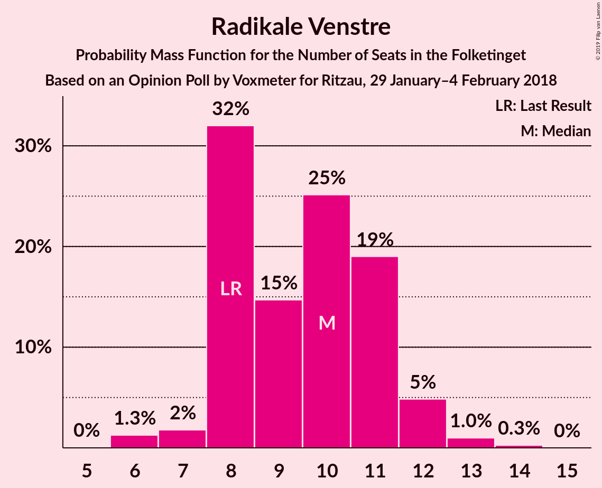

# Opinion Poll by Voxmeter for Ritzau, 29 January–4 February 2018

<a href="#voting-intentions">Voting Intentions</a> | <a href="#seats">Seats</a> | <a href="#coalitions">Coalitions</a> | <a href="#technical-information">Technical Information</a>

## Voting Intentions

### Confidence Intervals

| Party | Last Result | Poll Result | 80% Confidence Interval | 90% Confidence Interval | 95% Confidence Interval | 99% Confidence Interval |
|:-----:|:-----------:|:-----------:|:-----------------------:|:-----------------------:|:-----------------------:|:-----------------------:|
| Socialdemokraterne | 26.3% | 30.0% | 28.2–31.9% |27.7–32.4% |27.3–32.9% |26.4–33.8% |
| Venstre | 19.5% | 19.3% | 17.8–21.0% |17.4–21.5% |17.0–21.9% |16.3–22.7% |
| Dansk Folkeparti | 21.1% | 18.2% | 16.7–19.8% |16.3–20.3% |15.9–20.7% |15.2–21.4% |
| Enhedslisten–De Rød-Grønne | 7.8% | 7.5% | 6.6–8.7% |6.3–9.0% |6.1–9.3% |5.6–9.9% |
| Radikale Venstre | 4.6% | 5.0% | 4.2–6.0% |4.0–6.2% |3.8–6.5% |3.5–7.0% |
| Alternativet | 4.8% | 4.8% | 4.0–5.8% |3.8–6.0% |3.6–6.3% |3.3–6.8% |
| Socialistisk Folkeparti | 4.2% | 4.6% | 3.8–5.5% |3.6–5.8% |3.5–6.1% |3.1–6.6% |
| Liberal Alliance | 7.5% | 4.2% | 3.5–5.1% |3.3–5.4% |3.1–5.6% |2.8–6.1% |
| Det Konservative Folkeparti | 3.4% | 4.0% | 3.3–4.9% |3.1–5.2% |3.0–5.4% |2.7–5.9% |
| Nye Borgerlige | 0.0% | 1.5% | 1.1–2.1% |1.0–2.3% |0.9–2.4% |0.7–2.7% |
| Kristendemokraterne | 0.8% | 0.9% | 0.6–1.4% |0.5–1.5% |0.5–1.7% |0.4–2.0% |

*Note:* The poll result column reflects the actual value used in the calculations. Published results may vary slightly, and in addition be rounded to fewer digits.

## Seats

### Confidence Intervals

| Party | Last Result | Median | 80% Confidence Interval | 90% Confidence Interval | 95% Confidence Interval | 99% Confidence Interval |
|:-----:|:-----------:|:------:|:-----------------------:|:-----------------------:|:-----------------------:|:-----------------------:|
| <a href="#socialdemokraterne">Socialdemokraterne</a> | 47 | 56 | 47–56 |47–56 |47–56 |47–56 |
| <a href="#venstre">Venstre</a> | 34 | 33 | 31–35 |31–35 |31–35 |31–35 |
| <a href="#dansk-folkeparti">Dansk Folkeparti</a> | 37 | 28 | 28–32 |27–32 |27–32 |27–32 |
| <a href="#enhedslisten–de-rød-grønne">Enhedslisten–De Rød-Grønne</a> | 14 | 14 | 12–15 |12–16 |12–16 |12–16 |
| <a href="#radikale-venstre">Radikale Venstre</a> | 8 | 10 | 8–11 |8–11 |8–11 |8–11 |
| <a href="#alternativet">Alternativet</a> | 9 | 8 | 8–11 |8–11 |8–11 |8–11 |
| <a href="#socialistisk-folkeparti">Socialistisk Folkeparti</a> | 7 | 9 | 8–9 |6–9 |6–9 |6–9 |
| <a href="#liberal-alliance">Liberal Alliance</a> | 13 | 8 | 7–8 |7–8 |7–8 |7–8 |
| <a href="#det-konservative-folkeparti">Det Konservative Folkeparti</a> | 6 | 7 | 7–11 |5–11 |5–11 |5–11 |
| <a href="#nye-borgerlige">Nye Borgerlige</a> | 0 | 0 | 0–4 |0–5 |0–5 |0–5 |
| <a href="#kristendemokraterne">Kristendemokraterne</a> | 0 | 0 | 0–4 |0–4 |0–4 |0–4 |

### Socialdemokraterne

*For a full overview of the results for this party, see the [Socialdemokraterne](party-socialdemokraterne.html) page.*

| Number of Seats | Probability | Accumulated | Special Marks |
|:---------------:|:-----------:|:-----------:|:-------------:|
| 47 | 32% | 100% | Last Result |
| 48 | 0.2% | 68% |  |
| 49 | 0% | 68% |  |
| 50 | 0.1% | 68% |  |
| 51 | 16% | 68% |  |
| 52 | 0% | 52% |  |
| 53 | 0% | 52% |  |
| 54 | 0% | 52% |  |
| 55 | 0% | 52% |  |
| 56 | 52% | 52% | Median |
| 57 | 0% | 0.2% |  |
| 58 | 0% | 0.2% |  |
| 59 | 0% | 0.2% |  |
| 60 | 0% | 0.2% |  |
| 61 | 0% | 0.2% |  |
| 62 | 0.2% | 0.2% |  |
| 63 | 0% | 0% |  |

### Venstre

*For a full overview of the results for this party, see the [Venstre](party-venstre.html) page.*

| Number of Seats | Probability | Accumulated | Special Marks |
|:---------------:|:-----------:|:-----------:|:-------------:|
| 28 | 0.1% | 100% |  |
| 29 | 0.1% | 99.9% |  |
| 30 | 0% | 99.8% |  |
| 31 | 44% | 99.8% |  |
| 32 | 0% | 56% |  |
| 33 | 16% | 56% | Median |
| 34 | 0% | 41% | Last Result |
| 35 | 40% | 41% |  |
| 36 | 0.2% | 0.4% |  |
| 37 | 0.2% | 0.2% |  |
| 38 | 0% | 0% |  |

### Dansk Folkeparti

*For a full overview of the results for this party, see the [Dansk Folkeparti](party-danskfolkeparti.html) page.*

| Number of Seats | Probability | Accumulated | Special Marks |
|:---------------:|:-----------:|:-----------:|:-------------:|
| 27 | 8% | 100% |  |
| 28 | 44% | 92% | Median |
| 29 | 0.2% | 48% |  |
| 30 | 0% | 48% |  |
| 31 | 16% | 48% |  |
| 32 | 32% | 32% |  |
| 33 | 0.1% | 0.3% |  |
| 34 | 0% | 0.1% |  |
| 35 | 0% | 0.1% |  |
| 36 | 0% | 0.1% |  |
| 37 | 0% | 0.1% | Last Result |
| 38 | 0.1% | 0.1% |  |
| 39 | 0% | 0% |  |

### Enhedslisten–De Rød-Grønne

*For a full overview of the results for this party, see the [Enhedslisten–De Rød-Grønne](party-enhedslisten–derød-grønne.html) page.*

| Number of Seats | Probability | Accumulated | Special Marks |
|:---------------:|:-----------:|:-----------:|:-------------:|
| 11 | 0.2% | 100% |  |
| 12 | 32% | 99.8% |  |
| 13 | 0.1% | 68% |  |
| 14 | 44% | 68% | Last Result, Median |
| 15 | 16% | 24% |  |
| 16 | 8% | 8% |  |
| 17 | 0% | 0% |  |

### Radikale Venstre

*For a full overview of the results for this party, see the [Radikale Venstre](party-radikalevenstre.html) page.*

| Number of Seats | Probability | Accumulated | Special Marks |
|:---------------:|:-----------:|:-----------:|:-------------:|
| 5 | 0.2% | 100% |  |
| 6 | 0% | 99.8% |  |
| 7 | 0.1% | 99.8% |  |
| 8 | 32% | 99.7% | Last Result |
| 9 | 8% | 68% |  |
| 10 | 44% | 59% | Median |
| 11 | 16% | 16% |  |
| 12 | 0.1% | 0.1% |  |
| 13 | 0% | 0% |  |

### Alternativet

*For a full overview of the results for this party, see the [Alternativet](party-alternativet.html) page.*

| Number of Seats | Probability | Accumulated | Special Marks |
|:---------------:|:-----------:|:-----------:|:-------------:|
| 8 | 52% | 100% | Median |
| 9 | 0% | 48% | Last Result |
| 10 | 16% | 48% |  |
| 11 | 32% | 32% |  |
| 12 | 0% | 0% |  |

### Socialistisk Folkeparti

*For a full overview of the results for this party, see the [Socialistisk Folkeparti](party-socialistiskfolkeparti.html) page.*

| Number of Seats | Probability | Accumulated | Special Marks |
|:---------------:|:-----------:|:-----------:|:-------------:|
| 6 | 8% | 100% |  |
| 7 | 0% | 92% | Last Result |
| 8 | 33% | 92% |  |
| 9 | 59% | 59% | Median |
| 10 | 0% | 0% |  |

### Liberal Alliance

*For a full overview of the results for this party, see the [Liberal Alliance](party-liberalalliance.html) page.*

| Number of Seats | Probability | Accumulated | Special Marks |
|:---------------:|:-----------:|:-----------:|:-------------:|
| 5 | 0.1% | 100% |  |
| 6 | 0% | 99.9% |  |
| 7 | 32% | 99.9% |  |
| 8 | 67% | 68% | Median |
| 9 | 0.1% | 0.4% |  |
| 10 | 0% | 0.2% |  |
| 11 | 0% | 0.2% |  |
| 12 | 0% | 0.2% |  |
| 13 | 0.2% | 0.2% | Last Result |
| 14 | 0% | 0% |  |

### Det Konservative Folkeparti

*For a full overview of the results for this party, see the [Det Konservative Folkeparti](party-detkonservativefolkeparti.html) page.*

| Number of Seats | Probability | Accumulated | Special Marks |
|:---------------:|:-----------:|:-----------:|:-------------:|
| 5 | 8% | 100% |  |
| 6 | 0% | 92% | Last Result |
| 7 | 59% | 92% | Median |
| 8 | 0.4% | 33% |  |
| 9 | 0.1% | 32% |  |
| 10 | 0% | 32% |  |
| 11 | 32% | 32% |  |
| 12 | 0% | 0.1% |  |
| 13 | 0.1% | 0.1% |  |
| 14 | 0% | 0% |  |

### Nye Borgerlige

*For a full overview of the results for this party, see the [Nye Borgerlige](party-nyeborgerlige.html) page.*

| Number of Seats | Probability | Accumulated | Special Marks |
|:---------------:|:-----------:|:-----------:|:-------------:|
| 0 | 60% | 100% | Last Result, Median |
| 1 | 0% | 40% |  |
| 2 | 0% | 40% |  |
| 3 | 0% | 40% |  |
| 4 | 32% | 40% |  |
| 5 | 8% | 8% |  |
| 6 | 0% | 0% |  |

### Kristendemokraterne

*For a full overview of the results for this party, see the [Kristendemokraterne](party-kristendemokraterne.html) page.*

| Number of Seats | Probability | Accumulated | Special Marks |
|:---------------:|:-----------:|:-----------:|:-------------:|
| 0 | 56% | 100% | Last Result, Median |
| 1 | 0% | 44% |  |
| 2 | 0% | 44% |  |
| 3 | 0% | 44% |  |
| 4 | 44% | 44% |  |
| 5 | 0% | 0% |  |

## Coalitions

### Confidence Intervals

| Coalition | Last Result | Median | Majority? | 80% Confidence Interval | 90% Confidence Interval | 95% Confidence Interval | 99% Confidence Interval |
|:---------:|:-----------:|:------:|:---------:|:-----------------------:|:-----------------------:|:-----------------------:|:-----------------------:|
| Socialdemokraterne – Enhedslisten–De Rød-Grønne – Radikale Venstre – Alternativet – Socialistisk Folkeparti | 85 | 96 | 68% | 86–97 | 86–97 | 86–97 | 86–97 |
| Venstre – Dansk Folkeparti – Liberal Alliance – Det Konservative Folkeparti – Nye Borgerlige – Kristendemokraterne | 90 | 79 | 0% | 78–89 | 78–89 | 78–89 | 78–89 |
| Socialdemokraterne – Enhedslisten–De Rød-Grønne – Radikale Venstre – Socialistisk Folkeparti | 76 | 87 | 0% | 75–89 | 75–89 | 75–89 | 75–89 |
| Venstre – Dansk Folkeparti – Liberal Alliance – Det Konservative Folkeparti – Nye Borgerlige | 90 | 79 | 0% | 74–89 | 74–89 | 74–89 | 74–89 |
| Venstre – Dansk Folkeparti – Liberal Alliance – Det Konservative Folkeparti – Kristendemokraterne | 90 | 78 | 0% | 78–85 | 75–85 | 75–85 | 75–85 |
| Venstre – Dansk Folkeparti – Liberal Alliance – Det Konservative Folkeparti | 90 | 75 | 0% | 74–85 | 74–85 | 74–85 | 74–85 |
| Socialdemokraterne – Radikale Venstre – Socialistisk Folkeparti | 62 | 71 | 0% | 63–75 | 63–75 | 63–75 | 63–75 |
| Socialdemokraterne – Radikale Venstre | 55 | 65 | 0% | 55–66 | 55–66 | 55–66 | 55–66 |
| Venstre – Liberal Alliance – Det Konservative Folkeparti | 53 | 48 | 0% | 46–53 | 46–53 | 46–53 | 46–53 |
| Venstre – Det Konservative Folkeparti | 40 | 40 | 0% | 38–46 | 38–46 | 38–46 | 38–46 |
| Venstre | 34 | 33 | 0% | 31–35 | 31–35 | 31–35 | 31–35 |

### Socialdemokraterne – Enhedslisten–De Rød-Grønne – Radikale Venstre – Alternativet – Socialistisk Folkeparti

| Number of Seats | Probability | Accumulated | Special Marks |
|:---------------:|:-----------:|:-----------:|:-------------:|
| 85 | 0% | 100% | Last Result |
| 86 | 32% | 100% |  |
| 87 | 0.2% | 68% |  |
| 88 | 0% | 68% |  |
| 89 | 0% | 68% |  |
| 90 | 0.2% | 68% | Majority |
| 91 | 0% | 68% |  |
| 92 | 0% | 68% |  |
| 93 | 0% | 68% |  |
| 94 | 0.2% | 68% |  |
| 95 | 8% | 67% |  |
| 96 | 16% | 59% |  |
| 97 | 44% | 44% | Median |
| 98 | 0% | 0% |  |

### Venstre – Dansk Folkeparti – Liberal Alliance – Det Konservative Folkeparti – Nye Borgerlige – Kristendemokraterne

| Number of Seats | Probability | Accumulated | Special Marks |
|:---------------:|:-----------:|:-----------:|:-------------:|
| 78 | 44% | 100% |  |
| 79 | 16% | 56% |  |
| 80 | 8% | 41% |  |
| 81 | 0.2% | 33% |  |
| 82 | 0% | 32% |  |
| 83 | 0% | 32% |  |
| 84 | 0% | 32% |  |
| 85 | 0.2% | 32% |  |
| 86 | 0% | 32% |  |
| 87 | 0% | 32% |  |
| 88 | 0.2% | 32% |  |
| 89 | 32% | 32% |  |
| 90 | 0% | 0% | Last Result, Majority |

### Socialdemokraterne – Enhedslisten–De Rød-Grønne – Radikale Venstre – Socialistisk Folkeparti

| Number of Seats | Probability | Accumulated | Special Marks |
|:---------------:|:-----------:|:-----------:|:-------------:|
| 75 | 32% | 100% |  |
| 76 | 0% | 68% | Last Result |
| 77 | 0% | 68% |  |
| 78 | 0% | 68% |  |
| 79 | 0.1% | 68% |  |
| 80 | 0% | 68% |  |
| 81 | 0% | 68% |  |
| 82 | 0.2% | 68% |  |
| 83 | 0% | 68% |  |
| 84 | 0% | 68% |  |
| 85 | 0% | 68% |  |
| 86 | 16% | 68% |  |
| 87 | 8% | 52% |  |
| 88 | 0% | 44% |  |
| 89 | 44% | 44% | Median |
| 90 | 0% | 0% | Majority |

### Venstre – Dansk Folkeparti – Liberal Alliance – Det Konservative Folkeparti – Nye Borgerlige

| Number of Seats | Probability | Accumulated | Special Marks |
|:---------------:|:-----------:|:-----------:|:-------------:|
| 74 | 44% | 100% |  |
| 75 | 0% | 56% |  |
| 76 | 0% | 56% | Median |
| 77 | 0% | 56% |  |
| 78 | 0% | 56% |  |
| 79 | 16% | 56% |  |
| 80 | 8% | 41% |  |
| 81 | 0.2% | 33% |  |
| 82 | 0% | 32% |  |
| 83 | 0% | 32% |  |
| 84 | 0% | 32% |  |
| 85 | 0.2% | 32% |  |
| 86 | 0% | 32% |  |
| 87 | 0% | 32% |  |
| 88 | 0.2% | 32% |  |
| 89 | 32% | 32% |  |
| 90 | 0% | 0% | Last Result, Majority |

### Venstre – Dansk Folkeparti – Liberal Alliance – Det Konservative Folkeparti – Kristendemokraterne

| Number of Seats | Probability | Accumulated | Special Marks |
|:---------------:|:-----------:|:-----------:|:-------------:|
| 75 | 8% | 100% |  |
| 76 | 0% | 92% | Median |
| 77 | 0% | 92% |  |
| 78 | 44% | 92% |  |
| 79 | 16% | 48% |  |
| 80 | 0.1% | 33% |  |
| 81 | 0.2% | 33% |  |
| 82 | 0% | 32% |  |
| 83 | 0% | 32% |  |
| 84 | 0.1% | 32% |  |
| 85 | 32% | 32% |  |
| 86 | 0% | 0% |  |
| 87 | 0% | 0% |  |
| 88 | 0% | 0% |  |
| 89 | 0% | 0% |  |
| 90 | 0% | 0% | Last Result, Majority |

### Venstre – Dansk Folkeparti – Liberal Alliance – Det Konservative Folkeparti

| Number of Seats | Probability | Accumulated | Special Marks |
|:---------------:|:-----------:|:-----------:|:-------------:|
| 74 | 44% | 100% |  |
| 75 | 8% | 56% |  |
| 76 | 0% | 48% | Median |
| 77 | 0% | 48% |  |
| 78 | 0% | 48% |  |
| 79 | 16% | 48% |  |
| 80 | 0.1% | 33% |  |
| 81 | 0.2% | 33% |  |
| 82 | 0% | 32% |  |
| 83 | 0% | 32% |  |
| 84 | 0.1% | 32% |  |
| 85 | 32% | 32% |  |
| 86 | 0% | 0% |  |
| 87 | 0% | 0% |  |
| 88 | 0% | 0% |  |
| 89 | 0% | 0% |  |
| 90 | 0% | 0% | Last Result, Majority |

### Socialdemokraterne – Radikale Venstre – Socialistisk Folkeparti

| Number of Seats | Probability | Accumulated | Special Marks |
|:---------------:|:-----------:|:-----------:|:-------------:|
| 62 | 0% | 100% | Last Result |
| 63 | 32% | 100% |  |
| 64 | 0% | 68% |  |
| 65 | 0.2% | 68% |  |
| 66 | 0% | 68% |  |
| 67 | 0.2% | 68% |  |
| 68 | 0% | 68% |  |
| 69 | 0% | 68% |  |
| 70 | 0% | 68% |  |
| 71 | 24% | 68% |  |
| 72 | 0% | 44% |  |
| 73 | 0% | 44% |  |
| 74 | 0.1% | 44% |  |
| 75 | 44% | 44% | Median |
| 76 | 0% | 0% |  |

### Socialdemokraterne – Radikale Venstre

| Number of Seats | Probability | Accumulated | Special Marks |
|:---------------:|:-----------:|:-----------:|:-------------:|
| 55 | 32% | 100% | Last Result |
| 56 | 0% | 68% |  |
| 57 | 0.2% | 68% |  |
| 58 | 0% | 68% |  |
| 59 | 0.2% | 68% |  |
| 60 | 0% | 68% |  |
| 61 | 0% | 68% |  |
| 62 | 16% | 68% |  |
| 63 | 0% | 52% |  |
| 64 | 0% | 52% |  |
| 65 | 8% | 52% |  |
| 66 | 44% | 44% | Median |
| 67 | 0.2% | 0.3% |  |
| 68 | 0.1% | 0.1% |  |
| 69 | 0% | 0% |  |

### Venstre – Liberal Alliance – Det Konservative Folkeparti

| Number of Seats | Probability | Accumulated | Special Marks |
|:---------------:|:-----------:|:-----------:|:-------------:|
| 42 | 0.1% | 100% |  |
| 43 | 0% | 99.9% |  |
| 44 | 0% | 99.9% |  |
| 45 | 0% | 99.9% |  |
| 46 | 44% | 99.9% |  |
| 47 | 0% | 56% |  |
| 48 | 24% | 56% | Median |
| 49 | 0% | 33% |  |
| 50 | 0% | 33% |  |
| 51 | 0.1% | 33% |  |
| 52 | 0.2% | 32% |  |
| 53 | 32% | 32% | Last Result |
| 54 | 0% | 0.2% |  |
| 55 | 0% | 0.2% |  |
| 56 | 0% | 0.2% |  |
| 57 | 0.2% | 0.2% |  |
| 58 | 0% | 0% |  |

### Venstre – Det Konservative Folkeparti

| Number of Seats | Probability | Accumulated | Special Marks |
|:---------------:|:-----------:|:-----------:|:-------------:|
| 37 | 0.1% | 100% |  |
| 38 | 44% | 99.9% |  |
| 39 | 0% | 56% |  |
| 40 | 24% | 56% | Last Result, Median |
| 41 | 0% | 33% |  |
| 42 | 0.1% | 33% |  |
| 43 | 0% | 32% |  |
| 44 | 0.2% | 32% |  |
| 45 | 0.2% | 32% |  |
| 46 | 32% | 32% |  |
| 47 | 0% | 0% |  |

### Venstre

| Number of Seats | Probability | Accumulated | Special Marks |
|:---------------:|:-----------:|:-----------:|:-------------:|
| 28 | 0.1% | 100% |  |
| 29 | 0.1% | 99.9% |  |
| 30 | 0% | 99.8% |  |
| 31 | 44% | 99.8% |  |
| 32 | 0% | 56% |  |
| 33 | 16% | 56% | Median |
| 34 | 0% | 41% | Last Result |
| 35 | 40% | 41% |  |
| 36 | 0.2% | 0.4% |  |
| 37 | 0.2% | 0.2% |  |
| 38 | 0% | 0% |  |

## Technical Information

### Opinion Poll

+ **Polling firm:** Voxmeter
+ **Commissioner(s):** Ritzau
+ **Fieldwork period:** 29 January–4 February 2018

### Calculations

+ **Sample size:** 1024
+ **Simulations done:** 1,024
+ **Error estimate:** 5.49%

