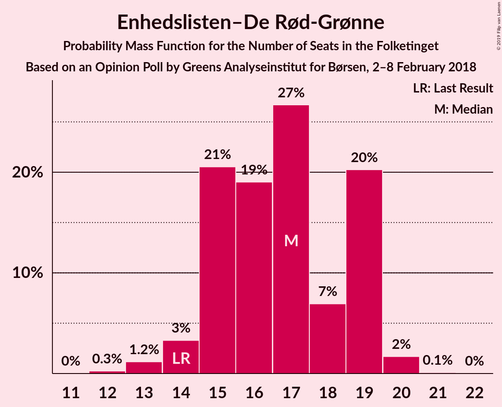
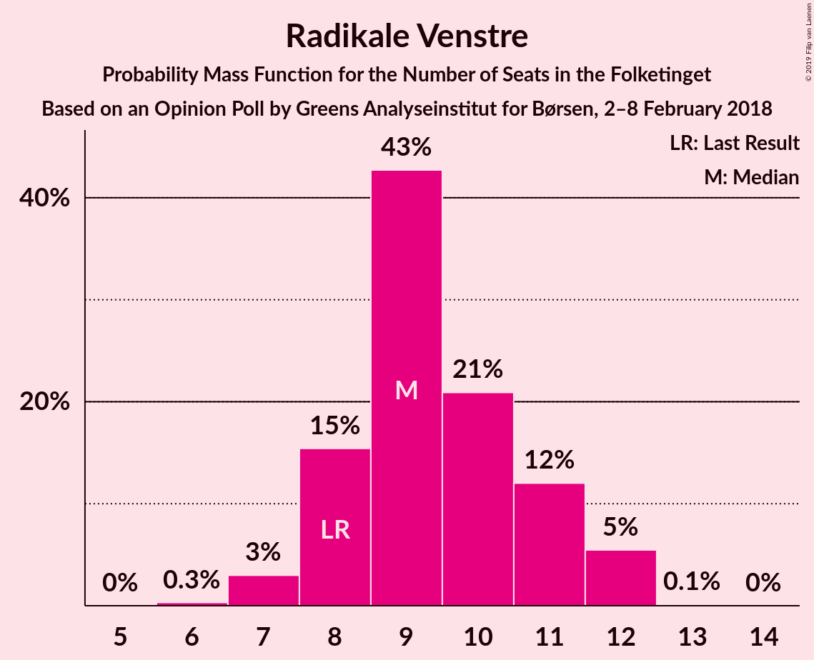
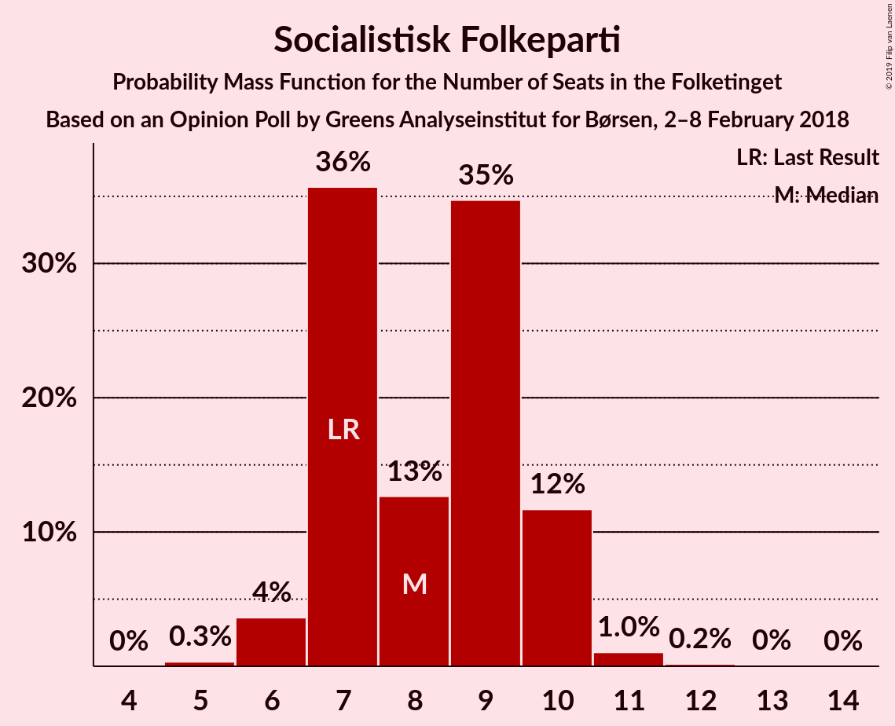

# Opinion Poll by Greens Analyseinstitut for Børsen, 2–8 February 2018

<a href="#voting-intentions">Voting Intentions</a> | <a href="#seats">Seats</a> | <a href="#coalitions">Coalitions</a> | <a href="#technical-information">Technical Information</a>

## Voting Intentions

### Confidence Intervals

| Party | Last Result | Poll Result | 80% Confidence Interval | 90% Confidence Interval | 95% Confidence Interval | 99% Confidence Interval |
|:-----:|:-----------:|:-----------:|:-----------------------:|:-----------------------:|:-----------------------:|:-----------------------:|
| Socialdemokraterne | 26.3% | 28.2% | 26.5–29.9% |26.0–30.5% |25.6–30.9% |24.8–31.7% |
| Venstre | 19.5% | 19.8% | 18.3–21.4% |17.9–21.8% |17.5–22.2% |16.9–23.0% |
| Dansk Folkeparti | 21.1% | 16.5% | 15.1–18.0% |14.7–18.4% |14.4–18.7% |13.8–19.5% |
| Enhedslisten–De Rød-Grønne | 7.8% | 9.1% | 8.1–10.3% |7.8–10.7% |7.6–11.0% |7.1–11.6% |
| Liberal Alliance | 7.5% | 5.2% | 4.4–6.1% |4.2–6.4% |4.0–6.7% |3.7–7.1% |
| Radikale Venstre | 4.6% | 5.1% | 4.3–6.1% |4.1–6.3% |3.9–6.6% |3.6–7.0% |
| Det Konservative Folkeparti | 3.4% | 4.6% | 3.9–5.5% |3.6–5.7% |3.5–6.0% |3.2–6.4% |
| Socialistisk Folkeparti | 4.2% | 4.5% | 3.8–5.4% |3.6–5.6% |3.4–5.9% |3.1–6.3% |
| Alternativet | 4.8% | 4.3% | 3.6–5.2% |3.4–5.4% |3.2–5.7% |2.9–6.1% |
| Nye Borgerlige | 0.0% | 1.8% | 1.4–2.4% |1.2–2.6% |1.2–2.8% |1.0–3.1% |
| Kristendemokraterne | 0.8% | 0.7% | 0.5–1.2% |0.4–1.3% |0.4–1.4% |0.3–1.7% |

*Note:* The poll result column reflects the actual value used in the calculations. Published results may vary slightly, and in addition be rounded to fewer digits.

## Seats

### Confidence Intervals

| Party | Last Result | Median | 80% Confidence Interval | 90% Confidence Interval | 95% Confidence Interval | 99% Confidence Interval |
|:-----:|:-----------:|:------:|:-----------------------:|:-----------------------:|:-----------------------:|:-----------------------:|
| <a href="#socialdemokraterne">Socialdemokraterne</a> | 47 | 49 | 47–52 |47–53 |46–54 |44–55 |
| <a href="#venstre">Venstre</a> | 34 | 36 | 34–39 |33–39 |32–40 |30–40 |
| <a href="#dansk-folkeparti">Dansk Folkeparti</a> | 37 | 30 | 26–30 |26–31 |26–32 |25–33 |
| <a href="#enhedslisten–de-rød-grønne">Enhedslisten–De Rød-Grønne</a> | 14 | 19 | 14–20 |13–20 |13–20 |12–20 |
| <a href="#liberal-alliance">Liberal Alliance</a> | 13 | 8 | 8–11 |8–11 |8–11 |7–13 |
| <a href="#radikale-venstre">Radikale Venstre</a> | 8 | 10 | 8–11 |7–11 |7–11 |6–12 |
| <a href="#det-konservative-folkeparti">Det Konservative Folkeparti</a> | 6 | 8 | 6–10 |6–11 |6–11 |6–11 |
| <a href="#socialistisk-folkeparti">Socialistisk Folkeparti</a> | 7 | 7 | 7–9 |7–9 |7–10 |5–11 |
| <a href="#alternativet">Alternativet</a> | 9 | 7 | 6–10 |6–10 |6–11 |5–11 |
| <a href="#nye-borgerlige">Nye Borgerlige</a> | 0 | 0 | 0–4 |0–4 |0–4 |0–6 |
| <a href="#kristendemokraterne">Kristendemokraterne</a> | 0 | 0 | 0 |0 |0 |0 |

### Socialdemokraterne

*For a full overview of the results for this party, see the [Socialdemokraterne](party-socialdemokraterne.html) page.*

| Number of Seats | Probability | Accumulated | Special Marks |
|:---------------:|:-----------:|:-----------:|:-------------:|
| 42 | 0.1% | 100% |  |
| 43 | 0.2% | 99.9% |  |
| 44 | 0.6% | 99.7% |  |
| 45 | 0.7% | 99.1% |  |
| 46 | 3% | 98% |  |
| 47 | 27% | 95% | Last Result |
| 48 | 0.9% | 68% |  |
| 49 | 46% | 68% | Median |
| 50 | 8% | 21% |  |
| 51 | 3% | 13% |  |
| 52 | 2% | 11% |  |
| 53 | 4% | 9% |  |
| 54 | 4% | 4% |  |
| 55 | 0.6% | 0.8% |  |
| 56 | 0% | 0.2% |  |
| 57 | 0.1% | 0.2% |  |
| 58 | 0.1% | 0.1% |  |
| 59 | 0% | 0% |  |

### Venstre

*For a full overview of the results for this party, see the [Venstre](party-venstre.html) page.*

| Number of Seats | Probability | Accumulated | Special Marks |
|:---------------:|:-----------:|:-----------:|:-------------:|
| 29 | 0.2% | 100% |  |
| 30 | 0.6% | 99.8% |  |
| 31 | 0.8% | 99.2% |  |
| 32 | 2% | 98% |  |
| 33 | 3% | 97% |  |
| 34 | 5% | 94% | Last Result |
| 35 | 19% | 88% |  |
| 36 | 53% | 69% | Median |
| 37 | 3% | 17% |  |
| 38 | 1.5% | 14% |  |
| 39 | 10% | 13% |  |
| 40 | 3% | 3% |  |
| 41 | 0% | 0.2% |  |
| 42 | 0% | 0.2% |  |
| 43 | 0.1% | 0.2% |  |
| 44 | 0.1% | 0.1% |  |
| 45 | 0% | 0% |  |

### Dansk Folkeparti

*For a full overview of the results for this party, see the [Dansk Folkeparti](party-danskfolkeparti.html) page.*

| Number of Seats | Probability | Accumulated | Special Marks |
|:---------------:|:-----------:|:-----------:|:-------------:|
| 24 | 0.1% | 100% |  |
| 25 | 0.7% | 99.9% |  |
| 26 | 18% | 99.2% |  |
| 27 | 1.2% | 81% |  |
| 28 | 10% | 80% |  |
| 29 | 1.1% | 70% |  |
| 30 | 61% | 69% | Median |
| 31 | 5% | 8% |  |
| 32 | 2% | 3% |  |
| 33 | 0.8% | 1.3% |  |
| 34 | 0.2% | 0.5% |  |
| 35 | 0.2% | 0.3% |  |
| 36 | 0.1% | 0.1% |  |
| 37 | 0% | 0% | Last Result |

### Enhedslisten–De Rød-Grønne

*For a full overview of the results for this party, see the [Enhedslisten–De Rød-Grønne](party-enhedslisten–derød-grønne.html) page.*

| Number of Seats | Probability | Accumulated | Special Marks |
|:---------------:|:-----------:|:-----------:|:-------------:|
| 12 | 1.0% | 100% |  |
| 13 | 6% | 99.0% |  |
| 14 | 9% | 93% | Last Result |
| 15 | 5% | 84% |  |
| 16 | 9% | 78% |  |
| 17 | 1.0% | 69% |  |
| 18 | 3% | 68% |  |
| 19 | 48% | 65% | Median |
| 20 | 16% | 17% |  |
| 21 | 0.1% | 0.2% |  |
| 22 | 0% | 0% |  |

### Liberal Alliance

*For a full overview of the results for this party, see the [Liberal Alliance](party-liberalalliance.html) page.*

| Number of Seats | Probability | Accumulated | Special Marks |
|:---------------:|:-----------:|:-----------:|:-------------:|
| 6 | 0.2% | 100% |  |
| 7 | 2% | 99.8% |  |
| 8 | 54% | 98% | Median |
| 9 | 18% | 43% |  |
| 10 | 10% | 25% |  |
| 11 | 12% | 15% |  |
| 12 | 0.8% | 2% |  |
| 13 | 2% | 2% | Last Result |
| 14 | 0% | 0% |  |

### Radikale Venstre

*For a full overview of the results for this party, see the [Radikale Venstre](party-radikalevenstre.html) page.*

| Number of Seats | Probability | Accumulated | Special Marks |
|:---------------:|:-----------:|:-----------:|:-------------:|
| 6 | 0.9% | 100% |  |
| 7 | 4% | 99.0% |  |
| 8 | 15% | 95% | Last Result |
| 9 | 13% | 80% |  |
| 10 | 18% | 67% | Median |
| 11 | 48% | 49% |  |
| 12 | 0.6% | 0.9% |  |
| 13 | 0.2% | 0.3% |  |
| 14 | 0.1% | 0.1% |  |
| 15 | 0% | 0% |  |

### Det Konservative Folkeparti

*For a full overview of the results for this party, see the [Det Konservative Folkeparti](party-detkonservativefolkeparti.html) page.*

| Number of Seats | Probability | Accumulated | Special Marks |
|:---------------:|:-----------:|:-----------:|:-------------:|
| 5 | 0.2% | 100% |  |
| 6 | 11% | 99.7% | Last Result |
| 7 | 4% | 89% |  |
| 8 | 65% | 85% | Median |
| 9 | 10% | 20% |  |
| 10 | 1.3% | 10% |  |
| 11 | 9% | 9% |  |
| 12 | 0.4% | 0.4% |  |
| 13 | 0.1% | 0.1% |  |
| 14 | 0% | 0% |  |

### Socialistisk Folkeparti

*For a full overview of the results for this party, see the [Socialistisk Folkeparti](party-socialistiskfolkeparti.html) page.*

| Number of Seats | Probability | Accumulated | Special Marks |
|:---------------:|:-----------:|:-----------:|:-------------:|
| 5 | 2% | 100% |  |
| 6 | 0.5% | 98% |  |
| 7 | 52% | 98% | Last Result, Median |
| 8 | 35% | 46% |  |
| 9 | 7% | 10% |  |
| 10 | 2% | 4% |  |
| 11 | 1.1% | 1.1% |  |
| 12 | 0% | 0% |  |

### Alternativet

*For a full overview of the results for this party, see the [Alternativet](party-alternativet.html) page.*

| Number of Seats | Probability | Accumulated | Special Marks |
|:---------------:|:-----------:|:-----------:|:-------------:|
| 5 | 1.1% | 100% |  |
| 6 | 15% | 98.9% |  |
| 7 | 50% | 84% | Median |
| 8 | 19% | 34% |  |
| 9 | 3% | 14% | Last Result |
| 10 | 7% | 11% |  |
| 11 | 4% | 4% |  |
| 12 | 0% | 0% |  |

### Nye Borgerlige

*For a full overview of the results for this party, see the [Nye Borgerlige](party-nyeborgerlige.html) page.*

| Number of Seats | Probability | Accumulated | Special Marks |
|:---------------:|:-----------:|:-----------:|:-------------:|
| 0 | 64% | 100% | Last Result, Median |
| 1 | 0% | 36% |  |
| 2 | 0% | 36% |  |
| 3 | 0% | 36% |  |
| 4 | 34% | 36% |  |
| 5 | 1.3% | 2% |  |
| 6 | 0.6% | 0.6% |  |
| 7 | 0% | 0% |  |

### Kristendemokraterne

*For a full overview of the results for this party, see the [Kristendemokraterne](party-kristendemokraterne.html) page.*

| Number of Seats | Probability | Accumulated | Special Marks |
|:---------------:|:-----------:|:-----------:|:-------------:|
| 0 | 100% | 100% | Last Result, Median |

## Coalitions

### Confidence Intervals

| Coalition | Last Result | Median | Majority? | 80% Confidence Interval | 90% Confidence Interval | 95% Confidence Interval | 99% Confidence Interval |
|:---------:|:-----------:|:------:|:---------:|:-----------------------:|:-----------------------:|:-----------------------:|:-----------------------:|
| Socialdemokraterne – Enhedslisten–De Rød-Grønne – Radikale Venstre – Socialistisk Folkeparti – Alternativet | 85 | 93 | 78% | 88–93 | 85–93 | 85–94 | 85–96 |
| Venstre – Dansk Folkeparti – Liberal Alliance – Det Konservative Folkeparti – Nye Borgerlige – Kristendemokraterne | 90 | 82 | 9% | 82–87 | 82–90 | 81–90 | 79–90 |
| Venstre – Dansk Folkeparti – Liberal Alliance – Det Konservative Folkeparti – Nye Borgerlige | 90 | 82 | 9% | 82–87 | 82–90 | 81–90 | 79–90 |
| Venstre – Dansk Folkeparti – Liberal Alliance – Det Konservative Folkeparti – Kristendemokraterne | 90 | 82 | 0.1% | 78–86 | 78–87 | 78–87 | 74–88 |
| Venstre – Dansk Folkeparti – Liberal Alliance – Det Konservative Folkeparti | 90 | 82 | 0.1% | 78–86 | 78–87 | 78–87 | 74–88 |
| Socialdemokraterne – Enhedslisten–De Rød-Grønne – Radikale Venstre – Socialistisk Folkeparti | 76 | 86 | 0.2% | 79–86 | 79–86 | 78–87 | 77–89 |
| Socialdemokraterne – Enhedslisten–De Rød-Grønne – Socialistisk Folkeparti – Alternativet | 77 | 82 | 0.4% | 78–83 | 77–84 | 77–86 | 75–88 |
| Socialdemokraterne – Enhedslisten–De Rød-Grønne – Socialistisk Folkeparti | 68 | 75 | 0% | 71–75 | 70–77 | 69–79 | 67–80 |
| Socialdemokraterne – Radikale Venstre – Socialistisk Folkeparti | 62 | 67 | 0% | 63–68 | 63–70 | 63–72 | 62–72 |
| Socialdemokraterne – Radikale Venstre | 55 | 60 | 0% | 55–61 | 55–63 | 55–63 | 53–64 |
| Venstre – Liberal Alliance – Det Konservative Folkeparti | 53 | 52 | 0% | 52–56 | 50–57 | 49–59 | 47–59 |
| Venstre – Det Konservative Folkeparti | 40 | 44 | 0% | 43–45 | 41–47 | 40–51 | 38–51 |
| Venstre | 34 | 36 | 0% | 34–39 | 33–39 | 32–40 | 30–40 |

### Socialdemokraterne – Enhedslisten–De Rød-Grønne – Radikale Venstre – Socialistisk Folkeparti – Alternativet

| Number of Seats | Probability | Accumulated | Special Marks |
|:---------------:|:-----------:|:-----------:|:-------------:|
| 82 | 0.1% | 100% |  |
| 83 | 0.2% | 99.9% |  |
| 84 | 0.1% | 99.7% |  |
| 85 | 8% | 99.6% | Last Result |
| 86 | 0.3% | 91% |  |
| 87 | 1.1% | 91% |  |
| 88 | 6% | 90% |  |
| 89 | 7% | 84% |  |
| 90 | 4% | 78% | Majority |
| 91 | 2% | 73% |  |
| 92 | 3% | 71% | Median |
| 93 | 65% | 68% |  |
| 94 | 1.0% | 3% |  |
| 95 | 0.3% | 2% |  |
| 96 | 2% | 2% |  |
| 97 | 0% | 0.2% |  |
| 98 | 0% | 0.1% |  |
| 99 | 0% | 0.1% |  |
| 100 | 0% | 0% |  |

### Venstre – Dansk Folkeparti – Liberal Alliance – Det Konservative Folkeparti – Nye Borgerlige – Kristendemokraterne

| Number of Seats | Probability | Accumulated | Special Marks |
|:---------------:|:-----------:|:-----------:|:-------------:|
| 76 | 0% | 100% |  |
| 77 | 0% | 99.9% |  |
| 78 | 0% | 99.9% |  |
| 79 | 2% | 99.8% |  |
| 80 | 0.3% | 98% |  |
| 81 | 1.0% | 98% |  |
| 82 | 65% | 97% | Median |
| 83 | 3% | 32% |  |
| 84 | 2% | 29% |  |
| 85 | 4% | 27% |  |
| 86 | 7% | 22% |  |
| 87 | 6% | 16% |  |
| 88 | 1.1% | 10% |  |
| 89 | 0.3% | 9% |  |
| 90 | 8% | 9% | Last Result, Majority |
| 91 | 0.1% | 0.4% |  |
| 92 | 0.2% | 0.3% |  |
| 93 | 0.1% | 0.1% |  |
| 94 | 0% | 0% |  |

### Venstre – Dansk Folkeparti – Liberal Alliance – Det Konservative Folkeparti – Nye Borgerlige

| Number of Seats | Probability | Accumulated | Special Marks |
|:---------------:|:-----------:|:-----------:|:-------------:|
| 76 | 0% | 100% |  |
| 77 | 0% | 99.9% |  |
| 78 | 0% | 99.9% |  |
| 79 | 2% | 99.8% |  |
| 80 | 0.3% | 98% |  |
| 81 | 1.0% | 98% |  |
| 82 | 65% | 97% | Median |
| 83 | 3% | 32% |  |
| 84 | 2% | 29% |  |
| 85 | 4% | 27% |  |
| 86 | 7% | 22% |  |
| 87 | 6% | 16% |  |
| 88 | 1.1% | 10% |  |
| 89 | 0.3% | 9% |  |
| 90 | 8% | 9% | Last Result, Majority |
| 91 | 0.1% | 0.4% |  |
| 92 | 0.2% | 0.3% |  |
| 93 | 0.1% | 0.1% |  |
| 94 | 0% | 0% |  |

### Venstre – Dansk Folkeparti – Liberal Alliance – Det Konservative Folkeparti – Kristendemokraterne

| Number of Seats | Probability | Accumulated | Special Marks |
|:---------------:|:-----------:|:-----------:|:-------------:|
| 74 | 0.5% | 100% |  |
| 75 | 0.2% | 99.4% |  |
| 76 | 0.2% | 99.2% |  |
| 77 | 0.1% | 99.0% |  |
| 78 | 17% | 98.9% |  |
| 79 | 2% | 82% |  |
| 80 | 2% | 80% |  |
| 81 | 4% | 79% |  |
| 82 | 50% | 74% | Median |
| 83 | 4% | 25% |  |
| 84 | 0.5% | 20% |  |
| 85 | 1.3% | 20% |  |
| 86 | 13% | 18% |  |
| 87 | 4% | 5% |  |
| 88 | 0.9% | 1.2% |  |
| 89 | 0.2% | 0.3% |  |
| 90 | 0% | 0.1% | Last Result, Majority |
| 91 | 0% | 0.1% |  |
| 92 | 0% | 0.1% |  |
| 93 | 0.1% | 0.1% |  |
| 94 | 0% | 0% |  |

### Venstre – Dansk Folkeparti – Liberal Alliance – Det Konservative Folkeparti

| Number of Seats | Probability | Accumulated | Special Marks |
|:---------------:|:-----------:|:-----------:|:-------------:|
| 74 | 0.5% | 100% |  |
| 75 | 0.2% | 99.4% |  |
| 76 | 0.2% | 99.2% |  |
| 77 | 0.1% | 99.0% |  |
| 78 | 17% | 98.9% |  |
| 79 | 2% | 82% |  |
| 80 | 2% | 80% |  |
| 81 | 4% | 78% |  |
| 82 | 50% | 74% | Median |
| 83 | 5% | 25% |  |
| 84 | 0.5% | 20% |  |
| 85 | 1.3% | 20% |  |
| 86 | 13% | 18% |  |
| 87 | 4% | 5% |  |
| 88 | 0.9% | 1.2% |  |
| 89 | 0.2% | 0.3% |  |
| 90 | 0% | 0.1% | Last Result, Majority |
| 91 | 0% | 0.1% |  |
| 92 | 0% | 0.1% |  |
| 93 | 0.1% | 0.1% |  |
| 94 | 0% | 0% |  |

### Socialdemokraterne – Enhedslisten–De Rød-Grønne – Radikale Venstre – Socialistisk Folkeparti

| Number of Seats | Probability | Accumulated | Special Marks |
|:---------------:|:-----------:|:-----------:|:-------------:|
| 74 | 0.2% | 100% |  |
| 75 | 0.1% | 99.8% |  |
| 76 | 0.1% | 99.7% | Last Result |
| 77 | 0.2% | 99.6% |  |
| 78 | 4% | 99.4% |  |
| 79 | 12% | 95% |  |
| 80 | 1.0% | 83% |  |
| 81 | 2% | 82% |  |
| 82 | 5% | 80% |  |
| 83 | 5% | 75% |  |
| 84 | 2% | 70% |  |
| 85 | 18% | 68% | Median |
| 86 | 47% | 51% |  |
| 87 | 2% | 3% |  |
| 88 | 0.7% | 1.3% |  |
| 89 | 0.4% | 0.6% |  |
| 90 | 0.1% | 0.2% | Majority |
| 91 | 0% | 0.1% |  |
| 92 | 0% | 0.1% |  |
| 93 | 0% | 0% |  |

### Socialdemokraterne – Enhedslisten–De Rød-Grønne – Socialistisk Folkeparti – Alternativet

| Number of Seats | Probability | Accumulated | Special Marks |
|:---------------:|:-----------:|:-----------:|:-------------:|
| 73 | 0.1% | 100% |  |
| 74 | 0% | 99.8% |  |
| 75 | 0.6% | 99.8% |  |
| 76 | 0.3% | 99.2% |  |
| 77 | 8% | 98.9% | Last Result |
| 78 | 3% | 91% |  |
| 79 | 3% | 88% |  |
| 80 | 7% | 85% |  |
| 81 | 3% | 77% |  |
| 82 | 45% | 74% | Median |
| 83 | 20% | 29% |  |
| 84 | 4% | 9% |  |
| 85 | 1.4% | 5% |  |
| 86 | 1.4% | 4% |  |
| 87 | 0.8% | 2% |  |
| 88 | 0.9% | 1.4% |  |
| 89 | 0.1% | 0.5% |  |
| 90 | 0.4% | 0.4% | Majority |
| 91 | 0% | 0% |  |

### Socialdemokraterne – Enhedslisten–De Rød-Grønne – Socialistisk Folkeparti

| Number of Seats | Probability | Accumulated | Special Marks |
|:---------------:|:-----------:|:-----------:|:-------------:|
| 65 | 0.1% | 100% |  |
| 66 | 0.3% | 99.9% |  |
| 67 | 0.5% | 99.6% |  |
| 68 | 0.2% | 99.1% | Last Result |
| 69 | 2% | 99.0% |  |
| 70 | 4% | 97% |  |
| 71 | 9% | 93% |  |
| 72 | 5% | 84% |  |
| 73 | 3% | 78% |  |
| 74 | 6% | 75% |  |
| 75 | 60% | 69% | Median |
| 76 | 1.1% | 9% |  |
| 77 | 4% | 8% |  |
| 78 | 1.1% | 4% |  |
| 79 | 2% | 3% |  |
| 80 | 0.4% | 0.8% |  |
| 81 | 0.4% | 0.5% |  |
| 82 | 0% | 0.1% |  |
| 83 | 0% | 0.1% |  |
| 84 | 0% | 0% |  |

### Socialdemokraterne – Radikale Venstre – Socialistisk Folkeparti

| Number of Seats | Probability | Accumulated | Special Marks |
|:---------------:|:-----------:|:-----------:|:-------------:|
| 60 | 0.3% | 100% |  |
| 61 | 0.1% | 99.6% |  |
| 62 | 0.3% | 99.5% | Last Result |
| 63 | 12% | 99.2% |  |
| 64 | 3% | 87% |  |
| 65 | 20% | 85% |  |
| 66 | 0.7% | 65% | Median |
| 67 | 51% | 64% |  |
| 68 | 4% | 13% |  |
| 69 | 1.2% | 9% |  |
| 70 | 5% | 8% |  |
| 71 | 0.5% | 3% |  |
| 72 | 2% | 3% |  |
| 73 | 0% | 0.2% |  |
| 74 | 0.1% | 0.2% |  |
| 75 | 0% | 0% |  |

### Socialdemokraterne – Radikale Venstre

| Number of Seats | Probability | Accumulated | Special Marks |
|:---------------:|:-----------:|:-----------:|:-------------:|
| 52 | 0.3% | 100% |  |
| 53 | 0.2% | 99.6% |  |
| 54 | 0.2% | 99.5% |  |
| 55 | 13% | 99.2% | Last Result |
| 56 | 2% | 86% |  |
| 57 | 20% | 85% |  |
| 58 | 3% | 65% |  |
| 59 | 3% | 62% | Median |
| 60 | 49% | 59% |  |
| 61 | 2% | 10% |  |
| 62 | 2% | 8% |  |
| 63 | 4% | 5% |  |
| 64 | 0.7% | 0.9% |  |
| 65 | 0% | 0.2% |  |
| 66 | 0.1% | 0.1% |  |
| 67 | 0% | 0% |  |

### Venstre – Liberal Alliance – Det Konservative Folkeparti

| Number of Seats | Probability | Accumulated | Special Marks |
|:---------------:|:-----------:|:-----------:|:-------------:|
| 45 | 0.1% | 100% |  |
| 46 | 0.2% | 99.9% |  |
| 47 | 0.5% | 99.7% |  |
| 48 | 1.2% | 99.2% |  |
| 49 | 2% | 98% |  |
| 50 | 2% | 96% |  |
| 51 | 0.6% | 94% |  |
| 52 | 63% | 93% | Median |
| 53 | 4% | 30% | Last Result |
| 54 | 1.4% | 26% |  |
| 55 | 7% | 25% |  |
| 56 | 13% | 18% |  |
| 57 | 2% | 5% |  |
| 58 | 0.6% | 3% |  |
| 59 | 2% | 3% |  |
| 60 | 0% | 0.2% |  |
| 61 | 0.1% | 0.2% |  |
| 62 | 0% | 0% |  |

### Venstre – Det Konservative Folkeparti

| Number of Seats | Probability | Accumulated | Special Marks |
|:---------------:|:-----------:|:-----------:|:-------------:|
| 37 | 0.3% | 100% |  |
| 38 | 0.8% | 99.7% |  |
| 39 | 0.9% | 98.8% |  |
| 40 | 2% | 98% | Last Result |
| 41 | 2% | 96% |  |
| 42 | 2% | 94% |  |
| 43 | 18% | 92% |  |
| 44 | 49% | 75% | Median |
| 45 | 17% | 26% |  |
| 46 | 4% | 9% |  |
| 47 | 2% | 6% |  |
| 48 | 0.5% | 3% |  |
| 49 | 0.1% | 3% |  |
| 50 | 0.1% | 3% |  |
| 51 | 2% | 3% |  |
| 52 | 0.1% | 0.1% |  |
| 53 | 0% | 0% |  |

### Venstre

| Number of Seats | Probability | Accumulated | Special Marks |
|:---------------:|:-----------:|:-----------:|:-------------:|
| 29 | 0.2% | 100% |  |
| 30 | 0.6% | 99.8% |  |
| 31 | 0.8% | 99.2% |  |
| 32 | 2% | 98% |  |
| 33 | 3% | 97% |  |
| 34 | 5% | 94% | Last Result |
| 35 | 19% | 88% |  |
| 36 | 53% | 69% | Median |
| 37 | 3% | 17% |  |
| 38 | 1.5% | 14% |  |
| 39 | 10% | 13% |  |
| 40 | 3% | 3% |  |
| 41 | 0% | 0.2% |  |
| 42 | 0% | 0.2% |  |
| 43 | 0.1% | 0.2% |  |
| 44 | 0.1% | 0.1% |  |
| 45 | 0% | 0% |  |

## Technical Information

### Opinion Poll

+ **Polling firm:** Greens Analyseinstitut
+ **Commissioner(s):** Børsen
+ **Fieldwork period:** 2–8 February 2018

### Calculations

+ **Sample size:** 1118
+ **Simulations done:** 131,072
+ **Error estimate:** 2.29%

