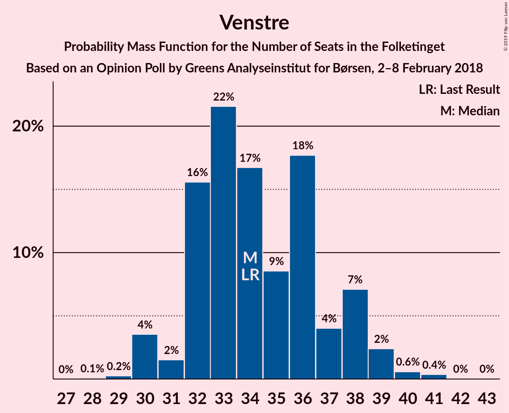
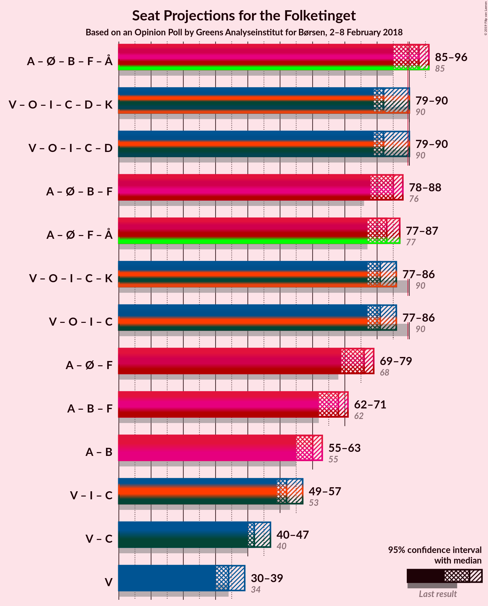

# Opinion Poll by Greens Analyseinstitut for Børsen, 2–8 February 2018

<a href="#voting-intentions">Voting Intentions</a> | <a href="#seats">Seats</a> | <a href="#coalitions">Coalitions</a> | <a href="#technical-information">Technical Information</a>

## Voting Intentions

### Confidence Intervals

| Party | Last Result | Poll Result | 80% Confidence Interval | 90% Confidence Interval | 95% Confidence Interval | 99% Confidence Interval |
|:-----:|:-----------:|:-----------:|:-----------------------:|:-----------------------:|:-----------------------:|:-----------------------:|
| Socialdemokraterne | 26.3% | 28.2% | 26.5–29.9% |26.0–30.5% |25.6–30.9% |24.8–31.7% |
| Venstre | 19.5% | 19.8% | 18.3–21.4% |17.9–21.8% |17.5–22.2% |16.9–23.0% |
| Dansk Folkeparti | 21.1% | 16.5% | 15.1–18.0% |14.7–18.4% |14.4–18.7% |13.8–19.5% |
| Enhedslisten–De Rød-Grønne | 7.8% | 9.1% | 8.1–10.3% |7.8–10.7% |7.6–11.0% |7.1–11.6% |
| Liberal Alliance | 7.5% | 5.2% | 4.4–6.1% |4.2–6.4% |4.0–6.7% |3.7–7.1% |
| Radikale Venstre | 4.6% | 5.1% | 4.3–6.1% |4.1–6.3% |3.9–6.6% |3.6–7.0% |
| Det Konservative Folkeparti | 3.4% | 4.6% | 3.9–5.5% |3.6–5.7% |3.5–6.0% |3.2–6.4% |
| Socialistisk Folkeparti | 4.2% | 4.5% | 3.8–5.4% |3.6–5.6% |3.4–5.9% |3.1–6.3% |
| Alternativet | 4.8% | 4.3% | 3.6–5.2% |3.4–5.4% |3.2–5.7% |2.9–6.1% |
| Nye Borgerlige | 0.0% | 1.8% | 1.4–2.4% |1.2–2.6% |1.2–2.8% |1.0–3.1% |
| Kristendemokraterne | 0.8% | 0.7% | 0.5–1.2% |0.4–1.3% |0.4–1.4% |0.3–1.7% |

*Note:* The poll result column reflects the actual value used in the calculations. Published results may vary slightly, and in addition be rounded to fewer digits.

## Seats

### Confidence Intervals

| Party | Last Result | Median | 80% Confidence Interval | 90% Confidence Interval | 95% Confidence Interval | 99% Confidence Interval |
|:-----:|:-----------:|:------:|:-----------------------:|:-----------------------:|:-----------------------:|:-----------------------:|
| <a href="#socialdemokraterne">Socialdemokraterne</a> | 47 | 47 | 47–57 |47–57 |47–57 |47–57 |
| <a href="#venstre">Venstre</a> | 34 | 35 | 31–38 |31–38 |31–38 |31–38 |
| <a href="#dansk-folkeparti">Dansk Folkeparti</a> | 37 | 27 | 26–29 |26–29 |26–29 |26–29 |
| <a href="#enhedslisten–de-rød-grønne">Enhedslisten–De Rød-Grønne</a> | 14 | 15 | 15–20 |15–20 |15–20 |15–20 |
| <a href="#liberal-alliance">Liberal Alliance</a> | 13 | 13 | 8–13 |8–13 |8–13 |8–13 |
| <a href="#radikale-venstre">Radikale Venstre</a> | 8 | 13 | 10–13 |10–13 |10–13 |10–13 |
| <a href="#det-konservative-folkeparti">Det Konservative Folkeparti</a> | 6 | 11 | 6–11 |6–11 |6–11 |6–11 |
| <a href="#socialistisk-folkeparti">Socialistisk Folkeparti</a> | 7 | 7 | 7 |7 |7 |7 |
| <a href="#alternativet">Alternativet</a> | 9 | 7 | 4–8 |4–8 |4–8 |4–8 |
| <a href="#nye-borgerlige">Nye Borgerlige</a> | 0 | 0 | 0–6 |0–6 |0–6 |0–6 |
| <a href="#kristendemokraterne">Kristendemokraterne</a> | 0 | 0 | 0 |0 |0 |0 |

### Socialdemokraterne

*For a full overview of the results for this party, see the [Socialdemokraterne](party-socialdemokraterne.html) page.*

| Number of Seats | Probability | Accumulated | Special Marks |
|:---------------:|:-----------:|:-----------:|:-------------:|
| 42 | 0.2% | 100% |  |
| 43 | 0% | 99.8% |  |
| 44 | 0% | 99.8% |  |
| 45 | 0% | 99.8% |  |
| 46 | 0% | 99.8% |  |
| 47 | 64% | 99.8% | Last Result, Median |
| 48 | 12% | 36% |  |
| 49 | 0% | 24% |  |
| 50 | 0% | 24% |  |
| 51 | 0% | 24% |  |
| 52 | 0% | 24% |  |
| 53 | 0.1% | 24% |  |
| 54 | 0% | 24% |  |
| 55 | 0% | 24% |  |
| 56 | 0% | 24% |  |
| 57 | 24% | 24% |  |
| 58 | 0% | 0% |  |

### Venstre

*For a full overview of the results for this party, see the [Venstre](party-venstre.html) page.*

| Number of Seats | Probability | Accumulated | Special Marks |
|:---------------:|:-----------:|:-----------:|:-------------:|
| 31 | 12% | 100% |  |
| 32 | 0% | 88% |  |
| 33 | 0.1% | 88% |  |
| 34 | 0% | 88% | Last Result |
| 35 | 64% | 88% | Median |
| 36 | 0% | 25% |  |
| 37 | 0.2% | 25% |  |
| 38 | 24% | 24% |  |
| 39 | 0% | 0% |  |

### Dansk Folkeparti

*For a full overview of the results for this party, see the [Dansk Folkeparti](party-danskfolkeparti.html) page.*

| Number of Seats | Probability | Accumulated | Special Marks |
|:---------------:|:-----------:|:-----------:|:-------------:|
| 26 | 12% | 100% |  |
| 27 | 64% | 88% | Median |
| 28 | 0.1% | 25% |  |
| 29 | 24% | 25% |  |
| 30 | 0% | 0.2% |  |
| 31 | 0% | 0.2% |  |
| 32 | 0% | 0.2% |  |
| 33 | 0.2% | 0.2% |  |
| 34 | 0% | 0% |  |
| 35 | 0% | 0% |  |
| 36 | 0% | 0% |  |
| 37 | 0% | 0% | Last Result |

### Enhedslisten–De Rød-Grønne

*For a full overview of the results for this party, see the [Enhedslisten–De Rød-Grønne](party-enhedslisten–derød-grønne.html) page.*

| Number of Seats | Probability | Accumulated | Special Marks |
|:---------------:|:-----------:|:-----------:|:-------------:|
| 13 | 0.1% | 100% |  |
| 14 | 0.2% | 99.9% | Last Result |
| 15 | 64% | 99.8% | Median |
| 16 | 24% | 36% |  |
| 17 | 0% | 12% |  |
| 18 | 0% | 12% |  |
| 19 | 0% | 12% |  |
| 20 | 12% | 12% |  |
| 21 | 0% | 0% |  |

### Liberal Alliance

*For a full overview of the results for this party, see the [Liberal Alliance](party-liberalalliance.html) page.*

| Number of Seats | Probability | Accumulated | Special Marks |
|:---------------:|:-----------:|:-----------:|:-------------:|
| 7 | 0.1% | 100% |  |
| 8 | 24% | 99.9% |  |
| 9 | 12% | 76% |  |
| 10 | 0% | 64% |  |
| 11 | 0% | 64% |  |
| 12 | 0% | 64% |  |
| 13 | 64% | 64% | Last Result, Median |
| 14 | 0% | 0% |  |

### Radikale Venstre

*For a full overview of the results for this party, see the [Radikale Venstre](party-radikalevenstre.html) page.*

| Number of Seats | Probability | Accumulated | Special Marks |
|:---------------:|:-----------:|:-----------:|:-------------:|
| 7 | 0.2% | 100% |  |
| 8 | 0% | 99.8% | Last Result |
| 9 | 0% | 99.8% |  |
| 10 | 24% | 99.8% |  |
| 11 | 0% | 75% |  |
| 12 | 12% | 75% |  |
| 13 | 64% | 64% | Median |
| 14 | 0% | 0% |  |

### Det Konservative Folkeparti

*For a full overview of the results for this party, see the [Det Konservative Folkeparti](party-detkonservativefolkeparti.html) page.*

| Number of Seats | Probability | Accumulated | Special Marks |
|:---------------:|:-----------:|:-----------:|:-------------:|
| 6 | 24% | 100% | Last Result |
| 7 | 0% | 76% |  |
| 8 | 12% | 76% |  |
| 9 | 0.2% | 64% |  |
| 10 | 0% | 64% |  |
| 11 | 64% | 64% | Median |
| 12 | 0% | 0% |  |

### Socialistisk Folkeparti

*For a full overview of the results for this party, see the [Socialistisk Folkeparti](party-socialistiskfolkeparti.html) page.*

| Number of Seats | Probability | Accumulated | Special Marks |
|:---------------:|:-----------:|:-----------:|:-------------:|
| 7 | 99.7% | 100% | Last Result, Median |
| 8 | 0.2% | 0.3% |  |
| 9 | 0% | 0.1% |  |
| 10 | 0% | 0.1% |  |
| 11 | 0% | 0.1% |  |
| 12 | 0% | 0.1% |  |
| 13 | 0.1% | 0.1% |  |
| 14 | 0% | 0% |  |

### Alternativet

*For a full overview of the results for this party, see the [Alternativet](party-alternativet.html) page.*

| Number of Seats | Probability | Accumulated | Special Marks |
|:---------------:|:-----------:|:-----------:|:-------------:|
| 4 | 24% | 100% |  |
| 5 | 0% | 76% |  |
| 6 | 0% | 76% |  |
| 7 | 64% | 76% | Median |
| 8 | 12% | 12% |  |
| 9 | 0% | 0.3% | Last Result |
| 10 | 0% | 0.2% |  |
| 11 | 0% | 0.2% |  |
| 12 | 0.2% | 0.2% |  |
| 13 | 0% | 0% |  |

### Nye Borgerlige

*For a full overview of the results for this party, see the [Nye Borgerlige](party-nyeborgerlige.html) page.*

| Number of Seats | Probability | Accumulated | Special Marks |
|:---------------:|:-----------:|:-----------:|:-------------:|
| 0 | 88% | 100% | Last Result, Median |
| 1 | 0% | 12% |  |
| 2 | 0% | 12% |  |
| 3 | 0% | 12% |  |
| 4 | 0.2% | 12% |  |
| 5 | 0% | 12% |  |
| 6 | 12% | 12% |  |
| 7 | 0% | 0% |  |

### Kristendemokraterne

*For a full overview of the results for this party, see the [Kristendemokraterne](party-kristendemokraterne.html) page.*

| Number of Seats | Probability | Accumulated | Special Marks |
|:---------------:|:-----------:|:-----------:|:-------------:|
| 0 | 100% | 100% | Last Result, Median |

## Coalitions

### Confidence Intervals

| Coalition | Last Result | Median | Majority? | 80% Confidence Interval | 90% Confidence Interval | 95% Confidence Interval | 99% Confidence Interval |
|:---------:|:-----------:|:------:|:---------:|:-----------------------:|:-----------------------:|:-----------------------:|:-----------------------:|
| Socialdemokraterne – Enhedslisten–De Rød-Grønne – Radikale Venstre – Socialistisk Folkeparti – Alternativet | 85 | 89 | 36% | 89–95 | 89–95 | 89–95 | 89–95 |
| Socialdemokraterne – Enhedslisten–De Rød-Grønne – Radikale Venstre – Socialistisk Folkeparti | 76 | 82 | 24% | 82–90 | 82–90 | 82–90 | 82–90 |
| Venstre – Dansk Folkeparti – Liberal Alliance – Det Konservative Folkeparti – Nye Borgerlige – Kristendemokraterne | 90 | 86 | 0.2% | 80–86 | 80–86 | 80–86 | 80–86 |
| Venstre – Dansk Folkeparti – Liberal Alliance – Det Konservative Folkeparti – Nye Borgerlige | 90 | 86 | 0.2% | 80–86 | 80–86 | 80–86 | 80–86 |
| Venstre – Dansk Folkeparti – Liberal Alliance – Det Konservative Folkeparti – Kristendemokraterne | 90 | 86 | 0% | 74–86 | 74–86 | 74–86 | 74–86 |
| Venstre – Dansk Folkeparti – Liberal Alliance – Det Konservative Folkeparti | 90 | 86 | 0% | 74–86 | 74–86 | 74–86 | 74–86 |
| Socialdemokraterne – Radikale Venstre – Socialistisk Folkeparti | 62 | 67 | 0% | 67–74 | 67–74 | 67–74 | 67–74 |
| Socialdemokraterne – Radikale Venstre | 55 | 60 | 0% | 60–67 | 60–67 | 60–67 | 60–67 |
| Venstre – Liberal Alliance – Det Konservative Folkeparti | 53 | 59 | 0% | 48–59 | 48–59 | 48–59 | 48–59 |
| Venstre – Det Konservative Folkeparti | 40 | 46 | 0% | 39–46 | 39–46 | 39–46 | 39–46 |
| Venstre | 34 | 35 | 0% | 31–38 | 31–38 | 31–38 | 31–38 |

### Socialdemokraterne – Enhedslisten–De Rød-Grønne – Radikale Venstre – Socialistisk Folkeparti – Alternativet

| Number of Seats | Probability | Accumulated | Special Marks |
|:---------------:|:-----------:|:-----------:|:-------------:|
| 83 | 0.2% | 100% |  |
| 84 | 0% | 99.8% |  |
| 85 | 0% | 99.8% | Last Result |
| 86 | 0% | 99.8% |  |
| 87 | 0% | 99.8% |  |
| 88 | 0% | 99.8% |  |
| 89 | 64% | 99.8% | Median |
| 90 | 0% | 36% | Majority |
| 91 | 0% | 36% |  |
| 92 | 0% | 36% |  |
| 93 | 0% | 36% |  |
| 94 | 24% | 36% |  |
| 95 | 12% | 12% |  |
| 96 | 0% | 0.1% |  |
| 97 | 0% | 0.1% |  |
| 98 | 0% | 0.1% |  |
| 99 | 0% | 0.1% |  |
| 100 | 0% | 0.1% |  |
| 101 | 0.1% | 0.1% |  |
| 102 | 0% | 0% |  |

### Socialdemokraterne – Enhedslisten–De Rød-Grønne – Radikale Venstre – Socialistisk Folkeparti

| Number of Seats | Probability | Accumulated | Special Marks |
|:---------------:|:-----------:|:-----------:|:-------------:|
| 71 | 0.2% | 100% |  |
| 72 | 0% | 99.8% |  |
| 73 | 0% | 99.8% |  |
| 74 | 0% | 99.8% |  |
| 75 | 0% | 99.8% |  |
| 76 | 0% | 99.8% | Last Result |
| 77 | 0% | 99.8% |  |
| 78 | 0% | 99.8% |  |
| 79 | 0% | 99.8% |  |
| 80 | 0% | 99.8% |  |
| 81 | 0% | 99.8% |  |
| 82 | 64% | 99.8% | Median |
| 83 | 0% | 36% |  |
| 84 | 0% | 36% |  |
| 85 | 0% | 36% |  |
| 86 | 0% | 36% |  |
| 87 | 12% | 36% |  |
| 88 | 0% | 24% |  |
| 89 | 0.1% | 24% |  |
| 90 | 24% | 24% | Majority |
| 91 | 0% | 0% |  |

### Venstre – Dansk Folkeparti – Liberal Alliance – Det Konservative Folkeparti – Nye Borgerlige – Kristendemokraterne

| Number of Seats | Probability | Accumulated | Special Marks |
|:---------------:|:-----------:|:-----------:|:-------------:|
| 74 | 0.1% | 100% |  |
| 75 | 0% | 99.9% |  |
| 76 | 0% | 99.9% |  |
| 77 | 0% | 99.9% |  |
| 78 | 0% | 99.9% |  |
| 79 | 0% | 99.9% |  |
| 80 | 12% | 99.9% |  |
| 81 | 24% | 88% |  |
| 82 | 0% | 64% |  |
| 83 | 0% | 64% |  |
| 84 | 0% | 64% |  |
| 85 | 0% | 64% |  |
| 86 | 64% | 64% | Median |
| 87 | 0% | 0.2% |  |
| 88 | 0% | 0.2% |  |
| 89 | 0% | 0.2% |  |
| 90 | 0% | 0.2% | Last Result, Majority |
| 91 | 0% | 0.2% |  |
| 92 | 0.2% | 0.2% |  |
| 93 | 0% | 0% |  |

### Venstre – Dansk Folkeparti – Liberal Alliance – Det Konservative Folkeparti – Nye Borgerlige

| Number of Seats | Probability | Accumulated | Special Marks |
|:---------------:|:-----------:|:-----------:|:-------------:|
| 74 | 0.1% | 100% |  |
| 75 | 0% | 99.9% |  |
| 76 | 0% | 99.9% |  |
| 77 | 0% | 99.9% |  |
| 78 | 0% | 99.9% |  |
| 79 | 0% | 99.9% |  |
| 80 | 12% | 99.9% |  |
| 81 | 24% | 88% |  |
| 82 | 0% | 64% |  |
| 83 | 0% | 64% |  |
| 84 | 0% | 64% |  |
| 85 | 0% | 64% |  |
| 86 | 64% | 64% | Median |
| 87 | 0% | 0.2% |  |
| 88 | 0% | 0.2% |  |
| 89 | 0% | 0.2% |  |
| 90 | 0% | 0.2% | Last Result, Majority |
| 91 | 0% | 0.2% |  |
| 92 | 0.2% | 0.2% |  |
| 93 | 0% | 0% |  |

### Venstre – Dansk Folkeparti – Liberal Alliance – Det Konservative Folkeparti – Kristendemokraterne

| Number of Seats | Probability | Accumulated | Special Marks |
|:---------------:|:-----------:|:-----------:|:-------------:|
| 74 | 12% | 100% |  |
| 75 | 0% | 88% |  |
| 76 | 0% | 88% |  |
| 77 | 0% | 88% |  |
| 78 | 0% | 88% |  |
| 79 | 0% | 88% |  |
| 80 | 0% | 88% |  |
| 81 | 24% | 88% |  |
| 82 | 0% | 64% |  |
| 83 | 0% | 64% |  |
| 84 | 0% | 64% |  |
| 85 | 0% | 64% |  |
| 86 | 64% | 64% | Median |
| 87 | 0% | 0.2% |  |
| 88 | 0.2% | 0.2% |  |
| 89 | 0% | 0% |  |
| 90 | 0% | 0% | Last Result, Majority |

### Venstre – Dansk Folkeparti – Liberal Alliance – Det Konservative Folkeparti

| Number of Seats | Probability | Accumulated | Special Marks |
|:---------------:|:-----------:|:-----------:|:-------------:|
| 74 | 12% | 100% |  |
| 75 | 0% | 88% |  |
| 76 | 0% | 88% |  |
| 77 | 0% | 88% |  |
| 78 | 0% | 88% |  |
| 79 | 0% | 88% |  |
| 80 | 0% | 88% |  |
| 81 | 24% | 88% |  |
| 82 | 0% | 64% |  |
| 83 | 0% | 64% |  |
| 84 | 0% | 64% |  |
| 85 | 0% | 64% |  |
| 86 | 64% | 64% | Median |
| 87 | 0% | 0.2% |  |
| 88 | 0.2% | 0.2% |  |
| 89 | 0% | 0% |  |
| 90 | 0% | 0% | Last Result, Majority |

### Socialdemokraterne – Radikale Venstre – Socialistisk Folkeparti

| Number of Seats | Probability | Accumulated | Special Marks |
|:---------------:|:-----------:|:-----------:|:-------------:|
| 57 | 0.2% | 100% |  |
| 58 | 0% | 99.8% |  |
| 59 | 0% | 99.8% |  |
| 60 | 0% | 99.8% |  |
| 61 | 0% | 99.8% |  |
| 62 | 0% | 99.8% | Last Result |
| 63 | 0% | 99.8% |  |
| 64 | 0% | 99.8% |  |
| 65 | 0% | 99.8% |  |
| 66 | 0% | 99.8% |  |
| 67 | 75% | 99.8% | Median |
| 68 | 0% | 24% |  |
| 69 | 0% | 24% |  |
| 70 | 0% | 24% |  |
| 71 | 0% | 24% |  |
| 72 | 0% | 24% |  |
| 73 | 0% | 24% |  |
| 74 | 24% | 24% |  |
| 75 | 0% | 0.1% |  |
| 76 | 0.1% | 0.1% |  |
| 77 | 0% | 0% |  |

### Socialdemokraterne – Radikale Venstre

| Number of Seats | Probability | Accumulated | Special Marks |
|:---------------:|:-----------:|:-----------:|:-------------:|
| 49 | 0.2% | 100% |  |
| 50 | 0% | 99.8% |  |
| 51 | 0% | 99.8% |  |
| 52 | 0% | 99.8% |  |
| 53 | 0% | 99.8% |  |
| 54 | 0% | 99.8% |  |
| 55 | 0% | 99.8% | Last Result |
| 56 | 0% | 99.8% |  |
| 57 | 0% | 99.8% |  |
| 58 | 0% | 99.8% |  |
| 59 | 0% | 99.8% |  |
| 60 | 75% | 99.8% | Median |
| 61 | 0% | 24% |  |
| 62 | 0% | 24% |  |
| 63 | 0.1% | 24% |  |
| 64 | 0% | 24% |  |
| 65 | 0% | 24% |  |
| 66 | 0% | 24% |  |
| 67 | 24% | 24% |  |
| 68 | 0% | 0% |  |

### Venstre – Liberal Alliance – Det Konservative Folkeparti

| Number of Seats | Probability | Accumulated | Special Marks |
|:---------------:|:-----------:|:-----------:|:-------------:|
| 46 | 0.1% | 100% |  |
| 47 | 0% | 99.9% |  |
| 48 | 12% | 99.9% |  |
| 49 | 0% | 88% |  |
| 50 | 0% | 88% |  |
| 51 | 0% | 88% |  |
| 52 | 24% | 88% |  |
| 53 | 0% | 64% | Last Result |
| 54 | 0% | 64% |  |
| 55 | 0.2% | 64% |  |
| 56 | 0% | 64% |  |
| 57 | 0% | 64% |  |
| 58 | 0% | 64% |  |
| 59 | 64% | 64% | Median |
| 60 | 0% | 0% |  |

### Venstre – Det Konservative Folkeparti

| Number of Seats | Probability | Accumulated | Special Marks |
|:---------------:|:-----------:|:-----------:|:-------------:|
| 39 | 12% | 100% |  |
| 40 | 0% | 88% | Last Result |
| 41 | 0% | 88% |  |
| 42 | 0% | 88% |  |
| 43 | 0% | 88% |  |
| 44 | 24% | 88% |  |
| 45 | 0% | 64% |  |
| 46 | 64% | 64% | Median |
| 47 | 0% | 0% |  |

### Venstre

| Number of Seats | Probability | Accumulated | Special Marks |
|:---------------:|:-----------:|:-----------:|:-------------:|
| 31 | 12% | 100% |  |
| 32 | 0% | 88% |  |
| 33 | 0.1% | 88% |  |
| 34 | 0% | 88% | Last Result |
| 35 | 64% | 88% | Median |
| 36 | 0% | 25% |  |
| 37 | 0.2% | 25% |  |
| 38 | 24% | 24% |  |
| 39 | 0% | 0% |  |

## Technical Information

### Opinion Poll

+ **Polling firm:** Greens Analyseinstitut
+ **Commissioner(s):** Børsen
+ **Fieldwork period:** 2–8 February 2018

### Calculations

+ **Sample size:** 1118
+ **Simulations done:** 1,024
+ **Error estimate:** 5.64%

