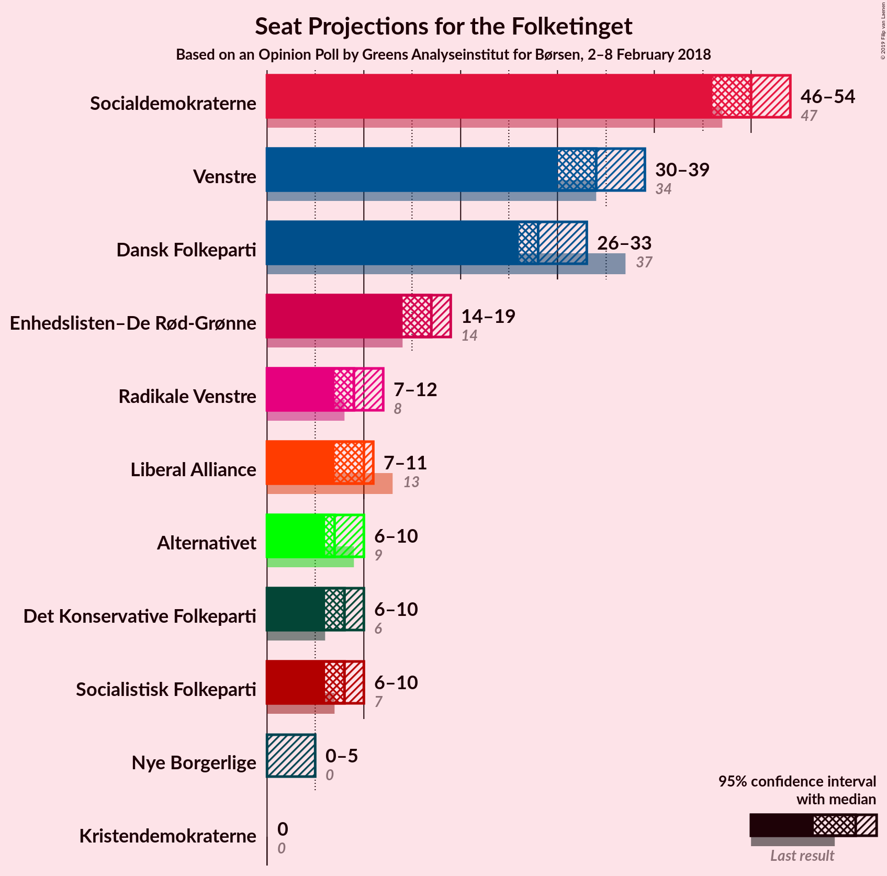
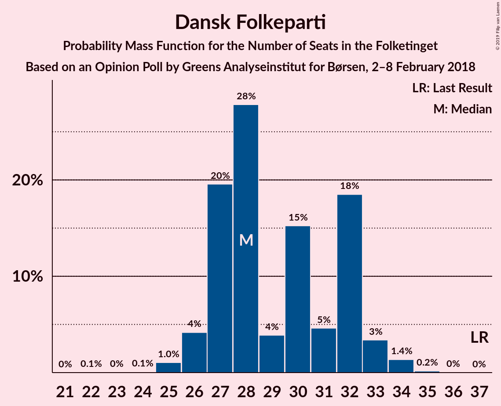
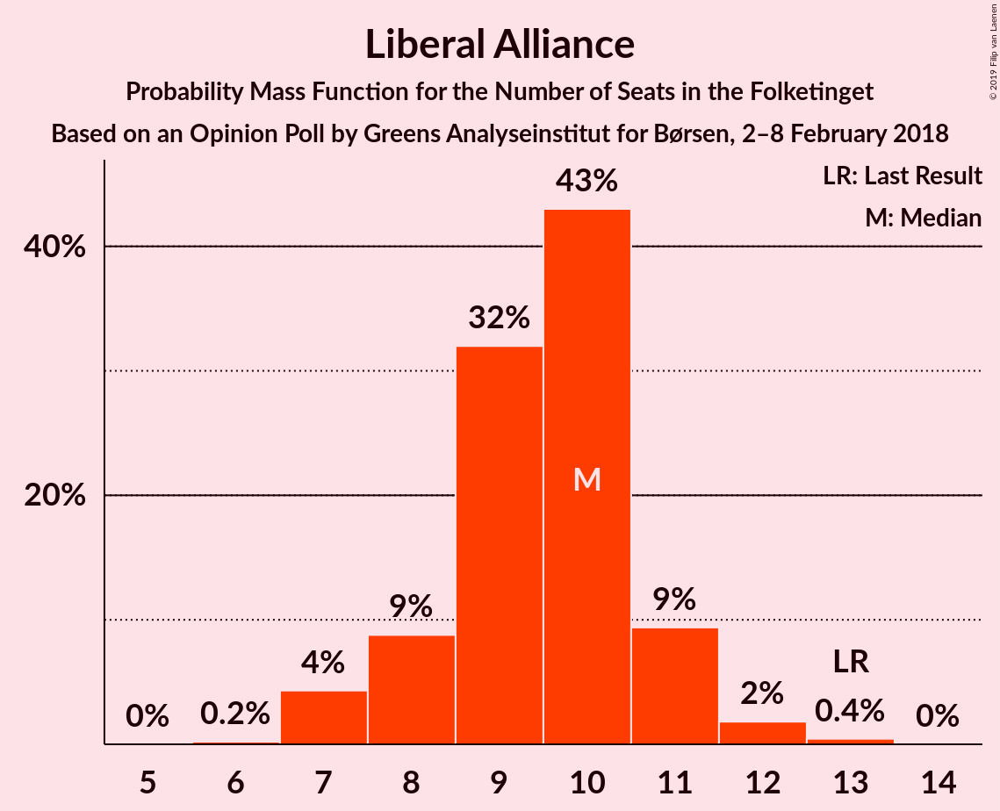
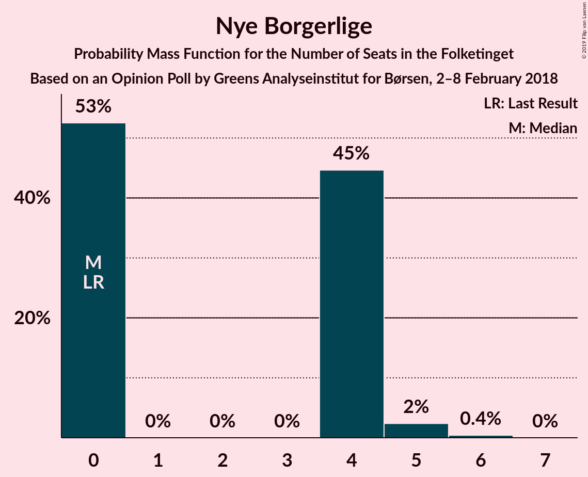

# Opinion Poll by Greens Analyseinstitut for Børsen, 2–8 February 2018

<a href="#voting-intentions">Voting Intentions</a> | <a href="#seats">Seats</a> | <a href="#coalitions">Coalitions</a> | <a href="#technical-information">Technical Information</a>

## Voting Intentions

### Confidence Intervals

| Party | Last Result | Poll Result | 80% Confidence Interval | 90% Confidence Interval | 95% Confidence Interval | 99% Confidence Interval |
|:-----:|:-----------:|:-----------:|:-----------------------:|:-----------------------:|:-----------------------:|:-----------------------:|
| Socialdemokraterne | 26.3% | 28.2% | 26.5–29.9% |26.0–30.5% |25.6–30.9% |24.8–31.7% |
| Venstre | 19.5% | 19.8% | 18.3–21.4% |17.9–21.8% |17.5–22.2% |16.9–23.0% |
| Dansk Folkeparti | 21.1% | 16.5% | 15.1–18.0% |14.7–18.4% |14.4–18.7% |13.8–19.5% |
| Enhedslisten–De Rød-Grønne | 7.8% | 9.1% | 8.1–10.3% |7.8–10.7% |7.6–11.0% |7.1–11.6% |
| Liberal Alliance | 7.5% | 5.2% | 4.4–6.1% |4.2–6.4% |4.0–6.7% |3.7–7.1% |
| Radikale Venstre | 4.6% | 5.1% | 4.3–6.1% |4.1–6.3% |3.9–6.6% |3.6–7.0% |
| Det Konservative Folkeparti | 3.4% | 4.6% | 3.9–5.5% |3.6–5.7% |3.5–6.0% |3.2–6.4% |
| Socialistisk Folkeparti | 4.2% | 4.5% | 3.8–5.4% |3.6–5.6% |3.4–5.9% |3.1–6.3% |
| Alternativet | 4.8% | 4.3% | 3.6–5.2% |3.4–5.4% |3.2–5.7% |2.9–6.1% |
| Nye Borgerlige | 0.0% | 1.8% | 1.4–2.4% |1.2–2.6% |1.2–2.8% |1.0–3.1% |
| Kristendemokraterne | 0.8% | 0.7% | 0.5–1.2% |0.4–1.3% |0.4–1.4% |0.3–1.7% |

*Note:* The poll result column reflects the actual value used in the calculations. Published results may vary slightly, and in addition be rounded to fewer digits.

## Seats

### Confidence Intervals

| Party | Last Result | Median | 80% Confidence Interval | 90% Confidence Interval | 95% Confidence Interval | 99% Confidence Interval |
|:-----:|:-----------:|:------:|:-----------------------:|:-----------------------:|:-----------------------:|:-----------------------:|
| <a href="#socialdemokraterne">Socialdemokraterne</a> | 47 | 50 | 48–52 |47–54 |46–54 |44–56 |
| <a href="#venstre">Venstre</a> | 34 | 34 | 32–38 |31–38 |30–39 |30–40 |
| <a href="#dansk-folkeparti">Dansk Folkeparti</a> | 37 | 28 | 27–32 |26–32 |26–33 |25–34 |
| <a href="#enhedslisten–de-rød-grønne">Enhedslisten–De Rød-Grønne</a> | 14 | 17 | 15–19 |15–19 |14–19 |13–20 |
| <a href="#liberal-alliance">Liberal Alliance</a> | 13 | 10 | 8–11 |8–11 |7–11 |7–12 |
| <a href="#radikale-venstre">Radikale Venstre</a> | 8 | 9 | 8–11 |8–12 |7–12 |7–12 |
| <a href="#det-konservative-folkeparti">Det Konservative Folkeparti</a> | 6 | 8 | 7–10 |7–10 |6–10 |6–12 |
| <a href="#socialistisk-folkeparti">Socialistisk Folkeparti</a> | 7 | 8 | 7–10 |7–10 |6–10 |6–11 |
| <a href="#alternativet">Alternativet</a> | 9 | 7 | 7–9 |6–9 |6–10 |5–11 |
| <a href="#nye-borgerlige">Nye Borgerlige</a> | 0 | 0 | 0–4 |0–4 |0–5 |0–5 |
| <a href="#kristendemokraterne">Kristendemokraterne</a> | 0 | 0 | 0 |0 |0 |0 |

### Socialdemokraterne

*For a full overview of the results for this party, see the [Socialdemokraterne](party-socialdemokraterne.html) page.*

| Number of Seats | Probability | Accumulated | Special Marks |
|:---------------:|:-----------:|:-----------:|:-------------:|
| 42 | 0.1% | 100% |  |
| 43 | 0.2% | 99.9% |  |
| 44 | 0.5% | 99.7% |  |
| 45 | 1.3% | 99.2% |  |
| 46 | 0.9% | 98% |  |
| 47 | 6% | 97% | Last Result |
| 48 | 2% | 91% |  |
| 49 | 27% | 89% |  |
| 50 | 28% | 62% | Median |
| 51 | 6% | 34% |  |
| 52 | 19% | 28% |  |
| 53 | 3% | 9% |  |
| 54 | 4% | 6% |  |
| 55 | 0.9% | 2% |  |
| 56 | 0.5% | 0.7% |  |
| 57 | 0.1% | 0.2% |  |
| 58 | 0.1% | 0.1% |  |
| 59 | 0% | 0% |  |

### Venstre

*For a full overview of the results for this party, see the [Venstre](party-venstre.html) page.*

| Number of Seats | Probability | Accumulated | Special Marks |
|:---------------:|:-----------:|:-----------:|:-------------:|
| 28 | 0.1% | 100% |  |
| 29 | 0.2% | 99.9% |  |
| 30 | 4% | 99.7% |  |
| 31 | 2% | 96% |  |
| 32 | 16% | 95% |  |
| 33 | 22% | 79% |  |
| 34 | 17% | 57% | Last Result, Median |
| 35 | 9% | 41% |  |
| 36 | 18% | 32% |  |
| 37 | 4% | 15% |  |
| 38 | 7% | 11% |  |
| 39 | 2% | 3% |  |
| 40 | 0.6% | 1.0% |  |
| 41 | 0.4% | 0.4% |  |
| 42 | 0% | 0.1% |  |
| 43 | 0% | 0% |  |

### Dansk Folkeparti

*For a full overview of the results for this party, see the [Dansk Folkeparti](party-danskfolkeparti.html) page.*

| Number of Seats | Probability | Accumulated | Special Marks |
|:---------------:|:-----------:|:-----------:|:-------------:|
| 22 | 0.1% | 100% |  |
| 23 | 0% | 99.9% |  |
| 24 | 0.1% | 99.9% |  |
| 25 | 1.0% | 99.8% |  |
| 26 | 4% | 98.8% |  |
| 27 | 20% | 95% |  |
| 28 | 28% | 75% | Median |
| 29 | 4% | 47% |  |
| 30 | 15% | 43% |  |
| 31 | 5% | 28% |  |
| 32 | 18% | 23% |  |
| 33 | 3% | 5% |  |
| 34 | 1.4% | 2% |  |
| 35 | 0.2% | 0.2% |  |
| 36 | 0% | 0% |  |
| 37 | 0% | 0% | Last Result |

### Enhedslisten–De Rød-Grønne

*For a full overview of the results for this party, see the [Enhedslisten–De Rød-Grønne](party-enhedslisten–derød-grønne.html) page.*

| Number of Seats | Probability | Accumulated | Special Marks |
|:---------------:|:-----------:|:-----------:|:-------------:|
| 12 | 0.3% | 100% |  |
| 13 | 1.2% | 99.7% |  |
| 14 | 3% | 98.6% | Last Result |
| 15 | 21% | 95% |  |
| 16 | 19% | 75% |  |
| 17 | 27% | 56% | Median |
| 18 | 7% | 29% |  |
| 19 | 20% | 22% |  |
| 20 | 2% | 2% |  |
| 21 | 0.1% | 0.1% |  |
| 22 | 0% | 0% |  |

### Liberal Alliance

*For a full overview of the results for this party, see the [Liberal Alliance](party-liberalalliance.html) page.*

| Number of Seats | Probability | Accumulated | Special Marks |
|:---------------:|:-----------:|:-----------:|:-------------:|
| 6 | 0.2% | 100% |  |
| 7 | 4% | 99.8% |  |
| 8 | 9% | 95% |  |
| 9 | 32% | 87% |  |
| 10 | 43% | 55% | Median |
| 11 | 9% | 12% |  |
| 12 | 2% | 2% |  |
| 13 | 0.4% | 0.5% | Last Result |
| 14 | 0% | 0% |  |

### Radikale Venstre

*For a full overview of the results for this party, see the [Radikale Venstre](party-radikalevenstre.html) page.*

| Number of Seats | Probability | Accumulated | Special Marks |
|:---------------:|:-----------:|:-----------:|:-------------:|
| 6 | 0.3% | 100% |  |
| 7 | 3% | 99.7% |  |
| 8 | 15% | 97% | Last Result |
| 9 | 43% | 81% | Median |
| 10 | 21% | 39% |  |
| 11 | 12% | 18% |  |
| 12 | 5% | 6% |  |
| 13 | 0.1% | 0.2% |  |
| 14 | 0% | 0% |  |

### Det Konservative Folkeparti

*For a full overview of the results for this party, see the [Det Konservative Folkeparti](party-detkonservativefolkeparti.html) page.*

| Number of Seats | Probability | Accumulated | Special Marks |
|:---------------:|:-----------:|:-----------:|:-------------:|
| 5 | 0.2% | 100% |  |
| 6 | 3% | 99.8% | Last Result |
| 7 | 26% | 97% |  |
| 8 | 40% | 71% | Median |
| 9 | 18% | 31% |  |
| 10 | 11% | 13% |  |
| 11 | 1.4% | 2% |  |
| 12 | 0.8% | 0.8% |  |
| 13 | 0% | 0% |  |

### Socialistisk Folkeparti

*For a full overview of the results for this party, see the [Socialistisk Folkeparti](party-socialistiskfolkeparti.html) page.*

| Number of Seats | Probability | Accumulated | Special Marks |
|:---------------:|:-----------:|:-----------:|:-------------:|
| 5 | 0.3% | 100% |  |
| 6 | 4% | 99.6% |  |
| 7 | 36% | 96% | Last Result |
| 8 | 13% | 60% | Median |
| 9 | 35% | 48% |  |
| 10 | 12% | 13% |  |
| 11 | 1.0% | 1.3% |  |
| 12 | 0.2% | 0.2% |  |
| 13 | 0% | 0.1% |  |
| 14 | 0% | 0% |  |

### Alternativet

*For a full overview of the results for this party, see the [Alternativet](party-alternativet.html) page.*

| Number of Seats | Probability | Accumulated | Special Marks |
|:---------------:|:-----------:|:-----------:|:-------------:|
| 5 | 0.6% | 100% |  |
| 6 | 7% | 99.4% |  |
| 7 | 62% | 93% | Median |
| 8 | 16% | 31% |  |
| 9 | 10% | 14% | Last Result |
| 10 | 3% | 5% |  |
| 11 | 2% | 2% |  |
| 12 | 0.1% | 0.1% |  |
| 13 | 0% | 0% |  |

### Nye Borgerlige

*For a full overview of the results for this party, see the [Nye Borgerlige](party-nyeborgerlige.html) page.*

| Number of Seats | Probability | Accumulated | Special Marks |
|:---------------:|:-----------:|:-----------:|:-------------:|
| 0 | 53% | 100% | Last Result, Median |
| 1 | 0% | 47% |  |
| 2 | 0% | 47% |  |
| 3 | 0% | 47% |  |
| 4 | 45% | 47% |  |
| 5 | 2% | 3% |  |
| 6 | 0.4% | 0.4% |  |
| 7 | 0% | 0% |  |

### Kristendemokraterne

*For a full overview of the results for this party, see the [Kristendemokraterne](party-kristendemokraterne.html) page.*

| Number of Seats | Probability | Accumulated | Special Marks |
|:---------------:|:-----------:|:-----------:|:-------------:|
| 0 | 100% | 100% | Last Result, Median |

## Coalitions

### Confidence Intervals

| Coalition | Last Result | Median | Majority? | 80% Confidence Interval | 90% Confidence Interval | 95% Confidence Interval | 99% Confidence Interval |
|:---------:|:-----------:|:------:|:---------:|:-----------------------:|:-----------------------:|:-----------------------:|:-----------------------:|
| Socialdemokraterne – Enhedslisten–De Rød-Grønne – Radikale Venstre – Socialistisk Folkeparti – Alternativet | 85 | 93 | 91% | 90–94 | 87–96 | 85–96 | 84–99 |
| Venstre – Dansk Folkeparti – Liberal Alliance – Det Konservative Folkeparti – Nye Borgerlige – Kristendemokraterne | 90 | 82 | 4% | 81–85 | 79–88 | 79–90 | 76–91 |
| Venstre – Dansk Folkeparti – Liberal Alliance – Det Konservative Folkeparti – Nye Borgerlige | 90 | 82 | 4% | 81–85 | 79–88 | 79–90 | 76–91 |
| Socialdemokraterne – Enhedslisten–De Rød-Grønne – Radikale Venstre – Socialistisk Folkeparti | 76 | 85 | 0.6% | 82–86 | 79–87 | 78–88 | 76–91 |
| Socialdemokraterne – Enhedslisten–De Rød-Grønne – Socialistisk Folkeparti – Alternativet | 77 | 83 | 0.2% | 80–85 | 78–87 | 77–87 | 74–89 |
| Venstre – Dansk Folkeparti – Liberal Alliance – Det Konservative Folkeparti – Kristendemokraterne | 90 | 81 | 0.3% | 78–85 | 77–86 | 77–86 | 76–88 |
| Venstre – Dansk Folkeparti – Liberal Alliance – Det Konservative Folkeparti | 90 | 81 | 0.3% | 78–85 | 77–86 | 77–86 | 76–88 |
| Socialdemokraterne – Enhedslisten–De Rød-Grønne – Socialistisk Folkeparti | 68 | 76 | 0% | 72–77 | 70–79 | 69–79 | 67–82 |
| Socialdemokraterne – Radikale Venstre – Socialistisk Folkeparti | 62 | 68 | 0% | 65–70 | 63–71 | 62–71 | 61–74 |
| Socialdemokraterne – Radikale Venstre | 55 | 60 | 0% | 57–63 | 55–63 | 55–63 | 53–65 |
| Venstre – Liberal Alliance – Det Konservative Folkeparti | 53 | 52 | 0% | 50–55 | 49–56 | 49–57 | 47–59 |
| Venstre – Det Konservative Folkeparti | 40 | 42 | 0% | 40–46 | 40–47 | 40–47 | 37–49 |
| Venstre | 34 | 34 | 0% | 32–38 | 31–38 | 30–39 | 30–40 |

### Socialdemokraterne – Enhedslisten–De Rød-Grønne – Radikale Venstre – Socialistisk Folkeparti – Alternativet

| Number of Seats | Probability | Accumulated | Special Marks |
|:---------------:|:-----------:|:-----------:|:-------------:|
| 80 | 0.1% | 100% |  |
| 81 | 0% | 99.9% |  |
| 82 | 0% | 99.9% |  |
| 83 | 0.2% | 99.9% |  |
| 84 | 0.9% | 99.7% |  |
| 85 | 3% | 98.8% | Last Result |
| 86 | 0.8% | 96% |  |
| 87 | 0.7% | 95% |  |
| 88 | 2% | 95% |  |
| 89 | 3% | 93% |  |
| 90 | 12% | 91% | Majority |
| 91 | 14% | 78% | Median |
| 92 | 12% | 64% |  |
| 93 | 36% | 52% |  |
| 94 | 8% | 15% |  |
| 95 | 2% | 8% |  |
| 96 | 4% | 6% |  |
| 97 | 1.2% | 2% |  |
| 98 | 0.2% | 0.7% |  |
| 99 | 0.4% | 0.5% |  |
| 100 | 0.1% | 0.1% |  |
| 101 | 0% | 0% |  |

### Venstre – Dansk Folkeparti – Liberal Alliance – Det Konservative Folkeparti – Nye Borgerlige – Kristendemokraterne

| Number of Seats | Probability | Accumulated | Special Marks |
|:---------------:|:-----------:|:-----------:|:-------------:|
| 75 | 0.1% | 100% |  |
| 76 | 0.4% | 99.9% |  |
| 77 | 0.2% | 99.5% |  |
| 78 | 1.2% | 99.3% |  |
| 79 | 4% | 98% |  |
| 80 | 2% | 94% | Median |
| 81 | 8% | 92% |  |
| 82 | 36% | 85% |  |
| 83 | 12% | 48% |  |
| 84 | 14% | 36% |  |
| 85 | 12% | 22% |  |
| 86 | 3% | 9% |  |
| 87 | 2% | 7% |  |
| 88 | 0.7% | 5% |  |
| 89 | 0.8% | 5% |  |
| 90 | 3% | 4% | Last Result, Majority |
| 91 | 0.9% | 1.2% |  |
| 92 | 0.2% | 0.3% |  |
| 93 | 0% | 0.1% |  |
| 94 | 0% | 0.1% |  |
| 95 | 0.1% | 0.1% |  |
| 96 | 0% | 0% |  |

### Venstre – Dansk Folkeparti – Liberal Alliance – Det Konservative Folkeparti – Nye Borgerlige

| Number of Seats | Probability | Accumulated | Special Marks |
|:---------------:|:-----------:|:-----------:|:-------------:|
| 75 | 0.1% | 100% |  |
| 76 | 0.4% | 99.9% |  |
| 77 | 0.2% | 99.5% |  |
| 78 | 1.2% | 99.3% |  |
| 79 | 4% | 98% |  |
| 80 | 2% | 94% | Median |
| 81 | 8% | 92% |  |
| 82 | 36% | 85% |  |
| 83 | 12% | 48% |  |
| 84 | 14% | 36% |  |
| 85 | 12% | 22% |  |
| 86 | 3% | 9% |  |
| 87 | 2% | 7% |  |
| 88 | 0.7% | 5% |  |
| 89 | 0.8% | 5% |  |
| 90 | 3% | 4% | Last Result, Majority |
| 91 | 0.9% | 1.2% |  |
| 92 | 0.2% | 0.3% |  |
| 93 | 0% | 0.1% |  |
| 94 | 0% | 0.1% |  |
| 95 | 0.1% | 0.1% |  |
| 96 | 0% | 0% |  |

### Socialdemokraterne – Enhedslisten–De Rød-Grønne – Radikale Venstre – Socialistisk Folkeparti

| Number of Seats | Probability | Accumulated | Special Marks |
|:---------------:|:-----------:|:-----------:|:-------------:|
| 74 | 0.1% | 100% |  |
| 75 | 0.1% | 99.9% |  |
| 76 | 0.5% | 99.8% | Last Result |
| 77 | 1.3% | 99.3% |  |
| 78 | 2% | 98% |  |
| 79 | 2% | 96% |  |
| 80 | 1.0% | 94% |  |
| 81 | 2% | 93% |  |
| 82 | 1.4% | 91% |  |
| 83 | 14% | 89% |  |
| 84 | 20% | 75% | Median |
| 85 | 11% | 55% |  |
| 86 | 37% | 45% |  |
| 87 | 3% | 8% |  |
| 88 | 4% | 5% |  |
| 89 | 0.2% | 0.8% |  |
| 90 | 0.1% | 0.6% | Majority |
| 91 | 0.1% | 0.5% |  |
| 92 | 0.1% | 0.5% |  |
| 93 | 0.4% | 0.4% |  |
| 94 | 0% | 0% |  |

### Socialdemokraterne – Enhedslisten–De Rød-Grønne – Socialistisk Folkeparti – Alternativet

| Number of Seats | Probability | Accumulated | Special Marks |
|:---------------:|:-----------:|:-----------:|:-------------:|
| 72 | 0.1% | 100% |  |
| 73 | 0.1% | 99.9% |  |
| 74 | 0.5% | 99.8% |  |
| 75 | 0.1% | 99.3% |  |
| 76 | 0.5% | 99.2% |  |
| 77 | 3% | 98.7% | Last Result |
| 78 | 0.7% | 95% |  |
| 79 | 1.5% | 95% |  |
| 80 | 8% | 93% |  |
| 81 | 15% | 85% |  |
| 82 | 8% | 71% | Median |
| 83 | 35% | 62% |  |
| 84 | 17% | 27% |  |
| 85 | 2% | 10% |  |
| 86 | 3% | 9% |  |
| 87 | 4% | 6% |  |
| 88 | 1.3% | 2% |  |
| 89 | 0.8% | 1.0% |  |
| 90 | 0.1% | 0.2% | Majority |
| 91 | 0.1% | 0.1% |  |
| 92 | 0% | 0% |  |

### Venstre – Dansk Folkeparti – Liberal Alliance – Det Konservative Folkeparti – Kristendemokraterne

| Number of Seats | Probability | Accumulated | Special Marks |
|:---------------:|:-----------:|:-----------:|:-------------:|
| 73 | 0.1% | 100% |  |
| 74 | 0.2% | 99.9% |  |
| 75 | 0.1% | 99.7% |  |
| 76 | 1.0% | 99.6% |  |
| 77 | 5% | 98.6% |  |
| 78 | 17% | 94% |  |
| 79 | 5% | 76% |  |
| 80 | 11% | 72% | Median |
| 81 | 12% | 61% |  |
| 82 | 21% | 49% |  |
| 83 | 12% | 28% |  |
| 84 | 5% | 15% |  |
| 85 | 4% | 10% |  |
| 86 | 4% | 6% |  |
| 87 | 2% | 2% |  |
| 88 | 0.4% | 0.8% |  |
| 89 | 0.1% | 0.4% |  |
| 90 | 0.2% | 0.3% | Last Result, Majority |
| 91 | 0.1% | 0.1% |  |
| 92 | 0% | 0% |  |

### Venstre – Dansk Folkeparti – Liberal Alliance – Det Konservative Folkeparti

| Number of Seats | Probability | Accumulated | Special Marks |
|:---------------:|:-----------:|:-----------:|:-------------:|
| 73 | 0.1% | 100% |  |
| 74 | 0.2% | 99.9% |  |
| 75 | 0.1% | 99.7% |  |
| 76 | 1.0% | 99.6% |  |
| 77 | 5% | 98.6% |  |
| 78 | 17% | 94% |  |
| 79 | 5% | 76% |  |
| 80 | 11% | 72% | Median |
| 81 | 12% | 61% |  |
| 82 | 21% | 49% |  |
| 83 | 12% | 28% |  |
| 84 | 5% | 15% |  |
| 85 | 4% | 10% |  |
| 86 | 4% | 6% |  |
| 87 | 2% | 2% |  |
| 88 | 0.4% | 0.8% |  |
| 89 | 0.1% | 0.4% |  |
| 90 | 0.2% | 0.3% | Last Result, Majority |
| 91 | 0.1% | 0.1% |  |
| 92 | 0% | 0% |  |

### Socialdemokraterne – Enhedslisten–De Rød-Grønne – Socialistisk Folkeparti

| Number of Seats | Probability | Accumulated | Special Marks |
|:---------------:|:-----------:|:-----------:|:-------------:|
| 66 | 0.2% | 100% |  |
| 67 | 0.6% | 99.8% |  |
| 68 | 0.5% | 99.2% | Last Result |
| 69 | 2% | 98.7% |  |
| 70 | 2% | 97% |  |
| 71 | 2% | 95% |  |
| 72 | 9% | 93% |  |
| 73 | 2% | 84% |  |
| 74 | 15% | 81% |  |
| 75 | 13% | 66% | Median |
| 76 | 27% | 53% |  |
| 77 | 17% | 26% |  |
| 78 | 4% | 9% |  |
| 79 | 4% | 5% |  |
| 80 | 0.7% | 1.3% |  |
| 81 | 0.1% | 0.6% |  |
| 82 | 0.1% | 0.5% |  |
| 83 | 0.4% | 0.5% |  |
| 84 | 0% | 0% |  |

### Socialdemokraterne – Radikale Venstre – Socialistisk Folkeparti

| Number of Seats | Probability | Accumulated | Special Marks |
|:---------------:|:-----------:|:-----------:|:-------------:|
| 58 | 0.1% | 100% |  |
| 59 | 0.1% | 99.9% |  |
| 60 | 0.3% | 99.9% |  |
| 61 | 0.8% | 99.6% |  |
| 62 | 2% | 98.8% | Last Result |
| 63 | 3% | 97% |  |
| 64 | 2% | 94% |  |
| 65 | 4% | 93% |  |
| 66 | 2% | 89% |  |
| 67 | 27% | 86% | Median |
| 68 | 27% | 59% |  |
| 69 | 19% | 32% |  |
| 70 | 6% | 13% |  |
| 71 | 5% | 7% |  |
| 72 | 1.2% | 2% |  |
| 73 | 0.2% | 0.8% |  |
| 74 | 0.5% | 0.6% |  |
| 75 | 0.1% | 0.1% |  |
| 76 | 0% | 0.1% |  |
| 77 | 0% | 0% |  |

### Socialdemokraterne – Radikale Venstre

| Number of Seats | Probability | Accumulated | Special Marks |
|:---------------:|:-----------:|:-----------:|:-------------:|
| 51 | 0% | 100% |  |
| 52 | 0.4% | 99.9% |  |
| 53 | 0.5% | 99.6% |  |
| 54 | 1.1% | 99.1% |  |
| 55 | 4% | 98% | Last Result |
| 56 | 2% | 94% |  |
| 57 | 3% | 92% |  |
| 58 | 28% | 89% |  |
| 59 | 2% | 61% | Median |
| 60 | 24% | 59% |  |
| 61 | 22% | 35% |  |
| 62 | 1.3% | 13% |  |
| 63 | 10% | 12% |  |
| 64 | 0.8% | 1.5% |  |
| 65 | 0.5% | 0.7% |  |
| 66 | 0.1% | 0.2% |  |
| 67 | 0% | 0.1% |  |
| 68 | 0% | 0% |  |

### Venstre – Liberal Alliance – Det Konservative Folkeparti

| Number of Seats | Probability | Accumulated | Special Marks |
|:---------------:|:-----------:|:-----------:|:-------------:|
| 45 | 0.1% | 100% |  |
| 46 | 0.3% | 99.9% |  |
| 47 | 0.3% | 99.6% |  |
| 48 | 0.7% | 99.2% |  |
| 49 | 5% | 98.6% |  |
| 50 | 36% | 94% |  |
| 51 | 5% | 57% |  |
| 52 | 18% | 52% | Median |
| 53 | 5% | 34% | Last Result |
| 54 | 14% | 30% |  |
| 55 | 6% | 16% |  |
| 56 | 7% | 10% |  |
| 57 | 0.4% | 3% |  |
| 58 | 2% | 2% |  |
| 59 | 0.5% | 0.6% |  |
| 60 | 0.1% | 0.1% |  |
| 61 | 0.1% | 0.1% |  |
| 62 | 0% | 0% |  |

### Venstre – Det Konservative Folkeparti

| Number of Seats | Probability | Accumulated | Special Marks |
|:---------------:|:-----------:|:-----------:|:-------------:|
| 35 | 0.1% | 100% |  |
| 36 | 0% | 99.9% |  |
| 37 | 0.5% | 99.9% |  |
| 38 | 0.4% | 99.4% |  |
| 39 | 1.2% | 99.0% |  |
| 40 | 35% | 98% | Last Result |
| 41 | 6% | 63% |  |
| 42 | 11% | 58% | Median |
| 43 | 11% | 46% |  |
| 44 | 11% | 35% |  |
| 45 | 13% | 24% |  |
| 46 | 2% | 11% |  |
| 47 | 6% | 8% |  |
| 48 | 1.1% | 2% |  |
| 49 | 0.3% | 0.8% |  |
| 50 | 0.2% | 0.5% |  |
| 51 | 0.2% | 0.2% |  |
| 52 | 0% | 0% |  |

### Venstre

| Number of Seats | Probability | Accumulated | Special Marks |
|:---------------:|:-----------:|:-----------:|:-------------:|
| 28 | 0.1% | 100% |  |
| 29 | 0.2% | 99.9% |  |
| 30 | 4% | 99.7% |  |
| 31 | 2% | 96% |  |
| 32 | 16% | 95% |  |
| 33 | 22% | 79% |  |
| 34 | 17% | 57% | Last Result, Median |
| 35 | 9% | 41% |  |
| 36 | 18% | 32% |  |
| 37 | 4% | 15% |  |
| 38 | 7% | 11% |  |
| 39 | 2% | 3% |  |
| 40 | 0.6% | 1.0% |  |
| 41 | 0.4% | 0.4% |  |
| 42 | 0% | 0.1% |  |
| 43 | 0% | 0% |  |

## Technical Information

### Opinion Poll

+ **Polling firm:** Greens Analyseinstitut
+ **Commissioner(s):** Børsen
+ **Fieldwork period:** 2–8 February 2018

### Calculations

+ **Sample size:** 1118
+ **Simulations done:** 1,048,576
+ **Error estimate:** 2.61%

