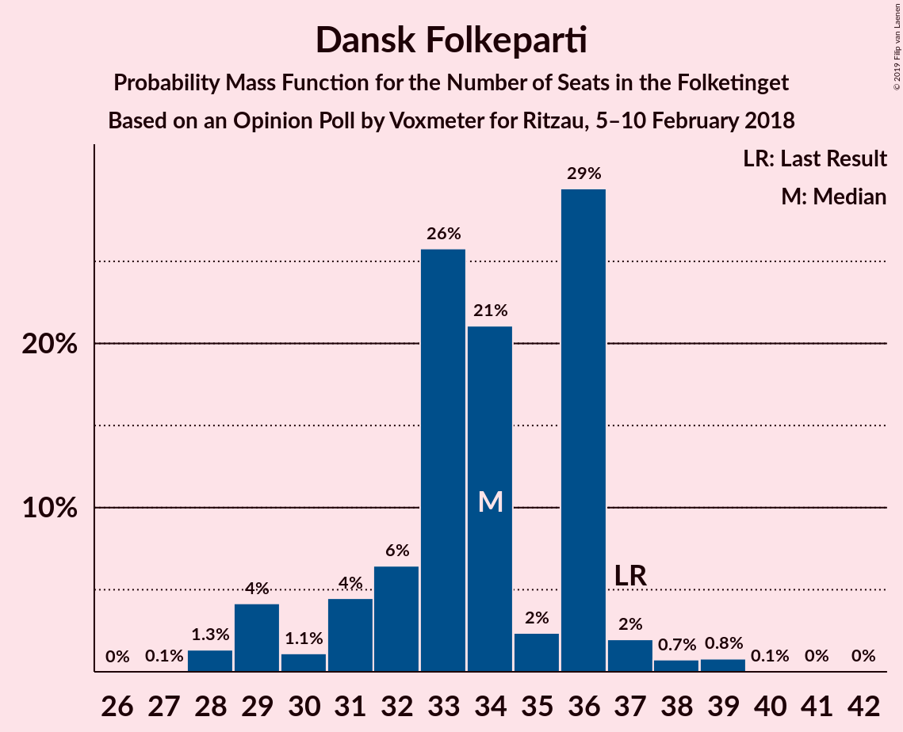
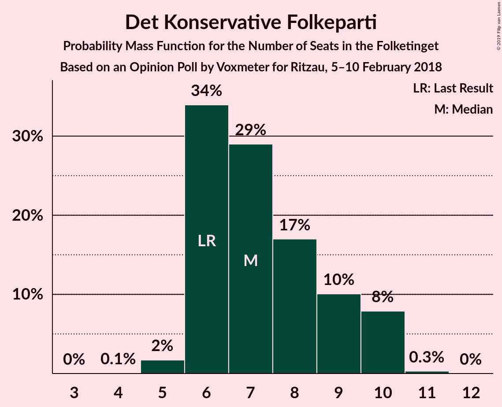

# Opinion Poll by Voxmeter for Ritzau, 5–10 February 2018

<a href="#voting-intentions">Voting Intentions</a> | <a href="#seats">Seats</a> | <a href="#coalitions">Coalitions</a> | <a href="#technical-information">Technical Information</a>

## Voting Intentions

### Confidence Intervals

| Party | Last Result | Poll Result | 80% Confidence Interval | 90% Confidence Interval | 95% Confidence Interval | 99% Confidence Interval |
|:-----:|:-----------:|:-----------:|:-----------------------:|:-----------------------:|:-----------------------:|:-----------------------:|
| Socialdemokraterne | 26.3% | 29.5% | 27.7–31.4% |27.2–31.9% |26.8–32.4% |26.0–33.3% |
| Venstre | 19.5% | 19.1% | 17.6–20.7% |17.2–21.2% |16.8–21.6% |16.1–22.4% |
| Dansk Folkeparti | 21.1% | 18.8% | 17.3–20.4% |16.9–20.9% |16.5–21.3% |15.9–22.1% |
| Enhedslisten–De Rød-Grønne | 7.8% | 7.7% | 6.7–8.9% |6.5–9.2% |6.2–9.5% |5.8–10.1% |
| Radikale Venstre | 4.6% | 5.1% | 4.3–6.1% |4.1–6.4% |3.9–6.6% |3.6–7.1% |
| Socialistisk Folkeparti | 4.2% | 5.0% | 4.2–6.0% |4.0–6.3% |3.8–6.5% |3.5–7.0% |
| Liberal Alliance | 7.5% | 4.3% | 3.6–5.3% |3.4–5.5% |3.3–5.8% |2.9–6.2% |
| Det Konservative Folkeparti | 3.4% | 4.1% | 3.4–5.1% |3.2–5.3% |3.1–5.5% |2.8–6.0% |
| Alternativet | 4.8% | 4.0% | 3.3–4.8% |3.1–5.1% |2.9–5.3% |2.6–5.8% |
| Nye Borgerlige | 0.0% | 1.4% | 1.1–2.1% |1.0–2.2% |0.9–2.4% |0.7–2.7% |
| Kristendemokraterne | 0.8% | 0.9% | 0.6–1.4% |0.5–1.5% |0.5–1.6% |0.4–1.9% |

*Note:* The poll result column reflects the actual value used in the calculations. Published results may vary slightly, and in addition be rounded to fewer digits.

## Seats

### Confidence Intervals

| Party | Last Result | Median | 80% Confidence Interval | 90% Confidence Interval | 95% Confidence Interval | 99% Confidence Interval |
|:-----:|:-----------:|:------:|:-----------------------:|:-----------------------:|:-----------------------:|:-----------------------:|
| <a href="#socialdemokraterne">Socialdemokraterne</a> | 47 | 56 | 51–56 |51–56 |49–56 |49–56 |
| <a href="#venstre">Venstre</a> | 34 | 33 | 33–35 |33–35 |31–35 |30–37 |
| <a href="#dansk-folkeparti">Dansk Folkeparti</a> | 37 | 36 | 29–36 |29–36 |29–36 |29–39 |
| <a href="#enhedslisten–de-rød-grønne">Enhedslisten–De Rød-Grønne</a> | 14 | 13 | 13–16 |13–16 |12–16 |12–16 |
| <a href="#radikale-venstre">Radikale Venstre</a> | 8 | 9 | 9–11 |9–11 |9–11 |8–13 |
| <a href="#socialistisk-folkeparti">Socialistisk Folkeparti</a> | 7 | 9 | 8–10 |7–11 |7–12 |7–12 |
| <a href="#liberal-alliance">Liberal Alliance</a> | 13 | 7 | 6–9 |6–9 |6–9 |6–10 |
| <a href="#det-konservative-folkeparti">Det Konservative Folkeparti</a> | 6 | 6 | 6–10 |6–10 |6–10 |6–10 |
| <a href="#alternativet">Alternativet</a> | 9 | 6 | 6–7 |6–7 |6–8 |5–8 |
| <a href="#nye-borgerlige">Nye Borgerlige</a> | 0 | 0 | 0–4 |0–4 |0–4 |0–4 |
| <a href="#kristendemokraterne">Kristendemokraterne</a> | 0 | 0 | 0 |0 |0 |0 |

### Socialdemokraterne

*For a full overview of the results for this party, see the [Socialdemokraterne](party-socialdemokraterne.html) page.*

| Number of Seats | Probability | Accumulated | Special Marks |
|:---------------:|:-----------:|:-----------:|:-------------:|
| 46 | 0.1% | 100% |  |
| 47 | 0.1% | 99.9% | Last Result |
| 48 | 0.1% | 99.8% |  |
| 49 | 4% | 99.7% |  |
| 50 | 0.6% | 96% |  |
| 51 | 14% | 95% |  |
| 52 | 0.5% | 81% |  |
| 53 | 11% | 81% |  |
| 54 | 2% | 70% |  |
| 55 | 1.1% | 68% |  |
| 56 | 66% | 67% | Median |
| 57 | 0% | 0.1% |  |
| 58 | 0% | 0.1% |  |
| 59 | 0% | 0.1% |  |
| 60 | 0.1% | 0.1% |  |
| 61 | 0% | 0% |  |

### Venstre

*For a full overview of the results for this party, see the [Venstre](party-venstre.html) page.*

| Number of Seats | Probability | Accumulated | Special Marks |
|:---------------:|:-----------:|:-----------:|:-------------:|
| 29 | 0.1% | 100% |  |
| 30 | 2% | 99.8% |  |
| 31 | 2% | 98% |  |
| 32 | 0.2% | 96% |  |
| 33 | 66% | 95% | Median |
| 34 | 10% | 29% | Last Result |
| 35 | 17% | 19% |  |
| 36 | 0.7% | 1.4% |  |
| 37 | 0.2% | 0.7% |  |
| 38 | 0.2% | 0.4% |  |
| 39 | 0% | 0.2% |  |
| 40 | 0% | 0.2% |  |
| 41 | 0.1% | 0.1% |  |
| 42 | 0% | 0% |  |

### Dansk Folkeparti

*For a full overview of the results for this party, see the [Dansk Folkeparti](party-danskfolkeparti.html) page.*

| Number of Seats | Probability | Accumulated | Special Marks |
|:---------------:|:-----------:|:-----------:|:-------------:|
| 28 | 0.2% | 100% |  |
| 29 | 15% | 99.8% |  |
| 30 | 0.6% | 85% |  |
| 31 | 0.1% | 85% |  |
| 32 | 2% | 85% |  |
| 33 | 13% | 82% |  |
| 34 | 0.1% | 69% |  |
| 35 | 0.3% | 69% |  |
| 36 | 67% | 68% | Median |
| 37 | 0% | 2% | Last Result |
| 38 | 0% | 2% |  |
| 39 | 2% | 2% |  |
| 40 | 0% | 0% |  |

### Enhedslisten–De Rød-Grønne

*For a full overview of the results for this party, see the [Enhedslisten–De Rød-Grønne](party-enhedslisten–derød-grønne.html) page.*

| Number of Seats | Probability | Accumulated | Special Marks |
|:---------------:|:-----------:|:-----------:|:-------------:|
| 10 | 0.1% | 100% |  |
| 11 | 0.4% | 99.9% |  |
| 12 | 4% | 99.5% |  |
| 13 | 81% | 96% | Median |
| 14 | 3% | 15% | Last Result |
| 15 | 0.5% | 13% |  |
| 16 | 12% | 12% |  |
| 17 | 0% | 0.2% |  |
| 18 | 0.1% | 0.1% |  |
| 19 | 0% | 0% |  |

### Radikale Venstre

*For a full overview of the results for this party, see the [Radikale Venstre](party-radikalevenstre.html) page.*

| Number of Seats | Probability | Accumulated | Special Marks |
|:---------------:|:-----------:|:-----------:|:-------------:|
| 6 | 0.1% | 100% |  |
| 7 | 0.3% | 99.9% |  |
| 8 | 0.4% | 99.7% | Last Result |
| 9 | 76% | 99.2% | Median |
| 10 | 2% | 23% |  |
| 11 | 20% | 21% |  |
| 12 | 0.2% | 1.0% |  |
| 13 | 0.3% | 0.8% |  |
| 14 | 0.4% | 0.4% |  |
| 15 | 0% | 0% |  |

### Socialistisk Folkeparti

*For a full overview of the results for this party, see the [Socialistisk Folkeparti](party-socialistiskfolkeparti.html) page.*

| Number of Seats | Probability | Accumulated | Special Marks |
|:---------------:|:-----------:|:-----------:|:-------------:|
| 6 | 0.1% | 100% |  |
| 7 | 10% | 99.9% | Last Result |
| 8 | 3% | 90% |  |
| 9 | 67% | 88% | Median |
| 10 | 15% | 21% |  |
| 11 | 2% | 6% |  |
| 12 | 3% | 3% |  |
| 13 | 0% | 0% |  |

### Liberal Alliance

*For a full overview of the results for this party, see the [Liberal Alliance](party-liberalalliance.html) page.*

| Number of Seats | Probability | Accumulated | Special Marks |
|:---------------:|:-----------:|:-----------:|:-------------:|
| 5 | 0.2% | 100% |  |
| 6 | 11% | 99.8% |  |
| 7 | 70% | 89% | Median |
| 8 | 4% | 19% |  |
| 9 | 14% | 15% |  |
| 10 | 0.8% | 0.9% |  |
| 11 | 0.1% | 0.1% |  |
| 12 | 0% | 0% |  |
| 13 | 0% | 0% | Last Result |

### Det Konservative Folkeparti

*For a full overview of the results for this party, see the [Det Konservative Folkeparti](party-detkonservativefolkeparti.html) page.*

| Number of Seats | Probability | Accumulated | Special Marks |
|:---------------:|:-----------:|:-----------:|:-------------:|
| 4 | 0.1% | 100% |  |
| 5 | 0.2% | 99.9% |  |
| 6 | 83% | 99.7% | Last Result, Median |
| 7 | 6% | 17% |  |
| 8 | 0.7% | 11% |  |
| 9 | 0.1% | 10% |  |
| 10 | 10% | 10% |  |
| 11 | 0.3% | 0.3% |  |
| 12 | 0% | 0% |  |

### Alternativet

*For a full overview of the results for this party, see the [Alternativet](party-alternativet.html) page.*

| Number of Seats | Probability | Accumulated | Special Marks |
|:---------------:|:-----------:|:-----------:|:-------------:|
| 5 | 2% | 100% |  |
| 6 | 69% | 98% | Median |
| 7 | 24% | 28% |  |
| 8 | 4% | 4% |  |
| 9 | 0.3% | 0.4% | Last Result |
| 10 | 0% | 0.1% |  |
| 11 | 0% | 0% |  |

### Nye Borgerlige

*For a full overview of the results for this party, see the [Nye Borgerlige](party-nyeborgerlige.html) page.*

| Number of Seats | Probability | Accumulated | Special Marks |
|:---------------:|:-----------:|:-----------:|:-------------:|
| 0 | 84% | 100% | Last Result, Median |
| 1 | 0% | 16% |  |
| 2 | 0% | 16% |  |
| 3 | 0% | 16% |  |
| 4 | 16% | 16% |  |
| 5 | 0% | 0% |  |

### Kristendemokraterne

*For a full overview of the results for this party, see the [Kristendemokraterne](party-kristendemokraterne.html) page.*

| Number of Seats | Probability | Accumulated | Special Marks |
|:---------------:|:-----------:|:-----------:|:-------------:|
| 0 | 99.9% | 100% | Last Result, Median |
| 1 | 0% | 0.1% |  |
| 2 | 0% | 0.1% |  |
| 3 | 0% | 0.1% |  |
| 4 | 0.1% | 0.1% |  |
| 5 | 0% | 0% |  |

## Coalitions

### Confidence Intervals

| Coalition | Last Result | Median | Majority? | 80% Confidence Interval | 90% Confidence Interval | 95% Confidence Interval | 99% Confidence Interval |
|:---------:|:-----------:|:------:|:---------:|:-----------------------:|:-----------------------:|:-----------------------:|:-----------------------:|
| Socialdemokraterne – Enhedslisten–De Rød-Grønne – Radikale Venstre – Socialistisk Folkeparti – Alternativet | 85 | 93 | 99.5% | 92–93 | 92–94 | 92–94 | 90–96 |
| Socialdemokraterne – Enhedslisten–De Rød-Grønne – Radikale Venstre – Socialistisk Folkeparti | 76 | 87 | 1.2% | 85–87 | 85–88 | 84–89 | 82–90 |
| Socialdemokraterne – Enhedslisten–De Rød-Grønne – Socialistisk Folkeparti – Alternativet | 77 | 84 | 0.1% | 81–84 | 81–84 | 81–84 | 79–85 |
| Venstre – Dansk Folkeparti – Liberal Alliance – Det Konservative Folkeparti – Nye Borgerlige – Kristendemokraterne | 90 | 82 | 0.1% | 82–83 | 81–83 | 81–83 | 79–85 |
| Venstre – Dansk Folkeparti – Liberal Alliance – Det Konservative Folkeparti – Nye Borgerlige | 90 | 82 | 0.1% | 82–83 | 81–83 | 81–83 | 79–85 |
| Venstre – Dansk Folkeparti – Liberal Alliance – Det Konservative Folkeparti – Kristendemokraterne | 90 | 82 | 0% | 79–83 | 79–83 | 79–83 | 77–85 |
| Venstre – Dansk Folkeparti – Liberal Alliance – Det Konservative Folkeparti | 90 | 82 | 0% | 79–83 | 79–83 | 79–83 | 77–85 |
| Socialdemokraterne – Enhedslisten–De Rød-Grønne – Socialistisk Folkeparti | 68 | 78 | 0% | 74–78 | 74–78 | 73–78 | 72–79 |
| Socialdemokraterne – Radikale Venstre – Socialistisk Folkeparti | 62 | 74 | 0% | 69–74 | 69–74 | 69–75 | 67–76 |
| Socialdemokraterne – Radikale Venstre | 55 | 65 | 0% | 62–65 | 62–65 | 60–65 | 58–66 |
| Venstre – Liberal Alliance – Det Konservative Folkeparti | 53 | 46 | 0% | 46–50 | 46–50 | 45–50 | 42–54 |
| Venstre – Det Konservative Folkeparti | 40 | 39 | 0% | 39–44 | 39–44 | 38–44 | 36–45 |
| Venstre | 34 | 33 | 0% | 33–35 | 33–35 | 31–35 | 30–37 |

### Socialdemokraterne – Enhedslisten–De Rød-Grønne – Radikale Venstre – Socialistisk Folkeparti – Alternativet

| Number of Seats | Probability | Accumulated | Special Marks |
|:---------------:|:-----------:|:-----------:|:-------------:|
| 84 | 0% | 100% |  |
| 85 | 0% | 99.9% | Last Result |
| 86 | 0.1% | 99.9% |  |
| 87 | 0.1% | 99.9% |  |
| 88 | 0.1% | 99.8% |  |
| 89 | 0.2% | 99.7% |  |
| 90 | 0.3% | 99.5% | Majority |
| 91 | 0.3% | 99.3% |  |
| 92 | 27% | 99.0% |  |
| 93 | 67% | 72% | Median |
| 94 | 4% | 5% |  |
| 95 | 0.3% | 1.3% |  |
| 96 | 0.8% | 0.9% |  |
| 97 | 0.1% | 0.1% |  |
| 98 | 0% | 0.1% |  |
| 99 | 0% | 0.1% |  |
| 100 | 0.1% | 0.1% |  |
| 101 | 0% | 0% |  |

### Socialdemokraterne – Enhedslisten–De Rød-Grønne – Radikale Venstre – Socialistisk Folkeparti

| Number of Seats | Probability | Accumulated | Special Marks |
|:---------------:|:-----------:|:-----------:|:-------------:|
| 76 | 0% | 100% | Last Result |
| 77 | 0% | 100% |  |
| 78 | 0.1% | 100% |  |
| 79 | 0.1% | 99.9% |  |
| 80 | 0% | 99.8% |  |
| 81 | 0.2% | 99.8% |  |
| 82 | 0.4% | 99.6% |  |
| 83 | 0.2% | 99.2% |  |
| 84 | 4% | 99.0% |  |
| 85 | 23% | 95% |  |
| 86 | 0.6% | 72% |  |
| 87 | 66% | 71% | Median |
| 88 | 2% | 5% |  |
| 89 | 2% | 3% |  |
| 90 | 1.0% | 1.2% | Majority |
| 91 | 0% | 0.1% |  |
| 92 | 0.1% | 0.1% |  |
| 93 | 0% | 0% |  |

### Socialdemokraterne – Enhedslisten–De Rød-Grønne – Socialistisk Folkeparti – Alternativet

| Number of Seats | Probability | Accumulated | Special Marks |
|:---------------:|:-----------:|:-----------:|:-------------:|
| 74 | 0.1% | 100% |  |
| 75 | 0% | 99.9% |  |
| 76 | 0% | 99.9% |  |
| 77 | 0% | 99.9% | Last Result |
| 78 | 0.1% | 99.9% |  |
| 79 | 0.5% | 99.8% |  |
| 80 | 0.3% | 99.3% |  |
| 81 | 17% | 99.0% |  |
| 82 | 0.8% | 82% |  |
| 83 | 11% | 81% |  |
| 84 | 69% | 70% | Median |
| 85 | 0.7% | 1.0% |  |
| 86 | 0.1% | 0.3% |  |
| 87 | 0% | 0.2% |  |
| 88 | 0% | 0.1% |  |
| 89 | 0% | 0.1% |  |
| 90 | 0.1% | 0.1% | Majority |
| 91 | 0% | 0% |  |

### Venstre – Dansk Folkeparti – Liberal Alliance – Det Konservative Folkeparti – Nye Borgerlige – Kristendemokraterne

| Number of Seats | Probability | Accumulated | Special Marks |
|:---------------:|:-----------:|:-----------:|:-------------:|
| 75 | 0.1% | 100% |  |
| 76 | 0% | 99.9% |  |
| 77 | 0% | 99.9% |  |
| 78 | 0.1% | 99.9% |  |
| 79 | 0.8% | 99.9% |  |
| 80 | 0.3% | 99.1% |  |
| 81 | 4% | 98.7% |  |
| 82 | 67% | 95% | Median |
| 83 | 27% | 28% |  |
| 84 | 0.3% | 1.0% |  |
| 85 | 0.3% | 0.7% |  |
| 86 | 0.2% | 0.5% |  |
| 87 | 0.1% | 0.3% |  |
| 88 | 0.1% | 0.2% |  |
| 89 | 0.1% | 0.1% |  |
| 90 | 0% | 0.1% | Last Result, Majority |
| 91 | 0% | 0.1% |  |
| 92 | 0% | 0% |  |

### Venstre – Dansk Folkeparti – Liberal Alliance – Det Konservative Folkeparti – Nye Borgerlige

| Number of Seats | Probability | Accumulated | Special Marks |
|:---------------:|:-----------:|:-----------:|:-------------:|
| 75 | 0.1% | 100% |  |
| 76 | 0% | 99.9% |  |
| 77 | 0% | 99.9% |  |
| 78 | 0.1% | 99.9% |  |
| 79 | 0.8% | 99.9% |  |
| 80 | 0.3% | 99.0% |  |
| 81 | 4% | 98.7% |  |
| 82 | 67% | 95% | Median |
| 83 | 27% | 28% |  |
| 84 | 0.3% | 1.0% |  |
| 85 | 0.3% | 0.7% |  |
| 86 | 0.2% | 0.4% |  |
| 87 | 0.1% | 0.2% |  |
| 88 | 0.1% | 0.2% |  |
| 89 | 0% | 0.1% |  |
| 90 | 0% | 0.1% | Last Result, Majority |
| 91 | 0% | 0.1% |  |
| 92 | 0% | 0% |  |

### Venstre – Dansk Folkeparti – Liberal Alliance – Det Konservative Folkeparti – Kristendemokraterne

| Number of Seats | Probability | Accumulated | Special Marks |
|:---------------:|:-----------:|:-----------:|:-------------:|
| 75 | 0.1% | 100% |  |
| 76 | 0% | 99.9% |  |
| 77 | 2% | 99.9% |  |
| 78 | 0.1% | 98% |  |
| 79 | 15% | 98% |  |
| 80 | 0.3% | 83% |  |
| 81 | 2% | 83% |  |
| 82 | 67% | 81% | Median |
| 83 | 13% | 14% |  |
| 84 | 0.3% | 0.8% |  |
| 85 | 0.3% | 0.6% |  |
| 86 | 0% | 0.2% |  |
| 87 | 0.1% | 0.2% |  |
| 88 | 0.1% | 0.1% |  |
| 89 | 0% | 0.1% |  |
| 90 | 0% | 0% | Last Result, Majority |

### Venstre – Dansk Folkeparti – Liberal Alliance – Det Konservative Folkeparti

| Number of Seats | Probability | Accumulated | Special Marks |
|:---------------:|:-----------:|:-----------:|:-------------:|
| 75 | 0.1% | 100% |  |
| 76 | 0% | 99.9% |  |
| 77 | 2% | 99.9% |  |
| 78 | 0.1% | 98% |  |
| 79 | 15% | 98% |  |
| 80 | 0.3% | 83% |  |
| 81 | 2% | 83% |  |
| 82 | 67% | 81% | Median |
| 83 | 13% | 14% |  |
| 84 | 0.3% | 0.8% |  |
| 85 | 0.3% | 0.5% |  |
| 86 | 0.1% | 0.2% |  |
| 87 | 0.1% | 0.2% |  |
| 88 | 0.1% | 0.1% |  |
| 89 | 0% | 0% |  |
| 90 | 0% | 0% | Last Result, Majority |

### Socialdemokraterne – Enhedslisten–De Rød-Grønne – Socialistisk Folkeparti

| Number of Seats | Probability | Accumulated | Special Marks |
|:---------------:|:-----------:|:-----------:|:-------------:|
| 68 | 0% | 100% | Last Result |
| 69 | 0.1% | 100% |  |
| 70 | 0% | 99.9% |  |
| 71 | 0.1% | 99.8% |  |
| 72 | 0.7% | 99.7% |  |
| 73 | 3% | 99.0% |  |
| 74 | 14% | 95% |  |
| 75 | 0.3% | 81% |  |
| 76 | 9% | 81% |  |
| 77 | 0.6% | 72% |  |
| 78 | 70% | 71% | Median |
| 79 | 0.8% | 1.0% |  |
| 80 | 0% | 0.2% |  |
| 81 | 0% | 0.1% |  |
| 82 | 0.1% | 0.1% |  |
| 83 | 0% | 0% |  |

### Socialdemokraterne – Radikale Venstre – Socialistisk Folkeparti

| Number of Seats | Probability | Accumulated | Special Marks |
|:---------------:|:-----------:|:-----------:|:-------------:|
| 62 | 0% | 100% | Last Result |
| 63 | 0% | 100% |  |
| 64 | 0.1% | 99.9% |  |
| 65 | 0% | 99.8% |  |
| 66 | 0.1% | 99.8% |  |
| 67 | 0.4% | 99.7% |  |
| 68 | 0% | 99.3% |  |
| 69 | 10% | 99.3% |  |
| 70 | 0.1% | 89% |  |
| 71 | 0.1% | 89% |  |
| 72 | 20% | 89% |  |
| 73 | 0.4% | 70% |  |
| 74 | 66% | 69% | Median |
| 75 | 2% | 3% |  |
| 76 | 0.8% | 1.2% |  |
| 77 | 0.1% | 0.4% |  |
| 78 | 0% | 0.3% |  |
| 79 | 0.3% | 0.3% |  |
| 80 | 0% | 0% |  |

### Socialdemokraterne – Radikale Venstre

| Number of Seats | Probability | Accumulated | Special Marks |
|:---------------:|:-----------:|:-----------:|:-------------:|
| 55 | 0.1% | 100% | Last Result |
| 56 | 0% | 99.9% |  |
| 57 | 0.3% | 99.9% |  |
| 58 | 0.4% | 99.6% |  |
| 59 | 0.3% | 99.2% |  |
| 60 | 3% | 98.9% |  |
| 61 | 0.1% | 96% |  |
| 62 | 23% | 95% |  |
| 63 | 0.6% | 72% |  |
| 64 | 4% | 72% |  |
| 65 | 66% | 68% | Median |
| 66 | 0.8% | 1.2% |  |
| 67 | 0.1% | 0.5% |  |
| 68 | 0.3% | 0.4% |  |
| 69 | 0% | 0.1% |  |
| 70 | 0.1% | 0.1% |  |
| 71 | 0% | 0% |  |

### Venstre – Liberal Alliance – Det Konservative Folkeparti

| Number of Seats | Probability | Accumulated | Special Marks |
|:---------------:|:-----------:|:-----------:|:-------------:|
| 42 | 2% | 100% |  |
| 43 | 0.1% | 98% |  |
| 44 | 0% | 98% |  |
| 45 | 2% | 98% |  |
| 46 | 67% | 96% | Median |
| 47 | 0.5% | 30% |  |
| 48 | 0.1% | 29% |  |
| 49 | 0.6% | 29% |  |
| 50 | 27% | 28% |  |
| 51 | 0% | 0.9% |  |
| 52 | 0.1% | 0.9% |  |
| 53 | 0.3% | 0.8% | Last Result |
| 54 | 0.3% | 0.5% |  |
| 55 | 0% | 0.2% |  |
| 56 | 0.2% | 0.2% |  |
| 57 | 0% | 0% |  |

### Venstre – Det Konservative Folkeparti

| Number of Seats | Probability | Accumulated | Special Marks |
|:---------------:|:-----------:|:-----------:|:-------------:|
| 36 | 2% | 100% |  |
| 37 | 0.1% | 98% |  |
| 38 | 2% | 98% |  |
| 39 | 67% | 96% | Median |
| 40 | 1.0% | 29% | Last Result |
| 41 | 14% | 28% |  |
| 42 | 4% | 14% |  |
| 43 | 0.1% | 10% |  |
| 44 | 9% | 10% |  |
| 45 | 0.4% | 0.9% |  |
| 46 | 0.1% | 0.5% |  |
| 47 | 0.4% | 0.4% |  |
| 48 | 0% | 0% |  |

### Venstre

| Number of Seats | Probability | Accumulated | Special Marks |
|:---------------:|:-----------:|:-----------:|:-------------:|
| 29 | 0.1% | 100% |  |
| 30 | 2% | 99.8% |  |
| 31 | 2% | 98% |  |
| 32 | 0.2% | 96% |  |
| 33 | 66% | 95% | Median |
| 34 | 10% | 29% | Last Result |
| 35 | 17% | 19% |  |
| 36 | 0.7% | 1.4% |  |
| 37 | 0.2% | 0.7% |  |
| 38 | 0.2% | 0.4% |  |
| 39 | 0% | 0.2% |  |
| 40 | 0% | 0.2% |  |
| 41 | 0.1% | 0.1% |  |
| 42 | 0% | 0% |  |

## Technical Information

### Opinion Poll

+ **Polling firm:** Voxmeter
+ **Commissioner(s):** Ritzau
+ **Fieldwork period:** 5–10 February 2018

### Calculations

+ **Sample size:** 1037
+ **Simulations done:** 131,072
+ **Error estimate:** 3.48%

