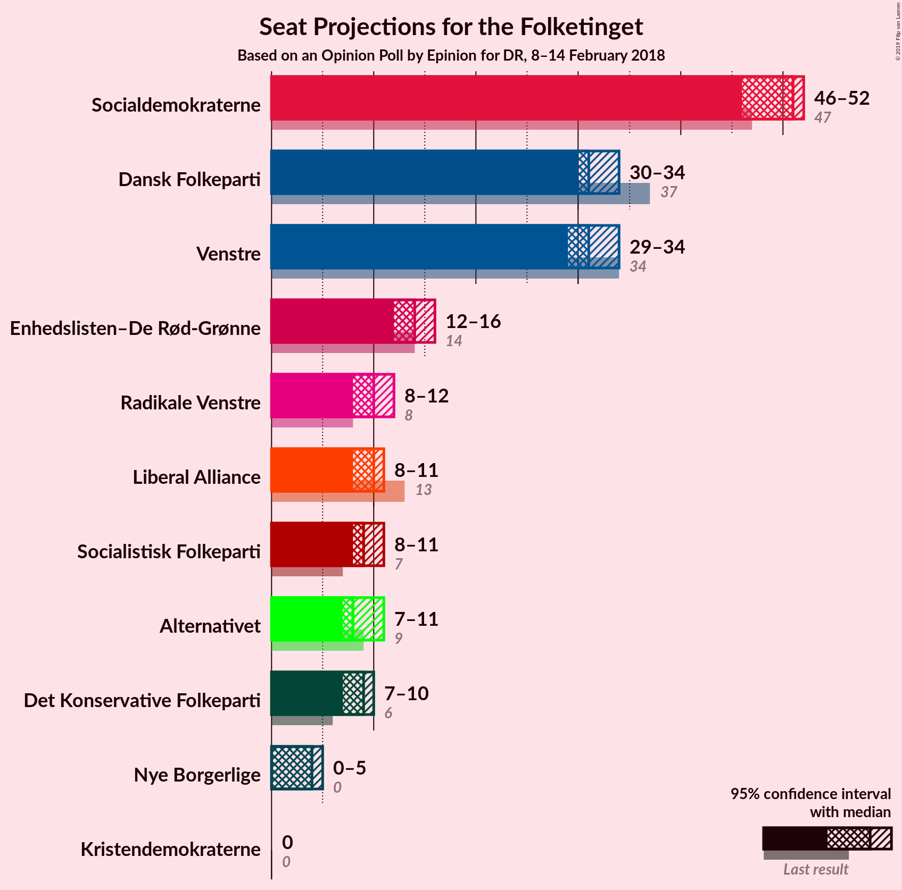
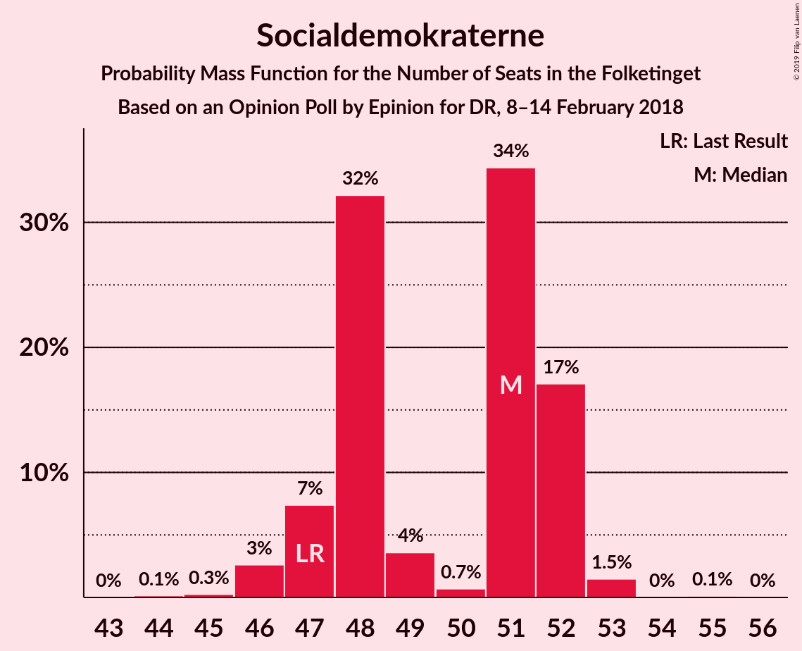
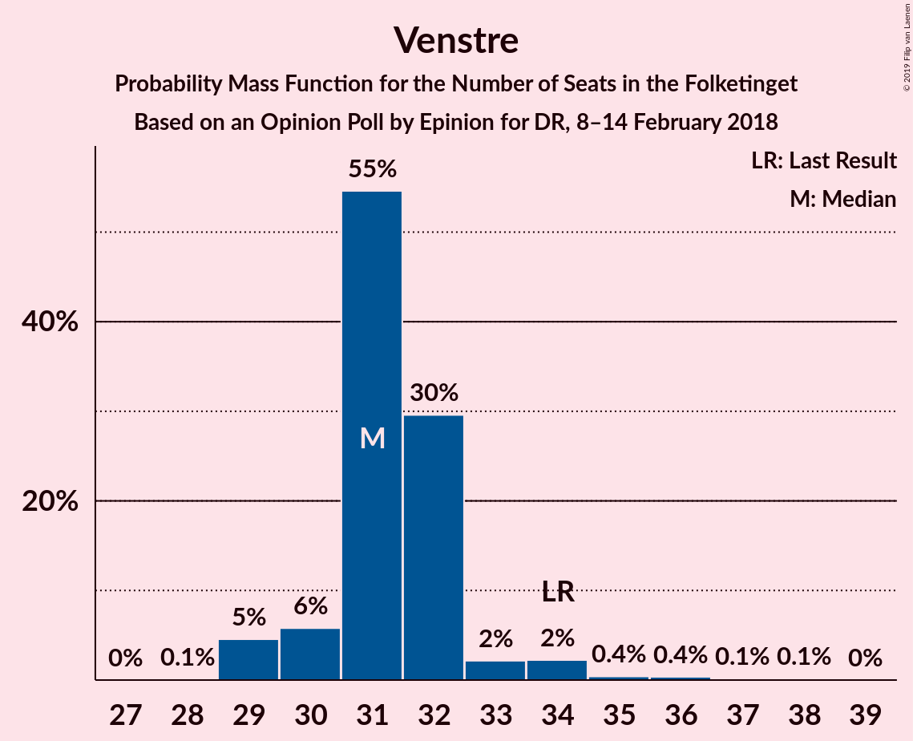
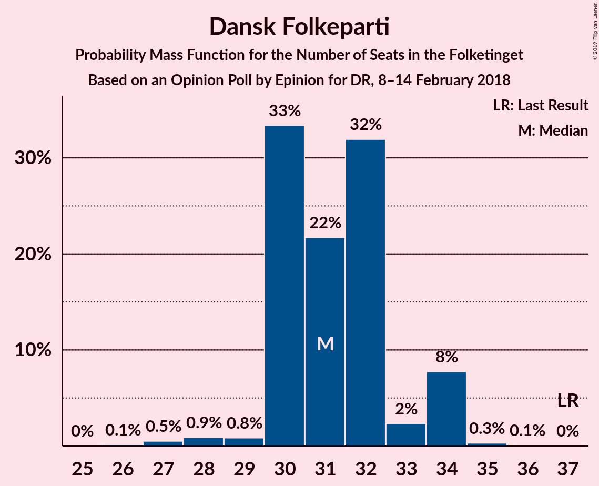
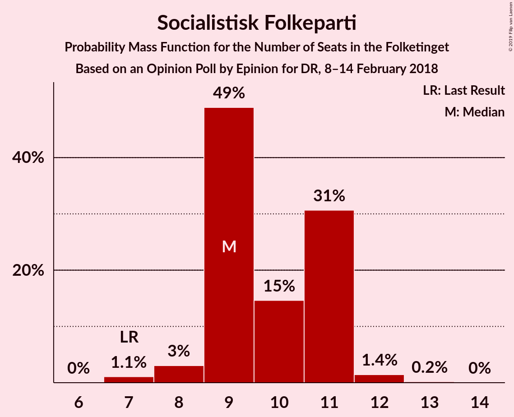
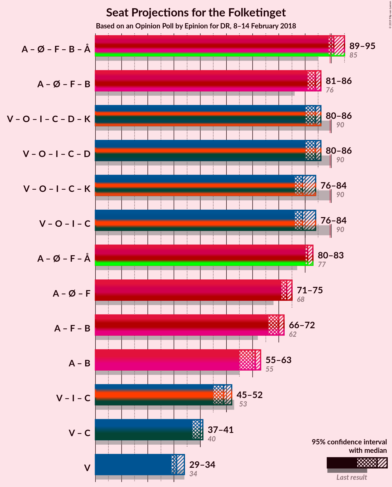

# Opinion Poll by Epinion for DR, 8–14 February 2018

<a href="#voting-intentions">Voting Intentions</a> | <a href="#seats">Seats</a> | <a href="#coalitions">Coalitions</a> | <a href="#technical-information">Technical Information</a>

## Voting Intentions

### Confidence Intervals

| Party | Last Result | Poll Result | 80% Confidence Interval | 90% Confidence Interval | 95% Confidence Interval | 99% Confidence Interval |
|:-----:|:-----------:|:-----------:|:-----------------------:|:-----------------------:|:-----------------------:|:-----------------------:|
| Socialdemokraterne | 26.3% | 28.0% | 26.6–29.5% |26.2–29.9% |25.8–30.3% |25.1–31.0% |
| Venstre | 19.5% | 18.7% | 17.5–20.0% |17.1–20.4% |16.8–20.7% |16.3–21.3% |
| Dansk Folkeparti | 21.1% | 17.2% | 16.0–18.5% |15.7–18.9% |15.4–19.2% |14.9–19.8% |
| Enhedslisten–De Rød-Grønne | 7.8% | 8.0% | 7.2–9.0% |7.0–9.2% |6.8–9.5% |6.4–9.9% |
| Socialistisk Folkeparti | 4.2% | 5.4% | 4.7–6.2% |4.5–6.4% |4.4–6.6% |4.1–7.0% |
| Liberal Alliance | 7.5% | 5.3% | 4.6–6.1% |4.4–6.3% |4.3–6.5% |4.0–6.9% |
| Radikale Venstre | 4.6% | 5.1% | 4.4–5.9% |4.3–6.1% |4.1–6.3% |3.8–6.7% |
| Alternativet | 4.8% | 4.8% | 4.2–5.6% |4.0–5.8% |3.9–6.0% |3.6–6.4% |
| Det Konservative Folkeparti | 3.4% | 4.6% | 4.0–5.3% |3.8–5.5% |3.6–5.7% |3.4–6.1% |
| Nye Borgerlige | 0.0% | 2.1% | 1.7–2.7% |1.6–2.8% |1.5–2.9% |1.3–3.2% |
| Kristendemokraterne | 0.8% | 0.7% | 0.5–1.1% |0.4–1.2% |0.4–1.2% |0.3–1.4% |

*Note:* The poll result column reflects the actual value used in the calculations. Published results may vary slightly, and in addition be rounded to fewer digits.

## Seats

### Confidence Intervals

| Party | Last Result | Median | 80% Confidence Interval | 90% Confidence Interval | 95% Confidence Interval | 99% Confidence Interval |
|:-----:|:-----------:|:------:|:-----------------------:|:-----------------------:|:-----------------------:|:-----------------------:|
| <a href="#socialdemokraterne">Socialdemokraterne</a> | 47 | 51 | 47–52 |47–52 |46–52 |46–53 |
| <a href="#venstre">Venstre</a> | 34 | 31 | 30–32 |30–33 |29–34 |29–36 |
| <a href="#dansk-folkeparti">Dansk Folkeparti</a> | 37 | 31 | 30–33 |30–34 |30–34 |27–34 |
| <a href="#enhedslisten–de-rød-grønne">Enhedslisten–De Rød-Grønne</a> | 14 | 14 | 12–15 |12–16 |12–16 |11–17 |
| <a href="#socialistisk-folkeparti">Socialistisk Folkeparti</a> | 7 | 9 | 9–11 |9–11 |8–11 |7–12 |
| <a href="#liberal-alliance">Liberal Alliance</a> | 13 | 10 | 8–11 |8–11 |8–11 |8–12 |
| <a href="#radikale-venstre">Radikale Venstre</a> | 8 | 10 | 9–11 |8–12 |8–12 |8–12 |
| <a href="#alternativet">Alternativet</a> | 9 | 8 | 7–10 |7–11 |7–11 |7–11 |
| <a href="#det-konservative-folkeparti">Det Konservative Folkeparti</a> | 6 | 9 | 7–10 |7–10 |7–10 |6–10 |
| <a href="#nye-borgerlige">Nye Borgerlige</a> | 0 | 4 | 0–5 |0–5 |0–5 |0–5 |
| <a href="#kristendemokraterne">Kristendemokraterne</a> | 0 | 0 | 0 |0 |0 |0 |

### Socialdemokraterne

*For a full overview of the results for this party, see the [Socialdemokraterne](party-socialdemokraterne.html) page.*

| Number of Seats | Probability | Accumulated | Special Marks |
|:---------------:|:-----------:|:-----------:|:-------------:|
| 44 | 0.1% | 100% |  |
| 45 | 0.3% | 99.8% |  |
| 46 | 3% | 99.6% |  |
| 47 | 7% | 97% | Last Result |
| 48 | 32% | 90% |  |
| 49 | 4% | 57% |  |
| 50 | 0.7% | 54% |  |
| 51 | 34% | 53% | Median |
| 52 | 17% | 19% |  |
| 53 | 1.5% | 2% |  |
| 54 | 0% | 0.1% |  |
| 55 | 0.1% | 0.1% |  |
| 56 | 0% | 0% |  |

### Venstre

*For a full overview of the results for this party, see the [Venstre](party-venstre.html) page.*

| Number of Seats | Probability | Accumulated | Special Marks |
|:---------------:|:-----------:|:-----------:|:-------------:|
| 28 | 0.1% | 100% |  |
| 29 | 5% | 99.9% |  |
| 30 | 6% | 95% |  |
| 31 | 55% | 90% | Median |
| 32 | 30% | 35% |  |
| 33 | 2% | 5% |  |
| 34 | 2% | 3% | Last Result |
| 35 | 0.4% | 1.0% |  |
| 36 | 0.4% | 0.6% |  |
| 37 | 0.1% | 0.2% |  |
| 38 | 0.1% | 0.1% |  |
| 39 | 0% | 0% |  |

### Dansk Folkeparti

*For a full overview of the results for this party, see the [Dansk Folkeparti](party-danskfolkeparti.html) page.*

| Number of Seats | Probability | Accumulated | Special Marks |
|:---------------:|:-----------:|:-----------:|:-------------:|
| 26 | 0.1% | 100% |  |
| 27 | 0.5% | 99.8% |  |
| 28 | 0.9% | 99.3% |  |
| 29 | 0.8% | 98% |  |
| 30 | 33% | 98% |  |
| 31 | 22% | 64% | Median |
| 32 | 32% | 42% |  |
| 33 | 2% | 11% |  |
| 34 | 8% | 8% |  |
| 35 | 0.3% | 0.4% |  |
| 36 | 0.1% | 0.1% |  |
| 37 | 0% | 0% | Last Result |

### Enhedslisten–De Rød-Grønne

*For a full overview of the results for this party, see the [Enhedslisten–De Rød-Grønne](party-enhedslisten–derød-grønne.html) page.*

| Number of Seats | Probability | Accumulated | Special Marks |
|:---------------:|:-----------:|:-----------:|:-------------:|
| 11 | 2% | 100% |  |
| 12 | 17% | 98% |  |
| 13 | 29% | 81% |  |
| 14 | 35% | 53% | Last Result, Median |
| 15 | 12% | 18% |  |
| 16 | 5% | 6% |  |
| 17 | 0.9% | 1.1% |  |
| 18 | 0.2% | 0.2% |  |
| 19 | 0% | 0% |  |

### Socialistisk Folkeparti

*For a full overview of the results for this party, see the [Socialistisk Folkeparti](party-socialistiskfolkeparti.html) page.*

| Number of Seats | Probability | Accumulated | Special Marks |
|:---------------:|:-----------:|:-----------:|:-------------:|
| 7 | 1.1% | 100% | Last Result |
| 8 | 3% | 98.9% |  |
| 9 | 49% | 96% | Median |
| 10 | 15% | 47% |  |
| 11 | 31% | 32% |  |
| 12 | 1.4% | 2% |  |
| 13 | 0.2% | 0.2% |  |
| 14 | 0% | 0% |  |

### Liberal Alliance

*For a full overview of the results for this party, see the [Liberal Alliance](party-liberalalliance.html) page.*

| Number of Seats | Probability | Accumulated | Special Marks |
|:---------------:|:-----------:|:-----------:|:-------------:|
| 7 | 0.2% | 100% |  |
| 8 | 21% | 99.8% |  |
| 9 | 11% | 79% |  |
| 10 | 33% | 67% | Median |
| 11 | 33% | 35% |  |
| 12 | 2% | 2% |  |
| 13 | 0% | 0.1% | Last Result |
| 14 | 0% | 0% |  |

### Radikale Venstre

*For a full overview of the results for this party, see the [Radikale Venstre](party-radikalevenstre.html) page.*

| Number of Seats | Probability | Accumulated | Special Marks |
|:---------------:|:-----------:|:-----------:|:-------------:|
| 7 | 0.3% | 100% |  |
| 8 | 5% | 99.6% | Last Result |
| 9 | 31% | 95% |  |
| 10 | 36% | 63% | Median |
| 11 | 22% | 28% |  |
| 12 | 5% | 5% |  |
| 13 | 0.1% | 0.1% |  |
| 14 | 0% | 0% |  |

### Alternativet

*For a full overview of the results for this party, see the [Alternativet](party-alternativet.html) page.*

| Number of Seats | Probability | Accumulated | Special Marks |
|:---------------:|:-----------:|:-----------:|:-------------:|
| 5 | 0.1% | 100% |  |
| 6 | 0% | 99.9% |  |
| 7 | 33% | 99.9% |  |
| 8 | 22% | 67% | Median |
| 9 | 6% | 45% | Last Result |
| 10 | 31% | 40% |  |
| 11 | 8% | 8% |  |
| 12 | 0.2% | 0.3% |  |
| 13 | 0% | 0.1% |  |
| 14 | 0.1% | 0.1% |  |
| 15 | 0% | 0% |  |

### Det Konservative Folkeparti

*For a full overview of the results for this party, see the [Det Konservative Folkeparti](party-detkonservativefolkeparti.html) page.*

| Number of Seats | Probability | Accumulated | Special Marks |
|:---------------:|:-----------:|:-----------:|:-------------:|
| 6 | 2% | 100% | Last Result |
| 7 | 35% | 98% |  |
| 8 | 8% | 63% |  |
| 9 | 20% | 55% | Median |
| 10 | 34% | 34% |  |
| 11 | 0.1% | 0.1% |  |
| 12 | 0% | 0% |  |

### Nye Borgerlige

*For a full overview of the results for this party, see the [Nye Borgerlige](party-nyeborgerlige.html) page.*

| Number of Seats | Probability | Accumulated | Special Marks |
|:---------------:|:-----------:|:-----------:|:-------------:|
| 0 | 42% | 100% | Last Result |
| 1 | 0% | 58% |  |
| 2 | 0% | 58% |  |
| 3 | 0.1% | 58% |  |
| 4 | 29% | 58% | Median |
| 5 | 29% | 29% |  |
| 6 | 0.3% | 0.3% |  |
| 7 | 0% | 0% |  |

### Kristendemokraterne

*For a full overview of the results for this party, see the [Kristendemokraterne](party-kristendemokraterne.html) page.*

| Number of Seats | Probability | Accumulated | Special Marks |
|:---------------:|:-----------:|:-----------:|:-------------:|
| 0 | 100% | 100% | Last Result, Median |

## Coalitions

### Confidence Intervals

| Coalition | Last Result | Median | Majority? | 80% Confidence Interval | 90% Confidence Interval | 95% Confidence Interval | 99% Confidence Interval |
|:---------:|:-----------:|:------:|:---------:|:-----------------------:|:-----------------------:|:-----------------------:|:-----------------------:|
| Socialdemokraterne – Enhedslisten–De Rød-Grønne – Socialistisk Folkeparti – Radikale Venstre – Alternativet | 85 | 91 | 96% | 91–94 | 90–95 | 89–95 | 87–96 |
| Socialdemokraterne – Enhedslisten–De Rød-Grønne – Socialistisk Folkeparti – Radikale Venstre | 76 | 84 | 0% | 81–84 | 81–86 | 81–86 | 79–87 |
| Venstre – Dansk Folkeparti – Liberal Alliance – Det Konservative Folkeparti – Nye Borgerlige – Kristendemokraterne | 90 | 84 | 0% | 81–84 | 80–85 | 80–86 | 79–88 |
| Venstre – Dansk Folkeparti – Liberal Alliance – Det Konservative Folkeparti – Nye Borgerlige | 90 | 84 | 0% | 81–84 | 80–85 | 80–86 | 79–88 |
| Venstre – Dansk Folkeparti – Liberal Alliance – Det Konservative Folkeparti – Kristendemokraterne | 90 | 79 | 0% | 79–84 | 78–84 | 76–84 | 76–86 |
| Venstre – Dansk Folkeparti – Liberal Alliance – Det Konservative Folkeparti | 90 | 79 | 0% | 79–84 | 78–84 | 76–84 | 76–86 |
| Socialdemokraterne – Enhedslisten–De Rød-Grønne – Socialistisk Folkeparti – Alternativet | 77 | 81 | 0% | 81–83 | 81–83 | 80–83 | 79–86 |
| Socialdemokraterne – Enhedslisten–De Rød-Grønne – Socialistisk Folkeparti | 68 | 73 | 0% | 72–74 | 72–74 | 71–75 | 70–77 |
| Socialdemokraterne – Socialistisk Folkeparti – Radikale Venstre | 62 | 70 | 0% | 68–72 | 67–72 | 66–72 | 64–72 |
| Socialdemokraterne – Radikale Venstre | 55 | 61 | 0% | 57–63 | 57–63 | 55–63 | 55–63 |
| Venstre – Liberal Alliance – Det Konservative Folkeparti | 53 | 49 | 0% | 47–52 | 47–52 | 45–52 | 45–53 |
| Venstre – Det Konservative Folkeparti | 40 | 40 | 0% | 38–41 | 38–41 | 37–41 | 37–43 |
| Venstre | 34 | 31 | 0% | 30–32 | 30–33 | 29–34 | 29–36 |

### Socialdemokraterne – Enhedslisten–De Rød-Grønne – Socialistisk Folkeparti – Radikale Venstre – Alternativet

| Number of Seats | Probability | Accumulated | Special Marks |
|:---------------:|:-----------:|:-----------:|:-------------:|
| 85 | 0% | 100% | Last Result |
| 86 | 0.3% | 100% |  |
| 87 | 0.2% | 99.6% |  |
| 88 | 0.3% | 99.4% |  |
| 89 | 3% | 99.1% |  |
| 90 | 1.5% | 96% | Majority |
| 91 | 62% | 95% |  |
| 92 | 18% | 33% | Median |
| 93 | 3% | 15% |  |
| 94 | 7% | 12% |  |
| 95 | 5% | 5% |  |
| 96 | 0.5% | 0.6% |  |
| 97 | 0.1% | 0.1% |  |
| 98 | 0% | 0% |  |

### Socialdemokraterne – Enhedslisten–De Rød-Grønne – Socialistisk Folkeparti – Radikale Venstre

| Number of Seats | Probability | Accumulated | Special Marks |
|:---------------:|:-----------:|:-----------:|:-------------:|
| 76 | 0% | 100% | Last Result |
| 77 | 0.1% | 100% |  |
| 78 | 0% | 99.8% |  |
| 79 | 0.6% | 99.8% |  |
| 80 | 1.0% | 99.2% |  |
| 81 | 30% | 98% |  |
| 82 | 5% | 68% |  |
| 83 | 9% | 63% |  |
| 84 | 48% | 54% | Median |
| 85 | 0.7% | 6% |  |
| 86 | 5% | 5% |  |
| 87 | 0.6% | 0.8% |  |
| 88 | 0.1% | 0.2% |  |
| 89 | 0% | 0.1% |  |
| 90 | 0% | 0% | Majority |

### Venstre – Dansk Folkeparti – Liberal Alliance – Det Konservative Folkeparti – Nye Borgerlige – Kristendemokraterne

| Number of Seats | Probability | Accumulated | Special Marks |
|:---------------:|:-----------:|:-----------:|:-------------:|
| 78 | 0.1% | 100% |  |
| 79 | 0.5% | 99.9% |  |
| 80 | 5% | 99.4% |  |
| 81 | 7% | 95% |  |
| 82 | 3% | 88% |  |
| 83 | 18% | 85% |  |
| 84 | 62% | 67% |  |
| 85 | 1.5% | 5% | Median |
| 86 | 3% | 4% |  |
| 87 | 0.3% | 0.9% |  |
| 88 | 0.2% | 0.6% |  |
| 89 | 0.3% | 0.4% |  |
| 90 | 0% | 0% | Last Result, Majority |

### Venstre – Dansk Folkeparti – Liberal Alliance – Det Konservative Folkeparti – Nye Borgerlige

| Number of Seats | Probability | Accumulated | Special Marks |
|:---------------:|:-----------:|:-----------:|:-------------:|
| 78 | 0.1% | 100% |  |
| 79 | 0.5% | 99.9% |  |
| 80 | 5% | 99.4% |  |
| 81 | 7% | 95% |  |
| 82 | 3% | 88% |  |
| 83 | 18% | 85% |  |
| 84 | 62% | 67% |  |
| 85 | 1.5% | 5% | Median |
| 86 | 3% | 4% |  |
| 87 | 0.3% | 0.9% |  |
| 88 | 0.2% | 0.6% |  |
| 89 | 0.3% | 0.4% |  |
| 90 | 0% | 0% | Last Result, Majority |

### Venstre – Dansk Folkeparti – Liberal Alliance – Det Konservative Folkeparti – Kristendemokraterne

| Number of Seats | Probability | Accumulated | Special Marks |
|:---------------:|:-----------:|:-----------:|:-------------:|
| 76 | 4% | 100% |  |
| 77 | 0.1% | 96% |  |
| 78 | 3% | 96% |  |
| 79 | 44% | 93% |  |
| 80 | 3% | 48% |  |
| 81 | 9% | 45% | Median |
| 82 | 0.8% | 36% |  |
| 83 | 1.4% | 35% |  |
| 84 | 32% | 33% |  |
| 85 | 0.3% | 1.4% |  |
| 86 | 0.9% | 1.1% |  |
| 87 | 0% | 0.1% |  |
| 88 | 0.1% | 0.1% |  |
| 89 | 0% | 0% |  |
| 90 | 0% | 0% | Last Result, Majority |

### Venstre – Dansk Folkeparti – Liberal Alliance – Det Konservative Folkeparti

| Number of Seats | Probability | Accumulated | Special Marks |
|:---------------:|:-----------:|:-----------:|:-------------:|
| 76 | 4% | 100% |  |
| 77 | 0.1% | 96% |  |
| 78 | 3% | 96% |  |
| 79 | 44% | 93% |  |
| 80 | 3% | 48% |  |
| 81 | 9% | 45% | Median |
| 82 | 0.8% | 36% |  |
| 83 | 1.4% | 35% |  |
| 84 | 32% | 33% |  |
| 85 | 0.3% | 1.4% |  |
| 86 | 0.9% | 1.1% |  |
| 87 | 0% | 0.1% |  |
| 88 | 0.1% | 0.1% |  |
| 89 | 0% | 0% |  |
| 90 | 0% | 0% | Last Result, Majority |

### Socialdemokraterne – Enhedslisten–De Rød-Grønne – Socialistisk Folkeparti – Alternativet

| Number of Seats | Probability | Accumulated | Special Marks |
|:---------------:|:-----------:|:-----------:|:-------------:|
| 76 | 0% | 100% |  |
| 77 | 0.4% | 99.9% | Last Result |
| 78 | 0% | 99.6% |  |
| 79 | 2% | 99.5% |  |
| 80 | 0.9% | 98% |  |
| 81 | 50% | 97% |  |
| 82 | 28% | 47% | Median |
| 83 | 17% | 19% |  |
| 84 | 0.2% | 2% |  |
| 85 | 0.9% | 1.4% |  |
| 86 | 0.2% | 0.5% |  |
| 87 | 0.1% | 0.3% |  |
| 88 | 0.1% | 0.2% |  |
| 89 | 0.1% | 0.1% |  |
| 90 | 0% | 0% | Majority |

### Socialdemokraterne – Enhedslisten–De Rød-Grønne – Socialistisk Folkeparti

| Number of Seats | Probability | Accumulated | Special Marks |
|:---------------:|:-----------:|:-----------:|:-------------:|
| 68 | 0.1% | 100% | Last Result |
| 69 | 0.2% | 99.9% |  |
| 70 | 1.1% | 99.7% |  |
| 71 | 2% | 98.6% |  |
| 72 | 36% | 96% |  |
| 73 | 20% | 61% |  |
| 74 | 36% | 41% | Median |
| 75 | 3% | 4% |  |
| 76 | 1.2% | 2% |  |
| 77 | 0.2% | 0.5% |  |
| 78 | 0.2% | 0.4% |  |
| 79 | 0.2% | 0.2% |  |
| 80 | 0% | 0% |  |

### Socialdemokraterne – Socialistisk Folkeparti – Radikale Venstre

| Number of Seats | Probability | Accumulated | Special Marks |
|:---------------:|:-----------:|:-----------:|:-------------:|
| 62 | 0% | 100% | Last Result |
| 63 | 0.1% | 99.9% |  |
| 64 | 0.6% | 99.8% |  |
| 65 | 1.0% | 99.2% |  |
| 66 | 2% | 98% |  |
| 67 | 4% | 97% |  |
| 68 | 34% | 93% |  |
| 69 | 3% | 59% |  |
| 70 | 38% | 56% | Median |
| 71 | 1.2% | 18% |  |
| 72 | 16% | 17% |  |
| 73 | 0.2% | 0.4% |  |
| 74 | 0% | 0.2% |  |
| 75 | 0.1% | 0.1% |  |
| 76 | 0% | 0% |  |

### Socialdemokraterne – Radikale Venstre

| Number of Seats | Probability | Accumulated | Special Marks |
|:---------------:|:-----------:|:-----------:|:-------------:|
| 53 | 0.2% | 100% |  |
| 54 | 0.1% | 99.8% |  |
| 55 | 3% | 99.7% | Last Result |
| 56 | 0.5% | 97% |  |
| 57 | 28% | 96% |  |
| 58 | 7% | 68% |  |
| 59 | 6% | 61% |  |
| 60 | 4% | 55% |  |
| 61 | 34% | 51% | Median |
| 62 | 0.8% | 17% |  |
| 63 | 16% | 16% |  |
| 64 | 0.1% | 0.1% |  |
| 65 | 0% | 0% |  |

### Venstre – Liberal Alliance – Det Konservative Folkeparti

| Number of Seats | Probability | Accumulated | Special Marks |
|:---------------:|:-----------:|:-----------:|:-------------:|
| 45 | 4% | 100% |  |
| 46 | 0% | 96% |  |
| 47 | 7% | 96% |  |
| 48 | 19% | 89% |  |
| 49 | 30% | 70% |  |
| 50 | 4% | 40% | Median |
| 51 | 0.9% | 36% |  |
| 52 | 33% | 35% |  |
| 53 | 1.5% | 2% | Last Result |
| 54 | 0.2% | 0.4% |  |
| 55 | 0% | 0.2% |  |
| 56 | 0.1% | 0.1% |  |
| 57 | 0% | 0% |  |

### Venstre – Det Konservative Folkeparti

| Number of Seats | Probability | Accumulated | Special Marks |
|:---------------:|:-----------:|:-----------:|:-------------:|
| 37 | 5% | 100% |  |
| 38 | 7% | 95% |  |
| 39 | 30% | 88% |  |
| 40 | 23% | 58% | Last Result, Median |
| 41 | 33% | 35% |  |
| 42 | 1.2% | 2% |  |
| 43 | 0.5% | 0.9% |  |
| 44 | 0.3% | 0.4% |  |
| 45 | 0% | 0.1% |  |
| 46 | 0% | 0.1% |  |
| 47 | 0% | 0.1% |  |
| 48 | 0.1% | 0.1% |  |
| 49 | 0% | 0% |  |

### Venstre

| Number of Seats | Probability | Accumulated | Special Marks |
|:---------------:|:-----------:|:-----------:|:-------------:|
| 28 | 0.1% | 100% |  |
| 29 | 5% | 99.9% |  |
| 30 | 6% | 95% |  |
| 31 | 55% | 90% | Median |
| 32 | 30% | 35% |  |
| 33 | 2% | 5% |  |
| 34 | 2% | 3% | Last Result |
| 35 | 0.4% | 1.0% |  |
| 36 | 0.4% | 0.6% |  |
| 37 | 0.1% | 0.2% |  |
| 38 | 0.1% | 0.1% |  |
| 39 | 0% | 0% |  |

## Technical Information

### Opinion Poll

+ **Polling firm:** Epinion
+ **Commissioner(s):** DR
+ **Fieldwork period:** 8–14 February 2018

### Calculations

+ **Sample size:** 1573
+ **Simulations done:** 131,072
+ **Error estimate:** 1.27%

