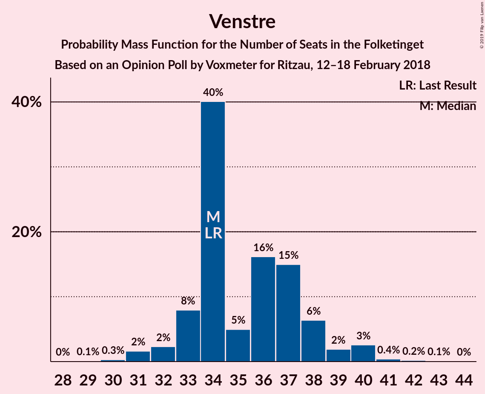
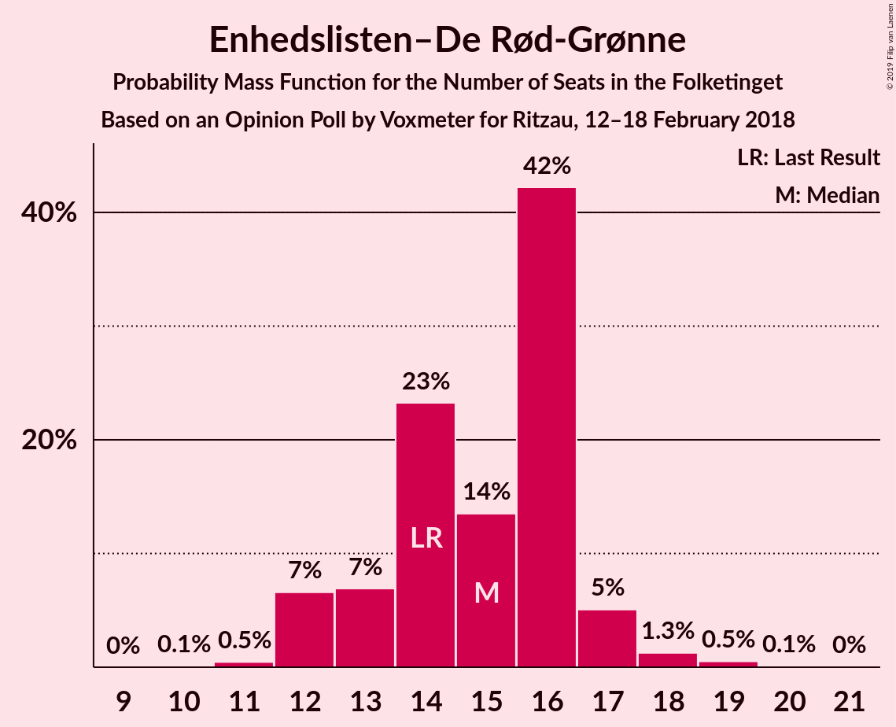
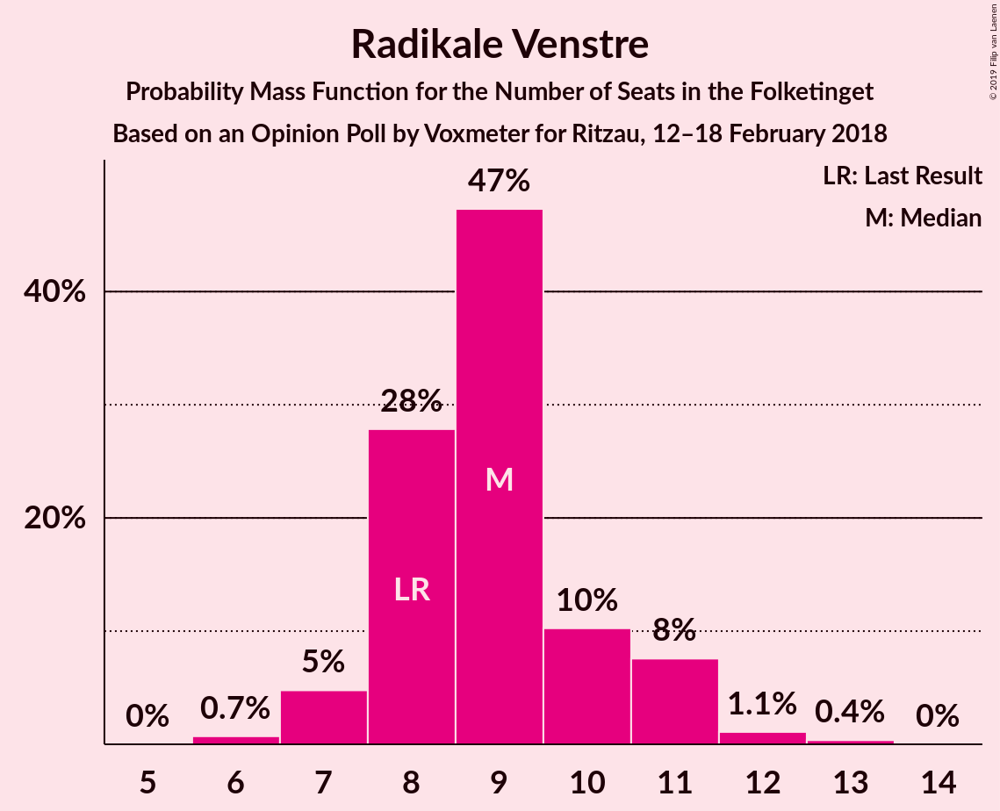
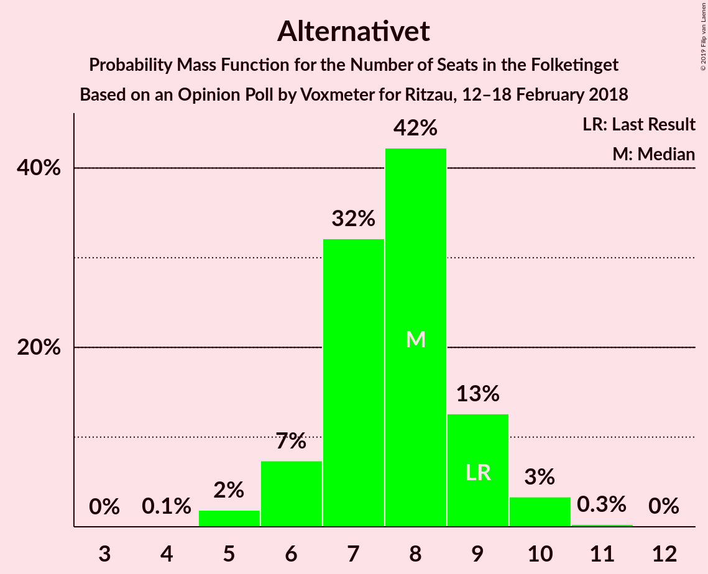

# Opinion Poll by Voxmeter for Ritzau, 12–18 February 2018

<a href="#voting-intentions">Voting Intentions</a> | <a href="#seats">Seats</a> | <a href="#coalitions">Coalitions</a> | <a href="#technical-information">Technical Information</a>

## Voting Intentions

### Confidence Intervals

| Party | Last Result | Poll Result | 80% Confidence Interval | 90% Confidence Interval | 95% Confidence Interval | 99% Confidence Interval |
|:-----:|:-----------:|:-----------:|:-----------------------:|:-----------------------:|:-----------------------:|:-----------------------:|
| Socialdemokraterne | 26.3% | 28.4% | 26.6–30.2% |26.1–30.7% |25.7–31.2% |24.9–32.1% |
| Venstre | 19.5% | 20.0% | 18.4–21.7% |18.0–22.1% |17.6–22.5% |16.9–23.4% |
| Dansk Folkeparti | 21.1% | 18.2% | 16.8–19.9% |16.3–20.3% |16.0–20.7% |15.3–21.5% |
| Enhedslisten–De Rød-Grønne | 7.8% | 8.2% | 7.2–9.4% |6.9–9.7% |6.7–10.0% |6.2–10.6% |
| Radikale Venstre | 4.6% | 5.0% | 4.2–6.0% |4.0–6.2% |3.8–6.5% |3.5–7.0% |
| Liberal Alliance | 7.5% | 4.8% | 4.0–5.7% |3.8–6.0% |3.6–6.3% |3.3–6.8% |
| Socialistisk Folkeparti | 4.2% | 4.5% | 3.7–5.4% |3.6–5.7% |3.4–5.9% |3.0–6.4% |
| Alternativet | 4.8% | 4.1% | 3.4–5.0% |3.2–5.3% |3.0–5.5% |2.7–6.0% |
| Det Konservative Folkeparti | 3.4% | 4.0% | 3.3–4.9% |3.1–5.2% |3.0–5.4% |2.7–5.9% |
| Nye Borgerlige | 0.0% | 1.5% | 1.1–2.1% |1.0–2.2% |0.9–2.4% |0.7–2.7% |
| Kristendemokraterne | 0.8% | 0.9% | 0.6–1.4% |0.5–1.5% |0.5–1.7% |0.4–2.0% |

*Note:* The poll result column reflects the actual value used in the calculations. Published results may vary slightly, and in addition be rounded to fewer digits.

## Seats

### Confidence Intervals

| Party | Last Result | Median | 80% Confidence Interval | 90% Confidence Interval | 95% Confidence Interval | 99% Confidence Interval |
|:-----:|:-----------:|:------:|:-----------------------:|:-----------------------:|:-----------------------:|:-----------------------:|
| <a href="#socialdemokraterne">Socialdemokraterne</a> | 47 | 50 | 48–53 |48–53 |47–54 |45–55 |
| <a href="#venstre">Venstre</a> | 34 | 35 | 32–37 |31–37 |31–37 |31–41 |
| <a href="#dansk-folkeparti">Dansk Folkeparti</a> | 37 | 35 | 30–38 |30–38 |30–38 |28–38 |
| <a href="#enhedslisten–de-rød-grønne">Enhedslisten–De Rød-Grønne</a> | 14 | 15 | 14–17 |14–18 |13–18 |12–19 |
| <a href="#radikale-venstre">Radikale Venstre</a> | 8 | 8 | 7–10 |7–10 |7–11 |6–11 |
| <a href="#liberal-alliance">Liberal Alliance</a> | 13 | 11 | 7–11 |7–11 |6–11 |6–12 |
| <a href="#socialistisk-folkeparti">Socialistisk Folkeparti</a> | 7 | 7 | 6–9 |6–10 |6–10 |5–12 |
| <a href="#alternativet">Alternativet</a> | 9 | 7 | 7–9 |6–9 |6–9 |5–11 |
| <a href="#det-konservative-folkeparti">Det Konservative Folkeparti</a> | 6 | 7 | 7–8 |6–8 |6–8 |5–10 |
| <a href="#nye-borgerlige">Nye Borgerlige</a> | 0 | 0 | 0 |0–4 |0–4 |0–5 |
| <a href="#kristendemokraterne">Kristendemokraterne</a> | 0 | 0 | 0 |0 |0 |0 |

### Socialdemokraterne

*For a full overview of the results for this party, see the [Socialdemokraterne](party-socialdemokraterne.html) page.*

| Number of Seats | Probability | Accumulated | Special Marks |
|:---------------:|:-----------:|:-----------:|:-------------:|
| 44 | 0.2% | 100% |  |
| 45 | 0.3% | 99.7% |  |
| 46 | 1.1% | 99.5% |  |
| 47 | 1.2% | 98% | Last Result |
| 48 | 17% | 97% |  |
| 49 | 25% | 80% |  |
| 50 | 6% | 55% | Median |
| 51 | 8% | 49% |  |
| 52 | 30% | 41% |  |
| 53 | 8% | 11% |  |
| 54 | 3% | 4% |  |
| 55 | 0.2% | 0.6% |  |
| 56 | 0.1% | 0.4% |  |
| 57 | 0% | 0.2% |  |
| 58 | 0.2% | 0.2% |  |
| 59 | 0% | 0% |  |

### Venstre

*For a full overview of the results for this party, see the [Venstre](party-venstre.html) page.*

| Number of Seats | Probability | Accumulated | Special Marks |
|:---------------:|:-----------:|:-----------:|:-------------:|
| 28 | 0.1% | 100% |  |
| 29 | 0% | 99.9% |  |
| 30 | 0.3% | 99.9% |  |
| 31 | 8% | 99.6% |  |
| 32 | 6% | 92% |  |
| 33 | 24% | 86% |  |
| 34 | 0.9% | 62% | Last Result |
| 35 | 24% | 61% | Median |
| 36 | 1.2% | 37% |  |
| 37 | 34% | 36% |  |
| 38 | 0.5% | 2% |  |
| 39 | 0.5% | 2% |  |
| 40 | 0.5% | 1.4% |  |
| 41 | 0.6% | 0.9% |  |
| 42 | 0.1% | 0.3% |  |
| 43 | 0.2% | 0.2% |  |
| 44 | 0% | 0% |  |

### Dansk Folkeparti

*For a full overview of the results for this party, see the [Dansk Folkeparti](party-danskfolkeparti.html) page.*

| Number of Seats | Probability | Accumulated | Special Marks |
|:---------------:|:-----------:|:-----------:|:-------------:|
| 26 | 0% | 100% |  |
| 27 | 0.3% | 99.9% |  |
| 28 | 0.4% | 99.6% |  |
| 29 | 0.8% | 99.2% |  |
| 30 | 30% | 98% |  |
| 31 | 4% | 68% |  |
| 32 | 8% | 65% |  |
| 33 | 1.0% | 57% |  |
| 34 | 1.2% | 56% |  |
| 35 | 29% | 54% | Median |
| 36 | 8% | 25% |  |
| 37 | 1.0% | 17% | Last Result |
| 38 | 16% | 16% |  |
| 39 | 0% | 0.1% |  |
| 40 | 0.1% | 0.1% |  |
| 41 | 0% | 0% |  |

### Enhedslisten–De Rød-Grønne

*For a full overview of the results for this party, see the [Enhedslisten–De Rød-Grønne](party-enhedslisten–derød-grønne.html) page.*

| Number of Seats | Probability | Accumulated | Special Marks |
|:---------------:|:-----------:|:-----------:|:-------------:|
| 11 | 0.2% | 100% |  |
| 12 | 0.6% | 99.7% |  |
| 13 | 2% | 99.1% |  |
| 14 | 33% | 97% | Last Result |
| 15 | 33% | 65% | Median |
| 16 | 1.4% | 31% |  |
| 17 | 25% | 30% |  |
| 18 | 5% | 5% |  |
| 19 | 0.4% | 0.6% |  |
| 20 | 0.2% | 0.2% |  |
| 21 | 0% | 0% |  |

### Radikale Venstre

*For a full overview of the results for this party, see the [Radikale Venstre](party-radikalevenstre.html) page.*

| Number of Seats | Probability | Accumulated | Special Marks |
|:---------------:|:-----------:|:-----------:|:-------------:|
| 6 | 0.5% | 100% |  |
| 7 | 30% | 99.5% |  |
| 8 | 28% | 70% | Last Result, Median |
| 9 | 7% | 42% |  |
| 10 | 31% | 34% |  |
| 11 | 3% | 3% |  |
| 12 | 0.3% | 0.4% |  |
| 13 | 0.1% | 0.1% |  |
| 14 | 0% | 0% |  |

### Liberal Alliance

*For a full overview of the results for this party, see the [Liberal Alliance](party-liberalalliance.html) page.*

| Number of Seats | Probability | Accumulated | Special Marks |
|:---------------:|:-----------:|:-----------:|:-------------:|
| 6 | 3% | 100% |  |
| 7 | 9% | 97% |  |
| 8 | 7% | 88% |  |
| 9 | 25% | 81% |  |
| 10 | 2% | 56% |  |
| 11 | 53% | 54% | Median |
| 12 | 0.3% | 0.8% |  |
| 13 | 0.2% | 0.4% | Last Result |
| 14 | 0.2% | 0.2% |  |
| 15 | 0% | 0% |  |

### Socialistisk Folkeparti

*For a full overview of the results for this party, see the [Socialistisk Folkeparti](party-socialistiskfolkeparti.html) page.*

| Number of Seats | Probability | Accumulated | Special Marks |
|:---------------:|:-----------:|:-----------:|:-------------:|
| 5 | 0.9% | 100% |  |
| 6 | 24% | 99.1% |  |
| 7 | 29% | 75% | Last Result, Median |
| 8 | 3% | 47% |  |
| 9 | 34% | 44% |  |
| 10 | 9% | 10% |  |
| 11 | 0.3% | 1.0% |  |
| 12 | 0.6% | 0.6% |  |
| 13 | 0% | 0% |  |

### Alternativet

*For a full overview of the results for this party, see the [Alternativet](party-alternativet.html) page.*

| Number of Seats | Probability | Accumulated | Special Marks |
|:---------------:|:-----------:|:-----------:|:-------------:|
| 5 | 1.4% | 100% |  |
| 6 | 8% | 98.5% |  |
| 7 | 62% | 90% | Median |
| 8 | 5% | 28% |  |
| 9 | 22% | 24% | Last Result |
| 10 | 0.8% | 1.4% |  |
| 11 | 0.5% | 0.6% |  |
| 12 | 0.1% | 0.1% |  |
| 13 | 0% | 0% |  |

### Det Konservative Folkeparti

*For a full overview of the results for this party, see the [Det Konservative Folkeparti](party-detkonservativefolkeparti.html) page.*

| Number of Seats | Probability | Accumulated | Special Marks |
|:---------------:|:-----------:|:-----------:|:-------------:|
| 4 | 0.1% | 100% |  |
| 5 | 0.7% | 99.9% |  |
| 6 | 5% | 99.2% | Last Result |
| 7 | 77% | 95% | Median |
| 8 | 16% | 18% |  |
| 9 | 0.8% | 2% |  |
| 10 | 0.5% | 1.0% |  |
| 11 | 0.1% | 0.4% |  |
| 12 | 0.3% | 0.3% |  |
| 13 | 0% | 0% |  |

### Nye Borgerlige

*For a full overview of the results for this party, see the [Nye Borgerlige](party-nyeborgerlige.html) page.*

| Number of Seats | Probability | Accumulated | Special Marks |
|:---------------:|:-----------:|:-----------:|:-------------:|
| 0 | 91% | 100% | Last Result, Median |
| 1 | 0% | 9% |  |
| 2 | 0% | 9% |  |
| 3 | 0% | 9% |  |
| 4 | 9% | 9% |  |
| 5 | 0.5% | 0.5% |  |
| 6 | 0.1% | 0.1% |  |
| 7 | 0% | 0% |  |

### Kristendemokraterne

*For a full overview of the results for this party, see the [Kristendemokraterne](party-kristendemokraterne.html) page.*

| Number of Seats | Probability | Accumulated | Special Marks |
|:---------------:|:-----------:|:-----------:|:-------------:|
| 0 | 99.9% | 100% | Last Result, Median |
| 1 | 0% | 0.1% |  |
| 2 | 0% | 0.1% |  |
| 3 | 0% | 0.1% |  |
| 4 | 0.1% | 0.1% |  |
| 5 | 0% | 0% |  |

## Coalitions

### Confidence Intervals

| Coalition | Last Result | Median | Majority? | 80% Confidence Interval | 90% Confidence Interval | 95% Confidence Interval | 99% Confidence Interval |
|:---------:|:-----------:|:------:|:---------:|:-----------------------:|:-----------------------:|:-----------------------:|:-----------------------:|
| Socialdemokraterne – Enhedslisten–De Rød-Grønne – Radikale Venstre – Socialistisk Folkeparti – Alternativet | 85 | 89 | 48% | 86–92 | 86–93 | 86–94 | 84–95 |
| Venstre – Dansk Folkeparti – Liberal Alliance – Det Konservative Folkeparti – Nye Borgerlige – Kristendemokraterne | 90 | 86 | 0.6% | 83–89 | 82–89 | 81–89 | 80–91 |
| Venstre – Dansk Folkeparti – Liberal Alliance – Det Konservative Folkeparti – Kristendemokraterne | 90 | 85 | 0.3% | 82–89 | 82–89 | 81–89 | 78–89 |
| Venstre – Dansk Folkeparti – Liberal Alliance – Det Konservative Folkeparti – Nye Borgerlige | 90 | 86 | 0.6% | 83–89 | 82–89 | 81–89 | 80–91 |
| Venstre – Dansk Folkeparti – Liberal Alliance – Det Konservative Folkeparti | 90 | 85 | 0.3% | 82–89 | 82–89 | 81–89 | 78–89 |
| Socialdemokraterne – Enhedslisten–De Rød-Grønne – Socialistisk Folkeparti – Alternativet | 77 | 81 | 0% | 78–83 | 78–84 | 78–86 | 75–87 |
| Socialdemokraterne – Enhedslisten–De Rød-Grønne – Radikale Venstre – Socialistisk Folkeparti | 76 | 83 | 0.2% | 77–84 | 77–84 | 77–86 | 76–88 |
| Socialdemokraterne – Enhedslisten–De Rød-Grønne – Socialistisk Folkeparti | 68 | 74 | 0% | 69–76 | 69–76 | 69–78 | 67–79 |
| Socialdemokraterne – Radikale Venstre – Socialistisk Folkeparti | 62 | 68 | 0% | 63–70 | 63–70 | 63–71 | 63–73 |
| Socialdemokraterne – Radikale Venstre | 55 | 59 | 0% | 56–62 | 56–63 | 56–63 | 54–65 |
| Venstre – Liberal Alliance – Det Konservative Folkeparti | 53 | 51 | 0% | 47–55 | 46–55 | 46–55 | 46–58 |
| Venstre – Det Konservative Folkeparti | 40 | 42 | 0% | 39–44 | 39–44 | 39–45 | 38–49 |
| Venstre | 34 | 35 | 0% | 32–37 | 31–37 | 31–37 | 31–41 |

### Socialdemokraterne – Enhedslisten–De Rød-Grønne – Radikale Venstre – Socialistisk Folkeparti – Alternativet

| Number of Seats | Probability | Accumulated | Special Marks |
|:---------------:|:-----------:|:-----------:|:-------------:|
| 82 | 0.1% | 100% |  |
| 83 | 0.1% | 99.9% |  |
| 84 | 0.3% | 99.7% |  |
| 85 | 0.1% | 99.4% | Last Result |
| 86 | 17% | 99.4% |  |
| 87 | 1.0% | 82% | Median |
| 88 | 1.3% | 81% |  |
| 89 | 32% | 80% |  |
| 90 | 30% | 48% | Majority |
| 91 | 8% | 18% |  |
| 92 | 1.2% | 10% |  |
| 93 | 5% | 9% |  |
| 94 | 4% | 4% |  |
| 95 | 0.5% | 0.9% |  |
| 96 | 0% | 0.4% |  |
| 97 | 0.3% | 0.4% |  |
| 98 | 0.1% | 0.1% |  |
| 99 | 0% | 0% |  |

### Venstre – Dansk Folkeparti – Liberal Alliance – Det Konservative Folkeparti – Nye Borgerlige – Kristendemokraterne

| Number of Seats | Probability | Accumulated | Special Marks |
|:---------------:|:-----------:|:-----------:|:-------------:|
| 77 | 0.1% | 100% |  |
| 78 | 0.3% | 99.9% |  |
| 79 | 0% | 99.6% |  |
| 80 | 0.5% | 99.6% |  |
| 81 | 4% | 99.1% |  |
| 82 | 5% | 96% |  |
| 83 | 1.2% | 91% |  |
| 84 | 8% | 90% |  |
| 85 | 30% | 82% |  |
| 86 | 32% | 52% |  |
| 87 | 1.3% | 20% |  |
| 88 | 1.0% | 19% | Median |
| 89 | 17% | 18% |  |
| 90 | 0.1% | 0.6% | Last Result, Majority |
| 91 | 0.3% | 0.6% |  |
| 92 | 0.1% | 0.3% |  |
| 93 | 0.1% | 0.1% |  |
| 94 | 0% | 0% |  |

### Venstre – Dansk Folkeparti – Liberal Alliance – Det Konservative Folkeparti – Kristendemokraterne

| Number of Seats | Probability | Accumulated | Special Marks |
|:---------------:|:-----------:|:-----------:|:-------------:|
| 75 | 0% | 100% |  |
| 76 | 0% | 99.9% |  |
| 77 | 0.2% | 99.9% |  |
| 78 | 0.3% | 99.7% |  |
| 79 | 0.2% | 99.4% |  |
| 80 | 0.6% | 99.2% |  |
| 81 | 3% | 98.7% |  |
| 82 | 13% | 95% |  |
| 83 | 1.2% | 83% |  |
| 84 | 8% | 81% |  |
| 85 | 30% | 74% |  |
| 86 | 25% | 44% |  |
| 87 | 1.2% | 19% |  |
| 88 | 1.1% | 18% | Median |
| 89 | 17% | 17% |  |
| 90 | 0% | 0.3% | Last Result, Majority |
| 91 | 0.2% | 0.3% |  |
| 92 | 0.1% | 0.1% |  |
| 93 | 0% | 0% |  |

### Venstre – Dansk Folkeparti – Liberal Alliance – Det Konservative Folkeparti – Nye Borgerlige

| Number of Seats | Probability | Accumulated | Special Marks |
|:---------------:|:-----------:|:-----------:|:-------------:|
| 77 | 0.1% | 100% |  |
| 78 | 0.3% | 99.9% |  |
| 79 | 0.1% | 99.6% |  |
| 80 | 0.5% | 99.6% |  |
| 81 | 4% | 99.1% |  |
| 82 | 5% | 96% |  |
| 83 | 1.2% | 91% |  |
| 84 | 8% | 90% |  |
| 85 | 30% | 82% |  |
| 86 | 32% | 52% |  |
| 87 | 1.3% | 20% |  |
| 88 | 0.9% | 19% | Median |
| 89 | 17% | 18% |  |
| 90 | 0.1% | 0.6% | Last Result, Majority |
| 91 | 0.3% | 0.6% |  |
| 92 | 0.1% | 0.3% |  |
| 93 | 0.1% | 0.1% |  |
| 94 | 0% | 0% |  |

### Venstre – Dansk Folkeparti – Liberal Alliance – Det Konservative Folkeparti

| Number of Seats | Probability | Accumulated | Special Marks |
|:---------------:|:-----------:|:-----------:|:-------------:|
| 75 | 0% | 100% |  |
| 76 | 0% | 99.9% |  |
| 77 | 0.2% | 99.9% |  |
| 78 | 0.3% | 99.7% |  |
| 79 | 0.2% | 99.4% |  |
| 80 | 0.6% | 99.2% |  |
| 81 | 3% | 98.6% |  |
| 82 | 13% | 95% |  |
| 83 | 1.2% | 83% |  |
| 84 | 8% | 81% |  |
| 85 | 30% | 74% |  |
| 86 | 25% | 44% |  |
| 87 | 1.2% | 19% |  |
| 88 | 1.0% | 18% | Median |
| 89 | 17% | 17% |  |
| 90 | 0% | 0.3% | Last Result, Majority |
| 91 | 0.2% | 0.3% |  |
| 92 | 0.1% | 0.1% |  |
| 93 | 0% | 0% |  |

### Socialdemokraterne – Enhedslisten–De Rød-Grønne – Socialistisk Folkeparti – Alternativet

| Number of Seats | Probability | Accumulated | Special Marks |
|:---------------:|:-----------:|:-----------:|:-------------:|
| 72 | 0.1% | 100% |  |
| 73 | 0% | 99.9% |  |
| 74 | 0.2% | 99.9% |  |
| 75 | 0.2% | 99.7% |  |
| 76 | 0.5% | 99.4% |  |
| 77 | 1.2% | 98.9% | Last Result |
| 78 | 17% | 98% |  |
| 79 | 24% | 80% | Median |
| 80 | 0.5% | 57% |  |
| 81 | 17% | 56% |  |
| 82 | 0.5% | 39% |  |
| 83 | 30% | 39% |  |
| 84 | 5% | 9% |  |
| 85 | 0.5% | 4% |  |
| 86 | 3% | 4% |  |
| 87 | 0.2% | 0.5% |  |
| 88 | 0% | 0.3% |  |
| 89 | 0.2% | 0.2% |  |
| 90 | 0% | 0% | Majority |

### Socialdemokraterne – Enhedslisten–De Rød-Grønne – Radikale Venstre – Socialistisk Folkeparti

| Number of Seats | Probability | Accumulated | Special Marks |
|:---------------:|:-----------:|:-----------:|:-------------:|
| 75 | 0.3% | 100% |  |
| 76 | 0.3% | 99.7% | Last Result |
| 77 | 16% | 99.4% |  |
| 78 | 1.0% | 83% |  |
| 79 | 0.7% | 82% |  |
| 80 | 1.2% | 82% | Median |
| 81 | 0.7% | 81% |  |
| 82 | 24% | 80% |  |
| 83 | 39% | 56% |  |
| 84 | 13% | 17% |  |
| 85 | 0.3% | 5% |  |
| 86 | 3% | 4% |  |
| 87 | 0.1% | 0.8% |  |
| 88 | 0.3% | 0.7% |  |
| 89 | 0.2% | 0.4% |  |
| 90 | 0.1% | 0.2% | Majority |
| 91 | 0.1% | 0.1% |  |
| 92 | 0% | 0% |  |

### Socialdemokraterne – Enhedslisten–De Rød-Grønne – Socialistisk Folkeparti

| Number of Seats | Probability | Accumulated | Special Marks |
|:---------------:|:-----------:|:-----------:|:-------------:|
| 65 | 0.1% | 100% |  |
| 66 | 0.2% | 99.9% |  |
| 67 | 0.4% | 99.7% |  |
| 68 | 0.3% | 99.4% | Last Result |
| 69 | 16% | 99.0% |  |
| 70 | 0.8% | 83% |  |
| 71 | 1.2% | 82% |  |
| 72 | 26% | 81% | Median |
| 73 | 1.0% | 55% |  |
| 74 | 8% | 54% |  |
| 75 | 13% | 46% |  |
| 76 | 29% | 33% |  |
| 77 | 0.2% | 4% |  |
| 78 | 3% | 4% |  |
| 79 | 0.3% | 0.6% |  |
| 80 | 0.1% | 0.4% |  |
| 81 | 0.2% | 0.3% |  |
| 82 | 0% | 0.1% |  |
| 83 | 0% | 0% |  |

### Socialdemokraterne – Radikale Venstre – Socialistisk Folkeparti

| Number of Seats | Probability | Accumulated | Special Marks |
|:---------------:|:-----------:|:-----------:|:-------------:|
| 60 | 0.1% | 100% |  |
| 61 | 0.2% | 99.9% |  |
| 62 | 0.1% | 99.7% | Last Result |
| 63 | 16% | 99.5% |  |
| 64 | 2% | 83% |  |
| 65 | 24% | 82% | Median |
| 66 | 6% | 58% |  |
| 67 | 0.8% | 51% |  |
| 68 | 30% | 51% |  |
| 69 | 8% | 20% |  |
| 70 | 7% | 12% |  |
| 71 | 3% | 4% |  |
| 72 | 0.2% | 1.3% |  |
| 73 | 0.7% | 1.0% |  |
| 74 | 0.1% | 0.4% |  |
| 75 | 0.2% | 0.3% |  |
| 76 | 0% | 0.1% |  |
| 77 | 0% | 0% |  |

### Socialdemokraterne – Radikale Venstre

| Number of Seats | Probability | Accumulated | Special Marks |
|:---------------:|:-----------:|:-----------:|:-------------:|
| 53 | 0.2% | 100% |  |
| 54 | 0.3% | 99.7% |  |
| 55 | 0.5% | 99.4% | Last Result |
| 56 | 17% | 98.9% |  |
| 57 | 2% | 82% |  |
| 58 | 0.8% | 79% | Median |
| 59 | 65% | 79% |  |
| 60 | 0.8% | 14% |  |
| 61 | 1.4% | 13% |  |
| 62 | 3% | 12% |  |
| 63 | 8% | 8% |  |
| 64 | 0.2% | 0.8% |  |
| 65 | 0.1% | 0.6% |  |
| 66 | 0.2% | 0.4% |  |
| 67 | 0.2% | 0.2% |  |
| 68 | 0% | 0% |  |

### Venstre – Liberal Alliance – Det Konservative Folkeparti

| Number of Seats | Probability | Accumulated | Special Marks |
|:---------------:|:-----------:|:-----------:|:-------------:|
| 44 | 0.1% | 100% |  |
| 45 | 0.1% | 99.9% |  |
| 46 | 8% | 99.8% |  |
| 47 | 5% | 92% |  |
| 48 | 1.3% | 87% |  |
| 49 | 0.3% | 86% |  |
| 50 | 3% | 86% |  |
| 51 | 41% | 82% |  |
| 52 | 9% | 41% |  |
| 53 | 0.8% | 32% | Last Result, Median |
| 54 | 0.6% | 32% |  |
| 55 | 30% | 31% |  |
| 56 | 0.5% | 1.5% |  |
| 57 | 0.3% | 1.0% |  |
| 58 | 0.3% | 0.7% |  |
| 59 | 0.4% | 0.4% |  |
| 60 | 0% | 0% |  |

### Venstre – Det Konservative Folkeparti

| Number of Seats | Probability | Accumulated | Special Marks |
|:---------------:|:-----------:|:-----------:|:-------------:|
| 36 | 0.1% | 100% |  |
| 37 | 0.1% | 99.8% |  |
| 38 | 1.0% | 99.8% |  |
| 39 | 12% | 98.7% |  |
| 40 | 24% | 86% | Last Result |
| 41 | 0.3% | 62% |  |
| 42 | 17% | 61% | Median |
| 43 | 9% | 44% |  |
| 44 | 32% | 35% |  |
| 45 | 0.7% | 3% |  |
| 46 | 0.6% | 2% |  |
| 47 | 0.9% | 2% |  |
| 48 | 0.2% | 0.8% |  |
| 49 | 0.4% | 0.5% |  |
| 50 | 0% | 0.1% |  |
| 51 | 0.1% | 0.1% |  |
| 52 | 0% | 0% |  |

### Venstre

| Number of Seats | Probability | Accumulated | Special Marks |
|:---------------:|:-----------:|:-----------:|:-------------:|
| 28 | 0.1% | 100% |  |
| 29 | 0% | 99.9% |  |
| 30 | 0.3% | 99.9% |  |
| 31 | 8% | 99.6% |  |
| 32 | 6% | 92% |  |
| 33 | 24% | 86% |  |
| 34 | 0.9% | 62% | Last Result |
| 35 | 24% | 61% | Median |
| 36 | 1.2% | 37% |  |
| 37 | 34% | 36% |  |
| 38 | 0.5% | 2% |  |
| 39 | 0.5% | 2% |  |
| 40 | 0.5% | 1.4% |  |
| 41 | 0.6% | 0.9% |  |
| 42 | 0.1% | 0.3% |  |
| 43 | 0.2% | 0.2% |  |
| 44 | 0% | 0% |  |

## Technical Information

### Opinion Poll

+ **Polling firm:** Voxmeter
+ **Commissioner(s):** Ritzau
+ **Fieldwork period:** 12–18 February 2018

### Calculations

+ **Sample size:** 1026
+ **Simulations done:** 131,072
+ **Error estimate:** 3.11%

