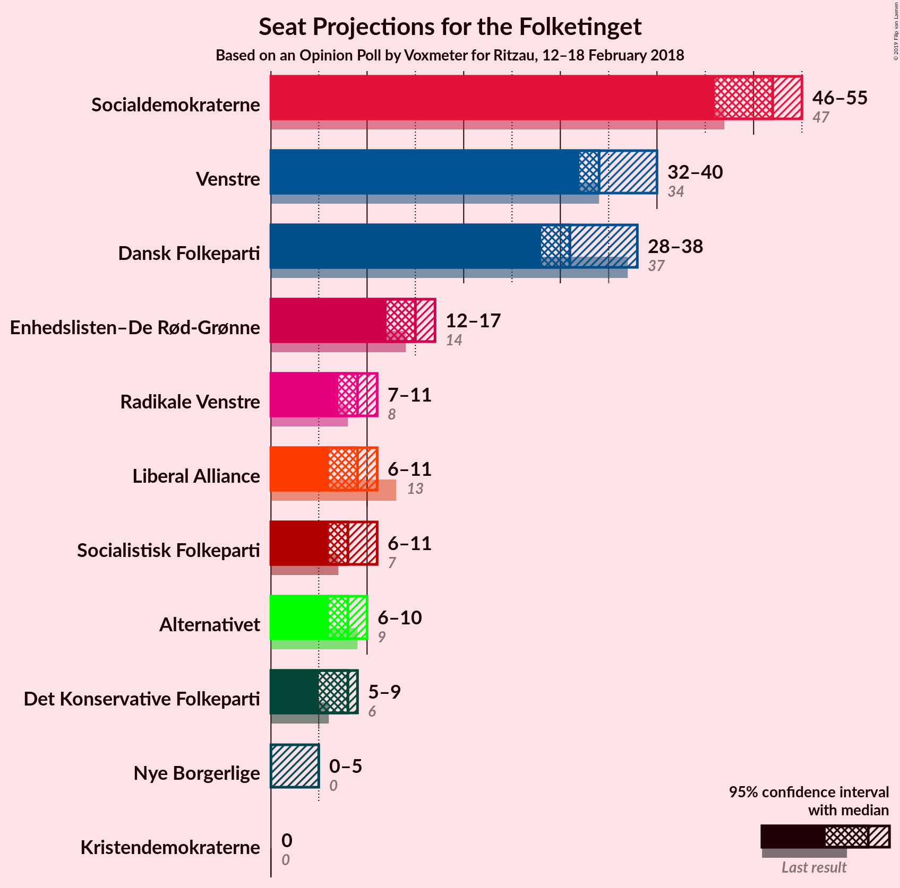
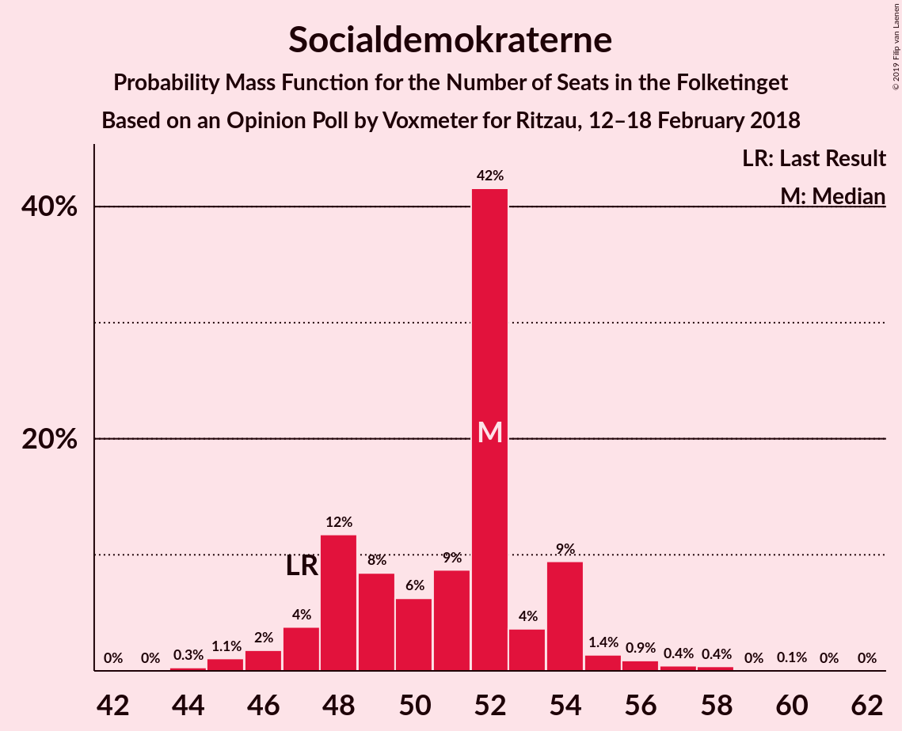

# Opinion Poll by Voxmeter for Ritzau, 12–18 February 2018

<a href="#voting-intentions">Voting Intentions</a> | <a href="#seats">Seats</a> | <a href="#coalitions">Coalitions</a> | <a href="#technical-information">Technical Information</a>

## Voting Intentions

### Confidence Intervals

| Party | Last Result | Poll Result | 80% Confidence Interval | 90% Confidence Interval | 95% Confidence Interval | 99% Confidence Interval |
|:-----:|:-----------:|:-----------:|:-----------------------:|:-----------------------:|:-----------------------:|:-----------------------:|
| Socialdemokraterne | 26.3% | 28.4% | 26.6–30.2% |26.1–30.7% |25.7–31.2% |24.9–32.1% |
| Venstre | 19.5% | 20.0% | 18.4–21.7% |18.0–22.1% |17.6–22.5% |16.9–23.4% |
| Dansk Folkeparti | 21.1% | 18.2% | 16.8–19.9% |16.3–20.3% |16.0–20.7% |15.3–21.5% |
| Enhedslisten–De Rød-Grønne | 7.8% | 8.2% | 7.2–9.4% |6.9–9.7% |6.7–10.0% |6.2–10.6% |
| Radikale Venstre | 4.6% | 5.0% | 4.2–6.0% |4.0–6.2% |3.8–6.5% |3.5–7.0% |
| Liberal Alliance | 7.5% | 4.8% | 4.0–5.7% |3.8–6.0% |3.6–6.3% |3.3–6.8% |
| Socialistisk Folkeparti | 4.2% | 4.5% | 3.7–5.4% |3.6–5.7% |3.4–5.9% |3.0–6.4% |
| Alternativet | 4.8% | 4.1% | 3.4–5.0% |3.2–5.3% |3.0–5.5% |2.7–6.0% |
| Det Konservative Folkeparti | 3.4% | 4.0% | 3.3–4.9% |3.1–5.2% |3.0–5.4% |2.7–5.9% |
| Nye Borgerlige | 0.0% | 1.5% | 1.1–2.1% |1.0–2.2% |0.9–2.4% |0.7–2.7% |
| Kristendemokraterne | 0.8% | 0.9% | 0.6–1.4% |0.5–1.5% |0.5–1.7% |0.4–2.0% |

*Note:* The poll result column reflects the actual value used in the calculations. Published results may vary slightly, and in addition be rounded to fewer digits.

## Seats

### Confidence Intervals

| Party | Last Result | Median | 80% Confidence Interval | 90% Confidence Interval | 95% Confidence Interval | 99% Confidence Interval |
|:-----:|:-----------:|:------:|:-----------------------:|:-----------------------:|:-----------------------:|:-----------------------:|
| <a href="#socialdemokraterne">Socialdemokraterne</a> | 47 | 48 | 47–49 |46–49 |46–49 |46–52 |
| <a href="#venstre">Venstre</a> | 34 | 38 | 37–39 |35–39 |35–39 |33–39 |
| <a href="#dansk-folkeparti">Dansk Folkeparti</a> | 37 | 32 | 29–35 |29–35 |29–35 |29–35 |
| <a href="#enhedslisten–de-rød-grønne">Enhedslisten–De Rød-Grønne</a> | 14 | 15 | 14–16 |14–19 |14–19 |13–19 |
| <a href="#radikale-venstre">Radikale Venstre</a> | 8 | 7 | 5–8 |5–9 |5–9 |5–9 |
| <a href="#liberal-alliance">Liberal Alliance</a> | 13 | 10 | 10–12 |7–12 |7–12 |7–12 |
| <a href="#socialistisk-folkeparti">Socialistisk Folkeparti</a> | 7 | 10 | 7–13 |7–13 |7–13 |7–13 |
| <a href="#alternativet">Alternativet</a> | 9 | 8 | 6–10 |6–10 |6–10 |6–10 |
| <a href="#det-konservative-folkeparti">Det Konservative Folkeparti</a> | 6 | 6 | 6–11 |5–11 |5–11 |5–11 |
| <a href="#nye-borgerlige">Nye Borgerlige</a> | 0 | 0 | 0 |0–6 |0–6 |0–6 |
| <a href="#kristendemokraterne">Kristendemokraterne</a> | 0 | 0 | 0 |0 |0 |0 |

### Socialdemokraterne

*For a full overview of the results for this party, see the [Socialdemokraterne](party-socialdemokraterne.html) page.*

| Number of Seats | Probability | Accumulated | Special Marks |
|:---------------:|:-----------:|:-----------:|:-------------:|
| 46 | 8% | 100% |  |
| 47 | 19% | 92% | Last Result |
| 48 | 44% | 73% | Median |
| 49 | 29% | 29% |  |
| 50 | 0% | 0.6% |  |
| 51 | 0.1% | 0.6% |  |
| 52 | 0.5% | 0.5% |  |
| 53 | 0% | 0.1% |  |
| 54 | 0% | 0% |  |

### Venstre

*For a full overview of the results for this party, see the [Venstre](party-venstre.html) page.*

| Number of Seats | Probability | Accumulated | Special Marks |
|:---------------:|:-----------:|:-----------:|:-------------:|
| 30 | 0.5% | 100% |  |
| 31 | 0% | 99.5% |  |
| 32 | 0% | 99.5% |  |
| 33 | 0% | 99.5% |  |
| 34 | 0% | 99.5% | Last Result |
| 35 | 8% | 99.5% |  |
| 36 | 0.1% | 92% |  |
| 37 | 19% | 91% |  |
| 38 | 44% | 72% | Median |
| 39 | 29% | 29% |  |
| 40 | 0% | 0% |  |

### Dansk Folkeparti

*For a full overview of the results for this party, see the [Dansk Folkeparti](party-danskfolkeparti.html) page.*

| Number of Seats | Probability | Accumulated | Special Marks |
|:---------------:|:-----------:|:-----------:|:-------------:|
| 29 | 48% | 100% |  |
| 30 | 0% | 52% |  |
| 31 | 0.5% | 52% |  |
| 32 | 8% | 52% | Median |
| 33 | 0% | 44% |  |
| 34 | 0.1% | 44% |  |
| 35 | 44% | 44% |  |
| 36 | 0% | 0% |  |
| 37 | 0% | 0% | Last Result |

### Enhedslisten–De Rød-Grønne

*For a full overview of the results for this party, see the [Enhedslisten–De Rød-Grønne](party-enhedslisten–derød-grønne.html) page.*

| Number of Seats | Probability | Accumulated | Special Marks |
|:---------------:|:-----------:|:-----------:|:-------------:|
| 12 | 0.1% | 100% |  |
| 13 | 0.5% | 99.9% |  |
| 14 | 29% | 99.4% | Last Result |
| 15 | 44% | 71% | Median |
| 16 | 19% | 27% |  |
| 17 | 0% | 8% |  |
| 18 | 0% | 8% |  |
| 19 | 8% | 8% |  |
| 20 | 0% | 0% |  |

### Radikale Venstre

*For a full overview of the results for this party, see the [Radikale Venstre](party-radikalevenstre.html) page.*

| Number of Seats | Probability | Accumulated | Special Marks |
|:---------------:|:-----------:|:-----------:|:-------------:|
| 5 | 44% | 100% |  |
| 6 | 0% | 56% |  |
| 7 | 29% | 56% | Median |
| 8 | 19% | 28% | Last Result |
| 9 | 8% | 8% |  |
| 10 | 0.1% | 0.1% |  |
| 11 | 0% | 0% |  |

### Liberal Alliance

*For a full overview of the results for this party, see the [Liberal Alliance](party-liberalalliance.html) page.*

| Number of Seats | Probability | Accumulated | Special Marks |
|:---------------:|:-----------:|:-----------:|:-------------:|
| 7 | 8% | 100% |  |
| 8 | 0% | 92% |  |
| 9 | 0% | 92% |  |
| 10 | 48% | 92% | Median |
| 11 | 0.5% | 44% |  |
| 12 | 44% | 44% |  |
| 13 | 0% | 0% | Last Result |

### Socialistisk Folkeparti

*For a full overview of the results for this party, see the [Socialistisk Folkeparti](party-socialistiskfolkeparti.html) page.*

| Number of Seats | Probability | Accumulated | Special Marks |
|:---------------:|:-----------:|:-----------:|:-------------:|
| 5 | 0.1% | 100% |  |
| 6 | 0% | 99.9% |  |
| 7 | 19% | 99.9% | Last Result |
| 8 | 8% | 80% |  |
| 9 | 0% | 72% |  |
| 10 | 44% | 72% | Median |
| 11 | 0% | 29% |  |
| 12 | 0% | 29% |  |
| 13 | 29% | 29% |  |
| 14 | 0% | 0% |  |

### Alternativet

*For a full overview of the results for this party, see the [Alternativet](party-alternativet.html) page.*

| Number of Seats | Probability | Accumulated | Special Marks |
|:---------------:|:-----------:|:-----------:|:-------------:|
| 6 | 44% | 100% |  |
| 7 | 0.5% | 56% |  |
| 8 | 37% | 56% | Median |
| 9 | 0% | 19% | Last Result |
| 10 | 19% | 19% |  |
| 11 | 0% | 0% |  |

### Det Konservative Folkeparti

*For a full overview of the results for this party, see the [Det Konservative Folkeparti](party-detkonservativefolkeparti.html) page.*

| Number of Seats | Probability | Accumulated | Special Marks |
|:---------------:|:-----------:|:-----------:|:-------------:|
| 5 | 8% | 100% |  |
| 6 | 72% | 92% | Last Result, Median |
| 7 | 0% | 19% |  |
| 8 | 0% | 19% |  |
| 9 | 0% | 19% |  |
| 10 | 0.5% | 19% |  |
| 11 | 19% | 19% |  |
| 12 | 0% | 0% |  |

### Nye Borgerlige

*For a full overview of the results for this party, see the [Nye Borgerlige](party-nyeborgerlige.html) page.*

| Number of Seats | Probability | Accumulated | Special Marks |
|:---------------:|:-----------:|:-----------:|:-------------:|
| 0 | 91% | 100% | Last Result, Median |
| 1 | 0% | 9% |  |
| 2 | 0% | 9% |  |
| 3 | 0% | 9% |  |
| 4 | 0% | 9% |  |
| 5 | 0% | 9% |  |
| 6 | 9% | 9% |  |
| 7 | 0% | 0% |  |

### Kristendemokraterne

*For a full overview of the results for this party, see the [Kristendemokraterne](party-kristendemokraterne.html) page.*

| Number of Seats | Probability | Accumulated | Special Marks |
|:---------------:|:-----------:|:-----------:|:-------------:|
| 0 | 100% | 100% | Last Result, Median |

## Coalitions

### Confidence Intervals

| Coalition | Last Result | Median | Majority? | 80% Confidence Interval | 90% Confidence Interval | 95% Confidence Interval | 99% Confidence Interval |
|:---------:|:-----------:|:------:|:---------:|:-----------------------:|:-----------------------:|:-----------------------:|:-----------------------:|
| Socialdemokraterne – Enhedslisten–De Rød-Grønne – Radikale Venstre – Socialistisk Folkeparti – Alternativet | 85 | 88 | 37% | 84–91 | 84–91 | 84–91 | 84–91 |
| Venstre – Dansk Folkeparti – Liberal Alliance – Det Konservative Folkeparti – Nye Borgerlige – Kristendemokraterne | 90 | 87 | 44% | 84–91 | 84–91 | 84–91 | 84–91 |
| Venstre – Dansk Folkeparti – Liberal Alliance – Det Konservative Folkeparti – Nye Borgerlige | 90 | 87 | 44% | 84–91 | 84–91 | 84–91 | 84–91 |
| Venstre – Dansk Folkeparti – Liberal Alliance – Det Konservative Folkeparti – Kristendemokraterne | 90 | 87 | 44% | 84–91 | 79–91 | 79–91 | 79–91 |
| Venstre – Dansk Folkeparti – Liberal Alliance – Det Konservative Folkeparti | 90 | 87 | 44% | 84–91 | 79–91 | 79–91 | 79–91 |
| Socialdemokraterne – Enhedslisten–De Rød-Grønne – Radikale Venstre – Socialistisk Folkeparti | 76 | 78 | 0% | 78–83 | 78–83 | 78–83 | 78–83 |

### Socialdemokraterne – Enhedslisten–De Rød-Grønne – Radikale Venstre – Socialistisk Folkeparti – Alternativet

| Number of Seats | Probability | Accumulated | Special Marks |
|:---------------:|:-----------:|:-----------:|:-------------:|
| 84 | 44% | 100% |  |
| 85 | 0% | 56% | Last Result |
| 86 | 0% | 56% |  |
| 87 | 0.5% | 56% |  |
| 88 | 19% | 56% | Median |
| 89 | 0% | 37% |  |
| 90 | 8% | 37% | Majority |
| 91 | 29% | 29% |  |
| 92 | 0% | 0.1% |  |
| 93 | 0% | 0.1% |  |
| 94 | 0% | 0% |  |

### Venstre – Dansk Folkeparti – Liberal Alliance – Det Konservative Folkeparti – Nye Borgerlige – Kristendemokraterne

| Number of Seats | Probability | Accumulated | Special Marks |
|:---------------:|:-----------:|:-----------:|:-------------:|
| 82 | 0% | 100% |  |
| 83 | 0% | 99.9% |  |
| 84 | 29% | 99.9% |  |
| 85 | 8% | 71% |  |
| 86 | 0% | 63% | Median |
| 87 | 19% | 63% |  |
| 88 | 0.5% | 44% |  |
| 89 | 0% | 44% |  |
| 90 | 0% | 44% | Last Result, Majority |
| 91 | 44% | 44% |  |
| 92 | 0% | 0% |  |

### Venstre – Dansk Folkeparti – Liberal Alliance – Det Konservative Folkeparti – Nye Borgerlige

| Number of Seats | Probability | Accumulated | Special Marks |
|:---------------:|:-----------:|:-----------:|:-------------:|
| 82 | 0% | 100% |  |
| 83 | 0% | 99.9% |  |
| 84 | 29% | 99.9% |  |
| 85 | 8% | 71% |  |
| 86 | 0% | 63% | Median |
| 87 | 19% | 63% |  |
| 88 | 0.5% | 44% |  |
| 89 | 0% | 44% |  |
| 90 | 0% | 44% | Last Result, Majority |
| 91 | 44% | 44% |  |
| 92 | 0% | 0% |  |

### Venstre – Dansk Folkeparti – Liberal Alliance – Det Konservative Folkeparti – Kristendemokraterne

| Number of Seats | Probability | Accumulated | Special Marks |
|:---------------:|:-----------:|:-----------:|:-------------:|
| 79 | 8% | 100% |  |
| 80 | 0% | 92% |  |
| 81 | 0% | 92% |  |
| 82 | 0.5% | 92% |  |
| 83 | 0% | 92% |  |
| 84 | 29% | 92% |  |
| 85 | 0.1% | 63% |  |
| 86 | 0% | 63% | Median |
| 87 | 19% | 63% |  |
| 88 | 0% | 44% |  |
| 89 | 0% | 44% |  |
| 90 | 0% | 44% | Last Result, Majority |
| 91 | 44% | 44% |  |
| 92 | 0% | 0% |  |

### Venstre – Dansk Folkeparti – Liberal Alliance – Det Konservative Folkeparti

| Number of Seats | Probability | Accumulated | Special Marks |
|:---------------:|:-----------:|:-----------:|:-------------:|
| 79 | 8% | 100% |  |
| 80 | 0% | 92% |  |
| 81 | 0% | 92% |  |
| 82 | 0.5% | 92% |  |
| 83 | 0% | 92% |  |
| 84 | 29% | 92% |  |
| 85 | 0.1% | 63% |  |
| 86 | 0% | 63% | Median |
| 87 | 19% | 63% |  |
| 88 | 0% | 44% |  |
| 89 | 0% | 44% |  |
| 90 | 0% | 44% | Last Result, Majority |
| 91 | 44% | 44% |  |
| 92 | 0% | 0% |  |

### Socialdemokraterne – Enhedslisten–De Rød-Grønne – Radikale Venstre – Socialistisk Folkeparti

| Number of Seats | Probability | Accumulated | Special Marks |
|:---------------:|:-----------:|:-----------:|:-------------:|
| 76 | 0% | 100% | Last Result |
| 77 | 0% | 100% |  |
| 78 | 63% | 100% |  |
| 79 | 0% | 37% |  |
| 80 | 0.5% | 37% | Median |
| 81 | 0% | 37% |  |
| 82 | 8% | 37% |  |
| 83 | 29% | 29% |  |
| 84 | 0% | 0.1% |  |
| 85 | 0% | 0% |  |

## Technical Information

### Opinion Poll

+ **Polling firm:** Voxmeter
+ **Commissioner(s):** Ritzau
+ **Fieldwork period:** 12–18 February 2018

### Calculations

+ **Sample size:** 1026
+ **Simulations done:** 1,024
+ **Error estimate:** 3.72%

