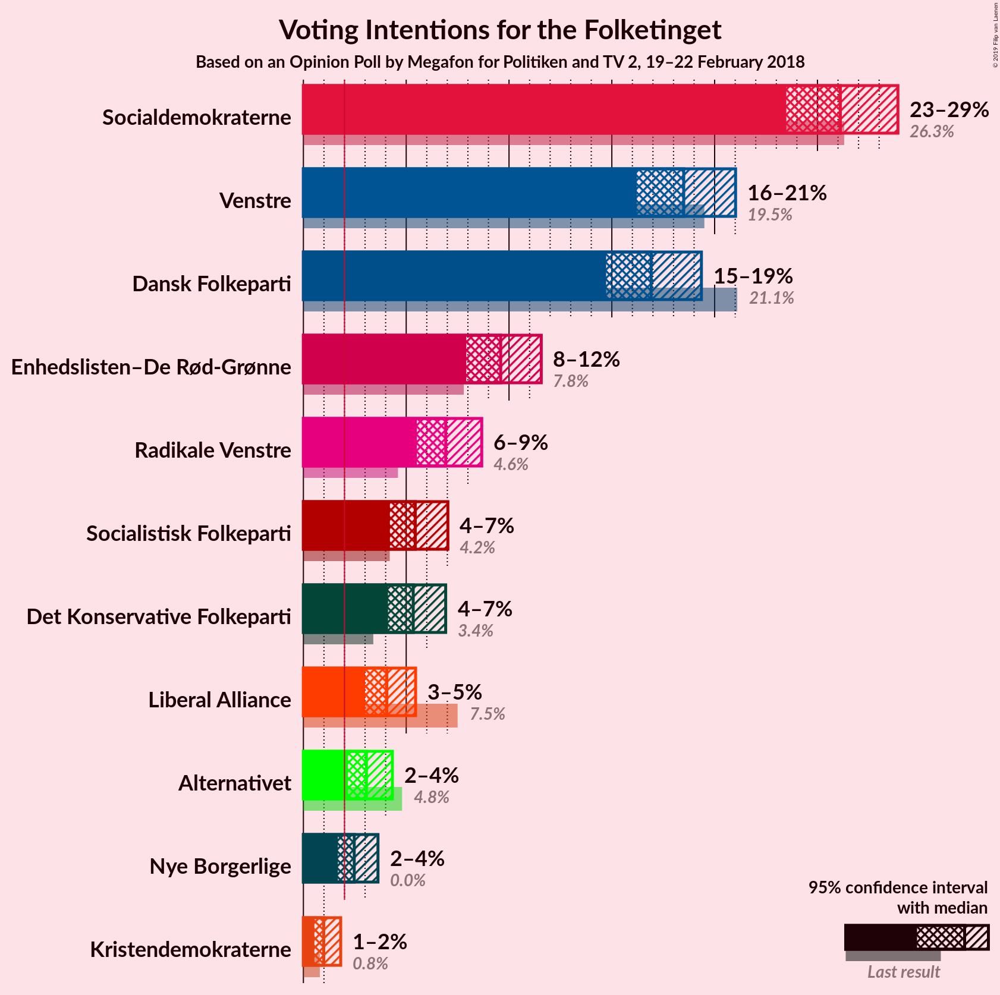
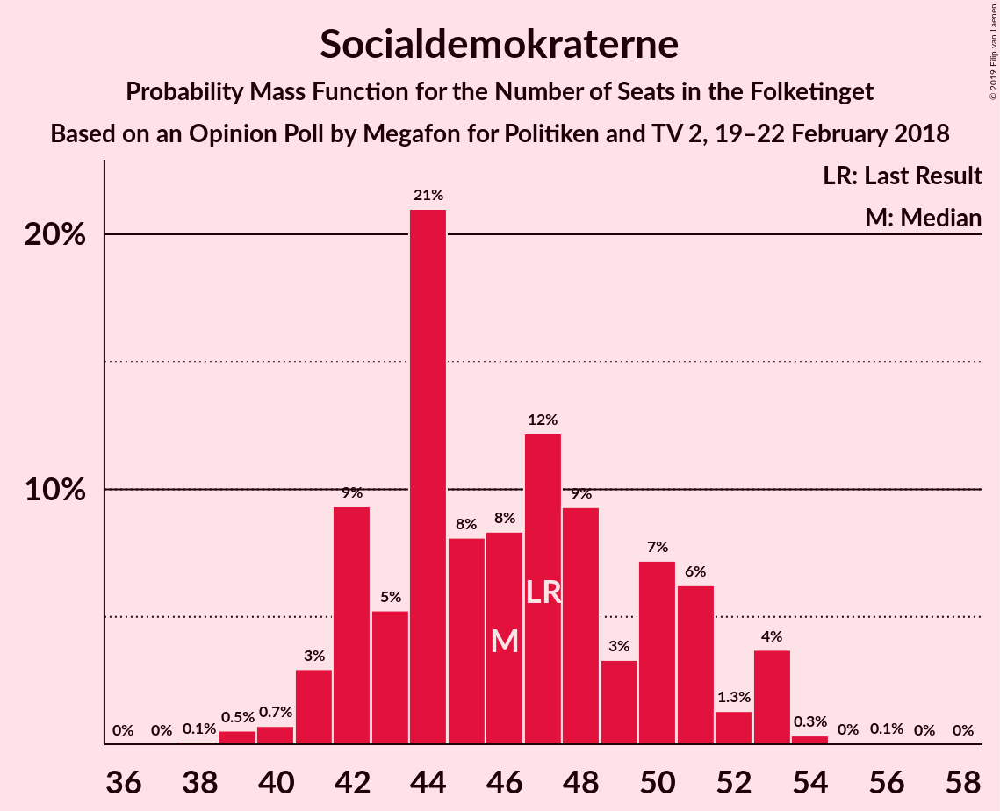
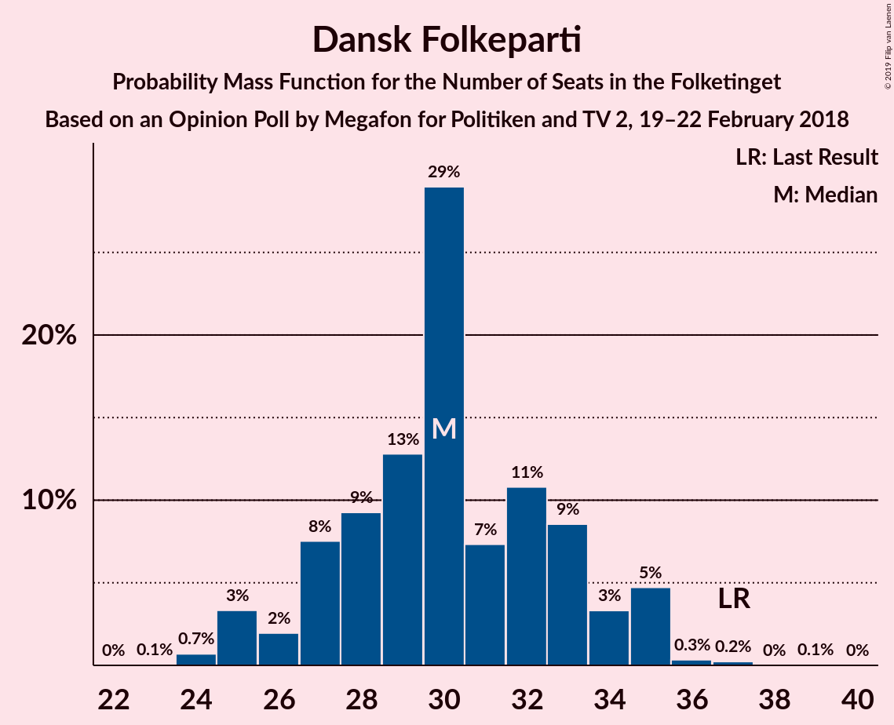
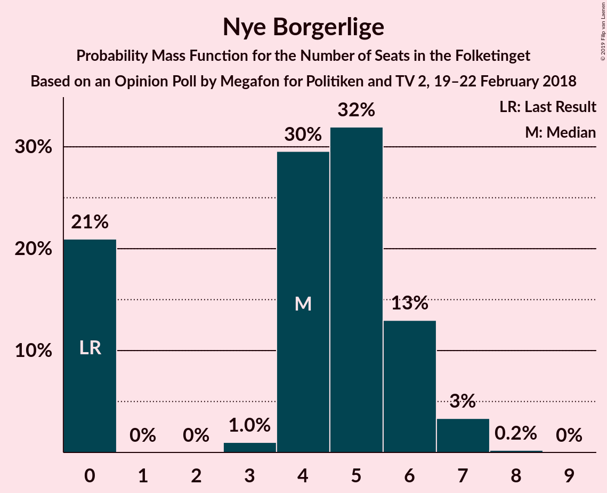
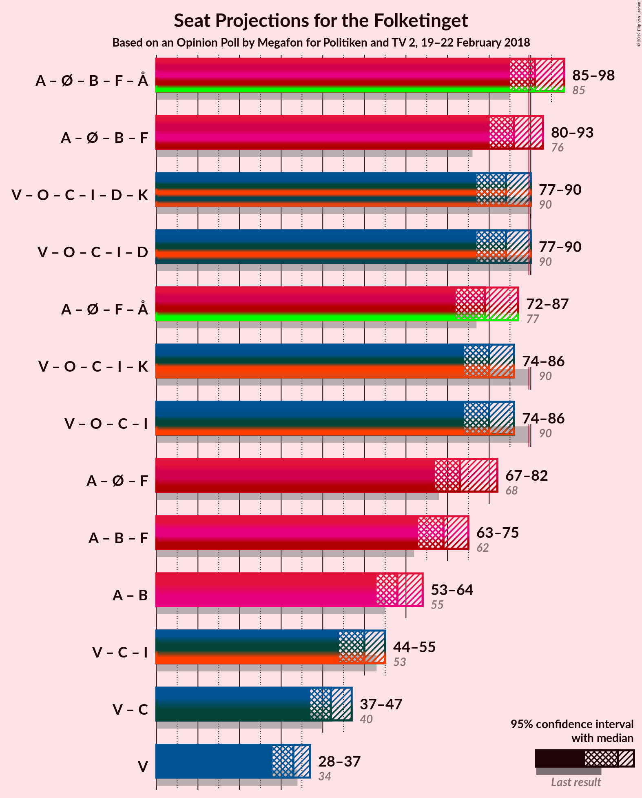

# Opinion Poll by Megafon for Politiken and TV 2, 19–22 February 2018

<a href="#voting-intentions">Voting Intentions</a> | <a href="#seats">Seats</a> | <a href="#coalitions">Coalitions</a> | <a href="#technical-information">Technical Information</a>

## Voting Intentions

### Confidence Intervals

| Party | Last Result | Poll Result | 80% Confidence Interval | 90% Confidence Interval | 95% Confidence Interval | 99% Confidence Interval |
|:-----:|:-----------:|:-----------:|:-----------------------:|:-----------------------:|:-----------------------:|:-----------------------:|
| Socialdemokraterne | 26.3% | 26.1% | 24.4–28.0% |23.9–28.5% |23.5–28.9% |22.7–29.8% |
| Venstre | 19.5% | 18.5% | 17.0–20.1% |16.6–20.6% |16.2–21.0% |15.5–21.8% |
| Dansk Folkeparti | 21.1% | 16.9% | 15.5–18.5% |15.1–19.0% |14.7–19.4% |14.1–20.1% |
| Enhedslisten–De Rød-Grønne | 7.8% | 9.6% | 8.5–10.9% |8.2–11.2% |7.9–11.6% |7.4–12.2% |
| Radikale Venstre | 4.6% | 6.9% | 6.0–8.1% |5.7–8.4% |5.5–8.7% |5.1–9.2% |
| Socialistisk Folkeparti | 4.2% | 5.4% | 4.6–6.5% |4.4–6.8% |4.2–7.0% |3.8–7.5% |
| Det Konservative Folkeparti | 3.4% | 5.3% | 4.5–6.4% |4.3–6.7% |4.1–6.9% |3.7–7.4% |
| Liberal Alliance | 7.5% | 4.1% | 3.4–5.0% |3.2–5.2% |3.0–5.5% |2.7–5.9% |
| Alternativet | 4.8% | 3.1% | 2.5–3.9% |2.3–4.1% |2.2–4.3% |1.9–4.8% |
| Nye Borgerlige | 0.0% | 2.5% | 2.0–3.2% |1.8–3.4% |1.7–3.6% |1.5–4.0% |
| Kristendemokraterne | 0.8% | 1.0% | 0.7–1.5% |0.6–1.7% |0.5–1.8% |0.4–2.1% |

*Note:* The poll result column reflects the actual value used in the calculations. Published results may vary slightly, and in addition be rounded to fewer digits.

## Seats

### Confidence Intervals

| Party | Last Result | Median | 80% Confidence Interval | 90% Confidence Interval | 95% Confidence Interval | 99% Confidence Interval |
|:-----:|:-----------:|:------:|:-----------------------:|:-----------------------:|:-----------------------:|:-----------------------:|
| <a href="#socialdemokraterne">Socialdemokraterne</a> | 47 | 47 | 41–48 |41–50 |39–51 |39–54 |
| <a href="#venstre">Venstre</a> | 34 | 32 | 28–36 |28–38 |28–40 |28–41 |
| <a href="#dansk-folkeparti">Dansk Folkeparti</a> | 37 | 29 | 27–33 |26–34 |25–34 |25–35 |
| <a href="#enhedslisten–de-rød-grønne">Enhedslisten–De Rød-Grønne</a> | 14 | 18 | 16–20 |15–20 |15–21 |14–22 |
| <a href="#radikale-venstre">Radikale Venstre</a> | 8 | 12 | 10–14 |10–14 |10–15 |10–17 |
| <a href="#socialistisk-folkeparti">Socialistisk Folkeparti</a> | 7 | 11 | 8–13 |8–13 |7–13 |7–14 |
| <a href="#det-konservative-folkeparti">Det Konservative Folkeparti</a> | 6 | 10 | 7–12 |7–12 |7–12 |7–12 |
| <a href="#liberal-alliance">Liberal Alliance</a> | 13 | 8 | 6–9 |5–10 |5–10 |5–11 |
| <a href="#alternativet">Alternativet</a> | 9 | 5 | 4–7 |4–8 |4–8 |0–9 |
| <a href="#nye-borgerlige">Nye Borgerlige</a> | 0 | 5 | 0–5 |0–6 |0–6 |0–7 |
| <a href="#kristendemokraterne">Kristendemokraterne</a> | 0 | 0 | 0 |0 |0 |0 |

### Socialdemokraterne

*For a full overview of the results for this party, see the [Socialdemokraterne](party-socialdemokraterne.html) page.*

| Number of Seats | Probability | Accumulated | Special Marks |
|:---------------:|:-----------:|:-----------:|:-------------:|
| 38 | 0.1% | 100% |  |
| 39 | 2% | 99.9% |  |
| 40 | 0.1% | 97% |  |
| 41 | 11% | 97% |  |
| 42 | 3% | 87% |  |
| 43 | 0.2% | 84% |  |
| 44 | 7% | 84% |  |
| 45 | 15% | 77% |  |
| 46 | 4% | 62% |  |
| 47 | 34% | 58% | Last Result, Median |
| 48 | 15% | 24% |  |
| 49 | 2% | 10% |  |
| 50 | 5% | 8% |  |
| 51 | 0.4% | 3% |  |
| 52 | 0.2% | 2% |  |
| 53 | 0.1% | 2% |  |
| 54 | 2% | 2% |  |
| 55 | 0% | 0% |  |

### Venstre

*For a full overview of the results for this party, see the [Venstre](party-venstre.html) page.*

| Number of Seats | Probability | Accumulated | Special Marks |
|:---------------:|:-----------:|:-----------:|:-------------:|
| 26 | 0% | 100% |  |
| 27 | 0.3% | 99.9% |  |
| 28 | 34% | 99.6% |  |
| 29 | 1.3% | 66% |  |
| 30 | 3% | 65% |  |
| 31 | 4% | 61% |  |
| 32 | 15% | 58% | Median |
| 33 | 17% | 42% |  |
| 34 | 5% | 25% | Last Result |
| 35 | 6% | 20% |  |
| 36 | 7% | 14% |  |
| 37 | 0.3% | 7% |  |
| 38 | 4% | 7% |  |
| 39 | 0.1% | 3% |  |
| 40 | 0.9% | 3% |  |
| 41 | 2% | 2% |  |
| 42 | 0% | 0% |  |

### Dansk Folkeparti

*For a full overview of the results for this party, see the [Dansk Folkeparti](party-danskfolkeparti.html) page.*

| Number of Seats | Probability | Accumulated | Special Marks |
|:---------------:|:-----------:|:-----------:|:-------------:|
| 24 | 0.1% | 100% |  |
| 25 | 4% | 99.9% |  |
| 26 | 2% | 95% |  |
| 27 | 4% | 93% |  |
| 28 | 7% | 90% |  |
| 29 | 37% | 82% | Median |
| 30 | 12% | 45% |  |
| 31 | 12% | 33% |  |
| 32 | 9% | 21% |  |
| 33 | 2% | 11% |  |
| 34 | 8% | 9% |  |
| 35 | 0.8% | 1.1% |  |
| 36 | 0% | 0.3% |  |
| 37 | 0% | 0.3% | Last Result |
| 38 | 0.1% | 0.3% |  |
| 39 | 0.2% | 0.2% |  |
| 40 | 0% | 0% |  |

### Enhedslisten–De Rød-Grønne

*For a full overview of the results for this party, see the [Enhedslisten–De Rød-Grønne](party-enhedslisten–derød-grønne.html) page.*

| Number of Seats | Probability | Accumulated | Special Marks |
|:---------------:|:-----------:|:-----------:|:-------------:|
| 12 | 0.1% | 100% |  |
| 13 | 0.4% | 99.9% |  |
| 14 | 2% | 99.5% | Last Result |
| 15 | 3% | 98% |  |
| 16 | 18% | 95% |  |
| 17 | 12% | 77% |  |
| 18 | 47% | 65% | Median |
| 19 | 7% | 18% |  |
| 20 | 6% | 10% |  |
| 21 | 4% | 4% |  |
| 22 | 0.5% | 0.5% |  |
| 23 | 0% | 0% |  |

### Radikale Venstre

*For a full overview of the results for this party, see the [Radikale Venstre](party-radikalevenstre.html) page.*

| Number of Seats | Probability | Accumulated | Special Marks |
|:---------------:|:-----------:|:-----------:|:-------------:|
| 8 | 0.3% | 100% | Last Result |
| 9 | 0.2% | 99.7% |  |
| 10 | 12% | 99.5% |  |
| 11 | 21% | 88% |  |
| 12 | 38% | 67% | Median |
| 13 | 17% | 29% |  |
| 14 | 9% | 12% |  |
| 15 | 0.6% | 3% |  |
| 16 | 1.0% | 2% |  |
| 17 | 1.4% | 1.4% |  |
| 18 | 0% | 0% |  |

### Socialistisk Folkeparti

*For a full overview of the results for this party, see the [Socialistisk Folkeparti](party-socialistiskfolkeparti.html) page.*

| Number of Seats | Probability | Accumulated | Special Marks |
|:---------------:|:-----------:|:-----------:|:-------------:|
| 6 | 0.2% | 100% |  |
| 7 | 3% | 99.8% | Last Result |
| 8 | 8% | 97% |  |
| 9 | 7% | 89% |  |
| 10 | 18% | 82% |  |
| 11 | 49% | 64% | Median |
| 12 | 1.5% | 16% |  |
| 13 | 13% | 14% |  |
| 14 | 0.6% | 0.7% |  |
| 15 | 0% | 0% |  |

### Det Konservative Folkeparti

*For a full overview of the results for this party, see the [Det Konservative Folkeparti](party-detkonservativefolkeparti.html) page.*

| Number of Seats | Probability | Accumulated | Special Marks |
|:---------------:|:-----------:|:-----------:|:-------------:|
| 6 | 0.1% | 100% | Last Result |
| 7 | 12% | 99.9% |  |
| 8 | 15% | 88% |  |
| 9 | 16% | 73% |  |
| 10 | 8% | 56% | Median |
| 11 | 12% | 49% |  |
| 12 | 36% | 37% |  |
| 13 | 0.4% | 0.5% |  |
| 14 | 0.1% | 0.1% |  |
| 15 | 0% | 0% |  |

### Liberal Alliance

*For a full overview of the results for this party, see the [Liberal Alliance](party-liberalalliance.html) page.*

| Number of Seats | Probability | Accumulated | Special Marks |
|:---------------:|:-----------:|:-----------:|:-------------:|
| 4 | 0.2% | 100% |  |
| 5 | 8% | 99.8% |  |
| 6 | 9% | 92% |  |
| 7 | 18% | 83% |  |
| 8 | 18% | 66% | Median |
| 9 | 40% | 47% |  |
| 10 | 6% | 7% |  |
| 11 | 0.5% | 0.6% |  |
| 12 | 0.1% | 0.1% |  |
| 13 | 0% | 0% | Last Result |

### Alternativet

*For a full overview of the results for this party, see the [Alternativet](party-alternativet.html) page.*

| Number of Seats | Probability | Accumulated | Special Marks |
|:---------------:|:-----------:|:-----------:|:-------------:|
| 0 | 1.0% | 100% |  |
| 1 | 0% | 99.0% |  |
| 2 | 0% | 99.0% |  |
| 3 | 0% | 99.0% |  |
| 4 | 47% | 99.0% |  |
| 5 | 21% | 52% | Median |
| 6 | 15% | 31% |  |
| 7 | 11% | 16% |  |
| 8 | 5% | 5% |  |
| 9 | 0.6% | 0.6% | Last Result |
| 10 | 0% | 0% |  |

### Nye Borgerlige

*For a full overview of the results for this party, see the [Nye Borgerlige](party-nyeborgerlige.html) page.*

| Number of Seats | Probability | Accumulated | Special Marks |
|:---------------:|:-----------:|:-----------:|:-------------:|
| 0 | 12% | 100% | Last Result |
| 1 | 0% | 88% |  |
| 2 | 0% | 88% |  |
| 3 | 3% | 88% |  |
| 4 | 25% | 85% |  |
| 5 | 55% | 61% | Median |
| 6 | 5% | 6% |  |
| 7 | 0.5% | 0.6% |  |
| 8 | 0.1% | 0.1% |  |
| 9 | 0% | 0% |  |

### Kristendemokraterne

*For a full overview of the results for this party, see the [Kristendemokraterne](party-kristendemokraterne.html) page.*

| Number of Seats | Probability | Accumulated | Special Marks |
|:---------------:|:-----------:|:-----------:|:-------------:|
| 0 | 99.7% | 100% | Last Result, Median |
| 1 | 0% | 0.3% |  |
| 2 | 0% | 0.3% |  |
| 3 | 0% | 0.3% |  |
| 4 | 0.3% | 0.3% |  |
| 5 | 0% | 0% |  |

## Coalitions

### Confidence Intervals

| Coalition | Last Result | Median | Majority? | 80% Confidence Interval | 90% Confidence Interval | 95% Confidence Interval | 99% Confidence Interval |
|:---------:|:-----------:|:------:|:---------:|:-----------------------:|:-----------------------:|:-----------------------:|:-----------------------:|
| Socialdemokraterne – Enhedslisten–De Rød-Grønne – Radikale Venstre – Socialistisk Folkeparti – Alternativet | 85 | 92 | 84% | 89–95 | 85–96 | 83–96 | 83–98 |
| Venstre – Dansk Folkeparti – Det Konservative Folkeparti – Liberal Alliance – Nye Borgerlige – Kristendemokraterne | 90 | 83 | 6% | 80–86 | 79–90 | 79–92 | 77–92 |
| Venstre – Dansk Folkeparti – Det Konservative Folkeparti – Liberal Alliance – Nye Borgerlige | 90 | 83 | 6% | 80–86 | 79–90 | 79–92 | 77–92 |
| Socialdemokraterne – Enhedslisten–De Rød-Grønne – Radikale Venstre – Socialistisk Folkeparti | 76 | 88 | 10% | 83–90 | 79–90 | 78–90 | 76–92 |
| Venstre – Dansk Folkeparti – Det Konservative Folkeparti – Liberal Alliance – Kristendemokraterne | 90 | 79 | 0% | 78–83 | 77–85 | 74–87 | 74–88 |
| Venstre – Dansk Folkeparti – Det Konservative Folkeparti – Liberal Alliance | 90 | 79 | 0% | 78–83 | 77–85 | 74–87 | 74–88 |
| Socialdemokraterne – Enhedslisten–De Rød-Grønne – Socialistisk Folkeparti – Alternativet | 77 | 80 | 0% | 78–81 | 72–85 | 72–85 | 71–86 |
| Socialdemokraterne – Enhedslisten–De Rød-Grønne – Socialistisk Folkeparti | 68 | 75 | 0% | 70–76 | 67–79 | 66–79 | 64–80 |
| Socialdemokraterne – Radikale Venstre – Socialistisk Folkeparti | 62 | 70 | 0% | 64–72 | 63–72 | 61–73 | 60–75 |
| Socialdemokraterne – Radikale Venstre | 55 | 59 | 0% | 54–60 | 52–64 | 52–65 | 51–66 |
| Venstre – Det Konservative Folkeparti – Liberal Alliance | 53 | 49 | 0% | 46–54 | 46–56 | 46–57 | 44–57 |
| Venstre – Det Konservative Folkeparti | 40 | 41 | 0% | 40–46 | 39–47 | 39–49 | 37–50 |
| Venstre | 34 | 32 | 0% | 28–36 | 28–38 | 28–40 | 28–41 |

### Socialdemokraterne – Enhedslisten–De Rød-Grønne – Radikale Venstre – Socialistisk Folkeparti – Alternativet

| Number of Seats | Probability | Accumulated | Special Marks |
|:---------------:|:-----------:|:-----------:|:-------------:|
| 82 | 0% | 100% |  |
| 83 | 3% | 99.9% |  |
| 84 | 1.0% | 97% |  |
| 85 | 2% | 96% | Last Result |
| 86 | 0.8% | 94% |  |
| 87 | 0.3% | 93% |  |
| 88 | 0.5% | 93% |  |
| 89 | 9% | 92% |  |
| 90 | 12% | 84% | Majority |
| 91 | 13% | 71% |  |
| 92 | 40% | 59% |  |
| 93 | 4% | 19% | Median |
| 94 | 3% | 15% |  |
| 95 | 5% | 11% |  |
| 96 | 5% | 6% |  |
| 97 | 0.4% | 0.9% |  |
| 98 | 0.1% | 0.5% |  |
| 99 | 0.1% | 0.4% |  |
| 100 | 0.3% | 0.3% |  |
| 101 | 0.1% | 0.1% |  |
| 102 | 0% | 0% |  |

### Venstre – Dansk Folkeparti – Det Konservative Folkeparti – Liberal Alliance – Nye Borgerlige – Kristendemokraterne

| Number of Seats | Probability | Accumulated | Special Marks |
|:---------------:|:-----------:|:-----------:|:-------------:|
| 74 | 0.1% | 100% |  |
| 75 | 0.3% | 99.9% |  |
| 76 | 0.1% | 99.7% |  |
| 77 | 0.1% | 99.6% |  |
| 78 | 0.4% | 99.5% |  |
| 79 | 5% | 99.1% |  |
| 80 | 5% | 94% |  |
| 81 | 3% | 89% |  |
| 82 | 4% | 85% |  |
| 83 | 40% | 81% |  |
| 84 | 13% | 41% | Median |
| 85 | 12% | 29% |  |
| 86 | 9% | 16% |  |
| 87 | 0.5% | 8% |  |
| 88 | 0.3% | 7% |  |
| 89 | 0.8% | 7% |  |
| 90 | 2% | 6% | Last Result, Majority |
| 91 | 1.0% | 4% |  |
| 92 | 3% | 3% |  |
| 93 | 0% | 0.1% |  |
| 94 | 0% | 0% |  |

### Venstre – Dansk Folkeparti – Det Konservative Folkeparti – Liberal Alliance – Nye Borgerlige

| Number of Seats | Probability | Accumulated | Special Marks |
|:---------------:|:-----------:|:-----------:|:-------------:|
| 74 | 0.1% | 100% |  |
| 75 | 0.3% | 99.9% |  |
| 76 | 0.1% | 99.7% |  |
| 77 | 0.1% | 99.6% |  |
| 78 | 0.4% | 99.5% |  |
| 79 | 5% | 99.1% |  |
| 80 | 5% | 94% |  |
| 81 | 3% | 89% |  |
| 82 | 4% | 85% |  |
| 83 | 40% | 81% |  |
| 84 | 12% | 41% | Median |
| 85 | 12% | 28% |  |
| 86 | 9% | 16% |  |
| 87 | 0.3% | 8% |  |
| 88 | 0.3% | 7% |  |
| 89 | 0.8% | 7% |  |
| 90 | 2% | 6% | Last Result, Majority |
| 91 | 1.0% | 4% |  |
| 92 | 3% | 3% |  |
| 93 | 0% | 0.1% |  |
| 94 | 0% | 0% |  |

### Socialdemokraterne – Enhedslisten–De Rød-Grønne – Radikale Venstre – Socialistisk Folkeparti

| Number of Seats | Probability | Accumulated | Special Marks |
|:---------------:|:-----------:|:-----------:|:-------------:|
| 76 | 0.9% | 100% | Last Result |
| 77 | 0.8% | 99.1% |  |
| 78 | 2% | 98% |  |
| 79 | 2% | 96% |  |
| 80 | 0.2% | 94% |  |
| 81 | 1.5% | 94% |  |
| 82 | 0.2% | 93% |  |
| 83 | 5% | 92% |  |
| 84 | 14% | 88% |  |
| 85 | 7% | 74% |  |
| 86 | 13% | 67% |  |
| 87 | 3% | 54% |  |
| 88 | 36% | 50% | Median |
| 89 | 4% | 15% |  |
| 90 | 9% | 10% | Majority |
| 91 | 0.3% | 1.3% |  |
| 92 | 0.6% | 1.1% |  |
| 93 | 0.2% | 0.5% |  |
| 94 | 0.2% | 0.2% |  |
| 95 | 0% | 0.1% |  |
| 96 | 0% | 0% |  |

### Venstre – Dansk Folkeparti – Det Konservative Folkeparti – Liberal Alliance – Kristendemokraterne

| Number of Seats | Probability | Accumulated | Special Marks |
|:---------------:|:-----------:|:-----------:|:-------------:|
| 71 | 0.2% | 100% |  |
| 72 | 0% | 99.8% |  |
| 73 | 0.2% | 99.8% |  |
| 74 | 2% | 99.6% |  |
| 75 | 0.5% | 97% |  |
| 76 | 2% | 97% |  |
| 77 | 3% | 95% |  |
| 78 | 38% | 92% |  |
| 79 | 13% | 54% | Median |
| 80 | 19% | 40% |  |
| 81 | 0.8% | 21% |  |
| 82 | 9% | 20% |  |
| 83 | 1.0% | 11% |  |
| 84 | 3% | 10% |  |
| 85 | 2% | 7% |  |
| 86 | 1.3% | 5% |  |
| 87 | 2% | 4% |  |
| 88 | 1.1% | 1.2% |  |
| 89 | 0% | 0.1% |  |
| 90 | 0% | 0% | Last Result, Majority |

### Venstre – Dansk Folkeparti – Det Konservative Folkeparti – Liberal Alliance

| Number of Seats | Probability | Accumulated | Special Marks |
|:---------------:|:-----------:|:-----------:|:-------------:|
| 71 | 0.2% | 100% |  |
| 72 | 0% | 99.8% |  |
| 73 | 0.2% | 99.8% |  |
| 74 | 2% | 99.6% |  |
| 75 | 0.5% | 97% |  |
| 76 | 2% | 97% |  |
| 77 | 3% | 95% |  |
| 78 | 38% | 92% |  |
| 79 | 13% | 54% | Median |
| 80 | 19% | 40% |  |
| 81 | 0.8% | 21% |  |
| 82 | 9% | 20% |  |
| 83 | 1.0% | 11% |  |
| 84 | 3% | 10% |  |
| 85 | 2% | 7% |  |
| 86 | 1.3% | 5% |  |
| 87 | 2% | 4% |  |
| 88 | 1.1% | 1.2% |  |
| 89 | 0% | 0.1% |  |
| 90 | 0% | 0% | Last Result, Majority |

### Socialdemokraterne – Enhedslisten–De Rød-Grønne – Socialistisk Folkeparti – Alternativet

| Number of Seats | Probability | Accumulated | Special Marks |
|:---------------:|:-----------:|:-----------:|:-------------:|
| 69 | 0.1% | 100% |  |
| 70 | 0.1% | 99.9% |  |
| 71 | 2% | 99.8% |  |
| 72 | 4% | 98% |  |
| 73 | 2% | 94% |  |
| 74 | 0.1% | 93% |  |
| 75 | 0.1% | 93% |  |
| 76 | 0.5% | 93% |  |
| 77 | 0.9% | 92% | Last Result |
| 78 | 10% | 91% |  |
| 79 | 22% | 81% |  |
| 80 | 47% | 59% |  |
| 81 | 6% | 12% | Median |
| 82 | 0.4% | 6% |  |
| 83 | 0.1% | 5% |  |
| 84 | 0.1% | 5% |  |
| 85 | 4% | 5% |  |
| 86 | 0.4% | 0.8% |  |
| 87 | 0.3% | 0.4% |  |
| 88 | 0.1% | 0.1% |  |
| 89 | 0% | 0% |  |

### Socialdemokraterne – Enhedslisten–De Rød-Grønne – Socialistisk Folkeparti

| Number of Seats | Probability | Accumulated | Special Marks |
|:---------------:|:-----------:|:-----------:|:-------------:|
| 63 | 0.1% | 100% |  |
| 64 | 0.9% | 99.9% |  |
| 65 | 0.2% | 99.0% |  |
| 66 | 2% | 98.8% |  |
| 67 | 3% | 97% |  |
| 68 | 0.7% | 94% | Last Result |
| 69 | 0.2% | 93% |  |
| 70 | 4% | 93% |  |
| 71 | 0.7% | 88% |  |
| 72 | 6% | 87% |  |
| 73 | 8% | 82% |  |
| 74 | 13% | 74% |  |
| 75 | 18% | 61% |  |
| 76 | 37% | 43% | Median |
| 77 | 0.3% | 6% |  |
| 78 | 0.8% | 6% |  |
| 79 | 5% | 5% |  |
| 80 | 0.1% | 0.6% |  |
| 81 | 0.3% | 0.4% |  |
| 82 | 0.1% | 0.1% |  |
| 83 | 0% | 0% |  |

### Socialdemokraterne – Radikale Venstre – Socialistisk Folkeparti

| Number of Seats | Probability | Accumulated | Special Marks |
|:---------------:|:-----------:|:-----------:|:-------------:|
| 60 | 1.1% | 100% |  |
| 61 | 2% | 98.9% |  |
| 62 | 1.0% | 97% | Last Result |
| 63 | 2% | 96% |  |
| 64 | 7% | 94% |  |
| 65 | 6% | 87% |  |
| 66 | 3% | 81% |  |
| 67 | 3% | 78% |  |
| 68 | 11% | 75% |  |
| 69 | 6% | 64% |  |
| 70 | 45% | 58% | Median |
| 71 | 0.6% | 13% |  |
| 72 | 9% | 12% |  |
| 73 | 0.6% | 3% |  |
| 74 | 0.7% | 2% |  |
| 75 | 1.2% | 2% |  |
| 76 | 0% | 0.3% |  |
| 77 | 0% | 0.3% |  |
| 78 | 0.3% | 0.3% |  |
| 79 | 0% | 0% |  |

### Socialdemokraterne – Radikale Venstre

| Number of Seats | Probability | Accumulated | Special Marks |
|:---------------:|:-----------:|:-----------:|:-------------:|
| 50 | 0% | 100% |  |
| 51 | 0.9% | 99.9% |  |
| 52 | 5% | 99.0% |  |
| 53 | 0.3% | 94% |  |
| 54 | 9% | 94% |  |
| 55 | 9% | 85% | Last Result |
| 56 | 5% | 76% |  |
| 57 | 4% | 71% |  |
| 58 | 8% | 68% |  |
| 59 | 48% | 59% | Median |
| 60 | 1.1% | 11% |  |
| 61 | 0.9% | 10% |  |
| 62 | 0.7% | 9% |  |
| 63 | 0.5% | 8% |  |
| 64 | 4% | 8% |  |
| 65 | 2% | 4% |  |
| 66 | 1.5% | 2% |  |
| 67 | 0.1% | 0.1% |  |
| 68 | 0% | 0% |  |

### Venstre – Det Konservative Folkeparti – Liberal Alliance

| Number of Seats | Probability | Accumulated | Special Marks |
|:---------------:|:-----------:|:-----------:|:-------------:|
| 41 | 0.1% | 100% |  |
| 42 | 0.1% | 99.9% |  |
| 43 | 0.1% | 99.8% |  |
| 44 | 0.4% | 99.7% |  |
| 45 | 0.4% | 99.3% |  |
| 46 | 10% | 98.9% |  |
| 47 | 8% | 89% |  |
| 48 | 5% | 81% |  |
| 49 | 39% | 76% |  |
| 50 | 8% | 37% | Median |
| 51 | 7% | 29% |  |
| 52 | 8% | 22% |  |
| 53 | 2% | 13% | Last Result |
| 54 | 5% | 11% |  |
| 55 | 0.2% | 6% |  |
| 56 | 2% | 6% |  |
| 57 | 3% | 3% |  |
| 58 | 0% | 0% |  |

### Venstre – Det Konservative Folkeparti

| Number of Seats | Probability | Accumulated | Special Marks |
|:---------------:|:-----------:|:-----------:|:-------------:|
| 35 | 0.2% | 100% |  |
| 36 | 0% | 99.8% |  |
| 37 | 0.5% | 99.8% |  |
| 38 | 0.4% | 99.2% |  |
| 39 | 9% | 98.8% |  |
| 40 | 40% | 90% | Last Result |
| 41 | 5% | 50% |  |
| 42 | 17% | 45% | Median |
| 43 | 3% | 28% |  |
| 44 | 12% | 25% |  |
| 45 | 0.8% | 12% |  |
| 46 | 6% | 12% |  |
| 47 | 0.6% | 5% |  |
| 48 | 1.4% | 5% |  |
| 49 | 1.1% | 3% |  |
| 50 | 2% | 2% |  |
| 51 | 0% | 0.1% |  |
| 52 | 0% | 0% |  |

### Venstre

| Number of Seats | Probability | Accumulated | Special Marks |
|:---------------:|:-----------:|:-----------:|:-------------:|
| 26 | 0% | 100% |  |
| 27 | 0.3% | 99.9% |  |
| 28 | 34% | 99.6% |  |
| 29 | 1.3% | 66% |  |
| 30 | 3% | 65% |  |
| 31 | 4% | 61% |  |
| 32 | 15% | 58% | Median |
| 33 | 17% | 42% |  |
| 34 | 5% | 25% | Last Result |
| 35 | 6% | 20% |  |
| 36 | 7% | 14% |  |
| 37 | 0.3% | 7% |  |
| 38 | 4% | 7% |  |
| 39 | 0.1% | 3% |  |
| 40 | 0.9% | 3% |  |
| 41 | 2% | 2% |  |
| 42 | 0% | 0% |  |

## Technical Information

### Opinion Poll

+ **Polling firm:** Megafon
+ **Commissioner(s):** Politiken and TV 2
+ **Fieldwork period:** 19–22 February 2018

### Calculations

+ **Sample size:** 1011
+ **Simulations done:** 131,072
+ **Error estimate:** 4.27%

