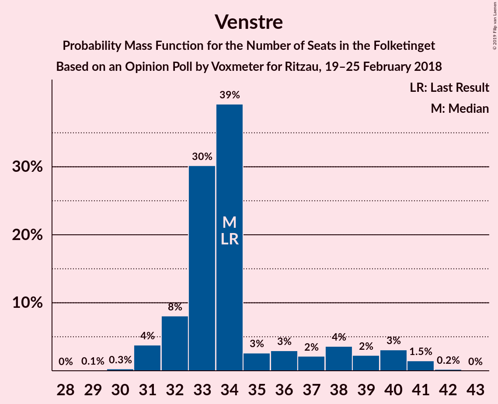
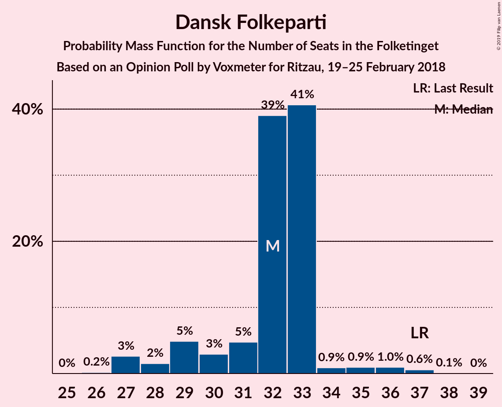
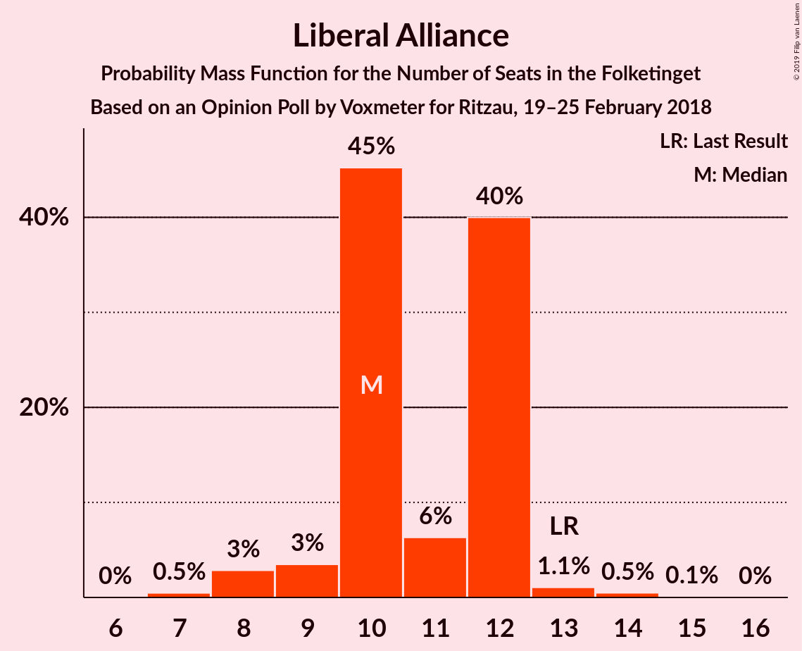
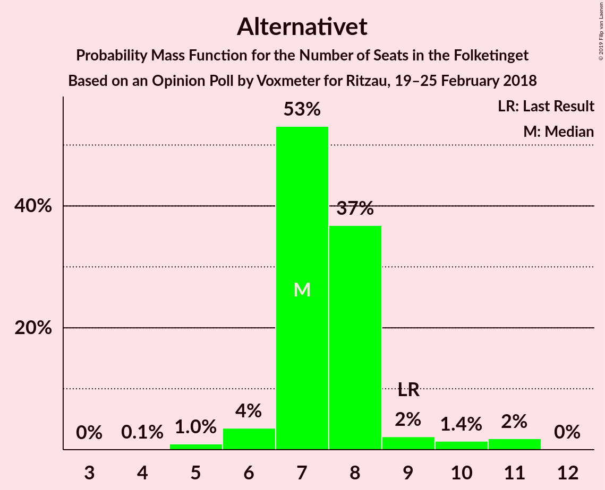
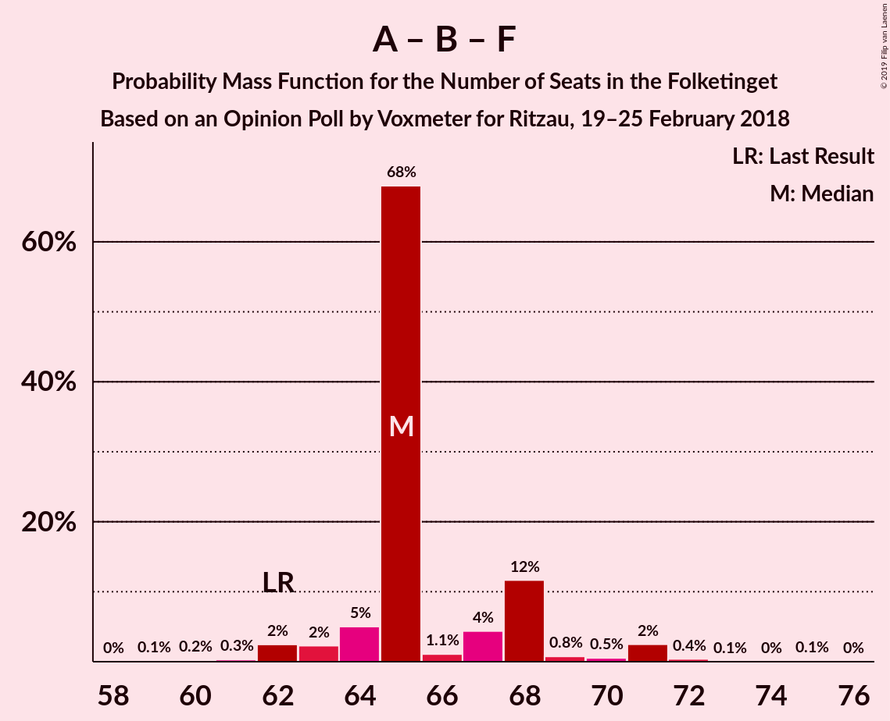

# Opinion Poll by Voxmeter for Ritzau, 19–25 February 2018

<a href="#voting-intentions">Voting Intentions</a> | <a href="#seats">Seats</a> | <a href="#coalitions">Coalitions</a> | <a href="#technical-information">Technical Information</a>

## Voting Intentions

### Confidence Intervals

| Party | Last Result | Poll Result | 80% Confidence Interval | 90% Confidence Interval | 95% Confidence Interval | 99% Confidence Interval |
|:-----:|:-----------:|:-----------:|:-----------------------:|:-----------------------:|:-----------------------:|:-----------------------:|
| Socialdemokraterne | 26.3% | 28.6% | 26.8–30.5% |26.3–31.0% |25.9–31.4% |25.1–32.4% |
| Venstre | 19.5% | 20.1% | 18.6–21.8% |18.2–22.3% |17.8–22.7% |17.1–23.5% |
| Dansk Folkeparti | 21.1% | 17.6% | 16.1–19.2% |15.7–19.6% |15.4–20.1% |14.7–20.9% |
| Enhedslisten–De Rød-Grønne | 7.8% | 8.8% | 7.8–10.1% |7.5–10.4% |7.2–10.7% |6.8–11.4% |
| Liberal Alliance | 7.5% | 5.8% | 5.0–6.8% |4.7–7.1% |4.5–7.4% |4.1–7.9% |
| Radikale Venstre | 4.6% | 4.5% | 3.8–5.5% |3.6–5.7% |3.4–6.0% |3.1–6.5% |
| Det Konservative Folkeparti | 3.4% | 4.4% | 3.7–5.4% |3.5–5.6% |3.3–5.9% |3.0–6.4% |
| Socialistisk Folkeparti | 4.2% | 4.3% | 3.6–5.3% |3.4–5.5% |3.2–5.8% |2.9–6.2% |
| Alternativet | 4.8% | 4.0% | 3.3–4.9% |3.1–5.2% |3.0–5.4% |2.7–5.9% |
| Nye Borgerlige | 0.0% | 1.1% | 0.8–1.6% |0.7–1.8% |0.6–1.9% |0.5–2.2% |
| Kristendemokraterne | 0.8% | 0.6% | 0.4–1.0% |0.3–1.2% |0.3–1.3% |0.2–1.5% |

*Note:* The poll result column reflects the actual value used in the calculations. Published results may vary slightly, and in addition be rounded to fewer digits.

## Seats

### Confidence Intervals

| Party | Last Result | Median | 80% Confidence Interval | 90% Confidence Interval | 95% Confidence Interval | 99% Confidence Interval |
|:-----:|:-----------:|:------:|:-----------------------:|:-----------------------:|:-----------------------:|:-----------------------:|
| <a href="#socialdemokraterne">Socialdemokraterne</a> | 47 | 50 | 49–53 |48–53 |46–56 |45–56 |
| <a href="#venstre">Venstre</a> | 34 | 32 | 31–40 |31–40 |31–40 |30–42 |
| <a href="#dansk-folkeparti">Dansk Folkeparti</a> | 37 | 32 | 30–32 |29–33 |28–35 |28–35 |
| <a href="#enhedslisten–de-rød-grønne">Enhedslisten–De Rød-Grønne</a> | 14 | 17 | 12–17 |12–19 |12–19 |12–19 |
| <a href="#liberal-alliance">Liberal Alliance</a> | 13 | 12 | 11–12 |10–12 |9–12 |8–13 |
| <a href="#radikale-venstre">Radikale Venstre</a> | 8 | 7 | 7–8 |7–8 |7–9 |6–12 |
| <a href="#det-konservative-folkeparti">Det Konservative Folkeparti</a> | 6 | 8 | 7–9 |7–10 |7–10 |6–12 |
| <a href="#socialistisk-folkeparti">Socialistisk Folkeparti</a> | 7 | 8 | 7–11 |6–11 |6–11 |5–11 |
| <a href="#alternativet">Alternativet</a> | 9 | 7 | 7–8 |6–8 |5–8 |5–10 |
| <a href="#nye-borgerlige">Nye Borgerlige</a> | 0 | 0 | 0 |0 |0 |0–4 |
| <a href="#kristendemokraterne">Kristendemokraterne</a> | 0 | 0 | 0 |0 |0 |0 |

### Socialdemokraterne

*For a full overview of the results for this party, see the [Socialdemokraterne](party-socialdemokraterne.html) page.*

| Number of Seats | Probability | Accumulated | Special Marks |
|:---------------:|:-----------:|:-----------:|:-------------:|
| 43 | 0.2% | 100% |  |
| 44 | 0% | 99.8% |  |
| 45 | 0.5% | 99.8% |  |
| 46 | 2% | 99.3% |  |
| 47 | 0.1% | 97% | Last Result |
| 48 | 3% | 97% |  |
| 49 | 41% | 95% |  |
| 50 | 4% | 53% | Median |
| 51 | 4% | 49% |  |
| 52 | 0.5% | 45% |  |
| 53 | 42% | 45% |  |
| 54 | 0.2% | 3% |  |
| 55 | 0.2% | 3% |  |
| 56 | 2% | 3% |  |
| 57 | 0.2% | 0.3% |  |
| 58 | 0.1% | 0.2% |  |
| 59 | 0% | 0% |  |

### Venstre

*For a full overview of the results for this party, see the [Venstre](party-venstre.html) page.*

| Number of Seats | Probability | Accumulated | Special Marks |
|:---------------:|:-----------:|:-----------:|:-------------:|
| 29 | 0.2% | 100% |  |
| 30 | 0.5% | 99.8% |  |
| 31 | 23% | 99.3% |  |
| 32 | 43% | 76% | Median |
| 33 | 2% | 33% |  |
| 34 | 3% | 32% | Last Result |
| 35 | 1.5% | 28% |  |
| 36 | 0.8% | 27% |  |
| 37 | 6% | 26% |  |
| 38 | 1.4% | 20% |  |
| 39 | 2% | 19% |  |
| 40 | 16% | 17% |  |
| 41 | 0% | 1.2% |  |
| 42 | 1.2% | 1.2% |  |
| 43 | 0% | 0% |  |

### Dansk Folkeparti

*For a full overview of the results for this party, see the [Dansk Folkeparti](party-danskfolkeparti.html) page.*

| Number of Seats | Probability | Accumulated | Special Marks |
|:---------------:|:-----------:|:-----------:|:-------------:|
| 25 | 0% | 100% |  |
| 26 | 0.3% | 99.9% |  |
| 27 | 0.1% | 99.7% |  |
| 28 | 3% | 99.5% |  |
| 29 | 6% | 97% |  |
| 30 | 1.2% | 91% |  |
| 31 | 15% | 89% |  |
| 32 | 66% | 74% | Median |
| 33 | 3% | 8% |  |
| 34 | 1.3% | 5% |  |
| 35 | 3% | 3% |  |
| 36 | 0.2% | 0.4% |  |
| 37 | 0% | 0.2% | Last Result |
| 38 | 0.2% | 0.2% |  |
| 39 | 0% | 0% |  |

### Enhedslisten–De Rød-Grønne

*For a full overview of the results for this party, see the [Enhedslisten–De Rød-Grønne](party-enhedslisten–derød-grønne.html) page.*

| Number of Seats | Probability | Accumulated | Special Marks |
|:---------------:|:-----------:|:-----------:|:-------------:|
| 12 | 16% | 100% |  |
| 13 | 3% | 84% |  |
| 14 | 6% | 81% | Last Result |
| 15 | 2% | 75% |  |
| 16 | 1.1% | 73% |  |
| 17 | 64% | 72% | Median |
| 18 | 1.2% | 8% |  |
| 19 | 6% | 7% |  |
| 20 | 0% | 0% |  |

### Liberal Alliance

*For a full overview of the results for this party, see the [Liberal Alliance](party-liberalalliance.html) page.*

| Number of Seats | Probability | Accumulated | Special Marks |
|:---------------:|:-----------:|:-----------:|:-------------:|
| 7 | 0.3% | 100% |  |
| 8 | 0.2% | 99.7% |  |
| 9 | 4% | 99.5% |  |
| 10 | 1.3% | 96% |  |
| 11 | 34% | 94% |  |
| 12 | 58% | 61% | Median |
| 13 | 2% | 2% | Last Result |
| 14 | 0.4% | 0.5% |  |
| 15 | 0.1% | 0.1% |  |
| 16 | 0% | 0% |  |

### Radikale Venstre

*For a full overview of the results for this party, see the [Radikale Venstre](party-radikalevenstre.html) page.*

| Number of Seats | Probability | Accumulated | Special Marks |
|:---------------:|:-----------:|:-----------:|:-------------:|
| 6 | 2% | 100% |  |
| 7 | 51% | 98% | Median |
| 8 | 44% | 47% | Last Result |
| 9 | 0.7% | 3% |  |
| 10 | 0.7% | 2% |  |
| 11 | 0.9% | 2% |  |
| 12 | 0.7% | 0.7% |  |
| 13 | 0% | 0% |  |

### Det Konservative Folkeparti

*For a full overview of the results for this party, see the [Det Konservative Folkeparti](party-detkonservativefolkeparti.html) page.*

| Number of Seats | Probability | Accumulated | Special Marks |
|:---------------:|:-----------:|:-----------:|:-------------:|
| 5 | 0.5% | 100% |  |
| 6 | 1.0% | 99.5% | Last Result |
| 7 | 45% | 98.5% |  |
| 8 | 41% | 54% | Median |
| 9 | 4% | 13% |  |
| 10 | 8% | 9% |  |
| 11 | 0.1% | 0.7% |  |
| 12 | 0.6% | 0.6% |  |
| 13 | 0% | 0% |  |

### Socialistisk Folkeparti

*For a full overview of the results for this party, see the [Socialistisk Folkeparti](party-socialistiskfolkeparti.html) page.*

| Number of Seats | Probability | Accumulated | Special Marks |
|:---------------:|:-----------:|:-----------:|:-------------:|
| 4 | 0.2% | 100% |  |
| 5 | 1.2% | 99.8% |  |
| 6 | 5% | 98.7% |  |
| 7 | 22% | 94% | Last Result |
| 8 | 42% | 72% | Median |
| 9 | 6% | 30% |  |
| 10 | 0.3% | 24% |  |
| 11 | 23% | 23% |  |
| 12 | 0% | 0% |  |

### Alternativet

*For a full overview of the results for this party, see the [Alternativet](party-alternativet.html) page.*

| Number of Seats | Probability | Accumulated | Special Marks |
|:---------------:|:-----------:|:-----------:|:-------------:|
| 4 | 0.1% | 100% |  |
| 5 | 3% | 99.9% |  |
| 6 | 4% | 97% |  |
| 7 | 45% | 93% | Median |
| 8 | 45% | 48% |  |
| 9 | 1.2% | 2% | Last Result |
| 10 | 0.6% | 1.0% |  |
| 11 | 0.1% | 0.4% |  |
| 12 | 0.3% | 0.3% |  |
| 13 | 0% | 0% |  |

### Nye Borgerlige

*For a full overview of the results for this party, see the [Nye Borgerlige](party-nyeborgerlige.html) page.*

| Number of Seats | Probability | Accumulated | Special Marks |
|:---------------:|:-----------:|:-----------:|:-------------:|
| 0 | 99.1% | 100% | Last Result, Median |
| 1 | 0% | 0.9% |  |
| 2 | 0% | 0.9% |  |
| 3 | 0% | 0.9% |  |
| 4 | 0.9% | 0.9% |  |
| 5 | 0% | 0% |  |

### Kristendemokraterne

*For a full overview of the results for this party, see the [Kristendemokraterne](party-kristendemokraterne.html) page.*

| Number of Seats | Probability | Accumulated | Special Marks |
|:---------------:|:-----------:|:-----------:|:-------------:|
| 0 | 100% | 100% | Last Result, Median |

## Coalitions

### Confidence Intervals

| Coalition | Last Result | Median | Majority? | 80% Confidence Interval | 90% Confidence Interval | 95% Confidence Interval | 99% Confidence Interval |
|:---------:|:-----------:|:------:|:---------:|:-----------------------:|:-----------------------:|:-----------------------:|:-----------------------:|
| Venstre – Dansk Folkeparti – Liberal Alliance – Det Konservative Folkeparti – Nye Borgerlige – Kristendemokraterne | 90 | 83 | 20% | 82–91 | 82–91 | 82–94 | 82–94 |
| Venstre – Dansk Folkeparti – Liberal Alliance – Det Konservative Folkeparti – Kristendemokraterne | 90 | 83 | 20% | 82–91 | 82–91 | 82–94 | 81–94 |
| Venstre – Dansk Folkeparti – Liberal Alliance – Det Konservative Folkeparti – Nye Borgerlige | 90 | 83 | 20% | 82–91 | 82–91 | 82–94 | 82–94 |
| Venstre – Dansk Folkeparti – Liberal Alliance – Det Konservative Folkeparti | 90 | 83 | 20% | 82–91 | 82–91 | 82–94 | 81–94 |
| Socialdemokraterne – Enhedslisten–De Rød-Grønne – Radikale Venstre – Socialistisk Folkeparti – Alternativet | 85 | 92 | 76% | 84–93 | 84–93 | 81–93 | 81–93 |
| Socialdemokraterne – Enhedslisten–De Rød-Grønne – Radikale Venstre – Socialistisk Folkeparti | 76 | 85 | 0.1% | 76–85 | 76–85 | 76–86 | 75–86 |
| Socialdemokraterne – Enhedslisten–De Rød-Grønne – Socialistisk Folkeparti – Alternativet | 77 | 85 | 0% | 76–85 | 76–85 | 74–86 | 74–86 |
| Socialdemokraterne – Enhedslisten–De Rød-Grønne – Socialistisk Folkeparti | 68 | 77 | 0% | 68–78 | 68–78 | 68–78 | 67–79 |
| Socialdemokraterne – Radikale Venstre – Socialistisk Folkeparti | 62 | 68 | 0% | 64–68 | 63–68 | 62–71 | 60–71 |
| Socialdemokraterne – Radikale Venstre | 55 | 58 | 0% | 57–60 | 55–60 | 55–64 | 53–64 |
| Venstre – Liberal Alliance – Det Konservative Folkeparti | 53 | 51 | 0% | 50–60 | 50–60 | 50–60 | 50–61 |
| Venstre – Det Konservative Folkeparti | 40 | 39 | 0% | 39–48 | 39–48 | 39–48 | 38–52 |
| Venstre | 34 | 32 | 0% | 31–40 | 31–40 | 31–40 | 30–42 |

### Venstre – Dansk Folkeparti – Liberal Alliance – Det Konservative Folkeparti – Nye Borgerlige – Kristendemokraterne

| Number of Seats | Probability | Accumulated | Special Marks |
|:---------------:|:-----------:|:-----------:|:-------------:|
| 77 | 0% | 100% |  |
| 78 | 0% | 99.9% |  |
| 79 | 0% | 99.9% |  |
| 80 | 0.2% | 99.9% |  |
| 81 | 0.1% | 99.7% |  |
| 82 | 26% | 99.7% |  |
| 83 | 41% | 73% |  |
| 84 | 3% | 33% | Median |
| 85 | 6% | 30% |  |
| 86 | 0.9% | 24% |  |
| 87 | 2% | 23% |  |
| 88 | 0.4% | 22% |  |
| 89 | 1.2% | 21% |  |
| 90 | 0.1% | 20% | Last Result, Majority |
| 91 | 15% | 20% |  |
| 92 | 1.0% | 5% |  |
| 93 | 0.9% | 4% |  |
| 94 | 3% | 3% |  |
| 95 | 0.1% | 0.1% |  |
| 96 | 0% | 0% |  |

### Venstre – Dansk Folkeparti – Liberal Alliance – Det Konservative Folkeparti – Kristendemokraterne

| Number of Seats | Probability | Accumulated | Special Marks |
|:---------------:|:-----------:|:-----------:|:-------------:|
| 77 | 0% | 100% |  |
| 78 | 0% | 99.9% |  |
| 79 | 0% | 99.9% |  |
| 80 | 0.2% | 99.9% |  |
| 81 | 0.5% | 99.7% |  |
| 82 | 26% | 99.2% |  |
| 83 | 41% | 73% |  |
| 84 | 3% | 32% | Median |
| 85 | 5% | 29% |  |
| 86 | 0.9% | 24% |  |
| 87 | 2% | 23% |  |
| 88 | 0.1% | 21% |  |
| 89 | 1.2% | 21% |  |
| 90 | 0.1% | 20% | Last Result, Majority |
| 91 | 15% | 20% |  |
| 92 | 1.0% | 5% |  |
| 93 | 0.9% | 4% |  |
| 94 | 3% | 3% |  |
| 95 | 0.1% | 0.1% |  |
| 96 | 0% | 0% |  |

### Venstre – Dansk Folkeparti – Liberal Alliance – Det Konservative Folkeparti – Nye Borgerlige

| Number of Seats | Probability | Accumulated | Special Marks |
|:---------------:|:-----------:|:-----------:|:-------------:|
| 77 | 0% | 100% |  |
| 78 | 0% | 99.9% |  |
| 79 | 0% | 99.9% |  |
| 80 | 0.2% | 99.9% |  |
| 81 | 0.1% | 99.7% |  |
| 82 | 26% | 99.7% |  |
| 83 | 41% | 73% |  |
| 84 | 3% | 33% | Median |
| 85 | 6% | 30% |  |
| 86 | 0.9% | 24% |  |
| 87 | 2% | 23% |  |
| 88 | 0.4% | 22% |  |
| 89 | 1.2% | 21% |  |
| 90 | 0.1% | 20% | Last Result, Majority |
| 91 | 15% | 20% |  |
| 92 | 1.0% | 5% |  |
| 93 | 0.9% | 4% |  |
| 94 | 3% | 3% |  |
| 95 | 0.1% | 0.1% |  |
| 96 | 0% | 0% |  |

### Venstre – Dansk Folkeparti – Liberal Alliance – Det Konservative Folkeparti

| Number of Seats | Probability | Accumulated | Special Marks |
|:---------------:|:-----------:|:-----------:|:-------------:|
| 77 | 0% | 100% |  |
| 78 | 0% | 99.9% |  |
| 79 | 0% | 99.9% |  |
| 80 | 0.2% | 99.9% |  |
| 81 | 0.5% | 99.7% |  |
| 82 | 26% | 99.2% |  |
| 83 | 41% | 73% |  |
| 84 | 3% | 32% | Median |
| 85 | 5% | 29% |  |
| 86 | 0.9% | 24% |  |
| 87 | 2% | 23% |  |
| 88 | 0% | 21% |  |
| 89 | 1.2% | 21% |  |
| 90 | 0.1% | 20% | Last Result, Majority |
| 91 | 15% | 20% |  |
| 92 | 1.0% | 5% |  |
| 93 | 0.9% | 4% |  |
| 94 | 3% | 3% |  |
| 95 | 0.1% | 0.1% |  |
| 96 | 0% | 0% |  |

### Socialdemokraterne – Enhedslisten–De Rød-Grønne – Radikale Venstre – Socialistisk Folkeparti – Alternativet

| Number of Seats | Probability | Accumulated | Special Marks |
|:---------------:|:-----------:|:-----------:|:-------------:|
| 80 | 0.1% | 100% |  |
| 81 | 3% | 99.9% |  |
| 82 | 0.9% | 97% |  |
| 83 | 1.0% | 96% |  |
| 84 | 15% | 95% |  |
| 85 | 0.1% | 80% | Last Result |
| 86 | 1.2% | 80% |  |
| 87 | 0.4% | 79% |  |
| 88 | 2% | 78% |  |
| 89 | 0.9% | 77% | Median |
| 90 | 6% | 76% | Majority |
| 91 | 3% | 70% |  |
| 92 | 41% | 67% |  |
| 93 | 26% | 27% |  |
| 94 | 0.1% | 0.3% |  |
| 95 | 0.2% | 0.3% |  |
| 96 | 0% | 0.1% |  |
| 97 | 0% | 0.1% |  |
| 98 | 0% | 0.1% |  |
| 99 | 0% | 0% |  |

### Socialdemokraterne – Enhedslisten–De Rød-Grønne – Radikale Venstre – Socialistisk Folkeparti

| Number of Seats | Probability | Accumulated | Special Marks |
|:---------------:|:-----------:|:-----------:|:-------------:|
| 74 | 0.2% | 100% |  |
| 75 | 0.5% | 99.8% |  |
| 76 | 19% | 99.3% | Last Result |
| 77 | 0.1% | 80% |  |
| 78 | 0.3% | 80% |  |
| 79 | 2% | 80% |  |
| 80 | 1.3% | 78% |  |
| 81 | 0.8% | 77% |  |
| 82 | 6% | 76% | Median |
| 83 | 0.3% | 70% |  |
| 84 | 0.3% | 70% |  |
| 85 | 67% | 69% |  |
| 86 | 2% | 3% |  |
| 87 | 0% | 0.3% |  |
| 88 | 0.2% | 0.2% |  |
| 89 | 0% | 0.1% |  |
| 90 | 0% | 0.1% | Majority |
| 91 | 0% | 0% |  |

### Socialdemokraterne – Enhedslisten–De Rød-Grønne – Socialistisk Folkeparti – Alternativet

| Number of Seats | Probability | Accumulated | Special Marks |
|:---------------:|:-----------:|:-----------:|:-------------:|
| 73 | 0.2% | 100% |  |
| 74 | 3% | 99.8% |  |
| 75 | 2% | 97% |  |
| 76 | 15% | 95% |  |
| 77 | 0.3% | 80% | Last Result |
| 78 | 3% | 80% |  |
| 79 | 0.5% | 77% |  |
| 80 | 0.3% | 77% |  |
| 81 | 0.4% | 77% |  |
| 82 | 2% | 76% | Median |
| 83 | 7% | 74% |  |
| 84 | 0.5% | 67% |  |
| 85 | 63% | 66% |  |
| 86 | 3% | 3% |  |
| 87 | 0.2% | 0.2% |  |
| 88 | 0% | 0.1% |  |
| 89 | 0% | 0.1% |  |
| 90 | 0% | 0% | Majority |

### Socialdemokraterne – Enhedslisten–De Rød-Grønne – Socialistisk Folkeparti

| Number of Seats | Probability | Accumulated | Special Marks |
|:---------------:|:-----------:|:-----------:|:-------------:|
| 65 | 0.1% | 100% |  |
| 66 | 0.2% | 99.9% |  |
| 67 | 0.2% | 99.7% |  |
| 68 | 16% | 99.5% | Last Result |
| 69 | 5% | 84% |  |
| 70 | 0.1% | 79% |  |
| 71 | 2% | 79% |  |
| 72 | 0.4% | 77% |  |
| 73 | 1.1% | 77% |  |
| 74 | 2% | 76% |  |
| 75 | 5% | 74% | Median |
| 76 | 0.6% | 70% |  |
| 77 | 26% | 69% |  |
| 78 | 41% | 43% |  |
| 79 | 2% | 2% |  |
| 80 | 0% | 0.1% |  |
| 81 | 0% | 0.1% |  |
| 82 | 0% | 0% |  |

### Socialdemokraterne – Radikale Venstre – Socialistisk Folkeparti

| Number of Seats | Probability | Accumulated | Special Marks |
|:---------------:|:-----------:|:-----------:|:-------------:|
| 59 | 0% | 100% |  |
| 60 | 0.7% | 99.9% |  |
| 61 | 1.2% | 99.2% |  |
| 62 | 3% | 98% | Last Result |
| 63 | 5% | 95% |  |
| 64 | 15% | 90% |  |
| 65 | 0.5% | 75% | Median |
| 66 | 2% | 75% |  |
| 67 | 5% | 72% |  |
| 68 | 63% | 67% |  |
| 69 | 0.8% | 4% |  |
| 70 | 0% | 3% |  |
| 71 | 3% | 3% |  |
| 72 | 0.2% | 0.4% |  |
| 73 | 0.1% | 0.2% |  |
| 74 | 0% | 0.1% |  |
| 75 | 0% | 0.1% |  |
| 76 | 0% | 0% |  |

### Socialdemokraterne – Radikale Venstre

| Number of Seats | Probability | Accumulated | Special Marks |
|:---------------:|:-----------:|:-----------:|:-------------:|
| 50 | 0.1% | 100% |  |
| 51 | 0.4% | 99.9% |  |
| 52 | 0% | 99.5% |  |
| 53 | 0.2% | 99.5% |  |
| 54 | 1.0% | 99.3% |  |
| 55 | 4% | 98% | Last Result |
| 56 | 0.2% | 94% |  |
| 57 | 42% | 94% | Median |
| 58 | 6% | 52% |  |
| 59 | 0.1% | 46% |  |
| 60 | 42% | 46% |  |
| 61 | 0.6% | 4% |  |
| 62 | 0.4% | 4% |  |
| 63 | 0.2% | 3% |  |
| 64 | 3% | 3% |  |
| 65 | 0.1% | 0.4% |  |
| 66 | 0.3% | 0.3% |  |
| 67 | 0% | 0% |  |

### Venstre – Liberal Alliance – Det Konservative Folkeparti

| Number of Seats | Probability | Accumulated | Special Marks |
|:---------------:|:-----------:|:-----------:|:-------------:|
| 46 | 0% | 100% |  |
| 47 | 0% | 99.9% |  |
| 48 | 0% | 99.9% |  |
| 49 | 0.2% | 99.9% |  |
| 50 | 23% | 99.6% |  |
| 51 | 41% | 77% |  |
| 52 | 3% | 36% | Median |
| 53 | 4% | 33% | Last Result |
| 54 | 1.3% | 28% |  |
| 55 | 4% | 27% |  |
| 56 | 0.2% | 23% |  |
| 57 | 0.8% | 23% |  |
| 58 | 1.1% | 22% |  |
| 59 | 4% | 21% |  |
| 60 | 16% | 17% |  |
| 61 | 1.2% | 1.2% |  |
| 62 | 0% | 0.1% |  |
| 63 | 0% | 0% |  |

### Venstre – Det Konservative Folkeparti

| Number of Seats | Probability | Accumulated | Special Marks |
|:---------------:|:-----------:|:-----------:|:-------------:|
| 35 | 0.2% | 100% |  |
| 36 | 0% | 99.8% |  |
| 37 | 0% | 99.8% |  |
| 38 | 0.5% | 99.8% |  |
| 39 | 63% | 99.3% |  |
| 40 | 0.5% | 36% | Last Result, Median |
| 41 | 3% | 36% |  |
| 42 | 2% | 33% |  |
| 43 | 2% | 30% |  |
| 44 | 4% | 29% |  |
| 45 | 2% | 25% |  |
| 46 | 0.7% | 23% |  |
| 47 | 5% | 22% |  |
| 48 | 16% | 17% |  |
| 49 | 0.1% | 1.3% |  |
| 50 | 0% | 1.2% |  |
| 51 | 0.1% | 1.2% |  |
| 52 | 1.1% | 1.2% |  |
| 53 | 0% | 0% |  |

### Venstre

| Number of Seats | Probability | Accumulated | Special Marks |
|:---------------:|:-----------:|:-----------:|:-------------:|
| 29 | 0.2% | 100% |  |
| 30 | 0.5% | 99.8% |  |
| 31 | 23% | 99.3% |  |
| 32 | 43% | 76% | Median |
| 33 | 2% | 33% |  |
| 34 | 3% | 32% | Last Result |
| 35 | 1.5% | 28% |  |
| 36 | 0.8% | 27% |  |
| 37 | 6% | 26% |  |
| 38 | 1.4% | 20% |  |
| 39 | 2% | 19% |  |
| 40 | 16% | 17% |  |
| 41 | 0% | 1.2% |  |
| 42 | 1.2% | 1.2% |  |
| 43 | 0% | 0% |  |

## Technical Information

### Opinion Poll

+ **Polling firm:** Voxmeter
+ **Commissioner(s):** Ritzau
+ **Fieldwork period:** 19–25 February 2018

### Calculations

+ **Sample size:** 1018
+ **Simulations done:** 131,072
+ **Error estimate:** 2.07%

