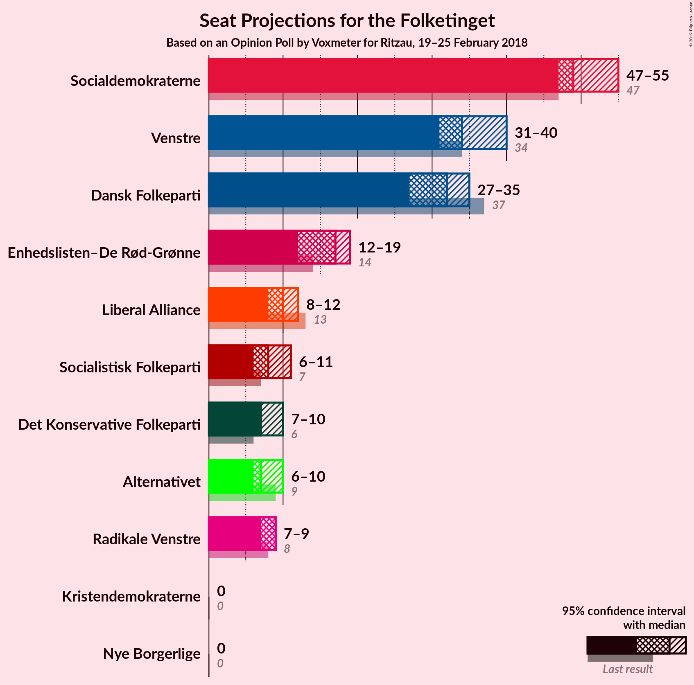
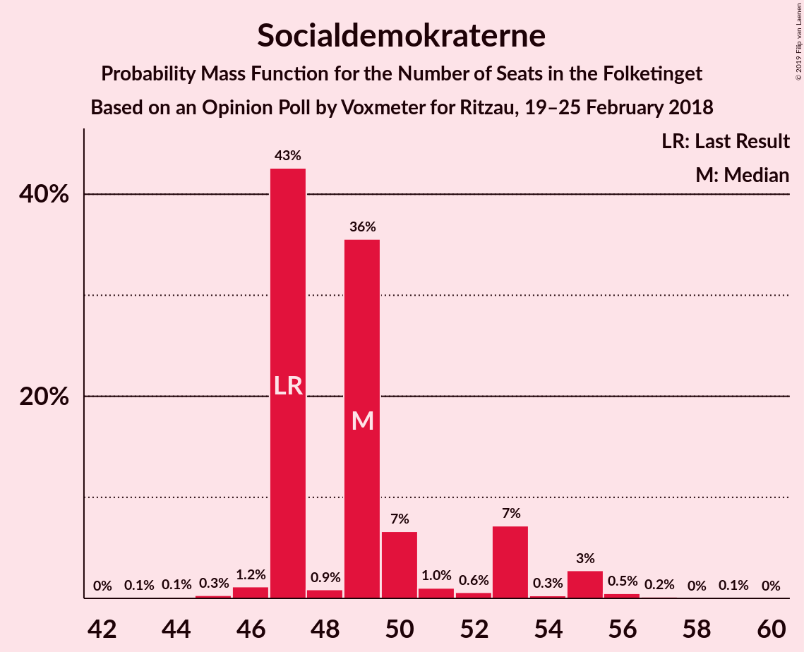
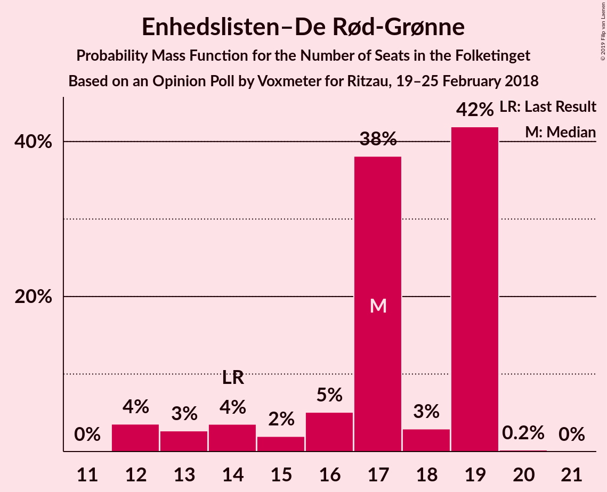
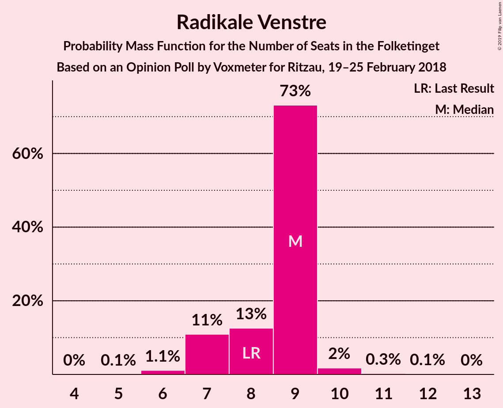

# Opinion Poll by Voxmeter for Ritzau, 19–25 February 2018

<a href="#voting-intentions">Voting Intentions</a> | <a href="#seats">Seats</a> | <a href="#coalitions">Coalitions</a> | <a href="#technical-information">Technical Information</a>

## Voting Intentions

### Confidence Intervals

| Party | Last Result | Poll Result | 80% Confidence Interval | 90% Confidence Interval | 95% Confidence Interval | 99% Confidence Interval |
|:-----:|:-----------:|:-----------:|:-----------------------:|:-----------------------:|:-----------------------:|:-----------------------:|
| Socialdemokraterne | 26.3% | 28.6% | 26.8–30.5% |26.3–31.0% |25.9–31.4% |25.1–32.4% |
| Venstre | 19.5% | 20.1% | 18.6–21.8% |18.2–22.3% |17.8–22.7% |17.1–23.5% |
| Dansk Folkeparti | 21.1% | 17.6% | 16.1–19.2% |15.7–19.6% |15.4–20.1% |14.7–20.9% |
| Enhedslisten–De Rød-Grønne | 7.8% | 8.8% | 7.8–10.1% |7.5–10.4% |7.2–10.7% |6.8–11.4% |
| Liberal Alliance | 7.5% | 5.8% | 5.0–6.8% |4.7–7.1% |4.5–7.4% |4.1–7.9% |
| Radikale Venstre | 4.6% | 4.5% | 3.8–5.5% |3.6–5.7% |3.4–6.0% |3.1–6.5% |
| Det Konservative Folkeparti | 3.4% | 4.4% | 3.7–5.4% |3.5–5.6% |3.3–5.9% |3.0–6.4% |
| Socialistisk Folkeparti | 4.2% | 4.3% | 3.6–5.3% |3.4–5.5% |3.2–5.8% |2.9–6.2% |
| Alternativet | 4.8% | 4.0% | 3.3–4.9% |3.1–5.2% |3.0–5.4% |2.7–5.9% |
| Nye Borgerlige | 0.0% | 1.1% | 0.8–1.6% |0.7–1.8% |0.6–1.9% |0.5–2.2% |
| Kristendemokraterne | 0.8% | 0.6% | 0.4–1.0% |0.3–1.2% |0.3–1.3% |0.2–1.5% |

*Note:* The poll result column reflects the actual value used in the calculations. Published results may vary slightly, and in addition be rounded to fewer digits.

## Seats

### Confidence Intervals

| Party | Last Result | Median | 80% Confidence Interval | 90% Confidence Interval | 95% Confidence Interval | 99% Confidence Interval |
|:-----:|:-----------:|:------:|:-----------------------:|:-----------------------:|:-----------------------:|:-----------------------:|
| <a href="#socialdemokraterne">Socialdemokraterne</a> | 47 | 50 | 50–52 |50–52 |50–52 |42–52 |
| <a href="#venstre">Venstre</a> | 34 | 37 | 37 |37 |29–37 |29–37 |
| <a href="#dansk-folkeparti">Dansk Folkeparti</a> | 37 | 33 | 33–37 |33–37 |31–37 |31–37 |
| <a href="#enhedslisten–de-rød-grønne">Enhedslisten–De Rød-Grønne</a> | 14 | 12 | 12–15 |12–15 |12–16 |12–19 |
| <a href="#liberal-alliance">Liberal Alliance</a> | 13 | 10 | 7–10 |7–10 |7–15 |7–15 |
| <a href="#radikale-venstre">Radikale Venstre</a> | 8 | 8 | 7–8 |7–8 |7–11 |7–12 |
| <a href="#det-konservative-folkeparti">Det Konservative Folkeparti</a> | 6 | 6 | 6–7 |6–7 |6–9 |6–9 |
| <a href="#socialistisk-folkeparti">Socialistisk Folkeparti</a> | 7 | 8 | 8 |8 |6–8 |6–10 |
| <a href="#alternativet">Alternativet</a> | 9 | 7 | 5–7 |5–7 |5–7 |5–7 |
| <a href="#nye-borgerlige">Nye Borgerlige</a> | 0 | 0 | 0 |0 |0 |0–4 |
| <a href="#kristendemokraterne">Kristendemokraterne</a> | 0 | 4 | 0–4 |0–4 |0–4 |0–4 |

### Socialdemokraterne

*For a full overview of the results for this party, see the [Socialdemokraterne](party-socialdemokraterne.html) page.*

| Number of Seats | Probability | Accumulated | Special Marks |
|:---------------:|:-----------:|:-----------:|:-------------:|
| 42 | 0.6% | 100% |  |
| 43 | 0% | 99.4% |  |
| 44 | 0% | 99.4% |  |
| 45 | 0% | 99.4% |  |
| 46 | 0% | 99.4% |  |
| 47 | 0% | 99.4% | Last Result |
| 48 | 0.1% | 99.4% |  |
| 49 | 0% | 99.3% |  |
| 50 | 76% | 99.3% | Median |
| 51 | 4% | 23% |  |
| 52 | 19% | 19% |  |
| 53 | 0% | 0.1% |  |
| 54 | 0% | 0.1% |  |
| 55 | 0% | 0.1% |  |
| 56 | 0% | 0.1% |  |
| 57 | 0% | 0.1% |  |
| 58 | 0.1% | 0.1% |  |
| 59 | 0% | 0% |  |

### Venstre

*For a full overview of the results for this party, see the [Venstre](party-venstre.html) page.*

| Number of Seats | Probability | Accumulated | Special Marks |
|:---------------:|:-----------:|:-----------:|:-------------:|
| 29 | 4% | 100% |  |
| 30 | 0% | 96% |  |
| 31 | 0% | 96% |  |
| 32 | 0% | 96% |  |
| 33 | 0.1% | 96% |  |
| 34 | 0% | 96% | Last Result |
| 35 | 0.6% | 96% |  |
| 36 | 0.1% | 95% |  |
| 37 | 95% | 95% | Median |
| 38 | 0% | 0.1% |  |
| 39 | 0.1% | 0.1% |  |
| 40 | 0% | 0% |  |

### Dansk Folkeparti

*For a full overview of the results for this party, see the [Dansk Folkeparti](party-danskfolkeparti.html) page.*

| Number of Seats | Probability | Accumulated | Special Marks |
|:---------------:|:-----------:|:-----------:|:-------------:|
| 23 | 0.1% | 100% |  |
| 24 | 0% | 99.9% |  |
| 25 | 0% | 99.9% |  |
| 26 | 0% | 99.9% |  |
| 27 | 0.1% | 99.9% |  |
| 28 | 0% | 99.8% |  |
| 29 | 0.1% | 99.8% |  |
| 30 | 0% | 99.7% |  |
| 31 | 5% | 99.7% |  |
| 32 | 0% | 95% |  |
| 33 | 76% | 95% | Median |
| 34 | 0% | 19% |  |
| 35 | 0% | 19% |  |
| 36 | 0% | 19% |  |
| 37 | 19% | 19% | Last Result |
| 38 | 0% | 0% |  |

### Enhedslisten–De Rød-Grønne

*For a full overview of the results for this party, see the [Enhedslisten–De Rød-Grønne](party-enhedslisten–derød-grønne.html) page.*

| Number of Seats | Probability | Accumulated | Special Marks |
|:---------------:|:-----------:|:-----------:|:-------------:|
| 12 | 76% | 100% | Median |
| 13 | 0.1% | 24% |  |
| 14 | 0% | 24% | Last Result |
| 15 | 19% | 24% |  |
| 16 | 4% | 5% |  |
| 17 | 0.1% | 0.8% |  |
| 18 | 0% | 0.7% |  |
| 19 | 0.7% | 0.7% |  |
| 20 | 0% | 0% |  |

### Liberal Alliance

*For a full overview of the results for this party, see the [Liberal Alliance](party-liberalalliance.html) page.*

| Number of Seats | Probability | Accumulated | Special Marks |
|:---------------:|:-----------:|:-----------:|:-------------:|
| 7 | 19% | 100% |  |
| 8 | 0% | 81% |  |
| 9 | 0.6% | 81% |  |
| 10 | 76% | 80% | Median |
| 11 | 0% | 4% |  |
| 12 | 0.2% | 4% |  |
| 13 | 0% | 4% | Last Result |
| 14 | 0% | 4% |  |
| 15 | 4% | 4% |  |
| 16 | 0% | 0% |  |

### Radikale Venstre

*For a full overview of the results for this party, see the [Radikale Venstre](party-radikalevenstre.html) page.*

| Number of Seats | Probability | Accumulated | Special Marks |
|:---------------:|:-----------:|:-----------:|:-------------:|
| 4 | 0.1% | 100% |  |
| 5 | 0% | 99.9% |  |
| 6 | 0% | 99.9% |  |
| 7 | 19% | 99.9% |  |
| 8 | 76% | 81% | Last Result, Median |
| 9 | 0% | 5% |  |
| 10 | 0% | 5% |  |
| 11 | 4% | 5% |  |
| 12 | 0.6% | 0.6% |  |
| 13 | 0% | 0% |  |

### Det Konservative Folkeparti

*For a full overview of the results for this party, see the [Det Konservative Folkeparti](party-detkonservativefolkeparti.html) page.*

| Number of Seats | Probability | Accumulated | Special Marks |
|:---------------:|:-----------:|:-----------:|:-------------:|
| 6 | 77% | 100% | Last Result, Median |
| 7 | 19% | 23% |  |
| 8 | 0% | 4% |  |
| 9 | 4% | 4% |  |
| 10 | 0% | 0.1% |  |
| 11 | 0% | 0.1% |  |
| 12 | 0% | 0.1% |  |
| 13 | 0% | 0.1% |  |
| 14 | 0.1% | 0.1% |  |
| 15 | 0% | 0% |  |

### Socialistisk Folkeparti

*For a full overview of the results for this party, see the [Socialistisk Folkeparti](party-socialistiskfolkeparti.html) page.*

| Number of Seats | Probability | Accumulated | Special Marks |
|:---------------:|:-----------:|:-----------:|:-------------:|
| 5 | 0.1% | 100% |  |
| 6 | 4% | 99.9% |  |
| 7 | 0% | 96% | Last Result |
| 8 | 95% | 96% | Median |
| 9 | 0% | 0.7% |  |
| 10 | 0.6% | 0.7% |  |
| 11 | 0% | 0.1% |  |
| 12 | 0% | 0.1% |  |
| 13 | 0.1% | 0.1% |  |
| 14 | 0% | 0% |  |

### Alternativet

*For a full overview of the results for this party, see the [Alternativet](party-alternativet.html) page.*

| Number of Seats | Probability | Accumulated | Special Marks |
|:---------------:|:-----------:|:-----------:|:-------------:|
| 5 | 19% | 100% |  |
| 6 | 0.1% | 81% |  |
| 7 | 81% | 81% | Median |
| 8 | 0% | 0.1% |  |
| 9 | 0.1% | 0.1% | Last Result |
| 10 | 0% | 0% |  |

### Nye Borgerlige

*For a full overview of the results for this party, see the [Nye Borgerlige](party-nyeborgerlige.html) page.*

| Number of Seats | Probability | Accumulated | Special Marks |
|:---------------:|:-----------:|:-----------:|:-------------:|
| 0 | 99.4% | 100% | Last Result, Median |
| 1 | 0% | 0.6% |  |
| 2 | 0% | 0.6% |  |
| 3 | 0% | 0.6% |  |
| 4 | 0.6% | 0.6% |  |
| 5 | 0% | 0% |  |

### Kristendemokraterne

*For a full overview of the results for this party, see the [Kristendemokraterne](party-kristendemokraterne.html) page.*

| Number of Seats | Probability | Accumulated | Special Marks |
|:---------------:|:-----------:|:-----------:|:-------------:|
| 0 | 24% | 100% | Last Result |
| 1 | 0% | 76% |  |
| 2 | 0% | 76% |  |
| 3 | 0% | 76% |  |
| 4 | 76% | 76% | Median |
| 5 | 0% | 0% |  |

## Coalitions

### Confidence Intervals

| Coalition | Last Result | Median | Majority? | 80% Confidence Interval | 90% Confidence Interval | 95% Confidence Interval | 99% Confidence Interval |
|:---------:|:-----------:|:------:|:---------:|:-----------------------:|:-----------------------:|:-----------------------:|:-----------------------:|
| Socialdemokraterne – Enhedslisten–De Rød-Grønne – Radikale Venstre – Socialistisk Folkeparti – Alternativet | 85 | 85 | 5% | 85–87 | 85–87 | 85–91 | 85–91 |
| Venstre – Dansk Folkeparti – Liberal Alliance – Det Konservative Folkeparti – Nye Borgerlige – Kristendemokraterne | 90 | 90 | 76% | 88–90 | 88–90 | 84–90 | 84–90 |
| Venstre – Dansk Folkeparti – Liberal Alliance – Det Konservative Folkeparti – Kristendemokraterne | 90 | 90 | 76% | 88–90 | 88–90 | 84–90 | 81–90 |
| Venstre – Dansk Folkeparti – Liberal Alliance – Det Konservative Folkeparti – Nye Borgerlige | 90 | 86 | 0% | 86–88 | 86–88 | 84–88 | 84–88 |
| Venstre – Dansk Folkeparti – Liberal Alliance – Det Konservative Folkeparti | 90 | 86 | 0% | 86–88 | 86–88 | 84–88 | 81–88 |
| Socialdemokraterne – Enhedslisten–De Rød-Grønne – Radikale Venstre – Socialistisk Folkeparti | 76 | 78 | 0% | 78–82 | 78–82 | 78–84 | 78–84 |

### Socialdemokraterne – Enhedslisten–De Rød-Grønne – Radikale Venstre – Socialistisk Folkeparti – Alternativet

| Number of Seats | Probability | Accumulated | Special Marks |
|:---------------:|:-----------:|:-----------:|:-------------:|
| 85 | 76% | 100% | Last Result, Median |
| 86 | 0% | 24% |  |
| 87 | 19% | 24% |  |
| 88 | 0% | 5% |  |
| 89 | 0% | 5% |  |
| 90 | 0.6% | 5% | Majority |
| 91 | 4% | 4% |  |
| 92 | 0% | 0.2% |  |
| 93 | 0.1% | 0.2% |  |
| 94 | 0% | 0.1% |  |
| 95 | 0.1% | 0.1% |  |
| 96 | 0% | 0% |  |

### Venstre – Dansk Folkeparti – Liberal Alliance – Det Konservative Folkeparti – Nye Borgerlige – Kristendemokraterne

| Number of Seats | Probability | Accumulated | Special Marks |
|:---------------:|:-----------:|:-----------:|:-------------:|
| 80 | 0.1% | 100% |  |
| 81 | 0% | 99.9% |  |
| 82 | 0.1% | 99.9% |  |
| 83 | 0% | 99.8% |  |
| 84 | 4% | 99.8% |  |
| 85 | 0.6% | 96% |  |
| 86 | 0% | 95% |  |
| 87 | 0% | 95% |  |
| 88 | 19% | 95% |  |
| 89 | 0% | 76% |  |
| 90 | 76% | 76% | Last Result, Median, Majority |
| 91 | 0% | 0% |  |

### Venstre – Dansk Folkeparti – Liberal Alliance – Det Konservative Folkeparti – Kristendemokraterne

| Number of Seats | Probability | Accumulated | Special Marks |
|:---------------:|:-----------:|:-----------:|:-------------:|
| 80 | 0.1% | 100% |  |
| 81 | 0.6% | 99.9% |  |
| 82 | 0.1% | 99.3% |  |
| 83 | 0% | 99.2% |  |
| 84 | 4% | 99.2% |  |
| 85 | 0% | 95% |  |
| 86 | 0% | 95% |  |
| 87 | 0% | 95% |  |
| 88 | 19% | 95% |  |
| 89 | 0% | 76% |  |
| 90 | 76% | 76% | Last Result, Median, Majority |
| 91 | 0% | 0% |  |

### Venstre – Dansk Folkeparti – Liberal Alliance – Det Konservative Folkeparti – Nye Borgerlige

| Number of Seats | Probability | Accumulated | Special Marks |
|:---------------:|:-----------:|:-----------:|:-------------:|
| 80 | 0.1% | 100% |  |
| 81 | 0% | 99.9% |  |
| 82 | 0.1% | 99.9% |  |
| 83 | 0% | 99.8% |  |
| 84 | 4% | 99.8% |  |
| 85 | 0.6% | 96% |  |
| 86 | 76% | 95% | Median |
| 87 | 0% | 19% |  |
| 88 | 19% | 19% |  |
| 89 | 0% | 0% |  |
| 90 | 0% | 0% | Last Result, Majority |

### Venstre – Dansk Folkeparti – Liberal Alliance – Det Konservative Folkeparti

| Number of Seats | Probability | Accumulated | Special Marks |
|:---------------:|:-----------:|:-----------:|:-------------:|
| 80 | 0.1% | 100% |  |
| 81 | 0.6% | 99.9% |  |
| 82 | 0.1% | 99.3% |  |
| 83 | 0% | 99.2% |  |
| 84 | 4% | 99.2% |  |
| 85 | 0% | 95% |  |
| 86 | 76% | 95% | Median |
| 87 | 0% | 19% |  |
| 88 | 19% | 19% |  |
| 89 | 0% | 0% |  |
| 90 | 0% | 0% | Last Result, Majority |

### Socialdemokraterne – Enhedslisten–De Rød-Grønne – Radikale Venstre – Socialistisk Folkeparti

| Number of Seats | Probability | Accumulated | Special Marks |
|:---------------:|:-----------:|:-----------:|:-------------:|
| 76 | 0% | 100% | Last Result |
| 77 | 0% | 100% |  |
| 78 | 76% | 100% | Median |
| 79 | 0% | 24% |  |
| 80 | 0% | 24% |  |
| 81 | 0.1% | 24% |  |
| 82 | 19% | 24% |  |
| 83 | 0.6% | 5% |  |
| 84 | 4% | 4% |  |
| 85 | 0% | 0.1% |  |
| 86 | 0% | 0.1% |  |
| 87 | 0% | 0.1% |  |
| 88 | 0.1% | 0.1% |  |
| 89 | 0% | 0% |  |

## Technical Information

### Opinion Poll

+ **Polling firm:** Voxmeter
+ **Commissioner(s):** Ritzau
+ **Fieldwork period:** 19–25 February 2018

### Calculations

+ **Sample size:** 1018
+ **Simulations done:** 1,024
+ **Error estimate:** 4.30%

