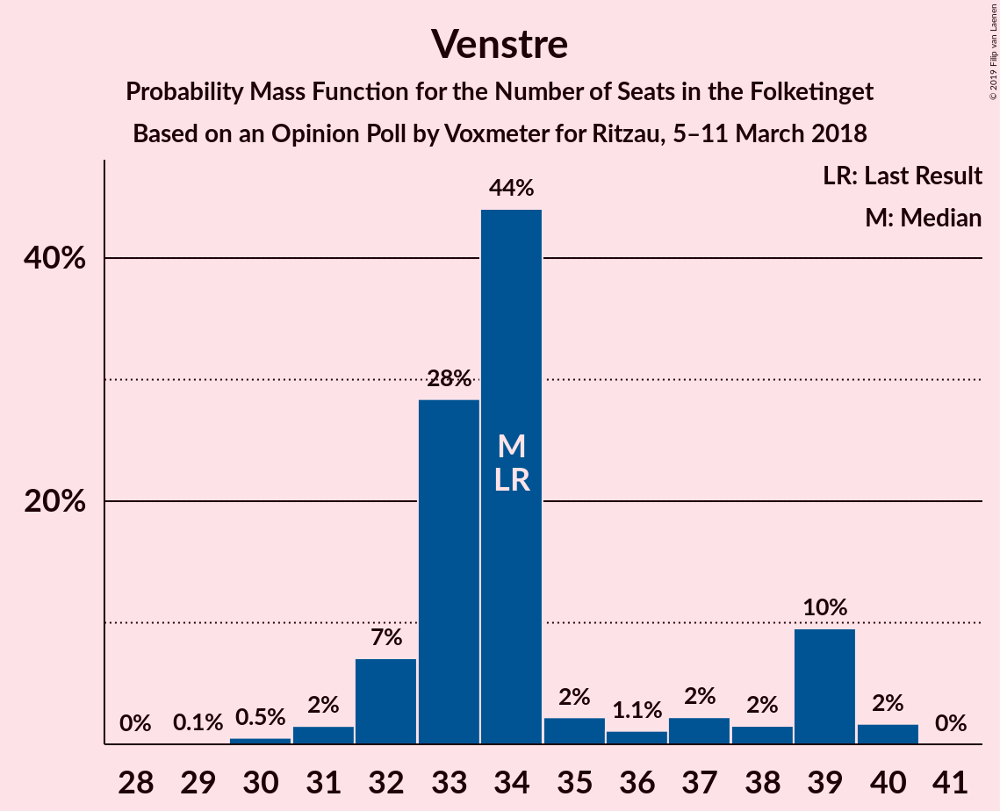
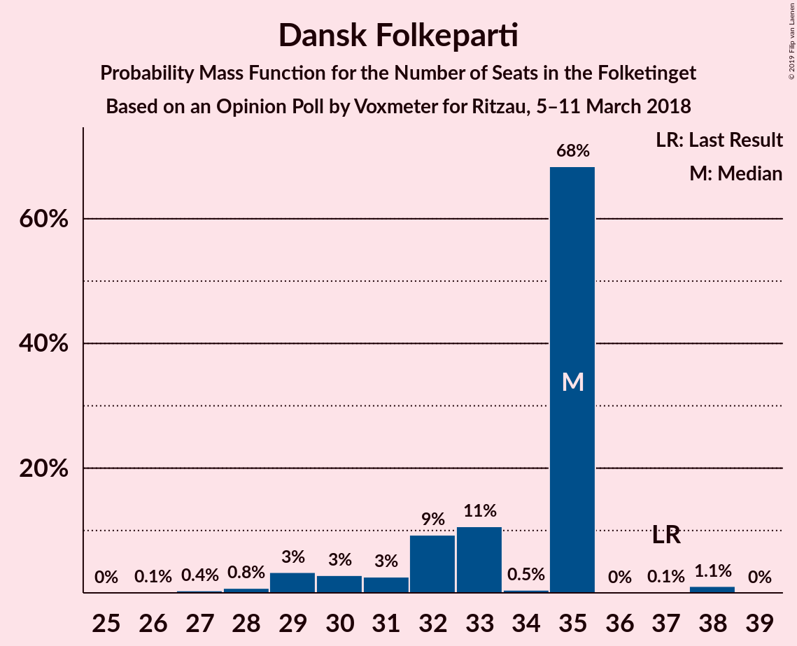
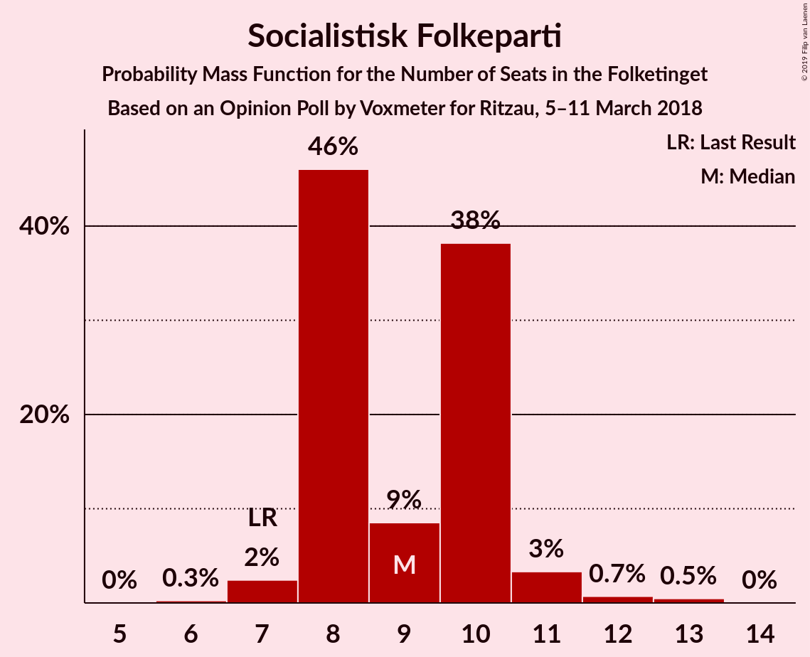
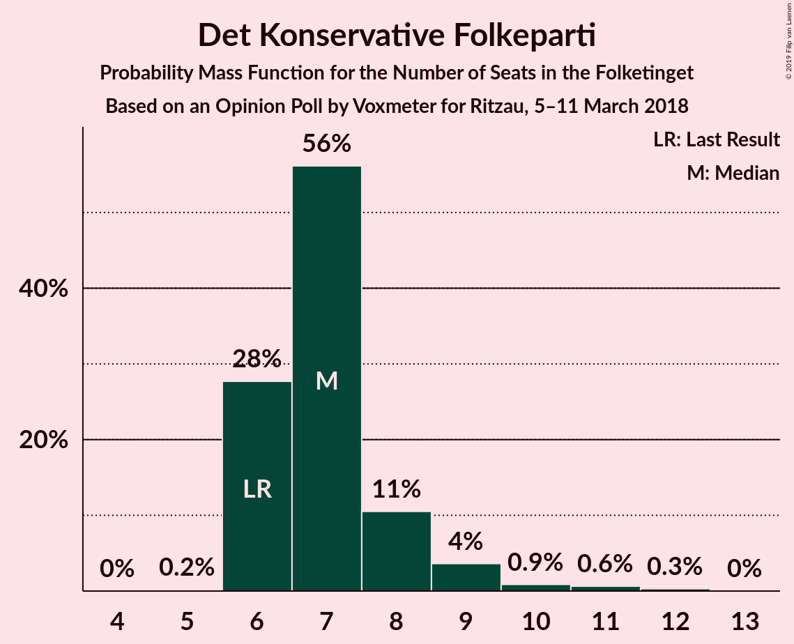
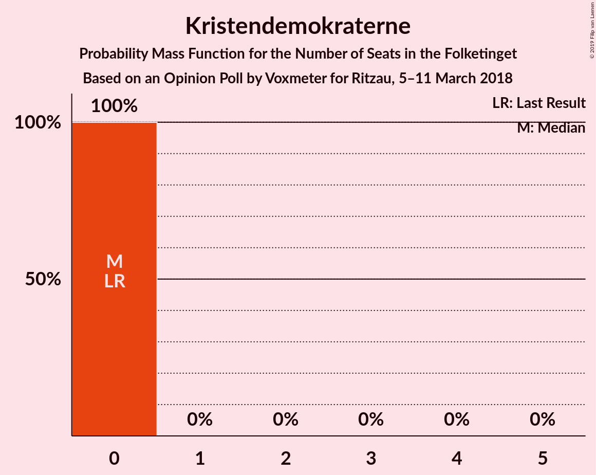

# Opinion Poll by Voxmeter for Ritzau, 5–11 March 2018

<a href="#voting-intentions">Voting Intentions</a> | <a href="#seats">Seats</a> | <a href="#coalitions">Coalitions</a> | <a href="#technical-information">Technical Information</a>

## Voting Intentions

### Confidence Intervals

| Party | Last Result | Poll Result | 80% Confidence Interval | 90% Confidence Interval | 95% Confidence Interval | 99% Confidence Interval |
|:-----:|:-----------:|:-----------:|:-----------------------:|:-----------------------:|:-----------------------:|:-----------------------:|
| Socialdemokraterne | 26.3% | 26.8% | 25.1–28.7% |24.6–29.2% |24.2–29.6% |23.4–30.5% |
| Venstre | 19.5% | 19.5% | 18.0–21.1% |17.5–21.6% |17.2–22.0% |16.5–22.8% |
| Dansk Folkeparti | 21.1% | 18.0% | 16.6–19.6% |16.2–20.1% |15.8–20.5% |15.1–21.3% |
| Enhedslisten–De Rød-Grønne | 7.8% | 8.8% | 7.8–10.0% |7.5–10.4% |7.2–10.7% |6.8–11.3% |
| Liberal Alliance | 7.5% | 5.6% | 4.7–6.6% |4.5–6.9% |4.3–7.1% |4.0–7.7% |
| Socialistisk Folkeparti | 4.2% | 5.2% | 4.4–6.2% |4.2–6.4% |4.0–6.7% |3.6–7.2% |
| Radikale Venstre | 4.6% | 4.9% | 4.1–5.9% |3.9–6.1% |3.7–6.4% |3.4–6.9% |
| Alternativet | 4.8% | 4.5% | 3.8–5.4% |3.6–5.7% |3.4–5.9% |3.1–6.4% |
| Det Konservative Folkeparti | 3.4% | 4.3% | 3.6–5.2% |3.4–5.5% |3.2–5.7% |2.9–6.2% |
| Nye Borgerlige | 0.0% | 1.5% | 1.1–2.1% |1.0–2.3% |0.9–2.5% |0.8–2.8% |
| Kristendemokraterne | 0.8% | 0.8% | 0.5–1.2% |0.4–1.4% |0.4–1.5% |0.3–1.8% |

*Note:* The poll result column reflects the actual value used in the calculations. Published results may vary slightly, and in addition be rounded to fewer digits.

## Seats

### Confidence Intervals

| Party | Last Result | Median | 80% Confidence Interval | 90% Confidence Interval | 95% Confidence Interval | 99% Confidence Interval |
|:-----:|:-----------:|:------:|:-----------------------:|:-----------------------:|:-----------------------:|:-----------------------:|
| <a href="#socialdemokraterne">Socialdemokraterne</a> | 47 | 52 | 45–52 |45–52 |45–52 |43–52 |
| <a href="#venstre">Venstre</a> | 34 | 29 | 29–41 |29–41 |29–41 |29–41 |
| <a href="#dansk-folkeparti">Dansk Folkeparti</a> | 37 | 36 | 30–36 |30–36 |30–36 |28–36 |
| <a href="#enhedslisten–de-rød-grønne">Enhedslisten–De Rød-Grønne</a> | 14 | 16 | 15–16 |15–16 |15–16 |15–21 |
| <a href="#liberal-alliance">Liberal Alliance</a> | 13 | 11 | 11 |11 |11 |9–13 |
| <a href="#socialistisk-folkeparti">Socialistisk Folkeparti</a> | 7 | 6 | 6–11 |6–11 |6–11 |6–11 |
| <a href="#radikale-venstre">Radikale Venstre</a> | 8 | 9 | 6–9 |6–9 |6–9 |6–9 |
| <a href="#alternativet">Alternativet</a> | 9 | 9 | 7–9 |7–9 |7–9 |7–12 |
| <a href="#det-konservative-folkeparti">Det Konservative Folkeparti</a> | 6 | 7 | 7–9 |7–9 |7–9 |7–10 |
| <a href="#nye-borgerlige">Nye Borgerlige</a> | 0 | 0 | 0 |0 |0 |0 |
| <a href="#kristendemokraterne">Kristendemokraterne</a> | 0 | 0 | 0 |0 |0 |0 |

### Socialdemokraterne

*For a full overview of the results for this party, see the [Socialdemokraterne](party-socialdemokraterne.html) page.*

| Number of Seats | Probability | Accumulated | Special Marks |
|:---------------:|:-----------:|:-----------:|:-------------:|
| 43 | 0.5% | 100% |  |
| 44 | 0% | 99.4% |  |
| 45 | 31% | 99.4% |  |
| 46 | 0% | 68% |  |
| 47 | 0% | 68% | Last Result |
| 48 | 0% | 68% |  |
| 49 | 0% | 68% |  |
| 50 | 0% | 68% |  |
| 51 | 0% | 68% |  |
| 52 | 68% | 68% | Median |
| 53 | 0% | 0% |  |

### Venstre

*For a full overview of the results for this party, see the [Venstre](party-venstre.html) page.*

| Number of Seats | Probability | Accumulated | Special Marks |
|:---------------:|:-----------:|:-----------:|:-------------:|
| 29 | 68% | 100% | Median |
| 30 | 0% | 32% |  |
| 31 | 0% | 32% |  |
| 32 | 0% | 32% |  |
| 33 | 0% | 32% |  |
| 34 | 0% | 32% | Last Result |
| 35 | 0.1% | 32% |  |
| 36 | 0% | 32% |  |
| 37 | 0.8% | 32% |  |
| 38 | 0.5% | 31% |  |
| 39 | 0% | 30% |  |
| 40 | 0% | 30% |  |
| 41 | 30% | 30% |  |
| 42 | 0% | 0% |  |

### Dansk Folkeparti

*For a full overview of the results for this party, see the [Dansk Folkeparti](party-danskfolkeparti.html) page.*

| Number of Seats | Probability | Accumulated | Special Marks |
|:---------------:|:-----------:|:-----------:|:-------------:|
| 28 | 0.5% | 100% |  |
| 29 | 0.8% | 99.4% |  |
| 30 | 30% | 98.6% |  |
| 31 | 0% | 68% |  |
| 32 | 0% | 68% |  |
| 33 | 0% | 68% |  |
| 34 | 0% | 68% |  |
| 35 | 0% | 68% |  |
| 36 | 68% | 68% | Median |
| 37 | 0% | 0% | Last Result |

### Enhedslisten–De Rød-Grønne

*For a full overview of the results for this party, see the [Enhedslisten–De Rød-Grønne](party-enhedslisten–derød-grønne.html) page.*

| Number of Seats | Probability | Accumulated | Special Marks |
|:---------------:|:-----------:|:-----------:|:-------------:|
| 14 | 0% | 100% | Last Result |
| 15 | 30% | 100% |  |
| 16 | 69% | 70% | Median |
| 17 | 0% | 0.6% |  |
| 18 | 0% | 0.6% |  |
| 19 | 0% | 0.6% |  |
| 20 | 0% | 0.6% |  |
| 21 | 0.5% | 0.6% |  |
| 22 | 0% | 0% |  |

### Liberal Alliance

*For a full overview of the results for this party, see the [Liberal Alliance](party-liberalalliance.html) page.*

| Number of Seats | Probability | Accumulated | Special Marks |
|:---------------:|:-----------:|:-----------:|:-------------:|
| 8 | 0.1% | 100% |  |
| 9 | 0.5% | 99.9% |  |
| 10 | 0% | 99.4% |  |
| 11 | 98.5% | 99.4% | Median |
| 12 | 0% | 0.9% |  |
| 13 | 0.9% | 0.9% | Last Result |
| 14 | 0% | 0% |  |

### Socialistisk Folkeparti

*For a full overview of the results for this party, see the [Socialistisk Folkeparti](party-socialistiskfolkeparti.html) page.*

| Number of Seats | Probability | Accumulated | Special Marks |
|:---------------:|:-----------:|:-----------:|:-------------:|
| 6 | 68% | 100% | Median |
| 7 | 0% | 32% | Last Result |
| 8 | 1.4% | 32% |  |
| 9 | 0.1% | 30% |  |
| 10 | 0% | 30% |  |
| 11 | 30% | 30% |  |
| 12 | 0% | 0% |  |

### Radikale Venstre

*For a full overview of the results for this party, see the [Radikale Venstre](party-radikalevenstre.html) page.*

| Number of Seats | Probability | Accumulated | Special Marks |
|:---------------:|:-----------:|:-----------:|:-------------:|
| 6 | 31% | 100% |  |
| 7 | 0% | 69% |  |
| 8 | 0% | 69% | Last Result |
| 9 | 69% | 69% | Median |
| 10 | 0.1% | 0.1% |  |
| 11 | 0% | 0% |  |

### Alternativet

*For a full overview of the results for this party, see the [Alternativet](party-alternativet.html) page.*

| Number of Seats | Probability | Accumulated | Special Marks |
|:---------------:|:-----------:|:-----------:|:-------------:|
| 7 | 30% | 100% |  |
| 8 | 0% | 70% |  |
| 9 | 68% | 70% | Last Result, Median |
| 10 | 0% | 1.4% |  |
| 11 | 0.8% | 1.4% |  |
| 12 | 0.5% | 0.6% |  |
| 13 | 0% | 0% |  |

### Det Konservative Folkeparti

*For a full overview of the results for this party, see the [Det Konservative Folkeparti](party-detkonservativefolkeparti.html) page.*

| Number of Seats | Probability | Accumulated | Special Marks |
|:---------------:|:-----------:|:-----------:|:-------------:|
| 6 | 0% | 100% | Last Result |
| 7 | 69% | 100% | Median |
| 8 | 0.1% | 31% |  |
| 9 | 30% | 31% |  |
| 10 | 0.5% | 0.6% |  |
| 11 | 0% | 0% |  |

### Nye Borgerlige

*For a full overview of the results for this party, see the [Nye Borgerlige](party-nyeborgerlige.html) page.*

| Number of Seats | Probability | Accumulated | Special Marks |
|:---------------:|:-----------:|:-----------:|:-------------:|
| 0 | 100% | 100% | Last Result, Median |

### Kristendemokraterne

*For a full overview of the results for this party, see the [Kristendemokraterne](party-kristendemokraterne.html) page.*

| Number of Seats | Probability | Accumulated | Special Marks |
|:---------------:|:-----------:|:-----------:|:-------------:|
| 0 | 100% | 100% | Last Result, Median |

## Coalitions

### Confidence Intervals

| Coalition | Last Result | Median | Majority? | 80% Confidence Interval | 90% Confidence Interval | 95% Confidence Interval | 99% Confidence Interval |
|:---------:|:-----------:|:------:|:---------:|:-----------------------:|:-----------------------:|:-----------------------:|:-----------------------:|
| Socialdemokraterne – Enhedslisten–De Rød-Grønne – Socialistisk Folkeparti – Radikale Venstre – Alternativet | 85 | 92 | 69% | 84–92 | 84–92 | 84–92 | 84–92 |
| Venstre – Dansk Folkeparti – Liberal Alliance – Det Konservative Folkeparti – Nye Borgerlige – Kristendemokraterne | 90 | 83 | 30% | 83–91 | 83–91 | 83–91 | 83–91 |
| Venstre – Dansk Folkeparti – Liberal Alliance – Det Konservative Folkeparti – Kristendemokraterne | 90 | 83 | 30% | 83–91 | 83–91 | 83–91 | 83–91 |
| Venstre – Dansk Folkeparti – Liberal Alliance – Det Konservative Folkeparti – Nye Borgerlige | 90 | 83 | 30% | 83–91 | 83–91 | 83–91 | 83–91 |
| Venstre – Dansk Folkeparti – Liberal Alliance – Det Konservative Folkeparti | 90 | 83 | 30% | 83–91 | 83–91 | 83–91 | 83–91 |
| Socialdemokraterne – Enhedslisten–De Rød-Grønne – Socialistisk Folkeparti – Radikale Venstre | 76 | 83 | 0% | 77–83 | 77–83 | 77–83 | 77–83 |

### Socialdemokraterne – Enhedslisten–De Rød-Grønne – Socialistisk Folkeparti – Radikale Venstre – Alternativet

| Number of Seats | Probability | Accumulated | Special Marks |
|:---------------:|:-----------:|:-----------:|:-------------:|
| 84 | 30% | 100% |  |
| 85 | 0% | 70% | Last Result |
| 86 | 0% | 70% |  |
| 87 | 0% | 70% |  |
| 88 | 0% | 70% |  |
| 89 | 0.8% | 70% |  |
| 90 | 0.5% | 69% | Majority |
| 91 | 0% | 68% |  |
| 92 | 68% | 68% | Median |
| 93 | 0% | 0.1% |  |
| 94 | 0% | 0.1% |  |
| 95 | 0% | 0% |  |

### Venstre – Dansk Folkeparti – Liberal Alliance – Det Konservative Folkeparti – Nye Borgerlige – Kristendemokraterne

| Number of Seats | Probability | Accumulated | Special Marks |
|:---------------:|:-----------:|:-----------:|:-------------:|
| 81 | 0% | 100% |  |
| 82 | 0% | 99.9% |  |
| 83 | 68% | 99.9% | Median |
| 84 | 0% | 32% |  |
| 85 | 0.5% | 32% |  |
| 86 | 0.8% | 31% |  |
| 87 | 0% | 30% |  |
| 88 | 0% | 30% |  |
| 89 | 0% | 30% |  |
| 90 | 0% | 30% | Last Result, Majority |
| 91 | 30% | 30% |  |
| 92 | 0% | 0% |  |

### Venstre – Dansk Folkeparti – Liberal Alliance – Det Konservative Folkeparti – Kristendemokraterne

| Number of Seats | Probability | Accumulated | Special Marks |
|:---------------:|:-----------:|:-----------:|:-------------:|
| 81 | 0% | 100% |  |
| 82 | 0% | 99.9% |  |
| 83 | 68% | 99.9% | Median |
| 84 | 0% | 32% |  |
| 85 | 0.5% | 32% |  |
| 86 | 0.8% | 31% |  |
| 87 | 0% | 30% |  |
| 88 | 0% | 30% |  |
| 89 | 0% | 30% |  |
| 90 | 0% | 30% | Last Result, Majority |
| 91 | 30% | 30% |  |
| 92 | 0% | 0% |  |

### Venstre – Dansk Folkeparti – Liberal Alliance – Det Konservative Folkeparti – Nye Borgerlige

| Number of Seats | Probability | Accumulated | Special Marks |
|:---------------:|:-----------:|:-----------:|:-------------:|
| 81 | 0% | 100% |  |
| 82 | 0% | 99.9% |  |
| 83 | 68% | 99.9% | Median |
| 84 | 0% | 32% |  |
| 85 | 0.5% | 32% |  |
| 86 | 0.8% | 31% |  |
| 87 | 0% | 30% |  |
| 88 | 0% | 30% |  |
| 89 | 0% | 30% |  |
| 90 | 0% | 30% | Last Result, Majority |
| 91 | 30% | 30% |  |
| 92 | 0% | 0% |  |

### Venstre – Dansk Folkeparti – Liberal Alliance – Det Konservative Folkeparti

| Number of Seats | Probability | Accumulated | Special Marks |
|:---------------:|:-----------:|:-----------:|:-------------:|
| 81 | 0% | 100% |  |
| 82 | 0% | 99.9% |  |
| 83 | 68% | 99.9% | Median |
| 84 | 0% | 32% |  |
| 85 | 0.5% | 32% |  |
| 86 | 0.8% | 31% |  |
| 87 | 0% | 30% |  |
| 88 | 0% | 30% |  |
| 89 | 0% | 30% |  |
| 90 | 0% | 30% | Last Result, Majority |
| 91 | 30% | 30% |  |
| 92 | 0% | 0% |  |

### Socialdemokraterne – Enhedslisten–De Rød-Grønne – Socialistisk Folkeparti – Radikale Venstre

| Number of Seats | Probability | Accumulated | Special Marks |
|:---------------:|:-----------:|:-----------:|:-------------:|
| 76 | 0% | 100% | Last Result |
| 77 | 30% | 100% |  |
| 78 | 1.4% | 70% |  |
| 79 | 0% | 68% |  |
| 80 | 0% | 68% |  |
| 81 | 0% | 68% |  |
| 82 | 0% | 68% |  |
| 83 | 68% | 68% | Median |
| 84 | 0% | 0% |  |

## Technical Information

### Opinion Poll

+ **Polling firm:** Voxmeter
+ **Commissioner(s):** Ritzau
+ **Fieldwork period:** 5–11 March 2018

### Calculations

+ **Sample size:** 1043
+ **Simulations done:** 1,024
+ **Error estimate:** 4.62%

