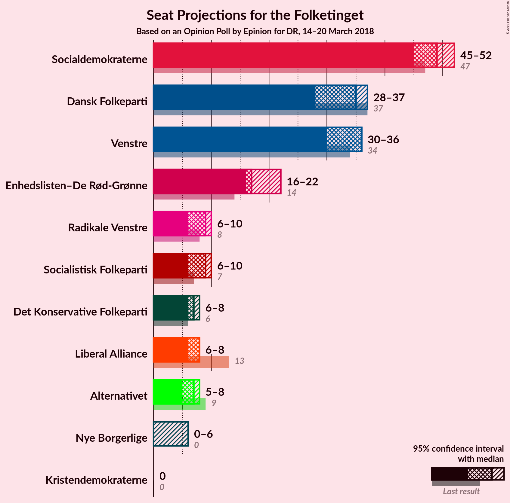
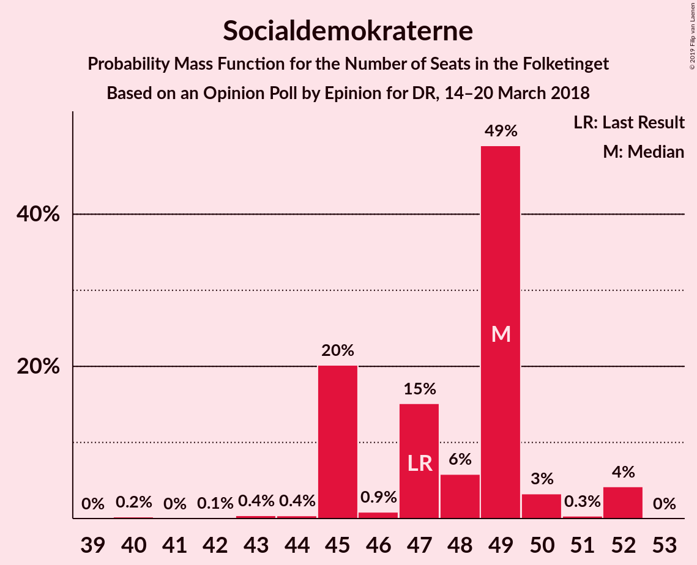
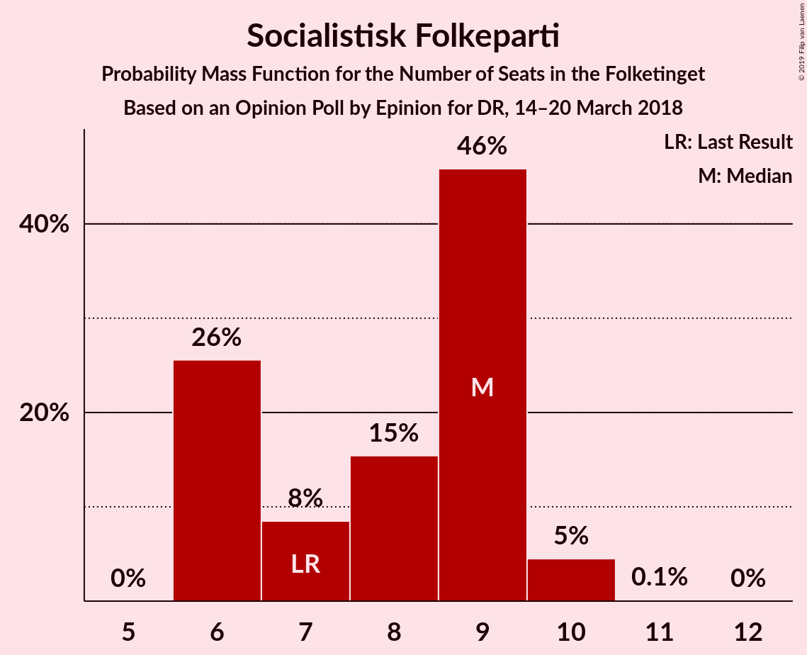
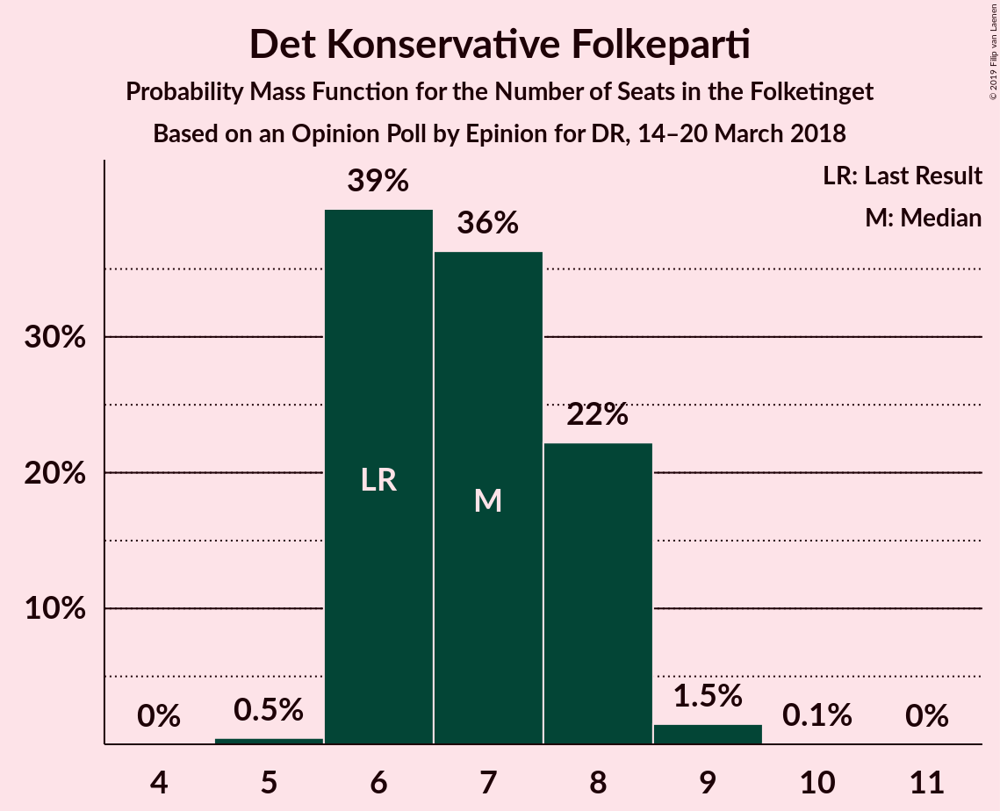
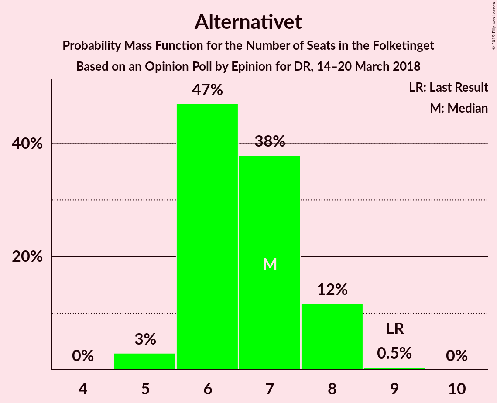
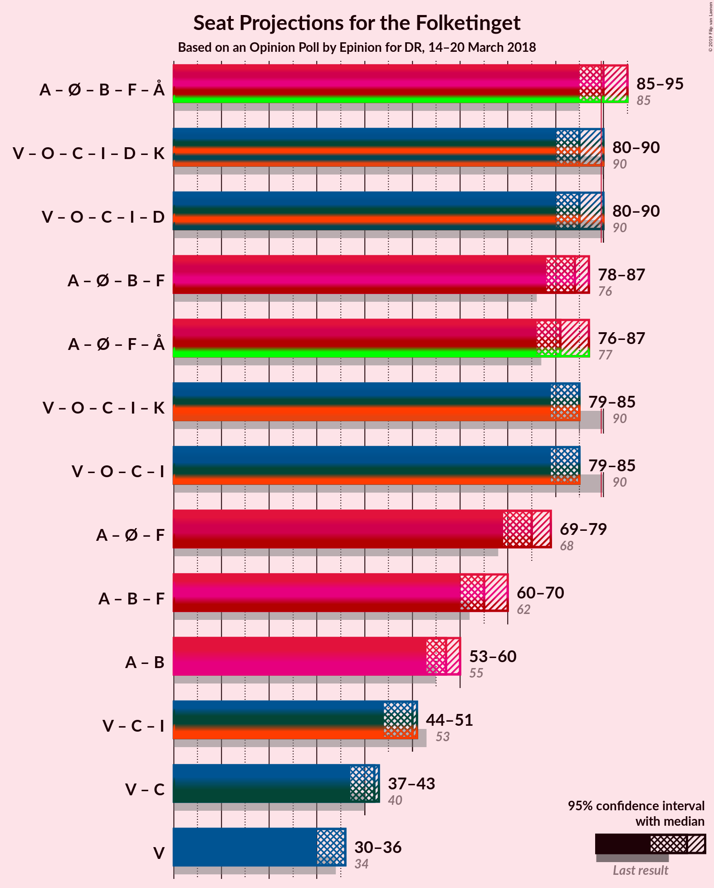

# Opinion Poll by Epinion for DR, 14–20 March 2018

<a href="#voting-intentions">Voting Intentions</a> | <a href="#seats">Seats</a> | <a href="#coalitions">Coalitions</a> | <a href="#technical-information">Technical Information</a>

## Voting Intentions

### Confidence Intervals

| Party | Last Result | Poll Result | 80% Confidence Interval | 90% Confidence Interval | 95% Confidence Interval | 99% Confidence Interval |
|:-----:|:-----------:|:-----------:|:-----------------------:|:-----------------------:|:-----------------------:|:-----------------------:|
| Socialdemokraterne | 26.3% | 26.5% | 25.2–27.9% |24.8–28.3% |24.5–28.7% |23.8–29.4% |
| Venstre | 19.5% | 19.9% | 18.7–21.2% |18.4–21.6% |18.1–21.9% |17.5–22.5% |
| Dansk Folkeparti | 21.1% | 18.3% | 17.1–19.6% |16.8–19.9% |16.5–20.2% |16.0–20.9% |
| Enhedslisten–De Rød-Grønne | 7.8% | 10.8% | 9.9–11.9% |9.6–12.1% |9.4–12.4% |9.0–12.9% |
| Radikale Venstre | 4.6% | 4.8% | 4.2–5.6% |4.0–5.8% |3.9–6.0% |3.6–6.3% |
| Socialistisk Folkeparti | 4.2% | 4.6% | 4.0–5.3% |3.8–5.5% |3.7–5.7% |3.4–6.1% |
| Det Konservative Folkeparti | 3.4% | 4.1% | 3.5–4.8% |3.4–5.0% |3.2–5.2% |3.0–5.5% |
| Liberal Alliance | 7.5% | 3.9% | 3.4–4.6% |3.2–4.8% |3.1–5.0% |2.9–5.3% |
| Alternativet | 4.8% | 3.9% | 3.4–4.6% |3.2–4.8% |3.1–5.0% |2.9–5.3% |
| Nye Borgerlige | 0.0% | 2.5% | 2.1–3.1% |2.0–3.2% |1.8–3.4% |1.7–3.7% |
| Kristendemokraterne | 0.8% | 0.6% | 0.4–0.9% |0.4–1.0% |0.3–1.1% |0.2–1.3% |

*Note:* The poll result column reflects the actual value used in the calculations. Published results may vary slightly, and in addition be rounded to fewer digits.

## Seats

### Confidence Intervals

| Party | Last Result | Median | 80% Confidence Interval | 90% Confidence Interval | 95% Confidence Interval | 99% Confidence Interval |
|:-----:|:-----------:|:------:|:-----------------------:|:-----------------------:|:-----------------------:|:-----------------------:|
| <a href="#socialdemokraterne">Socialdemokraterne</a> | 47 | 51 | 44–51 |44–52 |44–52 |44–52 |
| <a href="#venstre">Venstre</a> | 34 | 33 | 30–33 |30–33 |30–36 |30–37 |
| <a href="#dansk-folkeparti">Dansk Folkeparti</a> | 37 | 29 | 29–31 |29–31 |29–31 |27–31 |
| <a href="#enhedslisten–de-rød-grønne">Enhedslisten–De Rød-Grønne</a> | 14 | 21 | 21–22 |18–22 |18–22 |16–22 |
| <a href="#radikale-venstre">Radikale Venstre</a> | 8 | 9 | 9–13 |9–13 |9–13 |6–13 |
| <a href="#socialistisk-folkeparti">Socialistisk Folkeparti</a> | 7 | 7 | 7–8 |7–8 |6–8 |6–10 |
| <a href="#det-konservative-folkeparti">Det Konservative Folkeparti</a> | 6 | 10 | 7–10 |7–10 |7–10 |6–10 |
| <a href="#liberal-alliance">Liberal Alliance</a> | 13 | 8 | 8 |8 |8 |8–9 |
| <a href="#alternativet">Alternativet</a> | 9 | 7 | 7–8 |7–8 |6–8 |6–8 |
| <a href="#nye-borgerlige">Nye Borgerlige</a> | 0 | 0 | 0–4 |0–4 |0–7 |0–7 |
| <a href="#kristendemokraterne">Kristendemokraterne</a> | 0 | 0 | 0 |0 |0 |0 |

### Socialdemokraterne

*For a full overview of the results for this party, see the [Socialdemokraterne](party-socialdemokraterne.html) page.*

| Number of Seats | Probability | Accumulated | Special Marks |
|:---------------:|:-----------:|:-----------:|:-------------:|
| 44 | 12% | 100% |  |
| 45 | 0% | 88% |  |
| 46 | 0% | 88% |  |
| 47 | 2% | 88% | Last Result |
| 48 | 0.2% | 86% |  |
| 49 | 0% | 86% |  |
| 50 | 0% | 86% |  |
| 51 | 81% | 86% | Median |
| 52 | 5% | 5% |  |
| 53 | 0% | 0.1% |  |
| 54 | 0% | 0.1% |  |
| 55 | 0% | 0.1% |  |
| 56 | 0.1% | 0.1% |  |
| 57 | 0% | 0% |  |

### Venstre

*For a full overview of the results for this party, see the [Venstre](party-venstre.html) page.*

| Number of Seats | Probability | Accumulated | Special Marks |
|:---------------:|:-----------:|:-----------:|:-------------:|
| 30 | 12% | 100% |  |
| 31 | 4% | 88% |  |
| 32 | 0.2% | 84% |  |
| 33 | 81% | 84% | Median |
| 34 | 0.1% | 3% | Last Result |
| 35 | 0% | 3% |  |
| 36 | 2% | 3% |  |
| 37 | 1.0% | 1.0% |  |
| 38 | 0% | 0% |  |

### Dansk Folkeparti

*For a full overview of the results for this party, see the [Dansk Folkeparti](party-danskfolkeparti.html) page.*

| Number of Seats | Probability | Accumulated | Special Marks |
|:---------------:|:-----------:|:-----------:|:-------------:|
| 27 | 1.0% | 100% |  |
| 28 | 0% | 99.0% |  |
| 29 | 85% | 99.0% | Median |
| 30 | 2% | 14% |  |
| 31 | 12% | 12% |  |
| 32 | 0.2% | 0.3% |  |
| 33 | 0% | 0% |  |
| 34 | 0% | 0% |  |
| 35 | 0% | 0% |  |
| 36 | 0% | 0% |  |
| 37 | 0% | 0% | Last Result |

### Enhedslisten–De Rød-Grønne

*For a full overview of the results for this party, see the [Enhedslisten–De Rød-Grønne](party-enhedslisten–derød-grønne.html) page.*

| Number of Seats | Probability | Accumulated | Special Marks |
|:---------------:|:-----------:|:-----------:|:-------------:|
| 14 | 0% | 100% | Last Result |
| 15 | 0% | 100% |  |
| 16 | 1.0% | 100% |  |
| 17 | 0% | 98.9% |  |
| 18 | 4% | 98.9% |  |
| 19 | 2% | 94% |  |
| 20 | 0.2% | 93% |  |
| 21 | 81% | 93% | Median |
| 22 | 11% | 11% |  |
| 23 | 0% | 0% |  |

### Radikale Venstre

*For a full overview of the results for this party, see the [Radikale Venstre](party-radikalevenstre.html) page.*

| Number of Seats | Probability | Accumulated | Special Marks |
|:---------------:|:-----------:|:-----------:|:-------------:|
| 6 | 2% | 100% |  |
| 7 | 0.2% | 98% |  |
| 8 | 0% | 98% | Last Result |
| 9 | 81% | 98% | Median |
| 10 | 0% | 17% |  |
| 11 | 5% | 17% |  |
| 12 | 0% | 12% |  |
| 13 | 11% | 12% |  |
| 14 | 0.4% | 0.4% |  |
| 15 | 0% | 0% |  |

### Socialistisk Folkeparti

*For a full overview of the results for this party, see the [Socialistisk Folkeparti](party-socialistiskfolkeparti.html) page.*

| Number of Seats | Probability | Accumulated | Special Marks |
|:---------------:|:-----------:|:-----------:|:-------------:|
| 6 | 4% | 100% |  |
| 7 | 81% | 96% | Last Result, Median |
| 8 | 13% | 15% |  |
| 9 | 0% | 2% |  |
| 10 | 2% | 2% |  |
| 11 | 0.4% | 0.4% |  |
| 12 | 0% | 0% |  |

### Det Konservative Folkeparti

*For a full overview of the results for this party, see the [Det Konservative Folkeparti](party-detkonservativefolkeparti.html) page.*

| Number of Seats | Probability | Accumulated | Special Marks |
|:---------------:|:-----------:|:-----------:|:-------------:|
| 6 | 2% | 100% | Last Result |
| 7 | 16% | 98% |  |
| 8 | 0.4% | 83% |  |
| 9 | 1.0% | 82% |  |
| 10 | 81% | 81% | Median |
| 11 | 0.2% | 0.2% |  |
| 12 | 0% | 0% |  |

### Liberal Alliance

*For a full overview of the results for this party, see the [Liberal Alliance](party-liberalalliance.html) page.*

| Number of Seats | Probability | Accumulated | Special Marks |
|:---------------:|:-----------:|:-----------:|:-------------:|
| 5 | 0.1% | 100% |  |
| 6 | 0% | 99.9% |  |
| 7 | 0.2% | 99.9% |  |
| 8 | 98% | 99.7% | Median |
| 9 | 2% | 2% |  |
| 10 | 0% | 0% |  |
| 11 | 0% | 0% |  |
| 12 | 0% | 0% |  |
| 13 | 0% | 0% | Last Result |

### Alternativet

*For a full overview of the results for this party, see the [Alternativet](party-alternativet.html) page.*

| Number of Seats | Probability | Accumulated | Special Marks |
|:---------------:|:-----------:|:-----------:|:-------------:|
| 5 | 0.2% | 100% |  |
| 6 | 5% | 99.8% |  |
| 7 | 82% | 95% | Median |
| 8 | 13% | 13% |  |
| 9 | 0.1% | 0.2% | Last Result |
| 10 | 0.2% | 0.2% |  |
| 11 | 0% | 0% |  |

### Nye Borgerlige

*For a full overview of the results for this party, see the [Nye Borgerlige](party-nyeborgerlige.html) page.*

| Number of Seats | Probability | Accumulated | Special Marks |
|:---------------:|:-----------:|:-----------:|:-------------:|
| 0 | 82% | 100% | Last Result, Median |
| 1 | 0% | 18% |  |
| 2 | 0% | 18% |  |
| 3 | 0% | 18% |  |
| 4 | 13% | 18% |  |
| 5 | 0.6% | 5% |  |
| 6 | 0% | 4% |  |
| 7 | 4% | 4% |  |
| 8 | 0% | 0% |  |

### Kristendemokraterne

*For a full overview of the results for this party, see the [Kristendemokraterne](party-kristendemokraterne.html) page.*

| Number of Seats | Probability | Accumulated | Special Marks |
|:---------------:|:-----------:|:-----------:|:-------------:|
| 0 | 100% | 100% | Last Result, Median |

## Coalitions

### Confidence Intervals

| Coalition | Last Result | Median | Majority? | 80% Confidence Interval | 90% Confidence Interval | 95% Confidence Interval | 99% Confidence Interval |
|:---------:|:-----------:|:------:|:---------:|:-----------------------:|:-----------------------:|:-----------------------:|:-----------------------:|
| Socialdemokraterne – Enhedslisten–De Rød-Grønne – Radikale Venstre – Socialistisk Folkeparti – Alternativet | 85 | 95 | 99.8% | 95 | 93–95 | 93–95 | 90–95 |
| Socialdemokraterne – Enhedslisten–De Rød-Grønne – Radikale Venstre – Socialistisk Folkeparti | 76 | 88 | 0% | 87–88 | 87–88 | 87–88 | 82–88 |
| Venstre – Dansk Folkeparti – Det Konservative Folkeparti – Liberal Alliance – Nye Borgerlige – Kristendemokraterne | 90 | 80 | 0.2% | 80 | 80–82 | 80–82 | 80–85 |
| Venstre – Dansk Folkeparti – Det Konservative Folkeparti – Liberal Alliance – Nye Borgerlige | 90 | 80 | 0.2% | 80 | 80–82 | 80–82 | 80–85 |
| Venstre – Dansk Folkeparti – Det Konservative Folkeparti – Liberal Alliance – Kristendemokraterne | 90 | 80 | 0% | 76–80 | 76–80 | 75–81 | 75–81 |
| Venstre – Dansk Folkeparti – Det Konservative Folkeparti – Liberal Alliance | 90 | 80 | 0% | 76–80 | 76–80 | 75–81 | 75–81 |

### Socialdemokraterne – Enhedslisten–De Rød-Grønne – Radikale Venstre – Socialistisk Folkeparti – Alternativet

| Number of Seats | Probability | Accumulated | Special Marks |
|:---------------:|:-----------:|:-----------:|:-------------:|
| 84 | 0.2% | 100% |  |
| 85 | 0% | 99.8% | Last Result |
| 86 | 0% | 99.8% |  |
| 87 | 0% | 99.8% |  |
| 88 | 0% | 99.8% |  |
| 89 | 0% | 99.8% |  |
| 90 | 2% | 99.8% | Majority |
| 91 | 0% | 98% |  |
| 92 | 0% | 98% |  |
| 93 | 4% | 98% |  |
| 94 | 1.0% | 94% |  |
| 95 | 93% | 93% | Median |
| 96 | 0% | 0.1% |  |
| 97 | 0% | 0.1% |  |
| 98 | 0.1% | 0.1% |  |
| 99 | 0% | 0% |  |

### Socialdemokraterne – Enhedslisten–De Rød-Grønne – Radikale Venstre – Socialistisk Folkeparti

| Number of Seats | Probability | Accumulated | Special Marks |
|:---------------:|:-----------:|:-----------:|:-------------:|
| 76 | 0% | 100% | Last Result |
| 77 | 0% | 100% |  |
| 78 | 0% | 100% |  |
| 79 | 0.2% | 100% |  |
| 80 | 0% | 99.8% |  |
| 81 | 0% | 99.8% |  |
| 82 | 2% | 99.8% |  |
| 83 | 0% | 98% |  |
| 84 | 0% | 98% |  |
| 85 | 0.2% | 98% |  |
| 86 | 0% | 98% |  |
| 87 | 17% | 98% |  |
| 88 | 81% | 81% | Median |
| 89 | 0.1% | 0.1% |  |
| 90 | 0% | 0% | Majority |

### Venstre – Dansk Folkeparti – Det Konservative Folkeparti – Liberal Alliance – Nye Borgerlige – Kristendemokraterne

| Number of Seats | Probability | Accumulated | Special Marks |
|:---------------:|:-----------:|:-----------:|:-------------:|
| 77 | 0.1% | 100% |  |
| 78 | 0% | 99.9% |  |
| 79 | 0% | 99.9% |  |
| 80 | 93% | 99.9% | Median |
| 81 | 1.0% | 7% |  |
| 82 | 4% | 6% |  |
| 83 | 0% | 2% |  |
| 84 | 0% | 2% |  |
| 85 | 2% | 2% |  |
| 86 | 0% | 0.2% |  |
| 87 | 0% | 0.2% |  |
| 88 | 0% | 0.2% |  |
| 89 | 0% | 0.2% |  |
| 90 | 0% | 0.2% | Last Result, Majority |
| 91 | 0.2% | 0.2% |  |
| 92 | 0% | 0% |  |

### Venstre – Dansk Folkeparti – Det Konservative Folkeparti – Liberal Alliance – Nye Borgerlige

| Number of Seats | Probability | Accumulated | Special Marks |
|:---------------:|:-----------:|:-----------:|:-------------:|
| 77 | 0.1% | 100% |  |
| 78 | 0% | 99.9% |  |
| 79 | 0% | 99.9% |  |
| 80 | 93% | 99.9% | Median |
| 81 | 1.0% | 7% |  |
| 82 | 4% | 6% |  |
| 83 | 0% | 2% |  |
| 84 | 0% | 2% |  |
| 85 | 2% | 2% |  |
| 86 | 0% | 0.2% |  |
| 87 | 0% | 0.2% |  |
| 88 | 0% | 0.2% |  |
| 89 | 0% | 0.2% |  |
| 90 | 0% | 0.2% | Last Result, Majority |
| 91 | 0.2% | 0.2% |  |
| 92 | 0% | 0% |  |

### Venstre – Dansk Folkeparti – Det Konservative Folkeparti – Liberal Alliance – Kristendemokraterne

| Number of Seats | Probability | Accumulated | Special Marks |
|:---------------:|:-----------:|:-----------:|:-------------:|
| 75 | 4% | 100% |  |
| 76 | 12% | 96% |  |
| 77 | 0.4% | 84% |  |
| 78 | 0% | 84% |  |
| 79 | 0% | 84% |  |
| 80 | 81% | 84% | Median |
| 81 | 3% | 3% |  |
| 82 | 0% | 0.2% |  |
| 83 | 0% | 0.2% |  |
| 84 | 0% | 0.2% |  |
| 85 | 0% | 0.2% |  |
| 86 | 0.2% | 0.2% |  |
| 87 | 0% | 0% |  |
| 88 | 0% | 0% |  |
| 89 | 0% | 0% |  |
| 90 | 0% | 0% | Last Result, Majority |

### Venstre – Dansk Folkeparti – Det Konservative Folkeparti – Liberal Alliance

| Number of Seats | Probability | Accumulated | Special Marks |
|:---------------:|:-----------:|:-----------:|:-------------:|
| 75 | 4% | 100% |  |
| 76 | 12% | 96% |  |
| 77 | 0.4% | 84% |  |
| 78 | 0% | 84% |  |
| 79 | 0% | 84% |  |
| 80 | 81% | 84% | Median |
| 81 | 3% | 3% |  |
| 82 | 0% | 0.2% |  |
| 83 | 0% | 0.2% |  |
| 84 | 0% | 0.2% |  |
| 85 | 0% | 0.2% |  |
| 86 | 0.2% | 0.2% |  |
| 87 | 0% | 0% |  |
| 88 | 0% | 0% |  |
| 89 | 0% | 0% |  |
| 90 | 0% | 0% | Last Result, Majority |

## Technical Information

### Opinion Poll

+ **Polling firm:** Epinion
+ **Commissioner(s):** DR
+ **Fieldwork period:** 14–20 March 2018

### Calculations

+ **Sample size:** 1682
+ **Simulations done:** 1,024
+ **Error estimate:** 2.24%

