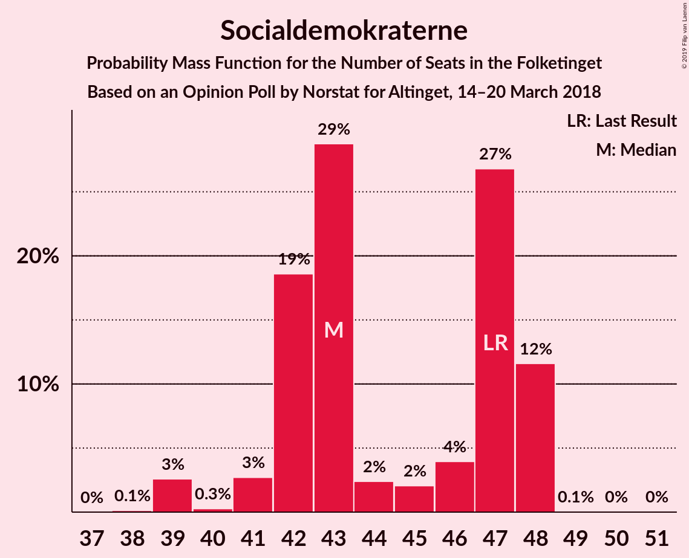
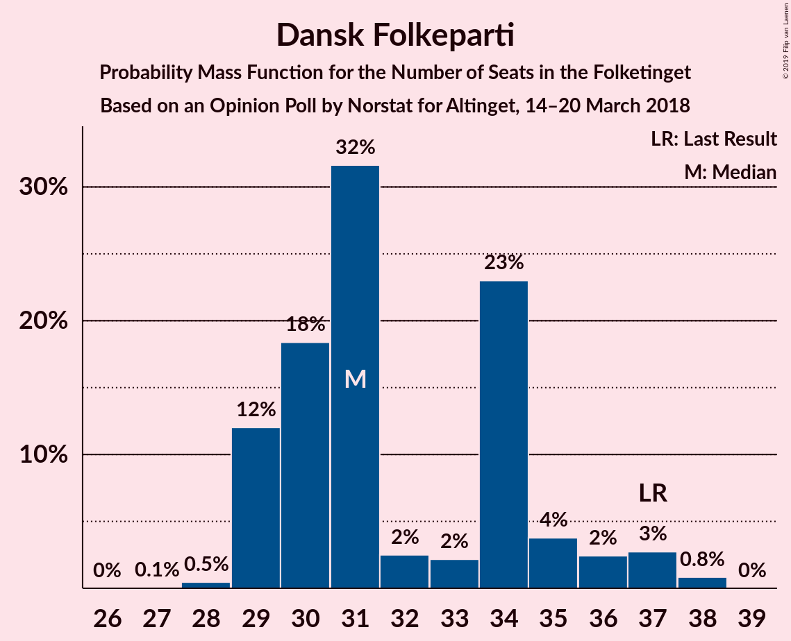
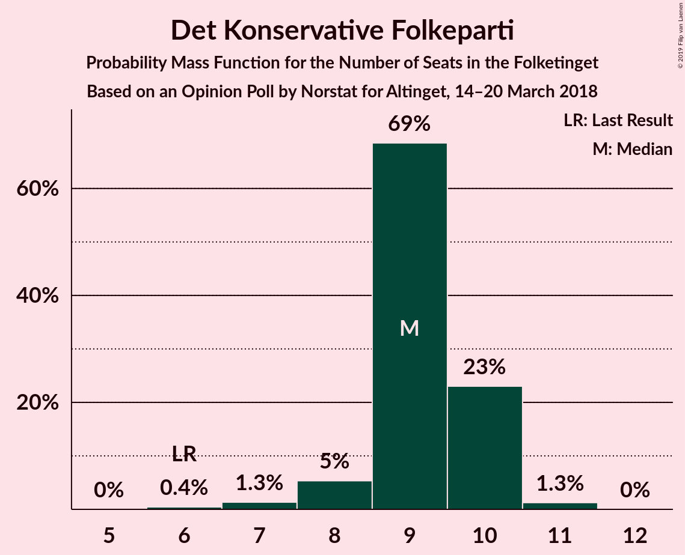
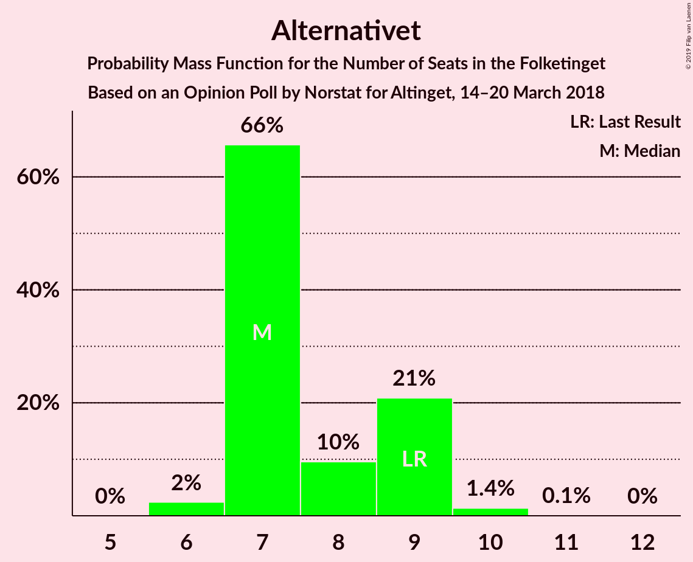
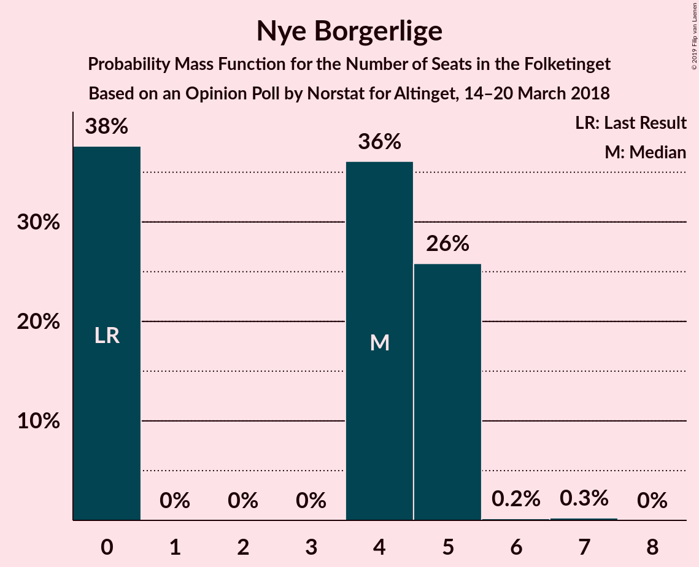

# Opinion Poll by Norstat for Altinget, 14–20 March 2018

<a href="#voting-intentions">Voting Intentions</a> | <a href="#seats">Seats</a> | <a href="#coalitions">Coalitions</a> | <a href="#technical-information">Technical Information</a>

## Voting Intentions

### Confidence Intervals

| Party | Last Result | Poll Result | 80% Confidence Interval | 90% Confidence Interval | 95% Confidence Interval | 99% Confidence Interval |
|:-----:|:-----------:|:-----------:|:-----------------------:|:-----------------------:|:-----------------------:|:-----------------------:|
| Socialdemokraterne | 26.3% | 25.0% | 23.6–26.5% |23.2–26.9% |22.8–27.2% |22.2–28.0% |
| Venstre | 19.5% | 19.3% | 18.1–20.7% |17.7–21.1% |17.4–21.4% |16.8–22.1% |
| Dansk Folkeparti | 21.1% | 18.5% | 17.3–19.9% |16.9–20.2% |16.6–20.6% |16.0–21.2% |
| Enhedslisten–De Rød-Grønne | 7.8% | 9.2% | 8.3–10.2% |8.0–10.5% |7.8–10.8% |7.4–11.3% |
| Radikale Venstre | 4.6% | 5.7% | 5.0–6.6% |4.8–6.8% |4.7–7.0% |4.3–7.5% |
| Socialistisk Folkeparti | 4.2% | 5.4% | 4.7–6.2% |4.5–6.5% |4.4–6.7% |4.1–7.1% |
| Det Konservative Folkeparti | 3.4% | 4.7% | 4.1–5.5% |3.9–5.7% |3.8–5.9% |3.5–6.3% |
| Alternativet | 4.8% | 4.6% | 4.0–5.4% |3.8–5.6% |3.6–5.8% |3.4–6.2% |
| Liberal Alliance | 7.5% | 4.3% | 3.7–5.1% |3.6–5.3% |3.4–5.5% |3.1–5.9% |
| Nye Borgerlige | 0.0% | 2.1% | 1.7–2.7% |1.6–2.9% |1.5–3.0% |1.3–3.3% |
| Kristendemokraterne | 0.8% | 0.6% | 0.4–0.9% |0.4–1.1% |0.3–1.1% |0.2–1.3% |

*Note:* The poll result column reflects the actual value used in the calculations. Published results may vary slightly, and in addition be rounded to fewer digits.

## Seats

### Confidence Intervals

| Party | Last Result | Median | 80% Confidence Interval | 90% Confidence Interval | 95% Confidence Interval | 99% Confidence Interval |
|:-----:|:-----------:|:------:|:-----------------------:|:-----------------------:|:-----------------------:|:-----------------------:|
| <a href="#socialdemokraterne">Socialdemokraterne</a> | 47 | 45 | 45 |45 |45–48 |45–48 |
| <a href="#venstre">Venstre</a> | 34 | 35 | 35 |35 |31–35 |31–35 |
| <a href="#dansk-folkeparti">Dansk Folkeparti</a> | 37 | 32 | 32 |32 |30–32 |30–32 |
| <a href="#enhedslisten–de-rød-grønne">Enhedslisten–De Rød-Grønne</a> | 14 | 14 | 14 |14 |14–15 |14–15 |
| <a href="#radikale-venstre">Radikale Venstre</a> | 8 | 9 | 9 |9 |9 |9–11 |
| <a href="#socialistisk-folkeparti">Socialistisk Folkeparti</a> | 7 | 13 | 13 |13 |13 |12–13 |
| <a href="#det-konservative-folkeparti">Det Konservative Folkeparti</a> | 6 | 5 | 5 |5 |5–7 |5–7 |
| <a href="#alternativet">Alternativet</a> | 9 | 10 | 10 |10 |10 |10 |
| <a href="#liberal-alliance">Liberal Alliance</a> | 13 | 8 | 8 |8 |6–8 |6–8 |
| <a href="#nye-borgerlige">Nye Borgerlige</a> | 0 | 4 | 4 |4 |4–6 |4–6 |
| <a href="#kristendemokraterne">Kristendemokraterne</a> | 0 | 0 | 0 |0 |0 |0 |

### Socialdemokraterne

*For a full overview of the results for this party, see the [Socialdemokraterne](party-socialdemokraterne.html) page.*

| Number of Seats | Probability | Accumulated | Special Marks |
|:---------------:|:-----------:|:-----------:|:-------------:|
| 38 | 0.1% | 100% |  |
| 39 | 0% | 99.9% |  |
| 40 | 0% | 99.9% |  |
| 41 | 0% | 99.9% |  |
| 42 | 0% | 99.9% |  |
| 43 | 0% | 99.9% |  |
| 44 | 0% | 99.9% |  |
| 45 | 97% | 99.9% | Median |
| 46 | 0.1% | 3% |  |
| 47 | 0.1% | 3% | Last Result |
| 48 | 3% | 3% |  |
| 49 | 0% | 0.1% |  |
| 50 | 0.1% | 0.1% |  |
| 51 | 0% | 0% |  |

### Venstre

*For a full overview of the results for this party, see the [Venstre](party-venstre.html) page.*

| Number of Seats | Probability | Accumulated | Special Marks |
|:---------------:|:-----------:|:-----------:|:-------------:|
| 29 | 0.1% | 100% |  |
| 30 | 0% | 99.9% |  |
| 31 | 3% | 99.8% |  |
| 32 | 0% | 97% |  |
| 33 | 0% | 97% |  |
| 34 | 0% | 97% | Last Result |
| 35 | 97% | 97% | Median |
| 36 | 0% | 0.1% |  |
| 37 | 0.1% | 0.1% |  |
| 38 | 0% | 0% |  |

### Dansk Folkeparti

*For a full overview of the results for this party, see the [Dansk Folkeparti](party-danskfolkeparti.html) page.*

| Number of Seats | Probability | Accumulated | Special Marks |
|:---------------:|:-----------:|:-----------:|:-------------:|
| 30 | 3% | 100% |  |
| 31 | 0% | 97% |  |
| 32 | 97% | 97% | Median |
| 33 | 0.1% | 0.4% |  |
| 34 | 0% | 0.3% |  |
| 35 | 0% | 0.3% |  |
| 36 | 0.1% | 0.3% |  |
| 37 | 0.2% | 0.2% | Last Result |
| 38 | 0% | 0% |  |

### Enhedslisten–De Rød-Grønne

*For a full overview of the results for this party, see the [Enhedslisten–De Rød-Grønne](party-enhedslisten–derød-grønne.html) page.*

| Number of Seats | Probability | Accumulated | Special Marks |
|:---------------:|:-----------:|:-----------:|:-------------:|
| 14 | 97% | 100% | Last Result, Median |
| 15 | 3% | 3% |  |
| 16 | 0% | 0.3% |  |
| 17 | 0.1% | 0.3% |  |
| 18 | 0.1% | 0.2% |  |
| 19 | 0% | 0% |  |

### Radikale Venstre

*For a full overview of the results for this party, see the [Radikale Venstre](party-radikalevenstre.html) page.*

| Number of Seats | Probability | Accumulated | Special Marks |
|:---------------:|:-----------:|:-----------:|:-------------:|
| 8 | 0% | 100% | Last Result |
| 9 | 99.4% | 100% | Median |
| 10 | 0% | 0.6% |  |
| 11 | 0.1% | 0.6% |  |
| 12 | 0.5% | 0.5% |  |
| 13 | 0% | 0% |  |

### Socialistisk Folkeparti

*For a full overview of the results for this party, see the [Socialistisk Folkeparti](party-socialistiskfolkeparti.html) page.*

| Number of Seats | Probability | Accumulated | Special Marks |
|:---------------:|:-----------:|:-----------:|:-------------:|
| 6 | 0.1% | 100% |  |
| 7 | 0% | 99.9% | Last Result |
| 8 | 0% | 99.9% |  |
| 9 | 0% | 99.9% |  |
| 10 | 0.1% | 99.8% |  |
| 11 | 0.2% | 99.8% |  |
| 12 | 0.1% | 99.6% |  |
| 13 | 99.4% | 99.5% | Median |
| 14 | 0% | 0% |  |

### Det Konservative Folkeparti

*For a full overview of the results for this party, see the [Det Konservative Folkeparti](party-detkonservativefolkeparti.html) page.*

| Number of Seats | Probability | Accumulated | Special Marks |
|:---------------:|:-----------:|:-----------:|:-------------:|
| 5 | 97% | 100% | Median |
| 6 | 0.1% | 3% | Last Result |
| 7 | 3% | 3% |  |
| 8 | 0.3% | 0.3% |  |
| 9 | 0% | 0% |  |

### Alternativet

*For a full overview of the results for this party, see the [Alternativet](party-alternativet.html) page.*

| Number of Seats | Probability | Accumulated | Special Marks |
|:---------------:|:-----------:|:-----------:|:-------------:|
| 6 | 0.1% | 100% |  |
| 7 | 0.3% | 99.9% |  |
| 8 | 0.1% | 99.6% |  |
| 9 | 0% | 99.5% | Last Result |
| 10 | 99.4% | 99.5% | Median |
| 11 | 0.1% | 0.1% |  |
| 12 | 0% | 0% |  |

### Liberal Alliance

*For a full overview of the results for this party, see the [Liberal Alliance](party-liberalalliance.html) page.*

| Number of Seats | Probability | Accumulated | Special Marks |
|:---------------:|:-----------:|:-----------:|:-------------:|
| 6 | 3% | 100% |  |
| 7 | 0% | 97% |  |
| 8 | 97% | 97% | Median |
| 9 | 0.1% | 0.2% |  |
| 10 | 0.1% | 0.1% |  |
| 11 | 0% | 0% |  |
| 12 | 0% | 0% |  |
| 13 | 0% | 0% | Last Result |

### Nye Borgerlige

*For a full overview of the results for this party, see the [Nye Borgerlige](party-nyeborgerlige.html) page.*

| Number of Seats | Probability | Accumulated | Special Marks |
|:---------------:|:-----------:|:-----------:|:-------------:|
| 0 | 0.3% | 100% | Last Result |
| 1 | 0% | 99.7% |  |
| 2 | 0% | 99.7% |  |
| 3 | 0% | 99.7% |  |
| 4 | 97% | 99.7% | Median |
| 5 | 0% | 3% |  |
| 6 | 3% | 3% |  |
| 7 | 0% | 0% |  |

### Kristendemokraterne

*For a full overview of the results for this party, see the [Kristendemokraterne](party-kristendemokraterne.html) page.*

| Number of Seats | Probability | Accumulated | Special Marks |
|:---------------:|:-----------:|:-----------:|:-------------:|
| 0 | 100% | 100% | Last Result, Median |

## Coalitions

### Confidence Intervals

| Coalition | Last Result | Median | Majority? | 80% Confidence Interval | 90% Confidence Interval | 95% Confidence Interval | 99% Confidence Interval |
|:---------:|:-----------:|:------:|:---------:|:-----------------------:|:-----------------------:|:-----------------------:|:-----------------------:|
| Socialdemokraterne – Enhedslisten–De Rød-Grønne – Radikale Venstre – Socialistisk Folkeparti – Alternativet | 85 | 91 | 99.8% | 91 | 91 | 91–95 | 91–95 |
| Socialdemokraterne – Enhedslisten–De Rød-Grønne – Radikale Venstre – Socialistisk Folkeparti | 76 | 81 | 0% | 81 | 81 | 81–85 | 81–85 |
| Venstre – Dansk Folkeparti – Det Konservative Folkeparti – Liberal Alliance – Nye Borgerlige – Kristendemokraterne | 90 | 84 | 0% | 84 | 84 | 80–84 | 80–84 |
| Venstre – Dansk Folkeparti – Det Konservative Folkeparti – Liberal Alliance – Nye Borgerlige | 90 | 84 | 0% | 84 | 84 | 80–84 | 80–84 |
| Venstre – Dansk Folkeparti – Det Konservative Folkeparti – Liberal Alliance – Kristendemokraterne | 90 | 80 | 0% | 80 | 80 | 74–80 | 74–80 |
| Venstre – Dansk Folkeparti – Det Konservative Folkeparti – Liberal Alliance | 90 | 80 | 0% | 80 | 80 | 74–80 | 74–80 |

### Socialdemokraterne – Enhedslisten–De Rød-Grønne – Radikale Venstre – Socialistisk Folkeparti – Alternativet

| Number of Seats | Probability | Accumulated | Special Marks |
|:---------------:|:-----------:|:-----------:|:-------------:|
| 85 | 0% | 100% | Last Result |
| 86 | 0.1% | 100% |  |
| 87 | 0% | 99.9% |  |
| 88 | 0% | 99.9% |  |
| 89 | 0.1% | 99.9% |  |
| 90 | 0% | 99.8% | Majority |
| 91 | 97% | 99.8% | Median |
| 92 | 0% | 3% |  |
| 93 | 0.2% | 3% |  |
| 94 | 0% | 3% |  |
| 95 | 3% | 3% |  |
| 96 | 0% | 0% |  |

### Socialdemokraterne – Enhedslisten–De Rød-Grønne – Radikale Venstre – Socialistisk Folkeparti

| Number of Seats | Probability | Accumulated | Special Marks |
|:---------------:|:-----------:|:-----------:|:-------------:|
| 75 | 0.1% | 100% |  |
| 76 | 0% | 99.9% | Last Result |
| 77 | 0% | 99.9% |  |
| 78 | 0% | 99.9% |  |
| 79 | 0% | 99.9% |  |
| 80 | 0% | 99.9% |  |
| 81 | 97% | 99.9% | Median |
| 82 | 0.1% | 3% |  |
| 83 | 0% | 3% |  |
| 84 | 0% | 3% |  |
| 85 | 3% | 3% |  |
| 86 | 0.1% | 0.2% |  |
| 87 | 0% | 0% |  |

### Venstre – Dansk Folkeparti – Det Konservative Folkeparti – Liberal Alliance – Nye Borgerlige – Kristendemokraterne

| Number of Seats | Probability | Accumulated | Special Marks |
|:---------------:|:-----------:|:-----------:|:-------------:|
| 80 | 3% | 100% |  |
| 81 | 0% | 97% |  |
| 82 | 0.2% | 97% |  |
| 83 | 0% | 97% |  |
| 84 | 97% | 97% | Median |
| 85 | 0% | 0.2% |  |
| 86 | 0.1% | 0.2% |  |
| 87 | 0% | 0.1% |  |
| 88 | 0% | 0.1% |  |
| 89 | 0.1% | 0.1% |  |
| 90 | 0% | 0% | Last Result, Majority |

### Venstre – Dansk Folkeparti – Det Konservative Folkeparti – Liberal Alliance – Nye Borgerlige

| Number of Seats | Probability | Accumulated | Special Marks |
|:---------------:|:-----------:|:-----------:|:-------------:|
| 80 | 3% | 100% |  |
| 81 | 0% | 97% |  |
| 82 | 0.2% | 97% |  |
| 83 | 0% | 97% |  |
| 84 | 97% | 97% | Median |
| 85 | 0% | 0.2% |  |
| 86 | 0.1% | 0.2% |  |
| 87 | 0% | 0.1% |  |
| 88 | 0% | 0.1% |  |
| 89 | 0.1% | 0.1% |  |
| 90 | 0% | 0% | Last Result, Majority |

### Venstre – Dansk Folkeparti – Det Konservative Folkeparti – Liberal Alliance – Kristendemokraterne

| Number of Seats | Probability | Accumulated | Special Marks |
|:---------------:|:-----------:|:-----------:|:-------------:|
| 74 | 3% | 100% |  |
| 75 | 0% | 97% |  |
| 76 | 0% | 97% |  |
| 77 | 0% | 97% |  |
| 78 | 0.1% | 97% |  |
| 79 | 0% | 97% |  |
| 80 | 97% | 97% | Median |
| 81 | 0% | 0.5% |  |
| 82 | 0.3% | 0.5% |  |
| 83 | 0.1% | 0.2% |  |
| 84 | 0.2% | 0.2% |  |
| 85 | 0% | 0% |  |
| 86 | 0% | 0% |  |
| 87 | 0% | 0% |  |
| 88 | 0% | 0% |  |
| 89 | 0% | 0% |  |
| 90 | 0% | 0% | Last Result, Majority |

### Venstre – Dansk Folkeparti – Det Konservative Folkeparti – Liberal Alliance

| Number of Seats | Probability | Accumulated | Special Marks |
|:---------------:|:-----------:|:-----------:|:-------------:|
| 74 | 3% | 100% |  |
| 75 | 0% | 97% |  |
| 76 | 0% | 97% |  |
| 77 | 0% | 97% |  |
| 78 | 0.1% | 97% |  |
| 79 | 0% | 97% |  |
| 80 | 97% | 97% | Median |
| 81 | 0% | 0.5% |  |
| 82 | 0.3% | 0.5% |  |
| 83 | 0.1% | 0.2% |  |
| 84 | 0.2% | 0.2% |  |
| 85 | 0% | 0% |  |
| 86 | 0% | 0% |  |
| 87 | 0% | 0% |  |
| 88 | 0% | 0% |  |
| 89 | 0% | 0% |  |
| 90 | 0% | 0% | Last Result, Majority |

## Technical Information

### Opinion Poll

+ **Polling firm:** Norstat
+ **Commissioner(s):** Altinget
+ **Fieldwork period:** 14–20 March 2018

### Calculations

+ **Sample size:** 1501
+ **Simulations done:** 1,024
+ **Error estimate:** 2.32%

