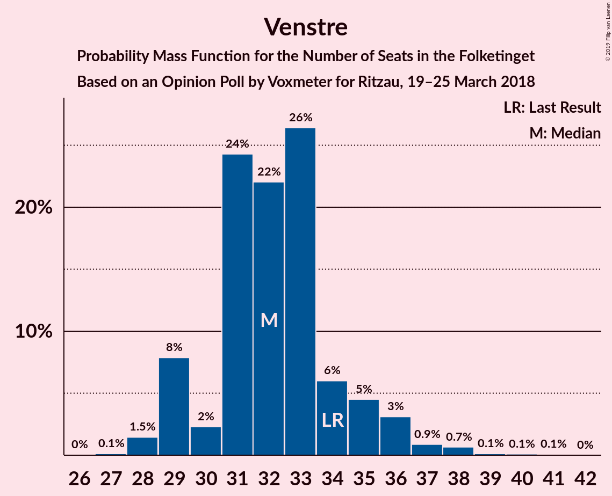
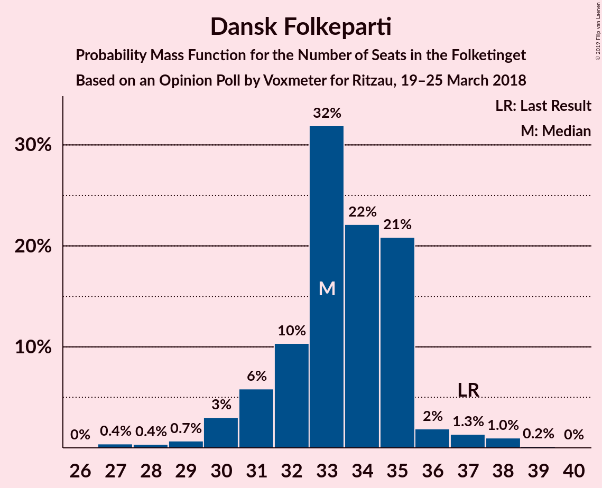
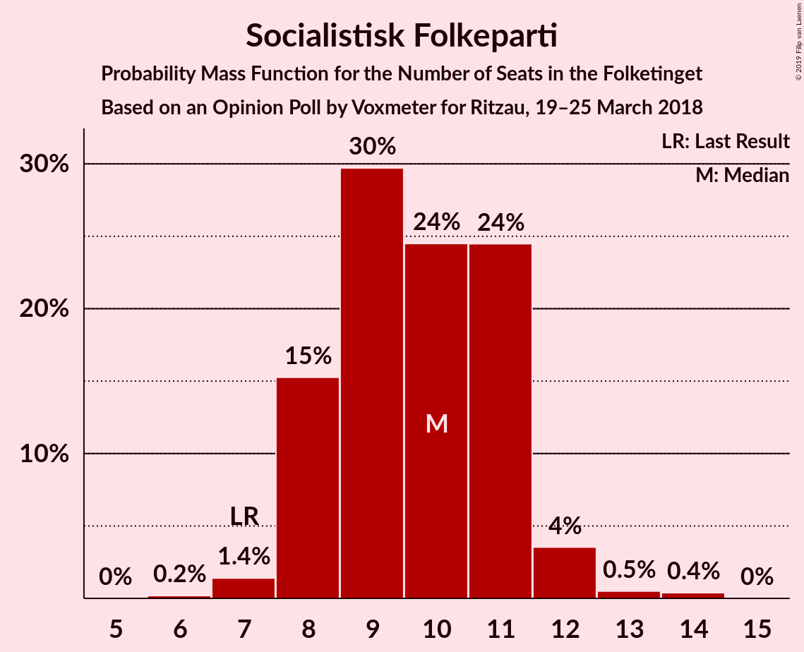
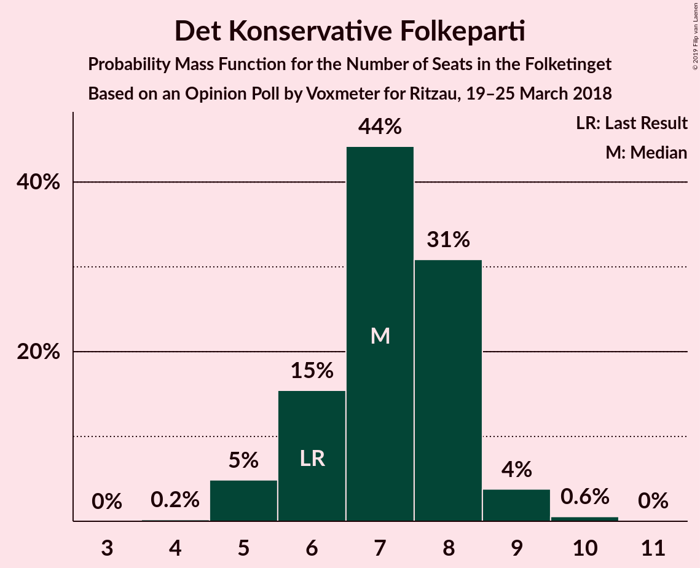
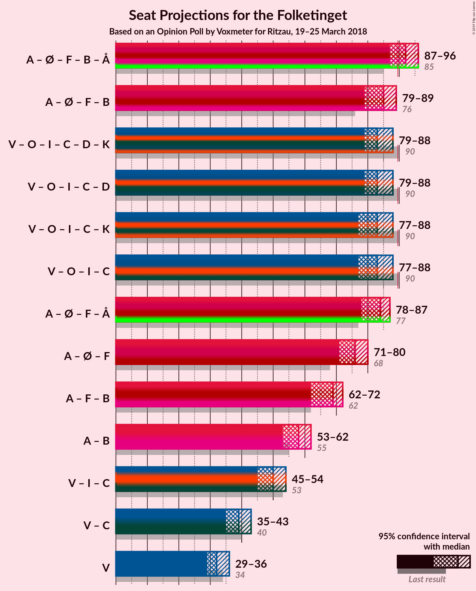

# Opinion Poll by Voxmeter for Ritzau, 19–25 March 2018

<a href="#voting-intentions">Voting Intentions</a> | <a href="#seats">Seats</a> | <a href="#coalitions">Coalitions</a> | <a href="#technical-information">Technical Information</a>

## Voting Intentions

### Confidence Intervals

| Party | Last Result | Poll Result | 80% Confidence Interval | 90% Confidence Interval | 95% Confidence Interval | 99% Confidence Interval |
|:-----:|:-----------:|:-----------:|:-----------------------:|:-----------------------:|:-----------------------:|:-----------------------:|
| Socialdemokraterne | 26.3% | 27.1% | 25.4–28.9% |24.9–29.5% |24.5–29.9% |23.7–30.8% |
| Venstre | 19.5% | 18.5% | 17.0–20.1% |16.6–20.6% |16.2–21.0% |15.5–21.8% |
| Dansk Folkeparti | 21.1% | 18.4% | 16.9–20.0% |16.5–20.5% |16.1–20.9% |15.4–21.7% |
| Enhedslisten–De Rød-Grønne | 7.8% | 9.6% | 8.5–10.9% |8.2–11.2% |7.9–11.6% |7.4–12.2% |
| Liberal Alliance | 7.5% | 5.6% | 4.8–6.6% |4.5–6.9% |4.3–7.2% |4.0–7.7% |
| Socialistisk Folkeparti | 4.2% | 5.4% | 4.6–6.4% |4.3–6.7% |4.2–7.0% |3.8–7.5% |
| Radikale Venstre | 4.6% | 4.9% | 4.1–5.9% |3.9–6.2% |3.7–6.4% |3.4–6.9% |
| Alternativet | 4.8% | 3.9% | 3.2–4.8% |3.0–5.1% |2.9–5.3% |2.6–5.8% |
| Det Konservative Folkeparti | 3.4% | 3.7% | 3.1–4.6% |2.9–4.8% |2.7–5.1% |2.4–5.5% |
| Nye Borgerlige | 0.0% | 1.3% | 0.9–1.9% |0.8–2.0% |0.7–2.2% |0.6–2.5% |
| Kristendemokraterne | 0.8% | 1.1% | 0.8–1.6% |0.7–1.8% |0.6–1.9% |0.5–2.2% |

*Note:* The poll result column reflects the actual value used in the calculations. Published results may vary slightly, and in addition be rounded to fewer digits.

## Seats

### Confidence Intervals

| Party | Last Result | Median | 80% Confidence Interval | 90% Confidence Interval | 95% Confidence Interval | 99% Confidence Interval |
|:-----:|:-----------:|:------:|:-----------------------:|:-----------------------:|:-----------------------:|:-----------------------:|
| <a href="#socialdemokraterne">Socialdemokraterne</a> | 47 | 47 | 47–54 |47–54 |47–54 |47–54 |
| <a href="#venstre">Venstre</a> | 34 | 36 | 33–36 |33–36 |33–36 |33–36 |
| <a href="#dansk-folkeparti">Dansk Folkeparti</a> | 37 | 35 | 29–35 |29–35 |29–35 |29–35 |
| <a href="#enhedslisten–de-rød-grønne">Enhedslisten–De Rød-Grønne</a> | 14 | 20 | 18–20 |18–20 |18–20 |18–20 |
| <a href="#liberal-alliance">Liberal Alliance</a> | 13 | 8 | 8–9 |8–9 |8–9 |8–9 |
| <a href="#socialistisk-folkeparti">Socialistisk Folkeparti</a> | 7 | 10 | 10–12 |10–12 |10–12 |10–12 |
| <a href="#radikale-venstre">Radikale Venstre</a> | 8 | 7 | 7–8 |7–8 |7–8 |7–8 |
| <a href="#alternativet">Alternativet</a> | 9 | 6 | 6–7 |6–7 |6–7 |6–7 |
| <a href="#det-konservative-folkeparti">Det Konservative Folkeparti</a> | 6 | 6 | 5–6 |5–6 |5–6 |5–6 |
| <a href="#nye-borgerlige">Nye Borgerlige</a> | 0 | 0 | 0 |0 |0 |0 |
| <a href="#kristendemokraterne">Kristendemokraterne</a> | 0 | 0 | 0 |0 |0 |0 |

### Socialdemokraterne

*For a full overview of the results for this party, see the [Socialdemokraterne](party-socialdemokraterne.html) page.*

| Number of Seats | Probability | Accumulated | Special Marks |
|:---------------:|:-----------:|:-----------:|:-------------:|
| 47 | 89% | 100% | Last Result, Median |
| 48 | 0% | 11% |  |
| 49 | 0% | 11% |  |
| 50 | 0% | 11% |  |
| 51 | 0% | 11% |  |
| 52 | 0% | 11% |  |
| 53 | 0% | 11% |  |
| 54 | 11% | 11% |  |
| 55 | 0% | 0% |  |

### Venstre

*For a full overview of the results for this party, see the [Venstre](party-venstre.html) page.*

| Number of Seats | Probability | Accumulated | Special Marks |
|:---------------:|:-----------:|:-----------:|:-------------:|
| 33 | 11% | 100% |  |
| 34 | 0% | 89% | Last Result |
| 35 | 0% | 89% |  |
| 36 | 89% | 89% | Median |
| 37 | 0% | 0% |  |

### Dansk Folkeparti

*For a full overview of the results for this party, see the [Dansk Folkeparti](party-danskfolkeparti.html) page.*

| Number of Seats | Probability | Accumulated | Special Marks |
|:---------------:|:-----------:|:-----------:|:-------------:|
| 29 | 11% | 100% |  |
| 30 | 0% | 89% |  |
| 31 | 0% | 89% |  |
| 32 | 0% | 89% |  |
| 33 | 0% | 89% |  |
| 34 | 0% | 89% |  |
| 35 | 89% | 89% | Median |
| 36 | 0% | 0% |  |
| 37 | 0% | 0% | Last Result |

### Enhedslisten–De Rød-Grønne

*For a full overview of the results for this party, see the [Enhedslisten–De Rød-Grønne](party-enhedslisten–derød-grønne.html) page.*

| Number of Seats | Probability | Accumulated | Special Marks |
|:---------------:|:-----------:|:-----------:|:-------------:|
| 14 | 0% | 100% | Last Result |
| 15 | 0% | 100% |  |
| 16 | 0% | 100% |  |
| 17 | 0% | 100% |  |
| 18 | 11% | 100% |  |
| 19 | 0% | 89% |  |
| 20 | 89% | 89% | Median |
| 21 | 0% | 0% |  |

### Liberal Alliance

*For a full overview of the results for this party, see the [Liberal Alliance](party-liberalalliance.html) page.*

| Number of Seats | Probability | Accumulated | Special Marks |
|:---------------:|:-----------:|:-----------:|:-------------:|
| 8 | 89% | 100% | Median |
| 9 | 11% | 11% |  |
| 10 | 0% | 0% |  |
| 11 | 0% | 0% |  |
| 12 | 0% | 0% |  |
| 13 | 0% | 0% | Last Result |

### Socialistisk Folkeparti

*For a full overview of the results for this party, see the [Socialistisk Folkeparti](party-socialistiskfolkeparti.html) page.*

| Number of Seats | Probability | Accumulated | Special Marks |
|:---------------:|:-----------:|:-----------:|:-------------:|
| 7 | 0% | 100% | Last Result |
| 8 | 0% | 100% |  |
| 9 | 0% | 100% |  |
| 10 | 89% | 100% | Median |
| 11 | 0% | 11% |  |
| 12 | 11% | 11% |  |
| 13 | 0% | 0% |  |

### Radikale Venstre

*For a full overview of the results for this party, see the [Radikale Venstre](party-radikalevenstre.html) page.*

| Number of Seats | Probability | Accumulated | Special Marks |
|:---------------:|:-----------:|:-----------:|:-------------:|
| 7 | 89% | 100% | Median |
| 8 | 11% | 11% | Last Result |
| 9 | 0% | 0% |  |

### Alternativet

*For a full overview of the results for this party, see the [Alternativet](party-alternativet.html) page.*

| Number of Seats | Probability | Accumulated | Special Marks |
|:---------------:|:-----------:|:-----------:|:-------------:|
| 6 | 89% | 100% | Median |
| 7 | 11% | 11% |  |
| 8 | 0% | 0% |  |
| 9 | 0% | 0% | Last Result |

### Det Konservative Folkeparti

*For a full overview of the results for this party, see the [Det Konservative Folkeparti](party-detkonservativefolkeparti.html) page.*

| Number of Seats | Probability | Accumulated | Special Marks |
|:---------------:|:-----------:|:-----------:|:-------------:|
| 5 | 11% | 100% |  |
| 6 | 89% | 89% | Last Result, Median |
| 7 | 0% | 0% |  |

### Nye Borgerlige

*For a full overview of the results for this party, see the [Nye Borgerlige](party-nyeborgerlige.html) page.*

| Number of Seats | Probability | Accumulated | Special Marks |
|:---------------:|:-----------:|:-----------:|:-------------:|
| 0 | 100% | 100% | Last Result, Median |

### Kristendemokraterne

*For a full overview of the results for this party, see the [Kristendemokraterne](party-kristendemokraterne.html) page.*

| Number of Seats | Probability | Accumulated | Special Marks |
|:---------------:|:-----------:|:-----------:|:-------------:|
| 0 | 100% | 100% | Last Result, Median |

## Coalitions

### Confidence Intervals

| Coalition | Last Result | Median | Majority? | 80% Confidence Interval | 90% Confidence Interval | 95% Confidence Interval | 99% Confidence Interval |
|:---------:|:-----------:|:------:|:---------:|:-----------------------:|:-----------------------:|:-----------------------:|:-----------------------:|
| Socialdemokraterne – Enhedslisten–De Rød-Grønne – Socialistisk Folkeparti – Radikale Venstre – Alternativet | 85 | 90 | 100% | 90–99 | 90–99 | 90–99 | 90–99 |
| Socialdemokraterne – Enhedslisten–De Rød-Grønne – Socialistisk Folkeparti – Radikale Venstre | 76 | 84 | 11% | 84–92 | 84–92 | 84–92 | 84–92 |
| Venstre – Dansk Folkeparti – Liberal Alliance – Det Konservative Folkeparti – Nye Borgerlige – Kristendemokraterne | 90 | 85 | 0% | 76–85 | 76–85 | 76–85 | 76–85 |
| Venstre – Dansk Folkeparti – Liberal Alliance – Det Konservative Folkeparti – Kristendemokraterne | 90 | 85 | 0% | 76–85 | 76–85 | 76–85 | 76–85 |
| Venstre – Dansk Folkeparti – Liberal Alliance – Det Konservative Folkeparti – Nye Borgerlige | 90 | 85 | 0% | 76–85 | 76–85 | 76–85 | 76–85 |
| Venstre – Dansk Folkeparti – Liberal Alliance – Det Konservative Folkeparti | 90 | 85 | 0% | 76–85 | 76–85 | 76–85 | 76–85 |

### Socialdemokraterne – Enhedslisten–De Rød-Grønne – Socialistisk Folkeparti – Radikale Venstre – Alternativet

| Number of Seats | Probability | Accumulated | Special Marks |
|:---------------:|:-----------:|:-----------:|:-------------:|
| 85 | 0% | 100% | Last Result |
| 86 | 0% | 100% |  |
| 87 | 0% | 100% |  |
| 88 | 0% | 100% |  |
| 89 | 0% | 100% |  |
| 90 | 89% | 100% | Median, Majority |
| 91 | 0% | 11% |  |
| 92 | 0% | 11% |  |
| 93 | 0% | 11% |  |
| 94 | 0% | 11% |  |
| 95 | 0% | 11% |  |
| 96 | 0% | 11% |  |
| 97 | 0% | 11% |  |
| 98 | 0% | 11% |  |
| 99 | 11% | 11% |  |
| 100 | 0% | 0% |  |

### Socialdemokraterne – Enhedslisten–De Rød-Grønne – Socialistisk Folkeparti – Radikale Venstre

| Number of Seats | Probability | Accumulated | Special Marks |
|:---------------:|:-----------:|:-----------:|:-------------:|
| 76 | 0% | 100% | Last Result |
| 77 | 0% | 100% |  |
| 78 | 0% | 100% |  |
| 79 | 0% | 100% |  |
| 80 | 0% | 100% |  |
| 81 | 0% | 100% |  |
| 82 | 0% | 100% |  |
| 83 | 0% | 100% |  |
| 84 | 89% | 100% | Median |
| 85 | 0% | 11% |  |
| 86 | 0% | 11% |  |
| 87 | 0% | 11% |  |
| 88 | 0% | 11% |  |
| 89 | 0% | 11% |  |
| 90 | 0% | 11% | Majority |
| 91 | 0% | 11% |  |
| 92 | 11% | 11% |  |
| 93 | 0% | 0% |  |

### Venstre – Dansk Folkeparti – Liberal Alliance – Det Konservative Folkeparti – Nye Borgerlige – Kristendemokraterne

| Number of Seats | Probability | Accumulated | Special Marks |
|:---------------:|:-----------:|:-----------:|:-------------:|
| 76 | 11% | 100% |  |
| 77 | 0% | 89% |  |
| 78 | 0% | 89% |  |
| 79 | 0% | 89% |  |
| 80 | 0% | 89% |  |
| 81 | 0% | 89% |  |
| 82 | 0% | 89% |  |
| 83 | 0% | 89% |  |
| 84 | 0% | 89% |  |
| 85 | 89% | 89% | Median |
| 86 | 0% | 0% |  |
| 87 | 0% | 0% |  |
| 88 | 0% | 0% |  |
| 89 | 0% | 0% |  |
| 90 | 0% | 0% | Last Result, Majority |

### Venstre – Dansk Folkeparti – Liberal Alliance – Det Konservative Folkeparti – Kristendemokraterne

| Number of Seats | Probability | Accumulated | Special Marks |
|:---------------:|:-----------:|:-----------:|:-------------:|
| 76 | 11% | 100% |  |
| 77 | 0% | 89% |  |
| 78 | 0% | 89% |  |
| 79 | 0% | 89% |  |
| 80 | 0% | 89% |  |
| 81 | 0% | 89% |  |
| 82 | 0% | 89% |  |
| 83 | 0% | 89% |  |
| 84 | 0% | 89% |  |
| 85 | 89% | 89% | Median |
| 86 | 0% | 0% |  |
| 87 | 0% | 0% |  |
| 88 | 0% | 0% |  |
| 89 | 0% | 0% |  |
| 90 | 0% | 0% | Last Result, Majority |

### Venstre – Dansk Folkeparti – Liberal Alliance – Det Konservative Folkeparti – Nye Borgerlige

| Number of Seats | Probability | Accumulated | Special Marks |
|:---------------:|:-----------:|:-----------:|:-------------:|
| 76 | 11% | 100% |  |
| 77 | 0% | 89% |  |
| 78 | 0% | 89% |  |
| 79 | 0% | 89% |  |
| 80 | 0% | 89% |  |
| 81 | 0% | 89% |  |
| 82 | 0% | 89% |  |
| 83 | 0% | 89% |  |
| 84 | 0% | 89% |  |
| 85 | 89% | 89% | Median |
| 86 | 0% | 0% |  |
| 87 | 0% | 0% |  |
| 88 | 0% | 0% |  |
| 89 | 0% | 0% |  |
| 90 | 0% | 0% | Last Result, Majority |

### Venstre – Dansk Folkeparti – Liberal Alliance – Det Konservative Folkeparti

| Number of Seats | Probability | Accumulated | Special Marks |
|:---------------:|:-----------:|:-----------:|:-------------:|
| 76 | 11% | 100% |  |
| 77 | 0% | 89% |  |
| 78 | 0% | 89% |  |
| 79 | 0% | 89% |  |
| 80 | 0% | 89% |  |
| 81 | 0% | 89% |  |
| 82 | 0% | 89% |  |
| 83 | 0% | 89% |  |
| 84 | 0% | 89% |  |
| 85 | 89% | 89% | Median |
| 86 | 0% | 0% |  |
| 87 | 0% | 0% |  |
| 88 | 0% | 0% |  |
| 89 | 0% | 0% |  |
| 90 | 0% | 0% | Last Result, Majority |

## Technical Information

### Opinion Poll

+ **Polling firm:** Voxmeter
+ **Commissioner(s):** Ritzau
+ **Fieldwork period:** 19–25 March 2018

### Calculations

+ **Sample size:** 1022
+ **Simulations done:** 1,024
+ **Error estimate:** 5.69%

