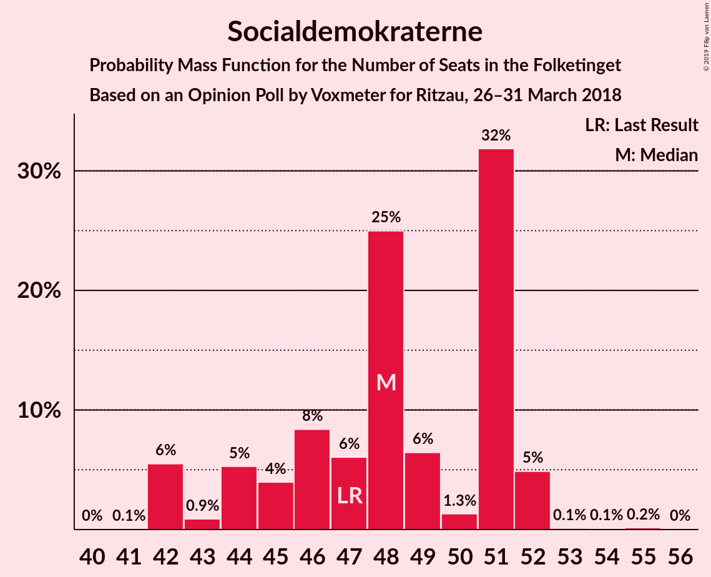
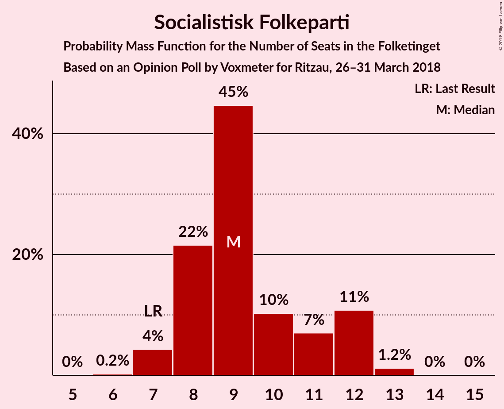

# Opinion Poll by Voxmeter for Ritzau, 26–31 March 2018

<a href="#voting-intentions">Voting Intentions</a> | <a href="#seats">Seats</a> | <a href="#coalitions">Coalitions</a> | <a href="#technical-information">Technical Information</a>

## Voting Intentions

### Confidence Intervals

| Party | Last Result | Poll Result | 80% Confidence Interval | 90% Confidence Interval | 95% Confidence Interval | 99% Confidence Interval |
|:-----:|:-----------:|:-----------:|:-----------------------:|:-----------------------:|:-----------------------:|:-----------------------:|
| Socialdemokraterne | 26.3% | 26.7% | 25.0–28.5% |24.5–29.1% |24.1–29.5% |23.3–30.4% |
| Venstre | 19.5% | 19.1% | 17.6–20.7% |17.1–21.2% |16.8–21.6% |16.1–22.4% |
| Dansk Folkeparti | 21.1% | 18.1% | 16.6–19.7% |16.2–20.2% |15.9–20.6% |15.2–21.4% |
| Enhedslisten–De Rød-Grønne | 7.8% | 9.4% | 8.3–10.7% |8.0–11.0% |7.8–11.3% |7.3–12.0% |
| Radikale Venstre | 4.6% | 5.6% | 4.8–6.6% |4.6–6.9% |4.4–7.2% |4.0–7.7% |
| Socialistisk Folkeparti | 4.2% | 5.3% | 4.5–6.3% |4.3–6.6% |4.1–6.9% |3.7–7.4% |
| Liberal Alliance | 7.5% | 4.9% | 4.2–5.9% |3.9–6.2% |3.8–6.4% |3.4–6.9% |
| Det Konservative Folkeparti | 3.4% | 4.7% | 4.0–5.7% |3.8–6.0% |3.6–6.2% |3.3–6.7% |
| Alternativet | 4.8% | 4.1% | 3.4–5.0% |3.2–5.2% |3.0–5.5% |2.7–5.9% |
| Nye Borgerlige | 0.0% | 1.3% | 0.9–1.8% |0.8–2.0% |0.7–2.1% |0.6–2.5% |
| Kristendemokraterne | 0.8% | 0.8% | 0.5–1.3% |0.4–1.4% |0.4–1.5% |0.3–1.8% |

*Note:* The poll result column reflects the actual value used in the calculations. Published results may vary slightly, and in addition be rounded to fewer digits.

## Seats

### Confidence Intervals

| Party | Last Result | Median | 80% Confidence Interval | 90% Confidence Interval | 95% Confidence Interval | 99% Confidence Interval |
|:-----:|:-----------:|:------:|:-----------------------:|:-----------------------:|:-----------------------:|:-----------------------:|
| <a href="#socialdemokraterne">Socialdemokraterne</a> | 47 | 48 | 48 |47–48 |47–48 |42–55 |
| <a href="#venstre">Venstre</a> | 34 | 39 | 39 |33–39 |30–39 |30–39 |
| <a href="#dansk-folkeparti">Dansk Folkeparti</a> | 37 | 33 | 33 |33 |31–33 |25–36 |
| <a href="#enhedslisten–de-rød-grønne">Enhedslisten–De Rød-Grønne</a> | 14 | 14 | 14 |14–16 |14–17 |13–20 |
| <a href="#radikale-venstre">Radikale Venstre</a> | 8 | 13 | 13 |8–13 |8–13 |8–13 |
| <a href="#socialistisk-folkeparti">Socialistisk Folkeparti</a> | 7 | 9 | 9 |9–14 |9–15 |7–15 |
| <a href="#liberal-alliance">Liberal Alliance</a> | 13 | 8 | 8 |8–10 |8–11 |7–11 |
| <a href="#det-konservative-folkeparti">Det Konservative Folkeparti</a> | 6 | 5 | 5 |5–9 |5–9 |5–15 |
| <a href="#alternativet">Alternativet</a> | 9 | 6 | 6 |6 |5–7 |5–8 |
| <a href="#nye-borgerlige">Nye Borgerlige</a> | 0 | 0 | 0 |0 |0 |0–7 |
| <a href="#kristendemokraterne">Kristendemokraterne</a> | 0 | 0 | 0 |0 |0 |0 |

### Socialdemokraterne

*For a full overview of the results for this party, see the [Socialdemokraterne](party-socialdemokraterne.html) page.*

| Number of Seats | Probability | Accumulated | Special Marks |
|:---------------:|:-----------:|:-----------:|:-------------:|
| 42 | 0.7% | 100% |  |
| 43 | 0% | 99.3% |  |
| 44 | 1.4% | 99.3% |  |
| 45 | 0% | 98% |  |
| 46 | 0.1% | 98% |  |
| 47 | 3% | 98% | Last Result |
| 48 | 93% | 95% | Median |
| 49 | 0% | 2% |  |
| 50 | 0.1% | 2% |  |
| 51 | 0% | 2% |  |
| 52 | 0% | 2% |  |
| 53 | 0% | 2% |  |
| 54 | 0.1% | 2% |  |
| 55 | 2% | 2% |  |
| 56 | 0% | 0% |  |

### Venstre

*For a full overview of the results for this party, see the [Venstre](party-venstre.html) page.*

| Number of Seats | Probability | Accumulated | Special Marks |
|:---------------:|:-----------:|:-----------:|:-------------:|
| 30 | 3% | 100% |  |
| 31 | 0% | 97% |  |
| 32 | 1.4% | 97% |  |
| 33 | 3% | 95% |  |
| 34 | 0.1% | 93% | Last Result |
| 35 | 0% | 93% |  |
| 36 | 0% | 93% |  |
| 37 | 0% | 93% |  |
| 38 | 0% | 93% |  |
| 39 | 93% | 93% | Median |
| 40 | 0% | 0% |  |

### Dansk Folkeparti

*For a full overview of the results for this party, see the [Dansk Folkeparti](party-danskfolkeparti.html) page.*

| Number of Seats | Probability | Accumulated | Special Marks |
|:---------------:|:-----------:|:-----------:|:-------------:|
| 25 | 2% | 100% |  |
| 26 | 0.1% | 98% |  |
| 27 | 0% | 98% |  |
| 28 | 0% | 98% |  |
| 29 | 0% | 98% |  |
| 30 | 0% | 98% |  |
| 31 | 1.4% | 98% |  |
| 32 | 0% | 97% |  |
| 33 | 96% | 97% | Median |
| 34 | 0.1% | 0.8% |  |
| 35 | 0% | 0.7% |  |
| 36 | 0.7% | 0.7% |  |
| 37 | 0% | 0% | Last Result |

### Enhedslisten–De Rød-Grønne

*For a full overview of the results for this party, see the [Enhedslisten–De Rød-Grønne](party-enhedslisten–derød-grønne.html) page.*

| Number of Seats | Probability | Accumulated | Special Marks |
|:---------------:|:-----------:|:-----------:|:-------------:|
| 13 | 2% | 100% |  |
| 14 | 93% | 98% | Last Result, Median |
| 15 | 0.1% | 6% |  |
| 16 | 0.7% | 5% |  |
| 17 | 3% | 5% |  |
| 18 | 0% | 2% |  |
| 19 | 0.1% | 2% |  |
| 20 | 1.5% | 1.5% |  |
| 21 | 0% | 0% |  |

### Radikale Venstre

*For a full overview of the results for this party, see the [Radikale Venstre](party-radikalevenstre.html) page.*

| Number of Seats | Probability | Accumulated | Special Marks |
|:---------------:|:-----------:|:-----------:|:-------------:|
| 7 | 0.1% | 100% |  |
| 8 | 5% | 99.9% | Last Result |
| 9 | 0.7% | 95% |  |
| 10 | 0.1% | 94% |  |
| 11 | 0% | 94% |  |
| 12 | 2% | 94% |  |
| 13 | 93% | 93% | Median |
| 14 | 0% | 0% |  |

### Socialistisk Folkeparti

*For a full overview of the results for this party, see the [Socialistisk Folkeparti](party-socialistiskfolkeparti.html) page.*

| Number of Seats | Probability | Accumulated | Special Marks |
|:---------------:|:-----------:|:-----------:|:-------------:|
| 7 | 2% | 100% | Last Result |
| 8 | 0% | 98% |  |
| 9 | 93% | 98% | Median |
| 10 | 0% | 5% |  |
| 11 | 0% | 5% |  |
| 12 | 0% | 5% |  |
| 13 | 0% | 5% |  |
| 14 | 2% | 5% |  |
| 15 | 3% | 3% |  |
| 16 | 0% | 0% |  |

### Liberal Alliance

*For a full overview of the results for this party, see the [Liberal Alliance](party-liberalalliance.html) page.*

| Number of Seats | Probability | Accumulated | Special Marks |
|:---------------:|:-----------:|:-----------:|:-------------:|
| 7 | 2% | 100% |  |
| 8 | 93% | 98% | Median |
| 9 | 0% | 5% |  |
| 10 | 2% | 5% |  |
| 11 | 3% | 3% |  |
| 12 | 0% | 0.1% |  |
| 13 | 0% | 0% | Last Result |

### Det Konservative Folkeparti

*For a full overview of the results for this party, see the [Det Konservative Folkeparti](party-detkonservativefolkeparti.html) page.*

| Number of Seats | Probability | Accumulated | Special Marks |
|:---------------:|:-----------:|:-----------:|:-------------:|
| 5 | 93% | 100% | Median |
| 6 | 0% | 7% | Last Result |
| 7 | 0.1% | 7% |  |
| 8 | 0% | 7% |  |
| 9 | 5% | 7% |  |
| 10 | 0.7% | 2% |  |
| 11 | 0% | 2% |  |
| 12 | 0.1% | 2% |  |
| 13 | 0% | 1.4% |  |
| 14 | 0% | 1.4% |  |
| 15 | 1.4% | 1.4% |  |
| 16 | 0% | 0% |  |

### Alternativet

*For a full overview of the results for this party, see the [Alternativet](party-alternativet.html) page.*

| Number of Seats | Probability | Accumulated | Special Marks |
|:---------------:|:-----------:|:-----------:|:-------------:|
| 5 | 3% | 100% |  |
| 6 | 93% | 97% | Median |
| 7 | 2% | 4% |  |
| 8 | 2% | 2% |  |
| 9 | 0% | 0.1% | Last Result |
| 10 | 0.1% | 0.1% |  |
| 11 | 0% | 0% |  |

### Nye Borgerlige

*For a full overview of the results for this party, see the [Nye Borgerlige](party-nyeborgerlige.html) page.*

| Number of Seats | Probability | Accumulated | Special Marks |
|:---------------:|:-----------:|:-----------:|:-------------:|
| 0 | 99.2% | 100% | Last Result, Median |
| 1 | 0% | 0.8% |  |
| 2 | 0% | 0.8% |  |
| 3 | 0% | 0.8% |  |
| 4 | 0.1% | 0.8% |  |
| 5 | 0% | 0.7% |  |
| 6 | 0% | 0.7% |  |
| 7 | 0.7% | 0.7% |  |
| 8 | 0% | 0% |  |

### Kristendemokraterne

*For a full overview of the results for this party, see the [Kristendemokraterne](party-kristendemokraterne.html) page.*

| Number of Seats | Probability | Accumulated | Special Marks |
|:---------------:|:-----------:|:-----------:|:-------------:|
| 0 | 100% | 100% | Last Result, Median |

## Coalitions

### Confidence Intervals

| Coalition | Last Result | Median | Majority? | 80% Confidence Interval | 90% Confidence Interval | 95% Confidence Interval | 99% Confidence Interval |
|:---------:|:-----------:|:------:|:---------:|:-----------------------:|:-----------------------:|:-----------------------:|:-----------------------:|
| Socialdemokraterne – Enhedslisten–De Rød-Grønne – Radikale Venstre – Socialistisk Folkeparti – Alternativet | 85 | 90 | 99.3% | 90 | 90–92 | 90–92 | 81–98 |
| Socialdemokraterne – Enhedslisten–De Rød-Grønne – Radikale Venstre – Socialistisk Folkeparti | 76 | 84 | 2% | 84 | 84–87 | 84–87 | 74–90 |
| Venstre – Dansk Folkeparti – Liberal Alliance – Det Konservative Folkeparti – Nye Borgerlige – Kristendemokraterne | 90 | 85 | 0.7% | 85 | 83–85 | 83–85 | 77–94 |
| Venstre – Dansk Folkeparti – Liberal Alliance – Det Konservative Folkeparti – Kristendemokraterne | 90 | 85 | 0% | 85 | 83–85 | 83–85 | 77–87 |
| Venstre – Dansk Folkeparti – Liberal Alliance – Det Konservative Folkeparti – Nye Borgerlige | 90 | 85 | 0.7% | 85 | 83–85 | 83–85 | 77–94 |
| Venstre – Dansk Folkeparti – Liberal Alliance – Det Konservative Folkeparti | 90 | 85 | 0% | 85 | 83–85 | 83–85 | 77–87 |

### Socialdemokraterne – Enhedslisten–De Rød-Grønne – Radikale Venstre – Socialistisk Folkeparti – Alternativet

| Number of Seats | Probability | Accumulated | Special Marks |
|:---------------:|:-----------:|:-----------:|:-------------:|
| 81 | 0.7% | 100% |  |
| 82 | 0% | 99.3% |  |
| 83 | 0% | 99.3% |  |
| 84 | 0% | 99.3% |  |
| 85 | 0% | 99.3% | Last Result |
| 86 | 0% | 99.3% |  |
| 87 | 0% | 99.3% |  |
| 88 | 0% | 99.3% |  |
| 89 | 0% | 99.3% |  |
| 90 | 94% | 99.3% | Median, Majority |
| 91 | 0% | 5% |  |
| 92 | 3% | 5% |  |
| 93 | 0.1% | 2% |  |
| 94 | 0% | 2% |  |
| 95 | 0% | 2% |  |
| 96 | 0% | 2% |  |
| 97 | 0% | 2% |  |
| 98 | 2% | 2% |  |
| 99 | 0% | 0.1% |  |
| 100 | 0% | 0.1% |  |
| 101 | 0% | 0.1% |  |
| 102 | 0.1% | 0.1% |  |
| 103 | 0% | 0% |  |

### Socialdemokraterne – Enhedslisten–De Rød-Grønne – Radikale Venstre – Socialistisk Folkeparti

| Number of Seats | Probability | Accumulated | Special Marks |
|:---------------:|:-----------:|:-----------:|:-------------:|
| 74 | 0.7% | 100% |  |
| 75 | 0% | 99.3% |  |
| 76 | 0% | 99.3% | Last Result |
| 77 | 0% | 99.3% |  |
| 78 | 0% | 99.3% |  |
| 79 | 0% | 99.3% |  |
| 80 | 0% | 99.3% |  |
| 81 | 0% | 99.3% |  |
| 82 | 0.1% | 99.3% |  |
| 83 | 1.4% | 99.2% |  |
| 84 | 93% | 98% | Median |
| 85 | 0% | 5% |  |
| 86 | 0.1% | 5% |  |
| 87 | 3% | 5% |  |
| 88 | 0% | 2% |  |
| 89 | 0% | 2% |  |
| 90 | 2% | 2% | Majority |
| 91 | 0% | 0.1% |  |
| 92 | 0% | 0.1% |  |
| 93 | 0% | 0.1% |  |
| 94 | 0% | 0.1% |  |
| 95 | 0% | 0.1% |  |
| 96 | 0.1% | 0.1% |  |
| 97 | 0% | 0% |  |

### Venstre – Dansk Folkeparti – Liberal Alliance – Det Konservative Folkeparti – Nye Borgerlige – Kristendemokraterne

| Number of Seats | Probability | Accumulated | Special Marks |
|:---------------:|:-----------:|:-----------:|:-------------:|
| 73 | 0.1% | 100% |  |
| 74 | 0% | 99.9% |  |
| 75 | 0% | 99.9% |  |
| 76 | 0% | 99.9% |  |
| 77 | 2% | 99.9% |  |
| 78 | 0% | 98% |  |
| 79 | 0% | 98% |  |
| 80 | 0% | 98% |  |
| 81 | 0% | 98% |  |
| 82 | 0.1% | 98% |  |
| 83 | 3% | 98% |  |
| 84 | 0% | 95% |  |
| 85 | 94% | 95% | Median |
| 86 | 0% | 0.7% |  |
| 87 | 0% | 0.7% |  |
| 88 | 0% | 0.7% |  |
| 89 | 0% | 0.7% |  |
| 90 | 0% | 0.7% | Last Result, Majority |
| 91 | 0% | 0.7% |  |
| 92 | 0% | 0.7% |  |
| 93 | 0% | 0.7% |  |
| 94 | 0.7% | 0.7% |  |
| 95 | 0% | 0% |  |

### Venstre – Dansk Folkeparti – Liberal Alliance – Det Konservative Folkeparti – Kristendemokraterne

| Number of Seats | Probability | Accumulated | Special Marks |
|:---------------:|:-----------:|:-----------:|:-------------:|
| 73 | 0.1% | 100% |  |
| 74 | 0% | 99.9% |  |
| 75 | 0% | 99.9% |  |
| 76 | 0% | 99.9% |  |
| 77 | 2% | 99.9% |  |
| 78 | 0% | 98% |  |
| 79 | 0.1% | 98% |  |
| 80 | 0% | 98% |  |
| 81 | 0% | 98% |  |
| 82 | 0.1% | 98% |  |
| 83 | 3% | 98% |  |
| 84 | 0% | 95% |  |
| 85 | 94% | 95% | Median |
| 86 | 0% | 0.7% |  |
| 87 | 0.7% | 0.7% |  |
| 88 | 0% | 0.1% |  |
| 89 | 0% | 0.1% |  |
| 90 | 0% | 0% | Last Result, Majority |

### Venstre – Dansk Folkeparti – Liberal Alliance – Det Konservative Folkeparti – Nye Borgerlige

| Number of Seats | Probability | Accumulated | Special Marks |
|:---------------:|:-----------:|:-----------:|:-------------:|
| 73 | 0.1% | 100% |  |
| 74 | 0% | 99.9% |  |
| 75 | 0% | 99.9% |  |
| 76 | 0% | 99.9% |  |
| 77 | 2% | 99.9% |  |
| 78 | 0% | 98% |  |
| 79 | 0% | 98% |  |
| 80 | 0% | 98% |  |
| 81 | 0% | 98% |  |
| 82 | 0.1% | 98% |  |
| 83 | 3% | 98% |  |
| 84 | 0% | 95% |  |
| 85 | 94% | 95% | Median |
| 86 | 0% | 0.7% |  |
| 87 | 0% | 0.7% |  |
| 88 | 0% | 0.7% |  |
| 89 | 0% | 0.7% |  |
| 90 | 0% | 0.7% | Last Result, Majority |
| 91 | 0% | 0.7% |  |
| 92 | 0% | 0.7% |  |
| 93 | 0% | 0.7% |  |
| 94 | 0.7% | 0.7% |  |
| 95 | 0% | 0% |  |

### Venstre – Dansk Folkeparti – Liberal Alliance – Det Konservative Folkeparti

| Number of Seats | Probability | Accumulated | Special Marks |
|:---------------:|:-----------:|:-----------:|:-------------:|
| 73 | 0.1% | 100% |  |
| 74 | 0% | 99.9% |  |
| 75 | 0% | 99.9% |  |
| 76 | 0% | 99.9% |  |
| 77 | 2% | 99.9% |  |
| 78 | 0% | 98% |  |
| 79 | 0.1% | 98% |  |
| 80 | 0% | 98% |  |
| 81 | 0% | 98% |  |
| 82 | 0.1% | 98% |  |
| 83 | 3% | 98% |  |
| 84 | 0% | 95% |  |
| 85 | 94% | 95% | Median |
| 86 | 0% | 0.7% |  |
| 87 | 0.7% | 0.7% |  |
| 88 | 0% | 0.1% |  |
| 89 | 0% | 0.1% |  |
| 90 | 0% | 0% | Last Result, Majority |

## Technical Information

### Opinion Poll

+ **Polling firm:** Voxmeter
+ **Commissioner(s):** Ritzau
+ **Fieldwork period:** 26–31 March 2018

### Calculations

+ **Sample size:** 1033
+ **Simulations done:** 1,024
+ **Error estimate:** 5.15%

