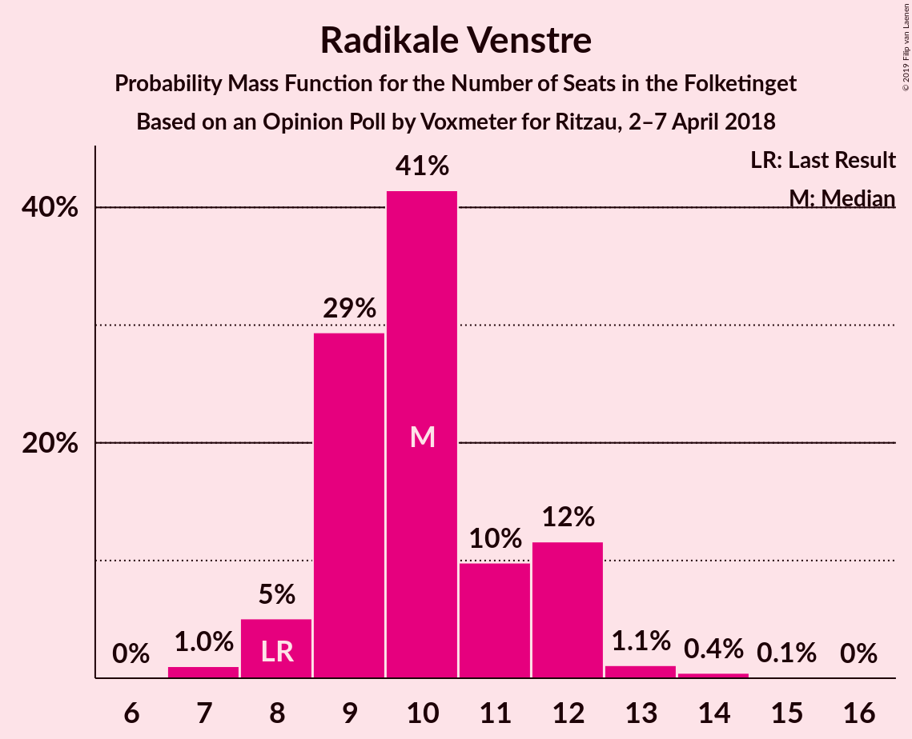
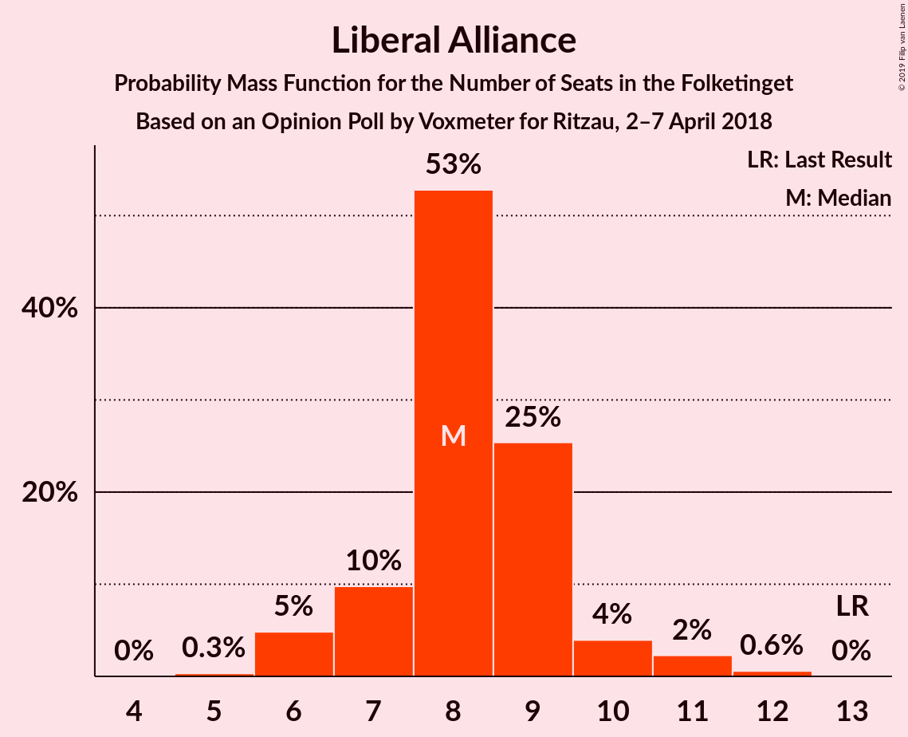
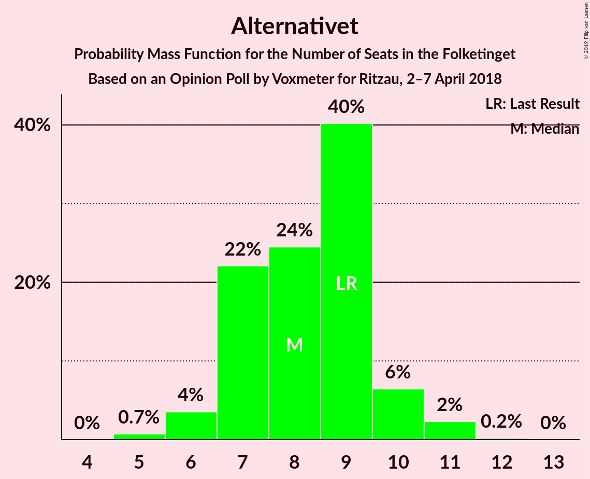
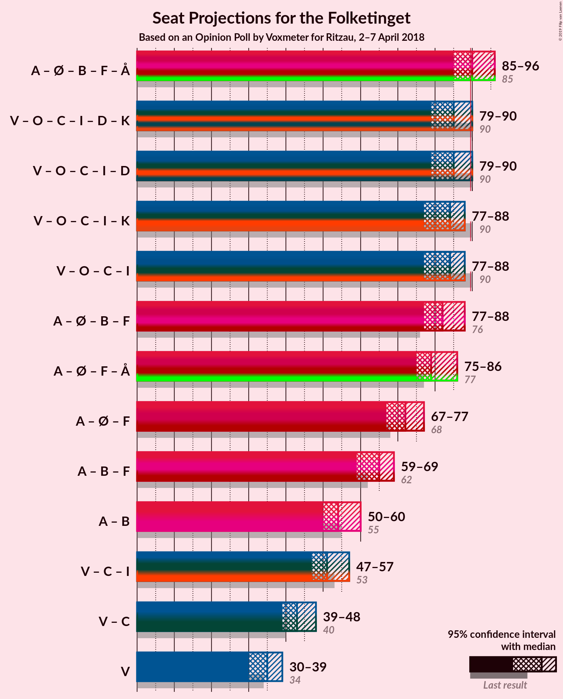

# Opinion Poll by Voxmeter for Ritzau, 2–7 April 2018

<a href="#voting-intentions">Voting Intentions</a> | <a href="#seats">Seats</a> | <a href="#coalitions">Coalitions</a> | <a href="#technical-information">Technical Information</a>

## Voting Intentions

### Confidence Intervals

| Party | Last Result | Poll Result | 80% Confidence Interval | 90% Confidence Interval | 95% Confidence Interval | 99% Confidence Interval |
|:-----:|:-----------:|:-----------:|:-----------------------:|:-----------------------:|:-----------------------:|:-----------------------:|
| Socialdemokraterne | 26.3% | 25.2% | 23.6–27.0% |23.1–27.6% |22.7–28.0% |21.9–28.9% |
| Venstre | 19.5% | 19.5% | 18.0–21.2% |17.6–21.6% |17.2–22.1% |16.5–22.9% |
| Dansk Folkeparti | 21.1% | 17.4% | 15.9–19.0% |15.5–19.4% |15.2–19.8% |14.5–20.6% |
| Enhedslisten–De Rød-Grønne | 7.8% | 10.2% | 9.1–11.5% |8.7–11.9% |8.5–12.2% |8.0–12.8% |
| Radikale Venstre | 4.6% | 5.6% | 4.8–6.7% |4.6–7.0% |4.4–7.2% |4.0–7.7% |
| Socialistisk Folkeparti | 4.2% | 5.0% | 4.3–6.0% |4.1–6.3% |3.9–6.6% |3.5–7.1% |
| Det Konservative Folkeparti | 3.4% | 4.9% | 4.1–5.8% |3.9–6.1% |3.7–6.4% |3.4–6.8% |
| Liberal Alliance | 7.5% | 4.7% | 3.9–5.6% |3.7–5.9% |3.5–6.1% |3.2–6.6% |
| Alternativet | 4.8% | 4.5% | 3.7–5.4% |3.5–5.7% |3.4–5.9% |3.0–6.4% |
| Nye Borgerlige | 0.0% | 1.8% | 1.4–2.5% |1.3–2.7% |1.2–2.9% |1.0–3.2% |
| Kristendemokraterne | 0.8% | 0.9% | 0.6–1.4% |0.5–1.5% |0.5–1.7% |0.4–1.9% |

*Note:* The poll result column reflects the actual value used in the calculations. Published results may vary slightly, and in addition be rounded to fewer digits.

## Seats

### Confidence Intervals

| Party | Last Result | Median | 80% Confidence Interval | 90% Confidence Interval | 95% Confidence Interval | 99% Confidence Interval |
|:-----:|:-----------:|:------:|:-----------------------:|:-----------------------:|:-----------------------:|:-----------------------:|
| <a href="#socialdemokraterne">Socialdemokraterne</a> | 47 | 42 | 40–48 |40–49 |40–49 |39–51 |
| <a href="#venstre">Venstre</a> | 34 | 36 | 33–38 |32–38 |31–40 |29–42 |
| <a href="#dansk-folkeparti">Dansk Folkeparti</a> | 37 | 30 | 26–34 |26–35 |26–36 |25–36 |
| <a href="#enhedslisten–de-rød-grønne">Enhedslisten–De Rød-Grønne</a> | 14 | 20 | 14–22 |14–22 |13–22 |13–22 |
| <a href="#radikale-venstre">Radikale Venstre</a> | 8 | 9 | 8–12 |8–12 |7–12 |7–14 |
| <a href="#socialistisk-folkeparti">Socialistisk Folkeparti</a> | 7 | 9 | 8–11 |7–12 |7–12 |7–13 |
| <a href="#det-konservative-folkeparti">Det Konservative Folkeparti</a> | 6 | 10 | 7–11 |7–12 |7–12 |5–13 |
| <a href="#liberal-alliance">Liberal Alliance</a> | 13 | 9 | 6–11 |6–11 |6–11 |6–11 |
| <a href="#alternativet">Alternativet</a> | 9 | 7 | 7–11 |6–11 |6–11 |6–11 |
| <a href="#nye-borgerlige">Nye Borgerlige</a> | 0 | 0 | 0–4 |0–5 |0–5 |0–6 |
| <a href="#kristendemokraterne">Kristendemokraterne</a> | 0 | 0 | 0 |0 |0 |0 |

### Socialdemokraterne

*For a full overview of the results for this party, see the [Socialdemokraterne](party-socialdemokraterne.html) page.*

| Number of Seats | Probability | Accumulated | Special Marks |
|:---------------:|:-----------:|:-----------:|:-------------:|
| 38 | 0.4% | 100% |  |
| 39 | 2% | 99.6% |  |
| 40 | 13% | 98% |  |
| 41 | 6% | 85% |  |
| 42 | 31% | 79% | Median |
| 43 | 7% | 48% |  |
| 44 | 8% | 41% |  |
| 45 | 3% | 33% |  |
| 46 | 0.2% | 30% |  |
| 47 | 17% | 30% | Last Result |
| 48 | 8% | 13% |  |
| 49 | 3% | 5% |  |
| 50 | 0.2% | 2% |  |
| 51 | 2% | 2% |  |
| 52 | 0.4% | 0.4% |  |
| 53 | 0% | 0% |  |

### Venstre

*For a full overview of the results for this party, see the [Venstre](party-venstre.html) page.*

| Number of Seats | Probability | Accumulated | Special Marks |
|:---------------:|:-----------:|:-----------:|:-------------:|
| 27 | 0% | 100% |  |
| 28 | 0.2% | 99.9% |  |
| 29 | 0.3% | 99.8% |  |
| 30 | 0.9% | 99.4% |  |
| 31 | 2% | 98% |  |
| 32 | 4% | 97% |  |
| 33 | 12% | 92% |  |
| 34 | 18% | 80% | Last Result |
| 35 | 11% | 62% |  |
| 36 | 8% | 51% | Median |
| 37 | 22% | 44% |  |
| 38 | 17% | 22% |  |
| 39 | 0.6% | 5% |  |
| 40 | 3% | 4% |  |
| 41 | 0% | 0.6% |  |
| 42 | 0% | 0.5% |  |
| 43 | 0.5% | 0.5% |  |
| 44 | 0% | 0% |  |

### Dansk Folkeparti

*For a full overview of the results for this party, see the [Dansk Folkeparti](party-danskfolkeparti.html) page.*

| Number of Seats | Probability | Accumulated | Special Marks |
|:---------------:|:-----------:|:-----------:|:-------------:|
| 25 | 0.9% | 100% |  |
| 26 | 11% | 99.1% |  |
| 27 | 1.4% | 88% |  |
| 28 | 12% | 86% |  |
| 29 | 9% | 75% |  |
| 30 | 31% | 65% | Median |
| 31 | 5% | 34% |  |
| 32 | 11% | 29% |  |
| 33 | 7% | 18% |  |
| 34 | 6% | 11% |  |
| 35 | 2% | 5% |  |
| 36 | 3% | 4% |  |
| 37 | 0.3% | 0.4% | Last Result |
| 38 | 0% | 0.1% |  |
| 39 | 0.1% | 0.1% |  |
| 40 | 0% | 0% |  |

### Enhedslisten–De Rød-Grønne

*For a full overview of the results for this party, see the [Enhedslisten–De Rød-Grønne](party-enhedslisten–derød-grønne.html) page.*

| Number of Seats | Probability | Accumulated | Special Marks |
|:---------------:|:-----------:|:-----------:|:-------------:|
| 13 | 3% | 100% |  |
| 14 | 10% | 97% | Last Result |
| 15 | 7% | 87% |  |
| 16 | 0.8% | 79% |  |
| 17 | 3% | 78% |  |
| 18 | 3% | 75% |  |
| 19 | 13% | 72% |  |
| 20 | 15% | 59% | Median |
| 21 | 15% | 45% |  |
| 22 | 30% | 30% |  |
| 23 | 0.1% | 0.2% |  |
| 24 | 0% | 0% |  |

### Radikale Venstre

*For a full overview of the results for this party, see the [Radikale Venstre](party-radikalevenstre.html) page.*

| Number of Seats | Probability | Accumulated | Special Marks |
|:---------------:|:-----------:|:-----------:|:-------------:|
| 7 | 3% | 100% |  |
| 8 | 33% | 97% | Last Result |
| 9 | 19% | 64% | Median |
| 10 | 13% | 45% |  |
| 11 | 21% | 32% |  |
| 12 | 8% | 11% |  |
| 13 | 1.4% | 2% |  |
| 14 | 0.7% | 1.1% |  |
| 15 | 0.2% | 0.3% |  |
| 16 | 0.1% | 0.1% |  |
| 17 | 0% | 0% |  |

### Socialistisk Folkeparti

*For a full overview of the results for this party, see the [Socialistisk Folkeparti](party-socialistiskfolkeparti.html) page.*

| Number of Seats | Probability | Accumulated | Special Marks |
|:---------------:|:-----------:|:-----------:|:-------------:|
| 6 | 0.2% | 100% |  |
| 7 | 6% | 99.7% | Last Result |
| 8 | 23% | 93% |  |
| 9 | 30% | 71% | Median |
| 10 | 19% | 41% |  |
| 11 | 15% | 22% |  |
| 12 | 6% | 7% |  |
| 13 | 0.7% | 0.8% |  |
| 14 | 0.1% | 0.1% |  |
| 15 | 0% | 0% |  |

### Det Konservative Folkeparti

*For a full overview of the results for this party, see the [Det Konservative Folkeparti](party-detkonservativefolkeparti.html) page.*

| Number of Seats | Probability | Accumulated | Special Marks |
|:---------------:|:-----------:|:-----------:|:-------------:|
| 5 | 0.9% | 100% |  |
| 6 | 2% | 99.1% | Last Result |
| 7 | 9% | 98% |  |
| 8 | 13% | 89% |  |
| 9 | 12% | 76% |  |
| 10 | 30% | 64% | Median |
| 11 | 28% | 34% |  |
| 12 | 5% | 6% |  |
| 13 | 0.1% | 0.6% |  |
| 14 | 0.4% | 0.4% |  |
| 15 | 0% | 0% |  |

### Liberal Alliance

*For a full overview of the results for this party, see the [Liberal Alliance](party-liberalalliance.html) page.*

| Number of Seats | Probability | Accumulated | Special Marks |
|:---------------:|:-----------:|:-----------:|:-------------:|
| 5 | 0.2% | 100% |  |
| 6 | 13% | 99.8% |  |
| 7 | 9% | 87% |  |
| 8 | 14% | 78% |  |
| 9 | 40% | 64% | Median |
| 10 | 13% | 24% |  |
| 11 | 11% | 11% |  |
| 12 | 0.2% | 0.3% |  |
| 13 | 0.1% | 0.1% | Last Result |
| 14 | 0% | 0% |  |

### Alternativet

*For a full overview of the results for this party, see the [Alternativet](party-alternativet.html) page.*

| Number of Seats | Probability | Accumulated | Special Marks |
|:---------------:|:-----------:|:-----------:|:-------------:|
| 5 | 0.3% | 100% |  |
| 6 | 9% | 99.7% |  |
| 7 | 44% | 91% | Median |
| 8 | 21% | 47% |  |
| 9 | 8% | 26% | Last Result |
| 10 | 4% | 18% |  |
| 11 | 14% | 14% |  |
| 12 | 0.2% | 0.2% |  |
| 13 | 0% | 0% |  |

### Nye Borgerlige

*For a full overview of the results for this party, see the [Nye Borgerlige](party-nyeborgerlige.html) page.*

| Number of Seats | Probability | Accumulated | Special Marks |
|:---------------:|:-----------:|:-----------:|:-------------:|
| 0 | 71% | 100% | Last Result, Median |
| 1 | 0% | 29% |  |
| 2 | 0% | 29% |  |
| 3 | 0% | 29% |  |
| 4 | 22% | 29% |  |
| 5 | 5% | 6% |  |
| 6 | 0.9% | 1.0% |  |
| 7 | 0.1% | 0.1% |  |
| 8 | 0% | 0% |  |

### Kristendemokraterne

*For a full overview of the results for this party, see the [Kristendemokraterne](party-kristendemokraterne.html) page.*

| Number of Seats | Probability | Accumulated | Special Marks |
|:---------------:|:-----------:|:-----------:|:-------------:|
| 0 | 99.7% | 100% | Last Result, Median |
| 1 | 0% | 0.3% |  |
| 2 | 0% | 0.3% |  |
| 3 | 0% | 0.3% |  |
| 4 | 0.3% | 0.3% |  |
| 5 | 0% | 0% |  |

## Coalitions

### Confidence Intervals

| Coalition | Last Result | Median | Majority? | 80% Confidence Interval | 90% Confidence Interval | 95% Confidence Interval | 99% Confidence Interval |
|:---------:|:-----------:|:------:|:---------:|:-----------------------:|:-----------------------:|:-----------------------:|:-----------------------:|
| Socialdemokraterne – Enhedslisten–De Rød-Grønne – Radikale Venstre – Socialistisk Folkeparti – Alternativet | 85 | 89 | 49% | 85–94 | 84–94 | 84–96 | 82–98 |
| Venstre – Dansk Folkeparti – Det Konservative Folkeparti – Liberal Alliance – Nye Borgerlige – Kristendemokraterne | 90 | 86 | 10% | 81–90 | 81–91 | 79–91 | 77–93 |
| Venstre – Dansk Folkeparti – Det Konservative Folkeparti – Liberal Alliance – Nye Borgerlige | 90 | 86 | 10% | 81–90 | 81–91 | 79–91 | 77–93 |
| Venstre – Dansk Folkeparti – Det Konservative Folkeparti – Liberal Alliance – Kristendemokraterne | 90 | 84 | 1.3% | 80–87 | 77–89 | 77–89 | 74–92 |
| Venstre – Dansk Folkeparti – Det Konservative Folkeparti – Liberal Alliance | 90 | 84 | 1.2% | 80–87 | 77–89 | 77–89 | 74–92 |
| Socialdemokraterne – Enhedslisten–De Rød-Grønne – Radikale Venstre – Socialistisk Folkeparti | 76 | 81 | 1.5% | 77–86 | 77–87 | 76–88 | 74–90 |
| Socialdemokraterne – Enhedslisten–De Rød-Grønne – Socialistisk Folkeparti – Alternativet | 77 | 80 | 0% | 75–83 | 73–84 | 73–86 | 73–88 |
| Socialdemokraterne – Enhedslisten–De Rød-Grønne – Socialistisk Folkeparti | 68 | 73 | 0% | 67–76 | 66–77 | 65–78 | 64–80 |
| Socialdemokraterne – Radikale Venstre – Socialistisk Folkeparti | 62 | 63 | 0% | 59–67 | 58–70 | 58–70 | 57–71 |
| Socialdemokraterne – Radikale Venstre | 55 | 53 | 0% | 50–57 | 48–60 | 48–60 | 48–62 |
| Venstre – Det Konservative Folkeparti – Liberal Alliance | 53 | 54 | 0% | 50–58 | 48–58 | 46–59 | 45–60 |
| Venstre – Det Konservative Folkeparti | 40 | 45 | 0% | 41–49 | 40–50 | 39–50 | 36–52 |
| Venstre | 34 | 36 | 0% | 33–38 | 32–38 | 31–40 | 29–42 |

### Socialdemokraterne – Enhedslisten–De Rød-Grønne – Radikale Venstre – Socialistisk Folkeparti – Alternativet

| Number of Seats | Probability | Accumulated | Special Marks |
|:---------------:|:-----------:|:-----------:|:-------------:|
| 80 | 0% | 100% |  |
| 81 | 0.4% | 99.9% |  |
| 82 | 0.5% | 99.6% |  |
| 83 | 0.7% | 99.0% |  |
| 84 | 5% | 98% |  |
| 85 | 4% | 93% | Last Result |
| 86 | 5% | 90% |  |
| 87 | 3% | 85% | Median |
| 88 | 25% | 82% |  |
| 89 | 9% | 57% |  |
| 90 | 4% | 49% | Majority |
| 91 | 13% | 45% |  |
| 92 | 12% | 32% |  |
| 93 | 3% | 19% |  |
| 94 | 13% | 17% |  |
| 95 | 1.1% | 4% |  |
| 96 | 1.3% | 3% |  |
| 97 | 0.2% | 1.4% |  |
| 98 | 1.0% | 1.2% |  |
| 99 | 0.1% | 0.2% |  |
| 100 | 0% | 0% |  |

### Venstre – Dansk Folkeparti – Det Konservative Folkeparti – Liberal Alliance – Nye Borgerlige – Kristendemokraterne

| Number of Seats | Probability | Accumulated | Special Marks |
|:---------------:|:-----------:|:-----------:|:-------------:|
| 76 | 0.1% | 100% |  |
| 77 | 1.0% | 99.8% |  |
| 78 | 0.2% | 98.8% |  |
| 79 | 1.3% | 98.6% |  |
| 80 | 1.1% | 97% |  |
| 81 | 13% | 96% |  |
| 82 | 3% | 83% |  |
| 83 | 12% | 81% |  |
| 84 | 13% | 68% |  |
| 85 | 4% | 55% | Median |
| 86 | 9% | 51% |  |
| 87 | 25% | 43% |  |
| 88 | 3% | 18% |  |
| 89 | 5% | 15% |  |
| 90 | 4% | 10% | Last Result, Majority |
| 91 | 5% | 7% |  |
| 92 | 0.7% | 2% |  |
| 93 | 0.5% | 1.0% |  |
| 94 | 0.4% | 0.4% |  |
| 95 | 0% | 0.1% |  |
| 96 | 0% | 0% |  |

### Venstre – Dansk Folkeparti – Det Konservative Folkeparti – Liberal Alliance – Nye Borgerlige

| Number of Seats | Probability | Accumulated | Special Marks |
|:---------------:|:-----------:|:-----------:|:-------------:|
| 76 | 0.1% | 100% |  |
| 77 | 1.0% | 99.8% |  |
| 78 | 0.2% | 98.8% |  |
| 79 | 1.3% | 98.6% |  |
| 80 | 1.1% | 97% |  |
| 81 | 13% | 96% |  |
| 82 | 3% | 83% |  |
| 83 | 12% | 81% |  |
| 84 | 13% | 68% |  |
| 85 | 4% | 55% | Median |
| 86 | 8% | 51% |  |
| 87 | 25% | 43% |  |
| 88 | 3% | 18% |  |
| 89 | 5% | 15% |  |
| 90 | 4% | 10% | Last Result, Majority |
| 91 | 5% | 7% |  |
| 92 | 0.6% | 2% |  |
| 93 | 0.5% | 1.0% |  |
| 94 | 0.4% | 0.4% |  |
| 95 | 0% | 0.1% |  |
| 96 | 0% | 0% |  |

### Venstre – Dansk Folkeparti – Det Konservative Folkeparti – Liberal Alliance – Kristendemokraterne

| Number of Seats | Probability | Accumulated | Special Marks |
|:---------------:|:-----------:|:-----------:|:-------------:|
| 72 | 0.1% | 100% |  |
| 73 | 0% | 99.9% |  |
| 74 | 0.5% | 99.9% |  |
| 75 | 0.1% | 99.5% |  |
| 76 | 0.4% | 99.4% |  |
| 77 | 5% | 99.0% |  |
| 78 | 1.4% | 94% |  |
| 79 | 2% | 92% |  |
| 80 | 1.4% | 90% |  |
| 81 | 9% | 89% |  |
| 82 | 8% | 80% |  |
| 83 | 16% | 72% |  |
| 84 | 12% | 56% |  |
| 85 | 4% | 44% | Median |
| 86 | 7% | 40% |  |
| 87 | 26% | 33% |  |
| 88 | 2% | 7% |  |
| 89 | 5% | 6% |  |
| 90 | 0.7% | 1.3% | Last Result, Majority |
| 91 | 0% | 0.6% |  |
| 92 | 0.5% | 0.6% |  |
| 93 | 0% | 0.1% |  |
| 94 | 0% | 0.1% |  |
| 95 | 0% | 0% |  |

### Venstre – Dansk Folkeparti – Det Konservative Folkeparti – Liberal Alliance

| Number of Seats | Probability | Accumulated | Special Marks |
|:---------------:|:-----------:|:-----------:|:-------------:|
| 72 | 0.1% | 100% |  |
| 73 | 0% | 99.9% |  |
| 74 | 0.5% | 99.9% |  |
| 75 | 0.1% | 99.5% |  |
| 76 | 0.4% | 99.4% |  |
| 77 | 5% | 99.0% |  |
| 78 | 1.4% | 94% |  |
| 79 | 2% | 92% |  |
| 80 | 1.4% | 90% |  |
| 81 | 9% | 89% |  |
| 82 | 8% | 80% |  |
| 83 | 16% | 71% |  |
| 84 | 12% | 56% |  |
| 85 | 4% | 44% | Median |
| 86 | 7% | 40% |  |
| 87 | 26% | 33% |  |
| 88 | 2% | 7% |  |
| 89 | 4% | 6% |  |
| 90 | 0.7% | 1.2% | Last Result, Majority |
| 91 | 0% | 0.5% |  |
| 92 | 0.5% | 0.5% |  |
| 93 | 0% | 0.1% |  |
| 94 | 0% | 0.1% |  |
| 95 | 0% | 0% |  |

### Socialdemokraterne – Enhedslisten–De Rød-Grønne – Radikale Venstre – Socialistisk Folkeparti

| Number of Seats | Probability | Accumulated | Special Marks |
|:---------------:|:-----------:|:-----------:|:-------------:|
| 71 | 0.1% | 100% |  |
| 72 | 0% | 99.9% |  |
| 73 | 0.1% | 99.9% |  |
| 74 | 1.0% | 99.8% |  |
| 75 | 0.6% | 98.8% |  |
| 76 | 2% | 98% | Last Result |
| 77 | 8% | 97% |  |
| 78 | 0.4% | 88% |  |
| 79 | 3% | 88% |  |
| 80 | 15% | 85% | Median |
| 81 | 28% | 69% |  |
| 82 | 3% | 42% |  |
| 83 | 8% | 39% |  |
| 84 | 11% | 30% |  |
| 85 | 9% | 20% |  |
| 86 | 3% | 10% |  |
| 87 | 5% | 8% |  |
| 88 | 1.4% | 3% |  |
| 89 | 0.1% | 2% |  |
| 90 | 1.2% | 1.5% | Majority |
| 91 | 0.2% | 0.2% |  |
| 92 | 0% | 0% |  |

### Socialdemokraterne – Enhedslisten–De Rød-Grønne – Socialistisk Folkeparti – Alternativet

| Number of Seats | Probability | Accumulated | Special Marks |
|:---------------:|:-----------:|:-----------:|:-------------:|
| 71 | 0.1% | 100% |  |
| 72 | 0.4% | 99.9% |  |
| 73 | 7% | 99.5% |  |
| 74 | 0.3% | 92% |  |
| 75 | 2% | 92% |  |
| 76 | 6% | 90% |  |
| 77 | 4% | 84% | Last Result |
| 78 | 0.5% | 80% | Median |
| 79 | 5% | 79% |  |
| 80 | 33% | 74% |  |
| 81 | 5% | 41% |  |
| 82 | 2% | 36% |  |
| 83 | 24% | 34% |  |
| 84 | 5% | 10% |  |
| 85 | 0.3% | 4% |  |
| 86 | 2% | 4% |  |
| 87 | 0.9% | 2% |  |
| 88 | 0.9% | 0.9% |  |
| 89 | 0% | 0% |  |

### Socialdemokraterne – Enhedslisten–De Rød-Grønne – Socialistisk Folkeparti

| Number of Seats | Probability | Accumulated | Special Marks |
|:---------------:|:-----------:|:-----------:|:-------------:|
| 63 | 0.2% | 100% |  |
| 64 | 0.4% | 99.7% |  |
| 65 | 3% | 99.4% |  |
| 66 | 5% | 96% |  |
| 67 | 2% | 90% |  |
| 68 | 1.5% | 88% | Last Result |
| 69 | 3% | 87% |  |
| 70 | 7% | 84% |  |
| 71 | 7% | 77% | Median |
| 72 | 17% | 71% |  |
| 73 | 30% | 54% |  |
| 74 | 6% | 25% |  |
| 75 | 0.5% | 19% |  |
| 76 | 10% | 18% |  |
| 77 | 5% | 8% |  |
| 78 | 2% | 4% |  |
| 79 | 0.9% | 2% |  |
| 80 | 1.2% | 1.2% |  |
| 81 | 0% | 0% |  |

### Socialdemokraterne – Radikale Venstre – Socialistisk Folkeparti

| Number of Seats | Probability | Accumulated | Special Marks |
|:---------------:|:-----------:|:-----------:|:-------------:|
| 56 | 0.2% | 100% |  |
| 57 | 0.3% | 99.8% |  |
| 58 | 6% | 99.5% |  |
| 59 | 22% | 93% |  |
| 60 | 9% | 71% | Median |
| 61 | 1.0% | 62% |  |
| 62 | 7% | 61% | Last Result |
| 63 | 14% | 54% |  |
| 64 | 18% | 40% |  |
| 65 | 6% | 22% |  |
| 66 | 1.3% | 16% |  |
| 67 | 6% | 15% |  |
| 68 | 3% | 9% |  |
| 69 | 1.1% | 6% |  |
| 70 | 4% | 5% |  |
| 71 | 1.0% | 1.3% |  |
| 72 | 0.1% | 0.2% |  |
| 73 | 0% | 0.1% |  |
| 74 | 0% | 0.1% |  |
| 75 | 0.1% | 0.1% |  |
| 76 | 0% | 0% |  |

### Socialdemokraterne – Radikale Venstre

| Number of Seats | Probability | Accumulated | Special Marks |
|:---------------:|:-----------:|:-----------:|:-------------:|
| 46 | 0.1% | 100% |  |
| 47 | 0.1% | 99.9% |  |
| 48 | 8% | 99.8% |  |
| 49 | 0.1% | 92% |  |
| 50 | 27% | 92% |  |
| 51 | 1.3% | 65% | Median |
| 52 | 10% | 63% |  |
| 53 | 10% | 54% |  |
| 54 | 4% | 43% |  |
| 55 | 7% | 40% | Last Result |
| 56 | 13% | 32% |  |
| 57 | 12% | 19% |  |
| 58 | 1.5% | 7% |  |
| 59 | 0.7% | 6% |  |
| 60 | 3% | 5% |  |
| 61 | 1.3% | 2% |  |
| 62 | 0.5% | 0.9% |  |
| 63 | 0.2% | 0.3% |  |
| 64 | 0% | 0.1% |  |
| 65 | 0.1% | 0.1% |  |
| 66 | 0% | 0% |  |

### Venstre – Det Konservative Folkeparti – Liberal Alliance

| Number of Seats | Probability | Accumulated | Special Marks |
|:---------------:|:-----------:|:-----------:|:-------------:|
| 43 | 0.1% | 100% |  |
| 44 | 0.4% | 99.9% |  |
| 45 | 1.4% | 99.6% |  |
| 46 | 0.9% | 98% |  |
| 47 | 0.2% | 97% |  |
| 48 | 4% | 97% |  |
| 49 | 3% | 93% |  |
| 50 | 4% | 90% |  |
| 51 | 15% | 87% |  |
| 52 | 13% | 71% |  |
| 53 | 5% | 59% | Last Result |
| 54 | 8% | 54% |  |
| 55 | 4% | 46% | Median |
| 56 | 6% | 42% |  |
| 57 | 25% | 35% |  |
| 58 | 6% | 10% |  |
| 59 | 3% | 5% |  |
| 60 | 0.7% | 1.1% |  |
| 61 | 0.5% | 0.5% |  |
| 62 | 0% | 0% |  |

### Venstre – Det Konservative Folkeparti

| Number of Seats | Probability | Accumulated | Special Marks |
|:---------------:|:-----------:|:-----------:|:-------------:|
| 34 | 0.1% | 100% |  |
| 35 | 0% | 99.8% |  |
| 36 | 0.3% | 99.8% |  |
| 37 | 0.9% | 99.5% |  |
| 38 | 0.7% | 98.5% |  |
| 39 | 2% | 98% |  |
| 40 | 3% | 96% | Last Result |
| 41 | 5% | 93% |  |
| 42 | 5% | 88% |  |
| 43 | 17% | 83% |  |
| 44 | 6% | 66% |  |
| 45 | 14% | 60% |  |
| 46 | 5% | 46% | Median |
| 47 | 5% | 40% |  |
| 48 | 25% | 36% |  |
| 49 | 3% | 10% |  |
| 50 | 6% | 7% |  |
| 51 | 0% | 1.0% |  |
| 52 | 0.9% | 0.9% |  |
| 53 | 0% | 0% |  |

### Venstre

| Number of Seats | Probability | Accumulated | Special Marks |
|:---------------:|:-----------:|:-----------:|:-------------:|
| 27 | 0% | 100% |  |
| 28 | 0.2% | 99.9% |  |
| 29 | 0.3% | 99.8% |  |
| 30 | 0.9% | 99.4% |  |
| 31 | 2% | 98% |  |
| 32 | 4% | 97% |  |
| 33 | 12% | 92% |  |
| 34 | 18% | 80% | Last Result |
| 35 | 11% | 62% |  |
| 36 | 8% | 51% | Median |
| 37 | 22% | 44% |  |
| 38 | 17% | 22% |  |
| 39 | 0.6% | 5% |  |
| 40 | 3% | 4% |  |
| 41 | 0% | 0.6% |  |
| 42 | 0% | 0.5% |  |
| 43 | 0.5% | 0.5% |  |
| 44 | 0% | 0% |  |

## Technical Information

### Opinion Poll

+ **Polling firm:** Voxmeter
+ **Commissioner(s):** Ritzau
+ **Fieldwork period:** 2–7 April 2018

### Calculations

+ **Sample size:** 1030
+ **Simulations done:** 131,072
+ **Error estimate:** 2.12%

