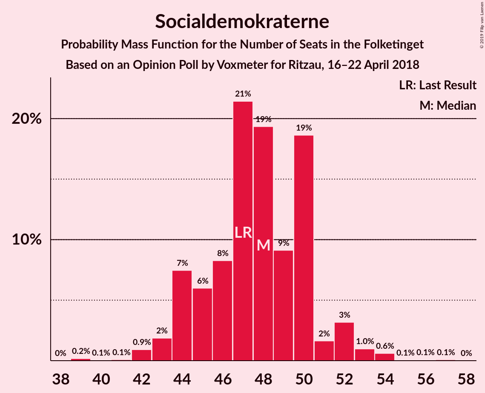
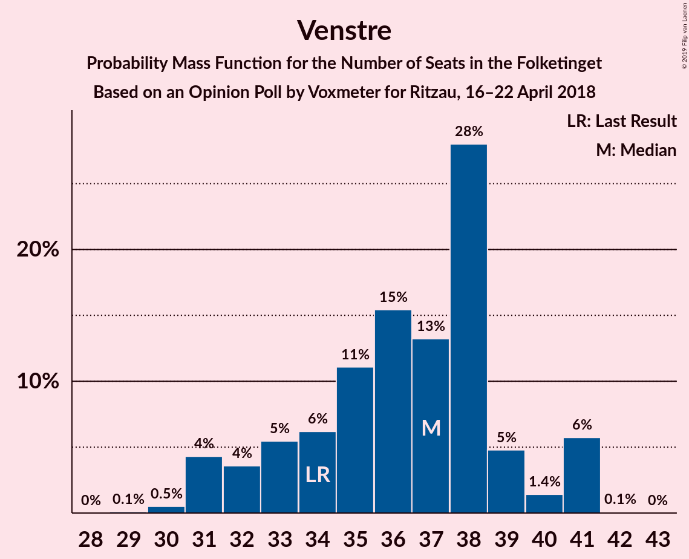
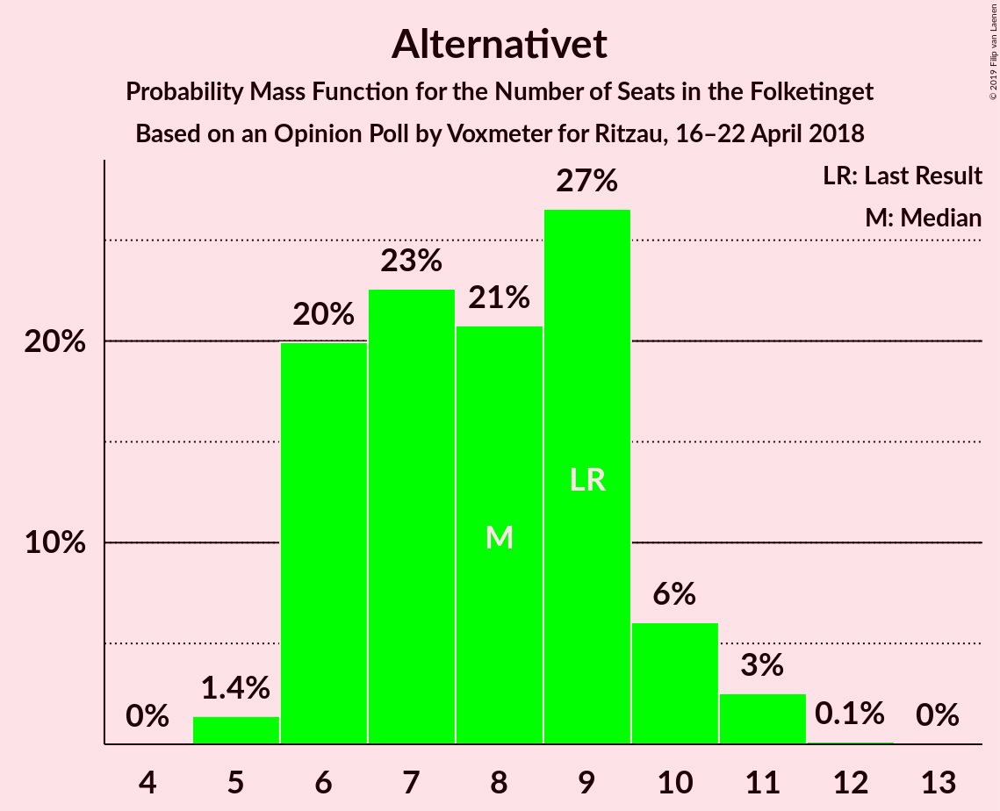
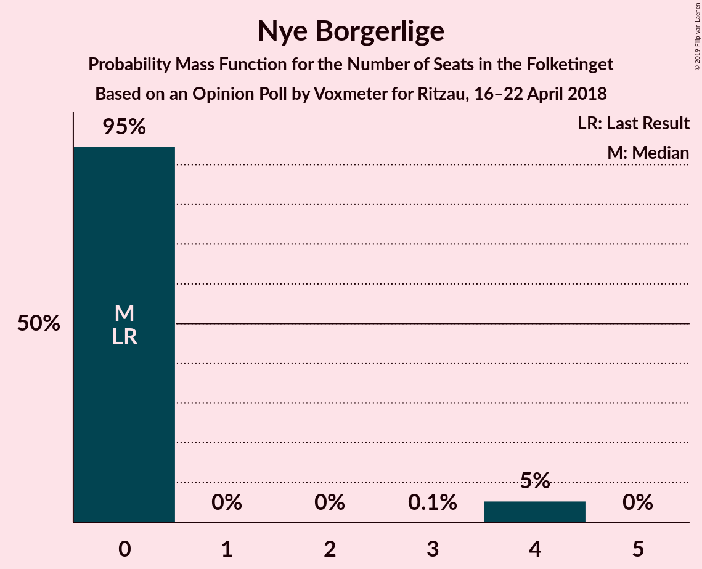

# Opinion Poll by Voxmeter for Ritzau, 16–22 April 2018

<a href="#voting-intentions">Voting Intentions</a> | <a href="#seats">Seats</a> | <a href="#coalitions">Coalitions</a> | <a href="#technical-information">Technical Information</a>

## Voting Intentions

### Confidence Intervals

| Party | Last Result | Poll Result | 80% Confidence Interval | 90% Confidence Interval | 95% Confidence Interval | 99% Confidence Interval |
|:-----:|:-----------:|:-----------:|:-----------------------:|:-----------------------:|:-----------------------:|:-----------------------:|
| Socialdemokraterne | 26.3% | 26.7% | 25.0–28.5% |24.5–29.1% |24.1–29.5% |23.3–30.4% |
| Venstre | 19.5% | 20.0% | 18.5–21.7% |18.0–22.1% |17.7–22.5% |17.0–23.4% |
| Dansk Folkeparti | 21.1% | 15.6% | 14.2–17.1% |13.8–17.5% |13.5–17.9% |12.9–18.7% |
| Enhedslisten–De Rød-Grønne | 7.8% | 9.0% | 8.0–10.3% |7.7–10.6% |7.4–10.9% |7.0–11.6% |
| Socialistisk Folkeparti | 4.2% | 6.6% | 5.7–7.7% |5.5–8.0% |5.3–8.3% |4.9–8.9% |
| Liberal Alliance | 7.5% | 6.2% | 5.3–7.2% |5.0–7.5% |4.8–7.8% |4.5–8.3% |
| Radikale Venstre | 4.6% | 5.2% | 4.4–6.2% |4.2–6.5% |4.0–6.7% |3.6–7.2% |
| Alternativet | 4.8% | 4.4% | 3.7–5.4% |3.5–5.6% |3.3–5.9% |3.0–6.3% |
| Det Konservative Folkeparti | 3.4% | 3.9% | 3.3–4.8% |3.1–5.1% |2.9–5.3% |2.6–5.8% |
| Nye Borgerlige | 0.0% | 1.1% | 0.7–1.6% |0.7–1.8% |0.6–1.9% |0.5–2.2% |
| Kristendemokraterne | 0.8% | 1.0% | 0.7–1.5% |0.6–1.6% |0.5–1.8% |0.4–2.1% |

*Note:* The poll result column reflects the actual value used in the calculations. Published results may vary slightly, and in addition be rounded to fewer digits.

## Seats

### Confidence Intervals

| Party | Last Result | Median | 80% Confidence Interval | 90% Confidence Interval | 95% Confidence Interval | 99% Confidence Interval |
|:-----:|:-----------:|:------:|:-----------------------:|:-----------------------:|:-----------------------:|:-----------------------:|
| <a href="#socialdemokraterne">Socialdemokraterne</a> | 47 | 49 | 45–51 |45–51 |44–51 |43–53 |
| <a href="#venstre">Venstre</a> | 34 | 34 | 33–37 |32–40 |31–40 |30–41 |
| <a href="#dansk-folkeparti">Dansk Folkeparti</a> | 37 | 27 | 26–30 |26–30 |24–31 |23–33 |
| <a href="#enhedslisten–de-rød-grønne">Enhedslisten–De Rød-Grønne</a> | 14 | 16 | 14–18 |14–19 |13–20 |13–20 |
| <a href="#socialistisk-folkeparti">Socialistisk Folkeparti</a> | 7 | 11 | 11–14 |10–14 |10–15 |9–16 |
| <a href="#liberal-alliance">Liberal Alliance</a> | 13 | 11 | 10–13 |9–13 |9–13 |8–14 |
| <a href="#radikale-venstre">Radikale Venstre</a> | 8 | 10 | 7–11 |7–11 |7–12 |7–12 |
| <a href="#alternativet">Alternativet</a> | 9 | 7 | 7–11 |5–11 |5–11 |5–11 |
| <a href="#det-konservative-folkeparti">Det Konservative Folkeparti</a> | 6 | 7 | 7–9 |6–9 |5–10 |4–10 |
| <a href="#nye-borgerlige">Nye Borgerlige</a> | 0 | 0 | 0 |0 |0 |0 |
| <a href="#kristendemokraterne">Kristendemokraterne</a> | 0 | 0 | 0 |0 |0 |0–4 |

### Socialdemokraterne

*For a full overview of the results for this party, see the [Socialdemokraterne](party-socialdemokraterne.html) page.*

| Number of Seats | Probability | Accumulated | Special Marks |
|:---------------:|:-----------:|:-----------:|:-------------:|
| 40 | 0.1% | 100% |  |
| 41 | 0.2% | 99.9% |  |
| 42 | 0.2% | 99.7% |  |
| 43 | 0.3% | 99.6% |  |
| 44 | 2% | 99.3% |  |
| 45 | 13% | 97% |  |
| 46 | 21% | 84% |  |
| 47 | 8% | 63% | Last Result |
| 48 | 4% | 55% |  |
| 49 | 34% | 51% | Median |
| 50 | 4% | 17% |  |
| 51 | 12% | 13% |  |
| 52 | 0% | 0.7% |  |
| 53 | 0.3% | 0.6% |  |
| 54 | 0.3% | 0.3% |  |
| 55 | 0% | 0.1% |  |
| 56 | 0% | 0% |  |

### Venstre

*For a full overview of the results for this party, see the [Venstre](party-venstre.html) page.*

| Number of Seats | Probability | Accumulated | Special Marks |
|:---------------:|:-----------:|:-----------:|:-------------:|
| 29 | 0.5% | 100% |  |
| 30 | 0.2% | 99.5% |  |
| 31 | 3% | 99.3% |  |
| 32 | 5% | 96% |  |
| 33 | 30% | 92% |  |
| 34 | 22% | 62% | Last Result, Median |
| 35 | 3% | 40% |  |
| 36 | 14% | 37% |  |
| 37 | 16% | 24% |  |
| 38 | 1.2% | 8% |  |
| 39 | 0.4% | 7% |  |
| 40 | 6% | 6% |  |
| 41 | 0.5% | 0.8% |  |
| 42 | 0.3% | 0.3% |  |
| 43 | 0% | 0% |  |

### Dansk Folkeparti

*For a full overview of the results for this party, see the [Dansk Folkeparti](party-danskfolkeparti.html) page.*

| Number of Seats | Probability | Accumulated | Special Marks |
|:---------------:|:-----------:|:-----------:|:-------------:|
| 22 | 0.2% | 100% |  |
| 23 | 0.5% | 99.8% |  |
| 24 | 2% | 99.3% |  |
| 25 | 2% | 97% |  |
| 26 | 36% | 96% |  |
| 27 | 19% | 60% | Median |
| 28 | 1.4% | 41% |  |
| 29 | 22% | 39% |  |
| 30 | 14% | 17% |  |
| 31 | 2% | 4% |  |
| 32 | 0.6% | 2% |  |
| 33 | 1.1% | 1.4% |  |
| 34 | 0.2% | 0.3% |  |
| 35 | 0% | 0% |  |
| 36 | 0% | 0% |  |
| 37 | 0% | 0% | Last Result |

### Enhedslisten–De Rød-Grønne

*For a full overview of the results for this party, see the [Enhedslisten–De Rød-Grønne](party-enhedslisten–derød-grønne.html) page.*

| Number of Seats | Probability | Accumulated | Special Marks |
|:---------------:|:-----------:|:-----------:|:-------------:|
| 12 | 0.1% | 100% |  |
| 13 | 2% | 99.9% |  |
| 14 | 21% | 97% | Last Result |
| 15 | 17% | 77% |  |
| 16 | 19% | 60% | Median |
| 17 | 4% | 41% |  |
| 18 | 30% | 37% |  |
| 19 | 2% | 6% |  |
| 20 | 3% | 4% |  |
| 21 | 0.4% | 0.4% |  |
| 22 | 0% | 0% |  |

### Socialistisk Folkeparti

*For a full overview of the results for this party, see the [Socialistisk Folkeparti](party-socialistiskfolkeparti.html) page.*

| Number of Seats | Probability | Accumulated | Special Marks |
|:---------------:|:-----------:|:-----------:|:-------------:|
| 7 | 0% | 100% | Last Result |
| 8 | 0.2% | 100% |  |
| 9 | 2% | 99.7% |  |
| 10 | 6% | 98% |  |
| 11 | 47% | 92% | Median |
| 12 | 16% | 45% |  |
| 13 | 4% | 29% |  |
| 14 | 21% | 25% |  |
| 15 | 2% | 4% |  |
| 16 | 2% | 2% |  |
| 17 | 0% | 0% |  |

### Liberal Alliance

*For a full overview of the results for this party, see the [Liberal Alliance](party-liberalalliance.html) page.*

| Number of Seats | Probability | Accumulated | Special Marks |
|:---------------:|:-----------:|:-----------:|:-------------:|
| 7 | 0.1% | 100% |  |
| 8 | 0.5% | 99.9% |  |
| 9 | 5% | 99.4% |  |
| 10 | 26% | 94% |  |
| 11 | 25% | 68% | Median |
| 12 | 4% | 43% |  |
| 13 | 39% | 39% | Last Result |
| 14 | 0.3% | 0.6% |  |
| 15 | 0.2% | 0.3% |  |
| 16 | 0.1% | 0.1% |  |
| 17 | 0% | 0% |  |

### Radikale Venstre

*For a full overview of the results for this party, see the [Radikale Venstre](party-radikalevenstre.html) page.*

| Number of Seats | Probability | Accumulated | Special Marks |
|:---------------:|:-----------:|:-----------:|:-------------:|
| 6 | 0.4% | 100% |  |
| 7 | 11% | 99.6% |  |
| 8 | 24% | 89% | Last Result |
| 9 | 8% | 64% |  |
| 10 | 21% | 56% | Median |
| 11 | 32% | 35% |  |
| 12 | 2% | 3% |  |
| 13 | 0.3% | 0.4% |  |
| 14 | 0% | 0% |  |

### Alternativet

*For a full overview of the results for this party, see the [Alternativet](party-alternativet.html) page.*

| Number of Seats | Probability | Accumulated | Special Marks |
|:---------------:|:-----------:|:-----------:|:-------------:|
| 5 | 5% | 100% |  |
| 6 | 4% | 95% |  |
| 7 | 47% | 91% | Median |
| 8 | 6% | 44% |  |
| 9 | 4% | 38% | Last Result |
| 10 | 21% | 34% |  |
| 11 | 13% | 14% |  |
| 12 | 0.1% | 0.2% |  |
| 13 | 0.2% | 0.2% |  |
| 14 | 0% | 0% |  |

### Det Konservative Folkeparti

*For a full overview of the results for this party, see the [Det Konservative Folkeparti](party-detkonservativefolkeparti.html) page.*

| Number of Seats | Probability | Accumulated | Special Marks |
|:---------------:|:-----------:|:-----------:|:-------------:|
| 4 | 1.2% | 100% |  |
| 5 | 3% | 98.8% |  |
| 6 | 5% | 96% | Last Result |
| 7 | 48% | 91% | Median |
| 8 | 17% | 43% |  |
| 9 | 22% | 26% |  |
| 10 | 4% | 4% |  |
| 11 | 0.1% | 0.1% |  |
| 12 | 0% | 0% |  |

### Nye Borgerlige

*For a full overview of the results for this party, see the [Nye Borgerlige](party-nyeborgerlige.html) page.*

| Number of Seats | Probability | Accumulated | Special Marks |
|:---------------:|:-----------:|:-----------:|:-------------:|
| 0 | 99.7% | 100% | Last Result, Median |
| 1 | 0% | 0.3% |  |
| 2 | 0% | 0.3% |  |
| 3 | 0% | 0.3% |  |
| 4 | 0.3% | 0.3% |  |
| 5 | 0% | 0% |  |

### Kristendemokraterne

*For a full overview of the results for this party, see the [Kristendemokraterne](party-kristendemokraterne.html) page.*

| Number of Seats | Probability | Accumulated | Special Marks |
|:---------------:|:-----------:|:-----------:|:-------------:|
| 0 | 98.5% | 100% | Last Result, Median |
| 1 | 0% | 1.5% |  |
| 2 | 0% | 1.5% |  |
| 3 | 0% | 1.5% |  |
| 4 | 1.4% | 1.5% |  |
| 5 | 0% | 0% |  |

## Coalitions

### Confidence Intervals

| Coalition | Last Result | Median | Majority? | 80% Confidence Interval | 90% Confidence Interval | 95% Confidence Interval | 99% Confidence Interval |
|:---------:|:-----------:|:------:|:---------:|:-----------------------:|:-----------------------:|:-----------------------:|:-----------------------:|
| Socialdemokraterne – Enhedslisten–De Rød-Grønne – Socialistisk Folkeparti – Radikale Venstre – Alternativet | 85 | 95 | 92% | 90–96 | 88–99 | 88–101 | 87–101 |
| Socialdemokraterne – Enhedslisten–De Rød-Grønne – Socialistisk Folkeparti – Alternativet | 77 | 85 | 3% | 80–88 | 78–89 | 78–92 | 78–92 |
| Socialdemokraterne – Enhedslisten–De Rød-Grønne – Socialistisk Folkeparti – Radikale Venstre | 76 | 84 | 6% | 82–89 | 82–90 | 81–90 | 79–91 |
| Venstre – Dansk Folkeparti – Liberal Alliance – Det Konservative Folkeparti – Nye Borgerlige – Kristendemokraterne | 90 | 80 | 0.1% | 79–85 | 76–87 | 74–87 | 74–88 |
| Venstre – Dansk Folkeparti – Liberal Alliance – Det Konservative Folkeparti – Kristendemokraterne | 90 | 80 | 0.1% | 79–85 | 76–87 | 74–87 | 74–87 |
| Venstre – Dansk Folkeparti – Liberal Alliance – Det Konservative Folkeparti – Nye Borgerlige | 90 | 80 | 0.1% | 79–85 | 76–87 | 74–87 | 74–87 |
| Venstre – Dansk Folkeparti – Liberal Alliance – Det Konservative Folkeparti | 90 | 80 | 0.1% | 79–85 | 76–87 | 74–87 | 74–87 |
| Socialdemokraterne – Enhedslisten–De Rød-Grønne – Socialistisk Folkeparti | 68 | 77 | 0% | 73–79 | 73–80 | 73–81 | 70–81 |
| Socialdemokraterne – Socialistisk Folkeparti – Radikale Venstre | 62 | 69 | 0% | 67–71 | 67–72 | 65–75 | 62–76 |
| Socialdemokraterne – Radikale Venstre | 55 | 58 | 0% | 54–60 | 54–60 | 54–60 | 52–63 |
| Venstre – Liberal Alliance – Det Konservative Folkeparti | 53 | 53 | 0% | 52–57 | 49–59 | 47–60 | 46–60 |
| Venstre – Det Konservative Folkeparti | 40 | 43 | 0% | 40–45 | 38–47 | 38–47 | 36–48 |
| Venstre | 34 | 34 | 0% | 33–37 | 32–40 | 31–40 | 30–41 |

### Socialdemokraterne – Enhedslisten–De Rød-Grønne – Socialistisk Folkeparti – Radikale Venstre – Alternativet

| Number of Seats | Probability | Accumulated | Special Marks |
|:---------------:|:-----------:|:-----------:|:-------------:|
| 85 | 0.1% | 100% | Last Result |
| 86 | 0.1% | 99.9% |  |
| 87 | 0.3% | 99.8% |  |
| 88 | 6% | 99.5% |  |
| 89 | 2% | 93% |  |
| 90 | 15% | 92% | Majority |
| 91 | 2% | 77% |  |
| 92 | 20% | 75% |  |
| 93 | 3% | 54% | Median |
| 94 | 0.9% | 52% |  |
| 95 | 10% | 51% |  |
| 96 | 33% | 41% |  |
| 97 | 2% | 8% |  |
| 98 | 0.2% | 5% |  |
| 99 | 0.4% | 5% |  |
| 100 | 1.5% | 5% |  |
| 101 | 3% | 3% |  |
| 102 | 0% | 0% |  |

### Socialdemokraterne – Enhedslisten–De Rød-Grønne – Socialistisk Folkeparti – Alternativet

| Number of Seats | Probability | Accumulated | Special Marks |
|:---------------:|:-----------:|:-----------:|:-------------:|
| 75 | 0% | 100% |  |
| 76 | 0.1% | 99.9% |  |
| 77 | 0.3% | 99.8% | Last Result |
| 78 | 5% | 99.6% |  |
| 79 | 3% | 95% |  |
| 80 | 13% | 92% |  |
| 81 | 0.9% | 79% |  |
| 82 | 2% | 78% |  |
| 83 | 2% | 76% | Median |
| 84 | 22% | 73% |  |
| 85 | 32% | 52% |  |
| 86 | 1.2% | 19% |  |
| 87 | 2% | 18% |  |
| 88 | 11% | 16% |  |
| 89 | 2% | 5% |  |
| 90 | 0.1% | 3% | Majority |
| 91 | 0.1% | 3% |  |
| 92 | 3% | 3% |  |
| 93 | 0% | 0% |  |

### Socialdemokraterne – Enhedslisten–De Rød-Grønne – Socialistisk Folkeparti – Radikale Venstre

| Number of Seats | Probability | Accumulated | Special Marks |
|:---------------:|:-----------:|:-----------:|:-------------:|
| 76 | 0% | 100% | Last Result |
| 77 | 0.1% | 100% |  |
| 78 | 0.1% | 99.9% |  |
| 79 | 2% | 99.8% |  |
| 80 | 0.1% | 98% |  |
| 81 | 0.9% | 98% |  |
| 82 | 21% | 97% |  |
| 83 | 19% | 76% |  |
| 84 | 12% | 57% |  |
| 85 | 1.3% | 45% |  |
| 86 | 2% | 44% | Median |
| 87 | 2% | 42% |  |
| 88 | 2% | 40% |  |
| 89 | 31% | 37% |  |
| 90 | 4% | 6% | Majority |
| 91 | 2% | 2% |  |
| 92 | 0.1% | 0.2% |  |
| 93 | 0% | 0.2% |  |
| 94 | 0.1% | 0.2% |  |
| 95 | 0% | 0% |  |

### Venstre – Dansk Folkeparti – Liberal Alliance – Det Konservative Folkeparti – Nye Borgerlige – Kristendemokraterne

| Number of Seats | Probability | Accumulated | Special Marks |
|:---------------:|:-----------:|:-----------:|:-------------:|
| 74 | 3% | 100% |  |
| 75 | 1.5% | 97% |  |
| 76 | 0.4% | 95% |  |
| 77 | 0.2% | 95% |  |
| 78 | 2% | 95% |  |
| 79 | 33% | 92% | Median |
| 80 | 10% | 59% |  |
| 81 | 0.9% | 49% |  |
| 82 | 3% | 48% |  |
| 83 | 20% | 46% |  |
| 84 | 2% | 25% |  |
| 85 | 15% | 23% |  |
| 86 | 2% | 8% |  |
| 87 | 6% | 7% |  |
| 88 | 0.3% | 0.5% |  |
| 89 | 0.1% | 0.2% |  |
| 90 | 0.1% | 0.1% | Last Result, Majority |
| 91 | 0% | 0% |  |

### Venstre – Dansk Folkeparti – Liberal Alliance – Det Konservative Folkeparti – Kristendemokraterne

| Number of Seats | Probability | Accumulated | Special Marks |
|:---------------:|:-----------:|:-----------:|:-------------:|
| 74 | 3% | 100% |  |
| 75 | 1.5% | 97% |  |
| 76 | 0.6% | 95% |  |
| 77 | 0.3% | 95% |  |
| 78 | 2% | 94% |  |
| 79 | 33% | 92% | Median |
| 80 | 10% | 59% |  |
| 81 | 0.8% | 49% |  |
| 82 | 3% | 48% |  |
| 83 | 20% | 46% |  |
| 84 | 2% | 25% |  |
| 85 | 15% | 23% |  |
| 86 | 2% | 8% |  |
| 87 | 6% | 7% |  |
| 88 | 0.3% | 0.5% |  |
| 89 | 0.1% | 0.2% |  |
| 90 | 0.1% | 0.1% | Last Result, Majority |
| 91 | 0% | 0% |  |

### Venstre – Dansk Folkeparti – Liberal Alliance – Det Konservative Folkeparti – Nye Borgerlige

| Number of Seats | Probability | Accumulated | Special Marks |
|:---------------:|:-----------:|:-----------:|:-------------:|
| 74 | 3% | 100% |  |
| 75 | 1.5% | 97% |  |
| 76 | 0.4% | 95% |  |
| 77 | 0.3% | 95% |  |
| 78 | 2% | 95% |  |
| 79 | 33% | 92% | Median |
| 80 | 10% | 59% |  |
| 81 | 2% | 49% |  |
| 82 | 3% | 47% |  |
| 83 | 20% | 44% |  |
| 84 | 2% | 24% |  |
| 85 | 14% | 22% |  |
| 86 | 1.5% | 8% |  |
| 87 | 6% | 7% |  |
| 88 | 0.3% | 0.5% |  |
| 89 | 0.1% | 0.2% |  |
| 90 | 0.1% | 0.1% | Last Result, Majority |
| 91 | 0% | 0% |  |

### Venstre – Dansk Folkeparti – Liberal Alliance – Det Konservative Folkeparti

| Number of Seats | Probability | Accumulated | Special Marks |
|:---------------:|:-----------:|:-----------:|:-------------:|
| 74 | 3% | 100% |  |
| 75 | 1.5% | 97% |  |
| 76 | 0.6% | 95% |  |
| 77 | 0.3% | 95% |  |
| 78 | 2% | 94% |  |
| 79 | 33% | 92% | Median |
| 80 | 10% | 59% |  |
| 81 | 2% | 49% |  |
| 82 | 3% | 47% |  |
| 83 | 20% | 44% |  |
| 84 | 2% | 24% |  |
| 85 | 14% | 22% |  |
| 86 | 1.5% | 8% |  |
| 87 | 6% | 7% |  |
| 88 | 0.3% | 0.5% |  |
| 89 | 0.1% | 0.2% |  |
| 90 | 0.1% | 0.1% | Last Result, Majority |
| 91 | 0% | 0% |  |

### Socialdemokraterne – Enhedslisten–De Rød-Grønne – Socialistisk Folkeparti

| Number of Seats | Probability | Accumulated | Special Marks |
|:---------------:|:-----------:|:-----------:|:-------------:|
| 67 | 0% | 100% |  |
| 68 | 0.2% | 99.9% | Last Result |
| 69 | 0.1% | 99.8% |  |
| 70 | 1.4% | 99.7% |  |
| 71 | 0.3% | 98% |  |
| 72 | 0.1% | 98% |  |
| 73 | 21% | 98% |  |
| 74 | 20% | 77% |  |
| 75 | 4% | 56% |  |
| 76 | 0.4% | 53% | Median |
| 77 | 11% | 52% |  |
| 78 | 31% | 42% |  |
| 79 | 3% | 10% |  |
| 80 | 4% | 8% |  |
| 81 | 3% | 4% |  |
| 82 | 0.1% | 0.3% |  |
| 83 | 0.1% | 0.2% |  |
| 84 | 0.1% | 0.1% |  |
| 85 | 0% | 0% |  |

### Socialdemokraterne – Socialistisk Folkeparti – Radikale Venstre

| Number of Seats | Probability | Accumulated | Special Marks |
|:---------------:|:-----------:|:-----------:|:-------------:|
| 60 | 0.1% | 100% |  |
| 61 | 0.1% | 99.9% |  |
| 62 | 1.2% | 99.8% | Last Result |
| 63 | 0.1% | 98.6% |  |
| 64 | 1.0% | 98% |  |
| 65 | 0.1% | 98% |  |
| 66 | 2% | 97% |  |
| 67 | 16% | 96% |  |
| 68 | 26% | 80% |  |
| 69 | 10% | 54% |  |
| 70 | 5% | 44% | Median |
| 71 | 32% | 39% |  |
| 72 | 4% | 7% |  |
| 73 | 0.7% | 3% |  |
| 74 | 0% | 3% |  |
| 75 | 2% | 3% |  |
| 76 | 1.1% | 1.2% |  |
| 77 | 0% | 0% |  |

### Socialdemokraterne – Radikale Venstre

| Number of Seats | Probability | Accumulated | Special Marks |
|:---------------:|:-----------:|:-----------:|:-------------:|
| 49 | 0.2% | 100% |  |
| 50 | 0.1% | 99.8% |  |
| 51 | 0.1% | 99.7% |  |
| 52 | 0.2% | 99.6% |  |
| 53 | 1.2% | 99.4% |  |
| 54 | 21% | 98% |  |
| 55 | 14% | 77% | Last Result |
| 56 | 2% | 63% |  |
| 57 | 8% | 61% |  |
| 58 | 15% | 53% |  |
| 59 | 3% | 38% | Median |
| 60 | 33% | 35% |  |
| 61 | 1.0% | 2% |  |
| 62 | 0.1% | 0.7% |  |
| 63 | 0.2% | 0.7% |  |
| 64 | 0% | 0.4% |  |
| 65 | 0.4% | 0.4% |  |
| 66 | 0% | 0% |  |

### Venstre – Liberal Alliance – Det Konservative Folkeparti

| Number of Seats | Probability | Accumulated | Special Marks |
|:---------------:|:-----------:|:-----------:|:-------------:|
| 45 | 0.1% | 100% |  |
| 46 | 1.3% | 99.9% |  |
| 47 | 3% | 98.6% |  |
| 48 | 0.4% | 95% |  |
| 49 | 1.0% | 95% |  |
| 50 | 0.6% | 94% |  |
| 51 | 1.4% | 94% |  |
| 52 | 3% | 92% | Median |
| 53 | 40% | 89% | Last Result |
| 54 | 22% | 49% |  |
| 55 | 15% | 27% |  |
| 56 | 0.8% | 12% |  |
| 57 | 2% | 11% |  |
| 58 | 3% | 9% |  |
| 59 | 0.7% | 6% |  |
| 60 | 5% | 5% |  |
| 61 | 0% | 0.1% |  |
| 62 | 0% | 0% |  |

### Venstre – Det Konservative Folkeparti

| Number of Seats | Probability | Accumulated | Special Marks |
|:---------------:|:-----------:|:-----------:|:-------------:|
| 35 | 0.1% | 100% |  |
| 36 | 2% | 99.9% |  |
| 37 | 0.1% | 98% |  |
| 38 | 3% | 98% |  |
| 39 | 1.3% | 95% |  |
| 40 | 30% | 93% | Last Result |
| 41 | 4% | 63% | Median |
| 42 | 2% | 59% |  |
| 43 | 30% | 57% |  |
| 44 | 2% | 27% |  |
| 45 | 18% | 25% |  |
| 46 | 1.1% | 7% |  |
| 47 | 5% | 6% |  |
| 48 | 0.9% | 1.3% |  |
| 49 | 0.3% | 0.4% |  |
| 50 | 0.1% | 0.1% |  |
| 51 | 0% | 0% |  |

### Venstre

| Number of Seats | Probability | Accumulated | Special Marks |
|:---------------:|:-----------:|:-----------:|:-------------:|
| 29 | 0.5% | 100% |  |
| 30 | 0.2% | 99.5% |  |
| 31 | 3% | 99.3% |  |
| 32 | 5% | 96% |  |
| 33 | 30% | 92% |  |
| 34 | 22% | 62% | Last Result, Median |
| 35 | 3% | 40% |  |
| 36 | 14% | 37% |  |
| 37 | 16% | 24% |  |
| 38 | 1.2% | 8% |  |
| 39 | 0.4% | 7% |  |
| 40 | 6% | 6% |  |
| 41 | 0.5% | 0.8% |  |
| 42 | 0.3% | 0.3% |  |
| 43 | 0% | 0% |  |

## Technical Information

### Opinion Poll

+ **Polling firm:** Voxmeter
+ **Commissioner(s):** Ritzau
+ **Fieldwork period:** 16–22 April 2018

### Calculations

+ **Sample size:** 1040
+ **Simulations done:** 131,072
+ **Error estimate:** 2.64%

