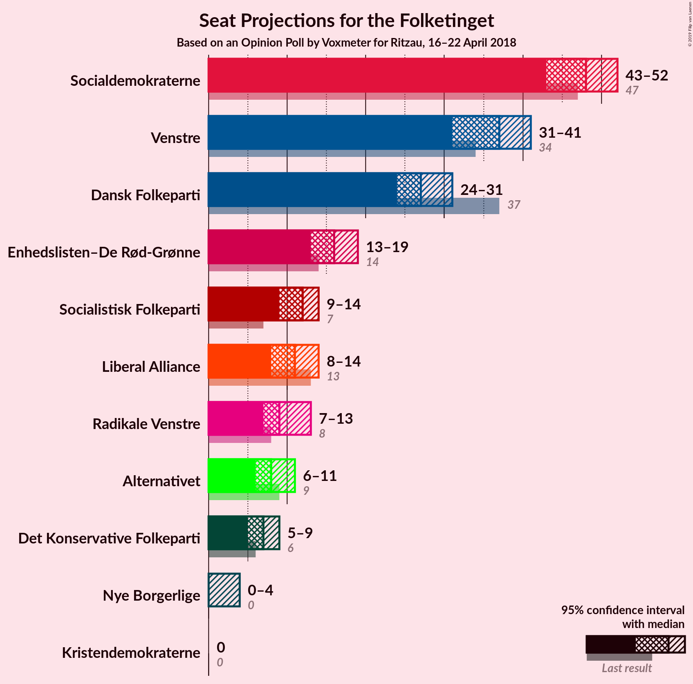
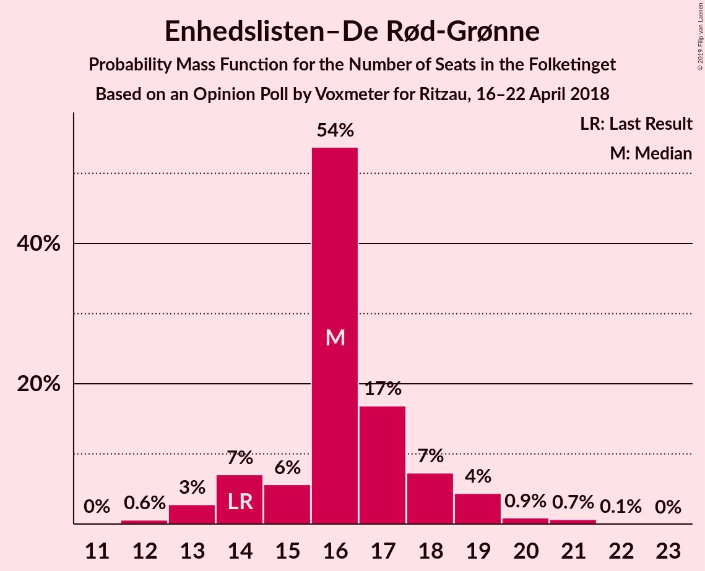
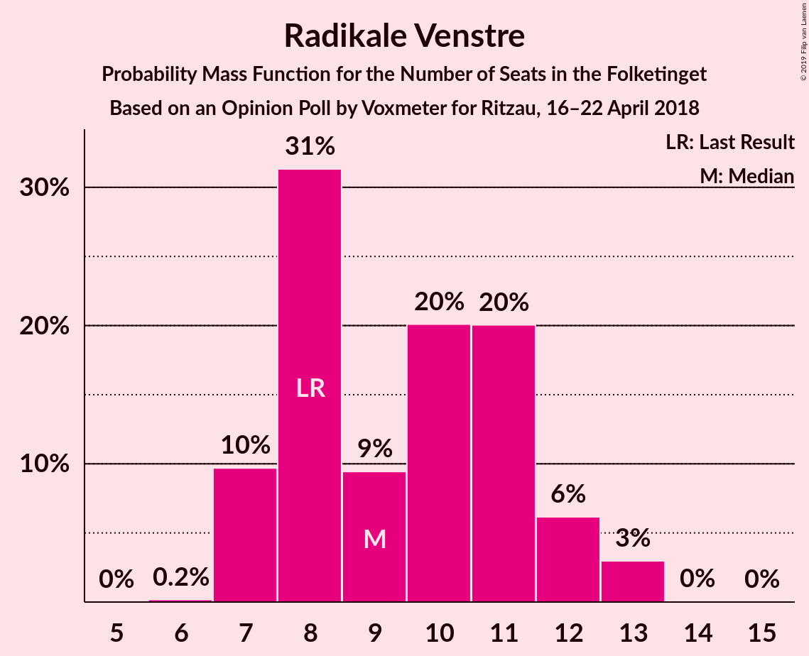
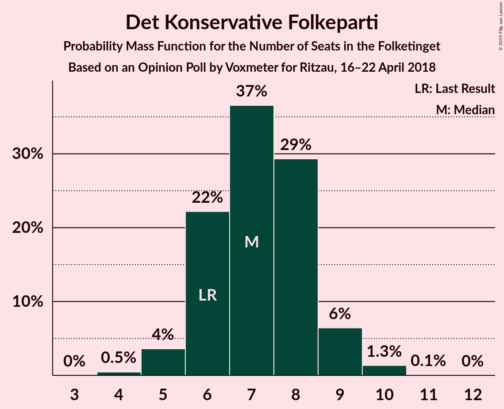
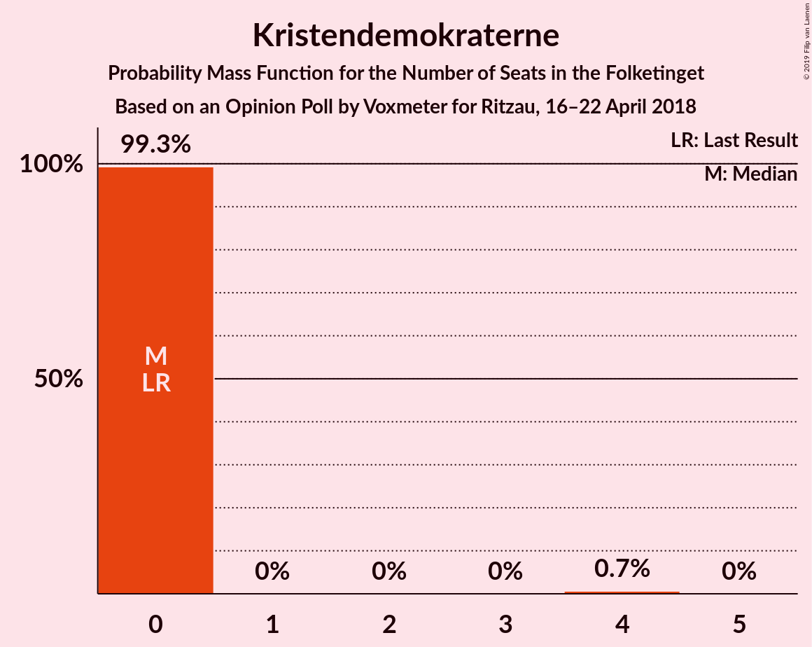

# Opinion Poll by Voxmeter for Ritzau, 16–22 April 2018

<a href="#voting-intentions">Voting Intentions</a> | <a href="#seats">Seats</a> | <a href="#coalitions">Coalitions</a> | <a href="#technical-information">Technical Information</a>

## Voting Intentions

### Confidence Intervals

| Party | Last Result | Poll Result | 80% Confidence Interval | 90% Confidence Interval | 95% Confidence Interval | 99% Confidence Interval |
|:-----:|:-----------:|:-----------:|:-----------------------:|:-----------------------:|:-----------------------:|:-----------------------:|
| Socialdemokraterne | 26.3% | 26.7% | 25.0–28.5% |24.5–29.1% |24.1–29.5% |23.3–30.4% |
| Venstre | 19.5% | 20.0% | 18.5–21.7% |18.0–22.1% |17.7–22.5% |17.0–23.4% |
| Dansk Folkeparti | 21.1% | 15.6% | 14.2–17.1% |13.8–17.5% |13.5–17.9% |12.9–18.7% |
| Enhedslisten–De Rød-Grønne | 7.8% | 9.0% | 8.0–10.3% |7.7–10.6% |7.4–10.9% |7.0–11.6% |
| Socialistisk Folkeparti | 4.2% | 6.6% | 5.7–7.7% |5.5–8.0% |5.3–8.3% |4.9–8.9% |
| Liberal Alliance | 7.5% | 6.2% | 5.3–7.2% |5.0–7.5% |4.8–7.8% |4.5–8.3% |
| Radikale Venstre | 4.6% | 5.2% | 4.4–6.2% |4.2–6.5% |4.0–6.7% |3.6–7.2% |
| Alternativet | 4.8% | 4.4% | 3.7–5.4% |3.5–5.6% |3.3–5.9% |3.0–6.3% |
| Det Konservative Folkeparti | 3.4% | 3.9% | 3.3–4.8% |3.1–5.1% |2.9–5.3% |2.6–5.8% |
| Nye Borgerlige | 0.0% | 1.1% | 0.7–1.6% |0.7–1.8% |0.6–1.9% |0.5–2.2% |
| Kristendemokraterne | 0.8% | 1.0% | 0.7–1.5% |0.6–1.6% |0.5–1.8% |0.4–2.1% |

*Note:* The poll result column reflects the actual value used in the calculations. Published results may vary slightly, and in addition be rounded to fewer digits.

## Seats

### Confidence Intervals

| Party | Last Result | Median | 80% Confidence Interval | 90% Confidence Interval | 95% Confidence Interval | 99% Confidence Interval |
|:-----:|:-----------:|:------:|:-----------------------:|:-----------------------:|:-----------------------:|:-----------------------:|
| <a href="#socialdemokraterne">Socialdemokraterne</a> | 47 | 48 | 44–50 |44–51 |43–52 |42–54 |
| <a href="#venstre">Venstre</a> | 34 | 37 | 33–39 |32–41 |31–41 |30–41 |
| <a href="#dansk-folkeparti">Dansk Folkeparti</a> | 37 | 27 | 24–30 |24–31 |24–31 |24–33 |
| <a href="#enhedslisten–de-rød-grønne">Enhedslisten–De Rød-Grønne</a> | 14 | 16 | 14–18 |14–19 |13–19 |12–21 |
| <a href="#socialistisk-folkeparti">Socialistisk Folkeparti</a> | 7 | 12 | 10–13 |9–14 |9–14 |9–15 |
| <a href="#liberal-alliance">Liberal Alliance</a> | 13 | 11 | 9–13 |9–13 |8–14 |8–16 |
| <a href="#radikale-venstre">Radikale Venstre</a> | 8 | 9 | 8–11 |7–12 |7–13 |7–13 |
| <a href="#alternativet">Alternativet</a> | 9 | 8 | 6–9 |6–10 |6–11 |5–11 |
| <a href="#det-konservative-folkeparti">Det Konservative Folkeparti</a> | 6 | 7 | 6–8 |6–9 |5–9 |5–10 |
| <a href="#nye-borgerlige">Nye Borgerlige</a> | 0 | 0 | 0 |0–4 |0–4 |0–4 |
| <a href="#kristendemokraterne">Kristendemokraterne</a> | 0 | 0 | 0 |0 |0 |0–4 |

### Socialdemokraterne

*For a full overview of the results for this party, see the [Socialdemokraterne](party-socialdemokraterne.html) page.*

| Number of Seats | Probability | Accumulated | Special Marks |
|:---------------:|:-----------:|:-----------:|:-------------:|
| 39 | 0.2% | 100% |  |
| 40 | 0.1% | 99.8% |  |
| 41 | 0.1% | 99.8% |  |
| 42 | 0.9% | 99.7% |  |
| 43 | 2% | 98.7% |  |
| 44 | 7% | 97% |  |
| 45 | 6% | 89% |  |
| 46 | 8% | 83% |  |
| 47 | 21% | 75% | Last Result |
| 48 | 19% | 54% | Median |
| 49 | 9% | 34% |  |
| 50 | 19% | 25% |  |
| 51 | 2% | 7% |  |
| 52 | 3% | 5% |  |
| 53 | 1.0% | 2% |  |
| 54 | 0.6% | 0.8% |  |
| 55 | 0.1% | 0.2% |  |
| 56 | 0.1% | 0.2% |  |
| 57 | 0.1% | 0.1% |  |
| 58 | 0% | 0% |  |

### Venstre

*For a full overview of the results for this party, see the [Venstre](party-venstre.html) page.*

| Number of Seats | Probability | Accumulated | Special Marks |
|:---------------:|:-----------:|:-----------:|:-------------:|
| 29 | 0.1% | 100% |  |
| 30 | 0.5% | 99.9% |  |
| 31 | 4% | 99.4% |  |
| 32 | 4% | 95% |  |
| 33 | 5% | 91% |  |
| 34 | 6% | 86% | Last Result |
| 35 | 11% | 80% |  |
| 36 | 15% | 69% |  |
| 37 | 13% | 53% | Median |
| 38 | 28% | 40% |  |
| 39 | 5% | 12% |  |
| 40 | 1.4% | 7% |  |
| 41 | 6% | 6% |  |
| 42 | 0.1% | 0.1% |  |
| 43 | 0% | 0% |  |

### Dansk Folkeparti

*For a full overview of the results for this party, see the [Dansk Folkeparti](party-danskfolkeparti.html) page.*

| Number of Seats | Probability | Accumulated | Special Marks |
|:---------------:|:-----------:|:-----------:|:-------------:|
| 22 | 0.2% | 100% |  |
| 23 | 0.2% | 99.8% |  |
| 24 | 12% | 99.6% |  |
| 25 | 3% | 88% |  |
| 26 | 12% | 85% |  |
| 27 | 38% | 74% | Median |
| 28 | 9% | 36% |  |
| 29 | 7% | 27% |  |
| 30 | 13% | 20% |  |
| 31 | 4% | 6% |  |
| 32 | 2% | 2% |  |
| 33 | 0.4% | 0.6% |  |
| 34 | 0.1% | 0.2% |  |
| 35 | 0% | 0% |  |
| 36 | 0% | 0% |  |
| 37 | 0% | 0% | Last Result |

### Enhedslisten–De Rød-Grønne

*For a full overview of the results for this party, see the [Enhedslisten–De Rød-Grønne](party-enhedslisten–derød-grønne.html) page.*

| Number of Seats | Probability | Accumulated | Special Marks |
|:---------------:|:-----------:|:-----------:|:-------------:|
| 12 | 0.6% | 100% |  |
| 13 | 3% | 99.4% |  |
| 14 | 7% | 97% | Last Result |
| 15 | 6% | 90% |  |
| 16 | 54% | 84% | Median |
| 17 | 17% | 30% |  |
| 18 | 7% | 13% |  |
| 19 | 4% | 6% |  |
| 20 | 0.9% | 2% |  |
| 21 | 0.7% | 0.8% |  |
| 22 | 0.1% | 0.1% |  |
| 23 | 0% | 0% |  |

### Socialistisk Folkeparti

*For a full overview of the results for this party, see the [Socialistisk Folkeparti](party-socialistiskfolkeparti.html) page.*

| Number of Seats | Probability | Accumulated | Special Marks |
|:---------------:|:-----------:|:-----------:|:-------------:|
| 7 | 0% | 100% | Last Result |
| 8 | 0.2% | 100% |  |
| 9 | 6% | 99.8% |  |
| 10 | 10% | 94% |  |
| 11 | 19% | 84% |  |
| 12 | 32% | 65% | Median |
| 13 | 24% | 33% |  |
| 14 | 7% | 9% |  |
| 15 | 2% | 2% |  |
| 16 | 0.3% | 0.4% |  |
| 17 | 0.1% | 0.1% |  |
| 18 | 0% | 0% |  |

### Liberal Alliance

*For a full overview of the results for this party, see the [Liberal Alliance](party-liberalalliance.html) page.*

| Number of Seats | Probability | Accumulated | Special Marks |
|:---------------:|:-----------:|:-----------:|:-------------:|
| 7 | 0.1% | 100% |  |
| 8 | 4% | 99.9% |  |
| 9 | 19% | 96% |  |
| 10 | 10% | 77% |  |
| 11 | 40% | 67% | Median |
| 12 | 14% | 26% |  |
| 13 | 9% | 12% | Last Result |
| 14 | 2% | 3% |  |
| 15 | 0.6% | 1.5% |  |
| 16 | 0.8% | 0.8% |  |
| 17 | 0% | 0% |  |

### Radikale Venstre

*For a full overview of the results for this party, see the [Radikale Venstre](party-radikalevenstre.html) page.*

| Number of Seats | Probability | Accumulated | Special Marks |
|:---------------:|:-----------:|:-----------:|:-------------:|
| 6 | 0.2% | 100% |  |
| 7 | 10% | 99.8% |  |
| 8 | 31% | 90% | Last Result |
| 9 | 9% | 59% | Median |
| 10 | 20% | 49% |  |
| 11 | 20% | 29% |  |
| 12 | 6% | 9% |  |
| 13 | 3% | 3% |  |
| 14 | 0% | 0.1% |  |
| 15 | 0% | 0% |  |

### Alternativet

*For a full overview of the results for this party, see the [Alternativet](party-alternativet.html) page.*

| Number of Seats | Probability | Accumulated | Special Marks |
|:---------------:|:-----------:|:-----------:|:-------------:|
| 5 | 1.4% | 100% |  |
| 6 | 20% | 98.6% |  |
| 7 | 23% | 79% |  |
| 8 | 21% | 56% | Median |
| 9 | 27% | 35% | Last Result |
| 10 | 6% | 9% |  |
| 11 | 3% | 3% |  |
| 12 | 0.1% | 0.2% |  |
| 13 | 0% | 0% |  |

### Det Konservative Folkeparti

*For a full overview of the results for this party, see the [Det Konservative Folkeparti](party-detkonservativefolkeparti.html) page.*

| Number of Seats | Probability | Accumulated | Special Marks |
|:---------------:|:-----------:|:-----------:|:-------------:|
| 4 | 0.5% | 100% |  |
| 5 | 4% | 99.5% |  |
| 6 | 22% | 96% | Last Result |
| 7 | 37% | 74% | Median |
| 8 | 29% | 37% |  |
| 9 | 6% | 8% |  |
| 10 | 1.3% | 1.4% |  |
| 11 | 0.1% | 0.1% |  |
| 12 | 0% | 0% |  |

### Nye Borgerlige

*For a full overview of the results for this party, see the [Nye Borgerlige](party-nyeborgerlige.html) page.*

| Number of Seats | Probability | Accumulated | Special Marks |
|:---------------:|:-----------:|:-----------:|:-------------:|
| 0 | 95% | 100% | Last Result, Median |
| 1 | 0% | 5% |  |
| 2 | 0% | 5% |  |
| 3 | 0.1% | 5% |  |
| 4 | 5% | 5% |  |
| 5 | 0% | 0% |  |

### Kristendemokraterne

*For a full overview of the results for this party, see the [Kristendemokraterne](party-kristendemokraterne.html) page.*

| Number of Seats | Probability | Accumulated | Special Marks |
|:---------------:|:-----------:|:-----------:|:-------------:|
| 0 | 99.3% | 100% | Last Result, Median |
| 1 | 0% | 0.7% |  |
| 2 | 0% | 0.7% |  |
| 3 | 0% | 0.7% |  |
| 4 | 0.7% | 0.7% |  |
| 5 | 0% | 0% |  |

## Coalitions

### Confidence Intervals

| Coalition | Last Result | Median | Majority? | 80% Confidence Interval | 90% Confidence Interval | 95% Confidence Interval | 99% Confidence Interval |
|:---------:|:-----------:|:------:|:---------:|:-----------------------:|:-----------------------:|:-----------------------:|:-----------------------:|
| Socialdemokraterne – Enhedslisten–De Rød-Grønne – Socialistisk Folkeparti – Radikale Venstre – Alternativet | 85 | 93 | 91% | 90–96 | 88–97 | 88–98 | 87–101 |
| Socialdemokraterne – Enhedslisten–De Rød-Grønne – Socialistisk Folkeparti – Radikale Venstre | 76 | 86 | 2% | 82–88 | 81–89 | 81–89 | 78–92 |
| Socialdemokraterne – Enhedslisten–De Rød-Grønne – Socialistisk Folkeparti – Alternativet | 77 | 84 | 1.3% | 80–87 | 80–87 | 79–89 | 77–92 |
| Venstre – Dansk Folkeparti – Liberal Alliance – Det Konservative Folkeparti – Nye Borgerlige – Kristendemokraterne | 90 | 82 | 0.3% | 79–85 | 78–87 | 77–87 | 74–88 |
| Venstre – Dansk Folkeparti – Liberal Alliance – Det Konservative Folkeparti – Kristendemokraterne | 90 | 82 | 0.3% | 78–85 | 78–87 | 77–87 | 74–88 |
| Venstre – Dansk Folkeparti – Liberal Alliance – Det Konservative Folkeparti – Nye Borgerlige | 90 | 82 | 0.3% | 79–85 | 78–87 | 77–87 | 74–88 |
| Venstre – Dansk Folkeparti – Liberal Alliance – Det Konservative Folkeparti | 90 | 82 | 0.3% | 78–85 | 78–87 | 77–87 | 74–88 |
| Socialdemokraterne – Enhedslisten–De Rød-Grønne – Socialistisk Folkeparti | 68 | 76 | 0% | 72–78 | 71–79 | 71–80 | 69–84 |
| Socialdemokraterne – Socialistisk Folkeparti – Radikale Venstre | 62 | 70 | 0% | 66–72 | 65–73 | 64–73 | 62–76 |
| Socialdemokraterne – Radikale Venstre | 55 | 57 | 0% | 54–60 | 53–61 | 53–61 | 51–64 |
| Venstre – Liberal Alliance – Det Konservative Folkeparti | 53 | 55 | 0% | 51–57 | 50–58 | 49–58 | 47–60 |
| Venstre – Det Konservative Folkeparti | 40 | 44 | 0% | 40–46 | 39–47 | 38–47 | 37–48 |
| Venstre | 34 | 37 | 0% | 33–39 | 32–41 | 31–41 | 30–41 |

### Socialdemokraterne – Enhedslisten–De Rød-Grønne – Socialistisk Folkeparti – Radikale Venstre – Alternativet

| Number of Seats | Probability | Accumulated | Special Marks |
|:---------------:|:-----------:|:-----------:|:-------------:|
| 85 | 0.2% | 100% | Last Result |
| 86 | 0.1% | 99.7% |  |
| 87 | 0.9% | 99.6% |  |
| 88 | 6% | 98.7% |  |
| 89 | 1.5% | 92% |  |
| 90 | 4% | 91% | Majority |
| 91 | 8% | 87% |  |
| 92 | 21% | 79% |  |
| 93 | 15% | 57% | Median |
| 94 | 16% | 42% |  |
| 95 | 14% | 27% |  |
| 96 | 7% | 13% |  |
| 97 | 4% | 7% |  |
| 98 | 1.3% | 3% |  |
| 99 | 0.2% | 1.4% |  |
| 100 | 0.4% | 1.2% |  |
| 101 | 0.8% | 0.9% |  |
| 102 | 0.1% | 0.1% |  |
| 103 | 0% | 0% |  |

### Socialdemokraterne – Enhedslisten–De Rød-Grønne – Socialistisk Folkeparti – Radikale Venstre

| Number of Seats | Probability | Accumulated | Special Marks |
|:---------------:|:-----------:|:-----------:|:-------------:|
| 76 | 0% | 100% | Last Result |
| 77 | 0.1% | 99.9% |  |
| 78 | 0.4% | 99.9% |  |
| 79 | 0.3% | 99.4% |  |
| 80 | 1.2% | 99.1% |  |
| 81 | 7% | 98% |  |
| 82 | 8% | 91% |  |
| 83 | 5% | 83% |  |
| 84 | 16% | 78% |  |
| 85 | 7% | 62% | Median |
| 86 | 30% | 54% |  |
| 87 | 7% | 24% |  |
| 88 | 9% | 17% |  |
| 89 | 6% | 8% |  |
| 90 | 1.0% | 2% | Majority |
| 91 | 0.5% | 1.4% |  |
| 92 | 0.7% | 0.9% |  |
| 93 | 0.1% | 0.2% |  |
| 94 | 0.1% | 0.1% |  |
| 95 | 0% | 0% |  |

### Socialdemokraterne – Enhedslisten–De Rød-Grønne – Socialistisk Folkeparti – Alternativet

| Number of Seats | Probability | Accumulated | Special Marks |
|:---------------:|:-----------:|:-----------:|:-------------:|
| 75 | 0% | 100% |  |
| 76 | 0.3% | 99.9% |  |
| 77 | 0.8% | 99.6% | Last Result |
| 78 | 1.0% | 98.8% |  |
| 79 | 1.3% | 98% |  |
| 80 | 10% | 97% |  |
| 81 | 9% | 87% |  |
| 82 | 4% | 78% |  |
| 83 | 8% | 74% |  |
| 84 | 40% | 66% | Median |
| 85 | 12% | 26% |  |
| 86 | 3% | 14% |  |
| 87 | 7% | 11% |  |
| 88 | 2% | 5% |  |
| 89 | 1.3% | 3% |  |
| 90 | 0.2% | 1.3% | Majority |
| 91 | 0.3% | 1.1% |  |
| 92 | 0.3% | 0.8% |  |
| 93 | 0.5% | 0.5% |  |
| 94 | 0% | 0% |  |

### Venstre – Dansk Folkeparti – Liberal Alliance – Det Konservative Folkeparti – Nye Borgerlige – Kristendemokraterne

| Number of Seats | Probability | Accumulated | Special Marks |
|:---------------:|:-----------:|:-----------:|:-------------:|
| 73 | 0.1% | 100% |  |
| 74 | 0.8% | 99.9% |  |
| 75 | 0.4% | 99.1% |  |
| 76 | 0.2% | 98.8% |  |
| 77 | 1.3% | 98.6% |  |
| 78 | 4% | 97% |  |
| 79 | 7% | 93% |  |
| 80 | 14% | 87% |  |
| 81 | 16% | 73% |  |
| 82 | 15% | 58% | Median |
| 83 | 21% | 43% |  |
| 84 | 8% | 21% |  |
| 85 | 4% | 13% |  |
| 86 | 1.5% | 9% |  |
| 87 | 6% | 8% |  |
| 88 | 0.9% | 1.3% |  |
| 89 | 0.1% | 0.4% |  |
| 90 | 0.2% | 0.3% | Last Result, Majority |
| 91 | 0% | 0% |  |

### Venstre – Dansk Folkeparti – Liberal Alliance – Det Konservative Folkeparti – Kristendemokraterne

| Number of Seats | Probability | Accumulated | Special Marks |
|:---------------:|:-----------:|:-----------:|:-------------:|
| 73 | 0.1% | 100% |  |
| 74 | 0.8% | 99.9% |  |
| 75 | 0.4% | 99.1% |  |
| 76 | 0.4% | 98.7% |  |
| 77 | 2% | 98% |  |
| 78 | 8% | 97% |  |
| 79 | 7% | 88% |  |
| 80 | 13% | 82% |  |
| 81 | 15% | 68% |  |
| 82 | 11% | 53% | Median |
| 83 | 21% | 42% |  |
| 84 | 8% | 21% |  |
| 85 | 4% | 13% |  |
| 86 | 1.4% | 9% |  |
| 87 | 6% | 8% |  |
| 88 | 0.9% | 1.3% |  |
| 89 | 0.1% | 0.4% |  |
| 90 | 0.2% | 0.3% | Last Result, Majority |
| 91 | 0% | 0% |  |

### Venstre – Dansk Folkeparti – Liberal Alliance – Det Konservative Folkeparti – Nye Borgerlige

| Number of Seats | Probability | Accumulated | Special Marks |
|:---------------:|:-----------:|:-----------:|:-------------:|
| 73 | 0.1% | 100% |  |
| 74 | 0.8% | 99.9% |  |
| 75 | 0.4% | 99.1% |  |
| 76 | 0.2% | 98.7% |  |
| 77 | 1.3% | 98.5% |  |
| 78 | 4% | 97% |  |
| 79 | 7% | 93% |  |
| 80 | 14% | 87% |  |
| 81 | 16% | 73% |  |
| 82 | 15% | 57% | Median |
| 83 | 21% | 42% |  |
| 84 | 8% | 21% |  |
| 85 | 3% | 13% |  |
| 86 | 1.4% | 9% |  |
| 87 | 6% | 8% |  |
| 88 | 0.9% | 1.3% |  |
| 89 | 0.1% | 0.4% |  |
| 90 | 0.2% | 0.3% | Last Result, Majority |
| 91 | 0% | 0% |  |

### Venstre – Dansk Folkeparti – Liberal Alliance – Det Konservative Folkeparti

| Number of Seats | Probability | Accumulated | Special Marks |
|:---------------:|:-----------:|:-----------:|:-------------:|
| 73 | 0.1% | 100% |  |
| 74 | 0.8% | 99.9% |  |
| 75 | 0.4% | 99.1% |  |
| 76 | 0.4% | 98.7% |  |
| 77 | 2% | 98% |  |
| 78 | 8% | 97% |  |
| 79 | 7% | 88% |  |
| 80 | 13% | 82% |  |
| 81 | 16% | 68% |  |
| 82 | 11% | 53% | Median |
| 83 | 21% | 42% |  |
| 84 | 8% | 21% |  |
| 85 | 3% | 12% |  |
| 86 | 1.4% | 9% |  |
| 87 | 6% | 8% |  |
| 88 | 0.9% | 1.2% |  |
| 89 | 0.1% | 0.3% |  |
| 90 | 0.2% | 0.3% | Last Result, Majority |
| 91 | 0% | 0% |  |

### Socialdemokraterne – Enhedslisten–De Rød-Grønne – Socialistisk Folkeparti

| Number of Seats | Probability | Accumulated | Special Marks |
|:---------------:|:-----------:|:-----------:|:-------------:|
| 67 | 0% | 100% |  |
| 68 | 0.1% | 99.9% | Last Result |
| 69 | 0.7% | 99.9% |  |
| 70 | 0.4% | 99.2% |  |
| 71 | 7% | 98.7% |  |
| 72 | 4% | 91% |  |
| 73 | 5% | 88% |  |
| 74 | 11% | 83% |  |
| 75 | 10% | 72% |  |
| 76 | 21% | 62% | Median |
| 77 | 10% | 41% |  |
| 78 | 24% | 31% |  |
| 79 | 4% | 7% |  |
| 80 | 0.8% | 3% |  |
| 81 | 1.4% | 2% |  |
| 82 | 0.3% | 1.0% |  |
| 83 | 0.1% | 0.7% |  |
| 84 | 0.6% | 0.6% |  |
| 85 | 0% | 0% |  |

### Socialdemokraterne – Socialistisk Folkeparti – Radikale Venstre

| Number of Seats | Probability | Accumulated | Special Marks |
|:---------------:|:-----------:|:-----------:|:-------------:|
| 60 | 0% | 100% |  |
| 61 | 0.1% | 99.9% |  |
| 62 | 0.5% | 99.8% | Last Result |
| 63 | 0.5% | 99.3% |  |
| 64 | 2% | 98.7% |  |
| 65 | 6% | 97% |  |
| 66 | 8% | 91% |  |
| 67 | 13% | 83% |  |
| 68 | 12% | 70% |  |
| 69 | 5% | 58% | Median |
| 70 | 33% | 53% |  |
| 71 | 4% | 20% |  |
| 72 | 8% | 16% |  |
| 73 | 6% | 8% |  |
| 74 | 1.0% | 2% |  |
| 75 | 0.4% | 0.9% |  |
| 76 | 0.4% | 0.5% |  |
| 77 | 0.1% | 0.1% |  |
| 78 | 0% | 0% |  |

### Socialdemokraterne – Radikale Venstre

| Number of Seats | Probability | Accumulated | Special Marks |
|:---------------:|:-----------:|:-----------:|:-------------:|
| 48 | 0.2% | 100% |  |
| 49 | 0.1% | 99.8% |  |
| 50 | 0.1% | 99.7% |  |
| 51 | 0.7% | 99.6% |  |
| 52 | 1.2% | 98.9% |  |
| 53 | 4% | 98% |  |
| 54 | 7% | 94% |  |
| 55 | 12% | 87% | Last Result |
| 56 | 10% | 75% |  |
| 57 | 16% | 65% | Median |
| 58 | 28% | 49% |  |
| 59 | 8% | 21% |  |
| 60 | 6% | 13% |  |
| 61 | 5% | 8% |  |
| 62 | 1.1% | 2% |  |
| 63 | 0.5% | 1.0% |  |
| 64 | 0.3% | 0.5% |  |
| 65 | 0.2% | 0.2% |  |
| 66 | 0% | 0% |  |

### Venstre – Liberal Alliance – Det Konservative Folkeparti

| Number of Seats | Probability | Accumulated | Special Marks |
|:---------------:|:-----------:|:-----------:|:-------------:|
| 46 | 0.2% | 100% |  |
| 47 | 0.6% | 99.8% |  |
| 48 | 0.3% | 99.2% |  |
| 49 | 2% | 99.0% |  |
| 50 | 3% | 97% |  |
| 51 | 12% | 94% |  |
| 52 | 9% | 82% |  |
| 53 | 13% | 73% | Last Result |
| 54 | 8% | 60% |  |
| 55 | 7% | 52% | Median |
| 56 | 19% | 45% |  |
| 57 | 17% | 26% |  |
| 58 | 7% | 9% |  |
| 59 | 0.9% | 2% |  |
| 60 | 0.7% | 1.0% |  |
| 61 | 0.1% | 0.3% |  |
| 62 | 0.2% | 0.2% |  |
| 63 | 0% | 0% |  |

### Venstre – Det Konservative Folkeparti

| Number of Seats | Probability | Accumulated | Special Marks |
|:---------------:|:-----------:|:-----------:|:-------------:|
| 36 | 0.4% | 100% |  |
| 37 | 0.3% | 99.5% |  |
| 38 | 4% | 99.3% |  |
| 39 | 4% | 95% |  |
| 40 | 6% | 91% | Last Result |
| 41 | 4% | 85% |  |
| 42 | 12% | 82% |  |
| 43 | 15% | 70% |  |
| 44 | 8% | 55% | Median |
| 45 | 28% | 47% |  |
| 46 | 11% | 19% |  |
| 47 | 7% | 8% |  |
| 48 | 1.4% | 2% |  |
| 49 | 0.3% | 0.5% |  |
| 50 | 0.1% | 0.1% |  |
| 51 | 0% | 0% |  |

### Venstre

| Number of Seats | Probability | Accumulated | Special Marks |
|:---------------:|:-----------:|:-----------:|:-------------:|
| 29 | 0.1% | 100% |  |
| 30 | 0.5% | 99.9% |  |
| 31 | 4% | 99.4% |  |
| 32 | 4% | 95% |  |
| 33 | 5% | 91% |  |
| 34 | 6% | 86% | Last Result |
| 35 | 11% | 80% |  |
| 36 | 15% | 69% |  |
| 37 | 13% | 53% | Median |
| 38 | 28% | 40% |  |
| 39 | 5% | 12% |  |
| 40 | 1.4% | 7% |  |
| 41 | 6% | 6% |  |
| 42 | 0.1% | 0.1% |  |
| 43 | 0% | 0% |  |

## Technical Information

### Opinion Poll

+ **Polling firm:** Voxmeter
+ **Commissioner(s):** Ritzau
+ **Fieldwork period:** 16–22 April 2018

### Calculations

+ **Sample size:** 1040
+ **Simulations done:** 1,048,576
+ **Error estimate:** 3.05%

