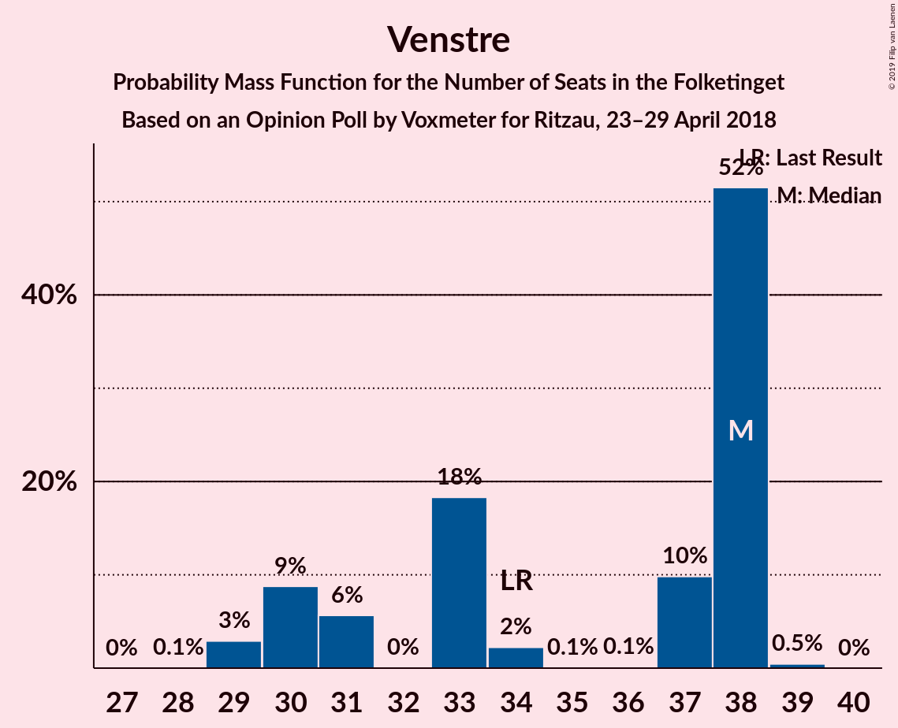
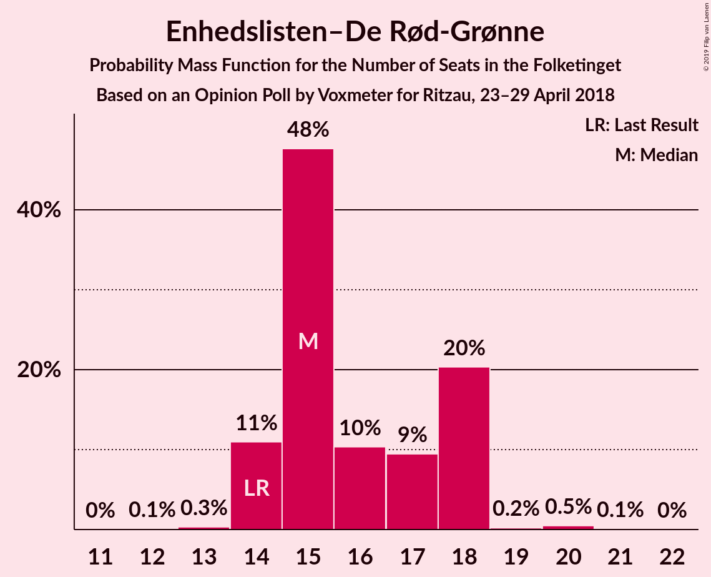
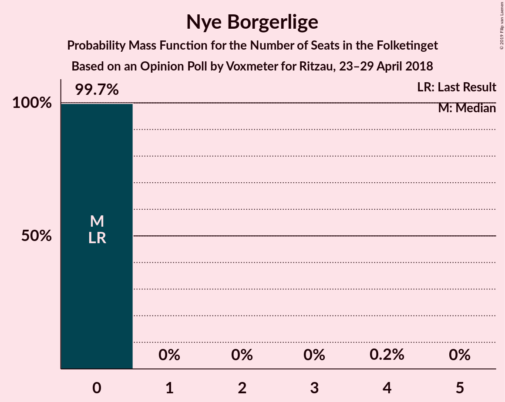

# Opinion Poll by Voxmeter for Ritzau, 23–29 April 2018

<a href="#voting-intentions">Voting Intentions</a> | <a href="#seats">Seats</a> | <a href="#coalitions">Coalitions</a> | <a href="#technical-information">Technical Information</a>

## Voting Intentions

### Confidence Intervals

| Party | Last Result | Poll Result | 80% Confidence Interval | 90% Confidence Interval | 95% Confidence Interval | 99% Confidence Interval |
|:-----:|:-----------:|:-----------:|:-----------------------:|:-----------------------:|:-----------------------:|:-----------------------:|
| Socialdemokraterne | 26.3% | 27.3% | 25.6–29.2% |25.1–29.7% |24.7–30.1% |23.9–31.0% |
| Venstre | 19.5% | 19.1% | 17.6–20.8% |17.2–21.2% |16.8–21.6% |16.1–22.4% |
| Dansk Folkeparti | 21.1% | 16.4% | 15.0–18.0% |14.6–18.4% |14.3–18.8% |13.6–19.6% |
| Enhedslisten–De Rød-Grønne | 7.8% | 9.1% | 8.0–10.3% |7.7–10.7% |7.5–11.0% |7.0–11.6% |
| Socialistisk Folkeparti | 4.2% | 6.8% | 5.9–7.9% |5.6–8.2% |5.4–8.5% |5.0–9.0% |
| Liberal Alliance | 7.5% | 5.8% | 5.0–6.8% |4.7–7.1% |4.5–7.4% |4.1–7.9% |
| Alternativet | 4.8% | 4.8% | 4.1–5.8% |3.9–6.1% |3.7–6.3% |3.3–6.8% |
| Radikale Venstre | 4.6% | 4.6% | 3.9–5.6% |3.7–5.9% |3.5–6.1% |3.2–6.6% |
| Det Konservative Folkeparti | 3.4% | 4.2% | 3.5–5.2% |3.3–5.4% |3.2–5.7% |2.9–6.1% |
| Nye Borgerlige | 0.0% | 1.0% | 0.7–1.5% |0.6–1.6% |0.5–1.8% |0.4–2.1% |
| Kristendemokraterne | 0.8% | 0.8% | 0.5–1.3% |0.4–1.4% |0.4–1.5% |0.3–1.8% |

*Note:* The poll result column reflects the actual value used in the calculations. Published results may vary slightly, and in addition be rounded to fewer digits.

## Seats

### Confidence Intervals

| Party | Last Result | Median | 80% Confidence Interval | 90% Confidence Interval | 95% Confidence Interval | 99% Confidence Interval |
|:-----:|:-----------:|:------:|:-----------------------:|:-----------------------:|:-----------------------:|:-----------------------:|
| <a href="#socialdemokraterne">Socialdemokraterne</a> | 47 | 50 | 49–50 |47–50 |47–50 |44–50 |
| <a href="#venstre">Venstre</a> | 34 | 37 | 37 |35–38 |35–42 |29–42 |
| <a href="#dansk-folkeparti">Dansk Folkeparti</a> | 37 | 25 | 25–28 |25–30 |25–30 |25–32 |
| <a href="#enhedslisten–de-rød-grønne">Enhedslisten–De Rød-Grønne</a> | 14 | 11 | 11–17 |11–18 |11–18 |11–18 |
| <a href="#socialistisk-folkeparti">Socialistisk Folkeparti</a> | 7 | 13 | 12–13 |10–13 |9–13 |9–16 |
| <a href="#liberal-alliance">Liberal Alliance</a> | 13 | 11 | 8–11 |8–11 |8–11 |8–11 |
| <a href="#alternativet">Alternativet</a> | 9 | 11 | 11 |8–12 |8–12 |8–12 |
| <a href="#radikale-venstre">Radikale Venstre</a> | 8 | 9 | 8–9 |7–9 |7–9 |7–11 |
| <a href="#det-konservative-folkeparti">Det Konservative Folkeparti</a> | 6 | 8 | 7–8 |7–8 |5–8 |5–8 |
| <a href="#nye-borgerlige">Nye Borgerlige</a> | 0 | 0 | 0 |0 |0 |0 |
| <a href="#kristendemokraterne">Kristendemokraterne</a> | 0 | 0 | 0 |0 |0 |0 |

### Socialdemokraterne

*For a full overview of the results for this party, see the [Socialdemokraterne](party-socialdemokraterne.html) page.*

| Number of Seats | Probability | Accumulated | Special Marks |
|:---------------:|:-----------:|:-----------:|:-------------:|
| 43 | 0.4% | 100% |  |
| 44 | 0.1% | 99.6% |  |
| 45 | 0% | 99.5% |  |
| 46 | 0% | 99.5% |  |
| 47 | 7% | 99.4% | Last Result |
| 48 | 0.8% | 92% |  |
| 49 | 5% | 92% |  |
| 50 | 87% | 87% | Median |
| 51 | 0% | 0.1% |  |
| 52 | 0% | 0.1% |  |
| 53 | 0% | 0.1% |  |
| 54 | 0% | 0.1% |  |
| 55 | 0% | 0.1% |  |
| 56 | 0% | 0.1% |  |
| 57 | 0.1% | 0.1% |  |
| 58 | 0% | 0% |  |

### Venstre

*For a full overview of the results for this party, see the [Venstre](party-venstre.html) page.*

| Number of Seats | Probability | Accumulated | Special Marks |
|:---------------:|:-----------:|:-----------:|:-------------:|
| 27 | 0.4% | 100% |  |
| 28 | 0% | 99.6% |  |
| 29 | 0.1% | 99.6% |  |
| 30 | 0.4% | 99.5% |  |
| 31 | 0.1% | 99.1% |  |
| 32 | 0% | 99.0% |  |
| 33 | 0.1% | 99.0% |  |
| 34 | 0% | 98.9% | Last Result |
| 35 | 7% | 98.9% |  |
| 36 | 0% | 92% |  |
| 37 | 87% | 92% | Median |
| 38 | 0.3% | 5% |  |
| 39 | 0% | 5% |  |
| 40 | 0% | 5% |  |
| 41 | 0% | 5% |  |
| 42 | 5% | 5% |  |
| 43 | 0% | 0% |  |

### Dansk Folkeparti

*For a full overview of the results for this party, see the [Dansk Folkeparti](party-danskfolkeparti.html) page.*

| Number of Seats | Probability | Accumulated | Special Marks |
|:---------------:|:-----------:|:-----------:|:-------------:|
| 24 | 0% | 100% |  |
| 25 | 87% | 99.9% | Median |
| 26 | 0% | 13% |  |
| 27 | 0% | 13% |  |
| 28 | 7% | 13% |  |
| 29 | 0% | 6% |  |
| 30 | 5% | 6% |  |
| 31 | 0.5% | 1.4% |  |
| 32 | 0.3% | 0.8% |  |
| 33 | 0% | 0.5% |  |
| 34 | 0.4% | 0.5% |  |
| 35 | 0% | 0.1% |  |
| 36 | 0.1% | 0.1% |  |
| 37 | 0% | 0% | Last Result |

### Enhedslisten–De Rød-Grønne

*For a full overview of the results for this party, see the [Enhedslisten–De Rød-Grønne](party-enhedslisten–derød-grønne.html) page.*

| Number of Seats | Probability | Accumulated | Special Marks |
|:---------------:|:-----------:|:-----------:|:-------------:|
| 11 | 87% | 100% | Median |
| 12 | 0% | 13% |  |
| 13 | 0% | 13% |  |
| 14 | 0.5% | 13% | Last Result |
| 15 | 0% | 12% |  |
| 16 | 0.1% | 12% |  |
| 17 | 5% | 12% |  |
| 18 | 7% | 7% |  |
| 19 | 0% | 0% |  |

### Socialistisk Folkeparti

*For a full overview of the results for this party, see the [Socialistisk Folkeparti](party-socialistiskfolkeparti.html) page.*

| Number of Seats | Probability | Accumulated | Special Marks |
|:---------------:|:-----------:|:-----------:|:-------------:|
| 7 | 0% | 100% | Last Result |
| 8 | 0% | 100% |  |
| 9 | 5% | 100% |  |
| 10 | 0.3% | 95% |  |
| 11 | 0.1% | 95% |  |
| 12 | 7% | 95% |  |
| 13 | 87% | 88% | Median |
| 14 | 0% | 0.9% |  |
| 15 | 0.4% | 0.9% |  |
| 16 | 0.5% | 0.5% |  |
| 17 | 0% | 0% |  |

### Liberal Alliance

*For a full overview of the results for this party, see the [Liberal Alliance](party-liberalalliance.html) page.*

| Number of Seats | Probability | Accumulated | Special Marks |
|:---------------:|:-----------:|:-----------:|:-------------:|
| 6 | 0.1% | 100% |  |
| 7 | 0% | 99.9% |  |
| 8 | 12% | 99.9% |  |
| 9 | 0% | 88% |  |
| 10 | 0.1% | 88% |  |
| 11 | 88% | 88% | Median |
| 12 | 0% | 0.1% |  |
| 13 | 0% | 0.1% | Last Result |
| 14 | 0.1% | 0.1% |  |
| 15 | 0.1% | 0.1% |  |
| 16 | 0% | 0% |  |

### Alternativet

*For a full overview of the results for this party, see the [Alternativet](party-alternativet.html) page.*

| Number of Seats | Probability | Accumulated | Special Marks |
|:---------------:|:-----------:|:-----------:|:-------------:|
| 7 | 0.1% | 100% |  |
| 8 | 6% | 99.9% |  |
| 9 | 0.1% | 94% | Last Result |
| 10 | 0.1% | 94% |  |
| 11 | 87% | 94% | Median |
| 12 | 7% | 7% |  |
| 13 | 0% | 0% |  |

### Radikale Venstre

*For a full overview of the results for this party, see the [Radikale Venstre](party-radikalevenstre.html) page.*

| Number of Seats | Probability | Accumulated | Special Marks |
|:---------------:|:-----------:|:-----------:|:-------------:|
| 7 | 5% | 100% |  |
| 8 | 7% | 95% | Last Result |
| 9 | 87% | 88% | Median |
| 10 | 0% | 0.9% |  |
| 11 | 0.9% | 0.9% |  |
| 12 | 0% | 0% |  |

### Det Konservative Folkeparti

*For a full overview of the results for this party, see the [Det Konservative Folkeparti](party-detkonservativefolkeparti.html) page.*

| Number of Seats | Probability | Accumulated | Special Marks |
|:---------------:|:-----------:|:-----------:|:-------------:|
| 5 | 5% | 100% |  |
| 6 | 0% | 95% | Last Result |
| 7 | 8% | 95% |  |
| 8 | 87% | 87% | Median |
| 9 | 0.4% | 0.4% |  |
| 10 | 0% | 0.1% |  |
| 11 | 0% | 0.1% |  |
| 12 | 0% | 0% |  |

### Nye Borgerlige

*For a full overview of the results for this party, see the [Nye Borgerlige](party-nyeborgerlige.html) page.*

| Number of Seats | Probability | Accumulated | Special Marks |
|:---------------:|:-----------:|:-----------:|:-------------:|
| 0 | 99.9% | 100% | Last Result, Median |
| 1 | 0% | 0.1% |  |
| 2 | 0% | 0.1% |  |
| 3 | 0% | 0.1% |  |
| 4 | 0.1% | 0.1% |  |
| 5 | 0% | 0% |  |

### Kristendemokraterne

*For a full overview of the results for this party, see the [Kristendemokraterne](party-kristendemokraterne.html) page.*

| Number of Seats | Probability | Accumulated | Special Marks |
|:---------------:|:-----------:|:-----------:|:-------------:|
| 0 | 100% | 100% | Last Result, Median |

## Coalitions

### Confidence Intervals

| Coalition | Last Result | Median | Majority? | 80% Confidence Interval | 90% Confidence Interval | 95% Confidence Interval | 99% Confidence Interval |
|:---------:|:-----------:|:------:|:---------:|:-----------------------:|:-----------------------:|:-----------------------:|:-----------------------:|
| Socialdemokraterne – Enhedslisten–De Rød-Grønne – Socialistisk Folkeparti – Alternativet – Radikale Venstre | 85 | 94 | 99.6% | 94 | 90–97 | 90–97 | 90–97 |
| Socialdemokraterne – Enhedslisten–De Rød-Grønne – Socialistisk Folkeparti – Radikale Venstre | 76 | 83 | 0.1% | 83 | 82–85 | 82–85 | 82–87 |
| Venstre – Dansk Folkeparti – Liberal Alliance – Det Konservative Folkeparti – Nye Borgerlige – Kristendemokraterne | 90 | 81 | 0% | 81 | 78–85 | 78–85 | 78–85 |
| Venstre – Dansk Folkeparti – Liberal Alliance – Det Konservative Folkeparti – Kristendemokraterne | 90 | 81 | 0% | 81 | 78–85 | 78–85 | 78–85 |
| Venstre – Dansk Folkeparti – Liberal Alliance – Det Konservative Folkeparti – Nye Borgerlige | 90 | 81 | 0% | 81 | 78–85 | 78–85 | 78–85 |
| Venstre – Dansk Folkeparti – Liberal Alliance – Det Konservative Folkeparti | 90 | 81 | 0% | 81 | 78–85 | 78–85 | 78–85 |

### Socialdemokraterne – Enhedslisten–De Rød-Grønne – Socialistisk Folkeparti – Alternativet – Radikale Venstre

| Number of Seats | Probability | Accumulated | Special Marks |
|:---------------:|:-----------:|:-----------:|:-------------:|
| 85 | 0% | 100% | Last Result |
| 86 | 0% | 100% |  |
| 87 | 0% | 100% |  |
| 88 | 0.3% | 100% |  |
| 89 | 0% | 99.6% |  |
| 90 | 5% | 99.6% | Majority |
| 91 | 0% | 95% |  |
| 92 | 0% | 95% |  |
| 93 | 0% | 95% |  |
| 94 | 87% | 95% | Median |
| 95 | 0% | 8% |  |
| 96 | 0.9% | 8% |  |
| 97 | 7% | 7% |  |
| 98 | 0% | 0.1% |  |
| 99 | 0% | 0.1% |  |
| 100 | 0.1% | 0.1% |  |
| 101 | 0% | 0% |  |

### Socialdemokraterne – Enhedslisten–De Rød-Grønne – Socialistisk Folkeparti – Radikale Venstre

| Number of Seats | Probability | Accumulated | Special Marks |
|:---------------:|:-----------:|:-----------:|:-------------:|
| 76 | 0% | 100% | Last Result |
| 77 | 0% | 100% |  |
| 78 | 0% | 100% |  |
| 79 | 0% | 100% |  |
| 80 | 0.3% | 100% |  |
| 81 | 0.1% | 99.7% |  |
| 82 | 5% | 99.5% |  |
| 83 | 87% | 95% | Median |
| 84 | 0.4% | 8% |  |
| 85 | 7% | 8% |  |
| 86 | 0% | 0.6% |  |
| 87 | 0.1% | 0.6% |  |
| 88 | 0.4% | 0.5% |  |
| 89 | 0% | 0.1% |  |
| 90 | 0% | 0.1% | Majority |
| 91 | 0% | 0% |  |

### Venstre – Dansk Folkeparti – Liberal Alliance – Det Konservative Folkeparti – Nye Borgerlige – Kristendemokraterne

| Number of Seats | Probability | Accumulated | Special Marks |
|:---------------:|:-----------:|:-----------:|:-------------:|
| 75 | 0.1% | 100% |  |
| 76 | 0% | 99.9% |  |
| 77 | 0% | 99.9% |  |
| 78 | 7% | 99.9% |  |
| 79 | 0.9% | 93% |  |
| 80 | 0% | 92% |  |
| 81 | 87% | 92% | Median |
| 82 | 0% | 5% |  |
| 83 | 0% | 5% |  |
| 84 | 0% | 5% |  |
| 85 | 5% | 5% |  |
| 86 | 0% | 0.4% |  |
| 87 | 0.3% | 0.4% |  |
| 88 | 0% | 0% |  |
| 89 | 0% | 0% |  |
| 90 | 0% | 0% | Last Result, Majority |

### Venstre – Dansk Folkeparti – Liberal Alliance – Det Konservative Folkeparti – Kristendemokraterne

| Number of Seats | Probability | Accumulated | Special Marks |
|:---------------:|:-----------:|:-----------:|:-------------:|
| 75 | 0.1% | 100% |  |
| 76 | 0% | 99.9% |  |
| 77 | 0.1% | 99.9% |  |
| 78 | 7% | 99.9% |  |
| 79 | 0.9% | 93% |  |
| 80 | 0% | 92% |  |
| 81 | 87% | 92% | Median |
| 82 | 0% | 5% |  |
| 83 | 0% | 5% |  |
| 84 | 0% | 5% |  |
| 85 | 5% | 5% |  |
| 86 | 0% | 0.4% |  |
| 87 | 0.3% | 0.3% |  |
| 88 | 0% | 0% |  |
| 89 | 0% | 0% |  |
| 90 | 0% | 0% | Last Result, Majority |

### Venstre – Dansk Folkeparti – Liberal Alliance – Det Konservative Folkeparti – Nye Borgerlige

| Number of Seats | Probability | Accumulated | Special Marks |
|:---------------:|:-----------:|:-----------:|:-------------:|
| 75 | 0.1% | 100% |  |
| 76 | 0% | 99.9% |  |
| 77 | 0% | 99.9% |  |
| 78 | 7% | 99.9% |  |
| 79 | 0.9% | 93% |  |
| 80 | 0% | 92% |  |
| 81 | 87% | 92% | Median |
| 82 | 0% | 5% |  |
| 83 | 0% | 5% |  |
| 84 | 0% | 5% |  |
| 85 | 5% | 5% |  |
| 86 | 0% | 0.4% |  |
| 87 | 0.3% | 0.4% |  |
| 88 | 0% | 0% |  |
| 89 | 0% | 0% |  |
| 90 | 0% | 0% | Last Result, Majority |

### Venstre – Dansk Folkeparti – Liberal Alliance – Det Konservative Folkeparti

| Number of Seats | Probability | Accumulated | Special Marks |
|:---------------:|:-----------:|:-----------:|:-------------:|
| 75 | 0.1% | 100% |  |
| 76 | 0% | 99.9% |  |
| 77 | 0.1% | 99.9% |  |
| 78 | 7% | 99.9% |  |
| 79 | 0.9% | 93% |  |
| 80 | 0% | 92% |  |
| 81 | 87% | 92% | Median |
| 82 | 0% | 5% |  |
| 83 | 0% | 5% |  |
| 84 | 0% | 5% |  |
| 85 | 5% | 5% |  |
| 86 | 0% | 0.4% |  |
| 87 | 0.3% | 0.3% |  |
| 88 | 0% | 0% |  |
| 89 | 0% | 0% |  |
| 90 | 0% | 0% | Last Result, Majority |

## Technical Information

### Opinion Poll

+ **Polling firm:** Voxmeter
+ **Commissioner(s):** Ritzau
+ **Fieldwork period:** 23–29 April 2018

### Calculations

+ **Sample size:** 1036
+ **Simulations done:** 1,024
+ **Error estimate:** 5.52%

