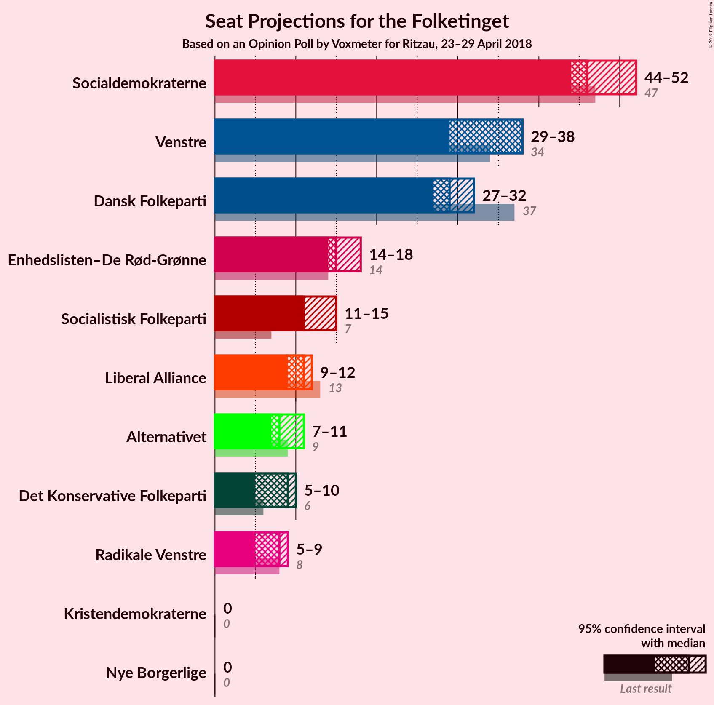
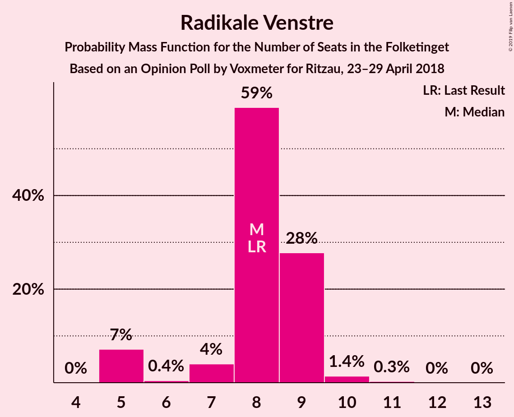
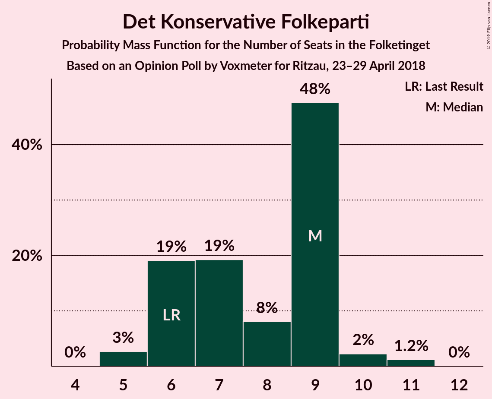
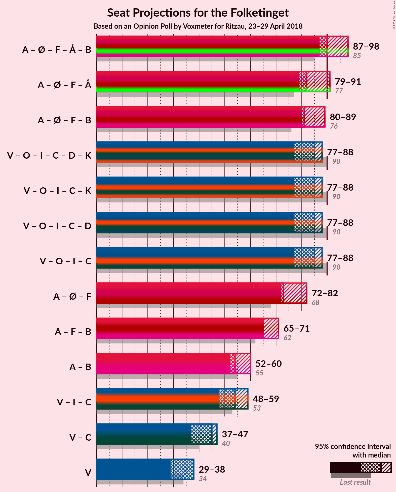

# Opinion Poll by Voxmeter for Ritzau, 23–29 April 2018

<a href="#voting-intentions">Voting Intentions</a> | <a href="#seats">Seats</a> | <a href="#coalitions">Coalitions</a> | <a href="#technical-information">Technical Information</a>

## Voting Intentions

### Confidence Intervals

| Party | Last Result | Poll Result | 80% Confidence Interval | 90% Confidence Interval | 95% Confidence Interval | 99% Confidence Interval |
|:-----:|:-----------:|:-----------:|:-----------------------:|:-----------------------:|:-----------------------:|:-----------------------:|
| Socialdemokraterne | 26.3% | 27.3% | 25.6–29.2% |25.1–29.7% |24.7–30.1% |23.9–31.0% |
| Venstre | 19.5% | 19.1% | 17.6–20.8% |17.2–21.2% |16.8–21.6% |16.1–22.4% |
| Dansk Folkeparti | 21.1% | 16.4% | 15.0–18.0% |14.6–18.4% |14.3–18.8% |13.6–19.6% |
| Enhedslisten–De Rød-Grønne | 7.8% | 9.1% | 8.0–10.3% |7.7–10.7% |7.5–11.0% |7.0–11.6% |
| Socialistisk Folkeparti | 4.2% | 6.8% | 5.9–7.9% |5.6–8.2% |5.4–8.5% |5.0–9.0% |
| Liberal Alliance | 7.5% | 5.8% | 5.0–6.8% |4.7–7.1% |4.5–7.4% |4.1–7.9% |
| Alternativet | 4.8% | 4.8% | 4.1–5.8% |3.9–6.1% |3.7–6.3% |3.3–6.8% |
| Radikale Venstre | 4.6% | 4.6% | 3.9–5.6% |3.7–5.9% |3.5–6.1% |3.2–6.6% |
| Det Konservative Folkeparti | 3.4% | 4.2% | 3.5–5.2% |3.3–5.4% |3.2–5.7% |2.9–6.1% |
| Nye Borgerlige | 0.0% | 1.0% | 0.7–1.5% |0.6–1.6% |0.5–1.8% |0.4–2.1% |
| Kristendemokraterne | 0.8% | 0.8% | 0.5–1.3% |0.4–1.4% |0.4–1.5% |0.3–1.8% |

*Note:* The poll result column reflects the actual value used in the calculations. Published results may vary slightly, and in addition be rounded to fewer digits.

## Seats

### Confidence Intervals

| Party | Last Result | Median | 80% Confidence Interval | 90% Confidence Interval | 95% Confidence Interval | 99% Confidence Interval |
|:-----:|:-----------:|:------:|:-----------------------:|:-----------------------:|:-----------------------:|:-----------------------:|
| <a href="#socialdemokraterne">Socialdemokraterne</a> | 47 | 46 | 45–51 |44–51 |44–52 |44–53 |
| <a href="#venstre">Venstre</a> | 34 | 38 | 30–38 |30–38 |29–38 |29–38 |
| <a href="#dansk-folkeparti">Dansk Folkeparti</a> | 37 | 29 | 29–31 |28–32 |27–32 |26–32 |
| <a href="#enhedslisten–de-rød-grønne">Enhedslisten–De Rød-Grønne</a> | 14 | 15 | 14–18 |14–18 |14–18 |14–20 |
| <a href="#socialistisk-folkeparti">Socialistisk Folkeparti</a> | 7 | 11 | 11–14 |11–15 |11–15 |9–15 |
| <a href="#liberal-alliance">Liberal Alliance</a> | 13 | 11 | 9–12 |9–12 |9–12 |8–13 |
| <a href="#alternativet">Alternativet</a> | 9 | 8 | 7–9 |7–11 |7–11 |6–11 |
| <a href="#radikale-venstre">Radikale Venstre</a> | 8 | 8 | 7–9 |5–9 |5–9 |5–10 |
| <a href="#det-konservative-folkeparti">Det Konservative Folkeparti</a> | 6 | 9 | 6–9 |6–9 |5–10 |5–11 |
| <a href="#nye-borgerlige">Nye Borgerlige</a> | 0 | 0 | 0 |0 |0 |0 |
| <a href="#kristendemokraterne">Kristendemokraterne</a> | 0 | 0 | 0 |0 |0 |0 |

### Socialdemokraterne

*For a full overview of the results for this party, see the [Socialdemokraterne](party-socialdemokraterne.html) page.*

| Number of Seats | Probability | Accumulated | Special Marks |
|:---------------:|:-----------:|:-----------:|:-------------:|
| 42 | 0% | 100% |  |
| 43 | 0% | 99.9% |  |
| 44 | 7% | 99.9% |  |
| 45 | 11% | 93% |  |
| 46 | 40% | 82% | Median |
| 47 | 15% | 42% | Last Result |
| 48 | 1.2% | 27% |  |
| 49 | 2% | 26% |  |
| 50 | 0.1% | 24% |  |
| 51 | 21% | 24% |  |
| 52 | 1.3% | 3% |  |
| 53 | 2% | 2% |  |
| 54 | 0% | 0% |  |

### Venstre

*For a full overview of the results for this party, see the [Venstre](party-venstre.html) page.*

| Number of Seats | Probability | Accumulated | Special Marks |
|:---------------:|:-----------:|:-----------:|:-------------:|
| 28 | 0.1% | 100% |  |
| 29 | 3% | 99.9% |  |
| 30 | 9% | 97% |  |
| 31 | 6% | 88% |  |
| 32 | 0% | 83% |  |
| 33 | 18% | 83% |  |
| 34 | 2% | 64% | Last Result |
| 35 | 0.1% | 62% |  |
| 36 | 0.1% | 62% |  |
| 37 | 10% | 62% |  |
| 38 | 52% | 52% | Median |
| 39 | 0.5% | 0.5% |  |
| 40 | 0% | 0% |  |

### Dansk Folkeparti

*For a full overview of the results for this party, see the [Dansk Folkeparti](party-danskfolkeparti.html) page.*

| Number of Seats | Probability | Accumulated | Special Marks |
|:---------------:|:-----------:|:-----------:|:-------------:|
| 23 | 0% | 100% |  |
| 24 | 0.1% | 99.9% |  |
| 25 | 0.1% | 99.9% |  |
| 26 | 0.8% | 99.7% |  |
| 27 | 2% | 99.0% |  |
| 28 | 5% | 97% |  |
| 29 | 50% | 93% | Median |
| 30 | 18% | 43% |  |
| 31 | 19% | 25% |  |
| 32 | 6% | 6% |  |
| 33 | 0.2% | 0.4% |  |
| 34 | 0% | 0.2% |  |
| 35 | 0.1% | 0.2% |  |
| 36 | 0.1% | 0.1% |  |
| 37 | 0% | 0% | Last Result |

### Enhedslisten–De Rød-Grønne

*For a full overview of the results for this party, see the [Enhedslisten–De Rød-Grønne](party-enhedslisten–derød-grønne.html) page.*

| Number of Seats | Probability | Accumulated | Special Marks |
|:---------------:|:-----------:|:-----------:|:-------------:|
| 12 | 0.1% | 100% |  |
| 13 | 0.3% | 99.9% |  |
| 14 | 11% | 99.6% | Last Result |
| 15 | 48% | 89% | Median |
| 16 | 10% | 41% |  |
| 17 | 9% | 31% |  |
| 18 | 20% | 21% |  |
| 19 | 0.2% | 0.8% |  |
| 20 | 0.5% | 0.6% |  |
| 21 | 0.1% | 0.1% |  |
| 22 | 0% | 0% |  |

### Socialistisk Folkeparti

*For a full overview of the results for this party, see the [Socialistisk Folkeparti](party-socialistiskfolkeparti.html) page.*

| Number of Seats | Probability | Accumulated | Special Marks |
|:---------------:|:-----------:|:-----------:|:-------------:|
| 7 | 0% | 100% | Last Result |
| 8 | 0% | 100% |  |
| 9 | 2% | 100% |  |
| 10 | 0.3% | 98% |  |
| 11 | 58% | 98% | Median |
| 12 | 5% | 40% |  |
| 13 | 13% | 35% |  |
| 14 | 12% | 22% |  |
| 15 | 10% | 10% |  |
| 16 | 0.1% | 0.2% |  |
| 17 | 0.1% | 0.1% |  |
| 18 | 0% | 0% |  |

### Liberal Alliance

*For a full overview of the results for this party, see the [Liberal Alliance](party-liberalalliance.html) page.*

| Number of Seats | Probability | Accumulated | Special Marks |
|:---------------:|:-----------:|:-----------:|:-------------:|
| 7 | 0.1% | 100% |  |
| 8 | 2% | 99.9% |  |
| 9 | 32% | 98% |  |
| 10 | 9% | 66% |  |
| 11 | 8% | 57% | Median |
| 12 | 47% | 49% |  |
| 13 | 2% | 2% | Last Result |
| 14 | 0.1% | 0.4% |  |
| 15 | 0.2% | 0.2% |  |
| 16 | 0% | 0% |  |

### Alternativet

*For a full overview of the results for this party, see the [Alternativet](party-alternativet.html) page.*

| Number of Seats | Probability | Accumulated | Special Marks |
|:---------------:|:-----------:|:-----------:|:-------------:|
| 5 | 0.1% | 100% |  |
| 6 | 0.6% | 99.9% |  |
| 7 | 42% | 99.3% |  |
| 8 | 18% | 58% | Median |
| 9 | 33% | 39% | Last Result |
| 10 | 0.3% | 6% |  |
| 11 | 6% | 6% |  |
| 12 | 0% | 0% |  |

### Radikale Venstre

*For a full overview of the results for this party, see the [Radikale Venstre](party-radikalevenstre.html) page.*

| Number of Seats | Probability | Accumulated | Special Marks |
|:---------------:|:-----------:|:-----------:|:-------------:|
| 5 | 7% | 100% |  |
| 6 | 0.4% | 93% |  |
| 7 | 4% | 92% |  |
| 8 | 59% | 88% | Last Result, Median |
| 9 | 28% | 30% |  |
| 10 | 1.4% | 2% |  |
| 11 | 0.3% | 0.4% |  |
| 12 | 0% | 0.1% |  |
| 13 | 0% | 0% |  |

### Det Konservative Folkeparti

*For a full overview of the results for this party, see the [Det Konservative Folkeparti](party-detkonservativefolkeparti.html) page.*

| Number of Seats | Probability | Accumulated | Special Marks |
|:---------------:|:-----------:|:-----------:|:-------------:|
| 5 | 3% | 100% |  |
| 6 | 19% | 97% | Last Result |
| 7 | 19% | 78% |  |
| 8 | 8% | 59% |  |
| 9 | 48% | 51% | Median |
| 10 | 2% | 3% |  |
| 11 | 1.2% | 1.2% |  |
| 12 | 0% | 0% |  |

### Nye Borgerlige

*For a full overview of the results for this party, see the [Nye Borgerlige](party-nyeborgerlige.html) page.*

| Number of Seats | Probability | Accumulated | Special Marks |
|:---------------:|:-----------:|:-----------:|:-------------:|
| 0 | 99.7% | 100% | Last Result, Median |
| 1 | 0% | 0.3% |  |
| 2 | 0% | 0.3% |  |
| 3 | 0% | 0.3% |  |
| 4 | 0.2% | 0.3% |  |
| 5 | 0% | 0% |  |

### Kristendemokraterne

*For a full overview of the results for this party, see the [Kristendemokraterne](party-kristendemokraterne.html) page.*

| Number of Seats | Probability | Accumulated | Special Marks |
|:---------------:|:-----------:|:-----------:|:-------------:|
| 0 | 100% | 100% | Last Result, Median |

## Coalitions

### Confidence Intervals

| Coalition | Last Result | Median | Majority? | 80% Confidence Interval | 90% Confidence Interval | 95% Confidence Interval | 99% Confidence Interval |
|:---------:|:-----------:|:------:|:---------:|:-----------------------:|:-----------------------:|:-----------------------:|:-----------------------:|
| Socialdemokraterne – Enhedslisten–De Rød-Grønne – Socialistisk Folkeparti – Alternativet – Radikale Venstre | 85 | 90 | 59% | 87–97 | 87–97 | 87–98 | 87–102 |
| Socialdemokraterne – Enhedslisten–De Rød-Grønne – Socialistisk Folkeparti – Alternativet | 77 | 82 | 3% | 79–88 | 79–88 | 79–91 | 79–92 |
| Socialdemokraterne – Enhedslisten–De Rød-Grønne – Socialistisk Folkeparti – Radikale Venstre | 76 | 81 | 1.1% | 80–89 | 80–89 | 80–89 | 80–93 |
| Venstre – Dansk Folkeparti – Liberal Alliance – Det Konservative Folkeparti – Nye Borgerlige – Kristendemokraterne | 90 | 85 | 0% | 78–88 | 78–88 | 77–88 | 73–88 |
| Venstre – Dansk Folkeparti – Liberal Alliance – Det Konservative Folkeparti – Kristendemokraterne | 90 | 85 | 0% | 78–88 | 78–88 | 77–88 | 73–88 |
| Venstre – Dansk Folkeparti – Liberal Alliance – Det Konservative Folkeparti – Nye Borgerlige | 90 | 85 | 0% | 78–88 | 78–88 | 77–88 | 73–88 |
| Venstre – Dansk Folkeparti – Liberal Alliance – Det Konservative Folkeparti | 90 | 85 | 0% | 78–88 | 78–88 | 77–88 | 73–88 |
| Socialdemokraterne – Enhedslisten–De Rød-Grønne – Socialistisk Folkeparti | 68 | 73 | 0% | 72–80 | 72–80 | 72–82 | 72–83 |
| Socialdemokraterne – Socialistisk Folkeparti – Radikale Venstre | 62 | 65 | 0% | 65–71 | 65–71 | 65–71 | 64–76 |
| Socialdemokraterne – Radikale Venstre | 55 | 54 | 0% | 52–60 | 52–60 | 52–60 | 51–62 |
| Venstre – Liberal Alliance – Det Konservative Folkeparti | 53 | 54 | 0% | 48–59 | 48–59 | 48–59 | 46–59 |
| Venstre – Det Konservative Folkeparti | 40 | 45 | 0% | 39–47 | 39–47 | 37–47 | 36–47 |
| Venstre | 34 | 38 | 0% | 30–38 | 30–38 | 29–38 | 29–38 |

### Socialdemokraterne – Enhedslisten–De Rød-Grønne – Socialistisk Folkeparti – Alternativet – Radikale Venstre

| Number of Seats | Probability | Accumulated | Special Marks |
|:---------------:|:-----------:|:-----------:|:-------------:|
| 85 | 0% | 100% | Last Result |
| 86 | 0% | 100% |  |
| 87 | 39% | 100% |  |
| 88 | 0.3% | 61% | Median |
| 89 | 1.2% | 60% |  |
| 90 | 11% | 59% | Majority |
| 91 | 8% | 48% |  |
| 92 | 7% | 40% |  |
| 93 | 0.4% | 34% |  |
| 94 | 2% | 33% |  |
| 95 | 8% | 32% |  |
| 96 | 3% | 24% |  |
| 97 | 18% | 21% |  |
| 98 | 2% | 3% |  |
| 99 | 0.1% | 1.1% |  |
| 100 | 0% | 1.0% |  |
| 101 | 0% | 1.0% |  |
| 102 | 1.0% | 1.0% |  |
| 103 | 0% | 0% |  |

### Socialdemokraterne – Enhedslisten–De Rød-Grønne – Socialistisk Folkeparti – Alternativet

| Number of Seats | Probability | Accumulated | Special Marks |
|:---------------:|:-----------:|:-----------:|:-------------:|
| 77 | 0% | 100% | Last Result |
| 78 | 0% | 100% |  |
| 79 | 40% | 100% |  |
| 80 | 1.1% | 60% | Median |
| 81 | 0.4% | 59% |  |
| 82 | 11% | 59% |  |
| 83 | 1.1% | 48% |  |
| 84 | 6% | 47% |  |
| 85 | 0.6% | 41% |  |
| 86 | 15% | 40% |  |
| 87 | 2% | 26% |  |
| 88 | 21% | 24% |  |
| 89 | 0.2% | 3% |  |
| 90 | 0.1% | 3% | Majority |
| 91 | 2% | 3% |  |
| 92 | 1.0% | 1.0% |  |
| 93 | 0% | 0% |  |

### Socialdemokraterne – Enhedslisten–De Rød-Grønne – Socialistisk Folkeparti – Radikale Venstre

| Number of Seats | Probability | Accumulated | Special Marks |
|:---------------:|:-----------:|:-----------:|:-------------:|
| 76 | 0% | 100% | Last Result |
| 77 | 0% | 100% |  |
| 78 | 0% | 100% |  |
| 79 | 0.1% | 100% |  |
| 80 | 40% | 99.9% | Median |
| 81 | 16% | 60% |  |
| 82 | 9% | 44% |  |
| 83 | 0.1% | 35% |  |
| 84 | 0.7% | 35% |  |
| 85 | 2% | 34% |  |
| 86 | 8% | 32% |  |
| 87 | 3% | 24% |  |
| 88 | 0.5% | 22% |  |
| 89 | 20% | 21% |  |
| 90 | 0.1% | 1.1% | Majority |
| 91 | 0% | 1.1% |  |
| 92 | 0% | 1.0% |  |
| 93 | 1.0% | 1.0% |  |
| 94 | 0% | 0% |  |

### Venstre – Dansk Folkeparti – Liberal Alliance – Det Konservative Folkeparti – Nye Borgerlige – Kristendemokraterne

| Number of Seats | Probability | Accumulated | Special Marks |
|:---------------:|:-----------:|:-----------:|:-------------:|
| 73 | 1.0% | 100% |  |
| 74 | 0% | 99.0% |  |
| 75 | 0% | 99.0% |  |
| 76 | 0.1% | 99.0% |  |
| 77 | 2% | 98.9% |  |
| 78 | 18% | 97% |  |
| 79 | 3% | 79% |  |
| 80 | 8% | 76% |  |
| 81 | 2% | 68% |  |
| 82 | 0.4% | 67% |  |
| 83 | 7% | 66% |  |
| 84 | 8% | 60% |  |
| 85 | 11% | 52% |  |
| 86 | 1.2% | 41% |  |
| 87 | 0.3% | 40% | Median |
| 88 | 39% | 39% |  |
| 89 | 0% | 0% |  |
| 90 | 0% | 0% | Last Result, Majority |

### Venstre – Dansk Folkeparti – Liberal Alliance – Det Konservative Folkeparti – Kristendemokraterne

| Number of Seats | Probability | Accumulated | Special Marks |
|:---------------:|:-----------:|:-----------:|:-------------:|
| 73 | 1.0% | 100% |  |
| 74 | 0% | 99.0% |  |
| 75 | 0% | 99.0% |  |
| 76 | 0.1% | 99.0% |  |
| 77 | 2% | 98.9% |  |
| 78 | 18% | 97% |  |
| 79 | 3% | 79% |  |
| 80 | 8% | 76% |  |
| 81 | 2% | 68% |  |
| 82 | 0.2% | 66% |  |
| 83 | 7% | 66% |  |
| 84 | 8% | 60% |  |
| 85 | 11% | 52% |  |
| 86 | 1.2% | 41% |  |
| 87 | 0.3% | 40% | Median |
| 88 | 39% | 39% |  |
| 89 | 0% | 0% |  |
| 90 | 0% | 0% | Last Result, Majority |

### Venstre – Dansk Folkeparti – Liberal Alliance – Det Konservative Folkeparti – Nye Borgerlige

| Number of Seats | Probability | Accumulated | Special Marks |
|:---------------:|:-----------:|:-----------:|:-------------:|
| 73 | 1.0% | 100% |  |
| 74 | 0% | 99.0% |  |
| 75 | 0% | 99.0% |  |
| 76 | 0.1% | 99.0% |  |
| 77 | 2% | 98.9% |  |
| 78 | 18% | 97% |  |
| 79 | 3% | 79% |  |
| 80 | 8% | 76% |  |
| 81 | 2% | 68% |  |
| 82 | 0.4% | 67% |  |
| 83 | 7% | 66% |  |
| 84 | 8% | 60% |  |
| 85 | 11% | 52% |  |
| 86 | 1.2% | 41% |  |
| 87 | 0.3% | 40% | Median |
| 88 | 39% | 39% |  |
| 89 | 0% | 0% |  |
| 90 | 0% | 0% | Last Result, Majority |

### Venstre – Dansk Folkeparti – Liberal Alliance – Det Konservative Folkeparti

| Number of Seats | Probability | Accumulated | Special Marks |
|:---------------:|:-----------:|:-----------:|:-------------:|
| 73 | 1.0% | 100% |  |
| 74 | 0% | 99.0% |  |
| 75 | 0% | 99.0% |  |
| 76 | 0.1% | 99.0% |  |
| 77 | 2% | 98.9% |  |
| 78 | 18% | 97% |  |
| 79 | 3% | 79% |  |
| 80 | 8% | 76% |  |
| 81 | 2% | 68% |  |
| 82 | 0.2% | 66% |  |
| 83 | 7% | 66% |  |
| 84 | 8% | 60% |  |
| 85 | 11% | 52% |  |
| 86 | 1.2% | 41% |  |
| 87 | 0.3% | 40% | Median |
| 88 | 39% | 39% |  |
| 89 | 0% | 0% |  |
| 90 | 0% | 0% | Last Result, Majority |

### Socialdemokraterne – Enhedslisten–De Rød-Grønne – Socialistisk Folkeparti

| Number of Seats | Probability | Accumulated | Special Marks |
|:---------------:|:-----------:|:-----------:|:-------------:|
| 68 | 0% | 100% | Last Result |
| 69 | 0% | 100% |  |
| 70 | 0% | 100% |  |
| 71 | 0% | 100% |  |
| 72 | 40% | 99.9% | Median |
| 73 | 17% | 60% |  |
| 74 | 0.4% | 43% |  |
| 75 | 0.6% | 42% |  |
| 76 | 1.1% | 42% |  |
| 77 | 15% | 41% |  |
| 78 | 2% | 26% |  |
| 79 | 3% | 24% |  |
| 80 | 18% | 21% |  |
| 81 | 0.1% | 3% |  |
| 82 | 2% | 3% |  |
| 83 | 1.0% | 1.0% |  |
| 84 | 0% | 0% |  |

### Socialdemokraterne – Socialistisk Folkeparti – Radikale Venstre

| Number of Seats | Probability | Accumulated | Special Marks |
|:---------------:|:-----------:|:-----------:|:-------------:|
| 62 | 0.1% | 100% | Last Result |
| 63 | 0.3% | 99.9% |  |
| 64 | 0.5% | 99.7% |  |
| 65 | 53% | 99.2% | Median |
| 66 | 0.1% | 46% |  |
| 67 | 11% | 46% |  |
| 68 | 0.3% | 35% |  |
| 69 | 3% | 35% |  |
| 70 | 0.2% | 32% |  |
| 71 | 30% | 32% |  |
| 72 | 0.1% | 1.4% |  |
| 73 | 0.2% | 1.3% |  |
| 74 | 0.1% | 1.1% |  |
| 75 | 0% | 1.0% |  |
| 76 | 0.9% | 1.0% |  |
| 77 | 0% | 0% |  |

### Socialdemokraterne – Radikale Venstre

| Number of Seats | Probability | Accumulated | Special Marks |
|:---------------:|:-----------:|:-----------:|:-------------:|
| 51 | 0.6% | 100% |  |
| 52 | 13% | 99.4% |  |
| 53 | 12% | 87% |  |
| 54 | 40% | 75% | Median |
| 55 | 0.3% | 35% | Last Result |
| 56 | 10% | 35% |  |
| 57 | 1.4% | 25% |  |
| 58 | 0.1% | 24% |  |
| 59 | 3% | 24% |  |
| 60 | 19% | 21% |  |
| 61 | 0% | 1.4% |  |
| 62 | 1.2% | 1.4% |  |
| 63 | 0.1% | 0.1% |  |
| 64 | 0% | 0% |  |

### Venstre – Liberal Alliance – Det Konservative Folkeparti

| Number of Seats | Probability | Accumulated | Special Marks |
|:---------------:|:-----------:|:-----------:|:-------------:|
| 46 | 1.0% | 100% |  |
| 47 | 0.1% | 99.0% |  |
| 48 | 18% | 98.9% |  |
| 49 | 10% | 81% |  |
| 50 | 0.4% | 71% |  |
| 51 | 8% | 71% |  |
| 52 | 2% | 62% |  |
| 53 | 0.1% | 61% | Last Result |
| 54 | 12% | 61% |  |
| 55 | 7% | 49% |  |
| 56 | 0.3% | 42% |  |
| 57 | 1.3% | 41% |  |
| 58 | 0.4% | 40% | Median |
| 59 | 40% | 40% |  |
| 60 | 0% | 0% |  |

### Venstre – Det Konservative Folkeparti

| Number of Seats | Probability | Accumulated | Special Marks |
|:---------------:|:-----------:|:-----------:|:-------------:|
| 36 | 1.1% | 100% |  |
| 37 | 2% | 98.9% |  |
| 38 | 0.1% | 97% |  |
| 39 | 31% | 97% |  |
| 40 | 0.2% | 66% | Last Result |
| 41 | 1.0% | 65% |  |
| 42 | 3% | 64% |  |
| 43 | 0.1% | 61% |  |
| 44 | 10% | 61% |  |
| 45 | 11% | 51% |  |
| 46 | 0.3% | 40% |  |
| 47 | 40% | 40% | Median |
| 48 | 0% | 0.4% |  |
| 49 | 0.4% | 0.4% |  |
| 50 | 0% | 0% |  |

### Venstre

| Number of Seats | Probability | Accumulated | Special Marks |
|:---------------:|:-----------:|:-----------:|:-------------:|
| 28 | 0.1% | 100% |  |
| 29 | 3% | 99.9% |  |
| 30 | 9% | 97% |  |
| 31 | 6% | 88% |  |
| 32 | 0% | 83% |  |
| 33 | 18% | 83% |  |
| 34 | 2% | 64% | Last Result |
| 35 | 0.1% | 62% |  |
| 36 | 0.1% | 62% |  |
| 37 | 10% | 62% |  |
| 38 | 52% | 52% | Median |
| 39 | 0.5% | 0.5% |  |
| 40 | 0% | 0% |  |

## Technical Information

### Opinion Poll

+ **Polling firm:** Voxmeter
+ **Commissioner(s):** Ritzau
+ **Fieldwork period:** 23–29 April 2018

### Calculations

+ **Sample size:** 1036
+ **Simulations done:** 131,072
+ **Error estimate:** 1.63%

