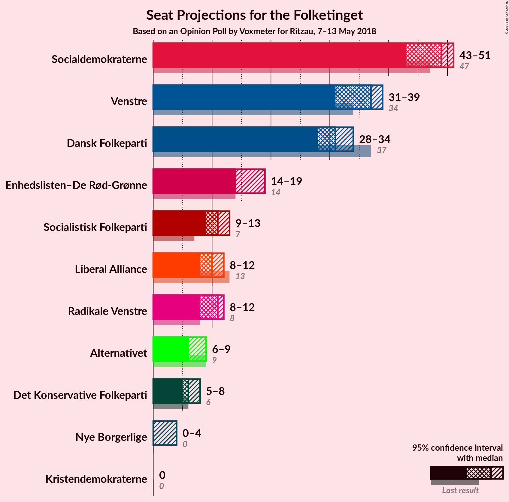
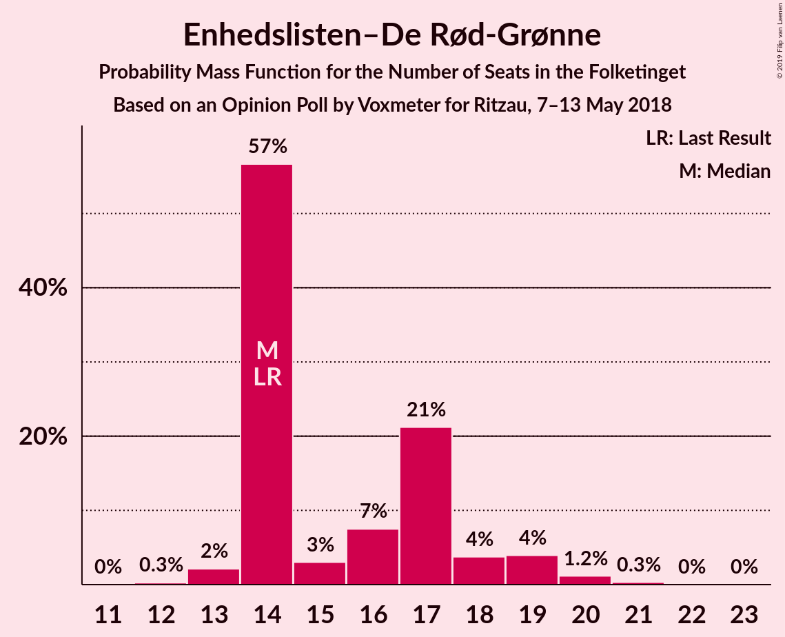
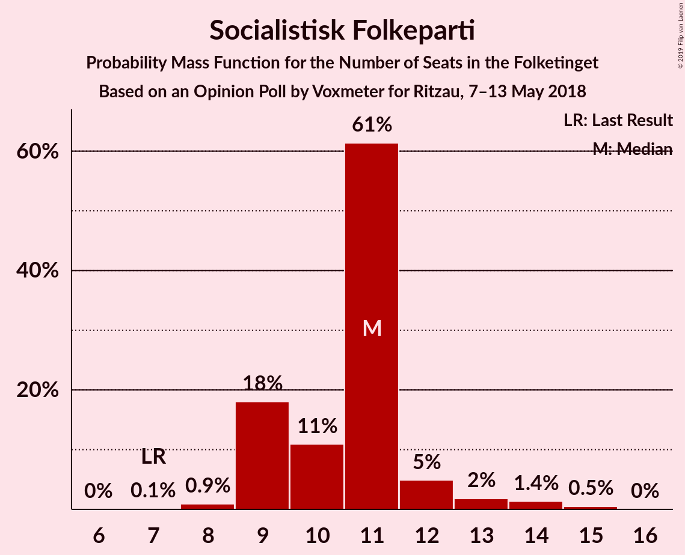
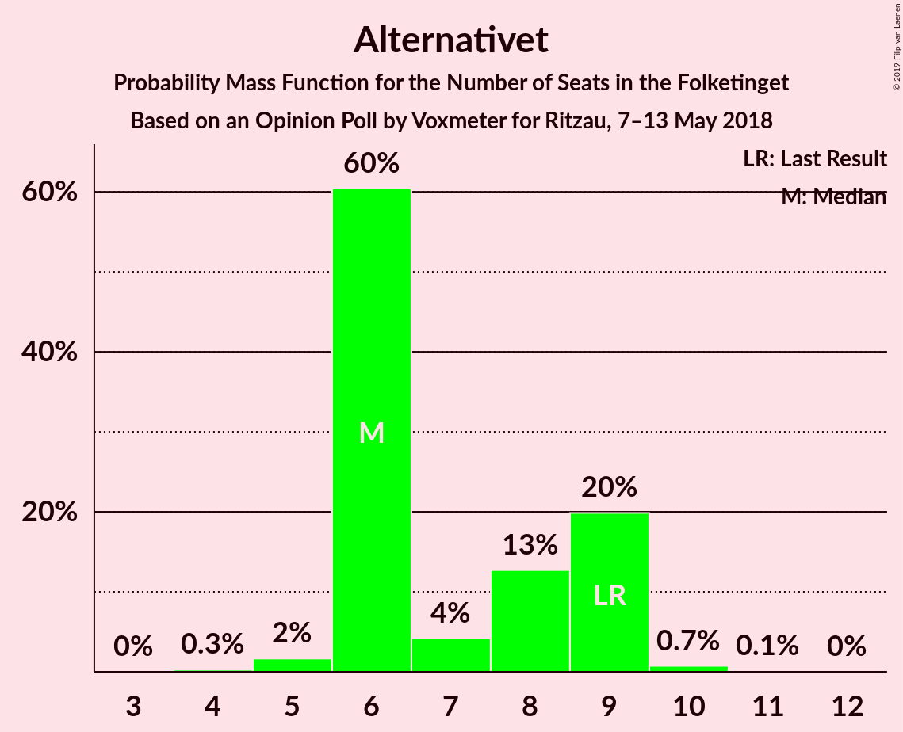
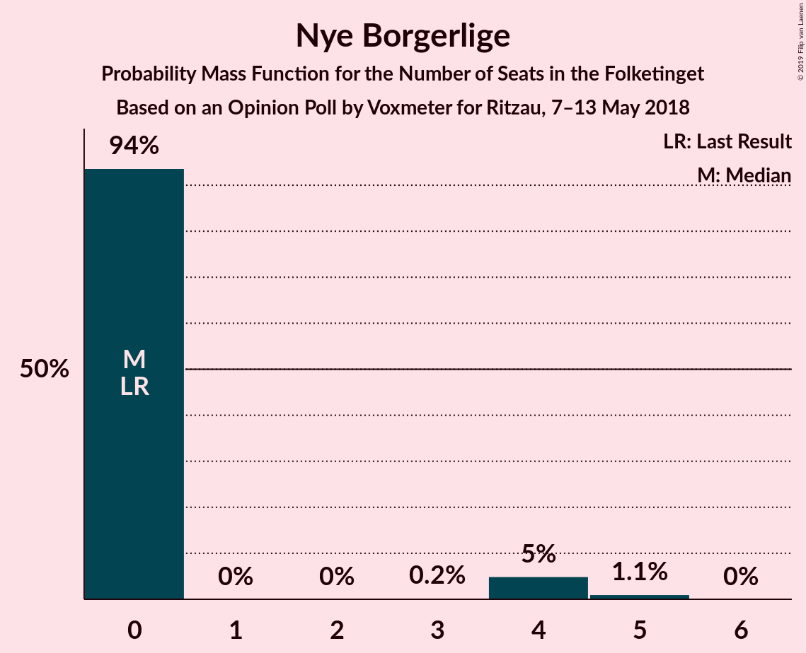
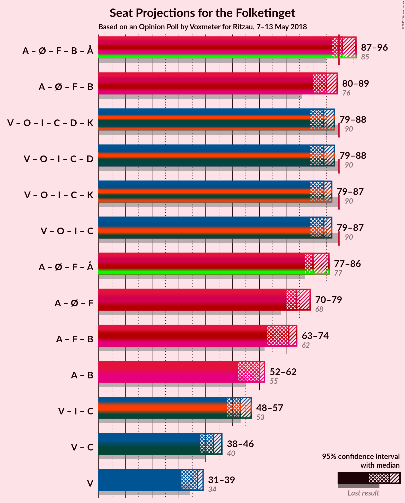

# Opinion Poll by Voxmeter for Ritzau, 7–13 May 2018

<a href="#voting-intentions">Voting Intentions</a> | <a href="#seats">Seats</a> | <a href="#coalitions">Coalitions</a> | <a href="#technical-information">Technical Information</a>

## Voting Intentions

### Confidence Intervals

| Party | Last Result | Poll Result | 80% Confidence Interval | 90% Confidence Interval | 95% Confidence Interval | 99% Confidence Interval |
|:-----:|:-----------:|:-----------:|:-----------------------:|:-----------------------:|:-----------------------:|:-----------------------:|
| Socialdemokraterne | 26.3% | 26.7% | 25.0–28.5% |24.5–29.1% |24.1–29.5% |23.3–30.4% |
| Venstre | 19.5% | 19.8% | 18.3–21.5% |17.9–21.9% |17.5–22.3% |16.8–23.2% |
| Dansk Folkeparti | 21.1% | 17.7% | 16.2–19.3% |15.8–19.7% |15.5–20.1% |14.8–20.9% |
| Enhedslisten–De Rød-Grønne | 7.8% | 9.0% | 8.0–10.3% |7.7–10.6% |7.4–10.9% |7.0–11.6% |
| Socialistisk Folkeparti | 4.2% | 6.1% | 5.2–7.1% |5.0–7.4% |4.8–7.7% |4.4–8.2% |
| Liberal Alliance | 7.5% | 5.5% | 4.7–6.5% |4.4–6.8% |4.3–7.0% |3.9–7.6% |
| Radikale Venstre | 4.6% | 5.4% | 4.6–6.4% |4.4–6.7% |4.2–6.9% |3.8–7.5% |
| Alternativet | 4.8% | 4.0% | 3.4–4.9% |3.2–5.2% |3.0–5.4% |2.7–5.9% |
| Det Konservative Folkeparti | 3.4% | 3.7% | 3.0–4.5% |2.8–4.8% |2.7–5.0% |2.4–5.4% |
| Nye Borgerlige | 0.0% | 1.3% | 1.0–1.9% |0.9–2.1% |0.8–2.3% |0.7–2.6% |
| Kristendemokraterne | 0.8% | 0.7% | 0.4–1.1% |0.4–1.3% |0.3–1.4% |0.2–1.6% |

*Note:* The poll result column reflects the actual value used in the calculations. Published results may vary slightly, and in addition be rounded to fewer digits.

## Seats

### Confidence Intervals

| Party | Last Result | Median | 80% Confidence Interval | 90% Confidence Interval | 95% Confidence Interval | 99% Confidence Interval |
|:-----:|:-----------:|:------:|:-----------------------:|:-----------------------:|:-----------------------:|:-----------------------:|
| <a href="#socialdemokraterne">Socialdemokraterne</a> | 47 | 45 | 44–51 |43–51 |43–53 |42–54 |
| <a href="#venstre">Venstre</a> | 34 | 35 | 31–39 |31–39 |30–39 |29–41 |
| <a href="#dansk-folkeparti">Dansk Folkeparti</a> | 37 | 32 | 29–33 |29–33 |28–35 |26–39 |
| <a href="#enhedslisten–de-rød-grønne">Enhedslisten–De Rød-Grønne</a> | 14 | 16 | 14–19 |14–20 |13–20 |13–21 |
| <a href="#socialistisk-folkeparti">Socialistisk Folkeparti</a> | 7 | 12 | 9–12 |8–13 |8–13 |7–14 |
| <a href="#liberal-alliance">Liberal Alliance</a> | 13 | 9 | 7–11 |7–13 |7–13 |7–14 |
| <a href="#radikale-venstre">Radikale Venstre</a> | 8 | 10 | 8–11 |8–12 |7–12 |7–13 |
| <a href="#alternativet">Alternativet</a> | 9 | 8 | 5–8 |5–8 |4–9 |4–10 |
| <a href="#det-konservative-folkeparti">Det Konservative Folkeparti</a> | 6 | 6 | 5–8 |5–10 |4–10 |4–10 |
| <a href="#nye-borgerlige">Nye Borgerlige</a> | 0 | 0 | 0–5 |0–5 |0–5 |0–5 |
| <a href="#kristendemokraterne">Kristendemokraterne</a> | 0 | 0 | 0 |0 |0 |0 |

### Socialdemokraterne

*For a full overview of the results for this party, see the [Socialdemokraterne](party-socialdemokraterne.html) page.*

| Number of Seats | Probability | Accumulated | Special Marks |
|:---------------:|:-----------:|:-----------:|:-------------:|
| 39 | 0% | 100% |  |
| 40 | 0% | 99.9% |  |
| 41 | 0.1% | 99.9% |  |
| 42 | 2% | 99.9% |  |
| 43 | 8% | 98% |  |
| 44 | 8% | 90% |  |
| 45 | 33% | 83% | Median |
| 46 | 5% | 49% |  |
| 47 | 9% | 44% | Last Result |
| 48 | 19% | 35% |  |
| 49 | 4% | 17% |  |
| 50 | 2% | 12% |  |
| 51 | 7% | 11% |  |
| 52 | 0.4% | 4% |  |
| 53 | 2% | 3% |  |
| 54 | 1.3% | 1.3% |  |
| 55 | 0% | 0% |  |

### Venstre

*For a full overview of the results for this party, see the [Venstre](party-venstre.html) page.*

| Number of Seats | Probability | Accumulated | Special Marks |
|:---------------:|:-----------:|:-----------:|:-------------:|
| 28 | 0.3% | 100% |  |
| 29 | 0.3% | 99.7% |  |
| 30 | 2% | 99.4% |  |
| 31 | 28% | 97% |  |
| 32 | 2% | 69% |  |
| 33 | 3% | 67% |  |
| 34 | 12% | 63% | Last Result |
| 35 | 8% | 52% | Median |
| 36 | 19% | 43% |  |
| 37 | 5% | 25% |  |
| 38 | 5% | 20% |  |
| 39 | 14% | 15% |  |
| 40 | 0.4% | 1.0% |  |
| 41 | 0.3% | 0.6% |  |
| 42 | 0.3% | 0.3% |  |
| 43 | 0% | 0% |  |

### Dansk Folkeparti

*For a full overview of the results for this party, see the [Dansk Folkeparti](party-danskfolkeparti.html) page.*

| Number of Seats | Probability | Accumulated | Special Marks |
|:---------------:|:-----------:|:-----------:|:-------------:|
| 24 | 0.2% | 100% |  |
| 25 | 0% | 99.8% |  |
| 26 | 0.3% | 99.8% |  |
| 27 | 2% | 99.5% |  |
| 28 | 0.8% | 98% |  |
| 29 | 12% | 97% |  |
| 30 | 11% | 85% |  |
| 31 | 7% | 73% |  |
| 32 | 34% | 67% | Median |
| 33 | 29% | 33% |  |
| 34 | 0.3% | 4% |  |
| 35 | 2% | 4% |  |
| 36 | 0% | 2% |  |
| 37 | 0.1% | 2% | Last Result |
| 38 | 0.7% | 2% |  |
| 39 | 1.3% | 1.3% |  |
| 40 | 0% | 0% |  |

### Enhedslisten–De Rød-Grønne

*For a full overview of the results for this party, see the [Enhedslisten–De Rød-Grønne](party-enhedslisten–derød-grønne.html) page.*

| Number of Seats | Probability | Accumulated | Special Marks |
|:---------------:|:-----------:|:-----------:|:-------------:|
| 12 | 0.2% | 100% |  |
| 13 | 3% | 99.8% |  |
| 14 | 16% | 97% | Last Result |
| 15 | 13% | 81% |  |
| 16 | 36% | 68% | Median |
| 17 | 12% | 32% |  |
| 18 | 1.0% | 20% |  |
| 19 | 10% | 19% |  |
| 20 | 8% | 9% |  |
| 21 | 0.2% | 0.6% |  |
| 22 | 0.3% | 0.4% |  |
| 23 | 0% | 0% |  |

### Socialistisk Folkeparti

*For a full overview of the results for this party, see the [Socialistisk Folkeparti](party-socialistiskfolkeparti.html) page.*

| Number of Seats | Probability | Accumulated | Special Marks |
|:---------------:|:-----------:|:-----------:|:-------------:|
| 7 | 2% | 100% | Last Result |
| 8 | 5% | 98% |  |
| 9 | 14% | 93% |  |
| 10 | 14% | 79% |  |
| 11 | 13% | 65% |  |
| 12 | 42% | 52% | Median |
| 13 | 8% | 10% |  |
| 14 | 2% | 2% |  |
| 15 | 0.4% | 0.4% |  |
| 16 | 0% | 0.1% |  |
| 17 | 0% | 0% |  |

### Liberal Alliance

*For a full overview of the results for this party, see the [Liberal Alliance](party-liberalalliance.html) page.*

| Number of Seats | Probability | Accumulated | Special Marks |
|:---------------:|:-----------:|:-----------:|:-------------:|
| 7 | 11% | 100% |  |
| 8 | 7% | 89% |  |
| 9 | 36% | 82% | Median |
| 10 | 9% | 46% |  |
| 11 | 28% | 37% |  |
| 12 | 3% | 9% |  |
| 13 | 5% | 6% | Last Result |
| 14 | 1.1% | 1.2% |  |
| 15 | 0% | 0.1% |  |
| 16 | 0% | 0% |  |

### Radikale Venstre

*For a full overview of the results for this party, see the [Radikale Venstre](party-radikalevenstre.html) page.*

| Number of Seats | Probability | Accumulated | Special Marks |
|:---------------:|:-----------:|:-----------:|:-------------:|
| 6 | 0.1% | 100% |  |
| 7 | 3% | 99.9% |  |
| 8 | 19% | 97% | Last Result |
| 9 | 14% | 79% |  |
| 10 | 43% | 65% | Median |
| 11 | 13% | 22% |  |
| 12 | 8% | 9% |  |
| 13 | 0.3% | 0.8% |  |
| 14 | 0.4% | 0.4% |  |
| 15 | 0% | 0% |  |

### Alternativet

*For a full overview of the results for this party, see the [Alternativet](party-alternativet.html) page.*

| Number of Seats | Probability | Accumulated | Special Marks |
|:---------------:|:-----------:|:-----------:|:-------------:|
| 4 | 3% | 100% |  |
| 5 | 7% | 97% |  |
| 6 | 19% | 90% |  |
| 7 | 12% | 71% |  |
| 8 | 55% | 59% | Median |
| 9 | 3% | 4% | Last Result |
| 10 | 0.4% | 0.6% |  |
| 11 | 0.2% | 0.3% |  |
| 12 | 0% | 0% |  |

### Det Konservative Folkeparti

*For a full overview of the results for this party, see the [Det Konservative Folkeparti](party-detkonservativefolkeparti.html) page.*

| Number of Seats | Probability | Accumulated | Special Marks |
|:---------------:|:-----------:|:-----------:|:-------------:|
| 0 | 0.4% | 100% |  |
| 1 | 0% | 99.6% |  |
| 2 | 0% | 99.6% |  |
| 3 | 0% | 99.6% |  |
| 4 | 3% | 99.6% |  |
| 5 | 7% | 96% |  |
| 6 | 44% | 89% | Last Result, Median |
| 7 | 25% | 45% |  |
| 8 | 11% | 20% |  |
| 9 | 2% | 8% |  |
| 10 | 6% | 6% |  |
| 11 | 0% | 0% |  |

### Nye Borgerlige

*For a full overview of the results for this party, see the [Nye Borgerlige](party-nyeborgerlige.html) page.*

| Number of Seats | Probability | Accumulated | Special Marks |
|:---------------:|:-----------:|:-----------:|:-------------:|
| 0 | 60% | 100% | Last Result, Median |
| 1 | 0% | 40% |  |
| 2 | 0% | 40% |  |
| 3 | 7% | 40% |  |
| 4 | 6% | 33% |  |
| 5 | 27% | 27% |  |
| 6 | 0% | 0% |  |

### Kristendemokraterne

*For a full overview of the results for this party, see the [Kristendemokraterne](party-kristendemokraterne.html) page.*

| Number of Seats | Probability | Accumulated | Special Marks |
|:---------------:|:-----------:|:-----------:|:-------------:|
| 0 | 100% | 100% | Last Result, Median |

## Coalitions

### Confidence Intervals

| Coalition | Last Result | Median | Majority? | 80% Confidence Interval | 90% Confidence Interval | 95% Confidence Interval | 99% Confidence Interval |
|:---------:|:-----------:|:------:|:---------:|:-----------------------:|:-----------------------:|:-----------------------:|:-----------------------:|
| Socialdemokraterne – Enhedslisten–De Rød-Grønne – Socialistisk Folkeparti – Radikale Venstre – Alternativet | 85 | 91 | 64% | 86–94 | 86–97 | 85–97 | 85–102 |
| Venstre – Dansk Folkeparti – Liberal Alliance – Det Konservative Folkeparti – Nye Borgerlige – Kristendemokraterne | 90 | 84 | 3% | 81–89 | 78–89 | 78–90 | 73–90 |
| Venstre – Dansk Folkeparti – Liberal Alliance – Det Konservative Folkeparti – Kristendemokraterne | 90 | 83 | 3% | 79–87 | 78–87 | 78–90 | 73–90 |
| Venstre – Dansk Folkeparti – Liberal Alliance – Det Konservative Folkeparti – Nye Borgerlige | 90 | 84 | 3% | 81–89 | 78–89 | 78–90 | 73–90 |
| Venstre – Dansk Folkeparti – Liberal Alliance – Det Konservative Folkeparti | 90 | 83 | 3% | 79–87 | 78–87 | 78–90 | 73–90 |
| Socialdemokraterne – Enhedslisten–De Rød-Grønne – Socialistisk Folkeparti – Radikale Venstre | 76 | 83 | 5% | 80–88 | 80–90 | 78–90 | 77–93 |
| Socialdemokraterne – Enhedslisten–De Rød-Grønne – Socialistisk Folkeparti – Alternativet | 77 | 81 | 2% | 77–84 | 76–85 | 76–86 | 75–93 |
| Socialdemokraterne – Enhedslisten–De Rød-Grønne – Socialistisk Folkeparti | 68 | 73 | 0% | 71–78 | 69–78 | 69–79 | 68–84 |
| Socialdemokraterne – Socialistisk Folkeparti – Radikale Venstre | 62 | 67 | 0% | 64–71 | 64–73 | 64–73 | 61–75 |
| Socialdemokraterne – Radikale Venstre | 55 | 55 | 0% | 53–61 | 52–61 | 52–62 | 50–63 |
| Venstre – Liberal Alliance – Det Konservative Folkeparti | 53 | 50 | 0% | 46–57 | 46–57 | 46–58 | 46–61 |
| Venstre – Det Konservative Folkeparti | 40 | 42 | 0% | 37–46 | 37–46 | 37–46 | 36–49 |
| Venstre | 34 | 35 | 0% | 31–39 | 31–39 | 30–39 | 29–41 |

### Socialdemokraterne – Enhedslisten–De Rød-Grønne – Socialistisk Folkeparti – Radikale Venstre – Alternativet

| Number of Seats | Probability | Accumulated | Special Marks |
|:---------------:|:-----------:|:-----------:|:-------------:|
| 83 | 0% | 100% |  |
| 84 | 0.3% | 99.9% |  |
| 85 | 3% | 99.7% | Last Result |
| 86 | 8% | 97% |  |
| 87 | 5% | 89% |  |
| 88 | 11% | 84% |  |
| 89 | 9% | 74% |  |
| 90 | 3% | 64% | Majority |
| 91 | 29% | 61% | Median |
| 92 | 9% | 32% |  |
| 93 | 4% | 22% |  |
| 94 | 12% | 19% |  |
| 95 | 1.0% | 7% |  |
| 96 | 0.2% | 6% |  |
| 97 | 3% | 5% |  |
| 98 | 0.1% | 2% |  |
| 99 | 0.5% | 2% |  |
| 100 | 0% | 2% |  |
| 101 | 0.1% | 2% |  |
| 102 | 1.4% | 1.4% |  |
| 103 | 0% | 0% |  |

### Venstre – Dansk Folkeparti – Liberal Alliance – Det Konservative Folkeparti – Nye Borgerlige – Kristendemokraterne

| Number of Seats | Probability | Accumulated | Special Marks |
|:---------------:|:-----------:|:-----------:|:-------------:|
| 73 | 1.4% | 100% |  |
| 74 | 0.1% | 98.6% |  |
| 75 | 0% | 98% |  |
| 76 | 0.5% | 98% |  |
| 77 | 0.1% | 98% |  |
| 78 | 3% | 98% |  |
| 79 | 0.2% | 95% |  |
| 80 | 1.0% | 94% |  |
| 81 | 12% | 93% |  |
| 82 | 4% | 81% | Median |
| 83 | 9% | 78% |  |
| 84 | 29% | 68% |  |
| 85 | 3% | 39% |  |
| 86 | 9% | 36% |  |
| 87 | 11% | 26% |  |
| 88 | 5% | 16% |  |
| 89 | 8% | 11% |  |
| 90 | 3% | 3% | Last Result, Majority |
| 91 | 0.3% | 0.3% |  |
| 92 | 0% | 0.1% |  |
| 93 | 0% | 0% |  |

### Venstre – Dansk Folkeparti – Liberal Alliance – Det Konservative Folkeparti – Kristendemokraterne

| Number of Seats | Probability | Accumulated | Special Marks |
|:---------------:|:-----------:|:-----------:|:-------------:|
| 70 | 0.1% | 100% |  |
| 71 | 0% | 99.9% |  |
| 72 | 0% | 99.9% |  |
| 73 | 1.4% | 99.9% |  |
| 74 | 0% | 98% |  |
| 75 | 0% | 98% |  |
| 76 | 0.5% | 98% |  |
| 77 | 0.3% | 98% |  |
| 78 | 3% | 98% |  |
| 79 | 27% | 94% |  |
| 80 | 1.1% | 67% |  |
| 81 | 12% | 66% |  |
| 82 | 3% | 54% | Median |
| 83 | 10% | 51% |  |
| 84 | 7% | 40% |  |
| 85 | 3% | 33% |  |
| 86 | 16% | 30% |  |
| 87 | 9% | 14% |  |
| 88 | 0.4% | 5% |  |
| 89 | 1.3% | 4% |  |
| 90 | 3% | 3% | Last Result, Majority |
| 91 | 0.3% | 0.3% |  |
| 92 | 0% | 0% |  |

### Venstre – Dansk Folkeparti – Liberal Alliance – Det Konservative Folkeparti – Nye Borgerlige

| Number of Seats | Probability | Accumulated | Special Marks |
|:---------------:|:-----------:|:-----------:|:-------------:|
| 73 | 1.4% | 100% |  |
| 74 | 0.1% | 98.6% |  |
| 75 | 0% | 98% |  |
| 76 | 0.5% | 98% |  |
| 77 | 0.1% | 98% |  |
| 78 | 3% | 98% |  |
| 79 | 0.2% | 95% |  |
| 80 | 1.0% | 94% |  |
| 81 | 12% | 93% |  |
| 82 | 4% | 81% | Median |
| 83 | 9% | 78% |  |
| 84 | 29% | 68% |  |
| 85 | 3% | 39% |  |
| 86 | 9% | 36% |  |
| 87 | 11% | 26% |  |
| 88 | 5% | 16% |  |
| 89 | 8% | 11% |  |
| 90 | 3% | 3% | Last Result, Majority |
| 91 | 0.3% | 0.3% |  |
| 92 | 0% | 0.1% |  |
| 93 | 0% | 0% |  |

### Venstre – Dansk Folkeparti – Liberal Alliance – Det Konservative Folkeparti

| Number of Seats | Probability | Accumulated | Special Marks |
|:---------------:|:-----------:|:-----------:|:-------------:|
| 70 | 0.1% | 100% |  |
| 71 | 0% | 99.9% |  |
| 72 | 0% | 99.9% |  |
| 73 | 1.4% | 99.9% |  |
| 74 | 0% | 98% |  |
| 75 | 0% | 98% |  |
| 76 | 0.5% | 98% |  |
| 77 | 0.3% | 98% |  |
| 78 | 3% | 98% |  |
| 79 | 27% | 94% |  |
| 80 | 1.1% | 67% |  |
| 81 | 12% | 66% |  |
| 82 | 3% | 54% | Median |
| 83 | 10% | 51% |  |
| 84 | 7% | 40% |  |
| 85 | 3% | 33% |  |
| 86 | 16% | 30% |  |
| 87 | 9% | 14% |  |
| 88 | 0.4% | 5% |  |
| 89 | 1.3% | 4% |  |
| 90 | 3% | 3% | Last Result, Majority |
| 91 | 0.3% | 0.3% |  |
| 92 | 0% | 0% |  |

### Socialdemokraterne – Enhedslisten–De Rød-Grønne – Socialistisk Folkeparti – Radikale Venstre

| Number of Seats | Probability | Accumulated | Special Marks |
|:---------------:|:-----------:|:-----------:|:-------------:|
| 76 | 0% | 100% | Last Result |
| 77 | 1.0% | 100% |  |
| 78 | 3% | 99.0% |  |
| 79 | 1.2% | 96% |  |
| 80 | 14% | 95% |  |
| 81 | 10% | 81% |  |
| 82 | 7% | 71% |  |
| 83 | 27% | 63% | Median |
| 84 | 3% | 36% |  |
| 85 | 3% | 33% |  |
| 86 | 17% | 30% |  |
| 87 | 2% | 13% |  |
| 88 | 5% | 11% |  |
| 89 | 1.1% | 6% |  |
| 90 | 3% | 5% | Majority |
| 91 | 0.1% | 2% |  |
| 92 | 0.5% | 2% |  |
| 93 | 2% | 2% |  |
| 94 | 0% | 0% |  |

### Socialdemokraterne – Enhedslisten–De Rød-Grønne – Socialistisk Folkeparti – Alternativet

| Number of Seats | Probability | Accumulated | Special Marks |
|:---------------:|:-----------:|:-----------:|:-------------:|
| 73 | 0.1% | 100% |  |
| 74 | 0.1% | 99.9% |  |
| 75 | 0.8% | 99.8% |  |
| 76 | 4% | 99.1% |  |
| 77 | 7% | 95% | Last Result |
| 78 | 9% | 88% |  |
| 79 | 8% | 79% |  |
| 80 | 3% | 71% |  |
| 81 | 40% | 69% | Median |
| 82 | 6% | 28% |  |
| 83 | 2% | 22% |  |
| 84 | 11% | 20% |  |
| 85 | 6% | 9% |  |
| 86 | 0.8% | 3% |  |
| 87 | 0.1% | 2% |  |
| 88 | 0.5% | 2% |  |
| 89 | 0.1% | 2% |  |
| 90 | 0.1% | 2% | Majority |
| 91 | 0% | 1.4% |  |
| 92 | 0% | 1.4% |  |
| 93 | 1.4% | 1.4% |  |
| 94 | 0% | 0% |  |

### Socialdemokraterne – Enhedslisten–De Rød-Grønne – Socialistisk Folkeparti

| Number of Seats | Probability | Accumulated | Special Marks |
|:---------------:|:-----------:|:-----------:|:-------------:|
| 66 | 0% | 100% |  |
| 67 | 0.2% | 99.9% |  |
| 68 | 0.9% | 99.8% | Last Result |
| 69 | 4% | 98.8% |  |
| 70 | 3% | 95% |  |
| 71 | 13% | 92% |  |
| 72 | 9% | 79% |  |
| 73 | 33% | 71% | Median |
| 74 | 4% | 38% |  |
| 75 | 10% | 35% |  |
| 76 | 10% | 24% |  |
| 77 | 2% | 15% |  |
| 78 | 9% | 13% |  |
| 79 | 2% | 4% |  |
| 80 | 0.2% | 2% |  |
| 81 | 0.6% | 2% |  |
| 82 | 0% | 2% |  |
| 83 | 0.1% | 2% |  |
| 84 | 1.4% | 1.4% |  |
| 85 | 0% | 0% |  |

### Socialdemokraterne – Socialistisk Folkeparti – Radikale Venstre

| Number of Seats | Probability | Accumulated | Special Marks |
|:---------------:|:-----------:|:-----------:|:-------------:|
| 60 | 0.1% | 100% |  |
| 61 | 0.7% | 99.9% |  |
| 62 | 0% | 99.2% | Last Result |
| 63 | 0.4% | 99.2% |  |
| 64 | 9% | 98.8% |  |
| 65 | 4% | 89% |  |
| 66 | 23% | 85% |  |
| 67 | 40% | 62% | Median |
| 68 | 9% | 22% |  |
| 69 | 0.9% | 14% |  |
| 70 | 0.9% | 13% |  |
| 71 | 2% | 12% |  |
| 72 | 0.1% | 10% |  |
| 73 | 8% | 10% |  |
| 74 | 0.5% | 2% |  |
| 75 | 1.3% | 2% |  |
| 76 | 0.3% | 0.4% |  |
| 77 | 0.1% | 0.1% |  |
| 78 | 0% | 0% |  |

### Socialdemokraterne – Radikale Venstre

| Number of Seats | Probability | Accumulated | Special Marks |
|:---------------:|:-----------:|:-----------:|:-------------:|
| 48 | 0% | 100% |  |
| 49 | 0% | 99.9% |  |
| 50 | 0.7% | 99.9% |  |
| 51 | 0.3% | 99.2% |  |
| 52 | 7% | 98.9% |  |
| 53 | 7% | 92% |  |
| 54 | 4% | 85% |  |
| 55 | 35% | 81% | Last Result, Median |
| 56 | 9% | 46% |  |
| 57 | 3% | 37% |  |
| 58 | 20% | 34% |  |
| 59 | 0.1% | 15% |  |
| 60 | 3% | 14% |  |
| 61 | 6% | 11% |  |
| 62 | 3% | 5% |  |
| 63 | 2% | 2% |  |
| 64 | 0.1% | 0.2% |  |
| 65 | 0% | 0.1% |  |
| 66 | 0% | 0% |  |

### Venstre – Liberal Alliance – Det Konservative Folkeparti

| Number of Seats | Probability | Accumulated | Special Marks |
|:---------------:|:-----------:|:-----------:|:-------------:|
| 44 | 0.1% | 100% |  |
| 45 | 0.2% | 99.8% |  |
| 46 | 32% | 99.6% |  |
| 47 | 0.2% | 67% |  |
| 48 | 2% | 67% |  |
| 49 | 13% | 65% |  |
| 50 | 3% | 52% | Median |
| 51 | 1.3% | 49% |  |
| 52 | 3% | 48% |  |
| 53 | 11% | 45% | Last Result |
| 54 | 4% | 34% |  |
| 55 | 19% | 30% |  |
| 56 | 0.1% | 11% |  |
| 57 | 7% | 11% |  |
| 58 | 2% | 3% |  |
| 59 | 0.5% | 1.3% |  |
| 60 | 0% | 0.9% |  |
| 61 | 0.8% | 0.8% |  |
| 62 | 0% | 0% |  |

### Venstre – Det Konservative Folkeparti

| Number of Seats | Probability | Accumulated | Special Marks |
|:---------------:|:-----------:|:-----------:|:-------------:|
| 35 | 0.4% | 100% |  |
| 36 | 0.2% | 99.6% |  |
| 37 | 29% | 99.4% |  |
| 38 | 8% | 70% |  |
| 39 | 2% | 62% |  |
| 40 | 0.5% | 60% | Last Result |
| 41 | 6% | 59% | Median |
| 42 | 13% | 54% |  |
| 43 | 8% | 41% |  |
| 44 | 15% | 33% |  |
| 45 | 3% | 18% |  |
| 46 | 14% | 15% |  |
| 47 | 0.9% | 2% |  |
| 48 | 0.1% | 0.7% |  |
| 49 | 0.4% | 0.6% |  |
| 50 | 0.3% | 0.3% |  |
| 51 | 0% | 0% |  |

### Venstre

| Number of Seats | Probability | Accumulated | Special Marks |
|:---------------:|:-----------:|:-----------:|:-------------:|
| 28 | 0.3% | 100% |  |
| 29 | 0.3% | 99.7% |  |
| 30 | 2% | 99.4% |  |
| 31 | 28% | 97% |  |
| 32 | 2% | 69% |  |
| 33 | 3% | 67% |  |
| 34 | 12% | 63% | Last Result |
| 35 | 8% | 52% | Median |
| 36 | 19% | 43% |  |
| 37 | 5% | 25% |  |
| 38 | 5% | 20% |  |
| 39 | 14% | 15% |  |
| 40 | 0.4% | 1.0% |  |
| 41 | 0.3% | 0.6% |  |
| 42 | 0.3% | 0.3% |  |
| 43 | 0% | 0% |  |

## Technical Information

### Opinion Poll

+ **Polling firm:** Voxmeter
+ **Commissioner(s):** Ritzau
+ **Fieldwork period:** 7–13 May 2018

### Calculations

+ **Sample size:** 1040
+ **Simulations done:** 131,072
+ **Error estimate:** 2.23%

