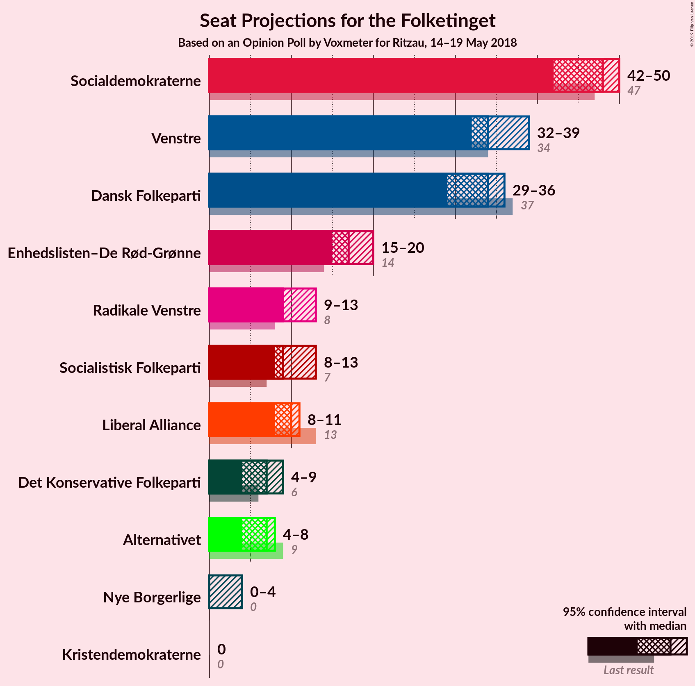
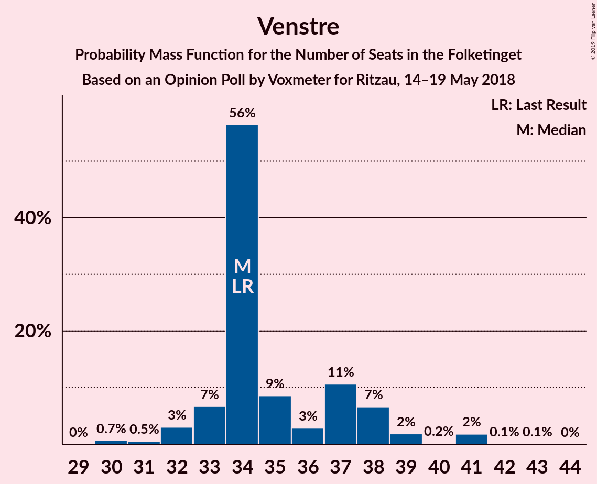
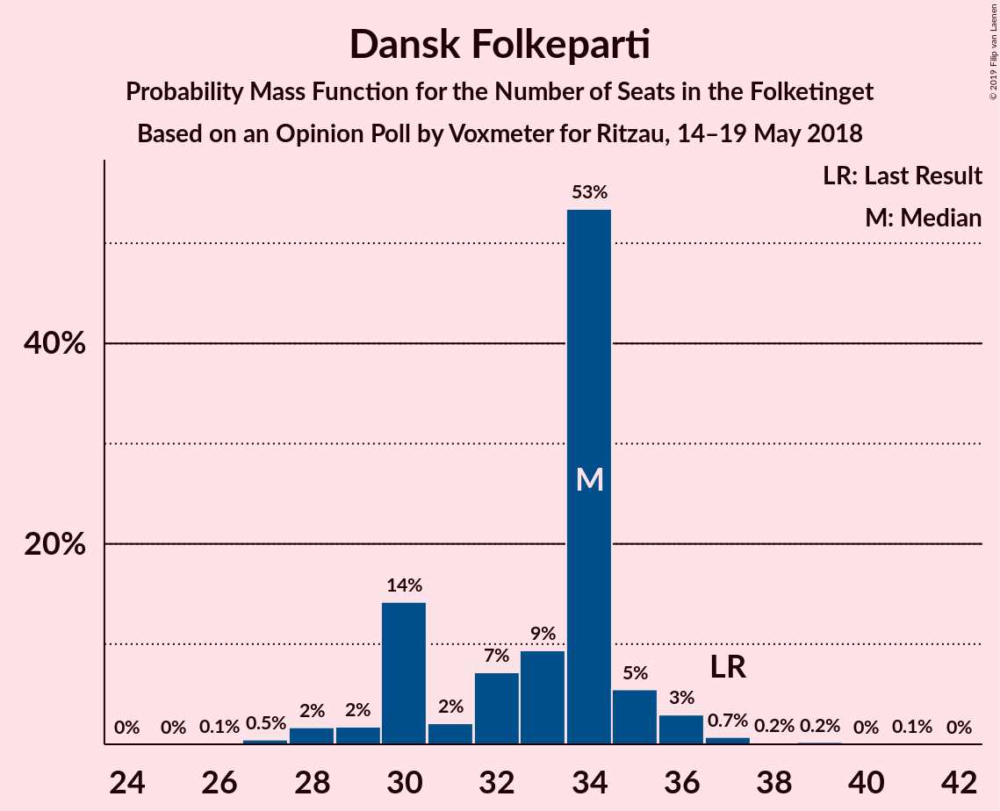
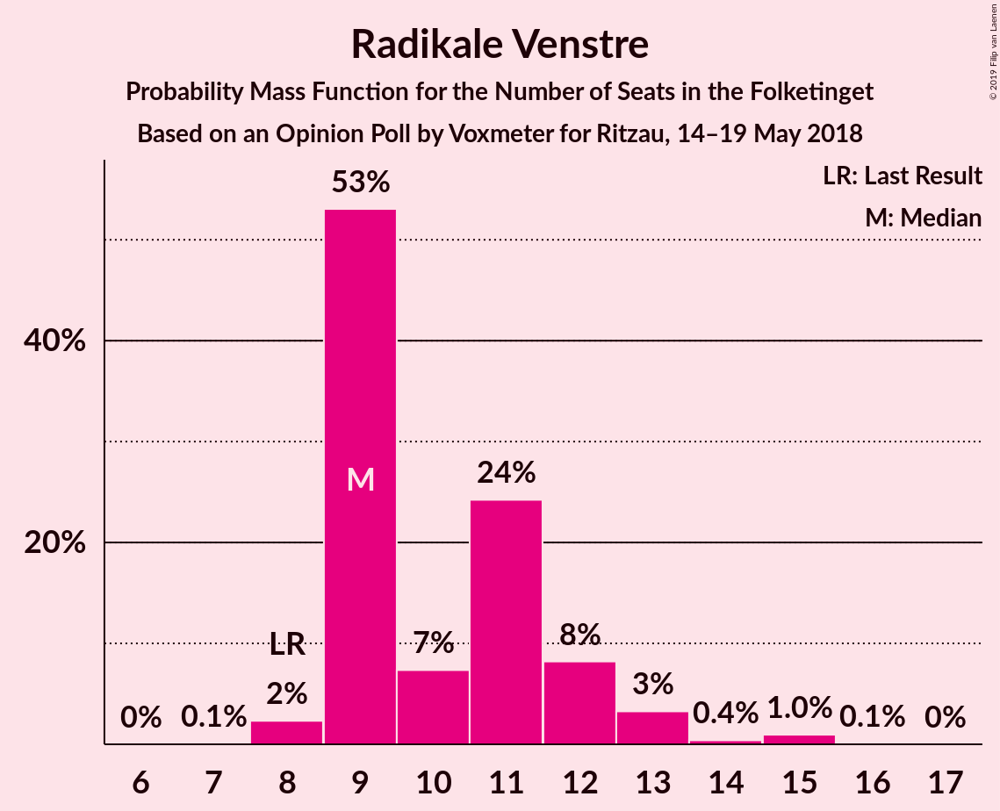

# Opinion Poll by Voxmeter for Ritzau, 14–19 May 2018

<a href="#voting-intentions">Voting Intentions</a> | <a href="#seats">Seats</a> | <a href="#coalitions">Coalitions</a> | <a href="#technical-information">Technical Information</a>

## Voting Intentions

### Confidence Intervals

| Party | Last Result | Poll Result | 80% Confidence Interval | 90% Confidence Interval | 95% Confidence Interval | 99% Confidence Interval |
|:-----:|:-----------:|:-----------:|:-----------------------:|:-----------------------:|:-----------------------:|:-----------------------:|
| Socialdemokraterne | 26.3% | 25.3% | 23.6–27.1% |23.2–27.6% |22.8–28.1% |22.0–28.9% |
| Venstre | 19.5% | 20.0% | 18.4–21.7% |18.0–22.1% |17.6–22.5% |16.9–23.4% |
| Dansk Folkeparti | 21.1% | 18.3% | 16.9–20.0% |16.4–20.4% |16.1–20.8% |15.4–21.6% |
| Enhedslisten–De Rød-Grønne | 7.8% | 9.4% | 8.3–10.7% |8.0–11.0% |7.8–11.4% |7.3–12.0% |
| Radikale Venstre | 4.6% | 6.0% | 5.2–7.1% |4.9–7.4% |4.7–7.6% |4.3–8.2% |
| Socialistisk Folkeparti | 4.2% | 5.8% | 5.0–6.9% |4.7–7.2% |4.5–7.4% |4.2–8.0% |
| Liberal Alliance | 7.5% | 5.2% | 4.4–6.2% |4.2–6.5% |4.0–6.8% |3.7–7.3% |
| Det Konservative Folkeparti | 3.4% | 4.0% | 3.3–4.9% |3.1–5.1% |2.9–5.4% |2.7–5.8% |
| Alternativet | 4.8% | 3.3% | 2.7–4.1% |2.5–4.4% |2.4–4.6% |2.1–5.0% |
| Nye Borgerlige | 0.0% | 1.5% | 1.1–2.1% |1.0–2.2% |0.9–2.4% |0.7–2.7% |
| Kristendemokraterne | 0.8% | 1.1% | 0.7–1.6% |0.7–1.8% |0.6–1.9% |0.5–2.2% |

*Note:* The poll result column reflects the actual value used in the calculations. Published results may vary slightly, and in addition be rounded to fewer digits.

## Seats

### Confidence Intervals

| Party | Last Result | Median | 80% Confidence Interval | 90% Confidence Interval | 95% Confidence Interval | 99% Confidence Interval |
|:-----:|:-----------:|:------:|:-----------------------:|:-----------------------:|:-----------------------:|:-----------------------:|
| <a href="#socialdemokraterne">Socialdemokraterne</a> | 47 | 43 | 43–50 |43–50 |43–50 |40–53 |
| <a href="#venstre">Venstre</a> | 34 | 37 | 35–37 |32–39 |29–39 |28–39 |
| <a href="#dansk-folkeparti">Dansk Folkeparti</a> | 37 | 35 | 26–35 |26–35 |26–35 |26–40 |
| <a href="#enhedslisten–de-rød-grønne">Enhedslisten–De Rød-Grønne</a> | 14 | 20 | 19–20 |19–22 |18–22 |17–22 |
| <a href="#radikale-venstre">Radikale Venstre</a> | 8 | 9 | 9–10 |8–10 |8–12 |8–16 |
| <a href="#socialistisk-folkeparti">Socialistisk Folkeparti</a> | 7 | 8 | 7–11 |6–11 |6–11 |6–14 |
| <a href="#liberal-alliance">Liberal Alliance</a> | 13 | 5 | 5–8 |5–8 |5–8 |5–12 |
| <a href="#det-konservative-folkeparti">Det Konservative Folkeparti</a> | 6 | 8 | 7–8 |7–8 |7–9 |7–9 |
| <a href="#alternativet">Alternativet</a> | 9 | 6 | 5–7 |5–7 |5–8 |3–8 |
| <a href="#nye-borgerlige">Nye Borgerlige</a> | 0 | 0 | 0–5 |0–5 |0–5 |0–5 |
| <a href="#kristendemokraterne">Kristendemokraterne</a> | 0 | 4 | 0–4 |0–4 |0–4 |0–4 |

### Socialdemokraterne

*For a full overview of the results for this party, see the [Socialdemokraterne](party-socialdemokraterne.html) page.*

| Number of Seats | Probability | Accumulated | Special Marks |
|:---------------:|:-----------:|:-----------:|:-------------:|
| 36 | 0.2% | 100% |  |
| 37 | 0% | 99.8% |  |
| 38 | 0% | 99.8% |  |
| 39 | 0% | 99.8% |  |
| 40 | 0.7% | 99.8% |  |
| 41 | 0% | 99.1% |  |
| 42 | 0.4% | 99.1% |  |
| 43 | 72% | 98.7% | Median |
| 44 | 0.8% | 27% |  |
| 45 | 0.1% | 26% |  |
| 46 | 0.1% | 26% |  |
| 47 | 0.2% | 26% | Last Result |
| 48 | 0.1% | 26% |  |
| 49 | 9% | 26% |  |
| 50 | 15% | 17% |  |
| 51 | 0% | 2% |  |
| 52 | 0% | 2% |  |
| 53 | 2% | 2% |  |
| 54 | 0% | 0% |  |

### Venstre

*For a full overview of the results for this party, see the [Venstre](party-venstre.html) page.*

| Number of Seats | Probability | Accumulated | Special Marks |
|:---------------:|:-----------:|:-----------:|:-------------:|
| 28 | 1.5% | 100% |  |
| 29 | 2% | 98.5% |  |
| 30 | 0.5% | 96% |  |
| 31 | 0.7% | 96% |  |
| 32 | 0.3% | 95% |  |
| 33 | 0.7% | 95% |  |
| 34 | 0% | 94% | Last Result |
| 35 | 15% | 94% |  |
| 36 | 0.2% | 79% |  |
| 37 | 70% | 79% | Median |
| 38 | 0% | 9% |  |
| 39 | 9% | 9% |  |
| 40 | 0.2% | 0.2% |  |
| 41 | 0% | 0% |  |

### Dansk Folkeparti

*For a full overview of the results for this party, see the [Dansk Folkeparti](party-danskfolkeparti.html) page.*

| Number of Seats | Probability | Accumulated | Special Marks |
|:---------------:|:-----------:|:-----------:|:-------------:|
| 26 | 15% | 100% |  |
| 27 | 0% | 85% |  |
| 28 | 9% | 85% |  |
| 29 | 0% | 76% |  |
| 30 | 3% | 76% |  |
| 31 | 0.6% | 73% |  |
| 32 | 0.7% | 73% |  |
| 33 | 0% | 72% |  |
| 34 | 0% | 72% |  |
| 35 | 70% | 72% | Median |
| 36 | 0% | 2% |  |
| 37 | 0% | 2% | Last Result |
| 38 | 0% | 2% |  |
| 39 | 0.3% | 2% |  |
| 40 | 1.4% | 2% |  |
| 41 | 0% | 0.1% |  |
| 42 | 0.1% | 0.1% |  |
| 43 | 0% | 0% |  |

### Enhedslisten–De Rød-Grønne

*For a full overview of the results for this party, see the [Enhedslisten–De Rød-Grønne](party-enhedslisten–derød-grønne.html) page.*

| Number of Seats | Probability | Accumulated | Special Marks |
|:---------------:|:-----------:|:-----------:|:-------------:|
| 12 | 0.1% | 100% |  |
| 13 | 0.1% | 99.9% |  |
| 14 | 0.2% | 99.8% | Last Result |
| 15 | 0% | 99.6% |  |
| 16 | 0.1% | 99.6% |  |
| 17 | 0.1% | 99.6% |  |
| 18 | 4% | 99.5% |  |
| 19 | 15% | 95% |  |
| 20 | 71% | 80% | Median |
| 21 | 0% | 9% |  |
| 22 | 9% | 9% |  |
| 23 | 0.2% | 0.2% |  |
| 24 | 0% | 0% |  |

### Radikale Venstre

*For a full overview of the results for this party, see the [Radikale Venstre](party-radikalevenstre.html) page.*

| Number of Seats | Probability | Accumulated | Special Marks |
|:---------------:|:-----------:|:-----------:|:-------------:|
| 8 | 9% | 100% | Last Result |
| 9 | 72% | 91% | Median |
| 10 | 15% | 19% |  |
| 11 | 0.8% | 5% |  |
| 12 | 2% | 4% |  |
| 13 | 0.3% | 1.4% |  |
| 14 | 0.4% | 1.1% |  |
| 15 | 0% | 0.6% |  |
| 16 | 0.6% | 0.6% |  |
| 17 | 0% | 0% |  |

### Socialistisk Folkeparti

*For a full overview of the results for this party, see the [Socialistisk Folkeparti](party-socialistiskfolkeparti.html) page.*

| Number of Seats | Probability | Accumulated | Special Marks |
|:---------------:|:-----------:|:-----------:|:-------------:|
| 6 | 9% | 100% |  |
| 7 | 3% | 91% | Last Result |
| 8 | 71% | 88% | Median |
| 9 | 2% | 18% |  |
| 10 | 0% | 16% |  |
| 11 | 15% | 16% |  |
| 12 | 0.1% | 1.1% |  |
| 13 | 0% | 1.0% |  |
| 14 | 0.9% | 0.9% |  |
| 15 | 0.1% | 0.1% |  |
| 16 | 0% | 0% |  |

### Liberal Alliance

*For a full overview of the results for this party, see the [Liberal Alliance](party-liberalalliance.html) page.*

| Number of Seats | Probability | Accumulated | Special Marks |
|:---------------:|:-----------:|:-----------:|:-------------:|
| 5 | 70% | 100% | Median |
| 6 | 3% | 30% |  |
| 7 | 16% | 27% |  |
| 8 | 9% | 11% |  |
| 9 | 0.6% | 2% |  |
| 10 | 0.1% | 2% |  |
| 11 | 0.8% | 1.5% |  |
| 12 | 0.6% | 0.7% |  |
| 13 | 0% | 0% | Last Result |

### Det Konservative Folkeparti

*For a full overview of the results for this party, see the [Det Konservative Folkeparti](party-detkonservativefolkeparti.html) page.*

| Number of Seats | Probability | Accumulated | Special Marks |
|:---------------:|:-----------:|:-----------:|:-------------:|
| 4 | 0.1% | 100% |  |
| 5 | 0.1% | 99.9% |  |
| 6 | 0.2% | 99.8% | Last Result |
| 7 | 16% | 99.6% |  |
| 8 | 79% | 84% | Median |
| 9 | 4% | 4% |  |
| 10 | 0% | 0.4% |  |
| 11 | 0% | 0.4% |  |
| 12 | 0.4% | 0.4% |  |
| 13 | 0% | 0% |  |

### Alternativet

*For a full overview of the results for this party, see the [Alternativet](party-alternativet.html) page.*

| Number of Seats | Probability | Accumulated | Special Marks |
|:---------------:|:-----------:|:-----------:|:-------------:|
| 3 | 0.6% | 100% |  |
| 4 | 0.1% | 99.3% |  |
| 5 | 15% | 99.2% |  |
| 6 | 73% | 84% | Median |
| 7 | 9% | 12% |  |
| 8 | 3% | 3% |  |
| 9 | 0% | 0% | Last Result |

### Nye Borgerlige

*For a full overview of the results for this party, see the [Nye Borgerlige](party-nyeborgerlige.html) page.*

| Number of Seats | Probability | Accumulated | Special Marks |
|:---------------:|:-----------:|:-----------:|:-------------:|
| 0 | 81% | 100% | Last Result, Median |
| 1 | 0% | 19% |  |
| 2 | 0% | 19% |  |
| 3 | 0.2% | 19% |  |
| 4 | 2% | 19% |  |
| 5 | 17% | 18% |  |
| 6 | 0% | 0.2% |  |
| 7 | 0.2% | 0.2% |  |
| 8 | 0% | 0% |  |

### Kristendemokraterne

*For a full overview of the results for this party, see the [Kristendemokraterne](party-kristendemokraterne.html) page.*

| Number of Seats | Probability | Accumulated | Special Marks |
|:---------------:|:-----------:|:-----------:|:-------------:|
| 0 | 30% | 100% | Last Result |
| 1 | 0% | 70% |  |
| 2 | 0% | 70% |  |
| 3 | 0% | 70% |  |
| 4 | 70% | 70% | Median |
| 5 | 0.1% | 0.1% |  |
| 6 | 0% | 0% |  |

## Coalitions

### Confidence Intervals

| Coalition | Last Result | Median | Majority? | 80% Confidence Interval | 90% Confidence Interval | 95% Confidence Interval | 99% Confidence Interval |
|:---------:|:-----------:|:------:|:---------:|:-----------------------:|:-----------------------:|:-----------------------:|:-----------------------:|
| Socialdemokraterne – Enhedslisten–De Rød-Grønne – Radikale Venstre – Socialistisk Folkeparti – Alternativet | 85 | 86 | 27% | 86–95 | 86–95 | 86–96 | 86–96 |
| Socialdemokraterne – Enhedslisten–De Rød-Grønne – Radikale Venstre – Socialistisk Folkeparti | 76 | 80 | 18% | 80–90 | 80–90 | 80–90 | 78–93 |
| Venstre – Dansk Folkeparti – Liberal Alliance – Det Konservative Folkeparti – Nye Borgerlige – Kristendemokraterne | 90 | 89 | 0.4% | 80–89 | 80–89 | 79–89 | 79–89 |
| Venstre – Dansk Folkeparti – Liberal Alliance – Det Konservative Folkeparti – Kristendemokraterne | 90 | 89 | 0.2% | 75–89 | 75–89 | 75–89 | 74–89 |
| Venstre – Dansk Folkeparti – Liberal Alliance – Det Konservative Folkeparti – Nye Borgerlige | 90 | 85 | 0.4% | 80–85 | 80–85 | 79–85 | 79–89 |
| Venstre – Dansk Folkeparti – Liberal Alliance – Det Konservative Folkeparti | 90 | 85 | 0.2% | 75–85 | 75–85 | 75–85 | 74–89 |

### Socialdemokraterne – Enhedslisten–De Rød-Grønne – Radikale Venstre – Socialistisk Folkeparti – Alternativet

| Number of Seats | Probability | Accumulated | Special Marks |
|:---------------:|:-----------:|:-----------:|:-------------:|
| 79 | 0.3% | 100% |  |
| 80 | 0% | 99.7% |  |
| 81 | 0% | 99.7% |  |
| 82 | 0% | 99.7% |  |
| 83 | 0.1% | 99.7% |  |
| 84 | 0% | 99.6% |  |
| 85 | 0% | 99.6% | Last Result |
| 86 | 71% | 99.6% | Median |
| 87 | 1.4% | 29% |  |
| 88 | 0.1% | 27% |  |
| 89 | 0% | 27% |  |
| 90 | 0% | 27% | Majority |
| 91 | 0.1% | 27% |  |
| 92 | 9% | 27% |  |
| 93 | 0.5% | 18% |  |
| 94 | 0% | 18% |  |
| 95 | 15% | 18% |  |
| 96 | 3% | 3% |  |
| 97 | 0% | 0% |  |

### Socialdemokraterne – Enhedslisten–De Rød-Grønne – Radikale Venstre – Socialistisk Folkeparti

| Number of Seats | Probability | Accumulated | Special Marks |
|:---------------:|:-----------:|:-----------:|:-------------:|
| 73 | 0.2% | 100% |  |
| 74 | 0% | 99.8% |  |
| 75 | 0% | 99.8% |  |
| 76 | 0% | 99.8% | Last Result |
| 77 | 0.1% | 99.8% |  |
| 78 | 0.5% | 99.6% |  |
| 79 | 1.4% | 99.1% |  |
| 80 | 70% | 98% | Median |
| 81 | 0.2% | 28% |  |
| 82 | 0% | 27% |  |
| 83 | 0% | 27% |  |
| 84 | 0% | 27% |  |
| 85 | 9% | 27% |  |
| 86 | 0.1% | 18% |  |
| 87 | 0.3% | 18% |  |
| 88 | 0% | 18% |  |
| 89 | 0.1% | 18% |  |
| 90 | 17% | 18% | Majority |
| 91 | 0% | 0.6% |  |
| 92 | 0% | 0.6% |  |
| 93 | 0.6% | 0.6% |  |
| 94 | 0% | 0% |  |

### Venstre – Dansk Folkeparti – Liberal Alliance – Det Konservative Folkeparti – Nye Borgerlige – Kristendemokraterne

| Number of Seats | Probability | Accumulated | Special Marks |
|:---------------:|:-----------:|:-----------:|:-------------:|
| 79 | 3% | 100% |  |
| 80 | 15% | 97% |  |
| 81 | 0% | 82% |  |
| 82 | 0.5% | 82% |  |
| 83 | 9% | 82% |  |
| 84 | 0.1% | 73% |  |
| 85 | 0% | 73% |  |
| 86 | 0% | 73% |  |
| 87 | 0.1% | 73% |  |
| 88 | 1.4% | 73% |  |
| 89 | 71% | 71% | Median |
| 90 | 0% | 0.4% | Last Result, Majority |
| 91 | 0% | 0.4% |  |
| 92 | 0.1% | 0.4% |  |
| 93 | 0% | 0.3% |  |
| 94 | 0% | 0.3% |  |
| 95 | 0% | 0.3% |  |
| 96 | 0.3% | 0.3% |  |
| 97 | 0% | 0% |  |

### Venstre – Dansk Folkeparti – Liberal Alliance – Det Konservative Folkeparti – Kristendemokraterne

| Number of Seats | Probability | Accumulated | Special Marks |
|:---------------:|:-----------:|:-----------:|:-------------:|
| 74 | 2% | 100% |  |
| 75 | 15% | 98% |  |
| 76 | 0.1% | 83% |  |
| 77 | 0.2% | 83% |  |
| 78 | 0% | 83% |  |
| 79 | 0.6% | 83% |  |
| 80 | 0.1% | 82% |  |
| 81 | 0% | 82% |  |
| 82 | 0.5% | 82% |  |
| 83 | 9% | 82% |  |
| 84 | 2% | 73% |  |
| 85 | 0% | 71% |  |
| 86 | 0% | 71% |  |
| 87 | 0.1% | 71% |  |
| 88 | 0% | 71% |  |
| 89 | 71% | 71% | Median |
| 90 | 0% | 0.2% | Last Result, Majority |
| 91 | 0% | 0.2% |  |
| 92 | 0.1% | 0.1% |  |
| 93 | 0% | 0% |  |

### Venstre – Dansk Folkeparti – Liberal Alliance – Det Konservative Folkeparti – Nye Borgerlige

| Number of Seats | Probability | Accumulated | Special Marks |
|:---------------:|:-----------:|:-----------:|:-------------:|
| 76 | 0.1% | 100% |  |
| 77 | 0% | 99.9% |  |
| 78 | 0% | 99.9% |  |
| 79 | 3% | 99.9% |  |
| 80 | 15% | 97% |  |
| 81 | 0% | 82% |  |
| 82 | 0.5% | 82% |  |
| 83 | 9% | 82% |  |
| 84 | 0.1% | 73% |  |
| 85 | 70% | 73% | Median |
| 86 | 0% | 2% |  |
| 87 | 0% | 2% |  |
| 88 | 1.4% | 2% |  |
| 89 | 0.7% | 1.1% |  |
| 90 | 0% | 0.4% | Last Result, Majority |
| 91 | 0% | 0.4% |  |
| 92 | 0.1% | 0.4% |  |
| 93 | 0% | 0.3% |  |
| 94 | 0% | 0.3% |  |
| 95 | 0% | 0.3% |  |
| 96 | 0.3% | 0.3% |  |
| 97 | 0% | 0% |  |

### Venstre – Dansk Folkeparti – Liberal Alliance – Det Konservative Folkeparti

| Number of Seats | Probability | Accumulated | Special Marks |
|:---------------:|:-----------:|:-----------:|:-------------:|
| 72 | 0.1% | 100% |  |
| 73 | 0% | 99.9% |  |
| 74 | 2% | 99.9% |  |
| 75 | 15% | 98% |  |
| 76 | 0% | 83% |  |
| 77 | 0.2% | 83% |  |
| 78 | 0% | 83% |  |
| 79 | 0.6% | 83% |  |
| 80 | 0.1% | 82% |  |
| 81 | 0% | 82% |  |
| 82 | 0.5% | 82% |  |
| 83 | 9% | 82% |  |
| 84 | 2% | 73% |  |
| 85 | 70% | 71% | Median |
| 86 | 0% | 0.6% |  |
| 87 | 0% | 0.6% |  |
| 88 | 0% | 0.6% |  |
| 89 | 0.4% | 0.6% |  |
| 90 | 0% | 0.2% | Last Result, Majority |
| 91 | 0% | 0.2% |  |
| 92 | 0.1% | 0.1% |  |
| 93 | 0% | 0% |  |

## Technical Information

### Opinion Poll

+ **Polling firm:** Voxmeter
+ **Commissioner(s):** Ritzau
+ **Fieldwork period:** 14–19 May 2018

### Calculations

+ **Sample size:** 1031
+ **Simulations done:** 1,024
+ **Error estimate:** 5.06%

