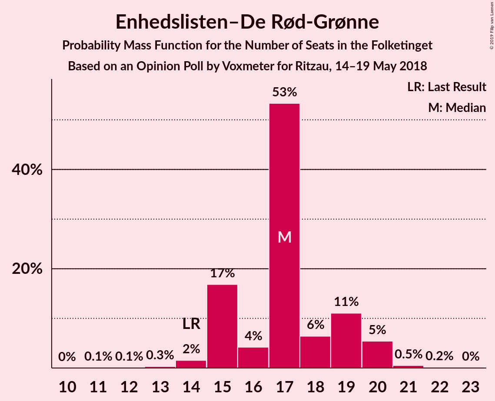
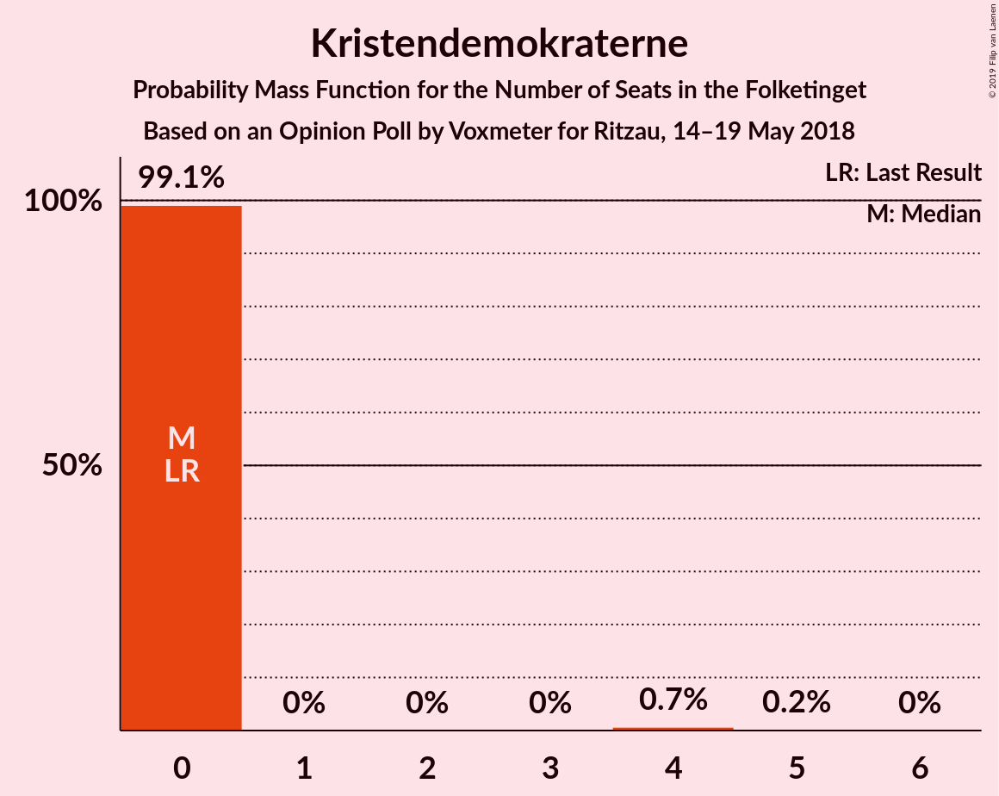

# Opinion Poll by Voxmeter for Ritzau, 14–19 May 2018

<a href="#voting-intentions">Voting Intentions</a> | <a href="#seats">Seats</a> | <a href="#coalitions">Coalitions</a> | <a href="#technical-information">Technical Information</a>

## Voting Intentions

### Confidence Intervals

| Party | Last Result | Poll Result | 80% Confidence Interval | 90% Confidence Interval | 95% Confidence Interval | 99% Confidence Interval |
|:-----:|:-----------:|:-----------:|:-----------------------:|:-----------------------:|:-----------------------:|:-----------------------:|
| Socialdemokraterne | 26.3% | 25.3% | 23.6–27.1% |23.2–27.6% |22.8–28.1% |22.0–28.9% |
| Venstre | 19.5% | 20.0% | 18.4–21.7% |18.0–22.1% |17.6–22.5% |16.9–23.4% |
| Dansk Folkeparti | 21.1% | 18.3% | 16.9–20.0% |16.4–20.4% |16.1–20.8% |15.4–21.6% |
| Enhedslisten–De Rød-Grønne | 7.8% | 9.4% | 8.3–10.7% |8.0–11.0% |7.8–11.4% |7.3–12.0% |
| Radikale Venstre | 4.6% | 6.0% | 5.2–7.1% |4.9–7.4% |4.7–7.6% |4.3–8.2% |
| Socialistisk Folkeparti | 4.2% | 5.8% | 5.0–6.9% |4.7–7.2% |4.5–7.4% |4.2–8.0% |
| Liberal Alliance | 7.5% | 5.2% | 4.4–6.2% |4.2–6.5% |4.0–6.8% |3.7–7.3% |
| Det Konservative Folkeparti | 3.4% | 4.0% | 3.3–4.9% |3.1–5.1% |2.9–5.4% |2.7–5.8% |
| Alternativet | 4.8% | 3.3% | 2.7–4.1% |2.5–4.4% |2.4–4.6% |2.1–5.0% |
| Nye Borgerlige | 0.0% | 1.5% | 1.1–2.1% |1.0–2.2% |0.9–2.4% |0.7–2.7% |
| Kristendemokraterne | 0.8% | 1.1% | 0.7–1.6% |0.7–1.8% |0.6–1.9% |0.5–2.2% |

*Note:* The poll result column reflects the actual value used in the calculations. Published results may vary slightly, and in addition be rounded to fewer digits.

## Seats

### Confidence Intervals

| Party | Last Result | Median | 80% Confidence Interval | 90% Confidence Interval | 95% Confidence Interval | 99% Confidence Interval |
|:-----:|:-----------:|:------:|:-----------------------:|:-----------------------:|:-----------------------:|:-----------------------:|
| <a href="#socialdemokraterne">Socialdemokraterne</a> | 47 | 45 | 40–47 |39–50 |39–50 |39–50 |
| <a href="#venstre">Venstre</a> | 34 | 35 | 32–37 |31–38 |31–39 |30–41 |
| <a href="#dansk-folkeparti">Dansk Folkeparti</a> | 37 | 33 | 31–34 |28–35 |27–37 |27–39 |
| <a href="#enhedslisten–de-rød-grønne">Enhedslisten–De Rød-Grønne</a> | 14 | 17 | 15–19 |15–21 |14–21 |13–21 |
| <a href="#radikale-venstre">Radikale Venstre</a> | 8 | 12 | 10–13 |10–13 |9–14 |6–15 |
| <a href="#socialistisk-folkeparti">Socialistisk Folkeparti</a> | 7 | 11 | 9–11 |9–12 |9–13 |8–14 |
| <a href="#liberal-alliance">Liberal Alliance</a> | 13 | 9 | 8–11 |7–11 |7–11 |7–13 |
| <a href="#det-konservative-folkeparti">Det Konservative Folkeparti</a> | 6 | 8 | 6–9 |5–9 |5–10 |5–11 |
| <a href="#alternativet">Alternativet</a> | 9 | 7 | 5–9 |5–9 |5–9 |4–9 |
| <a href="#nye-borgerlige">Nye Borgerlige</a> | 0 | 0 | 0 |0–5 |0–5 |0–5 |
| <a href="#kristendemokraterne">Kristendemokraterne</a> | 0 | 0 | 0 |0 |0 |0–4 |

### Socialdemokraterne

*For a full overview of the results for this party, see the [Socialdemokraterne](party-socialdemokraterne.html) page.*

| Number of Seats | Probability | Accumulated | Special Marks |
|:---------------:|:-----------:|:-----------:|:-------------:|
| 37 | 0.3% | 100% |  |
| 38 | 0.1% | 99.7% |  |
| 39 | 9% | 99.6% |  |
| 40 | 0.5% | 91% |  |
| 41 | 0.5% | 90% |  |
| 42 | 4% | 89% |  |
| 43 | 2% | 85% |  |
| 44 | 26% | 84% |  |
| 45 | 37% | 57% | Median |
| 46 | 6% | 20% |  |
| 47 | 6% | 14% | Last Result |
| 48 | 2% | 7% |  |
| 49 | 0.3% | 6% |  |
| 50 | 5% | 6% |  |
| 51 | 0.1% | 0.5% |  |
| 52 | 0.1% | 0.3% |  |
| 53 | 0.2% | 0.2% |  |
| 54 | 0% | 0% |  |

### Venstre

*For a full overview of the results for this party, see the [Venstre](party-venstre.html) page.*

| Number of Seats | Probability | Accumulated | Special Marks |
|:---------------:|:-----------:|:-----------:|:-------------:|
| 29 | 0.2% | 100% |  |
| 30 | 2% | 99.7% |  |
| 31 | 5% | 98% |  |
| 32 | 4% | 92% |  |
| 33 | 8% | 88% |  |
| 34 | 2% | 80% | Last Result |
| 35 | 42% | 78% | Median |
| 36 | 10% | 36% |  |
| 37 | 21% | 26% |  |
| 38 | 2% | 6% |  |
| 39 | 3% | 4% |  |
| 40 | 0.4% | 1.3% |  |
| 41 | 0.4% | 0.9% |  |
| 42 | 0.3% | 0.4% |  |
| 43 | 0.1% | 0.1% |  |
| 44 | 0% | 0% |  |

### Dansk Folkeparti

*For a full overview of the results for this party, see the [Dansk Folkeparti](party-danskfolkeparti.html) page.*

| Number of Seats | Probability | Accumulated | Special Marks |
|:---------------:|:-----------:|:-----------:|:-------------:|
| 26 | 0.1% | 100% |  |
| 27 | 3% | 99.9% |  |
| 28 | 5% | 97% |  |
| 29 | 1.3% | 93% |  |
| 30 | 1.3% | 91% |  |
| 31 | 2% | 90% |  |
| 32 | 38% | 88% |  |
| 33 | 27% | 50% | Median |
| 34 | 17% | 23% |  |
| 35 | 2% | 6% |  |
| 36 | 0.2% | 4% |  |
| 37 | 3% | 4% | Last Result |
| 38 | 0% | 0.7% |  |
| 39 | 0.2% | 0.7% |  |
| 40 | 0% | 0.5% |  |
| 41 | 0.5% | 0.5% |  |
| 42 | 0% | 0% |  |

### Enhedslisten–De Rød-Grønne

*For a full overview of the results for this party, see the [Enhedslisten–De Rød-Grønne](party-enhedslisten–derød-grønne.html) page.*

| Number of Seats | Probability | Accumulated | Special Marks |
|:---------------:|:-----------:|:-----------:|:-------------:|
| 13 | 1.2% | 100% |  |
| 14 | 1.5% | 98.8% | Last Result |
| 15 | 41% | 97% |  |
| 16 | 2% | 56% |  |
| 17 | 11% | 54% | Median |
| 18 | 5% | 43% |  |
| 19 | 33% | 38% |  |
| 20 | 0.5% | 6% |  |
| 21 | 5% | 5% |  |
| 22 | 0.3% | 0.4% |  |
| 23 | 0.1% | 0.1% |  |
| 24 | 0% | 0% |  |

### Radikale Venstre

*For a full overview of the results for this party, see the [Radikale Venstre](party-radikalevenstre.html) page.*

| Number of Seats | Probability | Accumulated | Special Marks |
|:---------------:|:-----------:|:-----------:|:-------------:|
| 6 | 0.5% | 100% |  |
| 7 | 0.2% | 99.5% |  |
| 8 | 0.7% | 99.3% | Last Result |
| 9 | 4% | 98.6% |  |
| 10 | 8% | 95% |  |
| 11 | 2% | 87% |  |
| 12 | 58% | 84% | Median |
| 13 | 23% | 26% |  |
| 14 | 0.9% | 3% |  |
| 15 | 2% | 2% |  |
| 16 | 0% | 0% |  |

### Socialistisk Folkeparti

*For a full overview of the results for this party, see the [Socialistisk Folkeparti](party-socialistiskfolkeparti.html) page.*

| Number of Seats | Probability | Accumulated | Special Marks |
|:---------------:|:-----------:|:-----------:|:-------------:|
| 7 | 0.3% | 100% | Last Result |
| 8 | 0.5% | 99.7% |  |
| 9 | 34% | 99.2% |  |
| 10 | 14% | 65% |  |
| 11 | 46% | 51% | Median |
| 12 | 2% | 5% |  |
| 13 | 3% | 3% |  |
| 14 | 0.3% | 0.7% |  |
| 15 | 0.4% | 0.4% |  |
| 16 | 0% | 0% |  |

### Liberal Alliance

*For a full overview of the results for this party, see the [Liberal Alliance](party-liberalalliance.html) page.*

| Number of Seats | Probability | Accumulated | Special Marks |
|:---------------:|:-----------:|:-----------:|:-------------:|
| 5 | 0.1% | 100% |  |
| 6 | 0.1% | 99.9% |  |
| 7 | 6% | 99.8% |  |
| 8 | 43% | 94% |  |
| 9 | 21% | 52% | Median |
| 10 | 21% | 31% |  |
| 11 | 8% | 10% |  |
| 12 | 2% | 2% |  |
| 13 | 0.5% | 0.7% | Last Result |
| 14 | 0.1% | 0.3% |  |
| 15 | 0.2% | 0.2% |  |
| 16 | 0% | 0% |  |

### Det Konservative Folkeparti

*For a full overview of the results for this party, see the [Det Konservative Folkeparti](party-detkonservativefolkeparti.html) page.*

| Number of Seats | Probability | Accumulated | Special Marks |
|:---------------:|:-----------:|:-----------:|:-------------:|
| 4 | 0.3% | 100% |  |
| 5 | 8% | 99.7% |  |
| 6 | 24% | 92% | Last Result |
| 7 | 11% | 68% |  |
| 8 | 43% | 57% | Median |
| 9 | 12% | 14% |  |
| 10 | 0.9% | 3% |  |
| 11 | 2% | 2% |  |
| 12 | 0% | 0% |  |

### Alternativet

*For a full overview of the results for this party, see the [Alternativet](party-alternativet.html) page.*

| Number of Seats | Probability | Accumulated | Special Marks |
|:---------------:|:-----------:|:-----------:|:-------------:|
| 0 | 0.1% | 100% |  |
| 1 | 0% | 99.9% |  |
| 2 | 0% | 99.9% |  |
| 3 | 0% | 99.9% |  |
| 4 | 1.2% | 99.9% |  |
| 5 | 31% | 98.7% |  |
| 6 | 12% | 67% |  |
| 7 | 9% | 55% | Median |
| 8 | 8% | 46% |  |
| 9 | 37% | 37% | Last Result |
| 10 | 0.3% | 0.3% |  |
| 11 | 0% | 0% |  |

### Nye Borgerlige

*For a full overview of the results for this party, see the [Nye Borgerlige](party-nyeborgerlige.html) page.*

| Number of Seats | Probability | Accumulated | Special Marks |
|:---------------:|:-----------:|:-----------:|:-------------:|
| 0 | 93% | 100% | Last Result, Median |
| 1 | 0% | 7% |  |
| 2 | 0% | 7% |  |
| 3 | 0% | 7% |  |
| 4 | 1.1% | 7% |  |
| 5 | 6% | 6% |  |
| 6 | 0.1% | 0.1% |  |
| 7 | 0% | 0% |  |

### Kristendemokraterne

*For a full overview of the results for this party, see the [Kristendemokraterne](party-kristendemokraterne.html) page.*

| Number of Seats | Probability | Accumulated | Special Marks |
|:---------------:|:-----------:|:-----------:|:-------------:|
| 0 | 98% | 100% | Last Result, Median |
| 1 | 0% | 2% |  |
| 2 | 0% | 2% |  |
| 3 | 0% | 2% |  |
| 4 | 1.4% | 2% |  |
| 5 | 0.3% | 0.4% |  |
| 6 | 0% | 0% |  |

## Coalitions

### Confidence Intervals

| Coalition | Last Result | Median | Majority? | 80% Confidence Interval | 90% Confidence Interval | 95% Confidence Interval | 99% Confidence Interval |
|:---------:|:-----------:|:------:|:---------:|:-----------------------:|:-----------------------:|:-----------------------:|:-----------------------:|
| Socialdemokraterne – Enhedslisten–De Rød-Grønne – Radikale Venstre – Socialistisk Folkeparti – Alternativet | 85 | 92 | 80% | 86–95 | 86–95 | 86–95 | 83–96 |
| Socialdemokraterne – Enhedslisten–De Rød-Grønne – Radikale Venstre – Socialistisk Folkeparti | 76 | 83 | 5% | 80–88 | 80–90 | 79–90 | 77–90 |
| Venstre – Dansk Folkeparti – Liberal Alliance – Det Konservative Folkeparti – Nye Borgerlige – Kristendemokraterne | 90 | 83 | 2% | 80–89 | 80–89 | 80–89 | 79–92 |
| Venstre – Dansk Folkeparti – Liberal Alliance – Det Konservative Folkeparti – Nye Borgerlige | 90 | 83 | 2% | 80–89 | 80–89 | 80–89 | 79–92 |
| Venstre – Dansk Folkeparti – Liberal Alliance – Det Konservative Folkeparti – Kristendemokraterne | 90 | 83 | 2% | 80–89 | 79–89 | 79–89 | 78–92 |
| Venstre – Dansk Folkeparti – Liberal Alliance – Det Konservative Folkeparti | 90 | 83 | 1.5% | 80–89 | 79–89 | 79–89 | 78–92 |
| Socialdemokraterne – Enhedslisten–De Rød-Grønne – Socialistisk Folkeparti – Alternativet | 77 | 80 | 0% | 74–83 | 74–83 | 74–83 | 72–85 |
| Socialdemokraterne – Enhedslisten–De Rød-Grønne – Socialistisk Folkeparti | 68 | 71 | 0% | 68–76 | 68–78 | 68–78 | 65–79 |
| Socialdemokraterne – Radikale Venstre – Socialistisk Folkeparti | 62 | 68 | 0% | 62–68 | 61–71 | 61–71 | 60–73 |
| Socialdemokraterne – Radikale Venstre | 55 | 57 | 0% | 51–59 | 51–62 | 51–62 | 50–63 |
| Venstre – Liberal Alliance – Det Konservative Folkeparti | 53 | 51 | 0% | 47–55 | 46–56 | 46–57 | 45–58 |
| Venstre – Det Konservative Folkeparti | 40 | 43 | 0% | 40–45 | 36–46 | 36–47 | 36–49 |
| Venstre | 34 | 35 | 0% | 32–37 | 31–38 | 31–39 | 30–41 |

### Socialdemokraterne – Enhedslisten–De Rød-Grønne – Radikale Venstre – Socialistisk Folkeparti – Alternativet

| Number of Seats | Probability | Accumulated | Special Marks |
|:---------------:|:-----------:|:-----------:|:-------------:|
| 79 | 0.1% | 100% |  |
| 80 | 0% | 99.9% |  |
| 81 | 0.1% | 99.9% |  |
| 82 | 0.2% | 99.8% |  |
| 83 | 0.5% | 99.6% |  |
| 84 | 0.8% | 99.1% |  |
| 85 | 0.5% | 98% | Last Result |
| 86 | 12% | 98% |  |
| 87 | 3% | 86% |  |
| 88 | 2% | 83% |  |
| 89 | 0.5% | 81% |  |
| 90 | 20% | 80% | Majority |
| 91 | 9% | 60% |  |
| 92 | 38% | 51% | Median |
| 93 | 3% | 14% |  |
| 94 | 0.3% | 10% |  |
| 95 | 10% | 10% |  |
| 96 | 0.1% | 0.5% |  |
| 97 | 0.1% | 0.4% |  |
| 98 | 0.2% | 0.3% |  |
| 99 | 0.1% | 0.1% |  |
| 100 | 0% | 0% |  |

### Socialdemokraterne – Enhedslisten–De Rød-Grønne – Radikale Venstre – Socialistisk Folkeparti

| Number of Seats | Probability | Accumulated | Special Marks |
|:---------------:|:-----------:|:-----------:|:-------------:|
| 73 | 0% | 100% |  |
| 74 | 0.1% | 99.9% |  |
| 75 | 0% | 99.9% |  |
| 76 | 0.2% | 99.8% | Last Result |
| 77 | 0.4% | 99.6% |  |
| 78 | 1.4% | 99.2% |  |
| 79 | 1.4% | 98% |  |
| 80 | 11% | 96% |  |
| 81 | 2% | 85% |  |
| 82 | 3% | 82% |  |
| 83 | 43% | 80% |  |
| 84 | 0.5% | 37% |  |
| 85 | 18% | 36% | Median |
| 86 | 5% | 18% |  |
| 87 | 0.7% | 12% |  |
| 88 | 6% | 12% |  |
| 89 | 0.2% | 6% |  |
| 90 | 5% | 5% | Majority |
| 91 | 0% | 0.4% |  |
| 92 | 0.1% | 0.3% |  |
| 93 | 0.2% | 0.2% |  |
| 94 | 0.1% | 0.1% |  |
| 95 | 0% | 0% |  |

### Venstre – Dansk Folkeparti – Liberal Alliance – Det Konservative Folkeparti – Nye Borgerlige – Kristendemokraterne

| Number of Seats | Probability | Accumulated | Special Marks |
|:---------------:|:-----------:|:-----------:|:-------------:|
| 76 | 0.1% | 100% |  |
| 77 | 0.2% | 99.9% |  |
| 78 | 0.1% | 99.7% |  |
| 79 | 0.1% | 99.6% |  |
| 80 | 10% | 99.5% |  |
| 81 | 0.3% | 90% |  |
| 82 | 3% | 90% |  |
| 83 | 38% | 86% |  |
| 84 | 9% | 49% |  |
| 85 | 20% | 40% | Median |
| 86 | 0.5% | 20% |  |
| 87 | 2% | 19% |  |
| 88 | 3% | 17% |  |
| 89 | 12% | 14% |  |
| 90 | 0.5% | 2% | Last Result, Majority |
| 91 | 0.8% | 2% |  |
| 92 | 0.5% | 0.9% |  |
| 93 | 0.2% | 0.4% |  |
| 94 | 0.1% | 0.2% |  |
| 95 | 0% | 0.1% |  |
| 96 | 0.1% | 0.1% |  |
| 97 | 0% | 0% |  |

### Venstre – Dansk Folkeparti – Liberal Alliance – Det Konservative Folkeparti – Nye Borgerlige

| Number of Seats | Probability | Accumulated | Special Marks |
|:---------------:|:-----------:|:-----------:|:-------------:|
| 76 | 0.1% | 100% |  |
| 77 | 0.2% | 99.9% |  |
| 78 | 0.1% | 99.7% |  |
| 79 | 0.1% | 99.6% |  |
| 80 | 10% | 99.5% |  |
| 81 | 0.4% | 90% |  |
| 82 | 3% | 89% |  |
| 83 | 38% | 86% |  |
| 84 | 10% | 48% |  |
| 85 | 20% | 38% | Median |
| 86 | 0.5% | 18% |  |
| 87 | 2% | 18% |  |
| 88 | 2% | 16% |  |
| 89 | 12% | 14% |  |
| 90 | 0.5% | 2% | Last Result, Majority |
| 91 | 0.5% | 1.3% |  |
| 92 | 0.5% | 0.8% |  |
| 93 | 0.2% | 0.3% |  |
| 94 | 0.1% | 0.2% |  |
| 95 | 0% | 0.1% |  |
| 96 | 0.1% | 0.1% |  |
| 97 | 0% | 0% |  |

### Venstre – Dansk Folkeparti – Liberal Alliance – Det Konservative Folkeparti – Kristendemokraterne

| Number of Seats | Probability | Accumulated | Special Marks |
|:---------------:|:-----------:|:-----------:|:-------------:|
| 75 | 0% | 100% |  |
| 76 | 0.1% | 99.9% |  |
| 77 | 0.3% | 99.9% |  |
| 78 | 0.4% | 99.6% |  |
| 79 | 4% | 99.2% |  |
| 80 | 10% | 95% |  |
| 81 | 0.5% | 85% |  |
| 82 | 4% | 85% |  |
| 83 | 38% | 81% |  |
| 84 | 5% | 43% |  |
| 85 | 20% | 38% | Median |
| 86 | 0.8% | 18% |  |
| 87 | 2% | 18% |  |
| 88 | 3% | 16% |  |
| 89 | 12% | 13% |  |
| 90 | 0.4% | 2% | Last Result, Majority |
| 91 | 0.5% | 1.1% |  |
| 92 | 0.5% | 0.6% |  |
| 93 | 0% | 0.1% |  |
| 94 | 0% | 0.1% |  |
| 95 | 0% | 0% |  |

### Venstre – Dansk Folkeparti – Liberal Alliance – Det Konservative Folkeparti

| Number of Seats | Probability | Accumulated | Special Marks |
|:---------------:|:-----------:|:-----------:|:-------------:|
| 75 | 0% | 100% |  |
| 76 | 0.1% | 99.9% |  |
| 77 | 0.4% | 99.9% |  |
| 78 | 0.5% | 99.5% |  |
| 79 | 4% | 99.1% |  |
| 80 | 10% | 95% |  |
| 81 | 0.5% | 85% |  |
| 82 | 4% | 85% |  |
| 83 | 38% | 80% |  |
| 84 | 6% | 43% |  |
| 85 | 20% | 36% | Median |
| 86 | 0.5% | 17% |  |
| 87 | 1.2% | 16% |  |
| 88 | 2% | 15% |  |
| 89 | 12% | 13% |  |
| 90 | 0.4% | 1.5% | Last Result, Majority |
| 91 | 0.5% | 1.1% |  |
| 92 | 0.5% | 0.6% |  |
| 93 | 0% | 0.1% |  |
| 94 | 0% | 0.1% |  |
| 95 | 0% | 0% |  |

### Socialdemokraterne – Enhedslisten–De Rød-Grønne – Socialistisk Folkeparti – Alternativet

| Number of Seats | Probability | Accumulated | Special Marks |
|:---------------:|:-----------:|:-----------:|:-------------:|
| 69 | 0.1% | 100% |  |
| 70 | 0.3% | 99.9% |  |
| 71 | 0.1% | 99.6% |  |
| 72 | 0.9% | 99.5% |  |
| 73 | 0.2% | 98.7% |  |
| 74 | 10% | 98% |  |
| 75 | 1.2% | 88% |  |
| 76 | 2% | 87% |  |
| 77 | 20% | 85% | Last Result |
| 78 | 8% | 65% |  |
| 79 | 0.9% | 57% |  |
| 80 | 39% | 56% | Median |
| 81 | 5% | 17% |  |
| 82 | 2% | 12% |  |
| 83 | 10% | 11% |  |
| 84 | 0.1% | 0.7% |  |
| 85 | 0.2% | 0.5% |  |
| 86 | 0.1% | 0.3% |  |
| 87 | 0.2% | 0.2% |  |
| 88 | 0% | 0.1% |  |
| 89 | 0% | 0% |  |

### Socialdemokraterne – Enhedslisten–De Rød-Grønne – Socialistisk Folkeparti

| Number of Seats | Probability | Accumulated | Special Marks |
|:---------------:|:-----------:|:-----------:|:-------------:|
| 63 | 0.1% | 100% |  |
| 64 | 0.2% | 99.9% |  |
| 65 | 0.4% | 99.7% |  |
| 66 | 0.3% | 99.3% |  |
| 67 | 0.5% | 98.9% |  |
| 68 | 9% | 98% | Last Result |
| 69 | 2% | 89% |  |
| 70 | 5% | 87% |  |
| 71 | 38% | 82% |  |
| 72 | 19% | 44% |  |
| 73 | 11% | 25% | Median |
| 74 | 2% | 14% |  |
| 75 | 0.4% | 12% |  |
| 76 | 5% | 11% |  |
| 77 | 0.6% | 6% |  |
| 78 | 5% | 6% |  |
| 79 | 0.2% | 0.6% |  |
| 80 | 0.2% | 0.4% |  |
| 81 | 0% | 0.2% |  |
| 82 | 0.2% | 0.2% |  |
| 83 | 0% | 0% |  |

### Socialdemokraterne – Radikale Venstre – Socialistisk Folkeparti

| Number of Seats | Probability | Accumulated | Special Marks |
|:---------------:|:-----------:|:-----------:|:-------------:|
| 58 | 0.3% | 100% |  |
| 59 | 0.1% | 99.6% |  |
| 60 | 0.2% | 99.5% |  |
| 61 | 9% | 99.3% |  |
| 62 | 1.2% | 90% | Last Result |
| 63 | 3% | 89% |  |
| 64 | 1.0% | 86% |  |
| 65 | 4% | 85% |  |
| 66 | 25% | 82% |  |
| 67 | 6% | 57% |  |
| 68 | 42% | 51% | Median |
| 69 | 0.1% | 9% |  |
| 70 | 2% | 9% |  |
| 71 | 5% | 7% |  |
| 72 | 0.3% | 2% |  |
| 73 | 1.4% | 2% |  |
| 74 | 0.1% | 0.3% |  |
| 75 | 0.1% | 0.2% |  |
| 76 | 0% | 0.2% |  |
| 77 | 0% | 0.2% |  |
| 78 | 0% | 0.2% |  |
| 79 | 0.2% | 0.2% |  |
| 80 | 0% | 0% |  |

### Socialdemokraterne – Radikale Venstre

| Number of Seats | Probability | Accumulated | Special Marks |
|:---------------:|:-----------:|:-----------:|:-------------:|
| 47 | 0.1% | 100% |  |
| 48 | 0.1% | 99.9% |  |
| 49 | 0.3% | 99.9% |  |
| 50 | 0.1% | 99.6% |  |
| 51 | 10% | 99.5% |  |
| 52 | 2% | 89% |  |
| 53 | 2% | 87% |  |
| 54 | 2% | 85% |  |
| 55 | 3% | 83% | Last Result |
| 56 | 7% | 80% |  |
| 57 | 60% | 73% | Median |
| 58 | 0.2% | 12% |  |
| 59 | 5% | 12% |  |
| 60 | 0.2% | 7% |  |
| 61 | 0.2% | 7% |  |
| 62 | 5% | 7% |  |
| 63 | 1.3% | 2% |  |
| 64 | 0.1% | 0.3% |  |
| 65 | 0% | 0.2% |  |
| 66 | 0.2% | 0.2% |  |
| 67 | 0% | 0% |  |

### Venstre – Liberal Alliance – Det Konservative Folkeparti

| Number of Seats | Probability | Accumulated | Special Marks |
|:---------------:|:-----------:|:-----------:|:-------------:|
| 44 | 0.1% | 100% |  |
| 45 | 1.5% | 99.9% |  |
| 46 | 5% | 98% |  |
| 47 | 5% | 93% |  |
| 48 | 2% | 88% |  |
| 49 | 0.7% | 86% |  |
| 50 | 1.2% | 85% |  |
| 51 | 46% | 84% |  |
| 52 | 20% | 38% | Median |
| 53 | 0.6% | 18% | Last Result |
| 54 | 2% | 18% |  |
| 55 | 11% | 16% |  |
| 56 | 0.6% | 5% |  |
| 57 | 3% | 5% |  |
| 58 | 2% | 2% |  |
| 59 | 0.2% | 0.3% |  |
| 60 | 0% | 0.1% |  |
| 61 | 0.1% | 0.1% |  |
| 62 | 0% | 0% |  |

### Venstre – Det Konservative Folkeparti

| Number of Seats | Probability | Accumulated | Special Marks |
|:---------------:|:-----------:|:-----------:|:-------------:|
| 35 | 0% | 100% |  |
| 36 | 5% | 99.9% |  |
| 37 | 2% | 95% |  |
| 38 | 1.2% | 93% |  |
| 39 | 0.8% | 92% |  |
| 40 | 10% | 91% | Last Result |
| 41 | 6% | 81% |  |
| 42 | 0.4% | 75% |  |
| 43 | 56% | 75% | Median |
| 44 | 2% | 18% |  |
| 45 | 10% | 16% |  |
| 46 | 3% | 6% |  |
| 47 | 0.9% | 3% |  |
| 48 | 0.5% | 2% |  |
| 49 | 1.3% | 1.3% |  |
| 50 | 0% | 0% |  |

### Venstre

| Number of Seats | Probability | Accumulated | Special Marks |
|:---------------:|:-----------:|:-----------:|:-------------:|
| 29 | 0.2% | 100% |  |
| 30 | 2% | 99.7% |  |
| 31 | 5% | 98% |  |
| 32 | 4% | 92% |  |
| 33 | 8% | 88% |  |
| 34 | 2% | 80% | Last Result |
| 35 | 42% | 78% | Median |
| 36 | 10% | 36% |  |
| 37 | 21% | 26% |  |
| 38 | 2% | 6% |  |
| 39 | 3% | 4% |  |
| 40 | 0.4% | 1.3% |  |
| 41 | 0.4% | 0.9% |  |
| 42 | 0.3% | 0.4% |  |
| 43 | 0.1% | 0.1% |  |
| 44 | 0% | 0% |  |

## Technical Information

### Opinion Poll

+ **Polling firm:** Voxmeter
+ **Commissioner(s):** Ritzau
+ **Fieldwork period:** 14–19 May 2018

### Calculations

+ **Sample size:** 1031
+ **Simulations done:** 131,072
+ **Error estimate:** 2.48%

