# Opinion Poll by Norstat for Altinget, 17–23 May 2018

<a href="#voting-intentions">Voting Intentions</a> | <a href="#seats">Seats</a> | <a href="#coalitions">Coalitions</a> | <a href="#technical-information">Technical Information</a>

## Voting Intentions

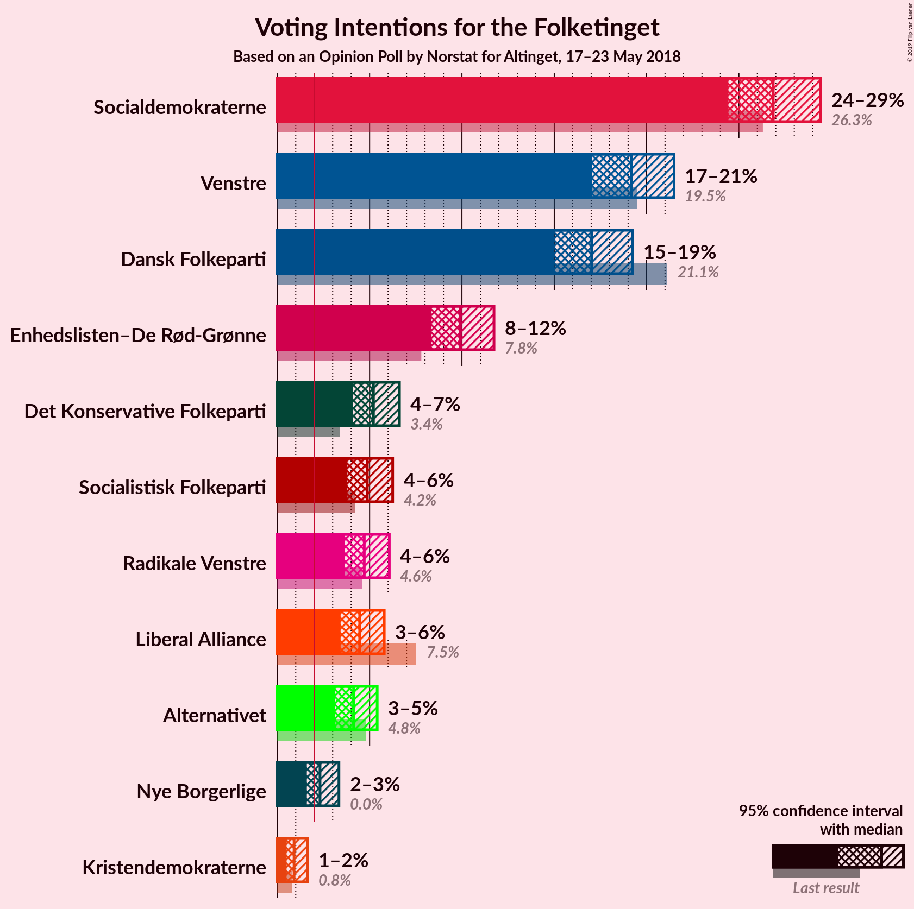

### Confidence Intervals

| Party | Last Result | Poll Result | 80% Confidence Interval | 90% Confidence Interval | 95% Confidence Interval | 99% Confidence Interval |
|:-----:|:-----------:|:-----------:|:-----------------------:|:-----------------------:|:-----------------------:|:-----------------------:|
| Socialdemokraterne | 26.3% | 26.9% | 25.3–28.5% |24.8–29.0% |24.4–29.4% |23.7–30.3% |
| Venstre | 19.5% | 19.2% | 17.8–20.7% |17.4–21.1% |17.1–21.5% |16.4–22.2% |
| Dansk Folkeparti | 21.1% | 17.0% | 15.7–18.5% |15.3–18.9% |15.0–19.3% |14.4–20.0% |
| Enhedslisten–De Rød-Grønne | 7.8% | 9.9% | 8.9–11.1% |8.6–11.4% |8.4–11.7% |7.9–12.3% |
| Det Konservative Folkeparti | 3.4% | 5.2% | 4.5–6.1% |4.3–6.4% |4.1–6.6% |3.8–7.1% |
| Socialistisk Folkeparti | 4.2% | 4.9% | 4.2–5.8% |4.0–6.0% |3.8–6.2% |3.5–6.7% |
| Radikale Venstre | 4.6% | 4.7% | 4.0–5.6% |3.8–5.8% |3.6–6.1% |3.3–6.5% |
| Liberal Alliance | 7.5% | 4.5% | 3.8–5.3% |3.6–5.6% |3.4–5.8% |3.1–6.2% |
| Alternativet | 4.8% | 4.1% | 3.5–5.0% |3.3–5.2% |3.1–5.4% |2.9–5.8% |
| Nye Borgerlige | 0.0% | 2.3% | 1.8–3.0% |1.7–3.2% |1.6–3.3% |1.4–3.7% |
| Kristendemokraterne | 0.8% | 0.9% | 0.6–1.4% |0.6–1.5% |0.5–1.6% |0.4–1.9% |

*Note:* The poll result column reflects the actual value used in the calculations. Published results may vary slightly, and in addition be rounded to fewer digits.

## Seats

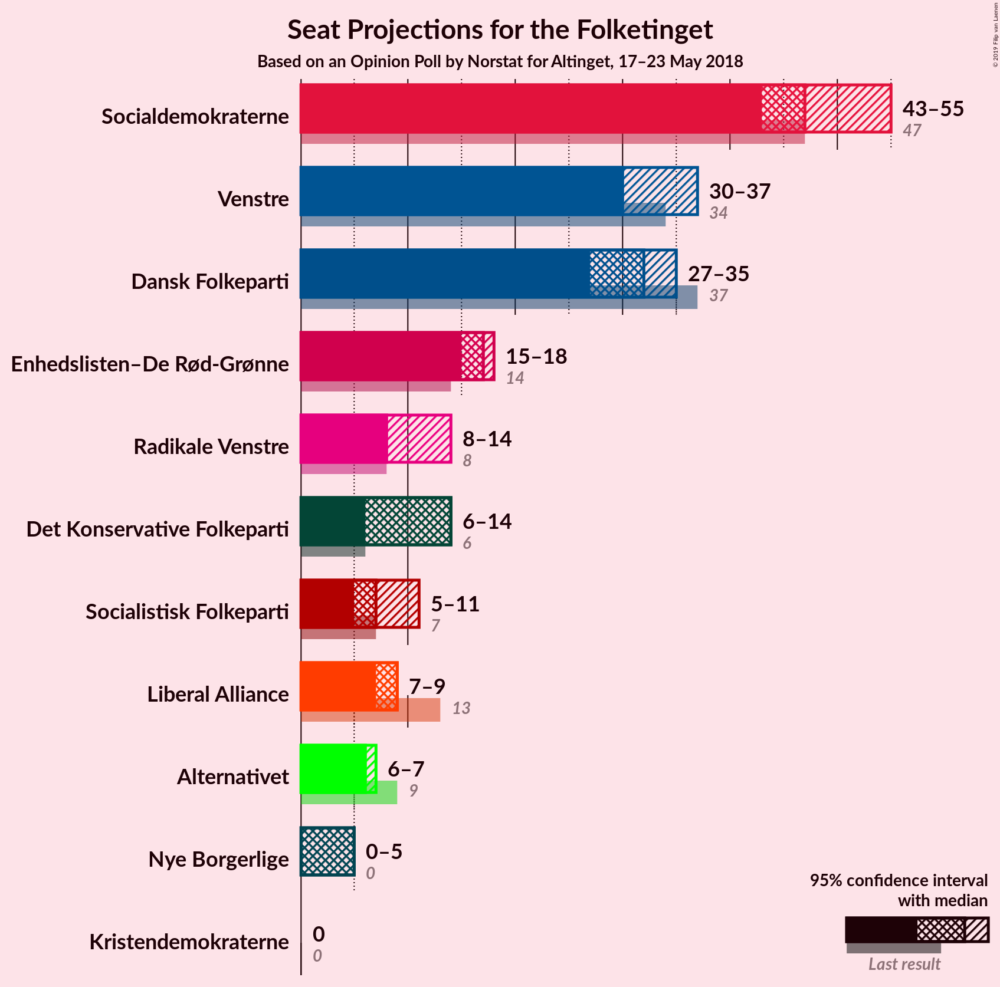

### Confidence Intervals

| Party | Last Result | Median | 80% Confidence Interval | 90% Confidence Interval | 95% Confidence Interval | 99% Confidence Interval |
|:-----:|:-----------:|:------:|:-----------------------:|:-----------------------:|:-----------------------:|:-----------------------:|
| <a href="#socialdemokraterne">Socialdemokraterne</a> | 47 | 45 | 45–51 |45–51 |44–55 |42–56 |
| <a href="#venstre">Venstre</a> | 34 | 31 | 31–35 |31–35 |30–36 |29–37 |
| <a href="#dansk-folkeparti">Dansk Folkeparti</a> | 37 | 33 | 30–33 |30–33 |28–33 |27–35 |
| <a href="#enhedslisten–de-rød-grønne">Enhedslisten–De Rød-Grønne</a> | 14 | 17 | 16–17 |16–18 |16–19 |14–21 |
| <a href="#det-konservative-folkeparti">Det Konservative Folkeparti</a> | 6 | 9 | 9 |9–10 |8–11 |7–12 |
| <a href="#socialistisk-folkeparti">Socialistisk Folkeparti</a> | 7 | 9 | 9 |8–9 |8–10 |7–11 |
| <a href="#radikale-venstre">Radikale Venstre</a> | 8 | 9 | 8–9 |8–9 |7–10 |6–10 |
| <a href="#liberal-alliance">Liberal Alliance</a> | 13 | 9 | 8–9 |7–9 |6–10 |5–11 |
| <a href="#alternativet">Alternativet</a> | 9 | 8 | 8 |6–8 |6–9 |5–10 |
| <a href="#nye-borgerlige">Nye Borgerlige</a> | 0 | 5 | 0–5 |0–5 |0–6 |0–6 |
| <a href="#kristendemokraterne">Kristendemokraterne</a> | 0 | 0 | 0 |0 |0 |0–4 |

### Socialdemokraterne

*For a full overview of the results for this party, see the [Socialdemokraterne](party-socialdemokraterne.html) page.*

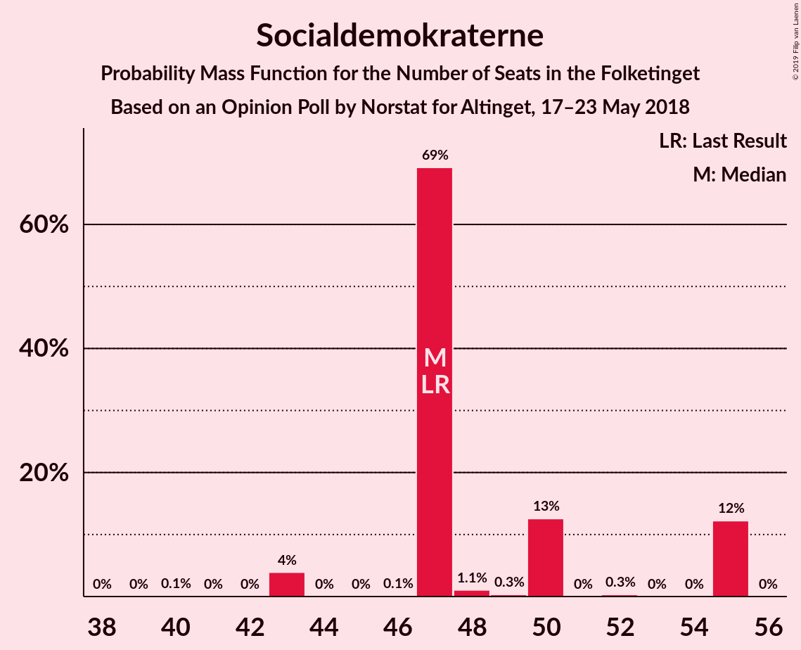

| Number of Seats | Probability | Accumulated | Special Marks |
|:---------------:|:-----------:|:-----------:|:-------------:|
| 41 | 0.1% | 100% |  |
| 42 | 0.7% | 99.8% |  |
| 43 | 2% | 99.2% |  |
| 44 | 2% | 98% |  |
| 45 | 78% | 95% | Median |
| 46 | 1.0% | 17% |  |
| 47 | 2% | 16% | Last Result |
| 48 | 2% | 13% |  |
| 49 | 0.6% | 12% |  |
| 50 | 0.6% | 11% |  |
| 51 | 8% | 11% |  |
| 52 | 0.2% | 3% |  |
| 53 | 0.2% | 3% |  |
| 54 | 0% | 3% |  |
| 55 | 2% | 3% |  |
| 56 | 1.0% | 1.0% |  |
| 57 | 0% | 0% |  |

### Venstre

*For a full overview of the results for this party, see the [Venstre](party-venstre.html) page.*

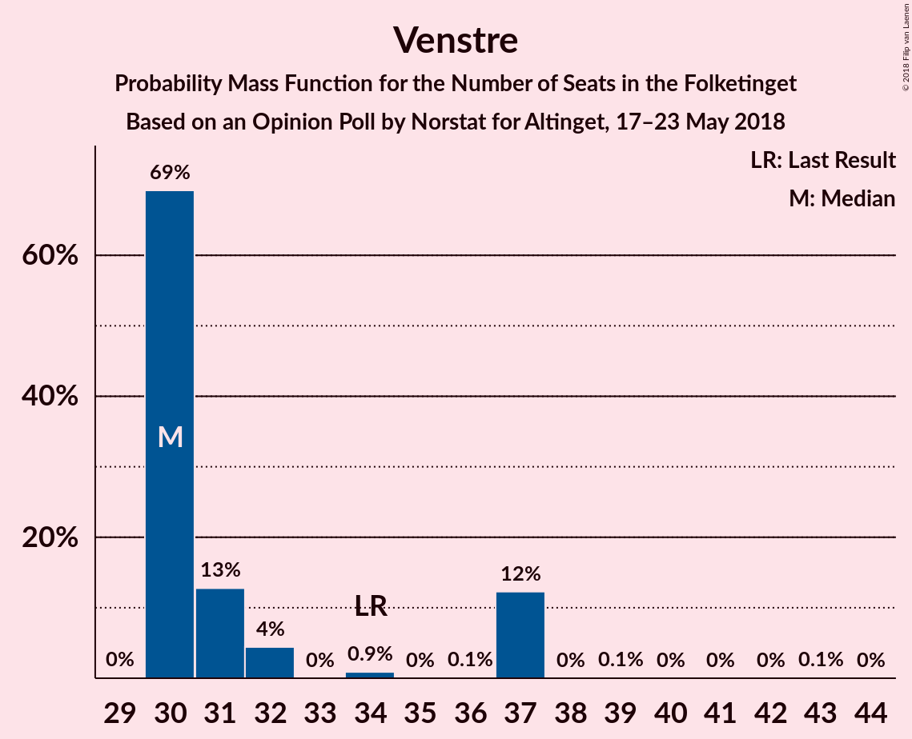

| Number of Seats | Probability | Accumulated | Special Marks |
|:---------------:|:-----------:|:-----------:|:-------------:|
| 28 | 0.1% | 100% |  |
| 29 | 2% | 99.9% |  |
| 30 | 2% | 98% |  |
| 31 | 78% | 97% | Median |
| 32 | 1.0% | 19% |  |
| 33 | 2% | 18% |  |
| 34 | 4% | 16% | Last Result |
| 35 | 9% | 13% |  |
| 36 | 1.4% | 4% |  |
| 37 | 2% | 2% |  |
| 38 | 0.2% | 0.5% |  |
| 39 | 0.1% | 0.3% |  |
| 40 | 0% | 0.2% |  |
| 41 | 0% | 0.2% |  |
| 42 | 0.1% | 0.1% |  |
| 43 | 0% | 0% |  |

### Dansk Folkeparti

*For a full overview of the results for this party, see the [Dansk Folkeparti](party-danskfolkeparti.html) page.*

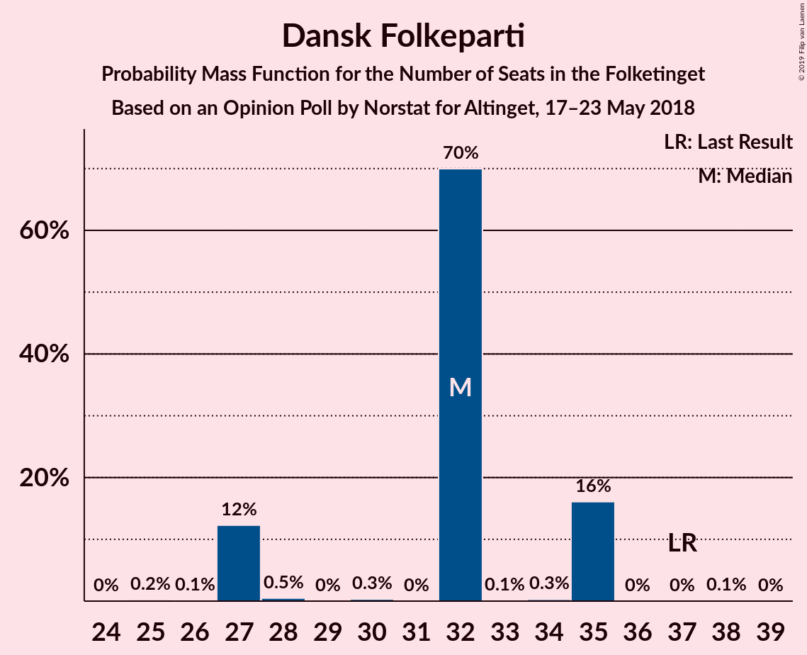

| Number of Seats | Probability | Accumulated | Special Marks |
|:---------------:|:-----------:|:-----------:|:-------------:|
| 25 | 0.1% | 100% |  |
| 26 | 0.3% | 99.9% |  |
| 27 | 0.6% | 99.6% |  |
| 28 | 2% | 99.0% |  |
| 29 | 0.2% | 97% |  |
| 30 | 9% | 97% |  |
| 31 | 5% | 88% |  |
| 32 | 3% | 83% |  |
| 33 | 78% | 80% | Median |
| 34 | 0.8% | 1.3% |  |
| 35 | 0.2% | 0.5% |  |
| 36 | 0.3% | 0.3% |  |
| 37 | 0% | 0% | Last Result |

### Enhedslisten–De Rød-Grønne

*For a full overview of the results for this party, see the [Enhedslisten–De Rød-Grønne](party-enhedslisten–derød-grønne.html) page.*

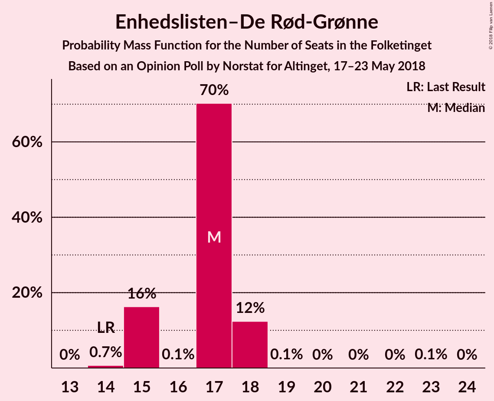

| Number of Seats | Probability | Accumulated | Special Marks |
|:---------------:|:-----------:|:-----------:|:-------------:|
| 13 | 0.1% | 100% |  |
| 14 | 0.5% | 99.9% | Last Result |
| 15 | 0.7% | 99.5% |  |
| 16 | 10% | 98.8% |  |
| 17 | 81% | 89% | Median |
| 18 | 5% | 8% |  |
| 19 | 0.8% | 3% |  |
| 20 | 0.6% | 2% |  |
| 21 | 1.3% | 2% |  |
| 22 | 0.2% | 0.3% |  |
| 23 | 0.1% | 0.1% |  |
| 24 | 0% | 0% |  |

### Det Konservative Folkeparti

*For a full overview of the results for this party, see the [Det Konservative Folkeparti](party-detkonservativefolkeparti.html) page.*

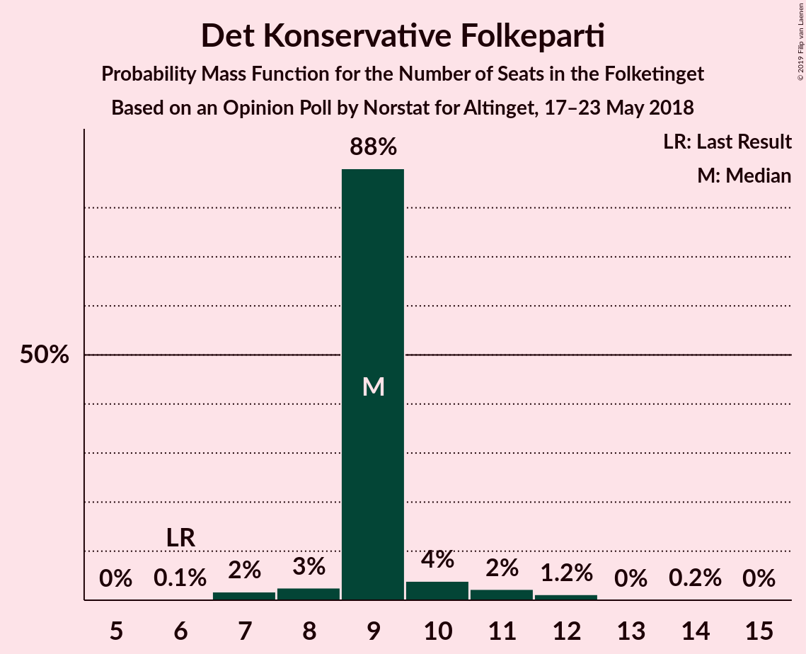

| Number of Seats | Probability | Accumulated | Special Marks |
|:---------------:|:-----------:|:-----------:|:-------------:|
| 6 | 0.1% | 100% | Last Result |
| 7 | 2% | 99.9% |  |
| 8 | 3% | 98% |  |
| 9 | 88% | 96% | Median |
| 10 | 4% | 8% |  |
| 11 | 2% | 4% |  |
| 12 | 1.2% | 1.4% |  |
| 13 | 0% | 0.3% |  |
| 14 | 0.2% | 0.2% |  |
| 15 | 0% | 0% |  |

### Socialistisk Folkeparti

*For a full overview of the results for this party, see the [Socialistisk Folkeparti](party-socialistiskfolkeparti.html) page.*

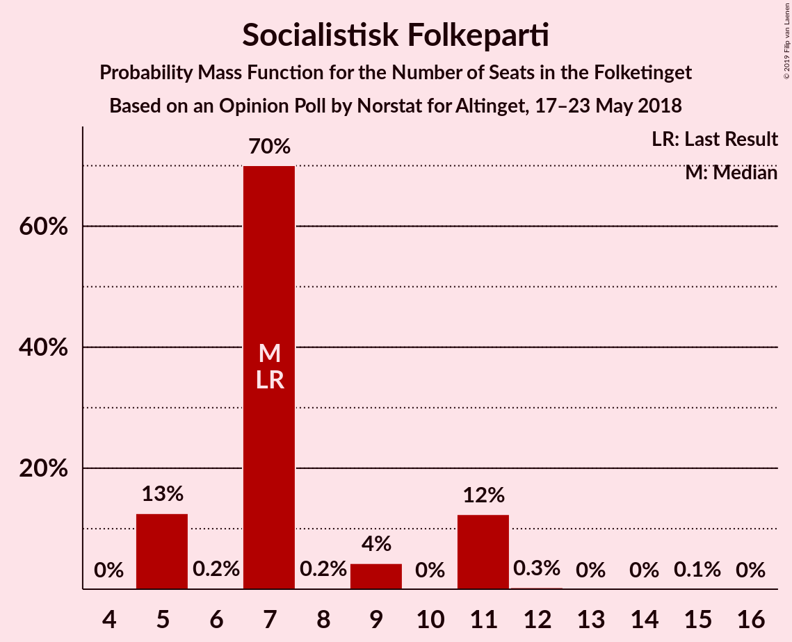

| Number of Seats | Probability | Accumulated | Special Marks |
|:---------------:|:-----------:|:-----------:|:-------------:|
| 6 | 0% | 100% |  |
| 7 | 2% | 99.9% | Last Result |
| 8 | 5% | 98% |  |
| 9 | 89% | 93% | Median |
| 10 | 3% | 4% |  |
| 11 | 1.2% | 1.5% |  |
| 12 | 0.3% | 0.3% |  |
| 13 | 0% | 0% |  |

### Radikale Venstre

*For a full overview of the results for this party, see the [Radikale Venstre](party-radikalevenstre.html) page.*

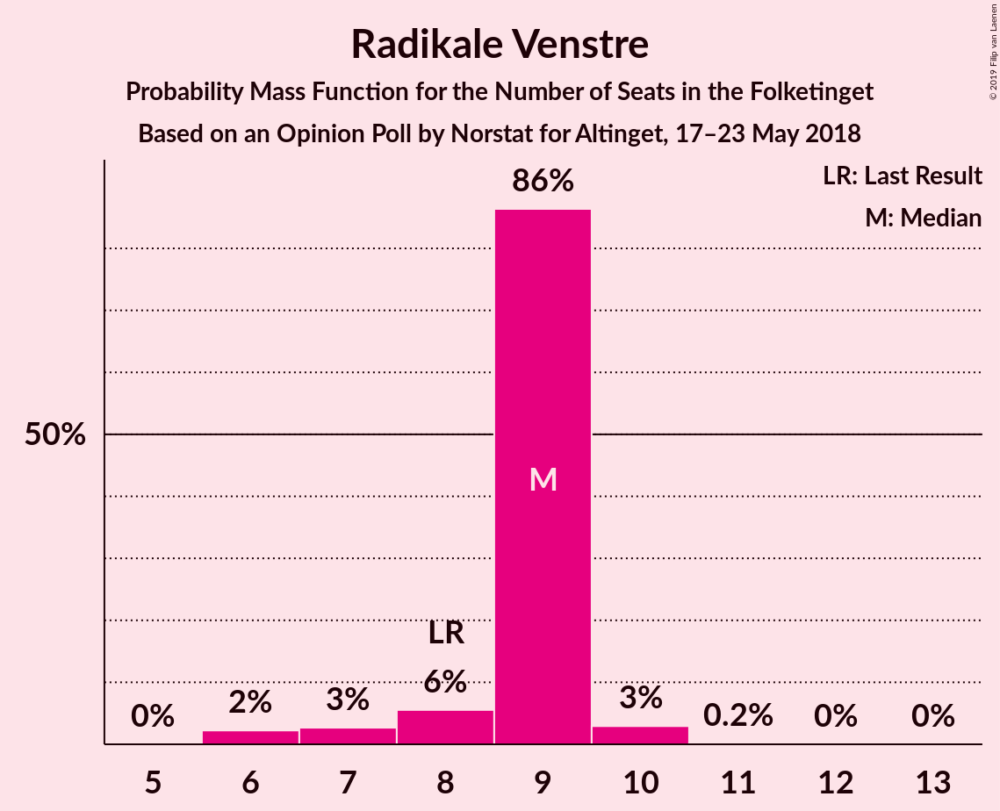

| Number of Seats | Probability | Accumulated | Special Marks |
|:---------------:|:-----------:|:-----------:|:-------------:|
| 6 | 2% | 100% |  |
| 7 | 3% | 98% |  |
| 8 | 6% | 95% | Last Result |
| 9 | 86% | 90% | Median |
| 10 | 3% | 3% |  |
| 11 | 0.2% | 0.2% |  |
| 12 | 0% | 0.1% |  |
| 13 | 0% | 0% |  |

### Liberal Alliance

*For a full overview of the results for this party, see the [Liberal Alliance](party-liberalalliance.html) page.*

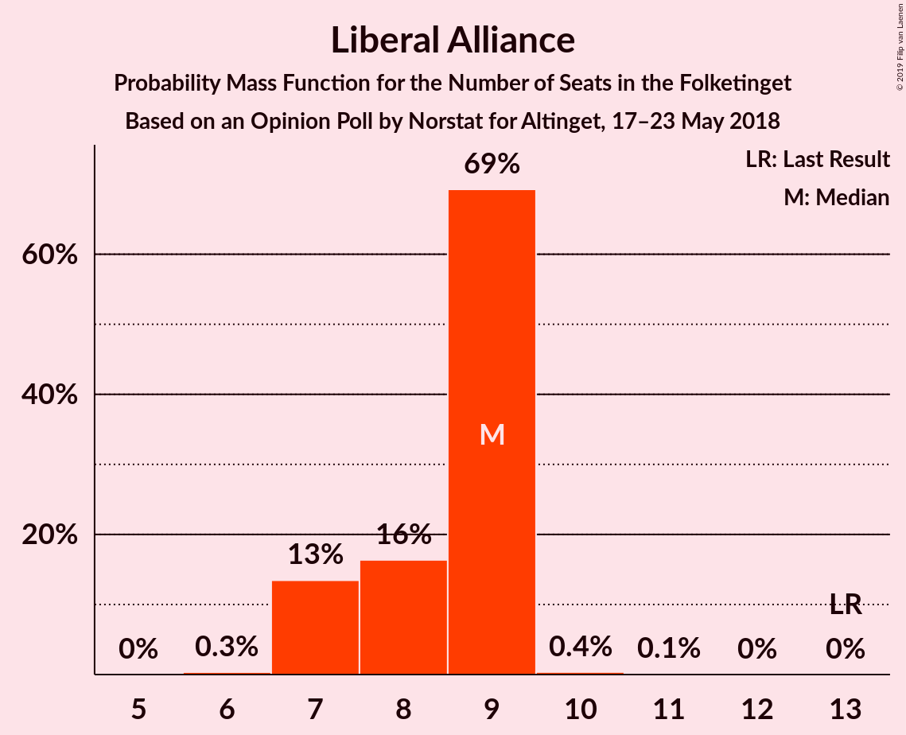

| Number of Seats | Probability | Accumulated | Special Marks |
|:---------------:|:-----------:|:-----------:|:-------------:|
| 5 | 0.7% | 100% |  |
| 6 | 3% | 99.3% |  |
| 7 | 4% | 97% |  |
| 8 | 10% | 93% |  |
| 9 | 80% | 83% | Median |
| 10 | 1.4% | 3% |  |
| 11 | 1.2% | 1.2% |  |
| 12 | 0% | 0% |  |
| 13 | 0% | 0% | Last Result |

### Alternativet

*For a full overview of the results for this party, see the [Alternativet](party-alternativet.html) page.*

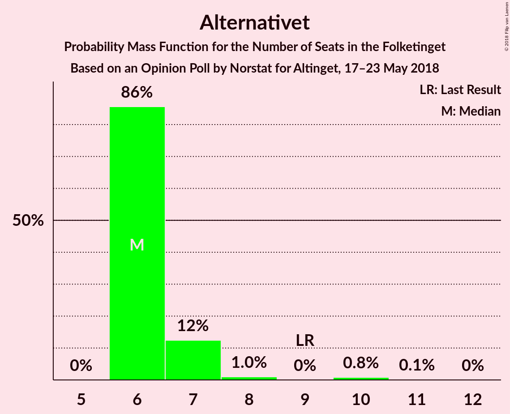

| Number of Seats | Probability | Accumulated | Special Marks |
|:---------------:|:-----------:|:-----------:|:-------------:|
| 5 | 0.9% | 100% |  |
| 6 | 6% | 99.1% |  |
| 7 | 3% | 93% |  |
| 8 | 86% | 90% | Median |
| 9 | 2% | 4% | Last Result |
| 10 | 2% | 2% |  |
| 11 | 0.1% | 0.1% |  |
| 12 | 0% | 0% |  |

### Nye Borgerlige

*For a full overview of the results for this party, see the [Nye Borgerlige](party-nyeborgerlige.html) page.*

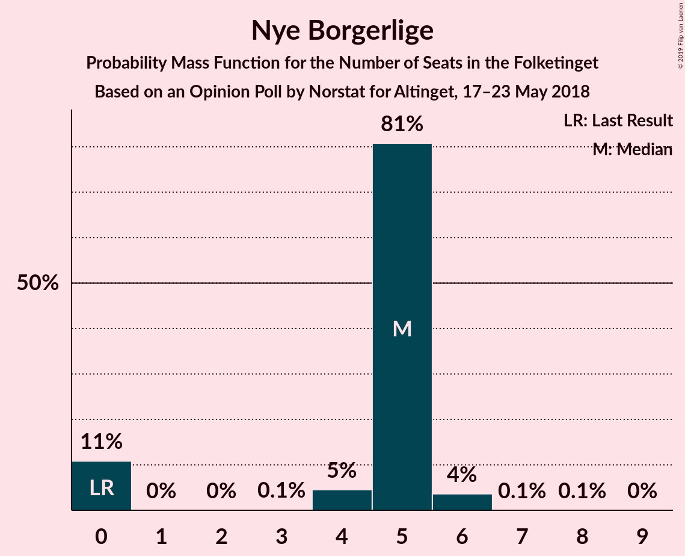

| Number of Seats | Probability | Accumulated | Special Marks |
|:---------------:|:-----------:|:-----------:|:-------------:|
| 0 | 11% | 100% | Last Result |
| 1 | 0% | 89% |  |
| 2 | 0% | 89% |  |
| 3 | 0.1% | 89% |  |
| 4 | 5% | 89% |  |
| 5 | 81% | 85% | Median |
| 6 | 4% | 4% |  |
| 7 | 0.1% | 0.1% |  |
| 8 | 0.1% | 0.1% |  |
| 9 | 0% | 0% |  |

### Kristendemokraterne

*For a full overview of the results for this party, see the [Kristendemokraterne](party-kristendemokraterne.html) page.*

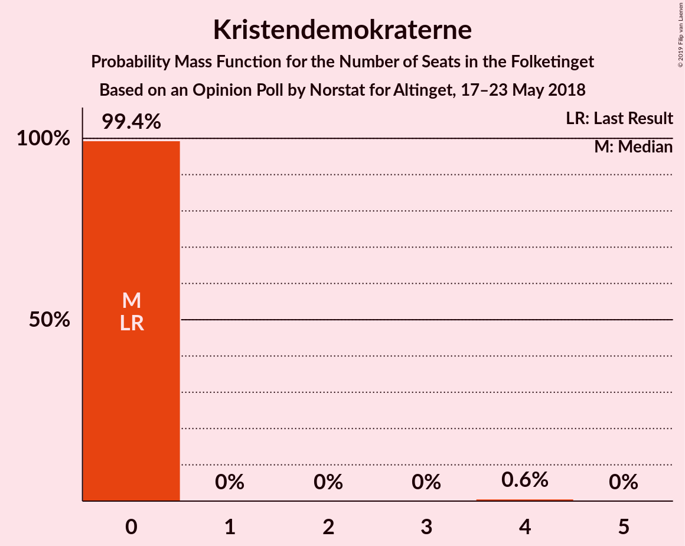

| Number of Seats | Probability | Accumulated | Special Marks |
|:---------------:|:-----------:|:-----------:|:-------------:|
| 0 | 99.4% | 100% | Last Result, Median |
| 1 | 0% | 0.6% |  |
| 2 | 0% | 0.6% |  |
| 3 | 0% | 0.6% |  |
| 4 | 0.6% | 0.6% |  |
| 5 | 0% | 0% |  |

## Coalitions

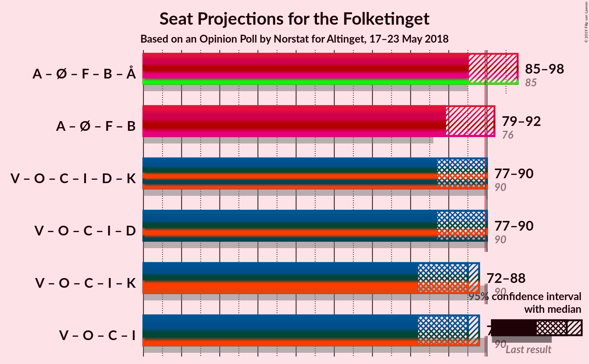

### Confidence Intervals

| Coalition | Last Result | Median | Majority? | 80% Confidence Interval | 90% Confidence Interval | 95% Confidence Interval | 99% Confidence Interval |
|:---------:|:-----------:|:------:|:---------:|:-----------------------:|:-----------------------:|:-----------------------:|:-----------------------:|
| Socialdemokraterne – Enhedslisten–De Rød-Grønne – Socialistisk Folkeparti – Radikale Venstre – Alternativet | 85 | 88 | 13% | 88–93 | 87–93 | 84–95 | 84–97 |
| Venstre – Dansk Folkeparti – Det Konservative Folkeparti – Liberal Alliance – Nye Borgerlige – Kristendemokraterne | 90 | 87 | 3% | 82–87 | 82–88 | 80–91 | 78–91 |
| Venstre – Dansk Folkeparti – Det Konservative Folkeparti – Liberal Alliance – Nye Borgerlige | 90 | 87 | 3% | 82–87 | 82–88 | 80–90 | 78–91 |
| Socialdemokraterne – Enhedslisten–De Rød-Grønne – Socialistisk Folkeparti – Radikale Venstre | 76 | 80 | 1.0% | 80–85 | 79–85 | 78–89 | 76–91 |
| Socialdemokraterne – Enhedslisten–De Rød-Grønne – Socialistisk Folkeparti – Alternativet | 77 | 79 | 0% | 79–84 | 79–84 | 76–86 | 75–89 |
| Venstre – Dansk Folkeparti – Det Konservative Folkeparti – Liberal Alliance – Kristendemokraterne | 90 | 82 | 0.2% | 82 | 80–85 | 76–86 | 76–87 |
| Venstre – Dansk Folkeparti – Det Konservative Folkeparti – Liberal Alliance | 90 | 82 | 0.2% | 82 | 80–85 | 76–85 | 76–86 |
| Socialdemokraterne – Enhedslisten–De Rød-Grønne – Socialistisk Folkeparti | 68 | 71 | 0% | 71–76 | 71–77 | 69–80 | 67–83 |
| Socialdemokraterne – Socialistisk Folkeparti – Radikale Venstre | 62 | 63 | 0% | 63–69 | 61–69 | 60–73 | 59–74 |
| Socialdemokraterne – Radikale Venstre | 55 | 54 | 0% | 54–60 | 53–60 | 52–64 | 50–64 |
| Venstre – Det Konservative Folkeparti – Liberal Alliance | 53 | 49 | 0% | 49–52 | 49–52 | 47–54 | 46–57 |
| Venstre – Det Konservative Folkeparti | 40 | 40 | 0% | 40–44 | 40–44 | 39–46 | 38–48 |
| Venstre | 34 | 31 | 0% | 31–35 | 31–35 | 30–36 | 29–37 |

### Socialdemokraterne – Enhedslisten–De Rød-Grønne – Socialistisk Folkeparti – Radikale Venstre – Alternativet

| Number of Seats | Probability | Accumulated | Special Marks |
|:---------------:|:-----------:|:-----------:|:-------------:|
| 82 | 0.1% | 100% |  |
| 83 | 0.1% | 99.9% |  |
| 84 | 3% | 99.7% |  |
| 85 | 0.5% | 97% | Last Result |
| 86 | 1.2% | 97% |  |
| 87 | 2% | 95% |  |
| 88 | 78% | 94% | Median |
| 89 | 3% | 16% |  |
| 90 | 1.0% | 13% | Majority |
| 91 | 0.2% | 12% |  |
| 92 | 0.1% | 12% |  |
| 93 | 8% | 12% |  |
| 94 | 0.8% | 4% |  |
| 95 | 2% | 3% |  |
| 96 | 0.1% | 1.2% |  |
| 97 | 1.0% | 1.0% |  |
| 98 | 0% | 0% |  |

### Venstre – Dansk Folkeparti – Det Konservative Folkeparti – Liberal Alliance – Nye Borgerlige – Kristendemokraterne

| Number of Seats | Probability | Accumulated | Special Marks |
|:---------------:|:-----------:|:-----------:|:-------------:|
| 78 | 1.0% | 100% |  |
| 79 | 0.1% | 99.0% |  |
| 80 | 2% | 98.8% |  |
| 81 | 0.8% | 97% |  |
| 82 | 8% | 96% |  |
| 83 | 0.1% | 88% |  |
| 84 | 0.2% | 88% |  |
| 85 | 1.0% | 88% |  |
| 86 | 3% | 87% |  |
| 87 | 78% | 84% | Median |
| 88 | 2% | 6% |  |
| 89 | 1.2% | 5% |  |
| 90 | 0.5% | 3% | Last Result, Majority |
| 91 | 3% | 3% |  |
| 92 | 0.1% | 0.3% |  |
| 93 | 0.1% | 0.1% |  |
| 94 | 0% | 0% |  |

### Venstre – Dansk Folkeparti – Det Konservative Folkeparti – Liberal Alliance – Nye Borgerlige

| Number of Seats | Probability | Accumulated | Special Marks |
|:---------------:|:-----------:|:-----------:|:-------------:|
| 78 | 1.1% | 100% |  |
| 79 | 0.1% | 98.9% |  |
| 80 | 2% | 98.8% |  |
| 81 | 0.8% | 97% |  |
| 82 | 8% | 96% |  |
| 83 | 0.1% | 88% |  |
| 84 | 0.2% | 88% |  |
| 85 | 1.0% | 88% |  |
| 86 | 3% | 87% |  |
| 87 | 78% | 84% | Median |
| 88 | 2% | 5% |  |
| 89 | 1.2% | 4% |  |
| 90 | 0.5% | 3% | Last Result, Majority |
| 91 | 2% | 2% |  |
| 92 | 0.1% | 0.3% |  |
| 93 | 0.1% | 0.1% |  |
| 94 | 0% | 0% |  |

### Socialdemokraterne – Enhedslisten–De Rød-Grønne – Socialistisk Folkeparti – Radikale Venstre

| Number of Seats | Probability | Accumulated | Special Marks |
|:---------------:|:-----------:|:-----------:|:-------------:|
| 75 | 0.1% | 100% |  |
| 76 | 0.6% | 99.9% | Last Result |
| 77 | 0.7% | 99.2% |  |
| 78 | 2% | 98% |  |
| 79 | 4% | 96% |  |
| 80 | 77% | 92% | Median |
| 81 | 2% | 16% |  |
| 82 | 0.6% | 14% |  |
| 83 | 1.1% | 13% |  |
| 84 | 0.3% | 12% |  |
| 85 | 7% | 12% |  |
| 86 | 0.7% | 4% |  |
| 87 | 0.8% | 4% |  |
| 88 | 0.2% | 3% |  |
| 89 | 2% | 3% |  |
| 90 | 0% | 1.0% | Majority |
| 91 | 1.0% | 1.0% |  |
| 92 | 0% | 0% |  |

### Socialdemokraterne – Enhedslisten–De Rød-Grønne – Socialistisk Folkeparti – Alternativet

| Number of Seats | Probability | Accumulated | Special Marks |
|:---------------:|:-----------:|:-----------:|:-------------:|
| 74 | 0.4% | 100% |  |
| 75 | 0.8% | 99.6% |  |
| 76 | 2% | 98.8% |  |
| 77 | 1.2% | 97% | Last Result |
| 78 | 0.4% | 96% |  |
| 79 | 77% | 95% | Median |
| 80 | 1.5% | 18% |  |
| 81 | 3% | 17% |  |
| 82 | 0.2% | 14% |  |
| 83 | 2% | 13% |  |
| 84 | 7% | 11% |  |
| 85 | 0.4% | 4% |  |
| 86 | 2% | 4% |  |
| 87 | 0.3% | 2% |  |
| 88 | 0.1% | 1.3% |  |
| 89 | 1.1% | 1.2% |  |
| 90 | 0% | 0% | Majority |

### Venstre – Dansk Folkeparti – Det Konservative Folkeparti – Liberal Alliance – Kristendemokraterne

| Number of Seats | Probability | Accumulated | Special Marks |
|:---------------:|:-----------:|:-----------:|:-------------:|
| 75 | 0.1% | 100% |  |
| 76 | 3% | 99.9% |  |
| 77 | 0% | 97% |  |
| 78 | 1.2% | 97% |  |
| 79 | 0.8% | 96% |  |
| 80 | 2% | 95% |  |
| 81 | 1.0% | 94% |  |
| 82 | 85% | 93% | Median |
| 83 | 1.2% | 8% |  |
| 84 | 0.4% | 6% |  |
| 85 | 3% | 6% |  |
| 86 | 2% | 3% |  |
| 87 | 0.6% | 1.1% |  |
| 88 | 0% | 0.5% |  |
| 89 | 0.2% | 0.4% |  |
| 90 | 0.1% | 0.2% | Last Result, Majority |
| 91 | 0.1% | 0.1% |  |
| 92 | 0% | 0% |  |

### Venstre – Dansk Folkeparti – Det Konservative Folkeparti – Liberal Alliance

| Number of Seats | Probability | Accumulated | Special Marks |
|:---------------:|:-----------:|:-----------:|:-------------:|
| 75 | 0.1% | 100% |  |
| 76 | 3% | 99.9% |  |
| 77 | 0% | 97% |  |
| 78 | 1.2% | 97% |  |
| 79 | 0.8% | 96% |  |
| 80 | 2% | 95% |  |
| 81 | 1.0% | 94% |  |
| 82 | 85% | 93% | Median |
| 83 | 2% | 8% |  |
| 84 | 0.4% | 6% |  |
| 85 | 3% | 5% |  |
| 86 | 2% | 2% |  |
| 87 | 0% | 0.5% |  |
| 88 | 0% | 0.5% |  |
| 89 | 0.2% | 0.4% |  |
| 90 | 0.1% | 0.2% | Last Result, Majority |
| 91 | 0.1% | 0.1% |  |
| 92 | 0% | 0% |  |

### Socialdemokraterne – Enhedslisten–De Rød-Grønne – Socialistisk Folkeparti

| Number of Seats | Probability | Accumulated | Special Marks |
|:---------------:|:-----------:|:-----------:|:-------------:|
| 67 | 0.6% | 100% |  |
| 68 | 0.6% | 99.4% | Last Result |
| 69 | 2% | 98.7% |  |
| 70 | 1.4% | 97% |  |
| 71 | 78% | 95% | Median |
| 72 | 1.4% | 17% |  |
| 73 | 1.4% | 16% |  |
| 74 | 0.8% | 14% |  |
| 75 | 0.2% | 13% |  |
| 76 | 8% | 13% |  |
| 77 | 2% | 6% |  |
| 78 | 0.4% | 4% |  |
| 79 | 0.3% | 3% |  |
| 80 | 2% | 3% |  |
| 81 | 0% | 1.1% |  |
| 82 | 0.1% | 1.1% |  |
| 83 | 1.0% | 1.0% |  |
| 84 | 0% | 0% |  |

### Socialdemokraterne – Socialistisk Folkeparti – Radikale Venstre

| Number of Seats | Probability | Accumulated | Special Marks |
|:---------------:|:-----------:|:-----------:|:-------------:|
| 58 | 0.2% | 100% |  |
| 59 | 1.3% | 99.8% |  |
| 60 | 2% | 98.5% |  |
| 61 | 2% | 97% |  |
| 62 | 3% | 95% | Last Result |
| 63 | 78% | 91% | Median |
| 64 | 1.2% | 13% |  |
| 65 | 0.4% | 12% |  |
| 66 | 0.2% | 12% |  |
| 67 | 0.1% | 12% |  |
| 68 | 0.2% | 11% |  |
| 69 | 7% | 11% |  |
| 70 | 0.9% | 4% |  |
| 71 | 0.3% | 3% |  |
| 72 | 0% | 3% |  |
| 73 | 2% | 3% |  |
| 74 | 1.0% | 1.0% |  |
| 75 | 0% | 0% |  |

### Socialdemokraterne – Radikale Venstre

| Number of Seats | Probability | Accumulated | Special Marks |
|:---------------:|:-----------:|:-----------:|:-------------:|
| 48 | 0.1% | 100% |  |
| 49 | 0.1% | 99.9% |  |
| 50 | 0.8% | 99.8% |  |
| 51 | 2% | 99.1% |  |
| 52 | 0.8% | 98% |  |
| 53 | 3% | 97% |  |
| 54 | 80% | 94% | Median |
| 55 | 1.2% | 14% | Last Result |
| 56 | 1.3% | 13% |  |
| 57 | 0.2% | 12% |  |
| 58 | 0.1% | 11% |  |
| 59 | 0.7% | 11% |  |
| 60 | 8% | 11% |  |
| 61 | 0.1% | 3% |  |
| 62 | 0.1% | 3% |  |
| 63 | 0.1% | 3% |  |
| 64 | 3% | 3% |  |
| 65 | 0% | 0% |  |

### Venstre – Det Konservative Folkeparti – Liberal Alliance

| Number of Seats | Probability | Accumulated | Special Marks |
|:---------------:|:-----------:|:-----------:|:-------------:|
| 45 | 0.1% | 100% |  |
| 46 | 2% | 99.9% |  |
| 47 | 2% | 98% |  |
| 48 | 0.8% | 96% |  |
| 49 | 79% | 95% | Median |
| 50 | 1.5% | 17% |  |
| 51 | 2% | 15% |  |
| 52 | 8% | 13% |  |
| 53 | 1.0% | 5% | Last Result |
| 54 | 2% | 4% |  |
| 55 | 0.7% | 2% |  |
| 56 | 0.2% | 2% |  |
| 57 | 1.1% | 1.5% |  |
| 58 | 0.2% | 0.4% |  |
| 59 | 0.1% | 0.2% |  |
| 60 | 0% | 0% |  |

### Venstre – Det Konservative Folkeparti

| Number of Seats | Probability | Accumulated | Special Marks |
|:---------------:|:-----------:|:-----------:|:-------------:|
| 37 | 0.1% | 100% |  |
| 38 | 2% | 99.9% |  |
| 39 | 1.2% | 98% |  |
| 40 | 78% | 97% | Last Result, Median |
| 41 | 1.1% | 19% |  |
| 42 | 2% | 18% |  |
| 43 | 3% | 16% |  |
| 44 | 9% | 13% |  |
| 45 | 0.7% | 4% |  |
| 46 | 1.0% | 3% |  |
| 47 | 0.3% | 2% |  |
| 48 | 2% | 2% |  |
| 49 | 0.2% | 0.5% |  |
| 50 | 0.1% | 0.3% |  |
| 51 | 0.1% | 0.2% |  |
| 52 | 0.1% | 0.1% |  |
| 53 | 0% | 0% |  |

### Venstre

| Number of Seats | Probability | Accumulated | Special Marks |
|:---------------:|:-----------:|:-----------:|:-------------:|
| 28 | 0.1% | 100% |  |
| 29 | 2% | 99.9% |  |
| 30 | 2% | 98% |  |
| 31 | 78% | 97% | Median |
| 32 | 1.0% | 19% |  |
| 33 | 2% | 18% |  |
| 34 | 4% | 16% | Last Result |
| 35 | 9% | 13% |  |
| 36 | 1.4% | 4% |  |
| 37 | 2% | 2% |  |
| 38 | 0.2% | 0.5% |  |
| 39 | 0.1% | 0.3% |  |
| 40 | 0% | 0.2% |  |
| 41 | 0% | 0.2% |  |
| 42 | 0.1% | 0.1% |  |
| 43 | 0% | 0% |  |

## Technical Information

### Opinion Poll

+ **Polling firm:** Norstat
+ **Commissioner(s):** Altinget
+ **Fieldwork period:** 17–23 May 2018

### Calculations

+ **Sample size:** 1210
+ **Simulations done:** 131,072
+ **Error estimate:** 2.67%

