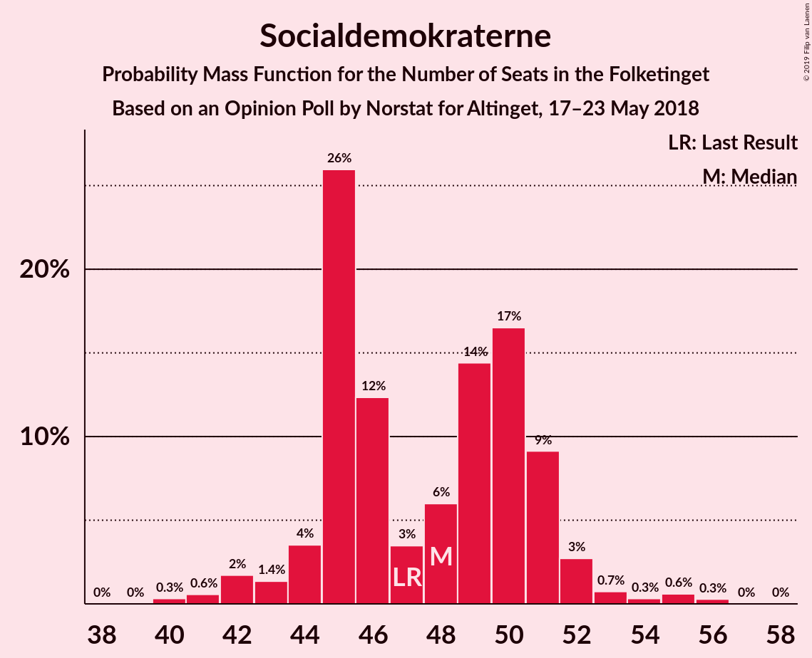
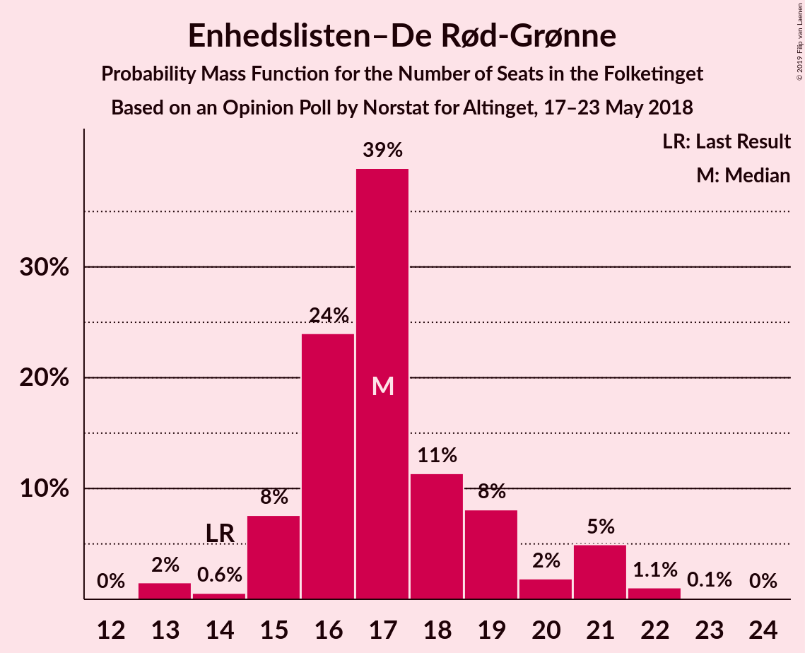
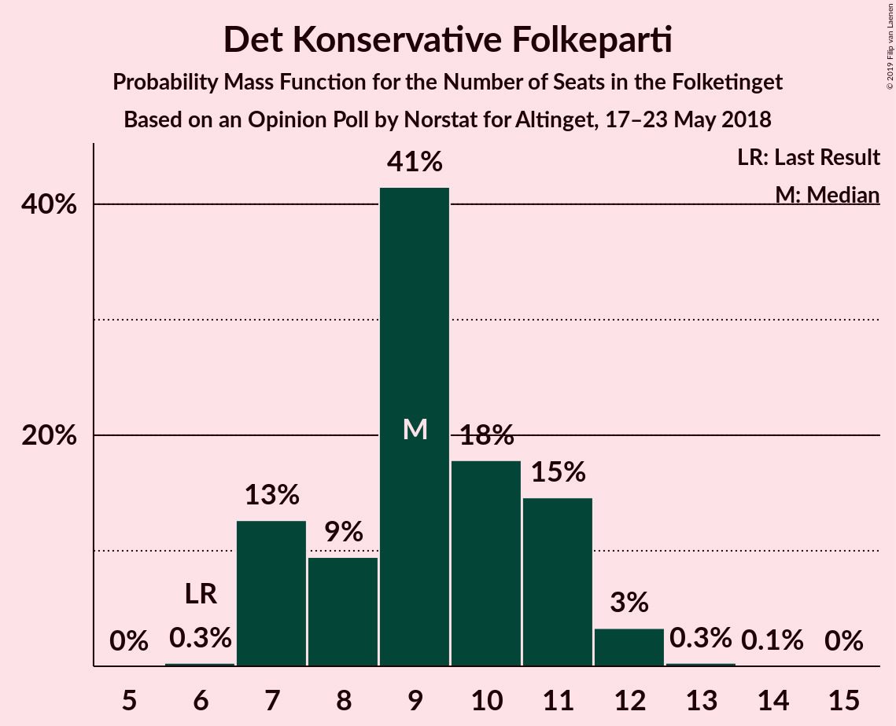
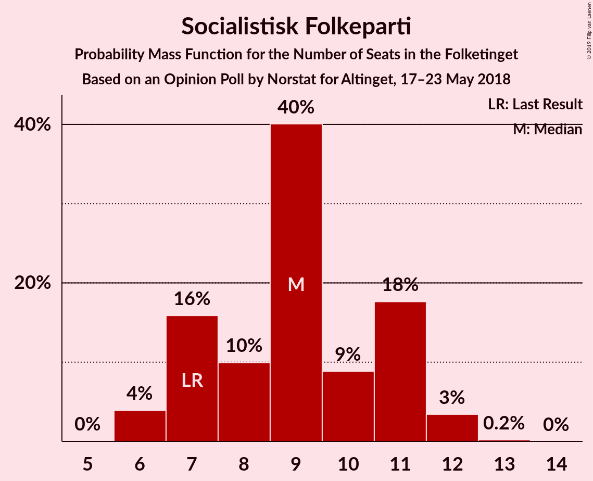
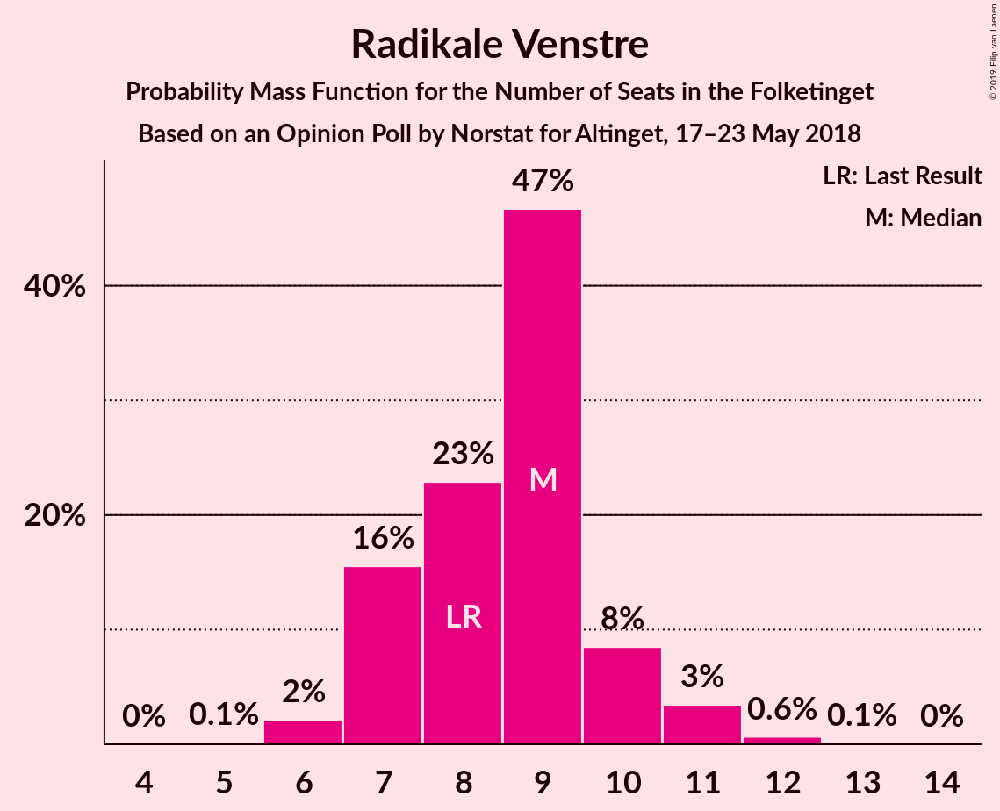
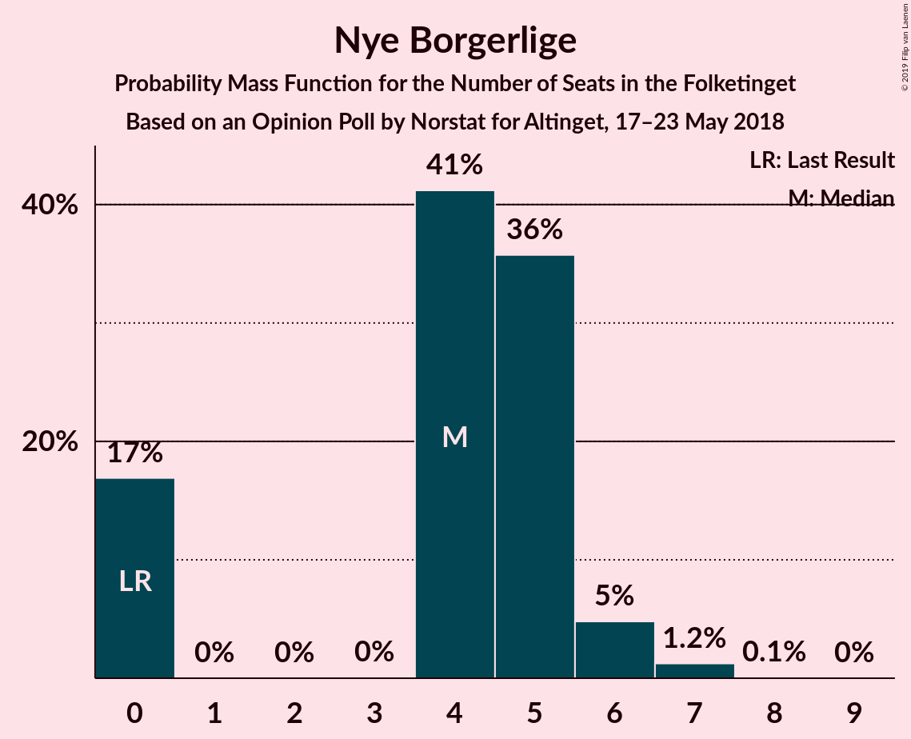

# Opinion Poll by Norstat for Altinget, 17–23 May 2018

<a href="#voting-intentions">Voting Intentions</a> | <a href="#seats">Seats</a> | <a href="#coalitions">Coalitions</a> | <a href="#technical-information">Technical Information</a>

## Voting Intentions

### Confidence Intervals

| Party | Last Result | Poll Result | 80% Confidence Interval | 90% Confidence Interval | 95% Confidence Interval | 99% Confidence Interval |
|:-----:|:-----------:|:-----------:|:-----------------------:|:-----------------------:|:-----------------------:|:-----------------------:|
| Socialdemokraterne | 26.3% | 26.9% | 25.3–28.5% |24.8–29.0% |24.4–29.4% |23.7–30.3% |
| Venstre | 19.5% | 19.2% | 17.8–20.7% |17.4–21.1% |17.1–21.5% |16.4–22.2% |
| Dansk Folkeparti | 21.1% | 17.0% | 15.7–18.5% |15.3–18.9% |15.0–19.3% |14.4–20.0% |
| Enhedslisten–De Rød-Grønne | 7.8% | 9.9% | 8.9–11.1% |8.6–11.4% |8.4–11.7% |7.9–12.3% |
| Det Konservative Folkeparti | 3.4% | 5.2% | 4.5–6.1% |4.3–6.4% |4.1–6.6% |3.8–7.1% |
| Socialistisk Folkeparti | 4.2% | 4.9% | 4.2–5.8% |4.0–6.0% |3.8–6.2% |3.5–6.7% |
| Radikale Venstre | 4.6% | 4.7% | 4.0–5.6% |3.8–5.8% |3.6–6.1% |3.3–6.5% |
| Liberal Alliance | 7.5% | 4.5% | 3.8–5.3% |3.6–5.6% |3.4–5.8% |3.1–6.2% |
| Alternativet | 4.8% | 4.1% | 3.5–5.0% |3.3–5.2% |3.1–5.4% |2.9–5.8% |
| Nye Borgerlige | 0.0% | 2.3% | 1.8–3.0% |1.7–3.2% |1.6–3.3% |1.4–3.7% |
| Kristendemokraterne | 0.8% | 0.9% | 0.6–1.4% |0.6–1.5% |0.5–1.6% |0.4–1.9% |

*Note:* The poll result column reflects the actual value used in the calculations. Published results may vary slightly, and in addition be rounded to fewer digits.

## Seats

### Confidence Intervals

| Party | Last Result | Median | 80% Confidence Interval | 90% Confidence Interval | 95% Confidence Interval | 99% Confidence Interval |
|:-----:|:-----------:|:------:|:-----------------------:|:-----------------------:|:-----------------------:|:-----------------------:|
| <a href="#socialdemokraterne">Socialdemokraterne</a> | 47 | 48 | 45–51 |44–51 |42–52 |41–55 |
| <a href="#venstre">Venstre</a> | 34 | 33 | 31–37 |31–37 |30–38 |29–39 |
| <a href="#dansk-folkeparti">Dansk Folkeparti</a> | 37 | 31 | 27–33 |26–34 |25–34 |25–36 |
| <a href="#enhedslisten–de-rød-grønne">Enhedslisten–De Rød-Grønne</a> | 14 | 17 | 16–19 |15–21 |15–21 |13–22 |
| <a href="#det-konservative-folkeparti">Det Konservative Folkeparti</a> | 6 | 9 | 7–11 |7–11 |7–12 |7–12 |
| <a href="#socialistisk-folkeparti">Socialistisk Folkeparti</a> | 7 | 9 | 7–11 |7–11 |6–12 |6–12 |
| <a href="#radikale-venstre">Radikale Venstre</a> | 8 | 9 | 7–10 |7–10 |7–11 |6–12 |
| <a href="#liberal-alliance">Liberal Alliance</a> | 13 | 8 | 7–9 |6–10 |6–10 |6–11 |
| <a href="#alternativet">Alternativet</a> | 9 | 8 | 6–9 |6–9 |6–10 |5–10 |
| <a href="#nye-borgerlige">Nye Borgerlige</a> | 0 | 4 | 0–5 |0–6 |0–6 |0–7 |
| <a href="#kristendemokraterne">Kristendemokraterne</a> | 0 | 0 | 0 |0 |0 |0 |

### Socialdemokraterne

*For a full overview of the results for this party, see the [Socialdemokraterne](party-socialdemokraterne.html) page.*

| Number of Seats | Probability | Accumulated | Special Marks |
|:---------------:|:-----------:|:-----------:|:-------------:|
| 40 | 0.3% | 100% |  |
| 41 | 0.6% | 99.7% |  |
| 42 | 2% | 99.1% |  |
| 43 | 1.4% | 97% |  |
| 44 | 4% | 96% |  |
| 45 | 26% | 92% |  |
| 46 | 12% | 67% |  |
| 47 | 3% | 54% | Last Result |
| 48 | 6% | 51% | Median |
| 49 | 14% | 45% |  |
| 50 | 17% | 30% |  |
| 51 | 9% | 14% |  |
| 52 | 3% | 5% |  |
| 53 | 0.7% | 2% |  |
| 54 | 0.3% | 1.2% |  |
| 55 | 0.6% | 0.9% |  |
| 56 | 0.3% | 0.3% |  |
| 57 | 0% | 0% |  |

### Venstre

*For a full overview of the results for this party, see the [Venstre](party-venstre.html) page.*

| Number of Seats | Probability | Accumulated | Special Marks |
|:---------------:|:-----------:|:-----------:|:-------------:|
| 28 | 0.4% | 100% |  |
| 29 | 1.2% | 99.6% |  |
| 30 | 3% | 98% |  |
| 31 | 26% | 96% |  |
| 32 | 17% | 70% |  |
| 33 | 10% | 53% | Median |
| 34 | 9% | 43% | Last Result |
| 35 | 18% | 35% |  |
| 36 | 7% | 17% |  |
| 37 | 7% | 10% |  |
| 38 | 2% | 3% |  |
| 39 | 0.8% | 1.3% |  |
| 40 | 0.4% | 0.5% |  |
| 41 | 0% | 0.1% |  |
| 42 | 0% | 0% |  |

### Dansk Folkeparti

*For a full overview of the results for this party, see the [Dansk Folkeparti](party-danskfolkeparti.html) page.*

| Number of Seats | Probability | Accumulated | Special Marks |
|:---------------:|:-----------:|:-----------:|:-------------:|
| 24 | 0.1% | 100% |  |
| 25 | 4% | 99.9% |  |
| 26 | 3% | 96% |  |
| 27 | 5% | 94% |  |
| 28 | 14% | 89% |  |
| 29 | 5% | 75% |  |
| 30 | 15% | 70% |  |
| 31 | 20% | 55% | Median |
| 32 | 6% | 36% |  |
| 33 | 23% | 30% |  |
| 34 | 5% | 7% |  |
| 35 | 1.1% | 2% |  |
| 36 | 0.5% | 0.6% |  |
| 37 | 0.1% | 0.1% | Last Result |
| 38 | 0% | 0% |  |

### Enhedslisten–De Rød-Grønne

*For a full overview of the results for this party, see the [Enhedslisten–De Rød-Grønne](party-enhedslisten–derød-grønne.html) page.*

| Number of Seats | Probability | Accumulated | Special Marks |
|:---------------:|:-----------:|:-----------:|:-------------:|
| 13 | 2% | 100% |  |
| 14 | 0.6% | 98% | Last Result |
| 15 | 8% | 98% |  |
| 16 | 24% | 90% |  |
| 17 | 39% | 66% | Median |
| 18 | 11% | 27% |  |
| 19 | 8% | 16% |  |
| 20 | 2% | 8% |  |
| 21 | 5% | 6% |  |
| 22 | 1.1% | 1.2% |  |
| 23 | 0.1% | 0.1% |  |
| 24 | 0% | 0% |  |

### Det Konservative Folkeparti

*For a full overview of the results for this party, see the [Det Konservative Folkeparti](party-detkonservativefolkeparti.html) page.*

| Number of Seats | Probability | Accumulated | Special Marks |
|:---------------:|:-----------:|:-----------:|:-------------:|
| 6 | 0.3% | 100% | Last Result |
| 7 | 13% | 99.7% |  |
| 8 | 9% | 87% |  |
| 9 | 41% | 78% | Median |
| 10 | 18% | 36% |  |
| 11 | 15% | 18% |  |
| 12 | 3% | 4% |  |
| 13 | 0.3% | 0.4% |  |
| 14 | 0.1% | 0.1% |  |
| 15 | 0% | 0% |  |

### Socialistisk Folkeparti

*For a full overview of the results for this party, see the [Socialistisk Folkeparti](party-socialistiskfolkeparti.html) page.*

| Number of Seats | Probability | Accumulated | Special Marks |
|:---------------:|:-----------:|:-----------:|:-------------:|
| 6 | 4% | 100% |  |
| 7 | 16% | 96% | Last Result |
| 8 | 10% | 80% |  |
| 9 | 40% | 70% | Median |
| 10 | 9% | 30% |  |
| 11 | 18% | 21% |  |
| 12 | 3% | 4% |  |
| 13 | 0.2% | 0.2% |  |
| 14 | 0% | 0% |  |

### Radikale Venstre

*For a full overview of the results for this party, see the [Radikale Venstre](party-radikalevenstre.html) page.*

| Number of Seats | Probability | Accumulated | Special Marks |
|:---------------:|:-----------:|:-----------:|:-------------:|
| 5 | 0.1% | 100% |  |
| 6 | 2% | 99.9% |  |
| 7 | 16% | 98% |  |
| 8 | 23% | 82% | Last Result |
| 9 | 47% | 59% | Median |
| 10 | 8% | 13% |  |
| 11 | 3% | 4% |  |
| 12 | 0.6% | 0.7% |  |
| 13 | 0.1% | 0.1% |  |
| 14 | 0% | 0% |  |

### Liberal Alliance

*For a full overview of the results for this party, see the [Liberal Alliance](party-liberalalliance.html) page.*

| Number of Seats | Probability | Accumulated | Special Marks |
|:---------------:|:-----------:|:-----------:|:-------------:|
| 5 | 0.4% | 100% |  |
| 6 | 6% | 99.6% |  |
| 7 | 20% | 93% |  |
| 8 | 23% | 73% | Median |
| 9 | 40% | 50% |  |
| 10 | 9% | 10% |  |
| 11 | 1.1% | 1.2% |  |
| 12 | 0.1% | 0.1% |  |
| 13 | 0% | 0% | Last Result |

### Alternativet

*For a full overview of the results for this party, see the [Alternativet](party-alternativet.html) page.*

| Number of Seats | Probability | Accumulated | Special Marks |
|:---------------:|:-----------:|:-----------:|:-------------:|
| 4 | 0.1% | 100% |  |
| 5 | 1.5% | 99.9% |  |
| 6 | 14% | 98% |  |
| 7 | 22% | 84% |  |
| 8 | 50% | 62% | Median |
| 9 | 8% | 12% | Last Result |
| 10 | 4% | 4% |  |
| 11 | 0.2% | 0.3% |  |
| 12 | 0% | 0% |  |

### Nye Borgerlige

*For a full overview of the results for this party, see the [Nye Borgerlige](party-nyeborgerlige.html) page.*

| Number of Seats | Probability | Accumulated | Special Marks |
|:---------------:|:-----------:|:-----------:|:-------------:|
| 0 | 17% | 100% | Last Result |
| 1 | 0% | 83% |  |
| 2 | 0% | 83% |  |
| 3 | 0% | 83% |  |
| 4 | 41% | 83% | Median |
| 5 | 36% | 42% |  |
| 6 | 5% | 6% |  |
| 7 | 1.2% | 1.3% |  |
| 8 | 0.1% | 0.1% |  |
| 9 | 0% | 0% |  |

### Kristendemokraterne

*For a full overview of the results for this party, see the [Kristendemokraterne](party-kristendemokraterne.html) page.*

| Number of Seats | Probability | Accumulated | Special Marks |
|:---------------:|:-----------:|:-----------:|:-------------:|
| 0 | 99.6% | 100% | Last Result, Median |
| 1 | 0% | 0.4% |  |
| 2 | 0% | 0.4% |  |
| 3 | 0% | 0.4% |  |
| 4 | 0.4% | 0.4% |  |
| 5 | 0% | 0% |  |

## Coalitions

### Confidence Intervals

| Coalition | Last Result | Median | Majority? | 80% Confidence Interval | 90% Confidence Interval | 95% Confidence Interval | 99% Confidence Interval |
|:---------:|:-----------:|:------:|:---------:|:-----------------------:|:-----------------------:|:-----------------------:|:-----------------------:|
| Socialdemokraterne – Enhedslisten–De Rød-Grønne – Socialistisk Folkeparti – Radikale Venstre – Alternativet | 85 | 90 | 56% | 86–94 | 86–95 | 84–96 | 83–97 |
| Venstre – Dansk Folkeparti – Det Konservative Folkeparti – Liberal Alliance – Nye Borgerlige – Kristendemokraterne | 90 | 85 | 4% | 81–89 | 80–89 | 79–91 | 78–92 |
| Venstre – Dansk Folkeparti – Det Konservative Folkeparti – Liberal Alliance – Nye Borgerlige | 90 | 85 | 4% | 81–89 | 80–89 | 79–91 | 78–92 |
| Socialdemokraterne – Enhedslisten–De Rød-Grønne – Socialistisk Folkeparti – Radikale Venstre | 76 | 82 | 0.8% | 79–86 | 78–87 | 77–88 | 74–91 |
| Socialdemokraterne – Enhedslisten–De Rød-Grønne – Socialistisk Folkeparti – Alternativet | 77 | 81 | 0.2% | 79–85 | 77–86 | 76–87 | 74–89 |
| Venstre – Dansk Folkeparti – Det Konservative Folkeparti – Liberal Alliance – Kristendemokraterne | 90 | 81 | 0.1% | 79–85 | 76–85 | 76–87 | 75–89 |
| Venstre – Dansk Folkeparti – Det Konservative Folkeparti – Liberal Alliance | 90 | 81 | 0.1% | 79–85 | 76–85 | 76–87 | 75–89 |
| Socialdemokraterne – Enhedslisten–De Rød-Grønne – Socialistisk Folkeparti | 68 | 73 | 0% | 71–77 | 69–78 | 68–80 | 67–82 |
| Socialdemokraterne – Socialistisk Folkeparti – Radikale Venstre | 62 | 65 | 0% | 61–69 | 60–70 | 59–70 | 57–73 |
| Socialdemokraterne – Radikale Venstre | 55 | 56 | 0% | 53–60 | 52–60 | 51–61 | 49–64 |
| Venstre – Det Konservative Folkeparti – Liberal Alliance | 53 | 50 | 0% | 48–54 | 48–55 | 47–56 | 45–58 |
| Venstre – Det Konservative Folkeparti | 40 | 42 | 0% | 39–46 | 39–47 | 39–47 | 38–49 |
| Venstre | 34 | 33 | 0% | 31–37 | 31–37 | 30–38 | 29–39 |

### Socialdemokraterne – Enhedslisten–De Rød-Grønne – Socialistisk Folkeparti – Radikale Venstre – Alternativet

| Number of Seats | Probability | Accumulated | Special Marks |
|:---------------:|:-----------:|:-----------:|:-------------:|
| 81 | 0.3% | 100% |  |
| 82 | 0.1% | 99.6% |  |
| 83 | 0.9% | 99.5% |  |
| 84 | 2% | 98.6% |  |
| 85 | 0.8% | 96% | Last Result |
| 86 | 7% | 96% |  |
| 87 | 6% | 89% |  |
| 88 | 23% | 83% |  |
| 89 | 4% | 60% |  |
| 90 | 18% | 56% | Majority |
| 91 | 8% | 37% | Median |
| 92 | 12% | 30% |  |
| 93 | 7% | 18% |  |
| 94 | 5% | 12% |  |
| 95 | 4% | 7% |  |
| 96 | 2% | 3% |  |
| 97 | 0.6% | 1.1% |  |
| 98 | 0.3% | 0.5% |  |
| 99 | 0.1% | 0.1% |  |
| 100 | 0% | 0% |  |

### Venstre – Dansk Folkeparti – Det Konservative Folkeparti – Liberal Alliance – Nye Borgerlige – Kristendemokraterne

| Number of Seats | Probability | Accumulated | Special Marks |
|:---------------:|:-----------:|:-----------:|:-------------:|
| 76 | 0.1% | 100% |  |
| 77 | 0.3% | 99.9% |  |
| 78 | 0.6% | 99.5% |  |
| 79 | 2% | 98.9% |  |
| 80 | 4% | 97% |  |
| 81 | 5% | 93% |  |
| 82 | 7% | 88% |  |
| 83 | 12% | 82% |  |
| 84 | 8% | 70% |  |
| 85 | 18% | 63% | Median |
| 86 | 4% | 44% |  |
| 87 | 23% | 40% |  |
| 88 | 6% | 17% |  |
| 89 | 7% | 11% |  |
| 90 | 0.8% | 4% | Last Result, Majority |
| 91 | 2% | 4% |  |
| 92 | 0.9% | 1.4% |  |
| 93 | 0.1% | 0.5% |  |
| 94 | 0.3% | 0.4% |  |
| 95 | 0% | 0% |  |

### Venstre – Dansk Folkeparti – Det Konservative Folkeparti – Liberal Alliance – Nye Borgerlige

| Number of Seats | Probability | Accumulated | Special Marks |
|:---------------:|:-----------:|:-----------:|:-------------:|
| 76 | 0.1% | 100% |  |
| 77 | 0.3% | 99.9% |  |
| 78 | 0.6% | 99.5% |  |
| 79 | 2% | 98.9% |  |
| 80 | 4% | 97% |  |
| 81 | 5% | 93% |  |
| 82 | 7% | 88% |  |
| 83 | 12% | 82% |  |
| 84 | 8% | 70% |  |
| 85 | 18% | 62% | Median |
| 86 | 4% | 44% |  |
| 87 | 23% | 40% |  |
| 88 | 6% | 17% |  |
| 89 | 7% | 11% |  |
| 90 | 0.7% | 4% | Last Result, Majority |
| 91 | 2% | 3% |  |
| 92 | 0.9% | 1.4% |  |
| 93 | 0.1% | 0.5% |  |
| 94 | 0.3% | 0.4% |  |
| 95 | 0% | 0% |  |

### Socialdemokraterne – Enhedslisten–De Rød-Grønne – Socialistisk Folkeparti – Radikale Venstre

| Number of Seats | Probability | Accumulated | Special Marks |
|:---------------:|:-----------:|:-----------:|:-------------:|
| 73 | 0.1% | 100% |  |
| 74 | 0.5% | 99.9% |  |
| 75 | 0.2% | 99.4% |  |
| 76 | 1.4% | 99.2% | Last Result |
| 77 | 2% | 98% |  |
| 78 | 1.5% | 95% |  |
| 79 | 8% | 94% |  |
| 80 | 22% | 86% |  |
| 81 | 8% | 64% |  |
| 82 | 16% | 56% |  |
| 83 | 4% | 40% | Median |
| 84 | 8% | 37% |  |
| 85 | 16% | 28% |  |
| 86 | 6% | 13% |  |
| 87 | 2% | 7% |  |
| 88 | 3% | 5% |  |
| 89 | 1.4% | 2% |  |
| 90 | 0.2% | 0.8% | Majority |
| 91 | 0.5% | 0.6% |  |
| 92 | 0.1% | 0.1% |  |
| 93 | 0% | 0% |  |

### Socialdemokraterne – Enhedslisten–De Rød-Grønne – Socialistisk Folkeparti – Alternativet

| Number of Seats | Probability | Accumulated | Special Marks |
|:---------------:|:-----------:|:-----------:|:-------------:|
| 73 | 0.1% | 100% |  |
| 74 | 0.4% | 99.9% |  |
| 75 | 2% | 99.4% |  |
| 76 | 2% | 98% |  |
| 77 | 3% | 95% | Last Result |
| 78 | 0.9% | 92% |  |
| 79 | 29% | 91% |  |
| 80 | 5% | 62% |  |
| 81 | 14% | 57% |  |
| 82 | 5% | 43% | Median |
| 83 | 12% | 38% |  |
| 84 | 13% | 26% |  |
| 85 | 5% | 13% |  |
| 86 | 3% | 8% |  |
| 87 | 3% | 4% |  |
| 88 | 0.7% | 2% |  |
| 89 | 0.7% | 0.9% |  |
| 90 | 0.1% | 0.2% | Majority |
| 91 | 0.1% | 0.1% |  |
| 92 | 0% | 0% |  |

### Venstre – Dansk Folkeparti – Det Konservative Folkeparti – Liberal Alliance – Kristendemokraterne

| Number of Seats | Probability | Accumulated | Special Marks |
|:---------------:|:-----------:|:-----------:|:-------------:|
| 73 | 0% | 100% |  |
| 74 | 0.1% | 99.9% |  |
| 75 | 2% | 99.9% |  |
| 76 | 4% | 98% |  |
| 77 | 0.9% | 94% |  |
| 78 | 2% | 93% |  |
| 79 | 14% | 90% |  |
| 80 | 11% | 76% |  |
| 81 | 16% | 66% | Median |
| 82 | 26% | 50% |  |
| 83 | 5% | 23% |  |
| 84 | 4% | 18% |  |
| 85 | 10% | 14% |  |
| 86 | 1.0% | 4% |  |
| 87 | 1.1% | 3% |  |
| 88 | 0.7% | 2% |  |
| 89 | 1.0% | 1.2% |  |
| 90 | 0.1% | 0.1% | Last Result, Majority |
| 91 | 0.1% | 0.1% |  |
| 92 | 0% | 0% |  |

### Venstre – Dansk Folkeparti – Det Konservative Folkeparti – Liberal Alliance

| Number of Seats | Probability | Accumulated | Special Marks |
|:---------------:|:-----------:|:-----------:|:-------------:|
| 73 | 0% | 100% |  |
| 74 | 0.1% | 99.9% |  |
| 75 | 2% | 99.8% |  |
| 76 | 4% | 98% |  |
| 77 | 1.0% | 94% |  |
| 78 | 2% | 93% |  |
| 79 | 14% | 90% |  |
| 80 | 11% | 76% |  |
| 81 | 16% | 66% | Median |
| 82 | 26% | 50% |  |
| 83 | 5% | 23% |  |
| 84 | 4% | 18% |  |
| 85 | 10% | 13% |  |
| 86 | 1.0% | 4% |  |
| 87 | 1.0% | 3% |  |
| 88 | 0.7% | 2% |  |
| 89 | 1.0% | 1.2% |  |
| 90 | 0% | 0.1% | Last Result, Majority |
| 91 | 0.1% | 0.1% |  |
| 92 | 0% | 0% |  |

### Socialdemokraterne – Enhedslisten–De Rød-Grønne – Socialistisk Folkeparti

| Number of Seats | Probability | Accumulated | Special Marks |
|:---------------:|:-----------:|:-----------:|:-------------:|
| 65 | 0.1% | 100% |  |
| 66 | 0.3% | 99.9% |  |
| 67 | 0.7% | 99.7% |  |
| 68 | 3% | 98.9% | Last Result |
| 69 | 3% | 96% |  |
| 70 | 1.4% | 93% |  |
| 71 | 23% | 92% |  |
| 72 | 10% | 69% |  |
| 73 | 16% | 59% |  |
| 74 | 4% | 43% | Median |
| 75 | 7% | 39% |  |
| 76 | 6% | 32% |  |
| 77 | 17% | 26% |  |
| 78 | 5% | 9% |  |
| 79 | 2% | 5% |  |
| 80 | 2% | 3% |  |
| 81 | 0.3% | 1.0% |  |
| 82 | 0.4% | 0.7% |  |
| 83 | 0.3% | 0.3% |  |
| 84 | 0% | 0% |  |

### Socialdemokraterne – Socialistisk Folkeparti – Radikale Venstre

| Number of Seats | Probability | Accumulated | Special Marks |
|:---------------:|:-----------:|:-----------:|:-------------:|
| 56 | 0.2% | 100% |  |
| 57 | 0.3% | 99.8% |  |
| 58 | 0.7% | 99.5% |  |
| 59 | 2% | 98.8% |  |
| 60 | 5% | 97% |  |
| 61 | 3% | 92% |  |
| 62 | 5% | 89% | Last Result |
| 63 | 23% | 84% |  |
| 64 | 7% | 61% |  |
| 65 | 5% | 54% |  |
| 66 | 17% | 50% | Median |
| 67 | 4% | 33% |  |
| 68 | 14% | 29% |  |
| 69 | 10% | 15% |  |
| 70 | 3% | 6% |  |
| 71 | 1.0% | 2% |  |
| 72 | 0.4% | 1.2% |  |
| 73 | 0.5% | 0.8% |  |
| 74 | 0.3% | 0.3% |  |
| 75 | 0% | 0% |  |

### Socialdemokraterne – Radikale Venstre

| Number of Seats | Probability | Accumulated | Special Marks |
|:---------------:|:-----------:|:-----------:|:-------------:|
| 47 | 0.2% | 100% |  |
| 48 | 0.1% | 99.8% |  |
| 49 | 0.6% | 99.7% |  |
| 50 | 0.9% | 99.1% |  |
| 51 | 3% | 98% |  |
| 52 | 2% | 95% |  |
| 53 | 8% | 93% |  |
| 54 | 25% | 85% |  |
| 55 | 8% | 60% | Last Result |
| 56 | 5% | 52% |  |
| 57 | 13% | 47% | Median |
| 58 | 6% | 34% |  |
| 59 | 17% | 28% |  |
| 60 | 7% | 11% |  |
| 61 | 2% | 4% |  |
| 62 | 0.5% | 2% |  |
| 63 | 0.4% | 1.4% |  |
| 64 | 0.9% | 1.0% |  |
| 65 | 0.1% | 0.1% |  |
| 66 | 0% | 0% |  |

### Venstre – Det Konservative Folkeparti – Liberal Alliance

| Number of Seats | Probability | Accumulated | Special Marks |
|:---------------:|:-----------:|:-----------:|:-------------:|
| 42 | 0.1% | 100% |  |
| 43 | 0% | 99.9% |  |
| 44 | 0.1% | 99.9% |  |
| 45 | 0.4% | 99.8% |  |
| 46 | 1.3% | 99.4% |  |
| 47 | 2% | 98% |  |
| 48 | 11% | 96% |  |
| 49 | 30% | 85% |  |
| 50 | 8% | 55% | Median |
| 51 | 9% | 46% |  |
| 52 | 8% | 38% |  |
| 53 | 16% | 30% | Last Result |
| 54 | 4% | 14% |  |
| 55 | 6% | 10% |  |
| 56 | 2% | 4% |  |
| 57 | 0.5% | 1.3% |  |
| 58 | 0.4% | 0.7% |  |
| 59 | 0.3% | 0.3% |  |
| 60 | 0% | 0% |  |

### Venstre – Det Konservative Folkeparti

| Number of Seats | Probability | Accumulated | Special Marks |
|:---------------:|:-----------:|:-----------:|:-------------:|
| 36 | 0.1% | 100% |  |
| 37 | 0.2% | 99.9% |  |
| 38 | 0.9% | 99.7% |  |
| 39 | 9% | 98.8% |  |
| 40 | 27% | 90% | Last Result |
| 41 | 9% | 62% |  |
| 42 | 6% | 54% | Median |
| 43 | 11% | 48% |  |
| 44 | 9% | 37% |  |
| 45 | 6% | 28% |  |
| 46 | 14% | 22% |  |
| 47 | 6% | 8% |  |
| 48 | 1.4% | 2% |  |
| 49 | 0.7% | 0.9% |  |
| 50 | 0.1% | 0.2% |  |
| 51 | 0.1% | 0.1% |  |
| 52 | 0% | 0% |  |

### Venstre

| Number of Seats | Probability | Accumulated | Special Marks |
|:---------------:|:-----------:|:-----------:|:-------------:|
| 28 | 0.4% | 100% |  |
| 29 | 1.2% | 99.6% |  |
| 30 | 3% | 98% |  |
| 31 | 26% | 96% |  |
| 32 | 17% | 70% |  |
| 33 | 10% | 53% | Median |
| 34 | 9% | 43% | Last Result |
| 35 | 18% | 35% |  |
| 36 | 7% | 17% |  |
| 37 | 7% | 10% |  |
| 38 | 2% | 3% |  |
| 39 | 0.8% | 1.3% |  |
| 40 | 0.4% | 0.5% |  |
| 41 | 0% | 0.1% |  |
| 42 | 0% | 0% |  |

## Technical Information

### Opinion Poll

+ **Polling firm:** Norstat
+ **Commissioner(s):** Altinget
+ **Fieldwork period:** 17–23 May 2018

### Calculations

+ **Sample size:** 1210
+ **Simulations done:** 1,048,576
+ **Error estimate:** 2.91%

