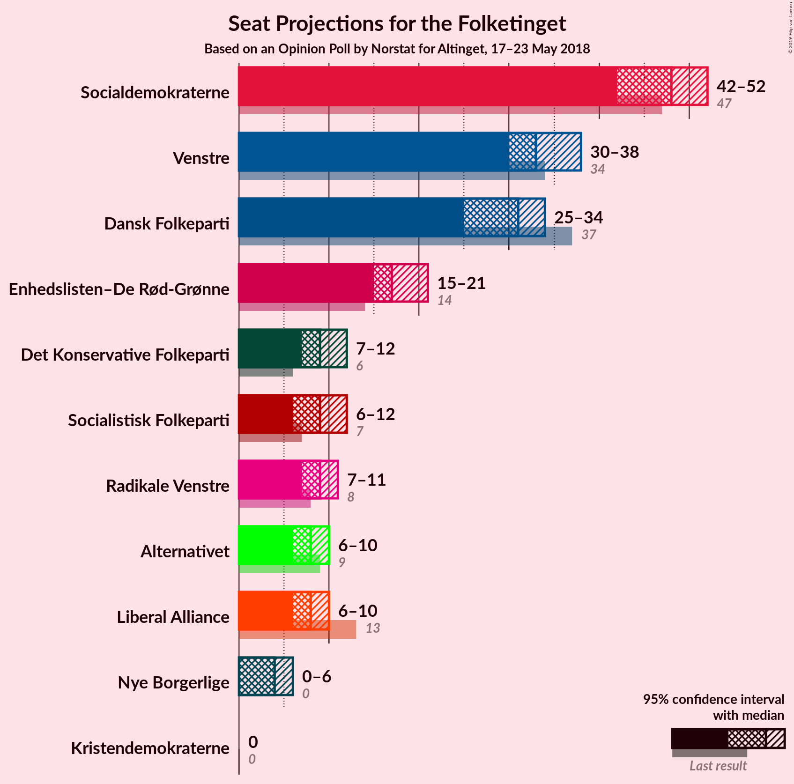
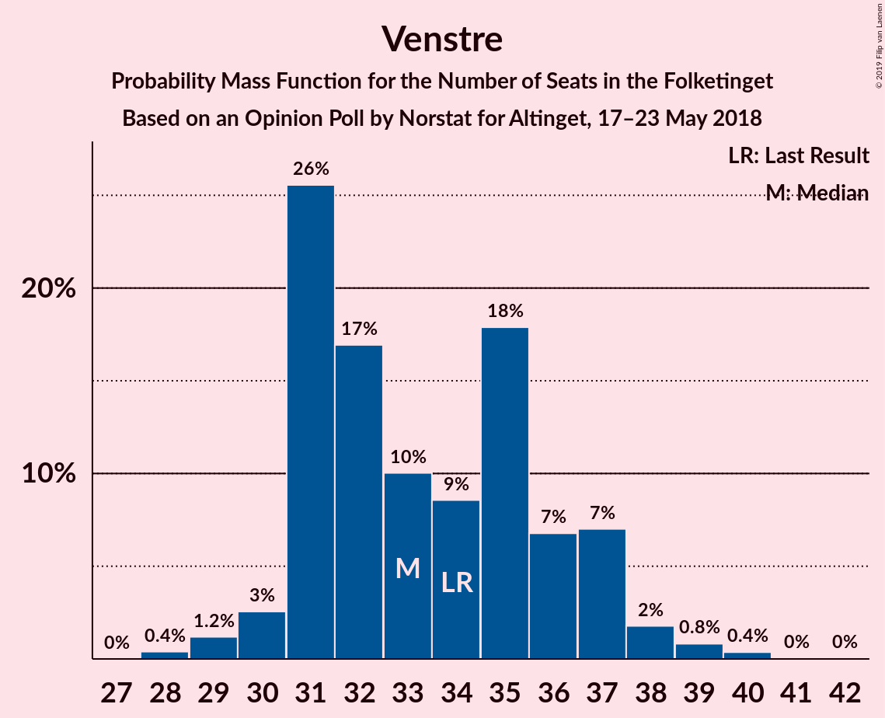
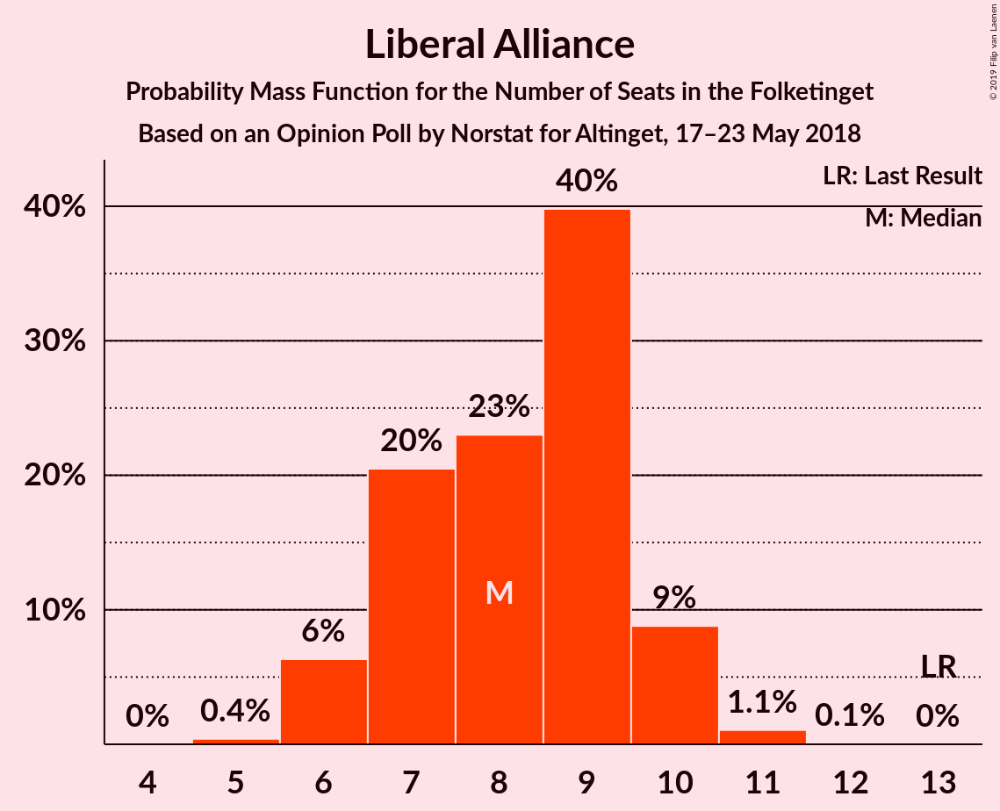
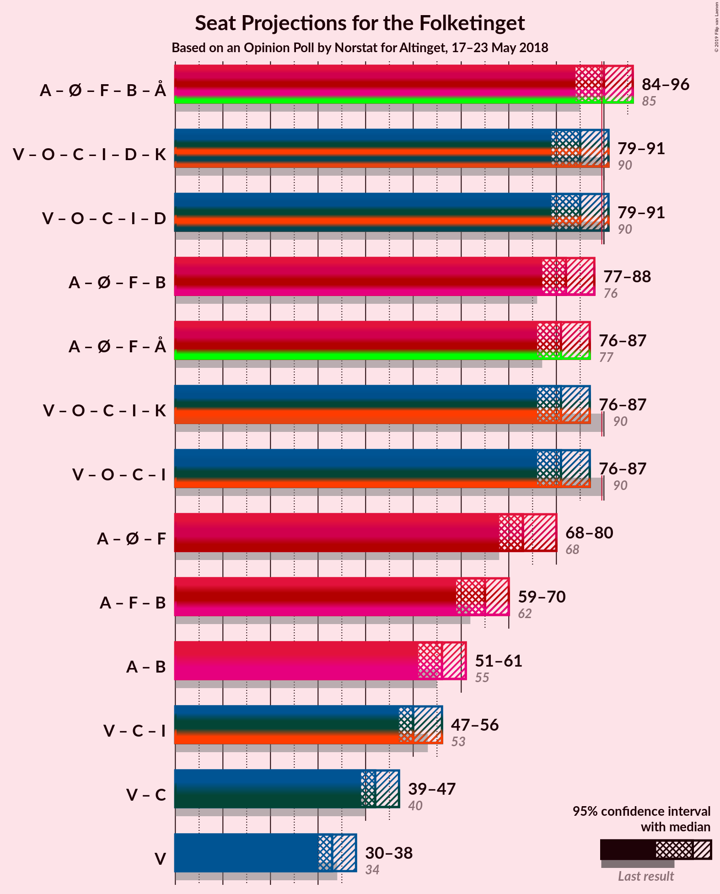

# Opinion Poll by Norstat for Altinget, 17–23 May 2018

<a href="#voting-intentions">Voting Intentions</a> | <a href="#seats">Seats</a> | <a href="#coalitions">Coalitions</a> | <a href="#technical-information">Technical Information</a>

## Voting Intentions

### Confidence Intervals

| Party | Last Result | Poll Result | 80% Confidence Interval | 90% Confidence Interval | 95% Confidence Interval | 99% Confidence Interval |
|:-----:|:-----------:|:-----------:|:-----------------------:|:-----------------------:|:-----------------------:|:-----------------------:|
| Socialdemokraterne | 26.3% | 26.9% | 25.3–28.5% |24.8–29.0% |24.4–29.4% |23.7–30.3% |
| Venstre | 19.5% | 19.2% | 17.8–20.7% |17.4–21.1% |17.1–21.5% |16.4–22.2% |
| Dansk Folkeparti | 21.1% | 17.0% | 15.7–18.5% |15.3–18.9% |15.0–19.3% |14.4–20.0% |
| Enhedslisten–De Rød-Grønne | 7.8% | 9.9% | 8.9–11.1% |8.6–11.4% |8.4–11.7% |7.9–12.3% |
| Det Konservative Folkeparti | 3.4% | 5.2% | 4.5–6.1% |4.3–6.4% |4.1–6.6% |3.8–7.1% |
| Socialistisk Folkeparti | 4.2% | 4.9% | 4.2–5.8% |4.0–6.0% |3.8–6.2% |3.5–6.7% |
| Radikale Venstre | 4.6% | 4.7% | 4.0–5.6% |3.8–5.8% |3.6–6.1% |3.3–6.5% |
| Liberal Alliance | 7.5% | 4.5% | 3.8–5.3% |3.6–5.6% |3.4–5.8% |3.1–6.2% |
| Alternativet | 4.8% | 4.1% | 3.5–5.0% |3.3–5.2% |3.1–5.4% |2.9–5.8% |
| Nye Borgerlige | 0.0% | 2.3% | 1.8–3.0% |1.7–3.2% |1.6–3.3% |1.4–3.7% |
| Kristendemokraterne | 0.8% | 0.9% | 0.6–1.4% |0.6–1.5% |0.5–1.6% |0.4–1.9% |

*Note:* The poll result column reflects the actual value used in the calculations. Published results may vary slightly, and in addition be rounded to fewer digits.

## Seats

### Confidence Intervals

| Party | Last Result | Median | 80% Confidence Interval | 90% Confidence Interval | 95% Confidence Interval | 99% Confidence Interval |
|:-----:|:-----------:|:------:|:-----------------------:|:-----------------------:|:-----------------------:|:-----------------------:|
| <a href="#socialdemokraterne">Socialdemokraterne</a> | 47 | 47 | 47–55 |47–55 |43–55 |43–55 |
| <a href="#venstre">Venstre</a> | 34 | 30 | 30–37 |30–37 |30–37 |30–37 |
| <a href="#dansk-folkeparti">Dansk Folkeparti</a> | 37 | 32 | 27–35 |27–35 |27–35 |27–35 |
| <a href="#enhedslisten–de-rød-grønne">Enhedslisten–De Rød-Grønne</a> | 14 | 17 | 15–18 |15–18 |15–18 |14–18 |
| <a href="#det-konservative-folkeparti">Det Konservative Folkeparti</a> | 6 | 14 | 6–14 |6–14 |6–14 |6–14 |
| <a href="#socialistisk-folkeparti">Socialistisk Folkeparti</a> | 7 | 7 | 5–11 |5–11 |5–11 |5–11 |
| <a href="#radikale-venstre">Radikale Venstre</a> | 8 | 8 | 8–10 |8–10 |8–14 |7–14 |
| <a href="#liberal-alliance">Liberal Alliance</a> | 13 | 9 | 7–9 |7–9 |7–9 |7–10 |
| <a href="#alternativet">Alternativet</a> | 9 | 6 | 6–7 |6–7 |6–7 |6–10 |
| <a href="#nye-borgerlige">Nye Borgerlige</a> | 0 | 5 | 0–5 |0–5 |0–5 |0–5 |
| <a href="#kristendemokraterne">Kristendemokraterne</a> | 0 | 0 | 0 |0 |0 |0 |

### Socialdemokraterne

*For a full overview of the results for this party, see the [Socialdemokraterne](party-socialdemokraterne.html) page.*

| Number of Seats | Probability | Accumulated | Special Marks |
|:---------------:|:-----------:|:-----------:|:-------------:|
| 40 | 0.1% | 100% |  |
| 41 | 0% | 99.9% |  |
| 42 | 0% | 99.8% |  |
| 43 | 4% | 99.8% |  |
| 44 | 0% | 96% |  |
| 45 | 0% | 96% |  |
| 46 | 0.1% | 96% |  |
| 47 | 69% | 96% | Last Result, Median |
| 48 | 1.1% | 27% |  |
| 49 | 0.3% | 25% |  |
| 50 | 13% | 25% |  |
| 51 | 0% | 13% |  |
| 52 | 0.3% | 13% |  |
| 53 | 0% | 12% |  |
| 54 | 0% | 12% |  |
| 55 | 12% | 12% |  |
| 56 | 0% | 0% |  |

### Venstre

*For a full overview of the results for this party, see the [Venstre](party-venstre.html) page.*

| Number of Seats | Probability | Accumulated | Special Marks |
|:---------------:|:-----------:|:-----------:|:-------------:|
| 29 | 0% | 100% |  |
| 30 | 69% | 99.9% | Median |
| 31 | 13% | 31% |  |
| 32 | 4% | 18% |  |
| 33 | 0% | 13% |  |
| 34 | 0.9% | 13% | Last Result |
| 35 | 0% | 13% |  |
| 36 | 0.1% | 13% |  |
| 37 | 12% | 13% |  |
| 38 | 0% | 0.2% |  |
| 39 | 0.1% | 0.2% |  |
| 40 | 0% | 0.1% |  |
| 41 | 0% | 0.1% |  |
| 42 | 0% | 0.1% |  |
| 43 | 0.1% | 0.1% |  |
| 44 | 0% | 0% |  |

### Dansk Folkeparti

*For a full overview of the results for this party, see the [Dansk Folkeparti](party-danskfolkeparti.html) page.*

| Number of Seats | Probability | Accumulated | Special Marks |
|:---------------:|:-----------:|:-----------:|:-------------:|
| 25 | 0.2% | 100% |  |
| 26 | 0.1% | 99.8% |  |
| 27 | 12% | 99.7% |  |
| 28 | 0.5% | 87% |  |
| 29 | 0% | 87% |  |
| 30 | 0.3% | 87% |  |
| 31 | 0% | 87% |  |
| 32 | 70% | 87% | Median |
| 33 | 0.1% | 17% |  |
| 34 | 0.3% | 17% |  |
| 35 | 16% | 16% |  |
| 36 | 0% | 0.1% |  |
| 37 | 0% | 0.1% | Last Result |
| 38 | 0.1% | 0.1% |  |
| 39 | 0% | 0% |  |

### Enhedslisten–De Rød-Grønne

*For a full overview of the results for this party, see the [Enhedslisten–De Rød-Grønne](party-enhedslisten–derød-grønne.html) page.*

| Number of Seats | Probability | Accumulated | Special Marks |
|:---------------:|:-----------:|:-----------:|:-------------:|
| 14 | 0.7% | 100% | Last Result |
| 15 | 16% | 99.3% |  |
| 16 | 0.1% | 83% |  |
| 17 | 70% | 83% | Median |
| 18 | 12% | 13% |  |
| 19 | 0.1% | 0.3% |  |
| 20 | 0% | 0.2% |  |
| 21 | 0% | 0.2% |  |
| 22 | 0% | 0.2% |  |
| 23 | 0.1% | 0.1% |  |
| 24 | 0% | 0% |  |

### Det Konservative Folkeparti

*For a full overview of the results for this party, see the [Det Konservative Folkeparti](party-detkonservativefolkeparti.html) page.*

| Number of Seats | Probability | Accumulated | Special Marks |
|:---------------:|:-----------:|:-----------:|:-------------:|
| 6 | 12% | 100% | Last Result |
| 7 | 0% | 88% |  |
| 8 | 0.2% | 88% |  |
| 9 | 17% | 87% |  |
| 10 | 0.1% | 71% |  |
| 11 | 0.4% | 71% |  |
| 12 | 0.4% | 70% |  |
| 13 | 0.8% | 70% |  |
| 14 | 69% | 69% | Median |
| 15 | 0% | 0% |  |

### Socialistisk Folkeparti

*For a full overview of the results for this party, see the [Socialistisk Folkeparti](party-socialistiskfolkeparti.html) page.*

| Number of Seats | Probability | Accumulated | Special Marks |
|:---------------:|:-----------:|:-----------:|:-------------:|
| 5 | 13% | 100% |  |
| 6 | 0.2% | 87% |  |
| 7 | 70% | 87% | Last Result, Median |
| 8 | 0.2% | 17% |  |
| 9 | 4% | 17% |  |
| 10 | 0% | 13% |  |
| 11 | 12% | 13% |  |
| 12 | 0.3% | 0.4% |  |
| 13 | 0% | 0.1% |  |
| 14 | 0% | 0.1% |  |
| 15 | 0.1% | 0.1% |  |
| 16 | 0% | 0% |  |

### Radikale Venstre

*For a full overview of the results for this party, see the [Radikale Venstre](party-radikalevenstre.html) page.*

| Number of Seats | Probability | Accumulated | Special Marks |
|:---------------:|:-----------:|:-----------:|:-------------:|
| 6 | 0.2% | 100% |  |
| 7 | 0.5% | 99.8% |  |
| 8 | 82% | 99.3% | Last Result, Median |
| 9 | 0.8% | 18% |  |
| 10 | 12% | 17% |  |
| 11 | 0.2% | 5% |  |
| 12 | 0.3% | 4% |  |
| 13 | 0.3% | 4% |  |
| 14 | 4% | 4% |  |
| 15 | 0% | 0% |  |

### Liberal Alliance

*For a full overview of the results for this party, see the [Liberal Alliance](party-liberalalliance.html) page.*

| Number of Seats | Probability | Accumulated | Special Marks |
|:---------------:|:-----------:|:-----------:|:-------------:|
| 6 | 0.3% | 100% |  |
| 7 | 13% | 99.6% |  |
| 8 | 16% | 86% |  |
| 9 | 69% | 70% | Median |
| 10 | 0.4% | 0.5% |  |
| 11 | 0.1% | 0.2% |  |
| 12 | 0% | 0.1% |  |
| 13 | 0% | 0% | Last Result |

### Alternativet

*For a full overview of the results for this party, see the [Alternativet](party-alternativet.html) page.*

| Number of Seats | Probability | Accumulated | Special Marks |
|:---------------:|:-----------:|:-----------:|:-------------:|
| 6 | 86% | 100% | Median |
| 7 | 12% | 14% |  |
| 8 | 1.0% | 2% |  |
| 9 | 0% | 1.0% | Last Result |
| 10 | 0.8% | 0.9% |  |
| 11 | 0.1% | 0.1% |  |
| 12 | 0% | 0% |  |

### Nye Borgerlige

*For a full overview of the results for this party, see the [Nye Borgerlige](party-nyeborgerlige.html) page.*

| Number of Seats | Probability | Accumulated | Special Marks |
|:---------------:|:-----------:|:-----------:|:-------------:|
| 0 | 14% | 100% | Last Result |
| 1 | 0% | 86% |  |
| 2 | 0% | 86% |  |
| 3 | 0% | 86% |  |
| 4 | 4% | 86% |  |
| 5 | 82% | 82% | Median |
| 6 | 0.1% | 0.3% |  |
| 7 | 0.1% | 0.2% |  |
| 8 | 0% | 0.2% |  |
| 9 | 0.2% | 0.2% |  |
| 10 | 0% | 0% |  |

### Kristendemokraterne

*For a full overview of the results for this party, see the [Kristendemokraterne](party-kristendemokraterne.html) page.*

| Number of Seats | Probability | Accumulated | Special Marks |
|:---------------:|:-----------:|:-----------:|:-------------:|
| 0 | 100% | 100% | Last Result, Median |

## Coalitions

### Confidence Intervals

| Coalition | Last Result | Median | Majority? | 80% Confidence Interval | 90% Confidence Interval | 95% Confidence Interval | 99% Confidence Interval |
|:---------:|:-----------:|:------:|:---------:|:-----------------------:|:-----------------------:|:-----------------------:|:-----------------------:|
| Socialdemokraterne – Enhedslisten–De Rød-Grønne – Socialistisk Folkeparti – Radikale Venstre – Alternativet | 85 | 85 | 13% | 85–98 | 85–98 | 85–98 | 85–98 |
| Socialdemokraterne – Enhedslisten–De Rød-Grønne – Socialistisk Folkeparti – Radikale Venstre | 76 | 79 | 12% | 79–92 | 79–92 | 79–92 | 79–92 |
| Venstre – Dansk Folkeparti – Det Konservative Folkeparti – Liberal Alliance – Nye Borgerlige – Kristendemokraterne | 90 | 90 | 69% | 77–90 | 77–90 | 77–90 | 77–90 |
| Venstre – Dansk Folkeparti – Det Konservative Folkeparti – Liberal Alliance – Nye Borgerlige | 90 | 90 | 69% | 77–90 | 77–90 | 77–90 | 77–90 |
| Venstre – Dansk Folkeparti – Det Konservative Folkeparti – Liberal Alliance – Kristendemokraterne | 90 | 85 | 0.1% | 72–88 | 72–88 | 72–88 | 72–88 |
| Venstre – Dansk Folkeparti – Det Konservative Folkeparti – Liberal Alliance | 90 | 85 | 0.1% | 72–88 | 72–88 | 72–88 | 72–88 |

### Socialdemokraterne – Enhedslisten–De Rød-Grønne – Socialistisk Folkeparti – Radikale Venstre – Alternativet

| Number of Seats | Probability | Accumulated | Special Marks |
|:---------------:|:-----------:|:-----------:|:-------------:|
| 79 | 0.1% | 100% |  |
| 80 | 0% | 99.9% |  |
| 81 | 0% | 99.9% |  |
| 82 | 0% | 99.9% |  |
| 83 | 0% | 99.9% |  |
| 84 | 0.1% | 99.9% |  |
| 85 | 69% | 99.8% | Last Result, Median |
| 86 | 0% | 31% |  |
| 87 | 16% | 31% |  |
| 88 | 0% | 14% |  |
| 89 | 1.2% | 14% |  |
| 90 | 0% | 13% | Majority |
| 91 | 0% | 13% |  |
| 92 | 0% | 13% |  |
| 93 | 0% | 13% |  |
| 94 | 0.3% | 13% |  |
| 95 | 0% | 13% |  |
| 96 | 0.2% | 13% |  |
| 97 | 0.4% | 13% |  |
| 98 | 12% | 12% |  |
| 99 | 0% | 0% |  |

### Socialdemokraterne – Enhedslisten–De Rød-Grønne – Socialistisk Folkeparti – Radikale Venstre

| Number of Seats | Probability | Accumulated | Special Marks |
|:---------------:|:-----------:|:-----------:|:-------------:|
| 72 | 0.1% | 100% |  |
| 73 | 0% | 99.9% |  |
| 74 | 0% | 99.9% |  |
| 75 | 0% | 99.8% |  |
| 76 | 0.1% | 99.8% | Last Result |
| 77 | 0.1% | 99.8% |  |
| 78 | 0% | 99.7% |  |
| 79 | 70% | 99.7% | Median |
| 80 | 12% | 30% |  |
| 81 | 5% | 18% |  |
| 82 | 0% | 13% |  |
| 83 | 0% | 13% |  |
| 84 | 0% | 13% |  |
| 85 | 0% | 13% |  |
| 86 | 0.2% | 13% |  |
| 87 | 0.3% | 13% |  |
| 88 | 0.3% | 13% |  |
| 89 | 0% | 12% |  |
| 90 | 0% | 12% | Majority |
| 91 | 0% | 12% |  |
| 92 | 12% | 12% |  |
| 93 | 0% | 0% |  |

### Venstre – Dansk Folkeparti – Det Konservative Folkeparti – Liberal Alliance – Nye Borgerlige – Kristendemokraterne

| Number of Seats | Probability | Accumulated | Special Marks |
|:---------------:|:-----------:|:-----------:|:-------------:|
| 77 | 12% | 100% |  |
| 78 | 0.4% | 88% |  |
| 79 | 0.2% | 87% |  |
| 80 | 0% | 87% |  |
| 81 | 0.3% | 87% |  |
| 82 | 0% | 87% |  |
| 83 | 0% | 87% |  |
| 84 | 0% | 87% |  |
| 85 | 0% | 87% |  |
| 86 | 1.2% | 87% |  |
| 87 | 0% | 86% |  |
| 88 | 16% | 86% |  |
| 89 | 0% | 69% |  |
| 90 | 69% | 69% | Last Result, Median, Majority |
| 91 | 0.1% | 0.2% |  |
| 92 | 0% | 0.1% |  |
| 93 | 0% | 0.1% |  |
| 94 | 0% | 0.1% |  |
| 95 | 0% | 0.1% |  |
| 96 | 0.1% | 0.1% |  |
| 97 | 0% | 0% |  |

### Venstre – Dansk Folkeparti – Det Konservative Folkeparti – Liberal Alliance – Nye Borgerlige

| Number of Seats | Probability | Accumulated | Special Marks |
|:---------------:|:-----------:|:-----------:|:-------------:|
| 77 | 12% | 100% |  |
| 78 | 0.4% | 88% |  |
| 79 | 0.2% | 87% |  |
| 80 | 0% | 87% |  |
| 81 | 0.3% | 87% |  |
| 82 | 0% | 87% |  |
| 83 | 0% | 87% |  |
| 84 | 0% | 87% |  |
| 85 | 0% | 87% |  |
| 86 | 1.2% | 87% |  |
| 87 | 0% | 86% |  |
| 88 | 16% | 86% |  |
| 89 | 0% | 69% |  |
| 90 | 69% | 69% | Last Result, Median, Majority |
| 91 | 0.1% | 0.2% |  |
| 92 | 0% | 0.1% |  |
| 93 | 0% | 0.1% |  |
| 94 | 0% | 0.1% |  |
| 95 | 0% | 0.1% |  |
| 96 | 0.1% | 0.1% |  |
| 97 | 0% | 0% |  |

### Venstre – Dansk Folkeparti – Det Konservative Folkeparti – Liberal Alliance – Kristendemokraterne

| Number of Seats | Probability | Accumulated | Special Marks |
|:---------------:|:-----------:|:-----------:|:-------------:|
| 72 | 12% | 100% |  |
| 73 | 0% | 88% |  |
| 74 | 0.2% | 88% |  |
| 75 | 0% | 88% |  |
| 76 | 0% | 88% |  |
| 77 | 0.4% | 88% |  |
| 78 | 0.3% | 87% |  |
| 79 | 0% | 87% |  |
| 80 | 0.1% | 87% |  |
| 81 | 0% | 87% |  |
| 82 | 0% | 87% |  |
| 83 | 0% | 87% |  |
| 84 | 4% | 87% |  |
| 85 | 69% | 83% | Median |
| 86 | 1.0% | 14% |  |
| 87 | 0% | 13% |  |
| 88 | 12% | 12% |  |
| 89 | 0% | 0.1% |  |
| 90 | 0% | 0.1% | Last Result, Majority |
| 91 | 0% | 0.1% |  |
| 92 | 0.1% | 0.1% |  |
| 93 | 0% | 0% |  |

### Venstre – Dansk Folkeparti – Det Konservative Folkeparti – Liberal Alliance

| Number of Seats | Probability | Accumulated | Special Marks |
|:---------------:|:-----------:|:-----------:|:-------------:|
| 72 | 12% | 100% |  |
| 73 | 0% | 88% |  |
| 74 | 0.2% | 88% |  |
| 75 | 0% | 88% |  |
| 76 | 0% | 88% |  |
| 77 | 0.4% | 88% |  |
| 78 | 0.3% | 87% |  |
| 79 | 0% | 87% |  |
| 80 | 0.1% | 87% |  |
| 81 | 0% | 87% |  |
| 82 | 0% | 87% |  |
| 83 | 0% | 87% |  |
| 84 | 4% | 87% |  |
| 85 | 69% | 83% | Median |
| 86 | 1.0% | 14% |  |
| 87 | 0% | 13% |  |
| 88 | 12% | 12% |  |
| 89 | 0% | 0.1% |  |
| 90 | 0% | 0.1% | Last Result, Majority |
| 91 | 0% | 0.1% |  |
| 92 | 0.1% | 0.1% |  |
| 93 | 0% | 0% |  |

## Technical Information

### Opinion Poll

+ **Polling firm:** Norstat
+ **Commissioner(s):** Altinget
+ **Fieldwork period:** 17–23 May 2018

### Calculations

+ **Sample size:** 1210
+ **Simulations done:** 1,024
+ **Error estimate:** 3.61%

