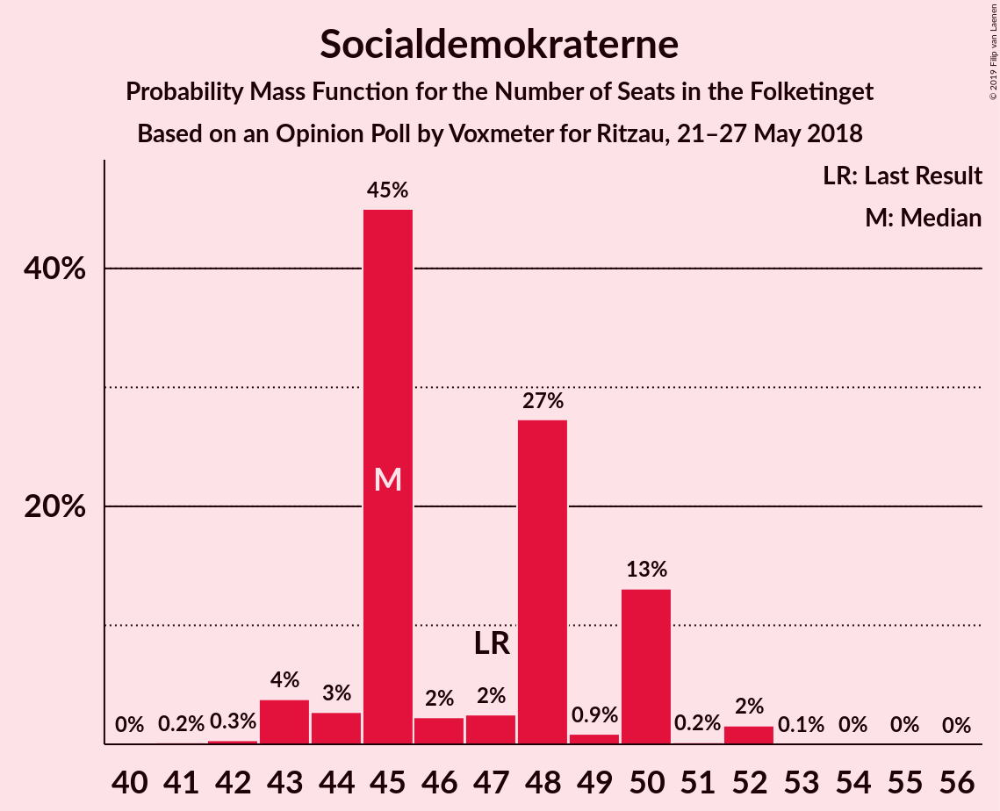
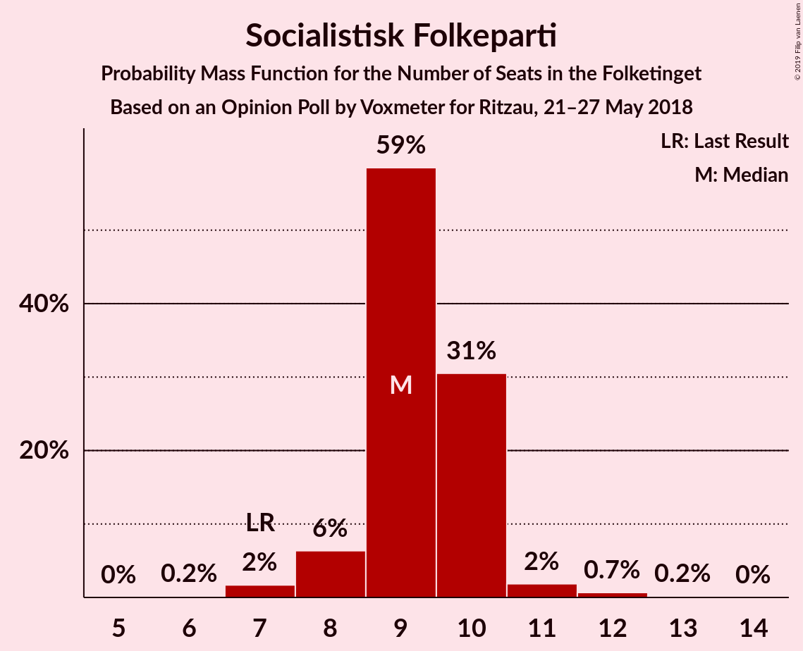

# Opinion Poll by Voxmeter for Ritzau, 21–27 May 2018

<a href="#voting-intentions">Voting Intentions</a> | <a href="#seats">Seats</a> | <a href="#coalitions">Coalitions</a> | <a href="#technical-information">Technical Information</a>

## Voting Intentions

### Confidence Intervals

| Party | Last Result | Poll Result | 80% Confidence Interval | 90% Confidence Interval | 95% Confidence Interval | 99% Confidence Interval |
|:-----:|:-----------:|:-----------:|:-----------------------:|:-----------------------:|:-----------------------:|:-----------------------:|
| Socialdemokraterne | 26.3% | 26.2% | 24.5–28.0% |24.0–28.5% |23.6–29.0% |22.8–29.8% |
| Venstre | 19.5% | 20.8% | 19.2–22.5% |18.8–23.0% |18.4–23.4% |17.7–24.2% |
| Dansk Folkeparti | 21.1% | 18.8% | 17.3–20.5% |16.9–21.0% |16.6–21.4% |15.9–22.2% |
| Enhedslisten–De Rød-Grønne | 7.8% | 9.8% | 8.7–11.1% |8.4–11.4% |8.1–11.8% |7.6–12.4% |
| Radikale Venstre | 4.6% | 5.3% | 4.5–6.3% |4.3–6.6% |4.1–6.8% |3.7–7.3% |
| Socialistisk Folkeparti | 4.2% | 5.2% | 4.4–6.2% |4.2–6.5% |4.0–6.7% |3.6–7.2% |
| Det Konservative Folkeparti | 3.4% | 4.3% | 3.6–5.2% |3.4–5.5% |3.2–5.7% |2.9–6.2% |
| Liberal Alliance | 7.5% | 4.2% | 3.5–5.1% |3.3–5.4% |3.1–5.6% |2.8–6.1% |
| Alternativet | 4.8% | 3.2% | 2.6–4.1% |2.4–4.3% |2.3–4.5% |2.0–4.9% |
| Kristendemokraterne | 0.8% | 1.1% | 0.8–1.6% |0.7–1.8% |0.6–1.9% |0.5–2.2% |
| Nye Borgerlige | 0.0% | 1.0% | 0.7–1.5% |0.6–1.7% |0.5–1.8% |0.4–2.1% |

*Note:* The poll result column reflects the actual value used in the calculations. Published results may vary slightly, and in addition be rounded to fewer digits.

## Seats

### Confidence Intervals

| Party | Last Result | Median | 80% Confidence Interval | 90% Confidence Interval | 95% Confidence Interval | 99% Confidence Interval |
|:-----:|:-----------:|:------:|:-----------------------:|:-----------------------:|:-----------------------:|:-----------------------:|
| <a href="#socialdemokraterne">Socialdemokraterne</a> | 47 | 42 | 42–50 |42–50 |42–50 |38–50 |
| <a href="#venstre">Venstre</a> | 34 | 38 | 36–38 |36–38 |36–38 |36–43 |
| <a href="#dansk-folkeparti">Dansk Folkeparti</a> | 37 | 32 | 30–32 |30–32 |30–32 |30–33 |
| <a href="#enhedslisten–de-rød-grønne">Enhedslisten–De Rød-Grønne</a> | 14 | 18 | 17–18 |17–18 |17–18 |17–22 |
| <a href="#radikale-venstre">Radikale Venstre</a> | 8 | 10 | 7–10 |7–10 |7–10 |7–11 |
| <a href="#socialistisk-folkeparti">Socialistisk Folkeparti</a> | 7 | 7 | 7–8 |7–8 |7–8 |7–10 |
| <a href="#det-konservative-folkeparti">Det Konservative Folkeparti</a> | 6 | 6 | 6 |6 |6 |6–8 |
| <a href="#liberal-alliance">Liberal Alliance</a> | 13 | 9 | 9–11 |9–11 |9–11 |6–11 |
| <a href="#alternativet">Alternativet</a> | 9 | 5 | 5–6 |5–6 |5–6 |5–8 |
| <a href="#kristendemokraterne">Kristendemokraterne</a> | 0 | 4 | 4 |4 |4 |0–4 |
| <a href="#nye-borgerlige">Nye Borgerlige</a> | 0 | 4 | 0–4 |0–4 |0–4 |0–4 |

### Socialdemokraterne

*For a full overview of the results for this party, see the [Socialdemokraterne](party-socialdemokraterne.html) page.*

| Number of Seats | Probability | Accumulated | Special Marks |
|:---------------:|:-----------:|:-----------:|:-------------:|
| 38 | 0.9% | 100% |  |
| 39 | 0% | 99.1% |  |
| 40 | 0% | 99.0% |  |
| 41 | 0% | 99.0% |  |
| 42 | 78% | 99.0% | Median |
| 43 | 0.3% | 21% |  |
| 44 | 0% | 20% |  |
| 45 | 0% | 20% |  |
| 46 | 0% | 20% |  |
| 47 | 0% | 20% | Last Result |
| 48 | 0.3% | 20% |  |
| 49 | 0% | 20% |  |
| 50 | 20% | 20% |  |
| 51 | 0% | 0% |  |

### Venstre

*For a full overview of the results for this party, see the [Venstre](party-venstre.html) page.*

| Number of Seats | Probability | Accumulated | Special Marks |
|:---------------:|:-----------:|:-----------:|:-------------:|
| 30 | 0% | 100% |  |
| 31 | 0.1% | 99.9% |  |
| 32 | 0% | 99.9% |  |
| 33 | 0% | 99.8% |  |
| 34 | 0% | 99.8% | Last Result |
| 35 | 0% | 99.8% |  |
| 36 | 20% | 99.8% |  |
| 37 | 0% | 80% |  |
| 38 | 78% | 80% | Median |
| 39 | 0% | 2% |  |
| 40 | 0% | 2% |  |
| 41 | 0.3% | 2% |  |
| 42 | 0.3% | 1.3% |  |
| 43 | 0.9% | 0.9% |  |
| 44 | 0% | 0% |  |

### Dansk Folkeparti

*For a full overview of the results for this party, see the [Dansk Folkeparti](party-danskfolkeparti.html) page.*

| Number of Seats | Probability | Accumulated | Special Marks |
|:---------------:|:-----------:|:-----------:|:-------------:|
| 25 | 0.4% | 100% |  |
| 26 | 0% | 99.6% |  |
| 27 | 0% | 99.6% |  |
| 28 | 0% | 99.6% |  |
| 29 | 0% | 99.6% |  |
| 30 | 20% | 99.5% |  |
| 31 | 0.3% | 80% |  |
| 32 | 78% | 80% | Median |
| 33 | 1.0% | 1.3% |  |
| 34 | 0% | 0.3% |  |
| 35 | 0% | 0.3% |  |
| 36 | 0% | 0.3% |  |
| 37 | 0% | 0.3% | Last Result |
| 38 | 0.3% | 0.3% |  |
| 39 | 0% | 0.1% |  |
| 40 | 0% | 0% |  |

### Enhedslisten–De Rød-Grønne

*For a full overview of the results for this party, see the [Enhedslisten–De Rød-Grønne](party-enhedslisten–derød-grønne.html) page.*

| Number of Seats | Probability | Accumulated | Special Marks |
|:---------------:|:-----------:|:-----------:|:-------------:|
| 14 | 0.3% | 100% | Last Result |
| 15 | 0% | 99.7% |  |
| 16 | 0% | 99.7% |  |
| 17 | 20% | 99.6% |  |
| 18 | 79% | 80% | Median |
| 19 | 0% | 1.1% |  |
| 20 | 0.1% | 1.1% |  |
| 21 | 0.1% | 1.0% |  |
| 22 | 1.0% | 1.0% |  |
| 23 | 0% | 0% |  |

### Radikale Venstre

*For a full overview of the results for this party, see the [Radikale Venstre](party-radikalevenstre.html) page.*

| Number of Seats | Probability | Accumulated | Special Marks |
|:---------------:|:-----------:|:-----------:|:-------------:|
| 7 | 21% | 100% |  |
| 8 | 0% | 79% | Last Result |
| 9 | 0% | 79% |  |
| 10 | 78% | 79% | Median |
| 11 | 0.8% | 1.2% |  |
| 12 | 0.3% | 0.3% |  |
| 13 | 0% | 0.1% |  |
| 14 | 0% | 0.1% |  |
| 15 | 0% | 0% |  |

### Socialistisk Folkeparti

*For a full overview of the results for this party, see the [Socialistisk Folkeparti](party-socialistiskfolkeparti.html) page.*

| Number of Seats | Probability | Accumulated | Special Marks |
|:---------------:|:-----------:|:-----------:|:-------------:|
| 5 | 0.3% | 100% |  |
| 6 | 0% | 99.7% |  |
| 7 | 78% | 99.7% | Last Result, Median |
| 8 | 20% | 21% |  |
| 9 | 0.4% | 2% |  |
| 10 | 1.3% | 1.5% |  |
| 11 | 0% | 0.1% |  |
| 12 | 0.1% | 0.1% |  |
| 13 | 0% | 0.1% |  |
| 14 | 0% | 0% |  |

### Det Konservative Folkeparti

*For a full overview of the results for this party, see the [Det Konservative Folkeparti](party-detkonservativefolkeparti.html) page.*

| Number of Seats | Probability | Accumulated | Special Marks |
|:---------------:|:-----------:|:-----------:|:-------------:|
| 5 | 0% | 100% |  |
| 6 | 98.5% | 99.9% | Last Result, Median |
| 7 | 0.4% | 1.4% |  |
| 8 | 0.9% | 1.1% |  |
| 9 | 0% | 0.1% |  |
| 10 | 0% | 0.1% |  |
| 11 | 0% | 0% |  |

### Liberal Alliance

*For a full overview of the results for this party, see the [Liberal Alliance](party-liberalalliance.html) page.*

| Number of Seats | Probability | Accumulated | Special Marks |
|:---------------:|:-----------:|:-----------:|:-------------:|
| 6 | 1.2% | 100% |  |
| 7 | 0.1% | 98.8% |  |
| 8 | 0% | 98.7% |  |
| 9 | 79% | 98.7% | Median |
| 10 | 0.5% | 20% |  |
| 11 | 20% | 20% |  |
| 12 | 0% | 0% |  |
| 13 | 0% | 0% | Last Result |

### Alternativet

*For a full overview of the results for this party, see the [Alternativet](party-alternativet.html) page.*

| Number of Seats | Probability | Accumulated | Special Marks |
|:---------------:|:-----------:|:-----------:|:-------------:|
| 4 | 0.4% | 100% |  |
| 5 | 78% | 99.6% | Median |
| 6 | 20% | 21% |  |
| 7 | 0% | 1.4% |  |
| 8 | 0.9% | 1.4% |  |
| 9 | 0.5% | 0.5% | Last Result |
| 10 | 0% | 0% |  |

### Kristendemokraterne

*For a full overview of the results for this party, see the [Kristendemokraterne](party-kristendemokraterne.html) page.*

| Number of Seats | Probability | Accumulated | Special Marks |
|:---------------:|:-----------:|:-----------:|:-------------:|
| 0 | 2% | 100% | Last Result |
| 1 | 0% | 98% |  |
| 2 | 0% | 98% |  |
| 3 | 0% | 98% |  |
| 4 | 98% | 98% | Median |
| 5 | 0% | 0% |  |

### Nye Borgerlige

*For a full overview of the results for this party, see the [Nye Borgerlige](party-nyeborgerlige.html) page.*

| Number of Seats | Probability | Accumulated | Special Marks |
|:---------------:|:-----------:|:-----------:|:-------------:|
| 0 | 22% | 100% | Last Result |
| 1 | 0% | 78% |  |
| 2 | 0% | 78% |  |
| 3 | 0% | 78% |  |
| 4 | 78% | 78% | Median |
| 5 | 0% | 0% |  |

## Coalitions

### Confidence Intervals

| Coalition | Last Result | Median | Majority? | 80% Confidence Interval | 90% Confidence Interval | 95% Confidence Interval | 99% Confidence Interval |
|:---------:|:-----------:|:------:|:---------:|:-----------------------:|:-----------------------:|:-----------------------:|:-----------------------:|
| Venstre – Dansk Folkeparti – Det Konservative Folkeparti – Liberal Alliance – Kristendemokraterne – Nye Borgerlige | 90 | 93 | 79% | 87–93 | 87–93 | 87–93 | 83–93 |
| Venstre – Dansk Folkeparti – Det Konservative Folkeparti – Liberal Alliance – Kristendemokraterne | 90 | 89 | 1.2% | 87–89 | 87–89 | 87–89 | 83–90 |
| Venstre – Dansk Folkeparti – Det Konservative Folkeparti – Liberal Alliance – Nye Borgerlige | 90 | 89 | 1.2% | 83–89 | 83–89 | 83–89 | 83–90 |
| Socialdemokraterne – Enhedslisten–De Rød-Grønne – Radikale Venstre – Socialistisk Folkeparti – Alternativet | 85 | 82 | 0.6% | 82–88 | 82–88 | 82–88 | 82–92 |
| Venstre – Dansk Folkeparti – Det Konservative Folkeparti – Liberal Alliance | 90 | 85 | 1.2% | 83–85 | 83–85 | 83–85 | 83–90 |
| Socialdemokraterne – Enhedslisten–De Rød-Grønne – Radikale Venstre – Socialistisk Folkeparti | 76 | 77 | 0% | 77–82 | 77–82 | 77–82 | 77–86 |

### Venstre – Dansk Folkeparti – Det Konservative Folkeparti – Liberal Alliance – Kristendemokraterne – Nye Borgerlige

| Number of Seats | Probability | Accumulated | Special Marks |
|:---------------:|:-----------:|:-----------:|:-------------:|
| 77 | 0.4% | 100% |  |
| 78 | 0% | 99.6% |  |
| 79 | 0% | 99.6% |  |
| 80 | 0% | 99.6% |  |
| 81 | 0% | 99.6% |  |
| 82 | 0% | 99.6% |  |
| 83 | 0.1% | 99.5% |  |
| 84 | 0.1% | 99.5% |  |
| 85 | 0% | 99.4% |  |
| 86 | 0% | 99.4% |  |
| 87 | 20% | 99.4% |  |
| 88 | 0% | 80% |  |
| 89 | 0.3% | 80% |  |
| 90 | 0.9% | 79% | Last Result, Majority |
| 91 | 0.3% | 79% |  |
| 92 | 0% | 78% |  |
| 93 | 78% | 78% | Median |
| 94 | 0% | 0% |  |

### Venstre – Dansk Folkeparti – Det Konservative Folkeparti – Liberal Alliance – Kristendemokraterne

| Number of Seats | Probability | Accumulated | Special Marks |
|:---------------:|:-----------:|:-----------:|:-------------:|
| 77 | 0.4% | 100% |  |
| 78 | 0% | 99.6% |  |
| 79 | 0% | 99.6% |  |
| 80 | 0% | 99.6% |  |
| 81 | 0% | 99.6% |  |
| 82 | 0% | 99.6% |  |
| 83 | 0.1% | 99.5% |  |
| 84 | 0.1% | 99.5% |  |
| 85 | 0% | 99.4% |  |
| 86 | 0% | 99.4% |  |
| 87 | 20% | 99.4% |  |
| 88 | 0% | 80% |  |
| 89 | 79% | 80% | Median |
| 90 | 0.9% | 1.2% | Last Result, Majority |
| 91 | 0.3% | 0.3% |  |
| 92 | 0% | 0% |  |

### Venstre – Dansk Folkeparti – Det Konservative Folkeparti – Liberal Alliance – Nye Borgerlige

| Number of Seats | Probability | Accumulated | Special Marks |
|:---------------:|:-----------:|:-----------:|:-------------:|
| 77 | 0.4% | 100% |  |
| 78 | 0% | 99.6% |  |
| 79 | 0% | 99.5% |  |
| 80 | 0% | 99.5% |  |
| 81 | 0% | 99.5% |  |
| 82 | 0% | 99.5% |  |
| 83 | 20% | 99.5% |  |
| 84 | 0.1% | 80% |  |
| 85 | 0% | 80% |  |
| 86 | 0% | 80% |  |
| 87 | 0% | 80% |  |
| 88 | 0% | 80% |  |
| 89 | 79% | 80% | Median |
| 90 | 0.9% | 1.2% | Last Result, Majority |
| 91 | 0.3% | 0.3% |  |
| 92 | 0% | 0% |  |

### Socialdemokraterne – Enhedslisten–De Rød-Grønne – Radikale Venstre – Socialistisk Folkeparti – Alternativet

| Number of Seats | Probability | Accumulated | Special Marks |
|:---------------:|:-----------:|:-----------:|:-------------:|
| 82 | 78% | 100% | Median |
| 83 | 0% | 22% |  |
| 84 | 0.3% | 22% |  |
| 85 | 0.9% | 21% | Last Result |
| 86 | 0.3% | 21% |  |
| 87 | 0% | 20% |  |
| 88 | 20% | 20% |  |
| 89 | 0% | 0.6% |  |
| 90 | 0% | 0.6% | Majority |
| 91 | 0.1% | 0.6% |  |
| 92 | 0.1% | 0.5% |  |
| 93 | 0% | 0.5% |  |
| 94 | 0% | 0.4% |  |
| 95 | 0% | 0.4% |  |
| 96 | 0% | 0.4% |  |
| 97 | 0% | 0.4% |  |
| 98 | 0.4% | 0.4% |  |
| 99 | 0% | 0% |  |

### Venstre – Dansk Folkeparti – Det Konservative Folkeparti – Liberal Alliance

| Number of Seats | Probability | Accumulated | Special Marks |
|:---------------:|:-----------:|:-----------:|:-------------:|
| 77 | 0.4% | 100% |  |
| 78 | 0% | 99.6% |  |
| 79 | 0% | 99.5% |  |
| 80 | 0% | 99.5% |  |
| 81 | 0% | 99.5% |  |
| 82 | 0% | 99.5% |  |
| 83 | 20% | 99.5% |  |
| 84 | 0.1% | 80% |  |
| 85 | 78% | 80% | Median |
| 86 | 0% | 2% |  |
| 87 | 0% | 2% |  |
| 88 | 0% | 2% |  |
| 89 | 0.3% | 2% |  |
| 90 | 0.9% | 1.2% | Last Result, Majority |
| 91 | 0.3% | 0.3% |  |
| 92 | 0% | 0% |  |

### Socialdemokraterne – Enhedslisten–De Rød-Grønne – Radikale Venstre – Socialistisk Folkeparti

| Number of Seats | Probability | Accumulated | Special Marks |
|:---------------:|:-----------:|:-----------:|:-------------:|
| 76 | 0% | 100% | Last Result |
| 77 | 79% | 100% | Median |
| 78 | 0.3% | 21% |  |
| 79 | 0% | 21% |  |
| 80 | 0% | 21% |  |
| 81 | 0% | 21% |  |
| 82 | 20% | 21% |  |
| 83 | 0% | 0.6% |  |
| 84 | 0% | 0.6% |  |
| 85 | 0% | 0.6% |  |
| 86 | 0.1% | 0.5% |  |
| 87 | 0% | 0.5% |  |
| 88 | 0% | 0.5% |  |
| 89 | 0.4% | 0.4% |  |
| 90 | 0% | 0% | Majority |

## Technical Information

### Opinion Poll

+ **Polling firm:** Voxmeter
+ **Commissioner(s):** Ritzau
+ **Fieldwork period:** 21–27 May 2018

### Calculations

+ **Sample size:** 1024
+ **Simulations done:** 1,024
+ **Error estimate:** 4.30%

