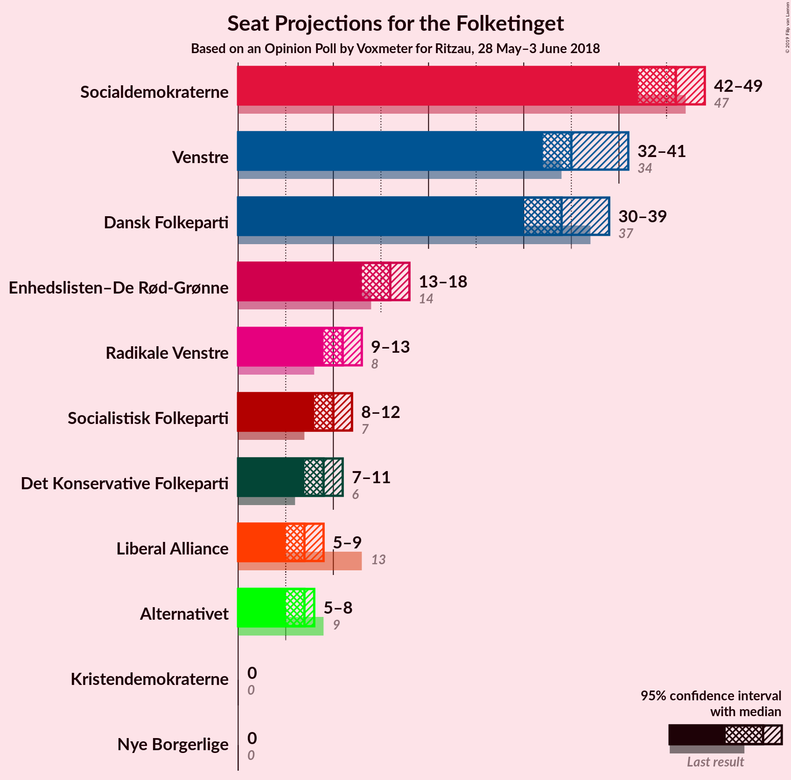
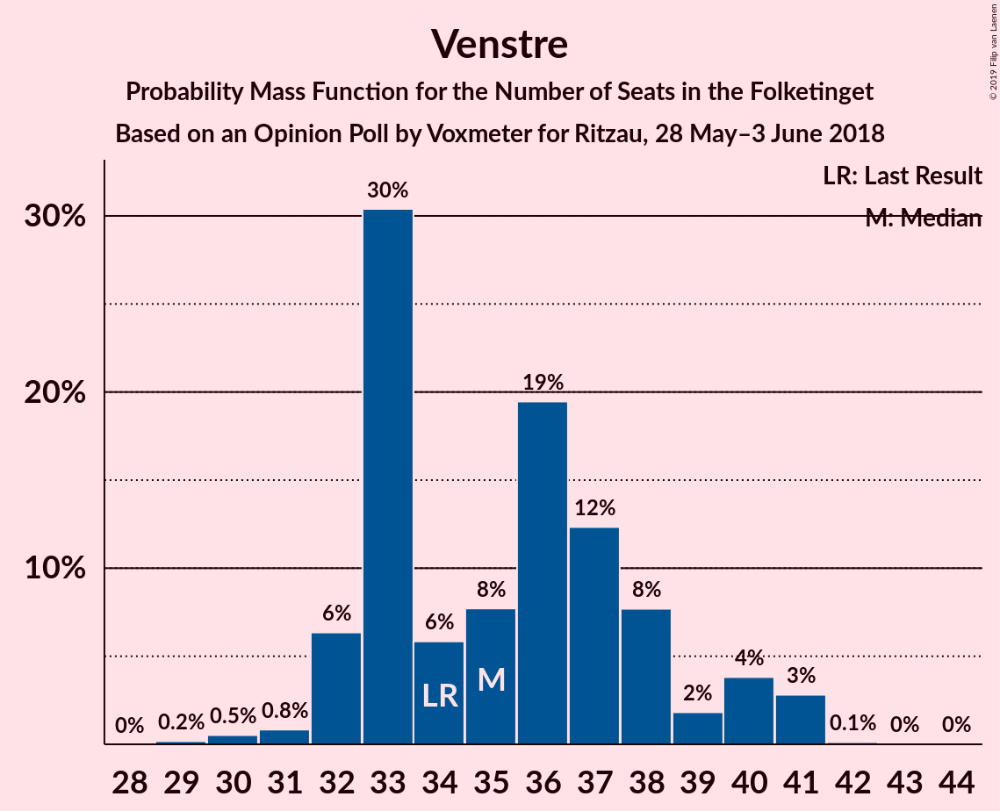
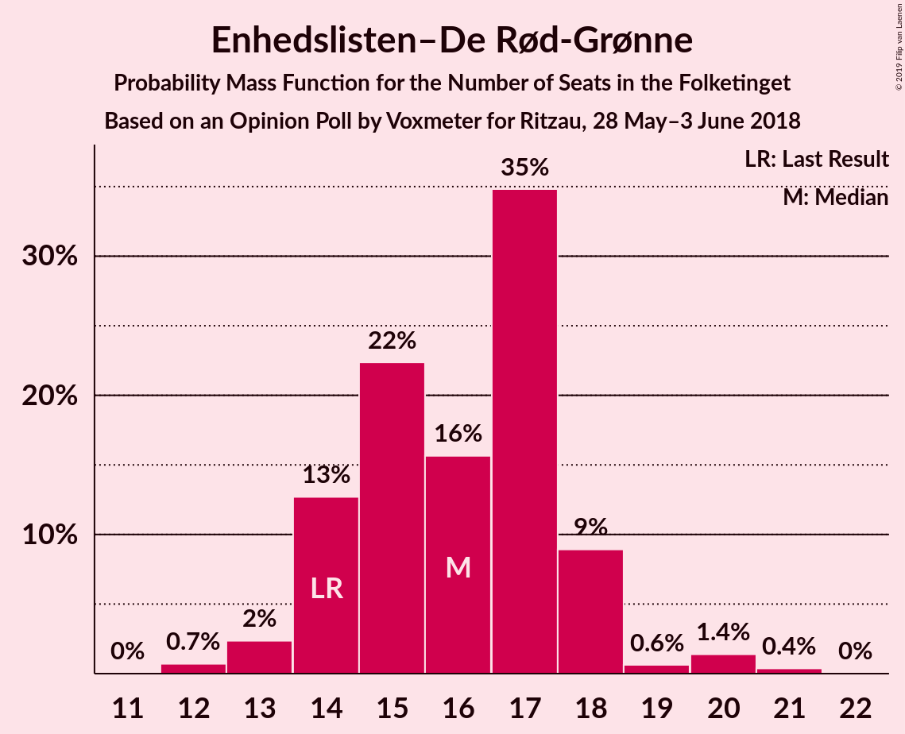
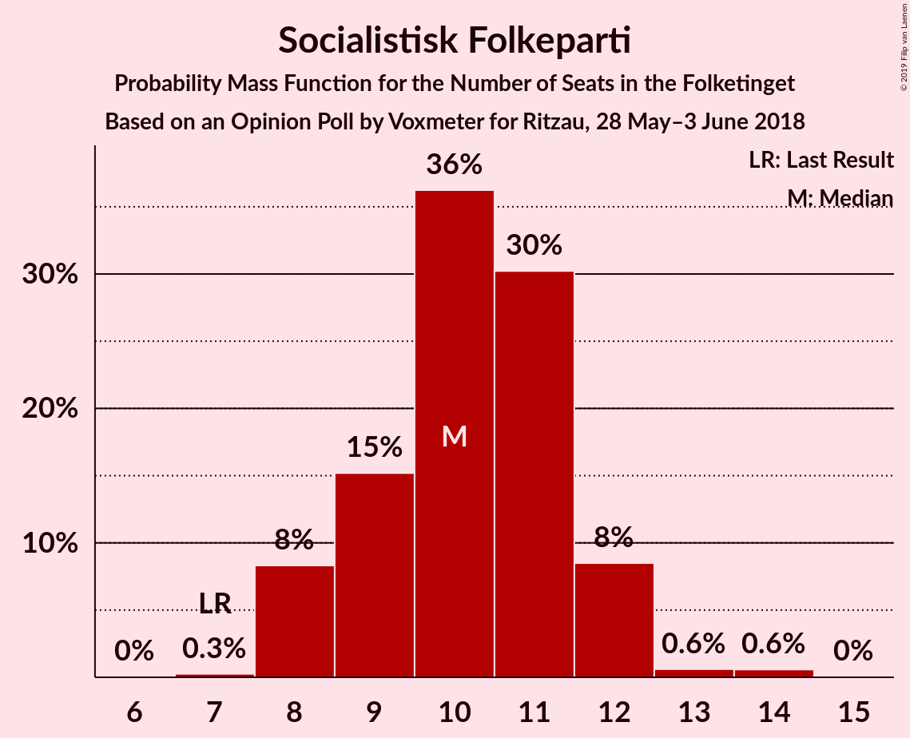
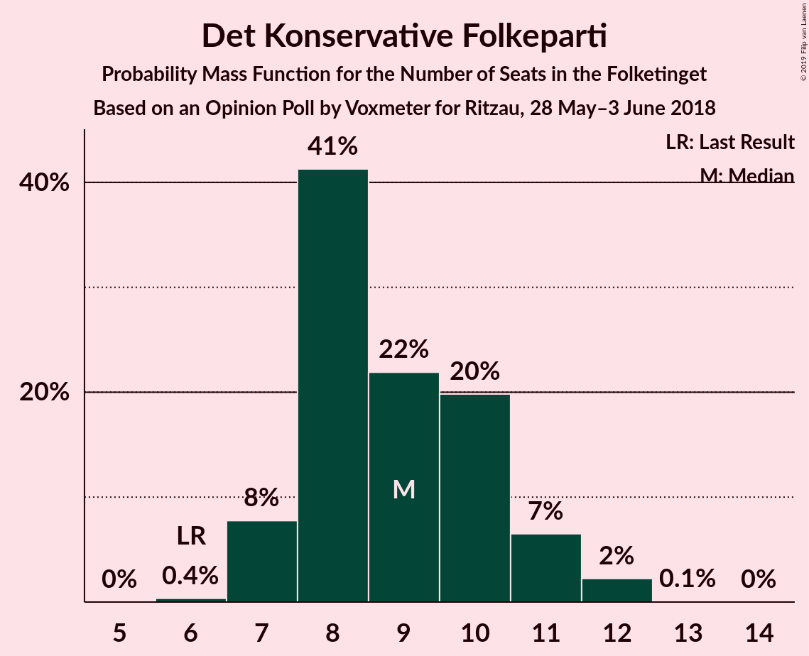
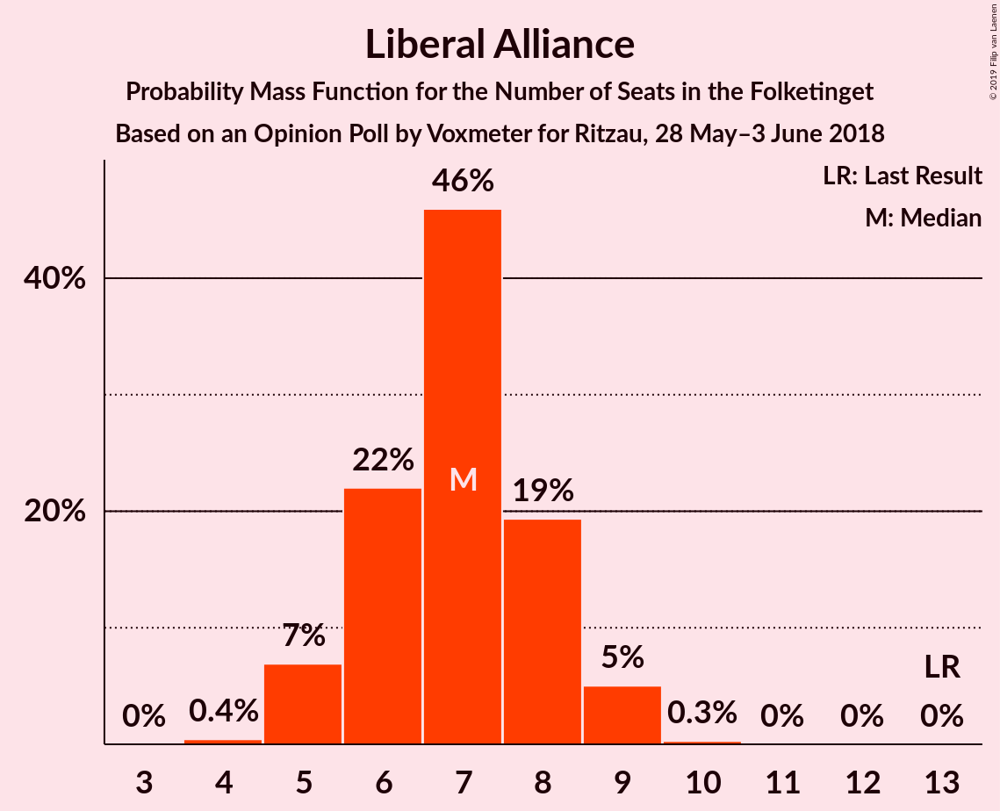
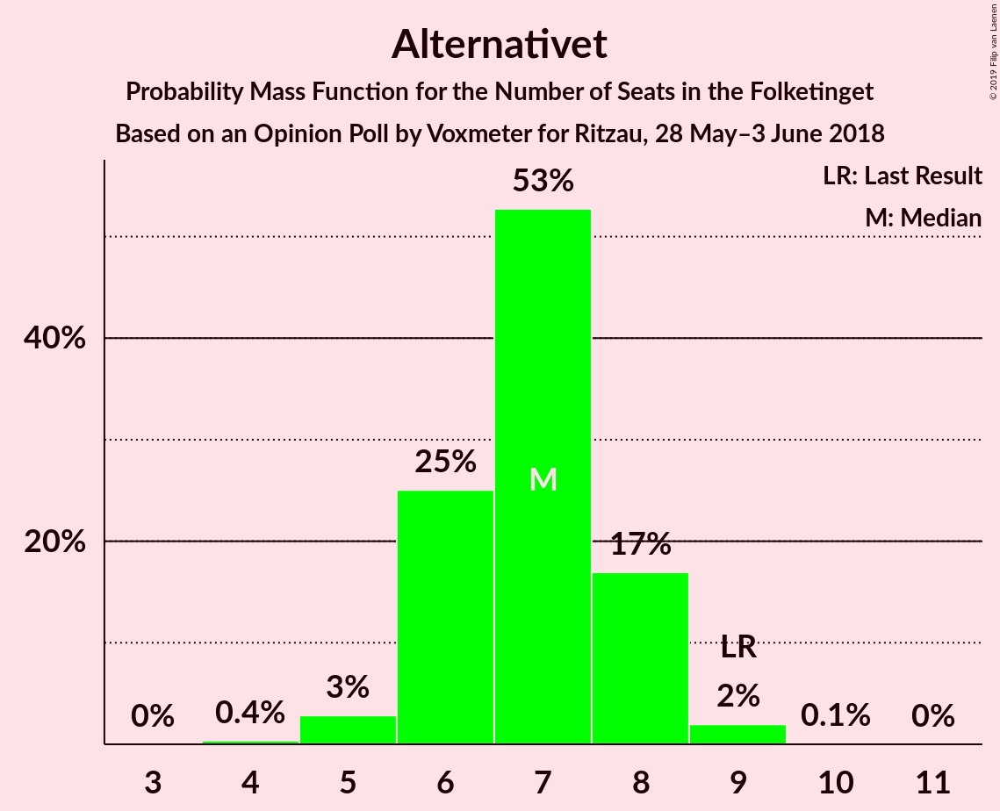

# Opinion Poll by Voxmeter for Ritzau, 28 May–3 June 2018

<a href="#voting-intentions">Voting Intentions</a> | <a href="#seats">Seats</a> | <a href="#coalitions">Coalitions</a> | <a href="#technical-information">Technical Information</a>

## Voting Intentions

### Confidence Intervals

| Party | Last Result | Poll Result | 80% Confidence Interval | 90% Confidence Interval | 95% Confidence Interval | 99% Confidence Interval |
|:-----:|:-----------:|:-----------:|:-----------------------:|:-----------------------:|:-----------------------:|:-----------------------:|
| Socialdemokraterne | 26.3% | 26.1% | 24.4–28.0% |24.0–28.5% |23.5–28.9% |22.7–29.8% |
| Venstre | 19.5% | 20.2% | 18.7–21.9% |18.2–22.4% |17.9–22.8% |17.1–23.6% |
| Dansk Folkeparti | 21.1% | 18.8% | 17.3–20.4% |16.8–20.9% |16.5–21.3% |15.8–22.1% |
| Enhedslisten–De Rød-Grønne | 7.8% | 9.0% | 8.0–10.3% |7.7–10.6% |7.4–11.0% |7.0–11.6% |
| Radikale Venstre | 4.6% | 6.3% | 5.4–7.4% |5.2–7.7% |5.0–8.0% |4.6–8.5% |
| Socialistisk Folkeparti | 4.2% | 5.7% | 4.9–6.8% |4.7–7.1% |4.5–7.3% |4.1–7.9% |
| Det Konservative Folkeparti | 3.4% | 5.0% | 4.2–5.9% |4.0–6.2% |3.8–6.5% |3.4–7.0% |
| Liberal Alliance | 7.5% | 3.6% | 2.9–4.5% |2.8–4.7% |2.6–4.9% |2.3–5.4% |
| Alternativet | 4.8% | 3.6% | 2.9–4.5% |2.8–4.7% |2.6–4.9% |2.3–5.4% |
| Nye Borgerlige | 0.0% | 0.8% | 0.5–1.3% |0.4–1.4% |0.4–1.5% |0.3–1.8% |
| Kristendemokraterne | 0.8% | 0.7% | 0.4–1.1% |0.4–1.3% |0.3–1.4% |0.2–1.7% |

*Note:* The poll result column reflects the actual value used in the calculations. Published results may vary slightly, and in addition be rounded to fewer digits.

## Seats

### Confidence Intervals

| Party | Last Result | Median | 80% Confidence Interval | 90% Confidence Interval | 95% Confidence Interval | 99% Confidence Interval |
|:-----:|:-----------:|:------:|:-----------------------:|:-----------------------:|:-----------------------:|:-----------------------:|
| <a href="#socialdemokraterne">Socialdemokraterne</a> | 47 | 45 | 44–45 |44–46 |44–49 |42–50 |
| <a href="#venstre">Venstre</a> | 34 | 36 | 35–39 |34–40 |31–40 |30–41 |
| <a href="#dansk-folkeparti">Dansk Folkeparti</a> | 37 | 34 | 32–39 |32–39 |31–39 |29–39 |
| <a href="#enhedslisten–de-rød-grønne">Enhedslisten–De Rød-Grønne</a> | 14 | 16 | 16–17 |14–17 |13–18 |13–19 |
| <a href="#radikale-venstre">Radikale Venstre</a> | 8 | 10 | 10–13 |10–13 |9–13 |9–14 |
| <a href="#socialistisk-folkeparti">Socialistisk Folkeparti</a> | 7 | 9 | 8–11 |8–14 |8–14 |7–15 |
| <a href="#det-konservative-folkeparti">Det Konservative Folkeparti</a> | 6 | 7 | 7–11 |7–11 |7–11 |7–13 |
| <a href="#liberal-alliance">Liberal Alliance</a> | 13 | 6 | 6–7 |6–7 |6–8 |4–9 |
| <a href="#alternativet">Alternativet</a> | 9 | 7 | 6–7 |6–8 |6–8 |5–9 |
| <a href="#nye-borgerlige">Nye Borgerlige</a> | 0 | 0 | 0 |0 |0 |0 |
| <a href="#kristendemokraterne">Kristendemokraterne</a> | 0 | 0 | 0 |0 |0 |0 |

### Socialdemokraterne

*For a full overview of the results for this party, see the [Socialdemokraterne](party-socialdemokraterne.html) page.*

| Number of Seats | Probability | Accumulated | Special Marks |
|:---------------:|:-----------:|:-----------:|:-------------:|
| 39 | 0% | 100% |  |
| 40 | 0.1% | 99.9% |  |
| 41 | 0.4% | 99.9% |  |
| 42 | 0.2% | 99.5% |  |
| 43 | 0.3% | 99.3% |  |
| 44 | 43% | 99.0% |  |
| 45 | 46% | 56% | Median |
| 46 | 5% | 9% |  |
| 47 | 0.1% | 4% | Last Result |
| 48 | 2% | 4% |  |
| 49 | 1.4% | 3% |  |
| 50 | 1.2% | 1.4% |  |
| 51 | 0% | 0.2% |  |
| 52 | 0.1% | 0.2% |  |
| 53 | 0% | 0.1% |  |
| 54 | 0% | 0.1% |  |
| 55 | 0.1% | 0.1% |  |
| 56 | 0% | 0% |  |

### Venstre

*For a full overview of the results for this party, see the [Venstre](party-venstre.html) page.*

| Number of Seats | Probability | Accumulated | Special Marks |
|:---------------:|:-----------:|:-----------:|:-------------:|
| 29 | 0.1% | 100% |  |
| 30 | 2% | 99.9% |  |
| 31 | 0.7% | 98% |  |
| 32 | 0.1% | 97% |  |
| 33 | 0.7% | 97% |  |
| 34 | 2% | 96% | Last Result |
| 35 | 28% | 95% |  |
| 36 | 52% | 66% | Median |
| 37 | 0.4% | 14% |  |
| 38 | 0.9% | 14% |  |
| 39 | 4% | 13% |  |
| 40 | 7% | 8% |  |
| 41 | 1.2% | 2% |  |
| 42 | 0.1% | 0.4% |  |
| 43 | 0.3% | 0.3% |  |
| 44 | 0% | 0% |  |

### Dansk Folkeparti

*For a full overview of the results for this party, see the [Dansk Folkeparti](party-danskfolkeparti.html) page.*

| Number of Seats | Probability | Accumulated | Special Marks |
|:---------------:|:-----------:|:-----------:|:-------------:|
| 26 | 0.1% | 100% |  |
| 27 | 0% | 99.9% |  |
| 28 | 0% | 99.9% |  |
| 29 | 0.6% | 99.9% |  |
| 30 | 0.2% | 99.2% |  |
| 31 | 2% | 99.0% |  |
| 32 | 32% | 97% |  |
| 33 | 9% | 65% |  |
| 34 | 8% | 55% | Median |
| 35 | 0.3% | 48% |  |
| 36 | 0.2% | 47% |  |
| 37 | 0.9% | 47% | Last Result |
| 38 | 2% | 46% |  |
| 39 | 44% | 44% |  |
| 40 | 0.1% | 0.2% |  |
| 41 | 0% | 0% |  |

### Enhedslisten–De Rød-Grønne

*For a full overview of the results for this party, see the [Enhedslisten–De Rød-Grønne](party-enhedslisten–derød-grønne.html) page.*

| Number of Seats | Probability | Accumulated | Special Marks |
|:---------------:|:-----------:|:-----------:|:-------------:|
| 12 | 0.4% | 100% |  |
| 13 | 4% | 99.6% |  |
| 14 | 3% | 95% | Last Result |
| 15 | 0.3% | 93% |  |
| 16 | 51% | 92% | Median |
| 17 | 37% | 41% |  |
| 18 | 3% | 3% |  |
| 19 | 0.3% | 0.8% |  |
| 20 | 0.3% | 0.5% |  |
| 21 | 0.1% | 0.2% |  |
| 22 | 0% | 0% |  |

### Radikale Venstre

*For a full overview of the results for this party, see the [Radikale Venstre](party-radikalevenstre.html) page.*

| Number of Seats | Probability | Accumulated | Special Marks |
|:---------------:|:-----------:|:-----------:|:-------------:|
| 8 | 0.4% | 100% | Last Result |
| 9 | 2% | 99.6% |  |
| 10 | 52% | 97% | Median |
| 11 | 2% | 46% |  |
| 12 | 11% | 44% |  |
| 13 | 32% | 33% |  |
| 14 | 0.6% | 0.8% |  |
| 15 | 0.1% | 0.1% |  |
| 16 | 0% | 0% |  |

### Socialistisk Folkeparti

*For a full overview of the results for this party, see the [Socialistisk Folkeparti](party-socialistiskfolkeparti.html) page.*

| Number of Seats | Probability | Accumulated | Special Marks |
|:---------------:|:-----------:|:-----------:|:-------------:|
| 6 | 0.4% | 100% |  |
| 7 | 1.1% | 99.6% | Last Result |
| 8 | 9% | 98% |  |
| 9 | 78% | 89% | Median |
| 10 | 1.4% | 12% |  |
| 11 | 1.0% | 10% |  |
| 12 | 0.2% | 9% |  |
| 13 | 0.2% | 9% |  |
| 14 | 8% | 9% |  |
| 15 | 0.5% | 0.5% |  |
| 16 | 0% | 0% |  |

### Det Konservative Folkeparti

*For a full overview of the results for this party, see the [Det Konservative Folkeparti](party-detkonservativefolkeparti.html) page.*

| Number of Seats | Probability | Accumulated | Special Marks |
|:---------------:|:-----------:|:-----------:|:-------------:|
| 6 | 0.4% | 100% | Last Result |
| 7 | 53% | 99.6% | Median |
| 8 | 1.4% | 47% |  |
| 9 | 8% | 46% |  |
| 10 | 9% | 38% |  |
| 11 | 28% | 29% |  |
| 12 | 0.3% | 0.9% |  |
| 13 | 0.5% | 0.6% |  |
| 14 | 0% | 0% |  |

### Liberal Alliance

*For a full overview of the results for this party, see the [Liberal Alliance](party-liberalalliance.html) page.*

| Number of Seats | Probability | Accumulated | Special Marks |
|:---------------:|:-----------:|:-----------:|:-------------:|
| 4 | 0.7% | 100% |  |
| 5 | 0.6% | 99.3% |  |
| 6 | 65% | 98.7% | Median |
| 7 | 31% | 34% |  |
| 8 | 2% | 3% |  |
| 9 | 0.5% | 0.6% |  |
| 10 | 0.1% | 0.1% |  |
| 11 | 0% | 0% |  |
| 12 | 0% | 0% |  |
| 13 | 0% | 0% | Last Result |

### Alternativet

*For a full overview of the results for this party, see the [Alternativet](party-alternativet.html) page.*

| Number of Seats | Probability | Accumulated | Special Marks |
|:---------------:|:-----------:|:-----------:|:-------------:|
| 4 | 0.1% | 100% |  |
| 5 | 0.9% | 99.8% |  |
| 6 | 9% | 98.9% |  |
| 7 | 81% | 90% | Median |
| 8 | 7% | 8% |  |
| 9 | 2% | 2% | Last Result |
| 10 | 0% | 0.1% |  |
| 11 | 0% | 0% |  |

### Nye Borgerlige

*For a full overview of the results for this party, see the [Nye Borgerlige](party-nyeborgerlige.html) page.*

| Number of Seats | Probability | Accumulated | Special Marks |
|:---------------:|:-----------:|:-----------:|:-------------:|
| 0 | 99.8% | 100% | Last Result, Median |
| 1 | 0% | 0.2% |  |
| 2 | 0% | 0.2% |  |
| 3 | 0% | 0.2% |  |
| 4 | 0.2% | 0.2% |  |
| 5 | 0% | 0% |  |

### Kristendemokraterne

*For a full overview of the results for this party, see the [Kristendemokraterne](party-kristendemokraterne.html) page.*

| Number of Seats | Probability | Accumulated | Special Marks |
|:---------------:|:-----------:|:-----------:|:-------------:|
| 0 | 100% | 100% | Last Result, Median |

## Coalitions

### Confidence Intervals

| Coalition | Last Result | Median | Majority? | 80% Confidence Interval | 90% Confidence Interval | 95% Confidence Interval | 99% Confidence Interval |
|:---------:|:-----------:|:------:|:---------:|:-----------------------:|:-----------------------:|:-----------------------:|:-----------------------:|
| Socialdemokraterne – Enhedslisten–De Rød-Grønne – Radikale Venstre – Socialistisk Folkeparti – Alternativet | 85 | 87 | 43% | 87–93 | 85–93 | 85–93 | 83–94 |
| Venstre – Dansk Folkeparti – Det Konservative Folkeparti – Liberal Alliance – Nye Borgerlige – Kristendemokraterne | 90 | 88 | 8% | 82–88 | 82–90 | 82–90 | 81–92 |
| Venstre – Dansk Folkeparti – Det Konservative Folkeparti – Liberal Alliance – Kristendemokraterne | 90 | 88 | 8% | 82–88 | 82–90 | 82–90 | 81–92 |
| Venstre – Dansk Folkeparti – Det Konservative Folkeparti – Liberal Alliance – Nye Borgerlige | 90 | 88 | 8% | 82–88 | 82–90 | 82–90 | 81–92 |
| Venstre – Dansk Folkeparti – Det Konservative Folkeparti – Liberal Alliance | 90 | 88 | 8% | 82–88 | 82–90 | 82–90 | 81–92 |
| Socialdemokraterne – Enhedslisten–De Rød-Grønne – Radikale Venstre – Socialistisk Folkeparti | 76 | 80 | 0.2% | 80–85 | 78–87 | 78–87 | 77–89 |
| Socialdemokraterne – Enhedslisten–De Rød-Grønne – Socialistisk Folkeparti – Alternativet | 77 | 77 | 0% | 76–81 | 75–81 | 75–81 | 74–84 |
| Socialdemokraterne – Enhedslisten–De Rød-Grønne – Socialistisk Folkeparti | 68 | 70 | 0% | 68–75 | 68–75 | 68–75 | 67–77 |
| Socialdemokraterne – Radikale Venstre – Socialistisk Folkeparti | 62 | 64 | 0% | 64–69 | 62–70 | 62–70 | 61–73 |
| Socialdemokraterne – Radikale Venstre | 55 | 55 | 0% | 55–57 | 54–59 | 54–59 | 52–63 |
| Venstre – Det Konservative Folkeparti – Liberal Alliance | 53 | 49 | 0% | 49–54 | 49–56 | 46–56 | 46–56 |
| Venstre – Det Konservative Folkeparti | 40 | 43 | 0% | 43–48 | 43–50 | 39–50 | 39–50 |
| Venstre | 34 | 36 | 0% | 35–39 | 34–40 | 31–40 | 30–41 |

### Socialdemokraterne – Enhedslisten–De Rød-Grønne – Radikale Venstre – Socialistisk Folkeparti – Alternativet

| Number of Seats | Probability | Accumulated | Special Marks |
|:---------------:|:-----------:|:-----------:|:-------------:|
| 78 | 0.1% | 100% |  |
| 79 | 0% | 99.9% |  |
| 80 | 0% | 99.9% |  |
| 81 | 0% | 99.9% |  |
| 82 | 0% | 99.9% |  |
| 83 | 0.4% | 99.9% |  |
| 84 | 0.1% | 99.5% |  |
| 85 | 7% | 99.4% | Last Result |
| 86 | 0.1% | 92% |  |
| 87 | 44% | 92% | Median |
| 88 | 0.3% | 48% |  |
| 89 | 5% | 47% |  |
| 90 | 29% | 43% | Majority |
| 91 | 2% | 13% |  |
| 92 | 0.6% | 11% |  |
| 93 | 8% | 10% |  |
| 94 | 2% | 2% |  |
| 95 | 0.2% | 0.4% |  |
| 96 | 0% | 0.2% |  |
| 97 | 0% | 0.2% |  |
| 98 | 0.1% | 0.1% |  |
| 99 | 0% | 0% |  |

### Venstre – Dansk Folkeparti – Det Konservative Folkeparti – Liberal Alliance – Nye Borgerlige – Kristendemokraterne

| Number of Seats | Probability | Accumulated | Special Marks |
|:---------------:|:-----------:|:-----------:|:-------------:|
| 77 | 0.1% | 100% |  |
| 78 | 0% | 99.9% |  |
| 79 | 0% | 99.8% |  |
| 80 | 0.2% | 99.8% |  |
| 81 | 2% | 99.6% |  |
| 82 | 8% | 98% |  |
| 83 | 0.6% | 90% | Median |
| 84 | 2% | 89% |  |
| 85 | 29% | 87% |  |
| 86 | 5% | 57% |  |
| 87 | 0.3% | 53% |  |
| 88 | 44% | 52% |  |
| 89 | 0.1% | 8% |  |
| 90 | 7% | 8% | Last Result, Majority |
| 91 | 0.1% | 0.6% |  |
| 92 | 0.4% | 0.5% |  |
| 93 | 0% | 0.1% |  |
| 94 | 0% | 0.1% |  |
| 95 | 0% | 0.1% |  |
| 96 | 0% | 0.1% |  |
| 97 | 0.1% | 0.1% |  |
| 98 | 0% | 0% |  |

### Venstre – Dansk Folkeparti – Det Konservative Folkeparti – Liberal Alliance – Kristendemokraterne

| Number of Seats | Probability | Accumulated | Special Marks |
|:---------------:|:-----------:|:-----------:|:-------------:|
| 76 | 0.1% | 100% |  |
| 77 | 0.1% | 99.9% |  |
| 78 | 0% | 99.8% |  |
| 79 | 0% | 99.8% |  |
| 80 | 0.2% | 99.7% |  |
| 81 | 2% | 99.5% |  |
| 82 | 8% | 98% |  |
| 83 | 0.6% | 89% | Median |
| 84 | 2% | 89% |  |
| 85 | 29% | 86% |  |
| 86 | 5% | 57% |  |
| 87 | 0.3% | 53% |  |
| 88 | 44% | 52% |  |
| 89 | 0.1% | 8% |  |
| 90 | 7% | 8% | Last Result, Majority |
| 91 | 0.1% | 0.6% |  |
| 92 | 0.4% | 0.5% |  |
| 93 | 0% | 0.1% |  |
| 94 | 0% | 0.1% |  |
| 95 | 0% | 0.1% |  |
| 96 | 0% | 0.1% |  |
| 97 | 0.1% | 0.1% |  |
| 98 | 0% | 0% |  |

### Venstre – Dansk Folkeparti – Det Konservative Folkeparti – Liberal Alliance – Nye Borgerlige

| Number of Seats | Probability | Accumulated | Special Marks |
|:---------------:|:-----------:|:-----------:|:-------------:|
| 77 | 0.1% | 100% |  |
| 78 | 0% | 99.9% |  |
| 79 | 0% | 99.8% |  |
| 80 | 0.2% | 99.8% |  |
| 81 | 2% | 99.6% |  |
| 82 | 8% | 98% |  |
| 83 | 0.6% | 90% | Median |
| 84 | 2% | 89% |  |
| 85 | 29% | 87% |  |
| 86 | 5% | 57% |  |
| 87 | 0.3% | 53% |  |
| 88 | 44% | 52% |  |
| 89 | 0.1% | 8% |  |
| 90 | 7% | 8% | Last Result, Majority |
| 91 | 0.1% | 0.6% |  |
| 92 | 0.4% | 0.5% |  |
| 93 | 0% | 0.1% |  |
| 94 | 0% | 0.1% |  |
| 95 | 0% | 0.1% |  |
| 96 | 0% | 0.1% |  |
| 97 | 0.1% | 0.1% |  |
| 98 | 0% | 0% |  |

### Venstre – Dansk Folkeparti – Det Konservative Folkeparti – Liberal Alliance

| Number of Seats | Probability | Accumulated | Special Marks |
|:---------------:|:-----------:|:-----------:|:-------------:|
| 76 | 0.1% | 100% |  |
| 77 | 0.1% | 99.9% |  |
| 78 | 0% | 99.8% |  |
| 79 | 0% | 99.8% |  |
| 80 | 0.2% | 99.7% |  |
| 81 | 2% | 99.5% |  |
| 82 | 8% | 98% |  |
| 83 | 0.6% | 89% | Median |
| 84 | 2% | 89% |  |
| 85 | 29% | 86% |  |
| 86 | 5% | 57% |  |
| 87 | 0.3% | 53% |  |
| 88 | 44% | 52% |  |
| 89 | 0.1% | 8% |  |
| 90 | 7% | 8% | Last Result, Majority |
| 91 | 0.1% | 0.6% |  |
| 92 | 0.4% | 0.5% |  |
| 93 | 0% | 0.1% |  |
| 94 | 0% | 0.1% |  |
| 95 | 0% | 0.1% |  |
| 96 | 0% | 0.1% |  |
| 97 | 0.1% | 0.1% |  |
| 98 | 0% | 0% |  |

### Socialdemokraterne – Enhedslisten–De Rød-Grønne – Radikale Venstre – Socialistisk Folkeparti

| Number of Seats | Probability | Accumulated | Special Marks |
|:---------------:|:-----------:|:-----------:|:-------------:|
| 73 | 0.1% | 100% |  |
| 74 | 0% | 99.9% |  |
| 75 | 0% | 99.9% |  |
| 76 | 0% | 99.9% | Last Result |
| 77 | 0.4% | 99.9% |  |
| 78 | 7% | 99.5% |  |
| 79 | 0.2% | 92% |  |
| 80 | 44% | 92% | Median |
| 81 | 6% | 48% |  |
| 82 | 1.2% | 42% |  |
| 83 | 27% | 41% |  |
| 84 | 3% | 14% |  |
| 85 | 0.8% | 11% |  |
| 86 | 0.6% | 10% |  |
| 87 | 8% | 9% |  |
| 88 | 0.1% | 1.0% |  |
| 89 | 0.6% | 0.8% |  |
| 90 | 0.1% | 0.2% | Majority |
| 91 | 0.1% | 0.1% |  |
| 92 | 0% | 0% |  |

### Socialdemokraterne – Enhedslisten–De Rød-Grønne – Socialistisk Folkeparti – Alternativet

| Number of Seats | Probability | Accumulated | Special Marks |
|:---------------:|:-----------:|:-----------:|:-------------:|
| 69 | 0.1% | 100% |  |
| 70 | 0% | 99.9% |  |
| 71 | 0.1% | 99.9% |  |
| 72 | 0.1% | 99.8% |  |
| 73 | 0.1% | 99.7% |  |
| 74 | 0.4% | 99.6% |  |
| 75 | 7% | 99.2% |  |
| 76 | 5% | 92% |  |
| 77 | 70% | 87% | Last Result, Median |
| 78 | 1.2% | 17% |  |
| 79 | 3% | 15% |  |
| 80 | 1.4% | 12% |  |
| 81 | 9% | 11% |  |
| 82 | 0.2% | 2% |  |
| 83 | 1.0% | 2% |  |
| 84 | 0.1% | 0.6% |  |
| 85 | 0.3% | 0.5% |  |
| 86 | 0.1% | 0.1% |  |
| 87 | 0% | 0.1% |  |
| 88 | 0% | 0% |  |

### Socialdemokraterne – Enhedslisten–De Rød-Grønne – Socialistisk Folkeparti

| Number of Seats | Probability | Accumulated | Special Marks |
|:---------------:|:-----------:|:-----------:|:-------------:|
| 64 | 0.1% | 100% |  |
| 65 | 0.1% | 99.9% |  |
| 66 | 0.2% | 99.8% |  |
| 67 | 0.4% | 99.6% |  |
| 68 | 12% | 99.3% | Last Result |
| 69 | 0.4% | 87% |  |
| 70 | 70% | 87% | Median |
| 71 | 2% | 17% |  |
| 72 | 4% | 15% |  |
| 73 | 0.5% | 11% |  |
| 74 | 0.2% | 11% |  |
| 75 | 9% | 10% |  |
| 76 | 0.6% | 1.3% |  |
| 77 | 0.3% | 0.7% |  |
| 78 | 0.3% | 0.4% |  |
| 79 | 0.1% | 0.1% |  |
| 80 | 0% | 0.1% |  |
| 81 | 0% | 0.1% |  |
| 82 | 0% | 0% |  |

### Socialdemokraterne – Radikale Venstre – Socialistisk Folkeparti

| Number of Seats | Probability | Accumulated | Special Marks |
|:---------------:|:-----------:|:-----------:|:-------------:|
| 59 | 0.1% | 100% |  |
| 60 | 0.4% | 99.9% |  |
| 61 | 0.2% | 99.5% |  |
| 62 | 7% | 99.3% | Last Result |
| 63 | 0.5% | 92% |  |
| 64 | 44% | 92% | Median |
| 65 | 0.7% | 48% |  |
| 66 | 29% | 47% |  |
| 67 | 2% | 18% |  |
| 68 | 5% | 16% |  |
| 69 | 0.6% | 11% |  |
| 70 | 8% | 10% |  |
| 71 | 0.7% | 2% |  |
| 72 | 0.2% | 0.8% |  |
| 73 | 0.5% | 0.6% |  |
| 74 | 0% | 0.1% |  |
| 75 | 0.1% | 0.1% |  |
| 76 | 0% | 0% |  |

### Socialdemokraterne – Radikale Venstre

| Number of Seats | Probability | Accumulated | Special Marks |
|:---------------:|:-----------:|:-----------:|:-------------:|
| 50 | 0.1% | 100% |  |
| 51 | 0.2% | 99.8% |  |
| 52 | 0.4% | 99.6% |  |
| 53 | 1.1% | 99.2% |  |
| 54 | 7% | 98% |  |
| 55 | 43% | 91% | Last Result, Median |
| 56 | 9% | 48% |  |
| 57 | 30% | 39% |  |
| 58 | 2% | 9% |  |
| 59 | 5% | 7% |  |
| 60 | 0.2% | 2% |  |
| 61 | 0.8% | 2% |  |
| 62 | 0.1% | 0.9% |  |
| 63 | 0.7% | 0.8% |  |
| 64 | 0.1% | 0.1% |  |
| 65 | 0% | 0.1% |  |
| 66 | 0% | 0% |  |

### Venstre – Det Konservative Folkeparti – Liberal Alliance

| Number of Seats | Probability | Accumulated | Special Marks |
|:---------------:|:-----------:|:-----------:|:-------------:|
| 45 | 0.1% | 100% |  |
| 46 | 3% | 99.9% |  |
| 47 | 0.5% | 97% |  |
| 48 | 0.8% | 96% |  |
| 49 | 52% | 95% | Median |
| 50 | 0.2% | 44% |  |
| 51 | 0.5% | 44% |  |
| 52 | 0.8% | 43% |  |
| 53 | 27% | 42% | Last Result |
| 54 | 7% | 15% |  |
| 55 | 1.1% | 8% |  |
| 56 | 7% | 7% |  |
| 57 | 0% | 0.5% |  |
| 58 | 0.1% | 0.4% |  |
| 59 | 0% | 0.3% |  |
| 60 | 0% | 0.3% |  |
| 61 | 0.3% | 0.3% |  |
| 62 | 0% | 0% |  |

### Venstre – Det Konservative Folkeparti

| Number of Seats | Probability | Accumulated | Special Marks |
|:---------------:|:-----------:|:-----------:|:-------------:|
| 38 | 0% | 100% |  |
| 39 | 3% | 99.9% |  |
| 40 | 0.3% | 97% | Last Result |
| 41 | 0.7% | 97% |  |
| 42 | 0.7% | 96% |  |
| 43 | 52% | 95% | Median |
| 44 | 0.8% | 43% |  |
| 45 | 0.2% | 42% |  |
| 46 | 27% | 42% |  |
| 47 | 0.5% | 15% |  |
| 48 | 7% | 14% |  |
| 49 | 0.1% | 8% |  |
| 50 | 7% | 8% |  |
| 51 | 0% | 0.4% |  |
| 52 | 0% | 0.3% |  |
| 53 | 0.3% | 0.3% |  |
| 54 | 0% | 0.1% |  |
| 55 | 0.1% | 0.1% |  |
| 56 | 0% | 0% |  |

### Venstre

| Number of Seats | Probability | Accumulated | Special Marks |
|:---------------:|:-----------:|:-----------:|:-------------:|
| 29 | 0.1% | 100% |  |
| 30 | 2% | 99.9% |  |
| 31 | 0.7% | 98% |  |
| 32 | 0.1% | 97% |  |
| 33 | 0.7% | 97% |  |
| 34 | 2% | 96% | Last Result |
| 35 | 28% | 95% |  |
| 36 | 52% | 66% | Median |
| 37 | 0.4% | 14% |  |
| 38 | 0.9% | 14% |  |
| 39 | 4% | 13% |  |
| 40 | 7% | 8% |  |
| 41 | 1.2% | 2% |  |
| 42 | 0.1% | 0.4% |  |
| 43 | 0.3% | 0.3% |  |
| 44 | 0% | 0% |  |

## Technical Information

### Opinion Poll

+ **Polling firm:** Voxmeter
+ **Commissioner(s):** Ritzau
+ **Fieldwork period:** 28 May–3 June 2018

### Calculations

+ **Sample size:** 1029
+ **Simulations done:** 131,072
+ **Error estimate:** 3.70%

