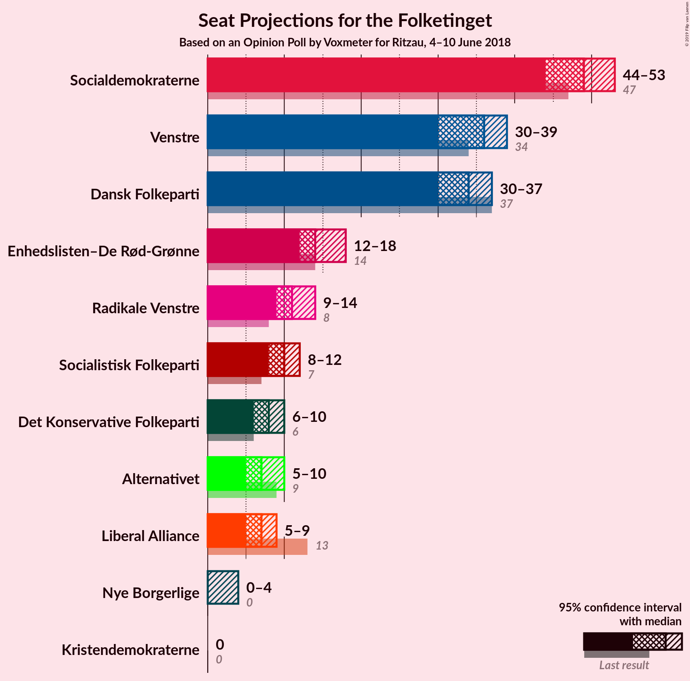
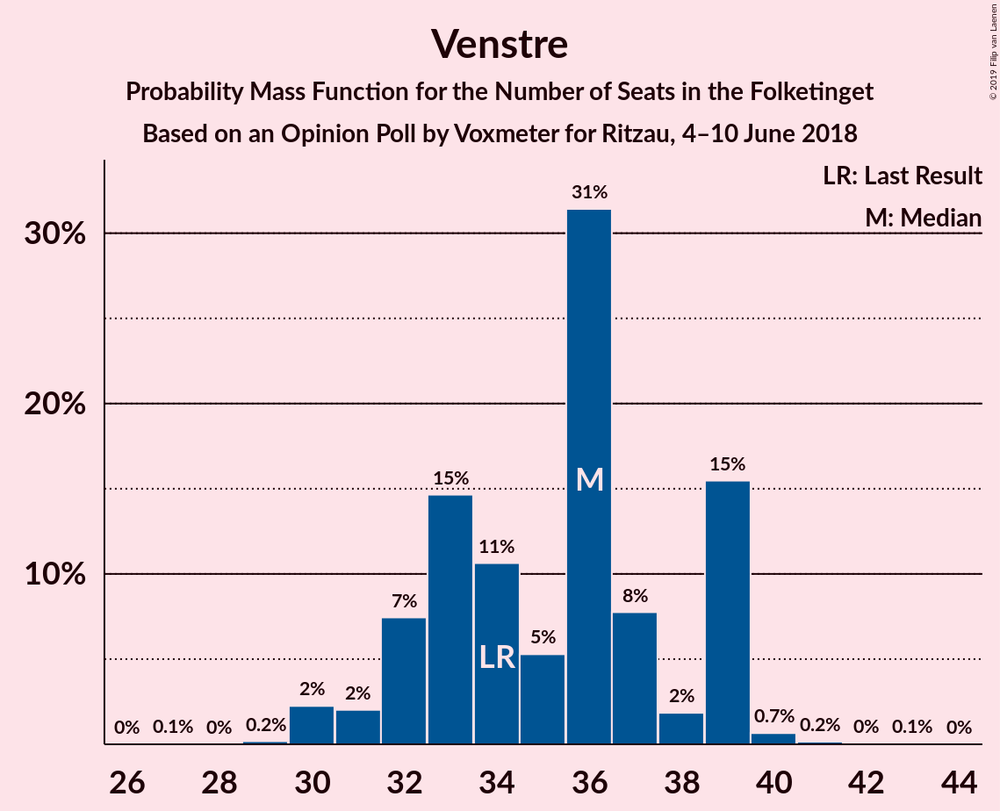
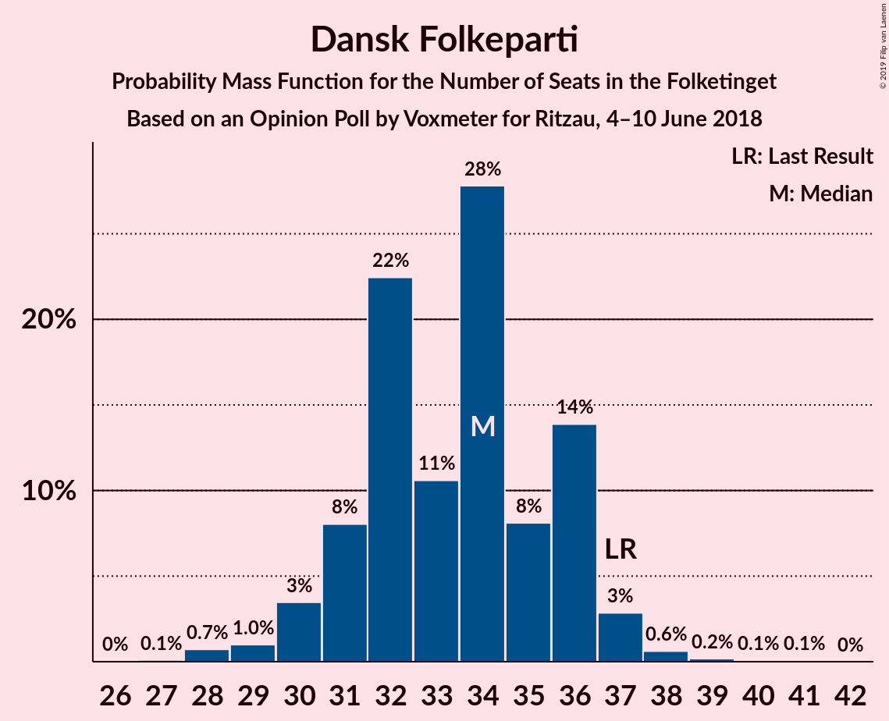

# Opinion Poll by Voxmeter for Ritzau, 4–10 June 2018

<a href="#voting-intentions">Voting Intentions</a> | <a href="#seats">Seats</a> | <a href="#coalitions">Coalitions</a> | <a href="#technical-information">Technical Information</a>

## Voting Intentions

### Confidence Intervals

| Party | Last Result | Poll Result | 80% Confidence Interval | 90% Confidence Interval | 95% Confidence Interval | 99% Confidence Interval |
|:-----:|:-----------:|:-----------:|:-----------------------:|:-----------------------:|:-----------------------:|:-----------------------:|
| Socialdemokraterne | 26.3% | 27.3% | 25.5–29.1% |25.0–29.6% |24.6–30.1% |23.8–31.0% |
| Venstre | 19.5% | 19.7% | 18.2–21.4% |17.7–21.8% |17.4–22.2% |16.7–23.0% |
| Dansk Folkeparti | 21.1% | 18.7% | 17.2–20.4% |16.8–20.8% |16.4–21.2% |15.8–22.0% |
| Enhedslisten–De Rød-Grønne | 7.8% | 8.4% | 7.4–9.6% |7.1–10.0% |6.9–10.3% |6.4–10.9% |
| Radikale Venstre | 4.6% | 6.3% | 5.4–7.4% |5.2–7.7% |5.0–8.0% |4.6–8.5% |
| Socialistisk Folkeparti | 4.2% | 5.1% | 4.4–6.1% |4.1–6.4% |3.9–6.7% |3.6–7.2% |
| Det Konservative Folkeparti | 3.4% | 4.4% | 3.6–5.3% |3.4–5.6% |3.3–5.8% |3.0–6.3% |
| Liberal Alliance | 7.5% | 4.0% | 3.3–4.9% |3.1–5.1% |2.9–5.4% |2.7–5.8% |
| Alternativet | 4.8% | 4.0% | 3.3–4.9% |3.1–5.1% |2.9–5.4% |2.7–5.8% |
| Nye Borgerlige | 0.0% | 1.2% | 0.8–1.7% |0.7–1.9% |0.7–2.0% |0.5–2.3% |
| Kristendemokraterne | 0.8% | 0.7% | 0.4–1.1% |0.4–1.3% |0.3–1.4% |0.2–1.7% |

*Note:* The poll result column reflects the actual value used in the calculations. Published results may vary slightly, and in addition be rounded to fewer digits.

## Seats

### Confidence Intervals

| Party | Last Result | Median | 80% Confidence Interval | 90% Confidence Interval | 95% Confidence Interval | 99% Confidence Interval |
|:-----:|:-----------:|:------:|:-----------------------:|:-----------------------:|:-----------------------:|:-----------------------:|
| <a href="#socialdemokraterne">Socialdemokraterne</a> | 47 | 50 | 46–52 |45–53 |44–53 |42–53 |
| <a href="#venstre">Venstre</a> | 34 | 37 | 30–37 |30–39 |30–39 |30–41 |
| <a href="#dansk-folkeparti">Dansk Folkeparti</a> | 37 | 32 | 31–37 |30–37 |30–38 |28–40 |
| <a href="#enhedslisten–de-rød-grønne">Enhedslisten–De Rød-Grønne</a> | 14 | 14 | 13–17 |12–18 |12–18 |12–19 |
| <a href="#radikale-venstre">Radikale Venstre</a> | 8 | 11 | 9–13 |9–14 |9–16 |8–16 |
| <a href="#socialistisk-folkeparti">Socialistisk Folkeparti</a> | 7 | 9 | 6–10 |6–11 |6–12 |6–12 |
| <a href="#det-konservative-folkeparti">Det Konservative Folkeparti</a> | 6 | 8 | 6–10 |6–10 |6–11 |6–11 |
| <a href="#liberal-alliance">Liberal Alliance</a> | 13 | 7 | 5–9 |5–9 |5–9 |5–9 |
| <a href="#alternativet">Alternativet</a> | 9 | 7 | 6–10 |6–10 |6–10 |5–10 |
| <a href="#nye-borgerlige">Nye Borgerlige</a> | 0 | 0 | 0 |0 |0 |0–4 |
| <a href="#kristendemokraterne">Kristendemokraterne</a> | 0 | 0 | 0 |0 |0 |0 |

### Socialdemokraterne

*For a full overview of the results for this party, see the [Socialdemokraterne](party-socialdemokraterne.html) page.*

| Number of Seats | Probability | Accumulated | Special Marks |
|:---------------:|:-----------:|:-----------:|:-------------:|
| 41 | 0.1% | 100% |  |
| 42 | 1.0% | 99.9% |  |
| 43 | 0.5% | 98.9% |  |
| 44 | 3% | 98% |  |
| 45 | 1.5% | 95% |  |
| 46 | 6% | 94% |  |
| 47 | 11% | 88% | Last Result |
| 48 | 3% | 76% |  |
| 49 | 10% | 74% |  |
| 50 | 17% | 64% | Median |
| 51 | 13% | 47% |  |
| 52 | 27% | 34% |  |
| 53 | 6% | 7% |  |
| 54 | 0.1% | 0.4% |  |
| 55 | 0.1% | 0.3% |  |
| 56 | 0.1% | 0.2% |  |
| 57 | 0.2% | 0.2% |  |
| 58 | 0% | 0% |  |

### Venstre

*For a full overview of the results for this party, see the [Venstre](party-venstre.html) page.*

| Number of Seats | Probability | Accumulated | Special Marks |
|:---------------:|:-----------:|:-----------:|:-------------:|
| 28 | 0.1% | 100% |  |
| 29 | 0.2% | 99.9% |  |
| 30 | 18% | 99.7% |  |
| 31 | 0.6% | 82% |  |
| 32 | 1.1% | 81% |  |
| 33 | 16% | 80% |  |
| 34 | 4% | 64% | Last Result |
| 35 | 6% | 60% |  |
| 36 | 2% | 54% |  |
| 37 | 42% | 52% | Median |
| 38 | 4% | 10% |  |
| 39 | 4% | 6% |  |
| 40 | 0.2% | 2% |  |
| 41 | 1.3% | 1.3% |  |
| 42 | 0.1% | 0.1% |  |
| 43 | 0% | 0% |  |

### Dansk Folkeparti

*For a full overview of the results for this party, see the [Dansk Folkeparti](party-danskfolkeparti.html) page.*

| Number of Seats | Probability | Accumulated | Special Marks |
|:---------------:|:-----------:|:-----------:|:-------------:|
| 26 | 0.2% | 100% |  |
| 27 | 0.1% | 99.8% |  |
| 28 | 0.2% | 99.7% |  |
| 29 | 0.5% | 99.4% |  |
| 30 | 8% | 99.0% |  |
| 31 | 35% | 91% |  |
| 32 | 5% | 55% | Median |
| 33 | 7% | 50% |  |
| 34 | 0.5% | 42% |  |
| 35 | 0.4% | 42% |  |
| 36 | 19% | 41% |  |
| 37 | 19% | 22% | Last Result |
| 38 | 2% | 3% |  |
| 39 | 1.1% | 2% |  |
| 40 | 0.4% | 0.5% |  |
| 41 | 0.1% | 0.1% |  |
| 42 | 0% | 0% |  |

### Enhedslisten–De Rød-Grønne

*For a full overview of the results for this party, see the [Enhedslisten–De Rød-Grønne](party-enhedslisten–derød-grønne.html) page.*

| Number of Seats | Probability | Accumulated | Special Marks |
|:---------------:|:-----------:|:-----------:|:-------------:|
| 11 | 0.1% | 100% |  |
| 12 | 7% | 99.9% |  |
| 13 | 39% | 93% |  |
| 14 | 22% | 54% | Last Result, Median |
| 15 | 3% | 32% |  |
| 16 | 18% | 29% |  |
| 17 | 5% | 11% |  |
| 18 | 5% | 6% |  |
| 19 | 0.6% | 0.8% |  |
| 20 | 0.2% | 0.2% |  |
| 21 | 0% | 0% |  |

### Radikale Venstre

*For a full overview of the results for this party, see the [Radikale Venstre](party-radikalevenstre.html) page.*

| Number of Seats | Probability | Accumulated | Special Marks |
|:---------------:|:-----------:|:-----------:|:-------------:|
| 8 | 0.7% | 100% | Last Result |
| 9 | 11% | 99.3% |  |
| 10 | 28% | 88% |  |
| 11 | 42% | 60% | Median |
| 12 | 6% | 18% |  |
| 13 | 7% | 12% |  |
| 14 | 2% | 6% |  |
| 15 | 0.8% | 4% |  |
| 16 | 3% | 3% |  |
| 17 | 0% | 0% |  |

### Socialistisk Folkeparti

*For a full overview of the results for this party, see the [Socialistisk Folkeparti](party-socialistiskfolkeparti.html) page.*

| Number of Seats | Probability | Accumulated | Special Marks |
|:---------------:|:-----------:|:-----------:|:-------------:|
| 5 | 0.1% | 100% |  |
| 6 | 14% | 99.9% |  |
| 7 | 1.0% | 86% | Last Result |
| 8 | 35% | 85% |  |
| 9 | 12% | 50% | Median |
| 10 | 30% | 38% |  |
| 11 | 5% | 8% |  |
| 12 | 3% | 3% |  |
| 13 | 0% | 0.1% |  |
| 14 | 0.1% | 0.1% |  |
| 15 | 0% | 0% |  |

### Det Konservative Folkeparti

*For a full overview of the results for this party, see the [Det Konservative Folkeparti](party-detkonservativefolkeparti.html) page.*

| Number of Seats | Probability | Accumulated | Special Marks |
|:---------------:|:-----------:|:-----------:|:-------------:|
| 5 | 0.2% | 100% |  |
| 6 | 13% | 99.8% | Last Result |
| 7 | 31% | 87% |  |
| 8 | 10% | 55% | Median |
| 9 | 18% | 46% |  |
| 10 | 24% | 27% |  |
| 11 | 4% | 4% |  |
| 12 | 0.1% | 0.1% |  |
| 13 | 0% | 0% |  |

### Liberal Alliance

*For a full overview of the results for this party, see the [Liberal Alliance](party-liberalalliance.html) page.*

| Number of Seats | Probability | Accumulated | Special Marks |
|:---------------:|:-----------:|:-----------:|:-------------:|
| 4 | 0.2% | 100% |  |
| 5 | 13% | 99.8% |  |
| 6 | 35% | 87% |  |
| 7 | 31% | 52% | Median |
| 8 | 6% | 21% |  |
| 9 | 14% | 15% |  |
| 10 | 0.2% | 0.4% |  |
| 11 | 0.3% | 0.3% |  |
| 12 | 0% | 0% |  |
| 13 | 0% | 0% | Last Result |

### Alternativet

*For a full overview of the results for this party, see the [Alternativet](party-alternativet.html) page.*

| Number of Seats | Probability | Accumulated | Special Marks |
|:---------------:|:-----------:|:-----------:|:-------------:|
| 4 | 0.1% | 100% |  |
| 5 | 0.8% | 99.9% |  |
| 6 | 10% | 99.1% |  |
| 7 | 42% | 89% | Median |
| 8 | 10% | 48% |  |
| 9 | 10% | 37% | Last Result |
| 10 | 27% | 27% |  |
| 11 | 0.1% | 0.1% |  |
| 12 | 0% | 0% |  |

### Nye Borgerlige

*For a full overview of the results for this party, see the [Nye Borgerlige](party-nyeborgerlige.html) page.*

| Number of Seats | Probability | Accumulated | Special Marks |
|:---------------:|:-----------:|:-----------:|:-------------:|
| 0 | 98.6% | 100% | Last Result, Median |
| 1 | 0% | 1.4% |  |
| 2 | 0% | 1.4% |  |
| 3 | 0% | 1.4% |  |
| 4 | 1.2% | 1.4% |  |
| 5 | 0.1% | 0.1% |  |
| 6 | 0% | 0% |  |

### Kristendemokraterne

*For a full overview of the results for this party, see the [Kristendemokraterne](party-kristendemokraterne.html) page.*

| Number of Seats | Probability | Accumulated | Special Marks |
|:---------------:|:-----------:|:-----------:|:-------------:|
| 0 | 99.9% | 100% | Last Result, Median |
| 1 | 0% | 0.1% |  |
| 2 | 0% | 0.1% |  |
| 3 | 0% | 0.1% |  |
| 4 | 0.1% | 0.1% |  |
| 5 | 0% | 0% |  |

## Coalitions

### Confidence Intervals

| Coalition | Last Result | Median | Majority? | 80% Confidence Interval | 90% Confidence Interval | 95% Confidence Interval | 99% Confidence Interval |
|:---------:|:-----------:|:------:|:---------:|:-----------------------:|:-----------------------:|:-----------------------:|:-----------------------:|
| Socialdemokraterne – Enhedslisten–De Rød-Grønne – Radikale Venstre – Socialistisk Folkeparti – Alternativet | 85 | 91 | 80% | 88–94 | 87–95 | 86–97 | 84–100 |
| Socialdemokraterne – Enhedslisten–De Rød-Grønne – Radikale Venstre – Socialistisk Folkeparti | 76 | 84 | 2% | 81–87 | 80–88 | 79–89 | 76–94 |
| Venstre – Dansk Folkeparti – Det Konservative Folkeparti – Liberal Alliance – Nye Borgerlige – Kristendemokraterne | 90 | 84 | 1.5% | 81–87 | 80–88 | 78–89 | 75–91 |
| Venstre – Dansk Folkeparti – Det Konservative Folkeparti – Liberal Alliance – Kristendemokraterne | 90 | 84 | 1.4% | 81–87 | 79–88 | 78–89 | 75–90 |
| Venstre – Dansk Folkeparti – Det Konservative Folkeparti – Liberal Alliance – Nye Borgerlige | 90 | 84 | 1.5% | 81–87 | 80–88 | 78–89 | 75–91 |
| Venstre – Dansk Folkeparti – Det Konservative Folkeparti – Liberal Alliance | 90 | 84 | 1.3% | 81–87 | 79–88 | 78–89 | 75–90 |
| Socialdemokraterne – Enhedslisten–De Rød-Grønne – Socialistisk Folkeparti – Alternativet | 77 | 81 | 0% | 77–83 | 76–83 | 76–86 | 74–87 |
| Socialdemokraterne – Enhedslisten–De Rød-Grønne – Socialistisk Folkeparti | 68 | 73 | 0% | 70–74 | 70–75 | 68–78 | 66–81 |
| Socialdemokraterne – Radikale Venstre – Socialistisk Folkeparti | 62 | 70 | 0% | 66–71 | 65–73 | 63–75 | 62–78 |
| Socialdemokraterne – Radikale Venstre | 55 | 62 | 0% | 57–63 | 54–65 | 54–65 | 53–66 |
| Venstre – Det Konservative Folkeparti – Liberal Alliance | 53 | 50 | 0% | 47–54 | 47–54 | 46–57 | 42–57 |
| Venstre – Det Konservative Folkeparti | 40 | 43 | 0% | 40–47 | 40–48 | 39–49 | 37–50 |
| Venstre | 34 | 37 | 0% | 30–37 | 30–39 | 30–39 | 30–41 |

### Socialdemokraterne – Enhedslisten–De Rød-Grønne – Radikale Venstre – Socialistisk Folkeparti – Alternativet

| Number of Seats | Probability | Accumulated | Special Marks |
|:---------------:|:-----------:|:-----------:|:-------------:|
| 81 | 0.2% | 100% |  |
| 82 | 0% | 99.8% |  |
| 83 | 0.2% | 99.8% |  |
| 84 | 0.2% | 99.6% |  |
| 85 | 0.9% | 99.4% | Last Result |
| 86 | 3% | 98.5% |  |
| 87 | 4% | 96% |  |
| 88 | 12% | 92% |  |
| 89 | 0.2% | 80% |  |
| 90 | 3% | 80% | Majority |
| 91 | 30% | 77% | Median |
| 92 | 7% | 47% |  |
| 93 | 6% | 41% |  |
| 94 | 28% | 35% |  |
| 95 | 2% | 7% |  |
| 96 | 0.6% | 5% |  |
| 97 | 3% | 4% |  |
| 98 | 0.3% | 1.2% |  |
| 99 | 0.1% | 0.9% |  |
| 100 | 0.7% | 0.8% |  |
| 101 | 0.1% | 0.1% |  |
| 102 | 0% | 0% |  |

### Socialdemokraterne – Enhedslisten–De Rød-Grønne – Radikale Venstre – Socialistisk Folkeparti

| Number of Seats | Probability | Accumulated | Special Marks |
|:---------------:|:-----------:|:-----------:|:-------------:|
| 74 | 0.2% | 100% |  |
| 75 | 0.3% | 99.8% |  |
| 76 | 0.1% | 99.6% | Last Result |
| 77 | 0.6% | 99.5% |  |
| 78 | 0.2% | 98.8% |  |
| 79 | 2% | 98.6% |  |
| 80 | 5% | 97% |  |
| 81 | 12% | 92% |  |
| 82 | 9% | 79% |  |
| 83 | 1.5% | 70% |  |
| 84 | 50% | 69% | Median |
| 85 | 6% | 19% |  |
| 86 | 0.8% | 13% |  |
| 87 | 7% | 12% |  |
| 88 | 0.2% | 5% |  |
| 89 | 3% | 5% |  |
| 90 | 0.7% | 2% | Majority |
| 91 | 0.1% | 1.0% |  |
| 92 | 0.2% | 1.0% |  |
| 93 | 0% | 0.8% |  |
| 94 | 0.7% | 0.7% |  |
| 95 | 0% | 0% |  |

### Venstre – Dansk Folkeparti – Det Konservative Folkeparti – Liberal Alliance – Nye Borgerlige – Kristendemokraterne

| Number of Seats | Probability | Accumulated | Special Marks |
|:---------------:|:-----------:|:-----------:|:-------------:|
| 74 | 0.1% | 100% |  |
| 75 | 0.7% | 99.9% |  |
| 76 | 0.1% | 99.2% |  |
| 77 | 0.3% | 99.1% |  |
| 78 | 3% | 98.8% |  |
| 79 | 0.6% | 96% |  |
| 80 | 2% | 95% |  |
| 81 | 28% | 93% |  |
| 82 | 6% | 65% |  |
| 83 | 7% | 59% |  |
| 84 | 30% | 53% | Median |
| 85 | 3% | 23% |  |
| 86 | 0.2% | 20% |  |
| 87 | 12% | 20% |  |
| 88 | 4% | 8% |  |
| 89 | 3% | 4% |  |
| 90 | 0.9% | 1.5% | Last Result, Majority |
| 91 | 0.2% | 0.6% |  |
| 92 | 0.2% | 0.4% |  |
| 93 | 0% | 0.2% |  |
| 94 | 0.2% | 0.2% |  |
| 95 | 0% | 0% |  |

### Venstre – Dansk Folkeparti – Det Konservative Folkeparti – Liberal Alliance – Kristendemokraterne

| Number of Seats | Probability | Accumulated | Special Marks |
|:---------------:|:-----------:|:-----------:|:-------------:|
| 74 | 0.2% | 100% |  |
| 75 | 0.7% | 99.8% |  |
| 76 | 0.1% | 99.1% |  |
| 77 | 0.3% | 99.0% |  |
| 78 | 3% | 98.6% |  |
| 79 | 0.7% | 96% |  |
| 80 | 2% | 95% |  |
| 81 | 29% | 93% |  |
| 82 | 6% | 64% |  |
| 83 | 7% | 58% |  |
| 84 | 30% | 52% | Median |
| 85 | 2% | 22% |  |
| 86 | 0.2% | 20% |  |
| 87 | 12% | 20% |  |
| 88 | 4% | 8% |  |
| 89 | 3% | 4% |  |
| 90 | 0.9% | 1.4% | Last Result, Majority |
| 91 | 0.1% | 0.5% |  |
| 92 | 0.2% | 0.4% |  |
| 93 | 0% | 0.2% |  |
| 94 | 0.2% | 0.2% |  |
| 95 | 0% | 0% |  |

### Venstre – Dansk Folkeparti – Det Konservative Folkeparti – Liberal Alliance – Nye Borgerlige

| Number of Seats | Probability | Accumulated | Special Marks |
|:---------------:|:-----------:|:-----------:|:-------------:|
| 74 | 0.1% | 100% |  |
| 75 | 0.7% | 99.9% |  |
| 76 | 0.1% | 99.2% |  |
| 77 | 0.3% | 99.1% |  |
| 78 | 3% | 98.8% |  |
| 79 | 0.6% | 96% |  |
| 80 | 2% | 95% |  |
| 81 | 28% | 93% |  |
| 82 | 6% | 65% |  |
| 83 | 7% | 59% |  |
| 84 | 30% | 53% | Median |
| 85 | 3% | 23% |  |
| 86 | 0.2% | 20% |  |
| 87 | 12% | 20% |  |
| 88 | 4% | 8% |  |
| 89 | 3% | 4% |  |
| 90 | 0.9% | 1.5% | Last Result, Majority |
| 91 | 0.2% | 0.5% |  |
| 92 | 0.2% | 0.4% |  |
| 93 | 0% | 0.2% |  |
| 94 | 0.2% | 0.2% |  |
| 95 | 0% | 0% |  |

### Venstre – Dansk Folkeparti – Det Konservative Folkeparti – Liberal Alliance

| Number of Seats | Probability | Accumulated | Special Marks |
|:---------------:|:-----------:|:-----------:|:-------------:|
| 74 | 0.2% | 100% |  |
| 75 | 0.7% | 99.8% |  |
| 76 | 0.1% | 99.1% |  |
| 77 | 0.4% | 99.0% |  |
| 78 | 3% | 98.6% |  |
| 79 | 0.7% | 96% |  |
| 80 | 2% | 95% |  |
| 81 | 29% | 93% |  |
| 82 | 6% | 64% |  |
| 83 | 7% | 58% |  |
| 84 | 30% | 52% | Median |
| 85 | 2% | 22% |  |
| 86 | 0.2% | 20% |  |
| 87 | 12% | 20% |  |
| 88 | 4% | 8% |  |
| 89 | 3% | 4% |  |
| 90 | 0.9% | 1.3% | Last Result, Majority |
| 91 | 0.1% | 0.4% |  |
| 92 | 0.2% | 0.4% |  |
| 93 | 0% | 0.2% |  |
| 94 | 0.2% | 0.2% |  |
| 95 | 0% | 0% |  |

### Socialdemokraterne – Enhedslisten–De Rød-Grønne – Socialistisk Folkeparti – Alternativet

| Number of Seats | Probability | Accumulated | Special Marks |
|:---------------:|:-----------:|:-----------:|:-------------:|
| 72 | 0.1% | 100% |  |
| 73 | 0.3% | 99.9% |  |
| 74 | 0.7% | 99.6% |  |
| 75 | 1.4% | 99.0% |  |
| 76 | 3% | 98% |  |
| 77 | 13% | 95% | Last Result |
| 78 | 4% | 82% |  |
| 79 | 0.9% | 78% |  |
| 80 | 11% | 77% | Median |
| 81 | 30% | 67% |  |
| 82 | 6% | 36% |  |
| 83 | 27% | 30% |  |
| 84 | 0.8% | 4% |  |
| 85 | 0.3% | 3% |  |
| 86 | 1.4% | 3% |  |
| 87 | 0.8% | 1.1% |  |
| 88 | 0.2% | 0.3% |  |
| 89 | 0% | 0.1% |  |
| 90 | 0% | 0% | Majority |

### Socialdemokraterne – Enhedslisten–De Rød-Grønne – Socialistisk Folkeparti

| Number of Seats | Probability | Accumulated | Special Marks |
|:---------------:|:-----------:|:-----------:|:-------------:|
| 64 | 0.1% | 100% |  |
| 65 | 0.1% | 99.9% |  |
| 66 | 0.8% | 99.8% |  |
| 67 | 0.3% | 99.1% |  |
| 68 | 1.3% | 98.8% | Last Result |
| 69 | 1.0% | 97% |  |
| 70 | 16% | 96% |  |
| 71 | 3% | 80% |  |
| 72 | 10% | 77% |  |
| 73 | 36% | 68% | Median |
| 74 | 22% | 32% |  |
| 75 | 6% | 10% |  |
| 76 | 0.8% | 4% |  |
| 77 | 0.6% | 3% |  |
| 78 | 1.4% | 3% |  |
| 79 | 0.3% | 1.3% |  |
| 80 | 0.1% | 0.9% |  |
| 81 | 0.8% | 0.8% |  |
| 82 | 0% | 0.1% |  |
| 83 | 0% | 0% |  |

### Socialdemokraterne – Radikale Venstre – Socialistisk Folkeparti

| Number of Seats | Probability | Accumulated | Special Marks |
|:---------------:|:-----------:|:-----------:|:-------------:|
| 60 | 0.3% | 100% |  |
| 61 | 0.2% | 99.7% |  |
| 62 | 0.2% | 99.5% | Last Result |
| 63 | 3% | 99.3% |  |
| 64 | 1.2% | 97% |  |
| 65 | 4% | 95% |  |
| 66 | 8% | 92% |  |
| 67 | 3% | 84% |  |
| 68 | 19% | 80% |  |
| 69 | 3% | 61% |  |
| 70 | 18% | 59% | Median |
| 71 | 31% | 40% |  |
| 72 | 0.6% | 10% |  |
| 73 | 4% | 9% |  |
| 74 | 0.3% | 5% |  |
| 75 | 3% | 4% |  |
| 76 | 0.1% | 1.0% |  |
| 77 | 0.1% | 0.9% |  |
| 78 | 0.7% | 0.8% |  |
| 79 | 0% | 0.1% |  |
| 80 | 0% | 0.1% |  |
| 81 | 0.1% | 0.1% |  |
| 82 | 0% | 0% |  |

### Socialdemokraterne – Radikale Venstre

| Number of Seats | Probability | Accumulated | Special Marks |
|:---------------:|:-----------:|:-----------:|:-------------:|
| 51 | 0.1% | 100% |  |
| 52 | 0.2% | 99.9% |  |
| 53 | 0.7% | 99.7% |  |
| 54 | 5% | 99.0% |  |
| 55 | 2% | 94% | Last Result |
| 56 | 0.2% | 92% |  |
| 57 | 9% | 92% |  |
| 58 | 7% | 83% |  |
| 59 | 4% | 76% |  |
| 60 | 20% | 72% |  |
| 61 | 0.1% | 51% | Median |
| 62 | 15% | 51% |  |
| 63 | 27% | 36% |  |
| 64 | 1.3% | 10% |  |
| 65 | 7% | 8% |  |
| 66 | 0.8% | 1.1% |  |
| 67 | 0.1% | 0.3% |  |
| 68 | 0.1% | 0.2% |  |
| 69 | 0% | 0.1% |  |
| 70 | 0.1% | 0.1% |  |
| 71 | 0% | 0% |  |

### Venstre – Det Konservative Folkeparti – Liberal Alliance

| Number of Seats | Probability | Accumulated | Special Marks |
|:---------------:|:-----------:|:-----------:|:-------------:|
| 42 | 0.7% | 100% |  |
| 43 | 0% | 99.3% |  |
| 44 | 0.1% | 99.3% |  |
| 45 | 1.4% | 99.2% |  |
| 46 | 0.3% | 98% |  |
| 47 | 21% | 97% |  |
| 48 | 10% | 76% |  |
| 49 | 5% | 67% |  |
| 50 | 29% | 61% |  |
| 51 | 14% | 33% |  |
| 52 | 8% | 19% | Median |
| 53 | 0.4% | 12% | Last Result |
| 54 | 6% | 11% |  |
| 55 | 1.1% | 5% |  |
| 56 | 1.2% | 4% |  |
| 57 | 3% | 3% |  |
| 58 | 0.1% | 0.1% |  |
| 59 | 0% | 0.1% |  |
| 60 | 0.1% | 0.1% |  |
| 61 | 0% | 0% |  |

### Venstre – Det Konservative Folkeparti

| Number of Seats | Probability | Accumulated | Special Marks |
|:---------------:|:-----------:|:-----------:|:-------------:|
| 36 | 0% | 100% |  |
| 37 | 0.7% | 99.9% |  |
| 38 | 0.4% | 99.3% |  |
| 39 | 2% | 98.8% |  |
| 40 | 19% | 97% | Last Result |
| 41 | 0.6% | 78% |  |
| 42 | 17% | 77% |  |
| 43 | 12% | 60% |  |
| 44 | 30% | 48% |  |
| 45 | 7% | 18% | Median |
| 46 | 0.4% | 11% |  |
| 47 | 5% | 11% |  |
| 48 | 1.2% | 5% |  |
| 49 | 3% | 4% |  |
| 50 | 1.3% | 1.3% |  |
| 51 | 0% | 0.1% |  |
| 52 | 0.1% | 0.1% |  |
| 53 | 0% | 0% |  |

### Venstre

| Number of Seats | Probability | Accumulated | Special Marks |
|:---------------:|:-----------:|:-----------:|:-------------:|
| 28 | 0.1% | 100% |  |
| 29 | 0.2% | 99.9% |  |
| 30 | 18% | 99.7% |  |
| 31 | 0.6% | 82% |  |
| 32 | 1.1% | 81% |  |
| 33 | 16% | 80% |  |
| 34 | 4% | 64% | Last Result |
| 35 | 6% | 60% |  |
| 36 | 2% | 54% |  |
| 37 | 42% | 52% | Median |
| 38 | 4% | 10% |  |
| 39 | 4% | 6% |  |
| 40 | 0.2% | 2% |  |
| 41 | 1.3% | 1.3% |  |
| 42 | 0.1% | 0.1% |  |
| 43 | 0% | 0% |  |

## Technical Information

### Opinion Poll

+ **Polling firm:** Voxmeter
+ **Commissioner(s):** Ritzau
+ **Fieldwork period:** 4–10 June 2018

### Calculations

+ **Sample size:** 1031
+ **Simulations done:** 131,072
+ **Error estimate:** 3.96%

