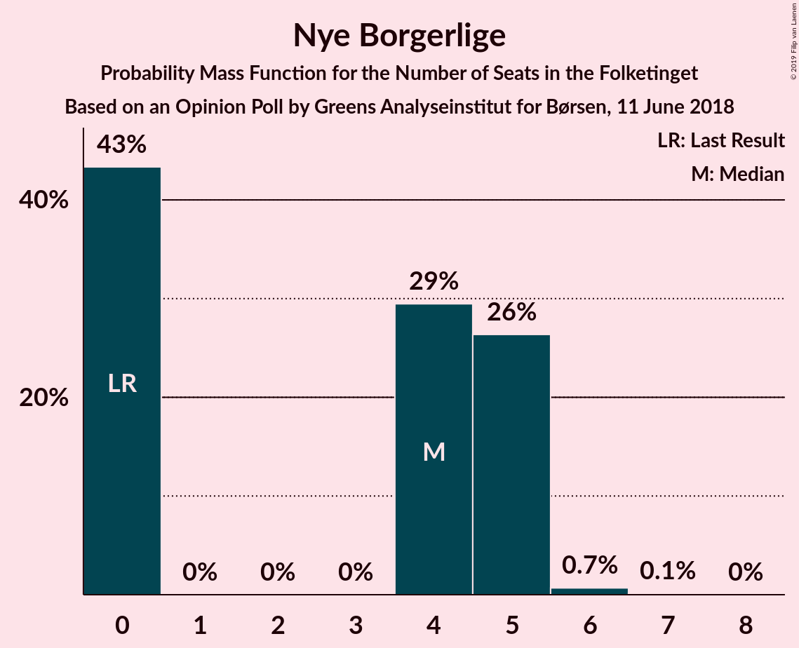
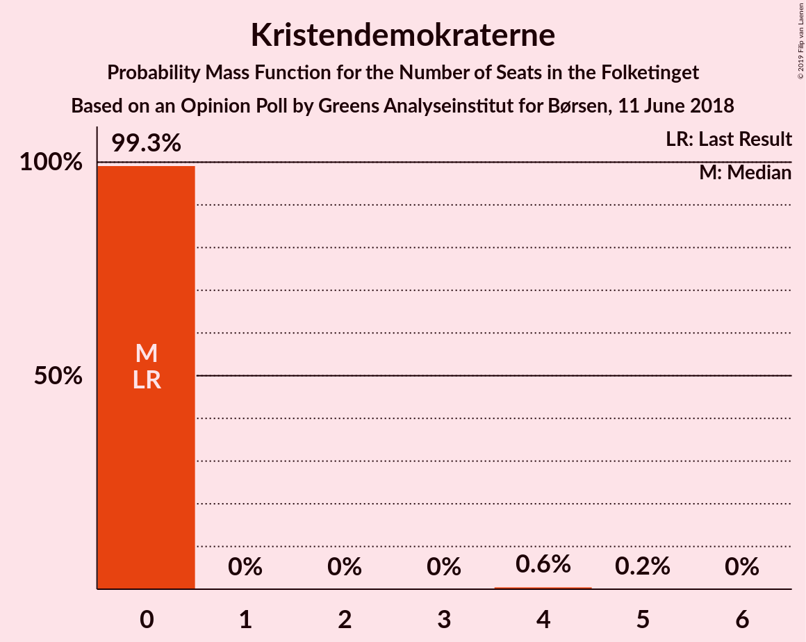
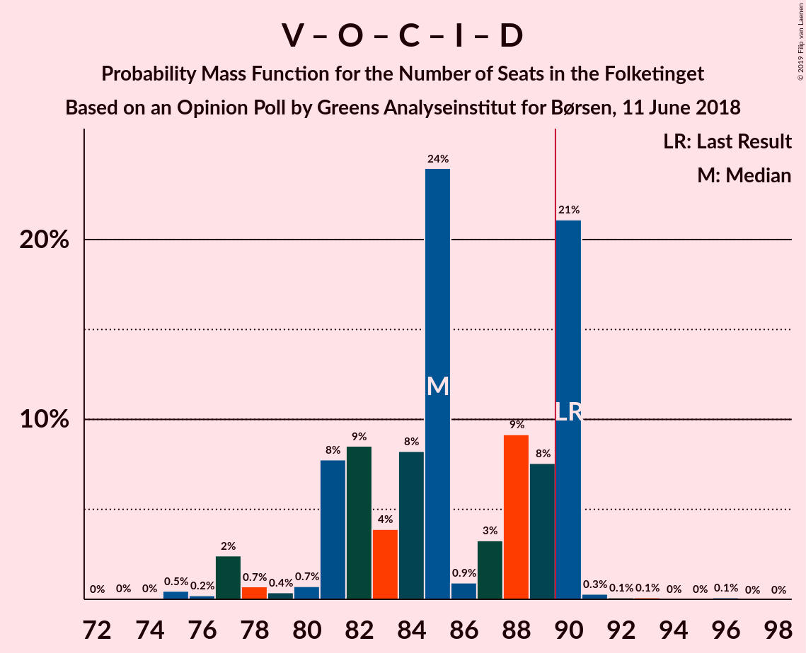
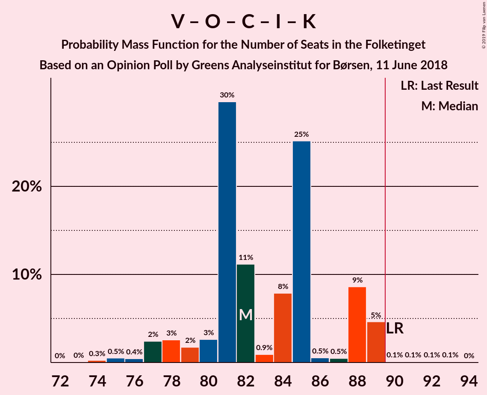
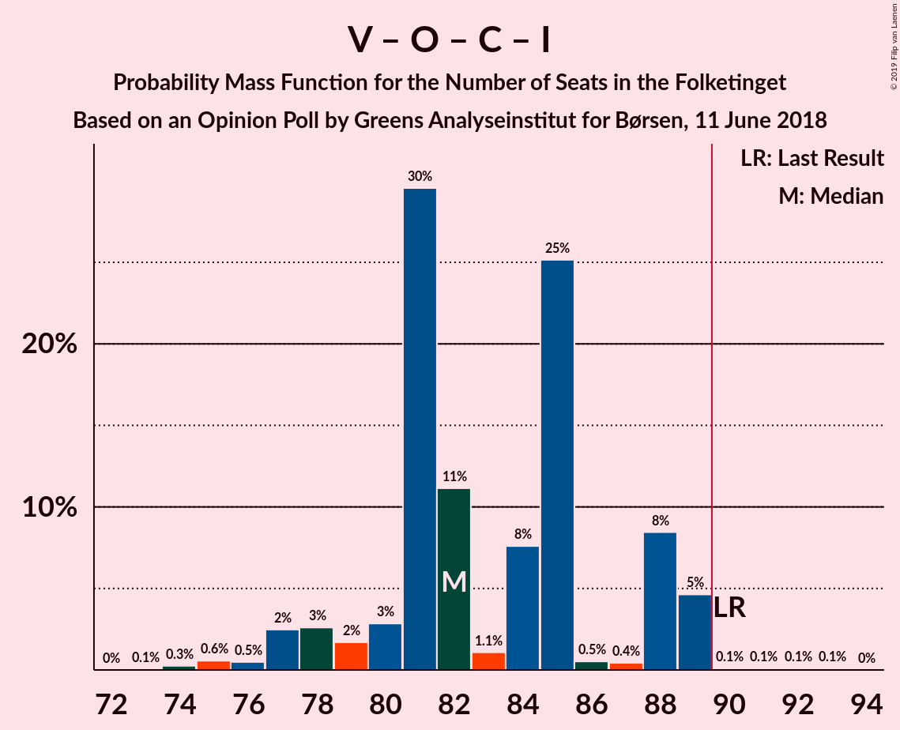
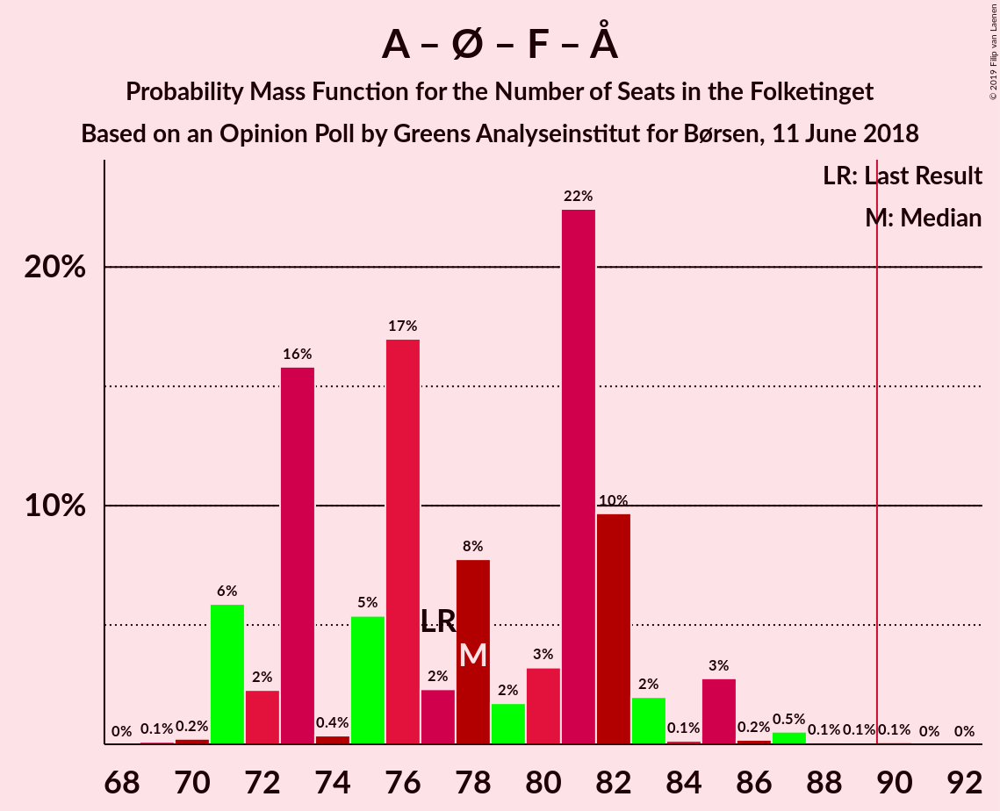

# Opinion Poll by Greens Analyseinstitut for Børsen, 11 June 2018

<a href="#voting-intentions">Voting Intentions</a> | <a href="#seats">Seats</a> | <a href="#coalitions">Coalitions</a> | <a href="#technical-information">Technical Information</a>

## Voting Intentions

### Confidence Intervals

| Party | Last Result | Poll Result | 80% Confidence Interval | 90% Confidence Interval | 95% Confidence Interval | 99% Confidence Interval |
|:-----:|:-----------:|:-----------:|:-----------------------:|:-----------------------:|:-----------------------:|:-----------------------:|
| Socialdemokraterne | 26.3% | 25.4% | 23.7–27.1% |23.3–27.6% |22.9–28.0% |22.1–28.9% |
| Venstre | 19.5% | 20.1% | 18.6–21.7% |18.2–22.2% |17.8–22.6% |17.1–23.4% |
| Dansk Folkeparti | 21.1% | 17.0% | 15.6–18.5% |15.2–19.0% |14.9–19.3% |14.3–20.1% |
| Enhedslisten–De Rød-Grønne | 7.8% | 8.9% | 7.9–10.1% |7.6–10.5% |7.4–10.7% |6.9–11.3% |
| Radikale Venstre | 4.6% | 6.7% | 5.8–7.8% |5.6–8.1% |5.4–8.4% |5.0–8.9% |
| Socialistisk Folkeparti | 4.2% | 5.6% | 4.8–6.6% |4.6–6.9% |4.4–7.2% |4.1–7.7% |
| Det Konservative Folkeparti | 3.4% | 4.7% | 4.0–5.7% |3.8–5.9% |3.6–6.2% |3.3–6.6% |
| Liberal Alliance | 7.5% | 4.1% | 3.4–5.0% |3.2–5.2% |3.1–5.4% |2.8–5.9% |
| Alternativet | 4.8% | 4.1% | 3.4–5.0% |3.2–5.2% |3.1–5.4% |2.8–5.9% |
| Nye Borgerlige | 0.0% | 1.9% | 1.5–2.6% |1.4–2.7% |1.2–2.9% |1.1–3.2% |
| Kristendemokraterne | 0.8% | 1.0% | 0.7–1.5% |0.6–1.7% |0.6–1.8% |0.4–2.1% |

*Note:* The poll result column reflects the actual value used in the calculations. Published results may vary slightly, and in addition be rounded to fewer digits.

## Seats

### Confidence Intervals

| Party | Last Result | Median | 80% Confidence Interval | 90% Confidence Interval | 95% Confidence Interval | 99% Confidence Interval |
|:-----:|:-----------:|:------:|:-----------------------:|:-----------------------:|:-----------------------:|:-----------------------:|
| <a href="#socialdemokraterne">Socialdemokraterne</a> | 47 | 41 | 35–44 |35–55 |35–55 |35–55 |
| <a href="#venstre">Venstre</a> | 34 | 36 | 35–36 |32–36 |32–43 |32–43 |
| <a href="#dansk-folkeparti">Dansk Folkeparti</a> | 37 | 34 | 30–34 |29–34 |29–34 |28–34 |
| <a href="#enhedslisten–de-rød-grønne">Enhedslisten–De Rød-Grønne</a> | 14 | 17 | 17 |14–20 |13–20 |13–20 |
| <a href="#radikale-venstre">Radikale Venstre</a> | 8 | 11 | 11–13 |10–13 |8–15 |8–15 |
| <a href="#socialistisk-folkeparti">Socialistisk Folkeparti</a> | 7 | 12 | 10–12 |8–13 |8–13 |8–13 |
| <a href="#det-konservative-folkeparti">Det Konservative Folkeparti</a> | 6 | 5 | 5–10 |5–11 |5–11 |5–11 |
| <a href="#liberal-alliance">Liberal Alliance</a> | 13 | 8 | 6–8 |5–8 |5–8 |5–9 |
| <a href="#alternativet">Alternativet</a> | 9 | 7 | 6–7 |5–7 |5–7 |5–9 |
| <a href="#nye-borgerlige">Nye Borgerlige</a> | 0 | 4 | 4 |0–5 |0–5 |0–5 |
| <a href="#kristendemokraterne">Kristendemokraterne</a> | 0 | 0 | 0 |0 |0–4 |0–4 |

### Socialdemokraterne

*For a full overview of the results for this party, see the [Socialdemokraterne](party-socialdemokraterne.html) page.*

| Number of Seats | Probability | Accumulated | Special Marks |
|:---------------:|:-----------:|:-----------:|:-------------:|
| 35 | 10% | 100% |  |
| 36 | 0% | 90% |  |
| 37 | 0.1% | 90% |  |
| 38 | 0% | 90% |  |
| 39 | 0.3% | 90% |  |
| 40 | 0.2% | 89% |  |
| 41 | 75% | 89% | Median |
| 42 | 2% | 14% |  |
| 43 | 0% | 12% |  |
| 44 | 4% | 12% |  |
| 45 | 0.1% | 8% |  |
| 46 | 0% | 7% |  |
| 47 | 2% | 7% | Last Result |
| 48 | 0% | 6% |  |
| 49 | 0% | 6% |  |
| 50 | 0% | 6% |  |
| 51 | 0% | 6% |  |
| 52 | 0% | 6% |  |
| 53 | 0% | 6% |  |
| 54 | 0% | 6% |  |
| 55 | 6% | 6% |  |
| 56 | 0% | 0% |  |

### Venstre

*For a full overview of the results for this party, see the [Venstre](party-venstre.html) page.*

| Number of Seats | Probability | Accumulated | Special Marks |
|:---------------:|:-----------:|:-----------:|:-------------:|
| 28 | 0.1% | 100% |  |
| 29 | 0% | 99.9% |  |
| 30 | 0% | 99.9% |  |
| 31 | 0% | 99.8% |  |
| 32 | 6% | 99.8% |  |
| 33 | 2% | 94% |  |
| 34 | 2% | 92% | Last Result |
| 35 | 8% | 90% |  |
| 36 | 80% | 83% | Median |
| 37 | 0% | 3% |  |
| 38 | 0% | 3% |  |
| 39 | 0% | 3% |  |
| 40 | 0% | 3% |  |
| 41 | 0% | 3% |  |
| 42 | 0% | 3% |  |
| 43 | 3% | 3% |  |
| 44 | 0% | 0% |  |

### Dansk Folkeparti

*For a full overview of the results for this party, see the [Dansk Folkeparti](party-danskfolkeparti.html) page.*

| Number of Seats | Probability | Accumulated | Special Marks |
|:---------------:|:-----------:|:-----------:|:-------------:|
| 25 | 0% | 100% |  |
| 26 | 0% | 99.9% |  |
| 27 | 0.3% | 99.9% |  |
| 28 | 2% | 99.6% |  |
| 29 | 6% | 98% |  |
| 30 | 3% | 92% |  |
| 31 | 2% | 89% |  |
| 32 | 8% | 88% |  |
| 33 | 5% | 80% |  |
| 34 | 75% | 76% | Median |
| 35 | 0% | 0.1% |  |
| 36 | 0% | 0.1% |  |
| 37 | 0% | 0.1% | Last Result |
| 38 | 0% | 0.1% |  |
| 39 | 0.1% | 0.1% |  |
| 40 | 0% | 0% |  |

### Enhedslisten–De Rød-Grønne

*For a full overview of the results for this party, see the [Enhedslisten–De Rød-Grønne](party-enhedslisten–derød-grønne.html) page.*

| Number of Seats | Probability | Accumulated | Special Marks |
|:---------------:|:-----------:|:-----------:|:-------------:|
| 13 | 4% | 100% |  |
| 14 | 3% | 96% | Last Result |
| 15 | 0.2% | 93% |  |
| 16 | 0.2% | 92% |  |
| 17 | 83% | 92% | Median |
| 18 | 2% | 9% |  |
| 19 | 0% | 8% |  |
| 20 | 8% | 8% |  |
| 21 | 0% | 0% |  |

### Radikale Venstre

*For a full overview of the results for this party, see the [Radikale Venstre](party-radikalevenstre.html) page.*

| Number of Seats | Probability | Accumulated | Special Marks |
|:---------------:|:-----------:|:-----------:|:-------------:|
| 8 | 4% | 100% | Last Result |
| 9 | 0% | 96% |  |
| 10 | 2% | 96% |  |
| 11 | 81% | 94% | Median |
| 12 | 0.3% | 12% |  |
| 13 | 8% | 12% |  |
| 14 | 2% | 4% |  |
| 15 | 3% | 3% |  |
| 16 | 0% | 0% |  |

### Socialistisk Folkeparti

*For a full overview of the results for this party, see the [Socialistisk Folkeparti](party-socialistiskfolkeparti.html) page.*

| Number of Seats | Probability | Accumulated | Special Marks |
|:---------------:|:-----------:|:-----------:|:-------------:|
| 7 | 0.1% | 100% | Last Result |
| 8 | 6% | 99.9% |  |
| 9 | 0.3% | 94% |  |
| 10 | 4% | 94% |  |
| 11 | 8% | 90% |  |
| 12 | 76% | 82% | Median |
| 13 | 6% | 6% |  |
| 14 | 0% | 0% |  |

### Det Konservative Folkeparti

*For a full overview of the results for this party, see the [Det Konservative Folkeparti](party-detkonservativefolkeparti.html) page.*

| Number of Seats | Probability | Accumulated | Special Marks |
|:---------------:|:-----------:|:-----------:|:-------------:|
| 5 | 75% | 100% | Median |
| 6 | 0% | 25% | Last Result |
| 7 | 0.1% | 25% |  |
| 8 | 2% | 24% |  |
| 9 | 10% | 23% |  |
| 10 | 3% | 13% |  |
| 11 | 10% | 10% |  |
| 12 | 0% | 0.1% |  |
| 13 | 0% | 0.1% |  |
| 14 | 0% | 0.1% |  |
| 15 | 0% | 0.1% |  |
| 16 | 0.1% | 0.1% |  |
| 17 | 0% | 0% |  |

### Liberal Alliance

*For a full overview of the results for this party, see the [Liberal Alliance](party-liberalalliance.html) page.*

| Number of Seats | Probability | Accumulated | Special Marks |
|:---------------:|:-----------:|:-----------:|:-------------:|
| 5 | 6% | 100% |  |
| 6 | 8% | 94% |  |
| 7 | 2% | 87% |  |
| 8 | 83% | 85% | Median |
| 9 | 2% | 2% |  |
| 10 | 0% | 0.4% |  |
| 11 | 0% | 0.4% |  |
| 12 | 0.4% | 0.4% |  |
| 13 | 0% | 0% | Last Result |

### Alternativet

*For a full overview of the results for this party, see the [Alternativet](party-alternativet.html) page.*

| Number of Seats | Probability | Accumulated | Special Marks |
|:---------------:|:-----------:|:-----------:|:-------------:|
| 5 | 6% | 100% |  |
| 6 | 4% | 94% |  |
| 7 | 87% | 90% | Median |
| 8 | 2% | 2% |  |
| 9 | 0.5% | 0.6% | Last Result |
| 10 | 0.1% | 0.1% |  |
| 11 | 0% | 0% |  |

### Nye Borgerlige

*For a full overview of the results for this party, see the [Nye Borgerlige](party-nyeborgerlige.html) page.*

| Number of Seats | Probability | Accumulated | Special Marks |
|:---------------:|:-----------:|:-----------:|:-------------:|
| 0 | 7% | 100% | Last Result |
| 1 | 0% | 93% |  |
| 2 | 0% | 93% |  |
| 3 | 0% | 93% |  |
| 4 | 85% | 93% | Median |
| 5 | 8% | 8% |  |
| 6 | 0% | 0% |  |

### Kristendemokraterne

*For a full overview of the results for this party, see the [Kristendemokraterne](party-kristendemokraterne.html) page.*

| Number of Seats | Probability | Accumulated | Special Marks |
|:---------------:|:-----------:|:-----------:|:-------------:|
| 0 | 95% | 100% | Last Result, Median |
| 1 | 0% | 5% |  |
| 2 | 0% | 5% |  |
| 3 | 0.3% | 5% |  |
| 4 | 4% | 5% |  |
| 5 | 0% | 0.1% |  |
| 6 | 0.1% | 0.1% |  |
| 7 | 0% | 0% |  |

## Coalitions

### Confidence Intervals

| Coalition | Last Result | Median | Majority? | 80% Confidence Interval | 90% Confidence Interval | 95% Confidence Interval | 99% Confidence Interval |
|:---------:|:-----------:|:------:|:---------:|:-----------------------:|:-----------------------:|:-----------------------:|:-----------------------:|
| Socialdemokraterne – Enhedslisten–De Rød-Grønne – Radikale Venstre – Socialistisk Folkeparti – Alternativet | 85 | 88 | 9% | 86–88 | 85–96 | 80–96 | 80–96 |
| Venstre – Dansk Folkeparti – Det Konservative Folkeparti – Liberal Alliance – Nye Borgerlige – Kristendemokraterne | 90 | 87 | 7% | 87–89 | 79–90 | 79–95 | 79–95 |
| Venstre – Dansk Folkeparti – Det Konservative Folkeparti – Liberal Alliance – Nye Borgerlige | 90 | 87 | 3% | 86–89 | 79–89 | 79–95 | 79–95 |
| Venstre – Dansk Folkeparti – Det Konservative Folkeparti – Liberal Alliance – Kristendemokraterne | 90 | 83 | 7% | 83–84 | 75–90 | 75–91 | 75–91 |
| Venstre – Dansk Folkeparti – Det Konservative Folkeparti – Liberal Alliance | 90 | 83 | 3% | 83–84 | 75–86 | 75–91 | 75–91 |
| Socialdemokraterne – Enhedslisten–De Rød-Grønne – Radikale Venstre – Socialistisk Folkeparti | 76 | 81 | 6% | 79–81 | 78–91 | 74–91 | 74–91 |
| Socialdemokraterne – Enhedslisten–De Rød-Grønne – Socialistisk Folkeparti – Alternativet | 77 | 77 | 0% | 73–77 | 73–85 | 65–85 | 65–85 |
| Socialdemokraterne – Enhedslisten–De Rød-Grønne – Socialistisk Folkeparti | 68 | 70 | 0% | 66–70 | 66–80 | 59–80 | 59–80 |
| Socialdemokraterne – Radikale Venstre – Socialistisk Folkeparti | 62 | 64 | 0% | 60–65 | 59–74 | 59–74 | 59–74 |
| Socialdemokraterne – Radikale Venstre | 55 | 52 | 0% | 50–52 | 48–66 | 48–66 | 48–66 |
| Venstre – Det Konservative Folkeparti – Liberal Alliance | 53 | 49 | 0% | 49–52 | 46–53 | 46–61 | 46–61 |
| Venstre – Det Konservative Folkeparti | 40 | 41 | 0% | 41–46 | 41–46 | 41–53 | 41–53 |
| Venstre | 34 | 36 | 0% | 35–36 | 32–36 | 32–43 | 32–43 |

### Socialdemokraterne – Enhedslisten–De Rød-Grønne – Radikale Venstre – Socialistisk Folkeparti – Alternativet

| Number of Seats | Probability | Accumulated | Special Marks |
|:---------------:|:-----------:|:-----------:|:-------------:|
| 80 | 3% | 100% |  |
| 81 | 0% | 97% |  |
| 82 | 0% | 97% |  |
| 83 | 0.4% | 97% |  |
| 84 | 0.1% | 97% |  |
| 85 | 4% | 97% | Last Result |
| 86 | 8% | 93% |  |
| 87 | 0% | 85% |  |
| 88 | 75% | 85% | Median |
| 89 | 0.2% | 9% |  |
| 90 | 2% | 9% | Majority |
| 91 | 0% | 8% |  |
| 92 | 0% | 8% |  |
| 93 | 0% | 8% |  |
| 94 | 0% | 8% |  |
| 95 | 2% | 8% |  |
| 96 | 6% | 6% |  |
| 97 | 0% | 0% |  |

### Venstre – Dansk Folkeparti – Det Konservative Folkeparti – Liberal Alliance – Nye Borgerlige – Kristendemokraterne

| Number of Seats | Probability | Accumulated | Special Marks |
|:---------------:|:-----------:|:-----------:|:-------------:|
| 79 | 6% | 100% |  |
| 80 | 2% | 94% |  |
| 81 | 0% | 92% |  |
| 82 | 0% | 92% |  |
| 83 | 0% | 92% |  |
| 84 | 0% | 92% |  |
| 85 | 2% | 92% |  |
| 86 | 0.2% | 91% |  |
| 87 | 75% | 91% | Median |
| 88 | 0% | 15% |  |
| 89 | 8% | 15% |  |
| 90 | 4% | 7% | Last Result, Majority |
| 91 | 0.1% | 3% |  |
| 92 | 0.4% | 3% |  |
| 93 | 0% | 3% |  |
| 94 | 0% | 3% |  |
| 95 | 3% | 3% |  |
| 96 | 0% | 0% |  |

### Venstre – Dansk Folkeparti – Det Konservative Folkeparti – Liberal Alliance – Nye Borgerlige

| Number of Seats | Probability | Accumulated | Special Marks |
|:---------------:|:-----------:|:-----------:|:-------------:|
| 79 | 6% | 100% |  |
| 80 | 2% | 94% |  |
| 81 | 0% | 92% |  |
| 82 | 0% | 92% |  |
| 83 | 0% | 92% |  |
| 84 | 0% | 92% |  |
| 85 | 2% | 92% |  |
| 86 | 4% | 91% |  |
| 87 | 75% | 86% | Median |
| 88 | 0% | 11% |  |
| 89 | 8% | 11% |  |
| 90 | 0% | 3% | Last Result, Majority |
| 91 | 0.1% | 3% |  |
| 92 | 0.1% | 3% |  |
| 93 | 0% | 3% |  |
| 94 | 0% | 3% |  |
| 95 | 3% | 3% |  |
| 96 | 0% | 0% |  |

### Venstre – Dansk Folkeparti – Det Konservative Folkeparti – Liberal Alliance – Kristendemokraterne

| Number of Seats | Probability | Accumulated | Special Marks |
|:---------------:|:-----------:|:-----------:|:-------------:|
| 75 | 6% | 100% |  |
| 76 | 0% | 94% |  |
| 77 | 0% | 94% |  |
| 78 | 0% | 94% |  |
| 79 | 0% | 94% |  |
| 80 | 2% | 94% |  |
| 81 | 2% | 92% |  |
| 82 | 0% | 91% |  |
| 83 | 75% | 91% | Median |
| 84 | 8% | 15% |  |
| 85 | 0% | 8% |  |
| 86 | 0.2% | 8% |  |
| 87 | 0.4% | 7% |  |
| 88 | 0% | 7% |  |
| 89 | 0% | 7% |  |
| 90 | 4% | 7% | Last Result, Majority |
| 91 | 3% | 3% |  |
| 92 | 0% | 0% |  |

### Venstre – Dansk Folkeparti – Det Konservative Folkeparti – Liberal Alliance

| Number of Seats | Probability | Accumulated | Special Marks |
|:---------------:|:-----------:|:-----------:|:-------------:|
| 75 | 6% | 100% |  |
| 76 | 0% | 94% |  |
| 77 | 0% | 94% |  |
| 78 | 0% | 94% |  |
| 79 | 0% | 94% |  |
| 80 | 2% | 94% |  |
| 81 | 2% | 92% |  |
| 82 | 0% | 91% |  |
| 83 | 75% | 91% | Median |
| 84 | 8% | 15% |  |
| 85 | 0% | 7% |  |
| 86 | 4% | 7% |  |
| 87 | 0.1% | 3% |  |
| 88 | 0% | 3% |  |
| 89 | 0% | 3% |  |
| 90 | 0% | 3% | Last Result, Majority |
| 91 | 3% | 3% |  |
| 92 | 0% | 0% |  |

### Socialdemokraterne – Enhedslisten–De Rød-Grønne – Radikale Venstre – Socialistisk Folkeparti

| Number of Seats | Probability | Accumulated | Special Marks |
|:---------------:|:-----------:|:-----------:|:-------------:|
| 74 | 3% | 100% |  |
| 75 | 0% | 97% |  |
| 76 | 0% | 97% | Last Result |
| 77 | 0% | 97% |  |
| 78 | 5% | 97% |  |
| 79 | 8% | 93% |  |
| 80 | 0.1% | 85% |  |
| 81 | 75% | 85% | Median |
| 82 | 0% | 9% |  |
| 83 | 0% | 9% |  |
| 84 | 2% | 9% |  |
| 85 | 0% | 8% |  |
| 86 | 0% | 8% |  |
| 87 | 2% | 8% |  |
| 88 | 0% | 6% |  |
| 89 | 0% | 6% |  |
| 90 | 0% | 6% | Majority |
| 91 | 6% | 6% |  |
| 92 | 0% | 0% |  |

### Socialdemokraterne – Enhedslisten–De Rød-Grønne – Socialistisk Folkeparti – Alternativet

| Number of Seats | Probability | Accumulated | Special Marks |
|:---------------:|:-----------:|:-----------:|:-------------:|
| 65 | 3% | 100% |  |
| 66 | 0% | 97% |  |
| 67 | 0% | 97% |  |
| 68 | 0% | 97% |  |
| 69 | 0% | 97% |  |
| 70 | 0% | 97% |  |
| 71 | 0.3% | 97% |  |
| 72 | 0.1% | 97% |  |
| 73 | 8% | 97% |  |
| 74 | 0.1% | 89% |  |
| 75 | 0% | 89% |  |
| 76 | 0.1% | 89% |  |
| 77 | 80% | 89% | Last Result, Median |
| 78 | 0% | 9% |  |
| 79 | 0.1% | 9% |  |
| 80 | 2% | 9% |  |
| 81 | 2% | 8% |  |
| 82 | 0% | 6% |  |
| 83 | 0% | 6% |  |
| 84 | 0% | 6% |  |
| 85 | 6% | 6% |  |
| 86 | 0% | 0% |  |

### Socialdemokraterne – Enhedslisten–De Rød-Grønne – Socialistisk Folkeparti

| Number of Seats | Probability | Accumulated | Special Marks |
|:---------------:|:-----------:|:-----------:|:-------------:|
| 59 | 3% | 100% |  |
| 60 | 0% | 97% |  |
| 61 | 0% | 97% |  |
| 62 | 0.3% | 97% |  |
| 63 | 0.1% | 97% |  |
| 64 | 0% | 97% |  |
| 65 | 0% | 97% |  |
| 66 | 8% | 97% |  |
| 67 | 0.1% | 89% |  |
| 68 | 0.1% | 89% | Last Result |
| 69 | 0.1% | 89% |  |
| 70 | 80% | 89% | Median |
| 71 | 0% | 9% |  |
| 72 | 0% | 9% |  |
| 73 | 2% | 9% |  |
| 74 | 2% | 7% |  |
| 75 | 0% | 6% |  |
| 76 | 0% | 6% |  |
| 77 | 0% | 6% |  |
| 78 | 0% | 6% |  |
| 79 | 0% | 6% |  |
| 80 | 6% | 6% |  |
| 81 | 0% | 0% |  |

### Socialdemokraterne – Radikale Venstre – Socialistisk Folkeparti

| Number of Seats | Probability | Accumulated | Special Marks |
|:---------------:|:-----------:|:-----------:|:-------------:|
| 59 | 8% | 100% |  |
| 60 | 3% | 92% |  |
| 61 | 0% | 89% |  |
| 62 | 0.1% | 89% | Last Result |
| 63 | 0% | 89% |  |
| 64 | 75% | 89% | Median |
| 65 | 5% | 14% |  |
| 66 | 0% | 9% |  |
| 67 | 2% | 9% |  |
| 68 | 0% | 8% |  |
| 69 | 2% | 8% |  |
| 70 | 0% | 6% |  |
| 71 | 0% | 6% |  |
| 72 | 0% | 6% |  |
| 73 | 0% | 6% |  |
| 74 | 6% | 6% |  |
| 75 | 0% | 0% |  |

### Socialdemokraterne – Radikale Venstre

| Number of Seats | Probability | Accumulated | Special Marks |
|:---------------:|:-----------:|:-----------:|:-------------:|
| 48 | 8% | 100% |  |
| 49 | 0% | 92% |  |
| 50 | 3% | 92% |  |
| 51 | 0.3% | 90% |  |
| 52 | 80% | 89% | Median |
| 53 | 0% | 9% |  |
| 54 | 0% | 9% |  |
| 55 | 0% | 9% | Last Result |
| 56 | 2% | 9% |  |
| 57 | 2% | 8% |  |
| 58 | 0.1% | 6% |  |
| 59 | 0% | 6% |  |
| 60 | 0% | 6% |  |
| 61 | 0% | 6% |  |
| 62 | 0% | 6% |  |
| 63 | 0% | 6% |  |
| 64 | 0% | 6% |  |
| 65 | 0% | 6% |  |
| 66 | 6% | 6% |  |
| 67 | 0% | 0% |  |

### Venstre – Det Konservative Folkeparti – Liberal Alliance

| Number of Seats | Probability | Accumulated | Special Marks |
|:---------------:|:-----------:|:-----------:|:-------------:|
| 46 | 6% | 100% |  |
| 47 | 0.1% | 94% |  |
| 48 | 0% | 94% |  |
| 49 | 75% | 94% | Median |
| 50 | 2% | 19% |  |
| 51 | 0% | 17% |  |
| 52 | 9% | 17% |  |
| 53 | 4% | 8% | Last Result |
| 54 | 0% | 3% |  |
| 55 | 0.1% | 3% |  |
| 56 | 0% | 3% |  |
| 57 | 0.3% | 3% |  |
| 58 | 0.1% | 3% |  |
| 59 | 0% | 3% |  |
| 60 | 0% | 3% |  |
| 61 | 3% | 3% |  |
| 62 | 0% | 0% |  |

### Venstre – Det Konservative Folkeparti

| Number of Seats | Probability | Accumulated | Special Marks |
|:---------------:|:-----------:|:-----------:|:-------------:|
| 39 | 0.2% | 100% |  |
| 40 | 0% | 99.8% | Last Result |
| 41 | 83% | 99.8% | Median |
| 42 | 0% | 17% |  |
| 43 | 0.1% | 17% |  |
| 44 | 0.1% | 17% |  |
| 45 | 6% | 17% |  |
| 46 | 8% | 10% |  |
| 47 | 0% | 3% |  |
| 48 | 0% | 3% |  |
| 49 | 0% | 3% |  |
| 50 | 0% | 3% |  |
| 51 | 0.1% | 3% |  |
| 52 | 0% | 3% |  |
| 53 | 3% | 3% |  |
| 54 | 0% | 0% |  |

### Venstre

| Number of Seats | Probability | Accumulated | Special Marks |
|:---------------:|:-----------:|:-----------:|:-------------:|
| 28 | 0.1% | 100% |  |
| 29 | 0% | 99.9% |  |
| 30 | 0% | 99.9% |  |
| 31 | 0% | 99.8% |  |
| 32 | 6% | 99.8% |  |
| 33 | 2% | 94% |  |
| 34 | 2% | 92% | Last Result |
| 35 | 8% | 90% |  |
| 36 | 80% | 83% | Median |
| 37 | 0% | 3% |  |
| 38 | 0% | 3% |  |
| 39 | 0% | 3% |  |
| 40 | 0% | 3% |  |
| 41 | 0% | 3% |  |
| 42 | 0% | 3% |  |
| 43 | 3% | 3% |  |
| 44 | 0% | 0% |  |

## Technical Information

### Opinion Poll

+ **Polling firm:** Greens Analyseinstitut
+ **Commissioner(s):** Børsen
+ **Fieldwork period:** 11 June 2018

### Calculations

+ **Sample size:** 1100
+ **Simulations done:** 1,024
+ **Error estimate:** 3.14%

