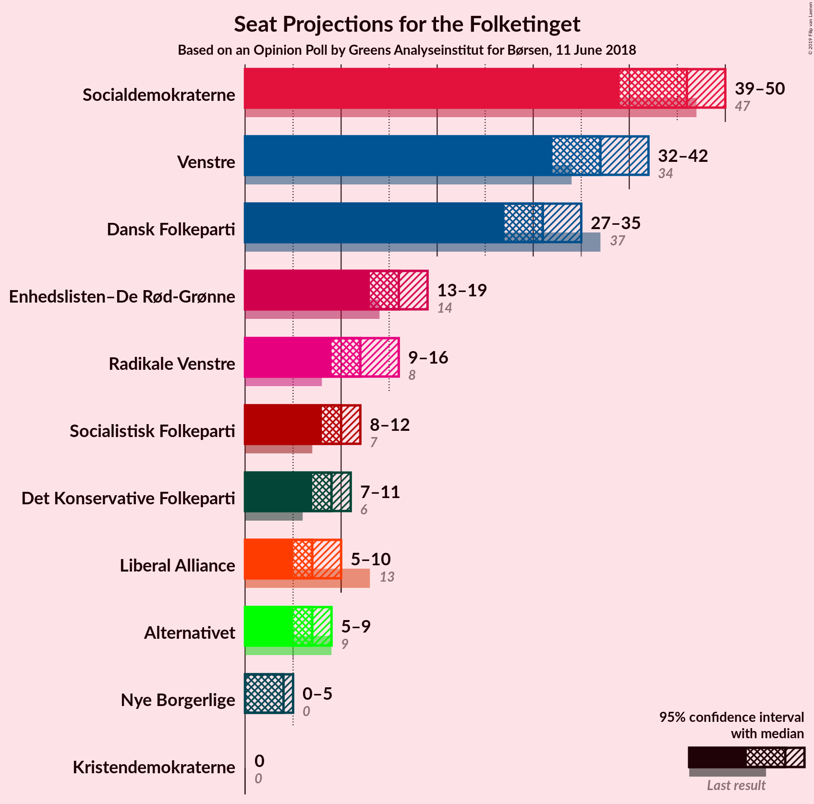
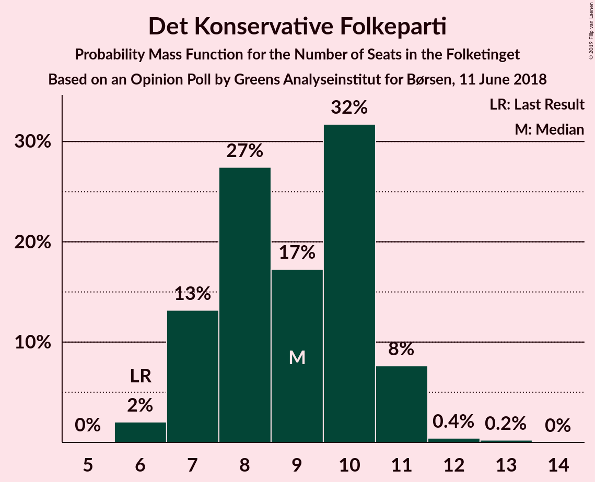
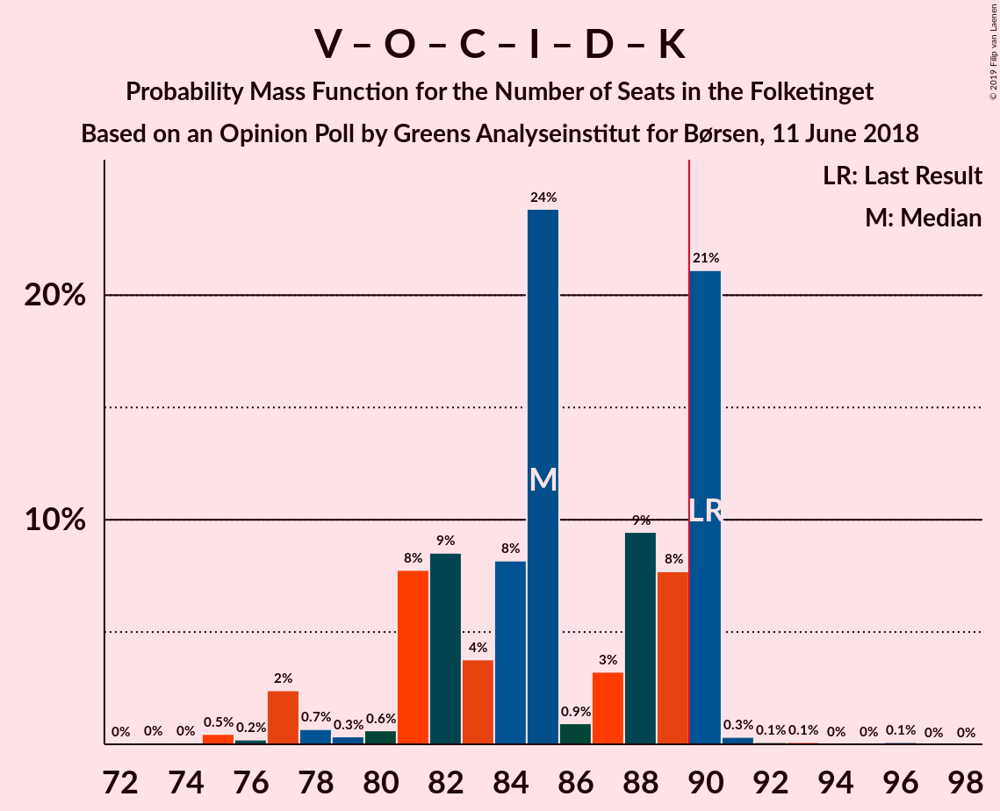
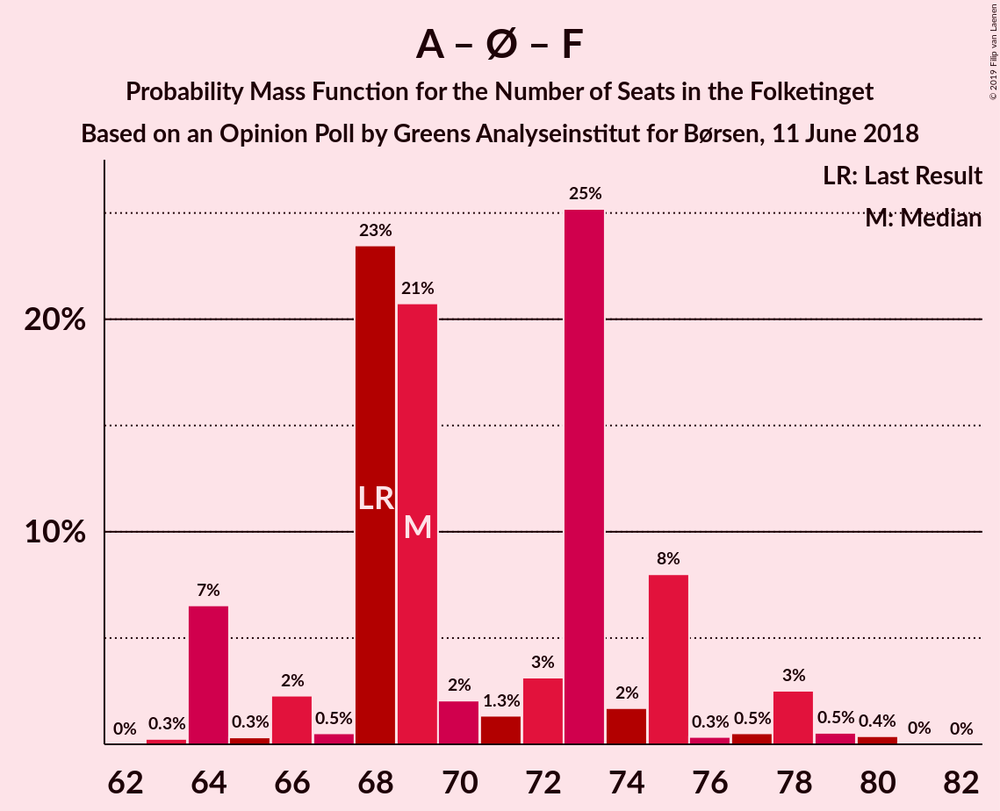
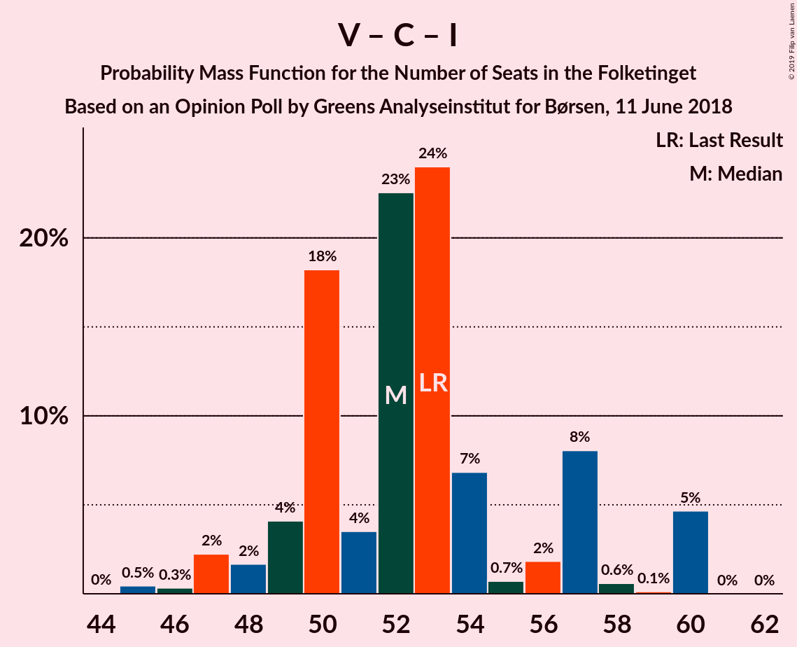

# Opinion Poll by Greens Analyseinstitut for Børsen, 11 June 2018

<a href="#voting-intentions">Voting Intentions</a> | <a href="#seats">Seats</a> | <a href="#coalitions">Coalitions</a> | <a href="#technical-information">Technical Information</a>

## Voting Intentions

### Confidence Intervals

| Party | Last Result | Poll Result | 80% Confidence Interval | 90% Confidence Interval | 95% Confidence Interval | 99% Confidence Interval |
|:-----:|:-----------:|:-----------:|:-----------------------:|:-----------------------:|:-----------------------:|:-----------------------:|
| Socialdemokraterne | 26.3% | 25.4% | 23.8–27.2% |23.3–27.7% |22.9–28.1% |22.1–29.0% |
| Venstre | 19.5% | 20.1% | 18.6–21.8% |18.2–22.2% |17.8–22.6% |17.1–23.4% |
| Dansk Folkeparti | 21.1% | 17.0% | 15.6–18.5% |15.2–19.0% |14.8–19.3% |14.2–20.1% |
| Enhedslisten–De Rød-Grønne | 7.8% | 8.9% | 7.9–10.1% |7.6–10.5% |7.3–10.8% |6.9–11.4% |
| Radikale Venstre | 4.6% | 6.7% | 5.8–7.8% |5.5–8.1% |5.3–8.3% |4.9–8.9% |
| Socialistisk Folkeparti | 4.2% | 5.6% | 4.8–6.6% |4.5–6.9% |4.3–7.1% |4.0–7.6% |
| Det Konservative Folkeparti | 3.4% | 4.7% | 4.0–5.7% |3.8–5.9% |3.6–6.2% |3.3–6.7% |
| Liberal Alliance | 7.5% | 4.1% | 3.4–5.0% |3.2–5.2% |3.0–5.4% |2.8–5.9% |
| Alternativet | 4.8% | 4.1% | 3.4–5.0% |3.2–5.2% |3.0–5.4% |2.8–5.9% |
| Nye Borgerlige | 0.0% | 1.9% | 1.4–2.5% |1.3–2.7% |1.2–2.9% |1.0–3.2% |
| Kristendemokraterne | 0.8% | 1.0% | 0.7–1.5% |0.6–1.7% |0.6–1.8% |0.5–2.1% |

*Note:* The poll result column reflects the actual value used in the calculations. Published results may vary slightly, and in addition be rounded to fewer digits.

## Seats

### Confidence Intervals

| Party | Last Result | Median | 80% Confidence Interval | 90% Confidence Interval | 95% Confidence Interval | 99% Confidence Interval |
|:-----:|:-----------:|:------:|:-----------------------:|:-----------------------:|:-----------------------:|:-----------------------:|
| <a href="#socialdemokraterne">Socialdemokraterne</a> | 47 | 46 | 42–49 |39–50 |39–50 |39–52 |
| <a href="#venstre">Venstre</a> | 34 | 37 | 33–39 |32–42 |32–42 |31–42 |
| <a href="#dansk-folkeparti">Dansk Folkeparti</a> | 37 | 31 | 28–32 |27–35 |27–35 |25–36 |
| <a href="#enhedslisten–de-rød-grønne">Enhedslisten–De Rød-Grønne</a> | 14 | 16 | 14–17 |13–18 |13–19 |12–21 |
| <a href="#radikale-venstre">Radikale Venstre</a> | 8 | 12 | 9–15 |9–16 |9–16 |9–17 |
| <a href="#socialistisk-folkeparti">Socialistisk Folkeparti</a> | 7 | 10 | 8–11 |8–11 |8–12 |6–13 |
| <a href="#det-konservative-folkeparti">Det Konservative Folkeparti</a> | 6 | 9 | 7–10 |7–11 |7–11 |6–12 |
| <a href="#liberal-alliance">Liberal Alliance</a> | 13 | 7 | 6–10 |5–10 |5–10 |5–12 |
| <a href="#alternativet">Alternativet</a> | 9 | 7 | 5–9 |5–9 |5–9 |5–10 |
| <a href="#nye-borgerlige">Nye Borgerlige</a> | 0 | 4 | 0–5 |0–5 |0–5 |0–6 |
| <a href="#kristendemokraterne">Kristendemokraterne</a> | 0 | 0 | 0 |0 |0 |0–4 |

### Socialdemokraterne

*For a full overview of the results for this party, see the [Socialdemokraterne](party-socialdemokraterne.html) page.*

| Number of Seats | Probability | Accumulated | Special Marks |
|:---------------:|:-----------:|:-----------:|:-------------:|
| 37 | 0.2% | 100% |  |
| 38 | 0.1% | 99.8% |  |
| 39 | 7% | 99.7% |  |
| 40 | 0.1% | 93% |  |
| 41 | 3% | 93% |  |
| 42 | 2% | 90% |  |
| 43 | 24% | 88% |  |
| 44 | 6% | 64% |  |
| 45 | 5% | 58% |  |
| 46 | 35% | 53% | Median |
| 47 | 1.3% | 18% | Last Result |
| 48 | 4% | 17% |  |
| 49 | 8% | 13% |  |
| 50 | 4% | 5% |  |
| 51 | 0.7% | 2% |  |
| 52 | 0.5% | 0.9% |  |
| 53 | 0.3% | 0.4% |  |
| 54 | 0.1% | 0.1% |  |
| 55 | 0% | 0% |  |

### Venstre

*For a full overview of the results for this party, see the [Venstre](party-venstre.html) page.*

| Number of Seats | Probability | Accumulated | Special Marks |
|:---------------:|:-----------:|:-----------:|:-------------:|
| 29 | 0% | 100% |  |
| 30 | 0.1% | 99.9% |  |
| 31 | 2% | 99.8% |  |
| 32 | 3% | 98% |  |
| 33 | 10% | 95% |  |
| 34 | 4% | 84% | Last Result |
| 35 | 24% | 80% |  |
| 36 | 6% | 57% |  |
| 37 | 22% | 50% | Median |
| 38 | 16% | 29% |  |
| 39 | 6% | 13% |  |
| 40 | 1.2% | 7% |  |
| 41 | 0.1% | 5% |  |
| 42 | 5% | 5% |  |
| 43 | 0% | 0.1% |  |
| 44 | 0.1% | 0.1% |  |
| 45 | 0% | 0% |  |

### Dansk Folkeparti

*For a full overview of the results for this party, see the [Dansk Folkeparti](party-danskfolkeparti.html) page.*

| Number of Seats | Probability | Accumulated | Special Marks |
|:---------------:|:-----------:|:-----------:|:-------------:|
| 24 | 0.1% | 100% |  |
| 25 | 1.1% | 99.9% |  |
| 26 | 0.5% | 98.8% |  |
| 27 | 6% | 98% |  |
| 28 | 3% | 93% |  |
| 29 | 28% | 90% |  |
| 30 | 8% | 62% |  |
| 31 | 16% | 54% | Median |
| 32 | 29% | 38% |  |
| 33 | 3% | 9% |  |
| 34 | 1.3% | 6% |  |
| 35 | 4% | 5% |  |
| 36 | 0.7% | 1.1% |  |
| 37 | 0.3% | 0.4% | Last Result |
| 38 | 0.1% | 0.1% |  |
| 39 | 0% | 0% |  |

### Enhedslisten–De Rød-Grønne

*For a full overview of the results for this party, see the [Enhedslisten–De Rød-Grønne](party-enhedslisten–derød-grønne.html) page.*

| Number of Seats | Probability | Accumulated | Special Marks |
|:---------------:|:-----------:|:-----------:|:-------------:|
| 11 | 0.2% | 100% |  |
| 12 | 0.5% | 99.8% |  |
| 13 | 6% | 99.3% |  |
| 14 | 7% | 94% | Last Result |
| 15 | 25% | 87% |  |
| 16 | 40% | 62% | Median |
| 17 | 16% | 22% |  |
| 18 | 4% | 6% |  |
| 19 | 2% | 3% |  |
| 20 | 0.2% | 0.9% |  |
| 21 | 0.7% | 0.7% |  |
| 22 | 0% | 0.1% |  |
| 23 | 0% | 0% |  |

### Radikale Venstre

*For a full overview of the results for this party, see the [Radikale Venstre](party-radikalevenstre.html) page.*

| Number of Seats | Probability | Accumulated | Special Marks |
|:---------------:|:-----------:|:-----------:|:-------------:|
| 8 | 0.1% | 100% | Last Result |
| 9 | 24% | 99.9% |  |
| 10 | 4% | 76% |  |
| 11 | 22% | 72% |  |
| 12 | 22% | 50% | Median |
| 13 | 5% | 28% |  |
| 14 | 9% | 23% |  |
| 15 | 6% | 14% |  |
| 16 | 7% | 7% |  |
| 17 | 0.6% | 0.6% |  |
| 18 | 0% | 0% |  |

### Socialistisk Folkeparti

*For a full overview of the results for this party, see the [Socialistisk Folkeparti](party-socialistiskfolkeparti.html) page.*

| Number of Seats | Probability | Accumulated | Special Marks |
|:---------------:|:-----------:|:-----------:|:-------------:|
| 6 | 0.8% | 100% |  |
| 7 | 0.7% | 99.2% | Last Result |
| 8 | 21% | 98.5% |  |
| 9 | 22% | 77% |  |
| 10 | 16% | 55% | Median |
| 11 | 34% | 39% |  |
| 12 | 3% | 4% |  |
| 13 | 0.7% | 1.0% |  |
| 14 | 0.3% | 0.3% |  |
| 15 | 0.1% | 0.1% |  |
| 16 | 0% | 0% |  |

### Det Konservative Folkeparti

*For a full overview of the results for this party, see the [Det Konservative Folkeparti](party-detkonservativefolkeparti.html) page.*

| Number of Seats | Probability | Accumulated | Special Marks |
|:---------------:|:-----------:|:-----------:|:-------------:|
| 6 | 2% | 100% | Last Result |
| 7 | 13% | 98% |  |
| 8 | 27% | 85% |  |
| 9 | 17% | 57% | Median |
| 10 | 32% | 40% |  |
| 11 | 8% | 8% |  |
| 12 | 0.4% | 0.7% |  |
| 13 | 0.2% | 0.2% |  |
| 14 | 0% | 0% |  |

### Liberal Alliance

*For a full overview of the results for this party, see the [Liberal Alliance](party-liberalalliance.html) page.*

| Number of Seats | Probability | Accumulated | Special Marks |
|:---------------:|:-----------:|:-----------:|:-------------:|
| 5 | 5% | 100% |  |
| 6 | 16% | 95% |  |
| 7 | 45% | 79% | Median |
| 8 | 15% | 35% |  |
| 9 | 10% | 20% |  |
| 10 | 9% | 10% |  |
| 11 | 0.4% | 1.4% |  |
| 12 | 1.0% | 1.0% |  |
| 13 | 0% | 0% | Last Result |

### Alternativet

*For a full overview of the results for this party, see the [Alternativet](party-alternativet.html) page.*

| Number of Seats | Probability | Accumulated | Special Marks |
|:---------------:|:-----------:|:-----------:|:-------------:|
| 4 | 0.1% | 100% |  |
| 5 | 16% | 99.9% |  |
| 6 | 9% | 83% |  |
| 7 | 28% | 75% | Median |
| 8 | 36% | 47% |  |
| 9 | 8% | 11% | Last Result |
| 10 | 2% | 2% |  |
| 11 | 0.4% | 0.4% |  |
| 12 | 0% | 0% |  |

### Nye Borgerlige

*For a full overview of the results for this party, see the [Nye Borgerlige](party-nyeborgerlige.html) page.*

| Number of Seats | Probability | Accumulated | Special Marks |
|:---------------:|:-----------:|:-----------:|:-------------:|
| 0 | 43% | 100% | Last Result |
| 1 | 0% | 57% |  |
| 2 | 0% | 57% |  |
| 3 | 0% | 57% |  |
| 4 | 29% | 57% | Median |
| 5 | 26% | 27% |  |
| 6 | 0.7% | 0.8% |  |
| 7 | 0.1% | 0.1% |  |
| 8 | 0% | 0% |  |

### Kristendemokraterne

*For a full overview of the results for this party, see the [Kristendemokraterne](party-kristendemokraterne.html) page.*

| Number of Seats | Probability | Accumulated | Special Marks |
|:---------------:|:-----------:|:-----------:|:-------------:|
| 0 | 99.3% | 100% | Last Result, Median |
| 1 | 0% | 0.7% |  |
| 2 | 0% | 0.7% |  |
| 3 | 0% | 0.7% |  |
| 4 | 0.6% | 0.7% |  |
| 5 | 0.2% | 0.2% |  |
| 6 | 0% | 0% |  |

## Coalitions

### Confidence Intervals

| Coalition | Last Result | Median | Majority? | 80% Confidence Interval | 90% Confidence Interval | 95% Confidence Interval | 99% Confidence Interval |
|:---------:|:-----------:|:------:|:---------:|:-----------------------:|:-----------------------:|:-----------------------:|:-----------------------:|
| Socialdemokraterne – Enhedslisten–De Rød-Grønne – Radikale Venstre – Socialistisk Folkeparti – Alternativet | 85 | 90 | 57% | 85–94 | 85–94 | 85–98 | 84–100 |
| Socialdemokraterne – Enhedslisten–De Rød-Grønne – Radikale Venstre – Socialistisk Folkeparti | 76 | 82 | 3% | 79–86 | 78–87 | 78–91 | 77–92 |
| Venstre – Dansk Folkeparti – Det Konservative Folkeparti – Liberal Alliance – Nye Borgerlige – Kristendemokraterne | 90 | 85 | 22% | 81–90 | 81–90 | 77–90 | 75–91 |
| Venstre – Dansk Folkeparti – Det Konservative Folkeparti – Liberal Alliance – Nye Borgerlige | 90 | 85 | 22% | 81–90 | 81–90 | 77–90 | 75–91 |
| Venstre – Dansk Folkeparti – Det Konservative Folkeparti – Liberal Alliance – Kristendemokraterne | 90 | 82 | 0.4% | 80–88 | 78–89 | 77–89 | 75–89 |
| Venstre – Dansk Folkeparti – Det Konservative Folkeparti – Liberal Alliance | 90 | 82 | 0.4% | 80–88 | 78–89 | 77–89 | 75–89 |
| Socialdemokraterne – Enhedslisten–De Rød-Grønne – Socialistisk Folkeparti – Alternativet | 77 | 78 | 0.1% | 73–82 | 71–83 | 71–85 | 71–87 |
| Socialdemokraterne – Enhedslisten–De Rød-Grønne – Socialistisk Folkeparti | 68 | 69 | 0% | 68–75 | 64–75 | 64–78 | 64–79 |
| Socialdemokraterne – Radikale Venstre – Socialistisk Folkeparti | 62 | 66 | 0% | 63–71 | 62–72 | 62–73 | 61–75 |
| Socialdemokraterne – Radikale Venstre | 55 | 55 | 0% | 54–62 | 53–62 | 53–63 | 50–65 |
| Venstre – Det Konservative Folkeparti – Liberal Alliance | 53 | 52 | 0% | 50–57 | 49–58 | 47–60 | 45–60 |
| Venstre – Det Konservative Folkeparti | 40 | 45 | 0% | 43–47 | 41–50 | 40–51 | 39–51 |
| Venstre | 34 | 37 | 0% | 33–39 | 32–42 | 32–42 | 31–42 |

### Socialdemokraterne – Enhedslisten–De Rød-Grønne – Radikale Venstre – Socialistisk Folkeparti – Alternativet

| Number of Seats | Probability | Accumulated | Special Marks |
|:---------------:|:-----------:|:-----------:|:-------------:|
| 79 | 0.1% | 100% |  |
| 80 | 0% | 99.9% |  |
| 81 | 0% | 99.9% |  |
| 82 | 0.1% | 99.9% |  |
| 83 | 0.1% | 99.8% |  |
| 84 | 0.3% | 99.7% |  |
| 85 | 21% | 99.3% | Last Result |
| 86 | 8% | 78% |  |
| 87 | 9% | 71% |  |
| 88 | 3% | 61% |  |
| 89 | 0.9% | 58% |  |
| 90 | 24% | 57% | Majority |
| 91 | 8% | 33% | Median |
| 92 | 4% | 25% |  |
| 93 | 9% | 21% |  |
| 94 | 8% | 13% |  |
| 95 | 0.6% | 5% |  |
| 96 | 0.3% | 4% |  |
| 97 | 0.7% | 4% |  |
| 98 | 2% | 3% |  |
| 99 | 0.2% | 0.8% |  |
| 100 | 0.5% | 0.6% |  |
| 101 | 0% | 0.1% |  |
| 102 | 0% | 0.1% |  |
| 103 | 0% | 0% |  |

### Socialdemokraterne – Enhedslisten–De Rød-Grønne – Radikale Venstre – Socialistisk Folkeparti

| Number of Seats | Probability | Accumulated | Special Marks |
|:---------------:|:-----------:|:-----------:|:-------------:|
| 73 | 0.1% | 100% |  |
| 74 | 0% | 99.9% |  |
| 75 | 0.1% | 99.9% |  |
| 76 | 0.1% | 99.8% | Last Result |
| 77 | 0.3% | 99.6% |  |
| 78 | 7% | 99.3% |  |
| 79 | 9% | 93% |  |
| 80 | 23% | 84% |  |
| 81 | 5% | 61% |  |
| 82 | 23% | 56% |  |
| 83 | 2% | 32% |  |
| 84 | 7% | 31% | Median |
| 85 | 9% | 23% |  |
| 86 | 8% | 14% |  |
| 87 | 2% | 6% |  |
| 88 | 0.6% | 5% |  |
| 89 | 0.5% | 4% |  |
| 90 | 0.4% | 3% | Majority |
| 91 | 2% | 3% |  |
| 92 | 0.5% | 0.6% |  |
| 93 | 0.1% | 0.1% |  |
| 94 | 0% | 0% |  |

### Venstre – Dansk Folkeparti – Det Konservative Folkeparti – Liberal Alliance – Nye Borgerlige – Kristendemokraterne

| Number of Seats | Probability | Accumulated | Special Marks |
|:---------------:|:-----------:|:-----------:|:-------------:|
| 73 | 0% | 100% |  |
| 74 | 0% | 99.9% |  |
| 75 | 0.5% | 99.9% |  |
| 76 | 0.2% | 99.4% |  |
| 77 | 2% | 99.2% |  |
| 78 | 0.7% | 97% |  |
| 79 | 0.3% | 96% |  |
| 80 | 0.6% | 96% |  |
| 81 | 8% | 95% |  |
| 82 | 9% | 87% |  |
| 83 | 4% | 79% |  |
| 84 | 8% | 75% |  |
| 85 | 24% | 67% |  |
| 86 | 0.9% | 43% |  |
| 87 | 3% | 42% |  |
| 88 | 9% | 39% | Median |
| 89 | 8% | 29% |  |
| 90 | 21% | 22% | Last Result, Majority |
| 91 | 0.3% | 0.7% |  |
| 92 | 0.1% | 0.3% |  |
| 93 | 0.1% | 0.2% |  |
| 94 | 0% | 0.1% |  |
| 95 | 0% | 0.1% |  |
| 96 | 0.1% | 0.1% |  |
| 97 | 0% | 0% |  |

### Venstre – Dansk Folkeparti – Det Konservative Folkeparti – Liberal Alliance – Nye Borgerlige

| Number of Seats | Probability | Accumulated | Special Marks |
|:---------------:|:-----------:|:-----------:|:-------------:|
| 73 | 0% | 100% |  |
| 74 | 0% | 99.9% |  |
| 75 | 0.5% | 99.9% |  |
| 76 | 0.2% | 99.4% |  |
| 77 | 2% | 99.2% |  |
| 78 | 0.7% | 97% |  |
| 79 | 0.4% | 96% |  |
| 80 | 0.7% | 96% |  |
| 81 | 8% | 95% |  |
| 82 | 9% | 87% |  |
| 83 | 4% | 79% |  |
| 84 | 8% | 75% |  |
| 85 | 24% | 67% |  |
| 86 | 0.9% | 43% |  |
| 87 | 3% | 42% |  |
| 88 | 9% | 38% | Median |
| 89 | 8% | 29% |  |
| 90 | 21% | 22% | Last Result, Majority |
| 91 | 0.3% | 0.6% |  |
| 92 | 0.1% | 0.3% |  |
| 93 | 0.1% | 0.2% |  |
| 94 | 0% | 0.1% |  |
| 95 | 0% | 0.1% |  |
| 96 | 0.1% | 0.1% |  |
| 97 | 0% | 0% |  |

### Venstre – Dansk Folkeparti – Det Konservative Folkeparti – Liberal Alliance – Kristendemokraterne

| Number of Seats | Probability | Accumulated | Special Marks |
|:---------------:|:-----------:|:-----------:|:-------------:|
| 73 | 0% | 100% |  |
| 74 | 0.3% | 99.9% |  |
| 75 | 0.5% | 99.7% |  |
| 76 | 0.4% | 99.2% |  |
| 77 | 2% | 98.7% |  |
| 78 | 3% | 96% |  |
| 79 | 2% | 94% |  |
| 80 | 3% | 92% |  |
| 81 | 30% | 89% |  |
| 82 | 11% | 60% |  |
| 83 | 0.9% | 49% |  |
| 84 | 8% | 48% | Median |
| 85 | 25% | 40% |  |
| 86 | 0.5% | 15% |  |
| 87 | 0.5% | 14% |  |
| 88 | 9% | 14% |  |
| 89 | 5% | 5% |  |
| 90 | 0.1% | 0.4% | Last Result, Majority |
| 91 | 0.1% | 0.3% |  |
| 92 | 0.1% | 0.2% |  |
| 93 | 0.1% | 0.1% |  |
| 94 | 0% | 0% |  |

### Venstre – Dansk Folkeparti – Det Konservative Folkeparti – Liberal Alliance

| Number of Seats | Probability | Accumulated | Special Marks |
|:---------------:|:-----------:|:-----------:|:-------------:|
| 73 | 0.1% | 100% |  |
| 74 | 0.3% | 99.9% |  |
| 75 | 0.6% | 99.7% |  |
| 76 | 0.5% | 99.1% |  |
| 77 | 2% | 98.6% |  |
| 78 | 3% | 96% |  |
| 79 | 2% | 94% |  |
| 80 | 3% | 92% |  |
| 81 | 30% | 89% |  |
| 82 | 11% | 59% |  |
| 83 | 1.1% | 48% |  |
| 84 | 8% | 47% | Median |
| 85 | 25% | 40% |  |
| 86 | 0.5% | 14% |  |
| 87 | 0.4% | 14% |  |
| 88 | 8% | 13% |  |
| 89 | 5% | 5% |  |
| 90 | 0.1% | 0.4% | Last Result, Majority |
| 91 | 0.1% | 0.3% |  |
| 92 | 0.1% | 0.2% |  |
| 93 | 0.1% | 0.1% |  |
| 94 | 0% | 0% |  |

### Socialdemokraterne – Enhedslisten–De Rød-Grønne – Socialistisk Folkeparti – Alternativet

| Number of Seats | Probability | Accumulated | Special Marks |
|:---------------:|:-----------:|:-----------:|:-------------:|
| 69 | 0.1% | 100% |  |
| 70 | 0.2% | 99.9% |  |
| 71 | 6% | 99.7% |  |
| 72 | 2% | 94% |  |
| 73 | 16% | 92% |  |
| 74 | 0.4% | 76% |  |
| 75 | 5% | 75% |  |
| 76 | 17% | 70% |  |
| 77 | 2% | 53% | Last Result |
| 78 | 8% | 51% |  |
| 79 | 2% | 43% | Median |
| 80 | 3% | 41% |  |
| 81 | 22% | 38% |  |
| 82 | 10% | 16% |  |
| 83 | 2% | 6% |  |
| 84 | 0.1% | 4% |  |
| 85 | 3% | 4% |  |
| 86 | 0.2% | 0.9% |  |
| 87 | 0.5% | 0.7% |  |
| 88 | 0.1% | 0.2% |  |
| 89 | 0.1% | 0.1% |  |
| 90 | 0.1% | 0.1% | Majority |
| 91 | 0% | 0% |  |

### Socialdemokraterne – Enhedslisten–De Rød-Grønne – Socialistisk Folkeparti

| Number of Seats | Probability | Accumulated | Special Marks |
|:---------------:|:-----------:|:-----------:|:-------------:|
| 63 | 0.3% | 100% |  |
| 64 | 7% | 99.7% |  |
| 65 | 0.3% | 93% |  |
| 66 | 2% | 93% |  |
| 67 | 0.5% | 91% |  |
| 68 | 23% | 90% | Last Result |
| 69 | 21% | 67% |  |
| 70 | 2% | 46% |  |
| 71 | 1.3% | 44% |  |
| 72 | 3% | 42% | Median |
| 73 | 25% | 39% |  |
| 74 | 2% | 14% |  |
| 75 | 8% | 12% |  |
| 76 | 0.3% | 4% |  |
| 77 | 0.5% | 4% |  |
| 78 | 3% | 4% |  |
| 79 | 0.5% | 1.0% |  |
| 80 | 0.4% | 0.5% |  |
| 81 | 0% | 0.1% |  |
| 82 | 0% | 0% |  |

### Socialdemokraterne – Radikale Venstre – Socialistisk Folkeparti

| Number of Seats | Probability | Accumulated | Special Marks |
|:---------------:|:-----------:|:-----------:|:-------------:|
| 58 | 0.1% | 100% |  |
| 59 | 0.1% | 99.9% |  |
| 60 | 0% | 99.7% |  |
| 61 | 0.3% | 99.7% |  |
| 62 | 8% | 99.4% | Last Result |
| 63 | 7% | 91% |  |
| 64 | 17% | 84% |  |
| 65 | 1.0% | 67% |  |
| 66 | 29% | 66% |  |
| 67 | 12% | 38% |  |
| 68 | 4% | 26% | Median |
| 69 | 0.7% | 22% |  |
| 70 | 8% | 21% |  |
| 71 | 8% | 14% |  |
| 72 | 2% | 6% |  |
| 73 | 2% | 3% |  |
| 74 | 0.3% | 1.1% |  |
| 75 | 0.5% | 0.8% |  |
| 76 | 0% | 0.2% |  |
| 77 | 0.2% | 0.2% |  |
| 78 | 0% | 0% |  |

### Socialdemokraterne – Radikale Venstre

| Number of Seats | Probability | Accumulated | Special Marks |
|:---------------:|:-----------:|:-----------:|:-------------:|
| 49 | 0.2% | 100% |  |
| 50 | 0.4% | 99.8% |  |
| 51 | 0.3% | 99.4% |  |
| 52 | 0.7% | 99.1% |  |
| 53 | 6% | 98% |  |
| 54 | 8% | 93% |  |
| 55 | 41% | 84% | Last Result |
| 56 | 4% | 44% |  |
| 57 | 10% | 39% |  |
| 58 | 2% | 29% | Median |
| 59 | 6% | 28% |  |
| 60 | 9% | 22% |  |
| 61 | 1.4% | 13% |  |
| 62 | 7% | 11% |  |
| 63 | 3% | 4% |  |
| 64 | 0.3% | 0.8% |  |
| 65 | 0.5% | 0.5% |  |
| 66 | 0% | 0% |  |

### Venstre – Det Konservative Folkeparti – Liberal Alliance

| Number of Seats | Probability | Accumulated | Special Marks |
|:---------------:|:-----------:|:-----------:|:-------------:|
| 44 | 0% | 100% |  |
| 45 | 0.5% | 99.9% |  |
| 46 | 0.3% | 99.5% |  |
| 47 | 2% | 99.1% |  |
| 48 | 2% | 97% |  |
| 49 | 4% | 95% |  |
| 50 | 18% | 91% |  |
| 51 | 4% | 73% |  |
| 52 | 23% | 69% |  |
| 53 | 24% | 47% | Last Result, Median |
| 54 | 7% | 23% |  |
| 55 | 0.7% | 16% |  |
| 56 | 2% | 15% |  |
| 57 | 8% | 13% |  |
| 58 | 0.6% | 5% |  |
| 59 | 0.1% | 5% |  |
| 60 | 5% | 5% |  |
| 61 | 0% | 0% |  |

### Venstre – Det Konservative Folkeparti

| Number of Seats | Probability | Accumulated | Special Marks |
|:---------------:|:-----------:|:-----------:|:-------------:|
| 37 | 0% | 100% |  |
| 38 | 0.1% | 99.9% |  |
| 39 | 2% | 99.8% |  |
| 40 | 1.2% | 98% | Last Result |
| 41 | 3% | 97% |  |
| 42 | 4% | 94% |  |
| 43 | 4% | 90% |  |
| 44 | 20% | 86% |  |
| 45 | 23% | 66% |  |
| 46 | 27% | 43% | Median |
| 47 | 9% | 16% |  |
| 48 | 2% | 7% |  |
| 49 | 0.1% | 6% |  |
| 50 | 0.7% | 5% |  |
| 51 | 5% | 5% |  |
| 52 | 0.2% | 0.2% |  |
| 53 | 0% | 0% |  |

### Venstre

| Number of Seats | Probability | Accumulated | Special Marks |
|:---------------:|:-----------:|:-----------:|:-------------:|
| 29 | 0% | 100% |  |
| 30 | 0.1% | 99.9% |  |
| 31 | 2% | 99.8% |  |
| 32 | 3% | 98% |  |
| 33 | 10% | 95% |  |
| 34 | 4% | 84% | Last Result |
| 35 | 24% | 80% |  |
| 36 | 6% | 57% |  |
| 37 | 22% | 50% | Median |
| 38 | 16% | 29% |  |
| 39 | 6% | 13% |  |
| 40 | 1.2% | 7% |  |
| 41 | 0.1% | 5% |  |
| 42 | 5% | 5% |  |
| 43 | 0% | 0.1% |  |
| 44 | 0.1% | 0.1% |  |
| 45 | 0% | 0% |  |

## Technical Information

### Opinion Poll

+ **Polling firm:** Greens Analyseinstitut
+ **Commissioner(s):** Børsen
+ **Fieldwork period:** 11 June 2018

### Calculations

+ **Sample size:** 1078
+ **Simulations done:** 131,072
+ **Error estimate:** 2.03%

