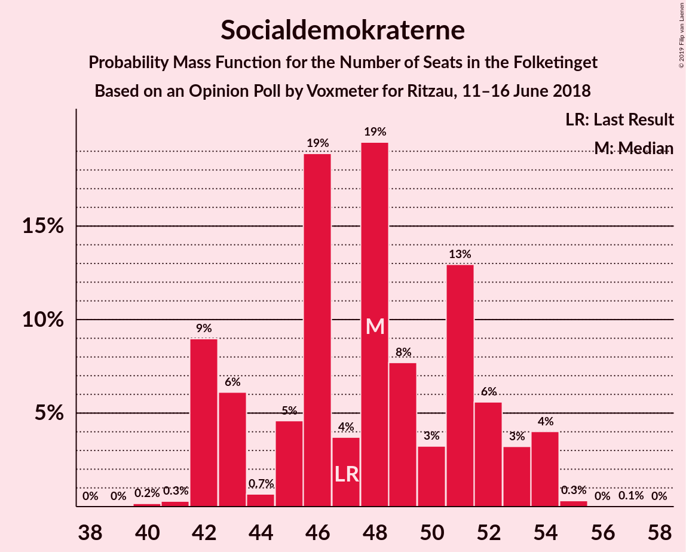
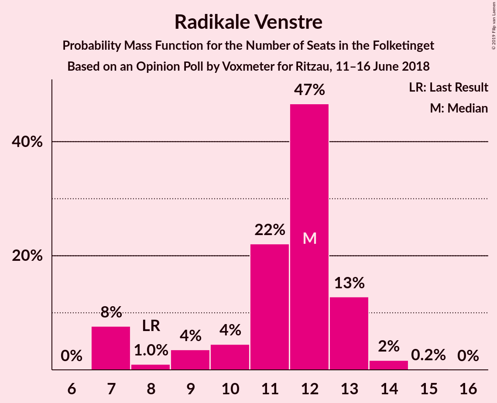
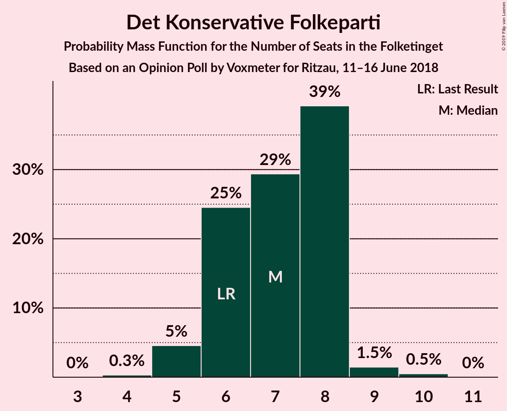

# Opinion Poll by Voxmeter for Ritzau, 11–16 June 2018

<a href="#voting-intentions">Voting Intentions</a> | <a href="#seats">Seats</a> | <a href="#coalitions">Coalitions</a> | <a href="#technical-information">Technical Information</a>

## Voting Intentions

### Confidence Intervals

| Party | Last Result | Poll Result | 80% Confidence Interval | 90% Confidence Interval | 95% Confidence Interval | 99% Confidence Interval |
|:-----:|:-----------:|:-----------:|:-----------------------:|:-----------------------:|:-----------------------:|:-----------------------:|
| Socialdemokraterne | 26.3% | 27.4% | 25.7–29.2% |25.2–29.8% |24.7–30.2% |23.9–31.1% |
| Venstre | 19.5% | 19.9% | 18.4–21.6% |17.9–22.0% |17.5–22.5% |16.8–23.3% |
| Dansk Folkeparti | 21.1% | 18.9% | 17.4–20.6% |17.0–21.0% |16.6–21.4% |15.9–22.2% |
| Enhedslisten–De Rød-Grønne | 7.8% | 8.8% | 7.7–10.0% |7.4–10.4% |7.2–10.7% |6.7–11.3% |
| Radikale Venstre | 4.6% | 6.1% | 5.3–7.2% |5.0–7.5% |4.8–7.8% |4.4–8.3% |
| Socialistisk Folkeparti | 4.2% | 5.3% | 4.5–6.3% |4.2–6.6% |4.1–6.8% |3.7–7.3% |
| Liberal Alliance | 7.5% | 4.5% | 3.7–5.4% |3.6–5.7% |3.4–5.9% |3.0–6.4% |
| Det Konservative Folkeparti | 3.4% | 3.6% | 3.0–4.5% |2.8–4.7% |2.6–4.9% |2.3–5.4% |
| Alternativet | 4.8% | 3.5% | 2.9–4.4% |2.7–4.6% |2.5–4.8% |2.3–5.3% |
| Nye Borgerlige | 0.0% | 1.0% | 0.7–1.5% |0.6–1.6% |0.5–1.8% |0.4–2.1% |
| Kristendemokraterne | 0.8% | 0.9% | 0.6–1.4% |0.5–1.5% |0.5–1.7% |0.4–2.0% |

*Note:* The poll result column reflects the actual value used in the calculations. Published results may vary slightly, and in addition be rounded to fewer digits.

## Seats

### Confidence Intervals

| Party | Last Result | Median | 80% Confidence Interval | 90% Confidence Interval | 95% Confidence Interval | 99% Confidence Interval |
|:-----:|:-----------:|:------:|:-----------------------:|:-----------------------:|:-----------------------:|:-----------------------:|
| <a href="#socialdemokraterne">Socialdemokraterne</a> | 47 | 46 | 42–51 |42–51 |42–51 |42–53 |
| <a href="#venstre">Venstre</a> | 34 | 38 | 32–40 |31–40 |31–40 |31–40 |
| <a href="#dansk-folkeparti">Dansk Folkeparti</a> | 37 | 33 | 31–36 |31–37 |30–37 |29–39 |
| <a href="#enhedslisten–de-rød-grønne">Enhedslisten–De Rød-Grønne</a> | 14 | 17 | 15–18 |15–18 |14–18 |12–20 |
| <a href="#radikale-venstre">Radikale Venstre</a> | 8 | 12 | 11–13 |10–13 |9–13 |8–14 |
| <a href="#socialistisk-folkeparti">Socialistisk Folkeparti</a> | 7 | 9 | 8–11 |7–11 |7–12 |6–13 |
| <a href="#liberal-alliance">Liberal Alliance</a> | 13 | 7 | 6–8 |6–10 |6–11 |5–11 |
| <a href="#det-konservative-folkeparti">Det Konservative Folkeparti</a> | 6 | 8 | 7–8 |6–8 |5–8 |5–9 |
| <a href="#alternativet">Alternativet</a> | 9 | 6 | 5–7 |5–8 |5–8 |4–9 |
| <a href="#nye-borgerlige">Nye Borgerlige</a> | 0 | 0 | 0 |0 |0 |0 |
| <a href="#kristendemokraterne">Kristendemokraterne</a> | 0 | 0 | 0 |0 |0 |0 |

### Socialdemokraterne

*For a full overview of the results for this party, see the [Socialdemokraterne](party-socialdemokraterne.html) page.*

| Number of Seats | Probability | Accumulated | Special Marks |
|:---------------:|:-----------:|:-----------:|:-------------:|
| 42 | 15% | 100% |  |
| 43 | 10% | 85% |  |
| 44 | 0.4% | 75% |  |
| 45 | 4% | 74% |  |
| 46 | 32% | 70% | Median |
| 47 | 3% | 38% | Last Result |
| 48 | 2% | 35% |  |
| 49 | 13% | 33% |  |
| 50 | 3% | 21% |  |
| 51 | 15% | 18% |  |
| 52 | 1.5% | 2% |  |
| 53 | 0.4% | 0.8% |  |
| 54 | 0.2% | 0.4% |  |
| 55 | 0.1% | 0.2% |  |
| 56 | 0% | 0.1% |  |
| 57 | 0% | 0.1% |  |
| 58 | 0% | 0% |  |

### Venstre

*For a full overview of the results for this party, see the [Venstre](party-venstre.html) page.*

| Number of Seats | Probability | Accumulated | Special Marks |
|:---------------:|:-----------:|:-----------:|:-------------:|
| 29 | 0.3% | 100% |  |
| 30 | 0.1% | 99.7% |  |
| 31 | 5% | 99.6% |  |
| 32 | 14% | 95% |  |
| 33 | 5% | 80% |  |
| 34 | 12% | 76% | Last Result |
| 35 | 3% | 63% |  |
| 36 | 0.4% | 61% |  |
| 37 | 1.1% | 60% |  |
| 38 | 31% | 59% | Median |
| 39 | 17% | 28% |  |
| 40 | 11% | 11% |  |
| 41 | 0.3% | 0.4% |  |
| 42 | 0% | 0.1% |  |
| 43 | 0% | 0% |  |

### Dansk Folkeparti

*For a full overview of the results for this party, see the [Dansk Folkeparti](party-danskfolkeparti.html) page.*

| Number of Seats | Probability | Accumulated | Special Marks |
|:---------------:|:-----------:|:-----------:|:-------------:|
| 28 | 0% | 100% |  |
| 29 | 1.2% | 99.9% |  |
| 30 | 3% | 98.8% |  |
| 31 | 12% | 96% |  |
| 32 | 2% | 84% |  |
| 33 | 41% | 81% | Median |
| 34 | 0.9% | 40% |  |
| 35 | 0.3% | 40% |  |
| 36 | 30% | 39% |  |
| 37 | 6% | 9% | Last Result |
| 38 | 1.1% | 2% |  |
| 39 | 0.9% | 1.4% |  |
| 40 | 0.1% | 0.5% |  |
| 41 | 0.3% | 0.4% |  |
| 42 | 0% | 0% |  |

### Enhedslisten–De Rød-Grønne

*For a full overview of the results for this party, see the [Enhedslisten–De Rød-Grønne](party-enhedslisten–derød-grønne.html) page.*

| Number of Seats | Probability | Accumulated | Special Marks |
|:---------------:|:-----------:|:-----------:|:-------------:|
| 12 | 1.4% | 100% |  |
| 13 | 0.8% | 98.5% |  |
| 14 | 2% | 98% | Last Result |
| 15 | 34% | 96% |  |
| 16 | 11% | 62% |  |
| 17 | 9% | 51% | Median |
| 18 | 41% | 41% |  |
| 19 | 0.2% | 0.7% |  |
| 20 | 0% | 0.5% |  |
| 21 | 0.5% | 0.5% |  |
| 22 | 0% | 0% |  |

### Radikale Venstre

*For a full overview of the results for this party, see the [Radikale Venstre](party-radikalevenstre.html) page.*

| Number of Seats | Probability | Accumulated | Special Marks |
|:---------------:|:-----------:|:-----------:|:-------------:|
| 7 | 0.3% | 100% |  |
| 8 | 1.0% | 99.7% | Last Result |
| 9 | 2% | 98.8% |  |
| 10 | 5% | 97% |  |
| 11 | 17% | 92% |  |
| 12 | 57% | 74% | Median |
| 13 | 16% | 18% |  |
| 14 | 0.9% | 1.2% |  |
| 15 | 0.3% | 0.3% |  |
| 16 | 0% | 0% |  |

### Socialistisk Folkeparti

*For a full overview of the results for this party, see the [Socialistisk Folkeparti](party-socialistiskfolkeparti.html) page.*

| Number of Seats | Probability | Accumulated | Special Marks |
|:---------------:|:-----------:|:-----------:|:-------------:|
| 6 | 2% | 100% |  |
| 7 | 5% | 98% | Last Result |
| 8 | 31% | 93% |  |
| 9 | 33% | 63% | Median |
| 10 | 12% | 30% |  |
| 11 | 13% | 18% |  |
| 12 | 4% | 5% |  |
| 13 | 0.9% | 1.0% |  |
| 14 | 0% | 0% |  |

### Liberal Alliance

*For a full overview of the results for this party, see the [Liberal Alliance](party-liberalalliance.html) page.*

| Number of Seats | Probability | Accumulated | Special Marks |
|:---------------:|:-----------:|:-----------:|:-------------:|
| 5 | 0.8% | 100% |  |
| 6 | 14% | 99.2% |  |
| 7 | 61% | 86% | Median |
| 8 | 15% | 24% |  |
| 9 | 4% | 10% |  |
| 10 | 1.4% | 6% |  |
| 11 | 4% | 5% |  |
| 12 | 0.3% | 0.3% |  |
| 13 | 0% | 0% | Last Result |

### Det Konservative Folkeparti

*For a full overview of the results for this party, see the [Det Konservative Folkeparti](party-detkonservativefolkeparti.html) page.*

| Number of Seats | Probability | Accumulated | Special Marks |
|:---------------:|:-----------:|:-----------:|:-------------:|
| 4 | 0.3% | 100% |  |
| 5 | 4% | 99.6% |  |
| 6 | 4% | 95% | Last Result |
| 7 | 31% | 91% |  |
| 8 | 58% | 60% | Median |
| 9 | 2% | 2% |  |
| 10 | 0.2% | 0.2% |  |
| 11 | 0% | 0% |  |

### Alternativet

*For a full overview of the results for this party, see the [Alternativet](party-alternativet.html) page.*

| Number of Seats | Probability | Accumulated | Special Marks |
|:---------------:|:-----------:|:-----------:|:-------------:|
| 4 | 1.1% | 100% |  |
| 5 | 31% | 98.9% |  |
| 6 | 37% | 68% | Median |
| 7 | 24% | 31% |  |
| 8 | 5% | 7% |  |
| 9 | 2% | 2% | Last Result |
| 10 | 0.2% | 0.3% |  |
| 11 | 0.1% | 0.1% |  |
| 12 | 0% | 0% |  |

### Nye Borgerlige

*For a full overview of the results for this party, see the [Nye Borgerlige](party-nyeborgerlige.html) page.*

| Number of Seats | Probability | Accumulated | Special Marks |
|:---------------:|:-----------:|:-----------:|:-------------:|
| 0 | 99.6% | 100% | Last Result, Median |
| 1 | 0% | 0.4% |  |
| 2 | 0% | 0.4% |  |
| 3 | 0% | 0.4% |  |
| 4 | 0.3% | 0.4% |  |
| 5 | 0.1% | 0.1% |  |
| 6 | 0% | 0% |  |

### Kristendemokraterne

*For a full overview of the results for this party, see the [Kristendemokraterne](party-kristendemokraterne.html) page.*

| Number of Seats | Probability | Accumulated | Special Marks |
|:---------------:|:-----------:|:-----------:|:-------------:|
| 0 | 99.9% | 100% | Last Result, Median |
| 1 | 0% | 0.1% |  |
| 2 | 0% | 0.1% |  |
| 3 | 0% | 0.1% |  |
| 4 | 0.1% | 0.1% |  |
| 5 | 0% | 0% |  |

## Coalitions

### Confidence Intervals

| Coalition | Last Result | Median | Majority? | 80% Confidence Interval | 90% Confidence Interval | 95% Confidence Interval | 99% Confidence Interval |
|:---------:|:-----------:|:------:|:---------:|:-----------------------:|:-----------------------:|:-----------------------:|:-----------------------:|
| Socialdemokraterne – Enhedslisten–De Rød-Grønne – Radikale Venstre – Socialistisk Folkeparti – Alternativet | 85 | 89 | 41% | 86–94 | 86–94 | 86–96 | 86–96 |
| Venstre – Dansk Folkeparti – Liberal Alliance – Det Konservative Folkeparti – Nye Borgerlige – Kristendemokraterne | 90 | 86 | 0.5% | 81–89 | 81–89 | 79–89 | 79–89 |
| Venstre – Dansk Folkeparti – Liberal Alliance – Det Konservative Folkeparti – Kristendemokraterne | 90 | 86 | 0.4% | 81–89 | 81–89 | 79–89 | 79–89 |
| Venstre – Dansk Folkeparti – Liberal Alliance – Det Konservative Folkeparti – Nye Borgerlige | 90 | 86 | 0.5% | 81–89 | 81–89 | 79–89 | 79–89 |
| Venstre – Dansk Folkeparti – Liberal Alliance – Det Konservative Folkeparti | 90 | 86 | 0.4% | 81–89 | 81–89 | 79–89 | 79–89 |
| Socialdemokraterne – Enhedslisten–De Rød-Grønne – Radikale Venstre – Socialistisk Folkeparti | 76 | 84 | 2% | 79–88 | 79–88 | 79–89 | 79–90 |
| Socialdemokraterne – Enhedslisten–De Rød-Grønne – Socialistisk Folkeparti – Alternativet | 77 | 77 | 0% | 73–82 | 73–83 | 73–84 | 73–85 |
| Socialdemokraterne – Enhedslisten–De Rød-Grønne – Socialistisk Folkeparti | 68 | 72 | 0% | 66–76 | 66–77 | 66–77 | 66–79 |
| Socialdemokraterne – Radikale Venstre – Socialistisk Folkeparti | 62 | 66 | 0% | 64–72 | 64–72 | 64–72 | 62–73 |
| Socialdemokraterne – Radikale Venstre | 55 | 58 | 0% | 55–62 | 55–62 | 55–63 | 54–65 |
| Venstre – Liberal Alliance – Det Konservative Folkeparti | 53 | 53 | 0% | 47–55 | 47–55 | 45–55 | 45–56 |
| Venstre – Det Konservative Folkeparti | 40 | 46 | 0% | 40–47 | 38–47 | 38–47 | 37–47 |
| Venstre | 34 | 38 | 0% | 32–40 | 31–40 | 31–40 | 31–40 |

### Socialdemokraterne – Enhedslisten–De Rød-Grønne – Radikale Venstre – Socialistisk Folkeparti – Alternativet

| Number of Seats | Probability | Accumulated | Special Marks |
|:---------------:|:-----------:|:-----------:|:-------------:|
| 81 | 0.2% | 100% |  |
| 82 | 0% | 99.8% |  |
| 83 | 0.2% | 99.8% |  |
| 84 | 0.1% | 99.7% |  |
| 85 | 0.1% | 99.6% | Last Result |
| 86 | 19% | 99.5% |  |
| 87 | 0.8% | 80% |  |
| 88 | 0.4% | 80% |  |
| 89 | 38% | 79% |  |
| 90 | 3% | 41% | Median, Majority |
| 91 | 3% | 38% |  |
| 92 | 16% | 35% |  |
| 93 | 4% | 19% |  |
| 94 | 11% | 16% |  |
| 95 | 0.4% | 5% |  |
| 96 | 4% | 4% |  |
| 97 | 0.2% | 0.3% |  |
| 98 | 0.1% | 0.1% |  |
| 99 | 0% | 0.1% |  |
| 100 | 0% | 0% |  |

### Venstre – Dansk Folkeparti – Liberal Alliance – Det Konservative Folkeparti – Nye Borgerlige – Kristendemokraterne

| Number of Seats | Probability | Accumulated | Special Marks |
|:---------------:|:-----------:|:-----------:|:-------------:|
| 76 | 0% | 100% |  |
| 77 | 0.1% | 99.9% |  |
| 78 | 0.2% | 99.9% |  |
| 79 | 4% | 99.7% |  |
| 80 | 0.4% | 96% |  |
| 81 | 11% | 95% |  |
| 82 | 4% | 84% |  |
| 83 | 16% | 81% |  |
| 84 | 3% | 65% |  |
| 85 | 3% | 62% |  |
| 86 | 38% | 59% | Median |
| 87 | 0.4% | 21% |  |
| 88 | 0.8% | 20% |  |
| 89 | 19% | 20% |  |
| 90 | 0.1% | 0.5% | Last Result, Majority |
| 91 | 0.1% | 0.4% |  |
| 92 | 0.2% | 0.3% |  |
| 93 | 0% | 0.2% |  |
| 94 | 0.2% | 0.2% |  |
| 95 | 0% | 0% |  |

### Venstre – Dansk Folkeparti – Liberal Alliance – Det Konservative Folkeparti – Kristendemokraterne

| Number of Seats | Probability | Accumulated | Special Marks |
|:---------------:|:-----------:|:-----------:|:-------------:|
| 76 | 0% | 100% |  |
| 77 | 0.1% | 99.9% |  |
| 78 | 0.2% | 99.8% |  |
| 79 | 4% | 99.6% |  |
| 80 | 0.5% | 96% |  |
| 81 | 11% | 95% |  |
| 82 | 4% | 84% |  |
| 83 | 16% | 81% |  |
| 84 | 3% | 65% |  |
| 85 | 3% | 62% |  |
| 86 | 38% | 59% | Median |
| 87 | 0.3% | 21% |  |
| 88 | 0.8% | 20% |  |
| 89 | 19% | 20% |  |
| 90 | 0.1% | 0.4% | Last Result, Majority |
| 91 | 0% | 0.4% |  |
| 92 | 0.2% | 0.3% |  |
| 93 | 0% | 0.2% |  |
| 94 | 0.2% | 0.2% |  |
| 95 | 0% | 0% |  |

### Venstre – Dansk Folkeparti – Liberal Alliance – Det Konservative Folkeparti – Nye Borgerlige

| Number of Seats | Probability | Accumulated | Special Marks |
|:---------------:|:-----------:|:-----------:|:-------------:|
| 76 | 0% | 100% |  |
| 77 | 0.1% | 99.9% |  |
| 78 | 0.2% | 99.9% |  |
| 79 | 4% | 99.7% |  |
| 80 | 0.4% | 96% |  |
| 81 | 11% | 95% |  |
| 82 | 4% | 84% |  |
| 83 | 16% | 81% |  |
| 84 | 3% | 65% |  |
| 85 | 3% | 62% |  |
| 86 | 38% | 59% | Median |
| 87 | 0.4% | 21% |  |
| 88 | 0.7% | 20% |  |
| 89 | 19% | 20% |  |
| 90 | 0.1% | 0.5% | Last Result, Majority |
| 91 | 0.1% | 0.4% |  |
| 92 | 0.2% | 0.3% |  |
| 93 | 0% | 0.2% |  |
| 94 | 0.2% | 0.2% |  |
| 95 | 0% | 0% |  |

### Venstre – Dansk Folkeparti – Liberal Alliance – Det Konservative Folkeparti

| Number of Seats | Probability | Accumulated | Special Marks |
|:---------------:|:-----------:|:-----------:|:-------------:|
| 76 | 0% | 100% |  |
| 77 | 0.1% | 99.9% |  |
| 78 | 0.2% | 99.8% |  |
| 79 | 4% | 99.6% |  |
| 80 | 0.5% | 96% |  |
| 81 | 11% | 95% |  |
| 82 | 4% | 84% |  |
| 83 | 16% | 81% |  |
| 84 | 3% | 65% |  |
| 85 | 3% | 62% |  |
| 86 | 38% | 59% | Median |
| 87 | 0.3% | 21% |  |
| 88 | 0.7% | 20% |  |
| 89 | 19% | 20% |  |
| 90 | 0.1% | 0.4% | Last Result, Majority |
| 91 | 0.1% | 0.4% |  |
| 92 | 0.2% | 0.3% |  |
| 93 | 0% | 0.2% |  |
| 94 | 0.2% | 0.2% |  |
| 95 | 0% | 0% |  |

### Socialdemokraterne – Enhedslisten–De Rød-Grønne – Radikale Venstre – Socialistisk Folkeparti

| Number of Seats | Probability | Accumulated | Special Marks |
|:---------------:|:-----------:|:-----------:|:-------------:|
| 75 | 0.1% | 100% |  |
| 76 | 0.1% | 99.9% | Last Result |
| 77 | 0% | 99.8% |  |
| 78 | 0.1% | 99.8% |  |
| 79 | 19% | 99.6% |  |
| 80 | 0.3% | 81% |  |
| 81 | 3% | 81% |  |
| 82 | 0.9% | 78% |  |
| 83 | 10% | 77% |  |
| 84 | 30% | 67% | Median |
| 85 | 5% | 37% |  |
| 86 | 17% | 32% |  |
| 87 | 0.8% | 15% |  |
| 88 | 10% | 15% |  |
| 89 | 3% | 4% |  |
| 90 | 1.3% | 2% | Majority |
| 91 | 0.2% | 0.3% |  |
| 92 | 0% | 0.1% |  |
| 93 | 0% | 0.1% |  |
| 94 | 0% | 0.1% |  |
| 95 | 0% | 0% |  |

### Socialdemokraterne – Enhedslisten–De Rød-Grønne – Socialistisk Folkeparti – Alternativet

| Number of Seats | Probability | Accumulated | Special Marks |
|:---------------:|:-----------:|:-----------:|:-------------:|
| 70 | 0.1% | 100% |  |
| 71 | 0% | 99.9% |  |
| 72 | 0% | 99.8% |  |
| 73 | 15% | 99.8% |  |
| 74 | 3% | 84% |  |
| 75 | 0.4% | 81% |  |
| 76 | 0.7% | 81% |  |
| 77 | 39% | 80% | Last Result |
| 78 | 0.5% | 41% | Median |
| 79 | 3% | 40% |  |
| 80 | 2% | 37% |  |
| 81 | 16% | 35% |  |
| 82 | 10% | 19% |  |
| 83 | 4% | 9% |  |
| 84 | 3% | 5% |  |
| 85 | 2% | 2% |  |
| 86 | 0% | 0.2% |  |
| 87 | 0.1% | 0.2% |  |
| 88 | 0% | 0.1% |  |
| 89 | 0.1% | 0.1% |  |
| 90 | 0% | 0% | Majority |

### Socialdemokraterne – Enhedslisten–De Rød-Grønne – Socialistisk Folkeparti

| Number of Seats | Probability | Accumulated | Special Marks |
|:---------------:|:-----------:|:-----------:|:-------------:|
| 65 | 0.2% | 100% |  |
| 66 | 15% | 99.8% |  |
| 67 | 3% | 85% |  |
| 68 | 1.2% | 81% | Last Result |
| 69 | 0.5% | 80% |  |
| 70 | 0.7% | 80% |  |
| 71 | 10% | 79% |  |
| 72 | 30% | 69% | Median |
| 73 | 1.3% | 38% |  |
| 74 | 4% | 37% |  |
| 75 | 17% | 33% |  |
| 76 | 11% | 16% |  |
| 77 | 4% | 5% |  |
| 78 | 0.1% | 2% |  |
| 79 | 1.4% | 2% |  |
| 80 | 0% | 0.2% |  |
| 81 | 0% | 0.1% |  |
| 82 | 0.1% | 0.1% |  |
| 83 | 0% | 0% |  |

### Socialdemokraterne – Radikale Venstre – Socialistisk Folkeparti

| Number of Seats | Probability | Accumulated | Special Marks |
|:---------------:|:-----------:|:-----------:|:-------------:|
| 61 | 0.2% | 100% |  |
| 62 | 0.3% | 99.8% | Last Result |
| 63 | 0% | 99.5% |  |
| 64 | 19% | 99.5% |  |
| 65 | 10% | 81% |  |
| 66 | 28% | 71% |  |
| 67 | 3% | 42% | Median |
| 68 | 6% | 39% |  |
| 69 | 4% | 33% |  |
| 70 | 0.4% | 30% |  |
| 71 | 15% | 29% |  |
| 72 | 13% | 14% |  |
| 73 | 0.4% | 0.9% |  |
| 74 | 0.1% | 0.5% |  |
| 75 | 0.2% | 0.4% |  |
| 76 | 0% | 0.2% |  |
| 77 | 0% | 0.2% |  |
| 78 | 0.1% | 0.2% |  |
| 79 | 0% | 0% |  |

### Socialdemokraterne – Radikale Venstre

| Number of Seats | Probability | Accumulated | Special Marks |
|:---------------:|:-----------:|:-----------:|:-------------:|
| 51 | 0% | 100% |  |
| 52 | 0.2% | 99.9% |  |
| 53 | 0.1% | 99.7% |  |
| 54 | 0.6% | 99.7% |  |
| 55 | 25% | 99.1% | Last Result |
| 56 | 4% | 74% |  |
| 57 | 4% | 69% |  |
| 58 | 29% | 66% | Median |
| 59 | 4% | 37% |  |
| 60 | 2% | 33% |  |
| 61 | 12% | 31% |  |
| 62 | 16% | 19% |  |
| 63 | 1.4% | 3% |  |
| 64 | 0.5% | 1.2% |  |
| 65 | 0.5% | 0.7% |  |
| 66 | 0% | 0.2% |  |
| 67 | 0% | 0.2% |  |
| 68 | 0% | 0.2% |  |
| 69 | 0.1% | 0.1% |  |
| 70 | 0% | 0% |  |

### Venstre – Liberal Alliance – Det Konservative Folkeparti

| Number of Seats | Probability | Accumulated | Special Marks |
|:---------------:|:-----------:|:-----------:|:-------------:|
| 42 | 0.3% | 100% |  |
| 43 | 0.1% | 99.7% |  |
| 44 | 0.1% | 99.6% |  |
| 45 | 3% | 99.6% |  |
| 46 | 0.1% | 96% |  |
| 47 | 15% | 96% |  |
| 48 | 12% | 81% |  |
| 49 | 4% | 69% |  |
| 50 | 2% | 65% |  |
| 51 | 0.9% | 63% |  |
| 52 | 6% | 62% |  |
| 53 | 44% | 56% | Last Result, Median |
| 54 | 0.4% | 11% |  |
| 55 | 10% | 11% |  |
| 56 | 0.5% | 0.8% |  |
| 57 | 0% | 0.3% |  |
| 58 | 0.3% | 0.3% |  |
| 59 | 0% | 0% |  |

### Venstre – Det Konservative Folkeparti

| Number of Seats | Probability | Accumulated | Special Marks |
|:---------------:|:-----------:|:-----------:|:-------------:|
| 35 | 0.3% | 100% |  |
| 36 | 0.1% | 99.6% |  |
| 37 | 2% | 99.5% |  |
| 38 | 6% | 98% |  |
| 39 | 0.4% | 92% |  |
| 40 | 15% | 91% | Last Result |
| 41 | 3% | 76% |  |
| 42 | 12% | 74% |  |
| 43 | 3% | 62% |  |
| 44 | 0.5% | 59% |  |
| 45 | 1.0% | 59% |  |
| 46 | 47% | 58% | Median |
| 47 | 11% | 11% |  |
| 48 | 0.1% | 0.4% |  |
| 49 | 0.1% | 0.3% |  |
| 50 | 0.3% | 0.3% |  |
| 51 | 0% | 0% |  |

### Venstre

| Number of Seats | Probability | Accumulated | Special Marks |
|:---------------:|:-----------:|:-----------:|:-------------:|
| 29 | 0.3% | 100% |  |
| 30 | 0.1% | 99.7% |  |
| 31 | 5% | 99.6% |  |
| 32 | 14% | 95% |  |
| 33 | 5% | 80% |  |
| 34 | 12% | 76% | Last Result |
| 35 | 3% | 63% |  |
| 36 | 0.4% | 61% |  |
| 37 | 1.1% | 60% |  |
| 38 | 31% | 59% | Median |
| 39 | 17% | 28% |  |
| 40 | 11% | 11% |  |
| 41 | 0.3% | 0.4% |  |
| 42 | 0% | 0.1% |  |
| 43 | 0% | 0% |  |

## Technical Information

### Opinion Poll

+ **Polling firm:** Voxmeter
+ **Commissioner(s):** Ritzau
+ **Fieldwork period:** 11–16 June 2018

### Calculations

+ **Sample size:** 1026
+ **Simulations done:** 131,072
+ **Error estimate:** 1.86%

