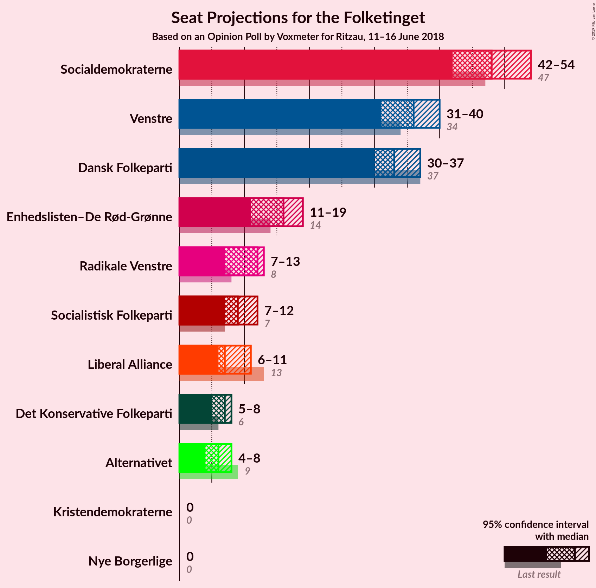
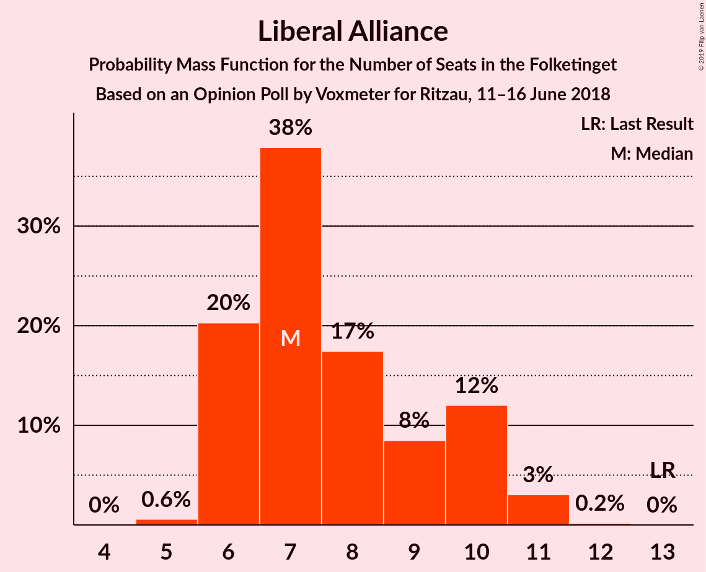
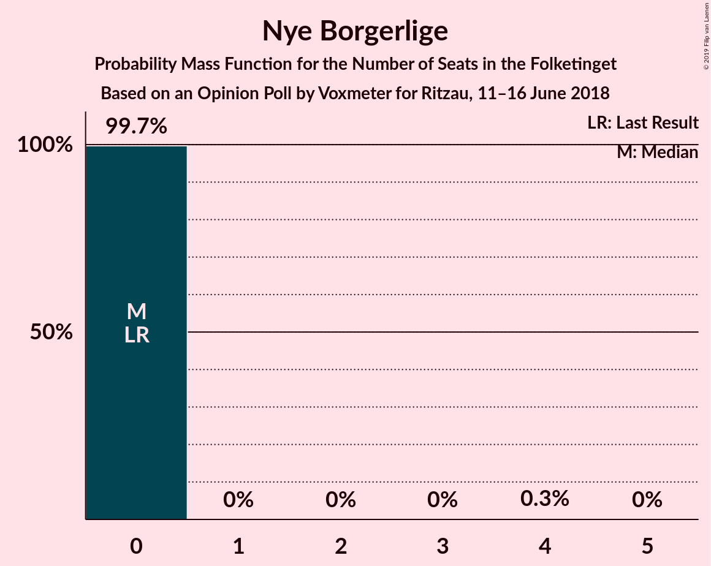
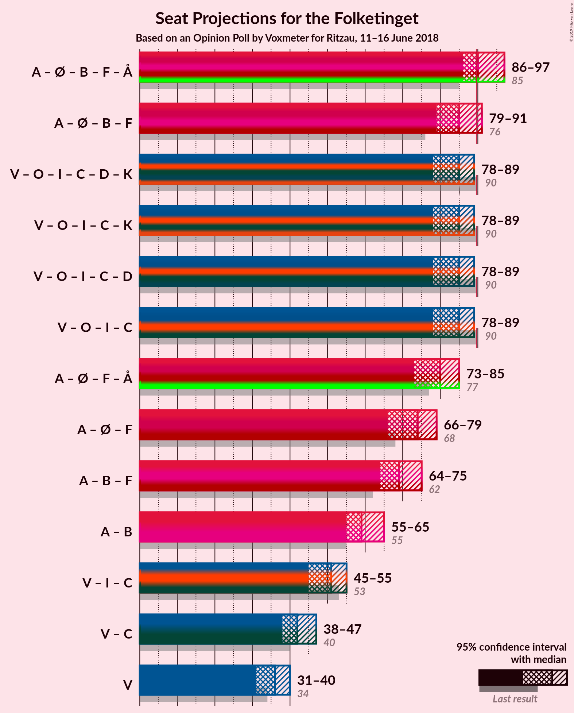

# Opinion Poll by Voxmeter for Ritzau, 11–16 June 2018

<a href="#voting-intentions">Voting Intentions</a> | <a href="#seats">Seats</a> | <a href="#coalitions">Coalitions</a> | <a href="#technical-information">Technical Information</a>

## Voting Intentions

### Confidence Intervals

| Party | Last Result | Poll Result | 80% Confidence Interval | 90% Confidence Interval | 95% Confidence Interval | 99% Confidence Interval |
|:-----:|:-----------:|:-----------:|:-----------------------:|:-----------------------:|:-----------------------:|:-----------------------:|
| Socialdemokraterne | 26.3% | 27.4% | 25.7–29.2% |25.2–29.8% |24.7–30.2% |23.9–31.1% |
| Venstre | 19.5% | 19.9% | 18.4–21.6% |17.9–22.0% |17.5–22.5% |16.8–23.3% |
| Dansk Folkeparti | 21.1% | 18.9% | 17.4–20.6% |17.0–21.0% |16.6–21.4% |15.9–22.2% |
| Enhedslisten–De Rød-Grønne | 7.8% | 8.8% | 7.7–10.0% |7.4–10.4% |7.2–10.7% |6.7–11.3% |
| Radikale Venstre | 4.6% | 6.1% | 5.3–7.2% |5.0–7.5% |4.8–7.8% |4.4–8.3% |
| Socialistisk Folkeparti | 4.2% | 5.3% | 4.5–6.3% |4.2–6.6% |4.1–6.8% |3.7–7.3% |
| Liberal Alliance | 7.5% | 4.5% | 3.7–5.4% |3.6–5.7% |3.4–5.9% |3.0–6.4% |
| Det Konservative Folkeparti | 3.4% | 3.6% | 3.0–4.5% |2.8–4.7% |2.6–4.9% |2.3–5.4% |
| Alternativet | 4.8% | 3.5% | 2.9–4.4% |2.7–4.6% |2.5–4.8% |2.3–5.3% |
| Nye Borgerlige | 0.0% | 1.0% | 0.7–1.5% |0.6–1.6% |0.5–1.8% |0.4–2.1% |
| Kristendemokraterne | 0.8% | 0.9% | 0.6–1.4% |0.5–1.5% |0.5–1.7% |0.4–2.0% |

*Note:* The poll result column reflects the actual value used in the calculations. Published results may vary slightly, and in addition be rounded to fewer digits.

## Seats

### Confidence Intervals

| Party | Last Result | Median | 80% Confidence Interval | 90% Confidence Interval | 95% Confidence Interval | 99% Confidence Interval |
|:-----:|:-----------:|:------:|:-----------------------:|:-----------------------:|:-----------------------:|:-----------------------:|
| <a href="#socialdemokraterne">Socialdemokraterne</a> | 47 | 49 | 49 |49–51 |49–53 |49–53 |
| <a href="#venstre">Venstre</a> | 34 | 31 | 31 |30–42 |30–42 |29–42 |
| <a href="#dansk-folkeparti">Dansk Folkeparti</a> | 37 | 39 | 31–39 |29–39 |29–39 |29–39 |
| <a href="#enhedslisten–de-rød-grønne">Enhedslisten–De Rød-Grønne</a> | 14 | 14 | 14 |14–16 |14–16 |14–18 |
| <a href="#radikale-venstre">Radikale Venstre</a> | 8 | 11 | 10–11 |10–11 |10–11 |10–16 |
| <a href="#socialistisk-folkeparti">Socialistisk Folkeparti</a> | 7 | 9 | 9–10 |9–11 |9–12 |9–12 |
| <a href="#liberal-alliance">Liberal Alliance</a> | 13 | 11 | 8–11 |5–11 |5–11 |5–11 |
| <a href="#det-konservative-folkeparti">Det Konservative Folkeparti</a> | 6 | 5 | 5–6 |5–10 |5–10 |5–10 |
| <a href="#alternativet">Alternativet</a> | 9 | 6 | 6 |6 |5–6 |5–6 |
| <a href="#nye-borgerlige">Nye Borgerlige</a> | 0 | 0 | 0 |0 |0 |0 |
| <a href="#kristendemokraterne">Kristendemokraterne</a> | 0 | 0 | 0 |0 |0–4 |0–4 |

### Socialdemokraterne

*For a full overview of the results for this party, see the [Socialdemokraterne](party-socialdemokraterne.html) page.*

| Number of Seats | Probability | Accumulated | Special Marks |
|:---------------:|:-----------:|:-----------:|:-------------:|
| 45 | 0.1% | 100% |  |
| 46 | 0% | 99.9% |  |
| 47 | 0% | 99.8% | Last Result |
| 48 | 0% | 99.8% |  |
| 49 | 94% | 99.8% | Median |
| 50 | 0% | 6% |  |
| 51 | 1.2% | 6% |  |
| 52 | 0% | 5% |  |
| 53 | 5% | 5% |  |
| 54 | 0% | 0% |  |

### Venstre

*For a full overview of the results for this party, see the [Venstre](party-venstre.html) page.*

| Number of Seats | Probability | Accumulated | Special Marks |
|:---------------:|:-----------:|:-----------:|:-------------:|
| 29 | 1.2% | 100% |  |
| 30 | 5% | 98.8% |  |
| 31 | 87% | 94% | Median |
| 32 | 0% | 6% |  |
| 33 | 0% | 6% |  |
| 34 | 0% | 6% | Last Result |
| 35 | 0% | 6% |  |
| 36 | 0% | 6% |  |
| 37 | 0% | 6% |  |
| 38 | 0% | 6% |  |
| 39 | 0% | 6% |  |
| 40 | 0% | 6% |  |
| 41 | 0% | 6% |  |
| 42 | 6% | 6% |  |
| 43 | 0% | 0% |  |

### Dansk Folkeparti

*For a full overview of the results for this party, see the [Dansk Folkeparti](party-danskfolkeparti.html) page.*

| Number of Seats | Probability | Accumulated | Special Marks |
|:---------------:|:-----------:|:-----------:|:-------------:|
| 29 | 8% | 100% |  |
| 30 | 0.3% | 92% |  |
| 31 | 5% | 92% |  |
| 32 | 0% | 87% |  |
| 33 | 0% | 87% |  |
| 34 | 0% | 87% |  |
| 35 | 0% | 87% |  |
| 36 | 0% | 87% |  |
| 37 | 0.1% | 87% | Last Result |
| 38 | 0% | 87% |  |
| 39 | 87% | 87% | Median |
| 40 | 0% | 0% |  |

### Enhedslisten–De Rød-Grønne

*For a full overview of the results for this party, see the [Enhedslisten–De Rød-Grønne](party-enhedslisten–derød-grønne.html) page.*

| Number of Seats | Probability | Accumulated | Special Marks |
|:---------------:|:-----------:|:-----------:|:-------------:|
| 14 | 94% | 100% | Last Result, Median |
| 15 | 0% | 6% |  |
| 16 | 5% | 6% |  |
| 17 | 0% | 2% |  |
| 18 | 2% | 2% |  |
| 19 | 0% | 0% |  |

### Radikale Venstre

*For a full overview of the results for this party, see the [Radikale Venstre](party-radikalevenstre.html) page.*

| Number of Seats | Probability | Accumulated | Special Marks |
|:---------------:|:-----------:|:-----------:|:-------------:|
| 8 | 0% | 100% | Last Result |
| 9 | 0% | 100% |  |
| 10 | 11% | 100% |  |
| 11 | 87% | 89% | Median |
| 12 | 0% | 2% |  |
| 13 | 0.3% | 2% |  |
| 14 | 0% | 1.4% |  |
| 15 | 0% | 1.4% |  |
| 16 | 1.2% | 1.3% |  |
| 17 | 0.1% | 0.1% |  |
| 18 | 0% | 0% |  |

### Socialistisk Folkeparti

*For a full overview of the results for this party, see the [Socialistisk Folkeparti](party-socialistiskfolkeparti.html) page.*

| Number of Seats | Probability | Accumulated | Special Marks |
|:---------------:|:-----------:|:-----------:|:-------------:|
| 7 | 0.2% | 100% | Last Result |
| 8 | 0% | 99.8% |  |
| 9 | 88% | 99.8% | Median |
| 10 | 6% | 12% |  |
| 11 | 1.2% | 6% |  |
| 12 | 5% | 5% |  |
| 13 | 0% | 0% |  |

### Liberal Alliance

*For a full overview of the results for this party, see the [Liberal Alliance](party-liberalalliance.html) page.*

| Number of Seats | Probability | Accumulated | Special Marks |
|:---------------:|:-----------:|:-----------:|:-------------:|
| 5 | 6% | 100% |  |
| 6 | 0% | 94% |  |
| 7 | 0% | 94% |  |
| 8 | 6% | 94% |  |
| 9 | 0% | 88% |  |
| 10 | 0% | 88% |  |
| 11 | 87% | 88% | Median |
| 12 | 0% | 0.3% |  |
| 13 | 0% | 0.3% | Last Result |
| 14 | 0.3% | 0.3% |  |
| 15 | 0% | 0% |  |

### Det Konservative Folkeparti

*For a full overview of the results for this party, see the [Det Konservative Folkeparti](party-detkonservativefolkeparti.html) page.*

| Number of Seats | Probability | Accumulated | Special Marks |
|:---------------:|:-----------:|:-----------:|:-------------:|
| 5 | 87% | 100% | Median |
| 6 | 5% | 13% | Last Result |
| 7 | 1.3% | 8% |  |
| 8 | 0% | 6% |  |
| 9 | 0% | 6% |  |
| 10 | 6% | 6% |  |
| 11 | 0% | 0% |  |

### Alternativet

*For a full overview of the results for this party, see the [Alternativet](party-alternativet.html) page.*

| Number of Seats | Probability | Accumulated | Special Marks |
|:---------------:|:-----------:|:-----------:|:-------------:|
| 5 | 5% | 100% |  |
| 6 | 95% | 95% | Median |
| 7 | 0.1% | 0.1% |  |
| 8 | 0% | 0% |  |
| 9 | 0% | 0% | Last Result |

### Nye Borgerlige

*For a full overview of the results for this party, see the [Nye Borgerlige](party-nyeborgerlige.html) page.*

| Number of Seats | Probability | Accumulated | Special Marks |
|:---------------:|:-----------:|:-----------:|:-------------:|
| 0 | 100% | 100% | Last Result, Median |

### Kristendemokraterne

*For a full overview of the results for this party, see the [Kristendemokraterne](party-kristendemokraterne.html) page.*

| Number of Seats | Probability | Accumulated | Special Marks |
|:---------------:|:-----------:|:-----------:|:-------------:|
| 0 | 95% | 100% | Last Result, Median |
| 1 | 0% | 5% |  |
| 2 | 0% | 5% |  |
| 3 | 0% | 5% |  |
| 4 | 5% | 5% |  |
| 5 | 0% | 0% |  |

## Coalitions

### Confidence Intervals

| Coalition | Last Result | Median | Majority? | 80% Confidence Interval | 90% Confidence Interval | 95% Confidence Interval | 99% Confidence Interval |
|:---------:|:-----------:|:------:|:---------:|:-----------------------:|:-----------------------:|:-----------------------:|:-----------------------:|
| Socialdemokraterne – Enhedslisten–De Rød-Grønne – Radikale Venstre – Socialistisk Folkeparti – Alternativet | 85 | 89 | 6% | 89 | 89–96 | 89–96 | 89–102 |
| Socialdemokraterne – Enhedslisten–De Rød-Grønne – Radikale Venstre – Socialistisk Folkeparti | 76 | 83 | 6% | 83 | 83–91 | 83–91 | 83–96 |
| Venstre – Dansk Folkeparti – Liberal Alliance – Det Konservative Folkeparti – Nye Borgerlige – Kristendemokraterne | 90 | 86 | 0% | 86 | 79–86 | 79–86 | 73–86 |
| Venstre – Dansk Folkeparti – Liberal Alliance – Det Konservative Folkeparti – Kristendemokraterne | 90 | 86 | 0% | 86 | 79–86 | 79–86 | 73–86 |
| Venstre – Dansk Folkeparti – Liberal Alliance – Det Konservative Folkeparti – Nye Borgerlige | 90 | 86 | 0% | 86 | 75–86 | 75–86 | 73–86 |
| Venstre – Dansk Folkeparti – Liberal Alliance – Det Konservative Folkeparti | 90 | 86 | 0% | 86 | 75–86 | 75–86 | 73–86 |

### Socialdemokraterne – Enhedslisten–De Rød-Grønne – Radikale Venstre – Socialistisk Folkeparti – Alternativet

| Number of Seats | Probability | Accumulated | Special Marks |
|:---------------:|:-----------:|:-----------:|:-------------:|
| 85 | 0% | 100% | Last Result |
| 86 | 0% | 100% |  |
| 87 | 0% | 100% |  |
| 88 | 0% | 100% |  |
| 89 | 94% | 99.9% | Median |
| 90 | 0% | 6% | Majority |
| 91 | 0% | 6% |  |
| 92 | 0.1% | 6% |  |
| 93 | 0% | 6% |  |
| 94 | 0% | 6% |  |
| 95 | 0.3% | 6% |  |
| 96 | 5% | 6% |  |
| 97 | 0% | 1.2% |  |
| 98 | 0% | 1.2% |  |
| 99 | 0% | 1.2% |  |
| 100 | 0% | 1.2% |  |
| 101 | 0% | 1.2% |  |
| 102 | 1.2% | 1.2% |  |
| 103 | 0% | 0% |  |

### Socialdemokraterne – Enhedslisten–De Rød-Grønne – Radikale Venstre – Socialistisk Folkeparti

| Number of Seats | Probability | Accumulated | Special Marks |
|:---------------:|:-----------:|:-----------:|:-------------:|
| 76 | 0% | 100% | Last Result |
| 77 | 0% | 100% |  |
| 78 | 0% | 100% |  |
| 79 | 0% | 100% |  |
| 80 | 0% | 100% |  |
| 81 | 0% | 100% |  |
| 82 | 0% | 100% |  |
| 83 | 94% | 99.9% | Median |
| 84 | 0% | 6% |  |
| 85 | 0.1% | 6% |  |
| 86 | 0% | 6% |  |
| 87 | 0% | 6% |  |
| 88 | 0% | 6% |  |
| 89 | 0.3% | 6% |  |
| 90 | 0% | 6% | Majority |
| 91 | 5% | 6% |  |
| 92 | 0% | 1.2% |  |
| 93 | 0% | 1.2% |  |
| 94 | 0% | 1.2% |  |
| 95 | 0% | 1.2% |  |
| 96 | 1.2% | 1.2% |  |
| 97 | 0% | 0% |  |

### Venstre – Dansk Folkeparti – Liberal Alliance – Det Konservative Folkeparti – Nye Borgerlige – Kristendemokraterne

| Number of Seats | Probability | Accumulated | Special Marks |
|:---------------:|:-----------:|:-----------:|:-------------:|
| 73 | 1.2% | 100% |  |
| 74 | 0% | 98.8% |  |
| 75 | 0% | 98.8% |  |
| 76 | 0% | 98.8% |  |
| 77 | 0% | 98.8% |  |
| 78 | 0% | 98.8% |  |
| 79 | 5% | 98.8% |  |
| 80 | 0.3% | 94% |  |
| 81 | 0% | 94% |  |
| 82 | 0% | 94% |  |
| 83 | 0.1% | 94% |  |
| 84 | 0% | 94% |  |
| 85 | 0% | 94% |  |
| 86 | 94% | 94% | Median |
| 87 | 0% | 0% |  |
| 88 | 0% | 0% |  |
| 89 | 0% | 0% |  |
| 90 | 0% | 0% | Last Result, Majority |

### Venstre – Dansk Folkeparti – Liberal Alliance – Det Konservative Folkeparti – Kristendemokraterne

| Number of Seats | Probability | Accumulated | Special Marks |
|:---------------:|:-----------:|:-----------:|:-------------:|
| 73 | 1.2% | 100% |  |
| 74 | 0% | 98.8% |  |
| 75 | 0% | 98.8% |  |
| 76 | 0% | 98.8% |  |
| 77 | 0% | 98.8% |  |
| 78 | 0% | 98.8% |  |
| 79 | 5% | 98.8% |  |
| 80 | 0.3% | 94% |  |
| 81 | 0% | 94% |  |
| 82 | 0% | 94% |  |
| 83 | 0.1% | 94% |  |
| 84 | 0% | 94% |  |
| 85 | 0% | 94% |  |
| 86 | 94% | 94% | Median |
| 87 | 0% | 0% |  |
| 88 | 0% | 0% |  |
| 89 | 0% | 0% |  |
| 90 | 0% | 0% | Last Result, Majority |

### Venstre – Dansk Folkeparti – Liberal Alliance – Det Konservative Folkeparti – Nye Borgerlige

| Number of Seats | Probability | Accumulated | Special Marks |
|:---------------:|:-----------:|:-----------:|:-------------:|
| 73 | 1.2% | 100% |  |
| 74 | 0% | 98.8% |  |
| 75 | 5% | 98.8% |  |
| 76 | 0% | 94% |  |
| 77 | 0% | 94% |  |
| 78 | 0% | 94% |  |
| 79 | 0% | 94% |  |
| 80 | 0.3% | 94% |  |
| 81 | 0% | 94% |  |
| 82 | 0% | 94% |  |
| 83 | 0.1% | 94% |  |
| 84 | 0% | 94% |  |
| 85 | 0% | 94% |  |
| 86 | 94% | 94% | Median |
| 87 | 0% | 0% |  |
| 88 | 0% | 0% |  |
| 89 | 0% | 0% |  |
| 90 | 0% | 0% | Last Result, Majority |

### Venstre – Dansk Folkeparti – Liberal Alliance – Det Konservative Folkeparti

| Number of Seats | Probability | Accumulated | Special Marks |
|:---------------:|:-----------:|:-----------:|:-------------:|
| 73 | 1.2% | 100% |  |
| 74 | 0% | 98.8% |  |
| 75 | 5% | 98.8% |  |
| 76 | 0% | 94% |  |
| 77 | 0% | 94% |  |
| 78 | 0% | 94% |  |
| 79 | 0% | 94% |  |
| 80 | 0.3% | 94% |  |
| 81 | 0% | 94% |  |
| 82 | 0% | 94% |  |
| 83 | 0.1% | 94% |  |
| 84 | 0% | 94% |  |
| 85 | 0% | 94% |  |
| 86 | 94% | 94% | Median |
| 87 | 0% | 0% |  |
| 88 | 0% | 0% |  |
| 89 | 0% | 0% |  |
| 90 | 0% | 0% | Last Result, Majority |

## Technical Information

### Opinion Poll

+ **Polling firm:** Voxmeter
+ **Commissioner(s):** Ritzau
+ **Fieldwork period:** 11–16 June 2018

### Calculations

+ **Sample size:** 1026
+ **Simulations done:** 1,024
+ **Error estimate:** 6.19%

