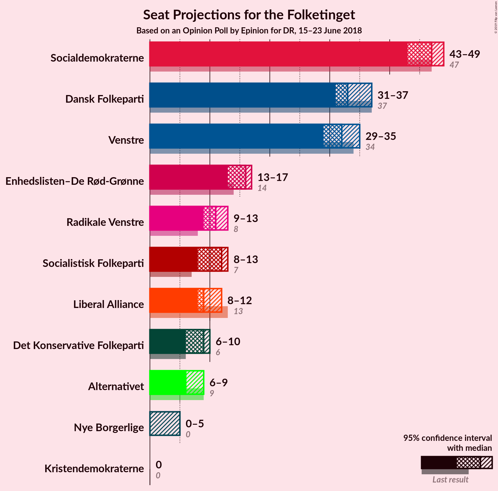
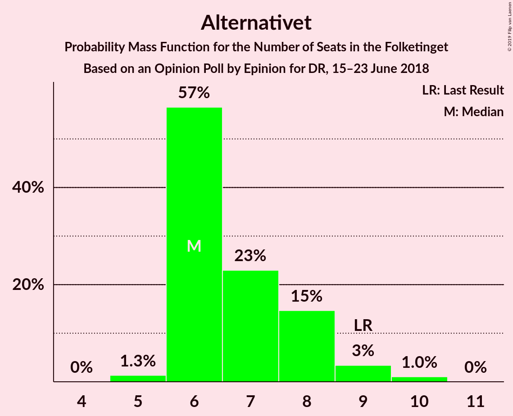

# Opinion Poll by Epinion for DR, 15–23 June 2018

<a href="#voting-intentions">Voting Intentions</a> | <a href="#seats">Seats</a> | <a href="#coalitions">Coalitions</a> | <a href="#technical-information">Technical Information</a>

## Voting Intentions

### Confidence Intervals

| Party | Last Result | Poll Result | 80% Confidence Interval | 90% Confidence Interval | 95% Confidence Interval | 99% Confidence Interval |
|:-----:|:-----------:|:-----------:|:-----------------------:|:-----------------------:|:-----------------------:|:-----------------------:|
| Socialdemokraterne | 26.3% | 25.9% | 24.6–27.3% |24.2–27.7% |23.9–28.1% |23.2–28.7% |
| Dansk Folkeparti | 21.1% | 18.8% | 17.6–20.1% |17.3–20.5% |17.0–20.8% |16.5–21.4% |
| Venstre | 19.5% | 18.1% | 16.9–19.4% |16.6–19.7% |16.3–20.0% |15.8–20.6% |
| Enhedslisten–De Rød-Grønne | 7.8% | 8.7% | 7.9–9.6% |7.6–9.9% |7.4–10.2% |7.1–10.6% |
| Radikale Venstre | 4.6% | 6.2% | 5.5–7.0% |5.3–7.3% |5.1–7.5% |4.8–7.9% |
| Socialistisk Folkeparti | 4.2% | 5.9% | 5.2–6.7% |5.0–6.9% |4.9–7.1% |4.6–7.5% |
| Liberal Alliance | 7.5% | 5.6% | 4.9–6.4% |4.8–6.6% |4.6–6.8% |4.3–7.2% |
| Det Konservative Folkeparti | 3.4% | 4.2% | 3.7–4.9% |3.5–5.1% |3.4–5.3% |3.1–5.7% |
| Alternativet | 4.8% | 4.1% | 3.6–4.8% |3.4–5.0% |3.3–5.2% |3.0–5.5% |
| Nye Borgerlige | 0.0% | 2.0% | 1.6–2.5% |1.5–2.7% |1.4–2.8% |1.3–3.1% |
| Kristendemokraterne | 0.8% | 0.6% | 0.4–0.9% |0.4–1.0% |0.3–1.1% |0.2–1.3% |

*Note:* The poll result column reflects the actual value used in the calculations. Published results may vary slightly, and in addition be rounded to fewer digits.

## Seats

### Confidence Intervals

| Party | Last Result | Median | 80% Confidence Interval | 90% Confidence Interval | 95% Confidence Interval | 99% Confidence Interval |
|:-----:|:-----------:|:------:|:-----------------------:|:-----------------------:|:-----------------------:|:-----------------------:|
| <a href="#socialdemokraterne">Socialdemokraterne</a> | 47 | 44 | 43–48 |43–49 |43–49 |42–49 |
| <a href="#dansk-folkeparti">Dansk Folkeparti</a> | 37 | 33 | 31–35 |31–36 |30–37 |27–38 |
| <a href="#venstre">Venstre</a> | 34 | 31 | 31–35 |29–37 |29–37 |28–37 |
| <a href="#enhedslisten–de-rød-grønne">Enhedslisten–De Rød-Grønne</a> | 14 | 16 | 14–17 |12–17 |12–18 |12–20 |
| <a href="#radikale-venstre">Radikale Venstre</a> | 8 | 10 | 9–10 |9–11 |9–12 |8–13 |
| <a href="#socialistisk-folkeparti">Socialistisk Folkeparti</a> | 7 | 11 | 9–13 |9–13 |8–13 |8–13 |
| <a href="#liberal-alliance">Liberal Alliance</a> | 13 | 10 | 9–12 |9–12 |9–12 |7–12 |
| <a href="#det-konservative-folkeparti">Det Konservative Folkeparti</a> | 6 | 9 | 6–9 |6–9 |6–9 |5–10 |
| <a href="#alternativet">Alternativet</a> | 9 | 8 | 6–9 |5–9 |5–9 |5–10 |
| <a href="#nye-borgerlige">Nye Borgerlige</a> | 0 | 0 | 0–5 |0–5 |0–5 |0–6 |
| <a href="#kristendemokraterne">Kristendemokraterne</a> | 0 | 0 | 0 |0 |0 |0 |

### Socialdemokraterne

*For a full overview of the results for this party, see the [Socialdemokraterne](party-socialdemokraterne.html) page.*

| Number of Seats | Probability | Accumulated | Special Marks |
|:---------------:|:-----------:|:-----------:|:-------------:|
| 39 | 0% | 100% |  |
| 40 | 0% | 99.9% |  |
| 41 | 0.2% | 99.9% |  |
| 42 | 2% | 99.7% |  |
| 43 | 44% | 98% |  |
| 44 | 5% | 54% | Median |
| 45 | 14% | 49% |  |
| 46 | 2% | 35% |  |
| 47 | 4% | 33% | Last Result |
| 48 | 20% | 29% |  |
| 49 | 9% | 9% |  |
| 50 | 0.1% | 0.3% |  |
| 51 | 0% | 0.2% |  |
| 52 | 0.2% | 0.2% |  |
| 53 | 0% | 0% |  |

### Dansk Folkeparti

*For a full overview of the results for this party, see the [Dansk Folkeparti](party-danskfolkeparti.html) page.*

| Number of Seats | Probability | Accumulated | Special Marks |
|:---------------:|:-----------:|:-----------:|:-------------:|
| 27 | 0.6% | 100% |  |
| 28 | 0% | 99.4% |  |
| 29 | 1.3% | 99.4% |  |
| 30 | 1.2% | 98% |  |
| 31 | 7% | 97% |  |
| 32 | 18% | 89% |  |
| 33 | 49% | 72% | Median |
| 34 | 5% | 22% |  |
| 35 | 11% | 18% |  |
| 36 | 1.2% | 6% |  |
| 37 | 3% | 5% | Last Result |
| 38 | 2% | 2% |  |
| 39 | 0.2% | 0.2% |  |
| 40 | 0% | 0% |  |

### Venstre

*For a full overview of the results for this party, see the [Venstre](party-venstre.html) page.*

| Number of Seats | Probability | Accumulated | Special Marks |
|:---------------:|:-----------:|:-----------:|:-------------:|
| 27 | 0.1% | 100% |  |
| 28 | 1.2% | 99.9% |  |
| 29 | 4% | 98.7% |  |
| 30 | 1.4% | 95% |  |
| 31 | 44% | 93% | Median |
| 32 | 4% | 49% |  |
| 33 | 2% | 45% |  |
| 34 | 16% | 43% | Last Result |
| 35 | 18% | 28% |  |
| 36 | 3% | 10% |  |
| 37 | 7% | 7% |  |
| 38 | 0% | 0% |  |

### Enhedslisten–De Rød-Grønne

*For a full overview of the results for this party, see the [Enhedslisten–De Rød-Grønne](party-enhedslisten–derød-grønne.html) page.*

| Number of Seats | Probability | Accumulated | Special Marks |
|:---------------:|:-----------:|:-----------:|:-------------:|
| 12 | 8% | 100% |  |
| 13 | 1.5% | 92% |  |
| 14 | 4% | 90% | Last Result |
| 15 | 12% | 86% |  |
| 16 | 46% | 74% | Median |
| 17 | 24% | 29% |  |
| 18 | 3% | 5% |  |
| 19 | 1.0% | 2% |  |
| 20 | 0.7% | 0.8% |  |
| 21 | 0% | 0% |  |

### Radikale Venstre

*For a full overview of the results for this party, see the [Radikale Venstre](party-radikalevenstre.html) page.*

| Number of Seats | Probability | Accumulated | Special Marks |
|:---------------:|:-----------:|:-----------:|:-------------:|
| 8 | 1.1% | 100% | Last Result |
| 9 | 27% | 98.9% |  |
| 10 | 65% | 72% | Median |
| 11 | 4% | 8% |  |
| 12 | 2% | 3% |  |
| 13 | 1.4% | 2% |  |
| 14 | 0.1% | 0.1% |  |
| 15 | 0% | 0% |  |

### Socialistisk Folkeparti

*For a full overview of the results for this party, see the [Socialistisk Folkeparti](party-socialistiskfolkeparti.html) page.*

| Number of Seats | Probability | Accumulated | Special Marks |
|:---------------:|:-----------:|:-----------:|:-------------:|
| 7 | 0.2% | 100% | Last Result |
| 8 | 3% | 99.8% |  |
| 9 | 21% | 97% |  |
| 10 | 22% | 77% |  |
| 11 | 8% | 55% | Median |
| 12 | 0.8% | 47% |  |
| 13 | 46% | 46% |  |
| 14 | 0% | 0% |  |

### Liberal Alliance

*For a full overview of the results for this party, see the [Liberal Alliance](party-liberalalliance.html) page.*

| Number of Seats | Probability | Accumulated | Special Marks |
|:---------------:|:-----------:|:-----------:|:-------------:|
| 7 | 0.9% | 100% |  |
| 8 | 0.2% | 99.1% |  |
| 9 | 34% | 98.9% |  |
| 10 | 21% | 65% | Median |
| 11 | 2% | 44% |  |
| 12 | 42% | 42% |  |
| 13 | 0.3% | 0.3% | Last Result |
| 14 | 0% | 0% |  |

### Det Konservative Folkeparti

*For a full overview of the results for this party, see the [Det Konservative Folkeparti](party-detkonservativefolkeparti.html) page.*

| Number of Seats | Probability | Accumulated | Special Marks |
|:---------------:|:-----------:|:-----------:|:-------------:|
| 5 | 0.9% | 100% |  |
| 6 | 13% | 99.1% | Last Result |
| 7 | 10% | 86% |  |
| 8 | 22% | 76% |  |
| 9 | 53% | 54% | Median |
| 10 | 0.3% | 0.6% |  |
| 11 | 0.3% | 0.3% |  |
| 12 | 0% | 0% |  |

### Alternativet

*For a full overview of the results for this party, see the [Alternativet](party-alternativet.html) page.*

| Number of Seats | Probability | Accumulated | Special Marks |
|:---------------:|:-----------:|:-----------:|:-------------:|
| 5 | 9% | 100% |  |
| 6 | 13% | 91% |  |
| 7 | 22% | 78% |  |
| 8 | 45% | 56% | Median |
| 9 | 10% | 11% | Last Result |
| 10 | 1.1% | 1.1% |  |
| 11 | 0% | 0% |  |

### Nye Borgerlige

*For a full overview of the results for this party, see the [Nye Borgerlige](party-nyeborgerlige.html) page.*

| Number of Seats | Probability | Accumulated | Special Marks |
|:---------------:|:-----------:|:-----------:|:-------------:|
| 0 | 72% | 100% | Last Result, Median |
| 1 | 0% | 28% |  |
| 2 | 0% | 28% |  |
| 3 | 0% | 28% |  |
| 4 | 15% | 28% |  |
| 5 | 12% | 13% |  |
| 6 | 1.0% | 1.0% |  |
| 7 | 0% | 0% |  |

### Kristendemokraterne

*For a full overview of the results for this party, see the [Kristendemokraterne](party-kristendemokraterne.html) page.*

| Number of Seats | Probability | Accumulated | Special Marks |
|:---------------:|:-----------:|:-----------:|:-------------:|
| 0 | 100% | 100% | Last Result, Median |

## Coalitions

### Confidence Intervals

| Coalition | Last Result | Median | Majority? | 80% Confidence Interval | 90% Confidence Interval | 95% Confidence Interval | 99% Confidence Interval |
|:---------:|:-----------:|:------:|:---------:|:-----------------------:|:-----------------------:|:-----------------------:|:-----------------------:|
| Socialdemokraterne – Enhedslisten–De Rød-Grønne – Radikale Venstre – Socialistisk Folkeparti – Alternativet | 85 | 90 | 67% | 86–91 | 86–91 | 82–93 | 81–96 |
| Dansk Folkeparti – Venstre – Liberal Alliance – Det Konservative Folkeparti – Nye Borgerlige – Kristendemokraterne | 90 | 85 | 3% | 84–89 | 84–89 | 82–93 | 79–94 |
| Dansk Folkeparti – Venstre – Liberal Alliance – Det Konservative Folkeparti – Nye Borgerlige | 90 | 85 | 3% | 84–89 | 84–89 | 82–93 | 79–94 |
| Dansk Folkeparti – Venstre – Liberal Alliance – Det Konservative Folkeparti – Kristendemokraterne | 90 | 85 | 0.1% | 83–87 | 80–87 | 79–89 | 75–89 |
| Dansk Folkeparti – Venstre – Liberal Alliance – Det Konservative Folkeparti | 90 | 85 | 0.1% | 83–87 | 80–87 | 79–89 | 75–89 |
| Socialdemokraterne – Enhedslisten–De Rød-Grønne – Radikale Venstre – Socialistisk Folkeparti | 76 | 82 | 0% | 79–84 | 79–84 | 77–86 | 75–89 |
| Socialdemokraterne – Enhedslisten–De Rød-Grønne – Socialistisk Folkeparti – Alternativet | 77 | 80 | 0% | 77–81 | 77–81 | 72–81 | 71–87 |
| Socialdemokraterne – Enhedslisten–De Rød-Grønne – Socialistisk Folkeparti | 68 | 72 | 0% | 70–74 | 69–75 | 66–75 | 65–79 |
| Socialdemokraterne – Radikale Venstre – Socialistisk Folkeparti | 62 | 66 | 0% | 64–68 | 63–68 | 62–69 | 61–74 |
| Socialdemokraterne – Radikale Venstre | 55 | 54 | 0% | 53–58 | 53–58 | 53–59 | 52–61 |
| Venstre – Liberal Alliance – Det Konservative Folkeparti | 53 | 52 | 0% | 49–52 | 47–56 | 46–56 | 46–56 |
| Venstre – Det Konservative Folkeparti | 40 | 40 | 0% | 39–43 | 38–46 | 37–46 | 36–46 |
| Venstre | 34 | 31 | 0% | 31–35 | 29–37 | 29–37 | 28–37 |

### Socialdemokraterne – Enhedslisten–De Rød-Grønne – Radikale Venstre – Socialistisk Folkeparti – Alternativet

| Number of Seats | Probability | Accumulated | Special Marks |
|:---------------:|:-----------:|:-----------:|:-------------:|
| 81 | 1.5% | 100% |  |
| 82 | 1.1% | 98.5% |  |
| 83 | 0.2% | 97% |  |
| 84 | 0.2% | 97% |  |
| 85 | 0.2% | 97% | Last Result |
| 86 | 8% | 97% |  |
| 87 | 6% | 88% |  |
| 88 | 13% | 82% |  |
| 89 | 2% | 69% | Median |
| 90 | 46% | 67% | Majority |
| 91 | 18% | 22% |  |
| 92 | 1.4% | 4% |  |
| 93 | 0.3% | 3% |  |
| 94 | 0.1% | 2% |  |
| 95 | 0.1% | 2% |  |
| 96 | 2% | 2% |  |
| 97 | 0% | 0% |  |

### Dansk Folkeparti – Venstre – Liberal Alliance – Det Konservative Folkeparti – Nye Borgerlige – Kristendemokraterne

| Number of Seats | Probability | Accumulated | Special Marks |
|:---------------:|:-----------:|:-----------:|:-------------:|
| 79 | 2% | 100% |  |
| 80 | 0.1% | 98% |  |
| 81 | 0.1% | 98% |  |
| 82 | 0.3% | 98% |  |
| 83 | 1.4% | 97% | Median |
| 84 | 18% | 96% |  |
| 85 | 46% | 78% |  |
| 86 | 2% | 33% |  |
| 87 | 13% | 31% |  |
| 88 | 6% | 18% |  |
| 89 | 8% | 12% |  |
| 90 | 0.2% | 3% | Last Result, Majority |
| 91 | 0.2% | 3% |  |
| 92 | 0.2% | 3% |  |
| 93 | 1.1% | 3% |  |
| 94 | 1.5% | 1.5% |  |
| 95 | 0% | 0% |  |

### Dansk Folkeparti – Venstre – Liberal Alliance – Det Konservative Folkeparti – Nye Borgerlige

| Number of Seats | Probability | Accumulated | Special Marks |
|:---------------:|:-----------:|:-----------:|:-------------:|
| 79 | 2% | 100% |  |
| 80 | 0.1% | 98% |  |
| 81 | 0.1% | 98% |  |
| 82 | 0.3% | 98% |  |
| 83 | 1.4% | 97% | Median |
| 84 | 18% | 96% |  |
| 85 | 46% | 78% |  |
| 86 | 2% | 33% |  |
| 87 | 13% | 31% |  |
| 88 | 6% | 18% |  |
| 89 | 8% | 12% |  |
| 90 | 0.2% | 3% | Last Result, Majority |
| 91 | 0.2% | 3% |  |
| 92 | 0.2% | 3% |  |
| 93 | 1.1% | 3% |  |
| 94 | 1.5% | 1.5% |  |
| 95 | 0% | 0% |  |

### Dansk Folkeparti – Venstre – Liberal Alliance – Det Konservative Folkeparti – Kristendemokraterne

| Number of Seats | Probability | Accumulated | Special Marks |
|:---------------:|:-----------:|:-----------:|:-------------:|
| 75 | 1.2% | 100% |  |
| 76 | 0.1% | 98.8% |  |
| 77 | 0.1% | 98.7% |  |
| 78 | 0.7% | 98.6% |  |
| 79 | 1.0% | 98% |  |
| 80 | 5% | 97% |  |
| 81 | 0.4% | 92% |  |
| 82 | 1.3% | 92% |  |
| 83 | 8% | 90% | Median |
| 84 | 18% | 82% |  |
| 85 | 50% | 64% |  |
| 86 | 1.2% | 14% |  |
| 87 | 9% | 12% |  |
| 88 | 1.2% | 4% |  |
| 89 | 2% | 3% |  |
| 90 | 0% | 0.1% | Last Result, Majority |
| 91 | 0% | 0.1% |  |
| 92 | 0% | 0% |  |

### Dansk Folkeparti – Venstre – Liberal Alliance – Det Konservative Folkeparti

| Number of Seats | Probability | Accumulated | Special Marks |
|:---------------:|:-----------:|:-----------:|:-------------:|
| 75 | 1.2% | 100% |  |
| 76 | 0.1% | 98.8% |  |
| 77 | 0.1% | 98.7% |  |
| 78 | 0.7% | 98.6% |  |
| 79 | 1.0% | 98% |  |
| 80 | 5% | 97% |  |
| 81 | 0.4% | 92% |  |
| 82 | 1.3% | 92% |  |
| 83 | 8% | 90% | Median |
| 84 | 18% | 82% |  |
| 85 | 50% | 64% |  |
| 86 | 1.2% | 14% |  |
| 87 | 9% | 12% |  |
| 88 | 1.2% | 4% |  |
| 89 | 2% | 3% |  |
| 90 | 0% | 0.1% | Last Result, Majority |
| 91 | 0% | 0.1% |  |
| 92 | 0% | 0% |  |

### Socialdemokraterne – Enhedslisten–De Rød-Grønne – Radikale Venstre – Socialistisk Folkeparti

| Number of Seats | Probability | Accumulated | Special Marks |
|:---------------:|:-----------:|:-----------:|:-------------:|
| 74 | 0.1% | 100% |  |
| 75 | 2% | 99.9% |  |
| 76 | 0.2% | 98% | Last Result |
| 77 | 1.0% | 98% |  |
| 78 | 0.8% | 97% |  |
| 79 | 10% | 96% |  |
| 80 | 10% | 87% |  |
| 81 | 2% | 77% | Median |
| 82 | 47% | 75% |  |
| 83 | 4% | 28% |  |
| 84 | 21% | 24% |  |
| 85 | 0.1% | 3% |  |
| 86 | 0.2% | 3% |  |
| 87 | 0.3% | 2% |  |
| 88 | 0.9% | 2% |  |
| 89 | 1.2% | 1.2% |  |
| 90 | 0% | 0% | Majority |

### Socialdemokraterne – Enhedslisten–De Rød-Grønne – Socialistisk Folkeparti – Alternativet

| Number of Seats | Probability | Accumulated | Special Marks |
|:---------------:|:-----------:|:-----------:|:-------------:|
| 71 | 2% | 100% |  |
| 72 | 0.1% | 98% |  |
| 73 | 0.3% | 97% |  |
| 74 | 0.3% | 97% |  |
| 75 | 0% | 97% |  |
| 76 | 0.1% | 97% |  |
| 77 | 11% | 97% | Last Result |
| 78 | 8% | 85% |  |
| 79 | 9% | 77% | Median |
| 80 | 44% | 68% |  |
| 81 | 22% | 24% |  |
| 82 | 0.2% | 2% |  |
| 83 | 1.3% | 2% |  |
| 84 | 0.1% | 1.0% |  |
| 85 | 0% | 0.9% |  |
| 86 | 0.1% | 0.9% |  |
| 87 | 0.7% | 0.7% |  |
| 88 | 0% | 0% |  |

### Socialdemokraterne – Enhedslisten–De Rød-Grønne – Socialistisk Folkeparti

| Number of Seats | Probability | Accumulated | Special Marks |
|:---------------:|:-----------:|:-----------:|:-------------:|
| 65 | 2% | 100% |  |
| 66 | 1.2% | 98% |  |
| 67 | 0.8% | 97% |  |
| 68 | 0.9% | 96% | Last Result |
| 69 | 0.6% | 95% |  |
| 70 | 11% | 95% |  |
| 71 | 10% | 84% | Median |
| 72 | 41% | 74% |  |
| 73 | 9% | 33% |  |
| 74 | 19% | 24% |  |
| 75 | 3% | 5% |  |
| 76 | 1.3% | 2% |  |
| 77 | 0.1% | 0.9% |  |
| 78 | 0.1% | 0.8% |  |
| 79 | 0.7% | 0.7% |  |
| 80 | 0% | 0% |  |

### Socialdemokraterne – Radikale Venstre – Socialistisk Folkeparti

| Number of Seats | Probability | Accumulated | Special Marks |
|:---------------:|:-----------:|:-----------:|:-------------:|
| 59 | 0% | 100% |  |
| 60 | 0.1% | 99.9% |  |
| 61 | 2% | 99.9% |  |
| 62 | 1.2% | 98% | Last Result |
| 63 | 2% | 97% |  |
| 64 | 9% | 95% |  |
| 65 | 6% | 86% | Median |
| 66 | 45% | 79% |  |
| 67 | 22% | 35% |  |
| 68 | 9% | 12% |  |
| 69 | 1.0% | 3% |  |
| 70 | 0.2% | 2% |  |
| 71 | 0.4% | 2% |  |
| 72 | 0.1% | 1.4% |  |
| 73 | 0% | 1.3% |  |
| 74 | 1.3% | 1.3% |  |
| 75 | 0% | 0% |  |

### Socialdemokraterne – Radikale Venstre

| Number of Seats | Probability | Accumulated | Special Marks |
|:---------------:|:-----------:|:-----------:|:-------------:|
| 49 | 0.1% | 100% |  |
| 50 | 0% | 99.9% |  |
| 51 | 0.2% | 99.9% |  |
| 52 | 0.3% | 99.7% |  |
| 53 | 49% | 99.4% |  |
| 54 | 14% | 50% | Median |
| 55 | 2% | 36% | Last Result |
| 56 | 0.3% | 35% |  |
| 57 | 3% | 34% |  |
| 58 | 29% | 31% |  |
| 59 | 0.8% | 3% |  |
| 60 | 0.1% | 2% |  |
| 61 | 2% | 2% |  |
| 62 | 0.1% | 0.1% |  |
| 63 | 0% | 0% |  |

### Venstre – Liberal Alliance – Det Konservative Folkeparti

| Number of Seats | Probability | Accumulated | Special Marks |
|:---------------:|:-----------:|:-----------:|:-------------:|
| 44 | 0.1% | 100% |  |
| 45 | 0.3% | 99.9% |  |
| 46 | 3% | 99.6% |  |
| 47 | 5% | 97% |  |
| 48 | 1.2% | 91% |  |
| 49 | 4% | 90% |  |
| 50 | 14% | 86% | Median |
| 51 | 3% | 72% |  |
| 52 | 60% | 68% |  |
| 53 | 1.1% | 9% | Last Result |
| 54 | 0.4% | 8% |  |
| 55 | 0% | 7% |  |
| 56 | 7% | 7% |  |
| 57 | 0.1% | 0.1% |  |
| 58 | 0% | 0% |  |

### Venstre – Det Konservative Folkeparti

| Number of Seats | Probability | Accumulated | Special Marks |
|:---------------:|:-----------:|:-----------:|:-------------:|
| 34 | 0% | 100% |  |
| 35 | 0.3% | 99.9% |  |
| 36 | 2% | 99.6% |  |
| 37 | 2% | 98% |  |
| 38 | 4% | 96% |  |
| 39 | 3% | 92% |  |
| 40 | 51% | 89% | Last Result, Median |
| 41 | 11% | 38% |  |
| 42 | 2% | 27% |  |
| 43 | 17% | 25% |  |
| 44 | 0.2% | 8% |  |
| 45 | 0.2% | 7% |  |
| 46 | 7% | 7% |  |
| 47 | 0% | 0% |  |

### Venstre

| Number of Seats | Probability | Accumulated | Special Marks |
|:---------------:|:-----------:|:-----------:|:-------------:|
| 27 | 0.1% | 100% |  |
| 28 | 1.2% | 99.9% |  |
| 29 | 4% | 98.7% |  |
| 30 | 1.4% | 95% |  |
| 31 | 44% | 93% | Median |
| 32 | 4% | 49% |  |
| 33 | 2% | 45% |  |
| 34 | 16% | 43% | Last Result |
| 35 | 18% | 28% |  |
| 36 | 3% | 10% |  |
| 37 | 7% | 7% |  |
| 38 | 0% | 0% |  |

## Technical Information

### Opinion Poll

+ **Polling firm:** Epinion
+ **Commissioner(s):** DR
+ **Fieldwork period:** 15–23 June 2018

### Calculations

+ **Sample size:** 1679
+ **Simulations done:** 131,072
+ **Error estimate:** 3.64%

