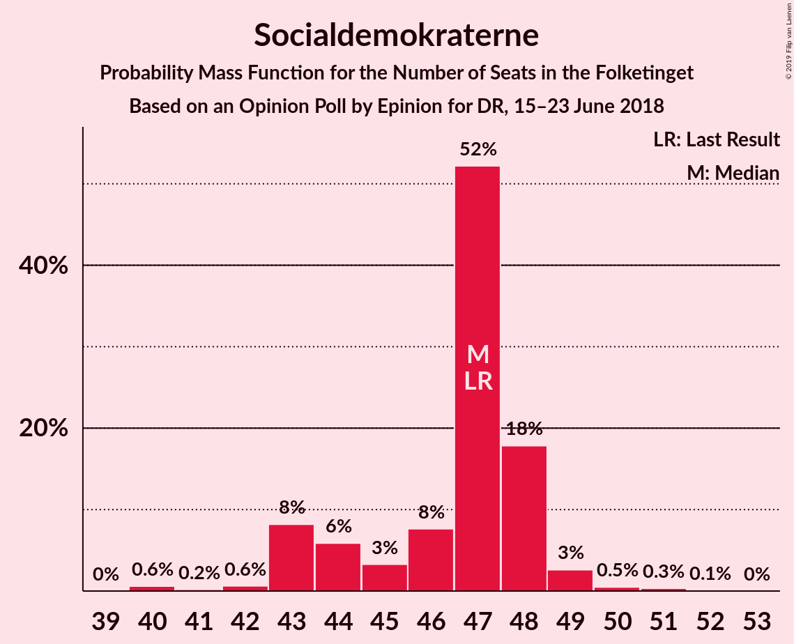
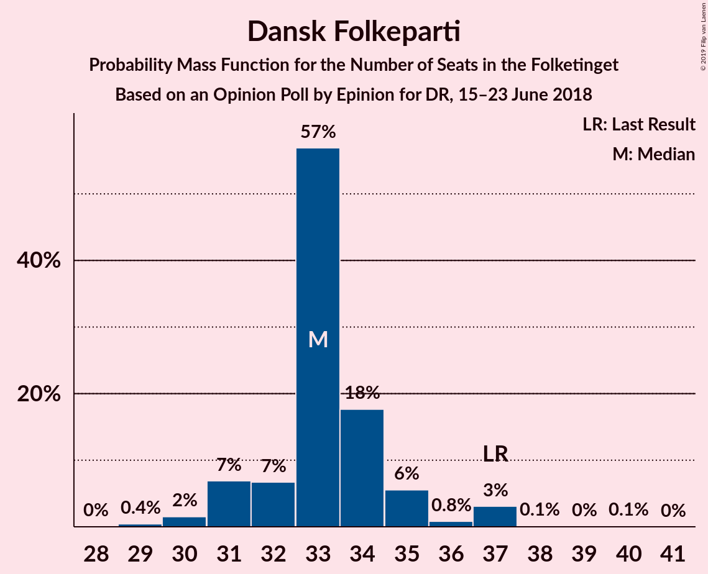
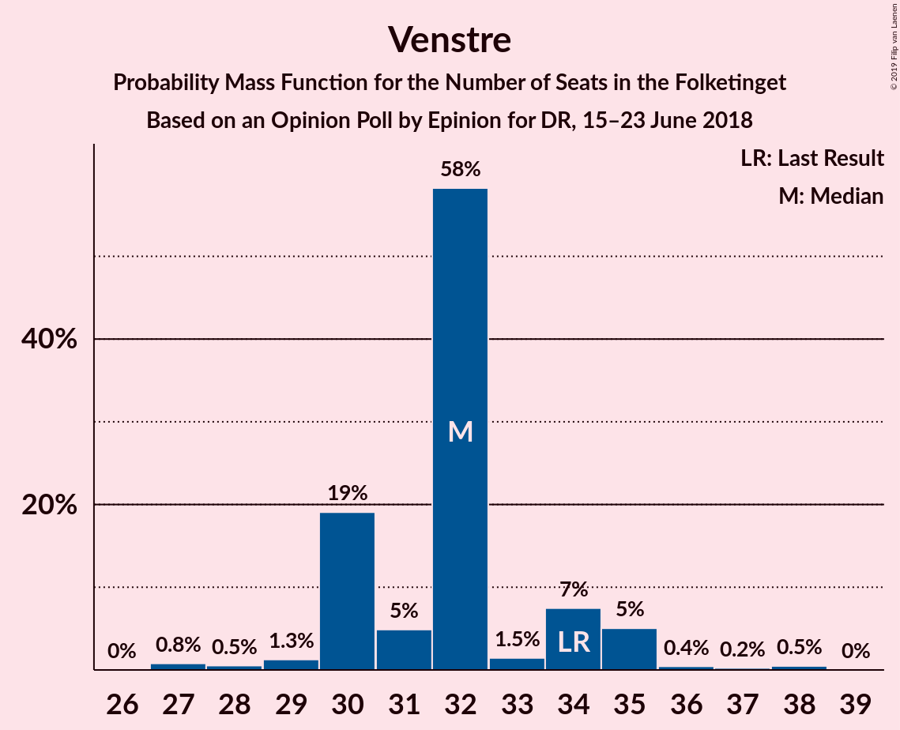
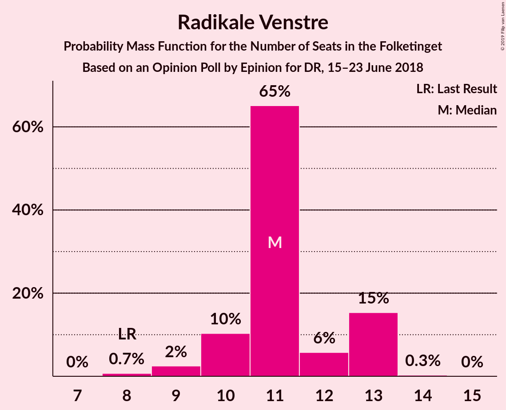

# Opinion Poll by Epinion for DR, 15–23 June 2018

<a href="#voting-intentions">Voting Intentions</a> | <a href="#seats">Seats</a> | <a href="#coalitions">Coalitions</a> | <a href="#technical-information">Technical Information</a>

## Voting Intentions

### Confidence Intervals

| Party | Last Result | Poll Result | 80% Confidence Interval | 90% Confidence Interval | 95% Confidence Interval | 99% Confidence Interval |
|:-----:|:-----------:|:-----------:|:-----------------------:|:-----------------------:|:-----------------------:|:-----------------------:|
| Socialdemokraterne | 26.3% | 25.9% | 24.6–27.3% |24.2–27.7% |23.9–28.1% |23.2–28.7% |
| Dansk Folkeparti | 21.1% | 18.8% | 17.6–20.1% |17.3–20.5% |17.0–20.8% |16.5–21.4% |
| Venstre | 19.5% | 18.1% | 16.9–19.4% |16.6–19.7% |16.3–20.0% |15.8–20.6% |
| Enhedslisten–De Rød-Grønne | 7.8% | 8.7% | 7.9–9.6% |7.6–9.9% |7.4–10.2% |7.1–10.6% |
| Radikale Venstre | 4.6% | 6.2% | 5.5–7.0% |5.3–7.3% |5.1–7.5% |4.8–7.9% |
| Socialistisk Folkeparti | 4.2% | 5.9% | 5.2–6.7% |5.0–6.9% |4.9–7.1% |4.6–7.5% |
| Liberal Alliance | 7.5% | 5.6% | 4.9–6.4% |4.8–6.6% |4.6–6.8% |4.3–7.2% |
| Det Konservative Folkeparti | 3.4% | 4.2% | 3.7–4.9% |3.5–5.1% |3.4–5.3% |3.1–5.7% |
| Alternativet | 4.8% | 4.1% | 3.6–4.8% |3.4–5.0% |3.3–5.2% |3.0–5.5% |
| Nye Borgerlige | 0.0% | 2.0% | 1.6–2.5% |1.5–2.7% |1.4–2.8% |1.3–3.1% |
| Kristendemokraterne | 0.8% | 0.6% | 0.4–0.9% |0.4–1.0% |0.3–1.1% |0.2–1.3% |

*Note:* The poll result column reflects the actual value used in the calculations. Published results may vary slightly, and in addition be rounded to fewer digits.

## Seats

### Confidence Intervals

| Party | Last Result | Median | 80% Confidence Interval | 90% Confidence Interval | 95% Confidence Interval | 99% Confidence Interval |
|:-----:|:-----------:|:------:|:-----------------------:|:-----------------------:|:-----------------------:|:-----------------------:|
| <a href="#socialdemokraterne">Socialdemokraterne</a> | 47 | 45 | 43–48 |42–48 |39–52 |39–52 |
| <a href="#dansk-folkeparti">Dansk Folkeparti</a> | 37 | 29 | 28–40 |28–40 |28–40 |28–40 |
| <a href="#venstre">Venstre</a> | 34 | 29 | 29–31 |29–35 |29–35 |29–36 |
| <a href="#enhedslisten–de-rød-grønne">Enhedslisten–De Rød-Grønne</a> | 14 | 18 | 16–21 |15–21 |13–21 |11–21 |
| <a href="#radikale-venstre">Radikale Venstre</a> | 8 | 10 | 10–14 |9–14 |9–14 |7–14 |
| <a href="#socialistisk-folkeparti">Socialistisk Folkeparti</a> | 7 | 8 | 7–11 |7–12 |7–13 |7–13 |
| <a href="#liberal-alliance">Liberal Alliance</a> | 13 | 10 | 9–12 |7–12 |7–12 |7–12 |
| <a href="#det-konservative-folkeparti">Det Konservative Folkeparti</a> | 6 | 8 | 6–8 |6–9 |6–9 |6–9 |
| <a href="#alternativet">Alternativet</a> | 9 | 8 | 6–9 |6–10 |6–11 |6–11 |
| <a href="#nye-borgerlige">Nye Borgerlige</a> | 0 | 4 | 0–6 |0–6 |0–6 |0–6 |
| <a href="#kristendemokraterne">Kristendemokraterne</a> | 0 | 0 | 0 |0 |0 |0 |

### Socialdemokraterne

*For a full overview of the results for this party, see the [Socialdemokraterne](party-socialdemokraterne.html) page.*

| Number of Seats | Probability | Accumulated | Special Marks |
|:---------------:|:-----------:|:-----------:|:-------------:|
| 39 | 3% | 100% |  |
| 40 | 0.1% | 97% |  |
| 41 | 0% | 97% |  |
| 42 | 6% | 97% |  |
| 43 | 3% | 91% |  |
| 44 | 1.3% | 88% |  |
| 45 | 47% | 86% | Median |
| 46 | 5% | 40% |  |
| 47 | 0% | 35% | Last Result |
| 48 | 30% | 35% |  |
| 49 | 0.9% | 4% |  |
| 50 | 0% | 3% |  |
| 51 | 0% | 3% |  |
| 52 | 3% | 3% |  |
| 53 | 0% | 0.1% |  |
| 54 | 0% | 0.1% |  |
| 55 | 0.1% | 0.1% |  |
| 56 | 0% | 0% |  |

### Dansk Folkeparti

*For a full overview of the results for this party, see the [Dansk Folkeparti](party-danskfolkeparti.html) page.*

| Number of Seats | Probability | Accumulated | Special Marks |
|:---------------:|:-----------:|:-----------:|:-------------:|
| 28 | 30% | 100% |  |
| 29 | 31% | 70% | Median |
| 30 | 0.4% | 38% |  |
| 31 | 0% | 38% |  |
| 32 | 0% | 38% |  |
| 33 | 5% | 38% |  |
| 34 | 0.7% | 33% |  |
| 35 | 5% | 32% |  |
| 36 | 7% | 27% |  |
| 37 | 0% | 20% | Last Result |
| 38 | 0% | 20% |  |
| 39 | 5% | 20% |  |
| 40 | 15% | 15% |  |
| 41 | 0% | 0% |  |

### Venstre

*For a full overview of the results for this party, see the [Venstre](party-venstre.html) page.*

| Number of Seats | Probability | Accumulated | Special Marks |
|:---------------:|:-----------:|:-----------:|:-------------:|
| 25 | 0.2% | 100% |  |
| 26 | 0% | 99.8% |  |
| 27 | 0% | 99.8% |  |
| 28 | 0% | 99.8% |  |
| 29 | 68% | 99.8% | Median |
| 30 | 8% | 32% |  |
| 31 | 15% | 24% |  |
| 32 | 0.1% | 8% |  |
| 33 | 0% | 8% |  |
| 34 | 3% | 8% | Last Result |
| 35 | 3% | 5% |  |
| 36 | 2% | 2% |  |
| 37 | 0.3% | 0.4% |  |
| 38 | 0% | 0.1% |  |
| 39 | 0.1% | 0.1% |  |
| 40 | 0% | 0% |  |

### Enhedslisten–De Rød-Grønne

*For a full overview of the results for this party, see the [Enhedslisten–De Rød-Grønne](party-enhedslisten–derød-grønne.html) page.*

| Number of Seats | Probability | Accumulated | Special Marks |
|:---------------:|:-----------:|:-----------:|:-------------:|
| 11 | 0.9% | 100% |  |
| 12 | 0% | 99.1% |  |
| 13 | 3% | 99.1% |  |
| 14 | 0.2% | 96% | Last Result |
| 15 | 4% | 96% |  |
| 16 | 16% | 92% |  |
| 17 | 8% | 76% |  |
| 18 | 30% | 68% | Median |
| 19 | 5% | 37% |  |
| 20 | 0% | 32% |  |
| 21 | 32% | 32% |  |
| 22 | 0% | 0% |  |

### Radikale Venstre

*For a full overview of the results for this party, see the [Radikale Venstre](party-radikalevenstre.html) page.*

| Number of Seats | Probability | Accumulated | Special Marks |
|:---------------:|:-----------:|:-----------:|:-------------:|
| 7 | 0.7% | 100% |  |
| 8 | 1.0% | 99.3% | Last Result |
| 9 | 4% | 98% |  |
| 10 | 47% | 94% | Median |
| 11 | 15% | 47% |  |
| 12 | 0.1% | 32% |  |
| 13 | 0.1% | 32% |  |
| 14 | 32% | 32% |  |
| 15 | 0% | 0% |  |

### Socialistisk Folkeparti

*For a full overview of the results for this party, see the [Socialistisk Folkeparti](party-socialistiskfolkeparti.html) page.*

| Number of Seats | Probability | Accumulated | Special Marks |
|:---------------:|:-----------:|:-----------:|:-------------:|
| 7 | 31% | 100% | Last Result |
| 8 | 34% | 69% | Median |
| 9 | 16% | 35% |  |
| 10 | 6% | 19% |  |
| 11 | 4% | 13% |  |
| 12 | 5% | 9% |  |
| 13 | 4% | 4% |  |
| 14 | 0.1% | 0.1% |  |
| 15 | 0% | 0% |  |

### Liberal Alliance

*For a full overview of the results for this party, see the [Liberal Alliance](party-liberalalliance.html) page.*

| Number of Seats | Probability | Accumulated | Special Marks |
|:---------------:|:-----------:|:-----------:|:-------------:|
| 7 | 8% | 100% |  |
| 8 | 1.0% | 92% |  |
| 9 | 8% | 91% |  |
| 10 | 37% | 83% | Median |
| 11 | 15% | 46% |  |
| 12 | 31% | 31% |  |
| 13 | 0% | 0% | Last Result |

### Det Konservative Folkeparti

*For a full overview of the results for this party, see the [Det Konservative Folkeparti](party-detkonservativefolkeparti.html) page.*

| Number of Seats | Probability | Accumulated | Special Marks |
|:---------------:|:-----------:|:-----------:|:-------------:|
| 4 | 0.1% | 100% |  |
| 5 | 0% | 99.9% |  |
| 6 | 15% | 99.9% | Last Result |
| 7 | 15% | 85% |  |
| 8 | 65% | 70% | Median |
| 9 | 5% | 5% |  |
| 10 | 0.4% | 0.4% |  |
| 11 | 0% | 0% |  |

### Alternativet

*For a full overview of the results for this party, see the [Alternativet](party-alternativet.html) page.*

| Number of Seats | Probability | Accumulated | Special Marks |
|:---------------:|:-----------:|:-----------:|:-------------:|
| 5 | 0.5% | 100% |  |
| 6 | 20% | 99.5% |  |
| 7 | 0.8% | 79% |  |
| 8 | 68% | 78% | Median |
| 9 | 5% | 10% | Last Result |
| 10 | 2% | 5% |  |
| 11 | 3% | 3% |  |
| 12 | 0% | 0% |  |

### Nye Borgerlige

*For a full overview of the results for this party, see the [Nye Borgerlige](party-nyeborgerlige.html) page.*

| Number of Seats | Probability | Accumulated | Special Marks |
|:---------------:|:-----------:|:-----------:|:-------------:|
| 0 | 28% | 100% | Last Result |
| 1 | 0% | 72% |  |
| 2 | 0% | 72% |  |
| 3 | 0% | 72% |  |
| 4 | 32% | 72% | Median |
| 5 | 9% | 40% |  |
| 6 | 30% | 30% |  |
| 7 | 0% | 0% |  |

### Kristendemokraterne

*For a full overview of the results for this party, see the [Kristendemokraterne](party-kristendemokraterne.html) page.*

| Number of Seats | Probability | Accumulated | Special Marks |
|:---------------:|:-----------:|:-----------:|:-------------:|
| 0 | 100% | 100% | Last Result, Median |

## Coalitions

### Confidence Intervals

| Coalition | Last Result | Median | Majority? | 80% Confidence Interval | 90% Confidence Interval | 95% Confidence Interval | 99% Confidence Interval |
|:---------:|:-----------:|:------:|:---------:|:-----------------------:|:-----------------------:|:-----------------------:|:-----------------------:|
| Socialdemokraterne – Enhedslisten–De Rød-Grønne – Radikale Venstre – Socialistisk Folkeparti – Alternativet | 85 | 92 | 74% | 87–95 | 87–95 | 85–95 | 83–95 |
| Dansk Folkeparti – Venstre – Liberal Alliance – Det Konservative Folkeparti – Nye Borgerlige – Kristendemokraterne | 90 | 83 | 4% | 80–88 | 80–88 | 80–90 | 80–92 |
| Dansk Folkeparti – Venstre – Liberal Alliance – Det Konservative Folkeparti – Nye Borgerlige | 90 | 83 | 4% | 80–88 | 80–88 | 80–90 | 80–92 |
| Dansk Folkeparti – Venstre – Liberal Alliance – Det Konservative Folkeparti – Kristendemokraterne | 90 | 77 | 0.1% | 76–88 | 76–88 | 76–88 | 76–88 |
| Dansk Folkeparti – Venstre – Liberal Alliance – Det Konservative Folkeparti | 90 | 77 | 0.1% | 76–88 | 76–88 | 76–88 | 76–88 |
| Socialdemokraterne – Enhedslisten–De Rød-Grønne – Radikale Venstre – Socialistisk Folkeparti | 76 | 84 | 0.1% | 81–87 | 78–87 | 77–87 | 76–87 |

### Socialdemokraterne – Enhedslisten–De Rød-Grønne – Radikale Venstre – Socialistisk Folkeparti – Alternativet

| Number of Seats | Probability | Accumulated | Special Marks |
|:---------------:|:-----------:|:-----------:|:-------------:|
| 83 | 0.8% | 100% |  |
| 84 | 0% | 99.2% |  |
| 85 | 3% | 99.2% | Last Result |
| 86 | 0.3% | 96% |  |
| 87 | 20% | 96% |  |
| 88 | 0.9% | 75% |  |
| 89 | 0% | 74% | Median |
| 90 | 0% | 74% | Majority |
| 91 | 6% | 74% |  |
| 92 | 31% | 68% |  |
| 93 | 1.0% | 38% |  |
| 94 | 5% | 37% |  |
| 95 | 31% | 31% |  |
| 96 | 0% | 0.1% |  |
| 97 | 0% | 0.1% |  |
| 98 | 0% | 0.1% |  |
| 99 | 0% | 0.1% |  |
| 100 | 0% | 0.1% |  |
| 101 | 0.1% | 0.1% |  |
| 102 | 0% | 0% |  |

### Dansk Folkeparti – Venstre – Liberal Alliance – Det Konservative Folkeparti – Nye Borgerlige – Kristendemokraterne

| Number of Seats | Probability | Accumulated | Special Marks |
|:---------------:|:-----------:|:-----------:|:-------------:|
| 74 | 0.1% | 100% |  |
| 75 | 0% | 99.9% |  |
| 76 | 0% | 99.9% |  |
| 77 | 0% | 99.9% |  |
| 78 | 0% | 99.9% |  |
| 79 | 0% | 99.9% |  |
| 80 | 31% | 99.9% | Median |
| 81 | 5% | 69% |  |
| 82 | 1.0% | 63% |  |
| 83 | 31% | 62% |  |
| 84 | 6% | 32% |  |
| 85 | 0% | 26% |  |
| 86 | 0% | 26% |  |
| 87 | 0.9% | 26% |  |
| 88 | 20% | 25% |  |
| 89 | 0.3% | 4% |  |
| 90 | 3% | 4% | Last Result, Majority |
| 91 | 0% | 0.8% |  |
| 92 | 0.8% | 0.8% |  |
| 93 | 0% | 0% |  |

### Dansk Folkeparti – Venstre – Liberal Alliance – Det Konservative Folkeparti – Nye Borgerlige

| Number of Seats | Probability | Accumulated | Special Marks |
|:---------------:|:-----------:|:-----------:|:-------------:|
| 74 | 0.1% | 100% |  |
| 75 | 0% | 99.9% |  |
| 76 | 0% | 99.9% |  |
| 77 | 0% | 99.9% |  |
| 78 | 0% | 99.9% |  |
| 79 | 0% | 99.9% |  |
| 80 | 31% | 99.9% | Median |
| 81 | 5% | 69% |  |
| 82 | 1.0% | 63% |  |
| 83 | 31% | 62% |  |
| 84 | 6% | 32% |  |
| 85 | 0% | 26% |  |
| 86 | 0% | 26% |  |
| 87 | 0.9% | 26% |  |
| 88 | 20% | 25% |  |
| 89 | 0.3% | 4% |  |
| 90 | 3% | 4% | Last Result, Majority |
| 91 | 0% | 0.8% |  |
| 92 | 0.8% | 0.8% |  |
| 93 | 0% | 0% |  |

### Dansk Folkeparti – Venstre – Liberal Alliance – Det Konservative Folkeparti – Kristendemokraterne

| Number of Seats | Probability | Accumulated | Special Marks |
|:---------------:|:-----------:|:-----------:|:-------------:|
| 74 | 0.1% | 100% |  |
| 75 | 0% | 99.9% |  |
| 76 | 31% | 99.9% | Median |
| 77 | 31% | 69% |  |
| 78 | 0.1% | 37% |  |
| 79 | 0% | 37% |  |
| 80 | 0.1% | 37% |  |
| 81 | 5% | 37% |  |
| 82 | 0% | 32% |  |
| 83 | 5% | 32% |  |
| 84 | 6% | 27% |  |
| 85 | 3% | 21% |  |
| 86 | 0% | 17% |  |
| 87 | 0.9% | 17% |  |
| 88 | 16% | 16% |  |
| 89 | 0.3% | 0.4% |  |
| 90 | 0% | 0.1% | Last Result, Majority |
| 91 | 0% | 0.1% |  |
| 92 | 0.1% | 0.1% |  |
| 93 | 0% | 0% |  |

### Dansk Folkeparti – Venstre – Liberal Alliance – Det Konservative Folkeparti

| Number of Seats | Probability | Accumulated | Special Marks |
|:---------------:|:-----------:|:-----------:|:-------------:|
| 74 | 0.1% | 100% |  |
| 75 | 0% | 99.9% |  |
| 76 | 31% | 99.9% | Median |
| 77 | 31% | 69% |  |
| 78 | 0.1% | 37% |  |
| 79 | 0% | 37% |  |
| 80 | 0.1% | 37% |  |
| 81 | 5% | 37% |  |
| 82 | 0% | 32% |  |
| 83 | 5% | 32% |  |
| 84 | 6% | 27% |  |
| 85 | 3% | 21% |  |
| 86 | 0% | 17% |  |
| 87 | 0.9% | 17% |  |
| 88 | 16% | 16% |  |
| 89 | 0.3% | 0.4% |  |
| 90 | 0% | 0.1% | Last Result, Majority |
| 91 | 0% | 0.1% |  |
| 92 | 0.1% | 0.1% |  |
| 93 | 0% | 0% |  |

### Socialdemokraterne – Enhedslisten–De Rød-Grønne – Radikale Venstre – Socialistisk Folkeparti

| Number of Seats | Probability | Accumulated | Special Marks |
|:---------------:|:-----------:|:-----------:|:-------------:|
| 76 | 0.7% | 100% | Last Result |
| 77 | 3% | 99.3% |  |
| 78 | 0.9% | 96% |  |
| 79 | 0% | 95% |  |
| 80 | 3% | 95% |  |
| 81 | 20% | 92% | Median |
| 82 | 0% | 71% |  |
| 83 | 4% | 71% |  |
| 84 | 30% | 67% |  |
| 85 | 5% | 37% |  |
| 86 | 0.2% | 32% |  |
| 87 | 31% | 31% |  |
| 88 | 0% | 0.1% |  |
| 89 | 0% | 0.1% |  |
| 90 | 0% | 0.1% | Majority |
| 91 | 0% | 0.1% |  |
| 92 | 0% | 0.1% |  |
| 93 | 0% | 0.1% |  |
| 94 | 0% | 0.1% |  |
| 95 | 0% | 0.1% |  |
| 96 | 0.1% | 0.1% |  |
| 97 | 0% | 0% |  |

## Technical Information

### Opinion Poll

+ **Polling firm:** Epinion
+ **Commissioner(s):** DR
+ **Fieldwork period:** 15–23 June 2018

### Calculations

+ **Sample size:** 1679
+ **Simulations done:** 1,024
+ **Error estimate:** 2.24%

