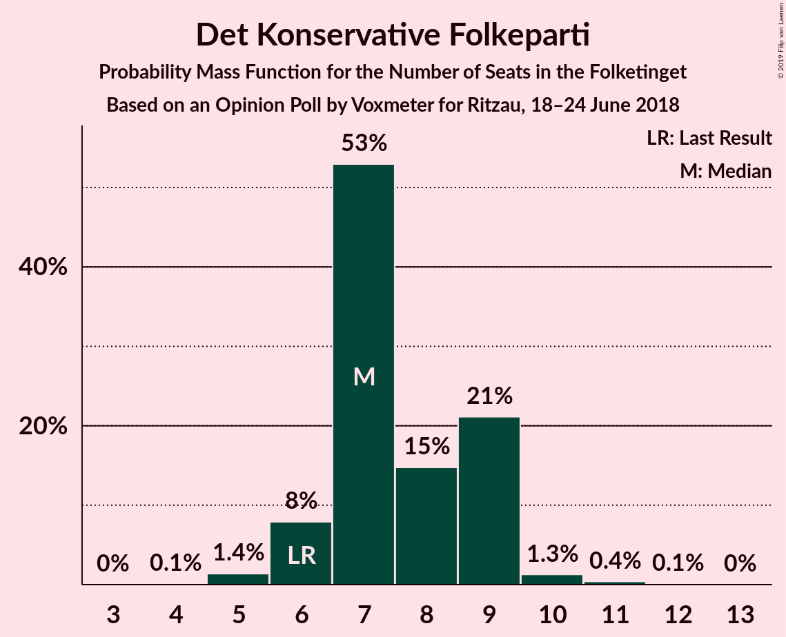
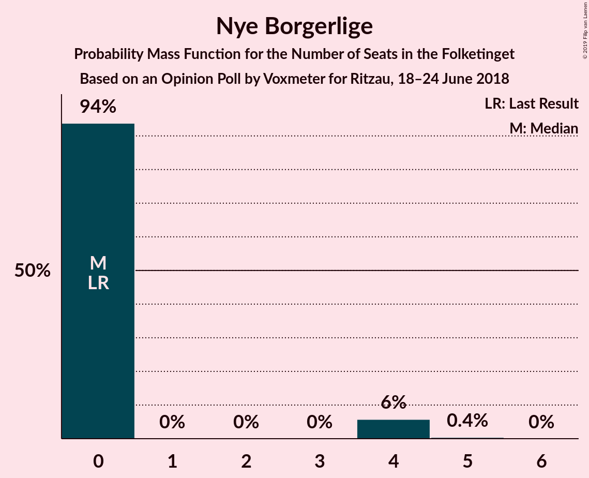
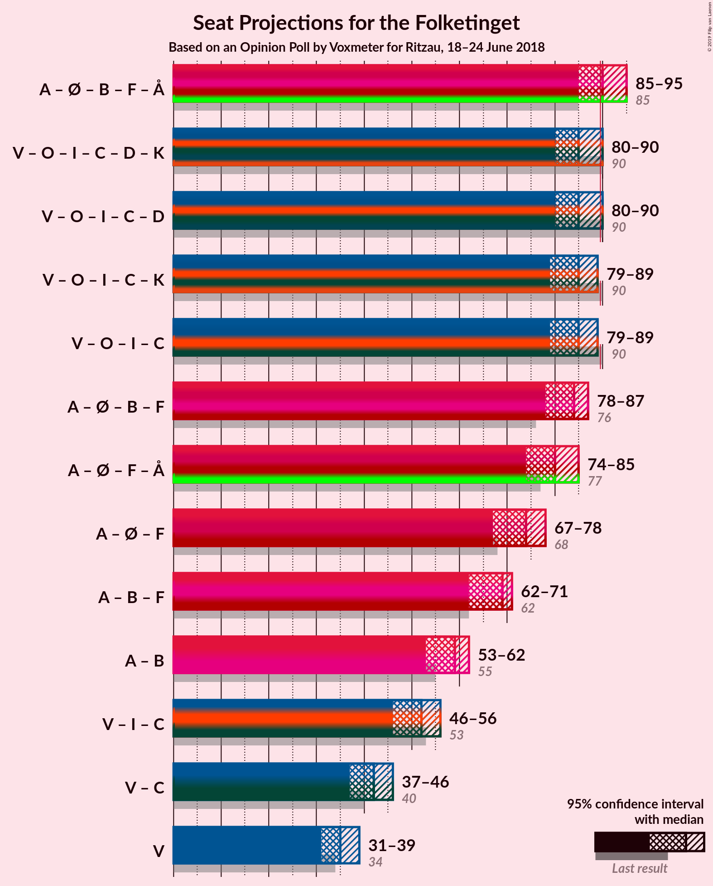

# Opinion Poll by Voxmeter for Ritzau, 18–24 June 2018

<a href="#voting-intentions">Voting Intentions</a> | <a href="#seats">Seats</a> | <a href="#coalitions">Coalitions</a> | <a href="#technical-information">Technical Information</a>

## Voting Intentions

### Confidence Intervals

| Party | Last Result | Poll Result | 80% Confidence Interval | 90% Confidence Interval | 95% Confidence Interval | 99% Confidence Interval |
|:-----:|:-----------:|:-----------:|:-----------------------:|:-----------------------:|:-----------------------:|:-----------------------:|
| Socialdemokraterne | 26.3% | 26.3% | 24.6–28.1% |24.1–28.6% |23.7–29.0% |22.9–29.9% |
| Venstre | 19.5% | 19.4% | 17.9–21.0% |17.4–21.5% |17.1–21.9% |16.4–22.7% |
| Dansk Folkeparti | 21.1% | 19.3% | 17.8–20.9% |17.3–21.4% |17.0–21.8% |16.3–22.6% |
| Enhedslisten–De Rød-Grønne | 7.8% | 9.2% | 8.1–10.5% |7.8–10.8% |7.6–11.1% |7.1–11.8% |
| Radikale Venstre | 4.6% | 5.7% | 4.9–6.8% |4.6–7.1% |4.5–7.3% |4.1–7.8% |
| Socialistisk Folkeparti | 4.2% | 5.0% | 4.3–6.0% |4.0–6.3% |3.9–6.6% |3.5–7.1% |
| Liberal Alliance | 7.5% | 4.6% | 3.8–5.5% |3.6–5.8% |3.4–6.0% |3.1–6.5% |
| Det Konservative Folkeparti | 3.4% | 4.2% | 3.5–5.1% |3.3–5.3% |3.1–5.6% |2.8–6.0% |
| Alternativet | 4.8% | 4.1% | 3.4–5.0% |3.2–5.2% |3.0–5.5% |2.7–5.9% |
| Nye Borgerlige | 0.0% | 1.4% | 1.0–2.0% |0.9–2.1% |0.8–2.3% |0.7–2.6% |
| Kristendemokraterne | 0.8% | 0.6% | 0.4–1.0% |0.3–1.1% |0.3–1.3% |0.2–1.5% |

*Note:* The poll result column reflects the actual value used in the calculations. Published results may vary slightly, and in addition be rounded to fewer digits.

## Seats

### Confidence Intervals

| Party | Last Result | Median | 80% Confidence Interval | 90% Confidence Interval | 95% Confidence Interval | 99% Confidence Interval |
|:-----:|:-----------:|:------:|:-----------------------:|:-----------------------:|:-----------------------:|:-----------------------:|
| <a href="#socialdemokraterne">Socialdemokraterne</a> | 47 | 47 | 47 |47 |46–47 |46–53 |
| <a href="#venstre">Venstre</a> | 34 | 39 | 39 |39 |34–39 |34–39 |
| <a href="#dansk-folkeparti">Dansk Folkeparti</a> | 37 | 38 | 38 |38 |33–38 |33–38 |
| <a href="#enhedslisten–de-rød-grønne">Enhedslisten–De Rød-Grønne</a> | 14 | 12 | 12 |12 |12–17 |12–17 |
| <a href="#radikale-venstre">Radikale Venstre</a> | 8 | 8 | 8 |8 |8–12 |8–12 |
| <a href="#socialistisk-folkeparti">Socialistisk Folkeparti</a> | 7 | 8 | 8 |8 |8–10 |8–10 |
| <a href="#liberal-alliance">Liberal Alliance</a> | 13 | 8 | 8 |8 |8–9 |6–9 |
| <a href="#det-konservative-folkeparti">Det Konservative Folkeparti</a> | 6 | 6 | 6 |6 |6–8 |5–8 |
| <a href="#alternativet">Alternativet</a> | 9 | 9 | 9 |9 |6–9 |6–9 |
| <a href="#nye-borgerlige">Nye Borgerlige</a> | 0 | 0 | 0 |0 |0 |0–5 |
| <a href="#kristendemokraterne">Kristendemokraterne</a> | 0 | 0 | 0 |0 |0 |0 |

### Socialdemokraterne

*For a full overview of the results for this party, see the [Socialdemokraterne](party-socialdemokraterne.html) page.*

| Number of Seats | Probability | Accumulated | Special Marks |
|:---------------:|:-----------:|:-----------:|:-------------:|
| 44 | 0.1% | 100% |  |
| 45 | 0.1% | 99.9% |  |
| 46 | 3% | 99.9% |  |
| 47 | 96% | 97% | Last Result, Median |
| 48 | 0% | 0.9% |  |
| 49 | 0% | 0.8% |  |
| 50 | 0% | 0.8% |  |
| 51 | 0% | 0.8% |  |
| 52 | 0% | 0.8% |  |
| 53 | 0.8% | 0.8% |  |
| 54 | 0% | 0% |  |

### Venstre

*For a full overview of the results for this party, see the [Venstre](party-venstre.html) page.*

| Number of Seats | Probability | Accumulated | Special Marks |
|:---------------:|:-----------:|:-----------:|:-------------:|
| 31 | 0.1% | 100% |  |
| 32 | 0% | 99.9% |  |
| 33 | 0.1% | 99.9% |  |
| 34 | 4% | 99.9% | Last Result |
| 35 | 0% | 96% |  |
| 36 | 0% | 96% |  |
| 37 | 0% | 96% |  |
| 38 | 0% | 96% |  |
| 39 | 96% | 96% | Median |
| 40 | 0% | 0% |  |

### Dansk Folkeparti

*For a full overview of the results for this party, see the [Dansk Folkeparti](party-danskfolkeparti.html) page.*

| Number of Seats | Probability | Accumulated | Special Marks |
|:---------------:|:-----------:|:-----------:|:-------------:|
| 27 | 0.1% | 100% |  |
| 28 | 0% | 99.9% |  |
| 29 | 0% | 99.9% |  |
| 30 | 0% | 99.9% |  |
| 31 | 0% | 99.9% |  |
| 32 | 0% | 99.9% |  |
| 33 | 3% | 99.9% |  |
| 34 | 0% | 97% |  |
| 35 | 0.9% | 97% |  |
| 36 | 0% | 96% |  |
| 37 | 0% | 96% | Last Result |
| 38 | 96% | 96% | Median |
| 39 | 0% | 0% |  |

### Enhedslisten–De Rød-Grønne

*For a full overview of the results for this party, see the [Enhedslisten–De Rød-Grønne](party-enhedslisten–derød-grønne.html) page.*

| Number of Seats | Probability | Accumulated | Special Marks |
|:---------------:|:-----------:|:-----------:|:-------------:|
| 12 | 97% | 100% | Median |
| 13 | 0% | 3% |  |
| 14 | 0% | 3% | Last Result |
| 15 | 0% | 3% |  |
| 16 | 0% | 3% |  |
| 17 | 3% | 3% |  |
| 18 | 0% | 0.1% |  |
| 19 | 0% | 0.1% |  |
| 20 | 0.1% | 0.1% |  |
| 21 | 0% | 0% |  |

### Radikale Venstre

*For a full overview of the results for this party, see the [Radikale Venstre](party-radikalevenstre.html) page.*

| Number of Seats | Probability | Accumulated | Special Marks |
|:---------------:|:-----------:|:-----------:|:-------------:|
| 8 | 96% | 100% | Last Result, Median |
| 9 | 0.9% | 4% |  |
| 10 | 0.1% | 3% |  |
| 11 | 0% | 3% |  |
| 12 | 3% | 3% |  |
| 13 | 0.1% | 0.1% |  |
| 14 | 0% | 0% |  |

### Socialistisk Folkeparti

*For a full overview of the results for this party, see the [Socialistisk Folkeparti](party-socialistiskfolkeparti.html) page.*

| Number of Seats | Probability | Accumulated | Special Marks |
|:---------------:|:-----------:|:-----------:|:-------------:|
| 7 | 0.1% | 100% | Last Result |
| 8 | 96% | 99.9% | Median |
| 9 | 0.8% | 4% |  |
| 10 | 3% | 3% |  |
| 11 | 0.1% | 0.1% |  |
| 12 | 0% | 0% |  |

### Liberal Alliance

*For a full overview of the results for this party, see the [Liberal Alliance](party-liberalalliance.html) page.*

| Number of Seats | Probability | Accumulated | Special Marks |
|:---------------:|:-----------:|:-----------:|:-------------:|
| 6 | 0.9% | 100% |  |
| 7 | 0% | 99.1% |  |
| 8 | 96% | 99.1% | Median |
| 9 | 3% | 3% |  |
| 10 | 0.1% | 0.1% |  |
| 11 | 0% | 0% |  |
| 12 | 0% | 0% |  |
| 13 | 0% | 0% | Last Result |

### Det Konservative Folkeparti

*For a full overview of the results for this party, see the [Det Konservative Folkeparti](party-detkonservativefolkeparti.html) page.*

| Number of Seats | Probability | Accumulated | Special Marks |
|:---------------:|:-----------:|:-----------:|:-------------:|
| 5 | 0.9% | 100% |  |
| 6 | 96% | 99.1% | Last Result, Median |
| 7 | 0% | 3% |  |
| 8 | 3% | 3% |  |
| 9 | 0.1% | 0.1% |  |
| 10 | 0.1% | 0.1% |  |
| 11 | 0% | 0% |  |

### Alternativet

*For a full overview of the results for this party, see the [Alternativet](party-alternativet.html) page.*

| Number of Seats | Probability | Accumulated | Special Marks |
|:---------------:|:-----------:|:-----------:|:-------------:|
| 6 | 3% | 100% |  |
| 7 | 0.8% | 97% |  |
| 8 | 0% | 96% |  |
| 9 | 96% | 96% | Last Result, Median |
| 10 | 0% | 0% |  |

### Nye Borgerlige

*For a full overview of the results for this party, see the [Nye Borgerlige](party-nyeborgerlige.html) page.*

| Number of Seats | Probability | Accumulated | Special Marks |
|:---------------:|:-----------:|:-----------:|:-------------:|
| 0 | 99.1% | 100% | Last Result, Median |
| 1 | 0% | 0.9% |  |
| 2 | 0% | 0.9% |  |
| 3 | 0% | 0.9% |  |
| 4 | 0.1% | 0.9% |  |
| 5 | 0.8% | 0.9% |  |
| 6 | 0% | 0% |  |

### Kristendemokraterne

*For a full overview of the results for this party, see the [Kristendemokraterne](party-kristendemokraterne.html) page.*

| Number of Seats | Probability | Accumulated | Special Marks |
|:---------------:|:-----------:|:-----------:|:-------------:|
| 0 | 100% | 100% | Last Result, Median |

## Coalitions

### Confidence Intervals

| Coalition | Last Result | Median | Majority? | 80% Confidence Interval | 90% Confidence Interval | 95% Confidence Interval | 99% Confidence Interval |
|:---------:|:-----------:|:------:|:---------:|:-----------------------:|:-----------------------:|:-----------------------:|:-----------------------:|
| Socialdemokraterne – Enhedslisten–De Rød-Grønne – Radikale Venstre – Socialistisk Folkeparti – Alternativet | 85 | 84 | 4% | 84 | 84 | 84–91 | 84–91 |
| Venstre – Dansk Folkeparti – Liberal Alliance – Det Konservative Folkeparti – Nye Borgerlige – Kristendemokraterne | 90 | 91 | 96% | 91 | 91 | 84–91 | 84–91 |
| Venstre – Dansk Folkeparti – Liberal Alliance – Det Konservative Folkeparti – Kristendemokraterne | 90 | 91 | 96% | 91 | 91 | 84–91 | 80–91 |
| Venstre – Dansk Folkeparti – Liberal Alliance – Det Konservative Folkeparti – Nye Borgerlige | 90 | 91 | 96% | 91 | 91 | 84–91 | 84–91 |
| Venstre – Dansk Folkeparti – Liberal Alliance – Det Konservative Folkeparti | 90 | 91 | 96% | 91 | 91 | 84–91 | 80–91 |
| Socialdemokraterne – Enhedslisten–De Rød-Grønne – Radikale Venstre – Socialistisk Folkeparti | 76 | 75 | 0% | 75 | 75 | 75–85 | 75–85 |

### Socialdemokraterne – Enhedslisten–De Rød-Grønne – Radikale Venstre – Socialistisk Folkeparti – Alternativet

| Number of Seats | Probability | Accumulated | Special Marks |
|:---------------:|:-----------:|:-----------:|:-------------:|
| 84 | 96% | 100% | Median |
| 85 | 0% | 4% | Last Result |
| 86 | 0% | 4% |  |
| 87 | 0.1% | 4% |  |
| 88 | 0% | 4% |  |
| 89 | 0% | 4% |  |
| 90 | 0.8% | 4% | Majority |
| 91 | 3% | 3% |  |
| 92 | 0% | 0.1% |  |
| 93 | 0% | 0.1% |  |
| 94 | 0% | 0.1% |  |
| 95 | 0% | 0.1% |  |
| 96 | 0% | 0.1% |  |
| 97 | 0% | 0.1% |  |
| 98 | 0.1% | 0.1% |  |
| 99 | 0% | 0% |  |

### Venstre – Dansk Folkeparti – Liberal Alliance – Det Konservative Folkeparti – Nye Borgerlige – Kristendemokraterne

| Number of Seats | Probability | Accumulated | Special Marks |
|:---------------:|:-----------:|:-----------:|:-------------:|
| 77 | 0.1% | 100% |  |
| 78 | 0% | 99.9% |  |
| 79 | 0% | 99.9% |  |
| 80 | 0% | 99.9% |  |
| 81 | 0% | 99.9% |  |
| 82 | 0% | 99.9% |  |
| 83 | 0% | 99.9% |  |
| 84 | 3% | 99.9% |  |
| 85 | 0.9% | 97% |  |
| 86 | 0% | 96% |  |
| 87 | 0% | 96% |  |
| 88 | 0.1% | 96% |  |
| 89 | 0% | 96% |  |
| 90 | 0% | 96% | Last Result, Majority |
| 91 | 96% | 96% | Median |
| 92 | 0% | 0% |  |

### Venstre – Dansk Folkeparti – Liberal Alliance – Det Konservative Folkeparti – Kristendemokraterne

| Number of Seats | Probability | Accumulated | Special Marks |
|:---------------:|:-----------:|:-----------:|:-------------:|
| 77 | 0.1% | 100% |  |
| 78 | 0% | 99.9% |  |
| 79 | 0% | 99.9% |  |
| 80 | 0.9% | 99.9% |  |
| 81 | 0% | 99.1% |  |
| 82 | 0% | 99.1% |  |
| 83 | 0% | 99.1% |  |
| 84 | 3% | 99.1% |  |
| 85 | 0% | 96% |  |
| 86 | 0% | 96% |  |
| 87 | 0% | 96% |  |
| 88 | 0% | 96% |  |
| 89 | 0% | 96% |  |
| 90 | 0% | 96% | Last Result, Majority |
| 91 | 96% | 96% | Median |
| 92 | 0% | 0% |  |

### Venstre – Dansk Folkeparti – Liberal Alliance – Det Konservative Folkeparti – Nye Borgerlige

| Number of Seats | Probability | Accumulated | Special Marks |
|:---------------:|:-----------:|:-----------:|:-------------:|
| 77 | 0.1% | 100% |  |
| 78 | 0% | 99.9% |  |
| 79 | 0% | 99.9% |  |
| 80 | 0% | 99.9% |  |
| 81 | 0% | 99.9% |  |
| 82 | 0% | 99.9% |  |
| 83 | 0% | 99.9% |  |
| 84 | 3% | 99.9% |  |
| 85 | 0.9% | 97% |  |
| 86 | 0% | 96% |  |
| 87 | 0% | 96% |  |
| 88 | 0.1% | 96% |  |
| 89 | 0% | 96% |  |
| 90 | 0% | 96% | Last Result, Majority |
| 91 | 96% | 96% | Median |
| 92 | 0% | 0% |  |

### Venstre – Dansk Folkeparti – Liberal Alliance – Det Konservative Folkeparti

| Number of Seats | Probability | Accumulated | Special Marks |
|:---------------:|:-----------:|:-----------:|:-------------:|
| 77 | 0.1% | 100% |  |
| 78 | 0% | 99.9% |  |
| 79 | 0% | 99.9% |  |
| 80 | 0.9% | 99.9% |  |
| 81 | 0% | 99.1% |  |
| 82 | 0% | 99.1% |  |
| 83 | 0% | 99.1% |  |
| 84 | 3% | 99.1% |  |
| 85 | 0% | 96% |  |
| 86 | 0% | 96% |  |
| 87 | 0% | 96% |  |
| 88 | 0% | 96% |  |
| 89 | 0% | 96% |  |
| 90 | 0% | 96% | Last Result, Majority |
| 91 | 96% | 96% | Median |
| 92 | 0% | 0% |  |

### Socialdemokraterne – Enhedslisten–De Rød-Grønne – Radikale Venstre – Socialistisk Folkeparti

| Number of Seats | Probability | Accumulated | Special Marks |
|:---------------:|:-----------:|:-----------:|:-------------:|
| 75 | 96% | 100% | Median |
| 76 | 0% | 4% | Last Result |
| 77 | 0% | 4% |  |
| 78 | 0% | 4% |  |
| 79 | 0% | 4% |  |
| 80 | 0% | 4% |  |
| 81 | 0.1% | 4% |  |
| 82 | 0% | 4% |  |
| 83 | 0.8% | 4% |  |
| 84 | 0% | 3% |  |
| 85 | 3% | 3% |  |
| 86 | 0% | 0.1% |  |
| 87 | 0% | 0.1% |  |
| 88 | 0% | 0.1% |  |
| 89 | 0.1% | 0.1% |  |
| 90 | 0% | 0% | Majority |

## Technical Information

### Opinion Poll

+ **Polling firm:** Voxmeter
+ **Commissioner(s):** Ritzau
+ **Fieldwork period:** 18–24 June 2018

### Calculations

+ **Sample size:** 1032
+ **Simulations done:** 1,024
+ **Error estimate:** 3.86%

