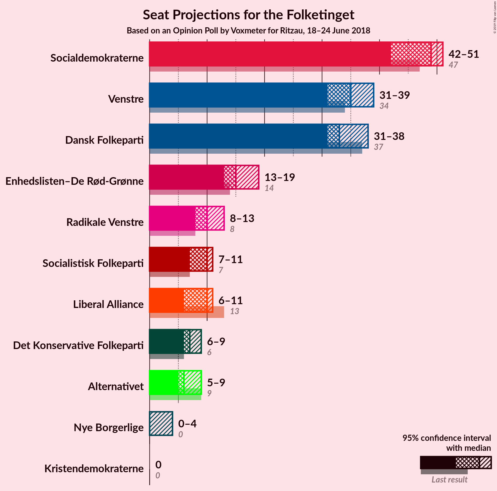
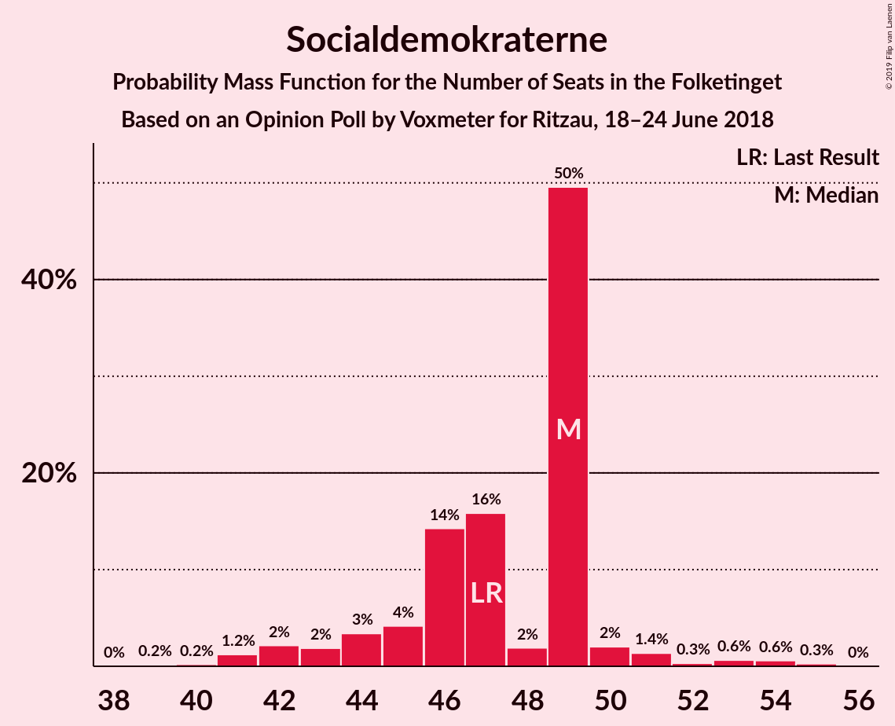
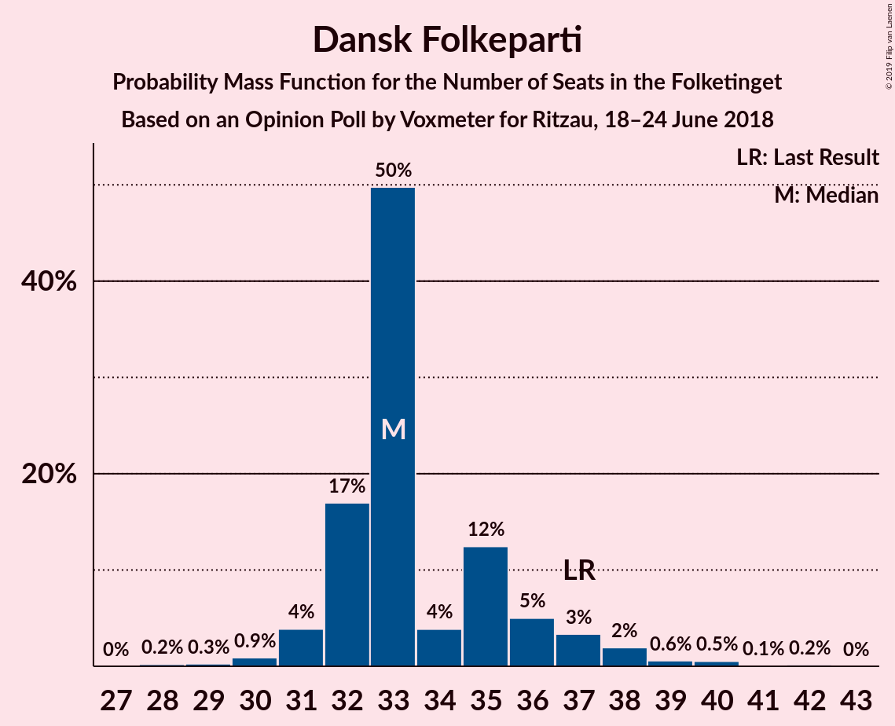
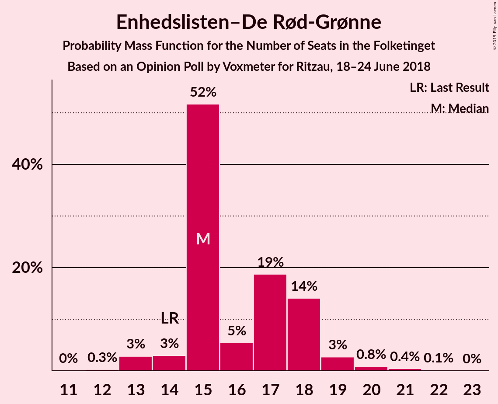
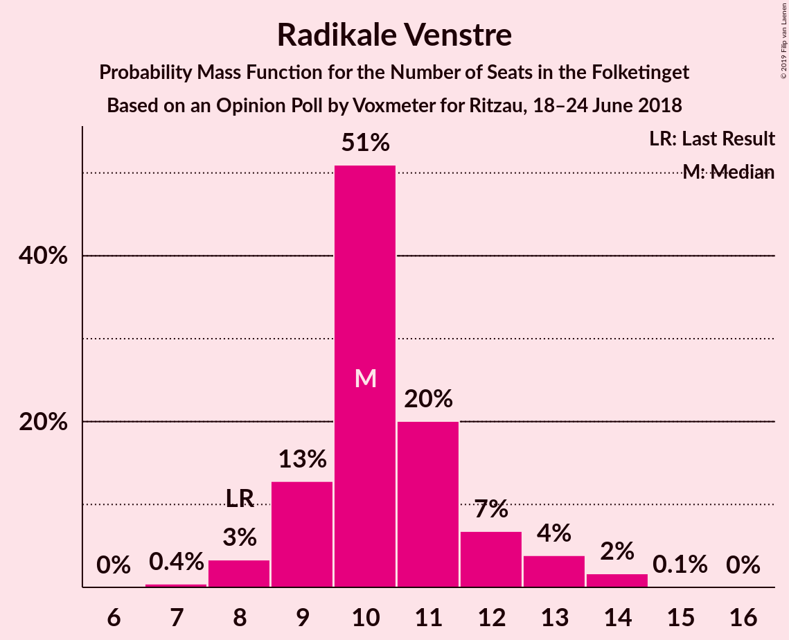
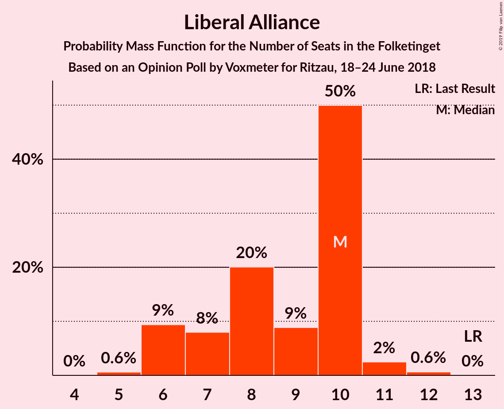

# Opinion Poll by Voxmeter for Ritzau, 18–24 June 2018

<a href="#voting-intentions">Voting Intentions</a> | <a href="#seats">Seats</a> | <a href="#coalitions">Coalitions</a> | <a href="#technical-information">Technical Information</a>

## Voting Intentions

### Confidence Intervals

| Party | Last Result | Poll Result | 80% Confidence Interval | 90% Confidence Interval | 95% Confidence Interval | 99% Confidence Interval |
|:-----:|:-----------:|:-----------:|:-----------------------:|:-----------------------:|:-----------------------:|:-----------------------:|
| Socialdemokraterne | 26.3% | 26.3% | 24.6–28.1% |24.1–28.6% |23.7–29.0% |22.9–29.9% |
| Venstre | 19.5% | 19.4% | 17.9–21.0% |17.4–21.5% |17.1–21.9% |16.4–22.7% |
| Dansk Folkeparti | 21.1% | 19.3% | 17.8–20.9% |17.3–21.4% |17.0–21.8% |16.3–22.6% |
| Enhedslisten–De Rød-Grønne | 7.8% | 9.2% | 8.1–10.5% |7.8–10.8% |7.6–11.1% |7.1–11.8% |
| Radikale Venstre | 4.6% | 5.7% | 4.9–6.8% |4.6–7.1% |4.5–7.3% |4.1–7.8% |
| Socialistisk Folkeparti | 4.2% | 5.0% | 4.3–6.0% |4.0–6.3% |3.9–6.6% |3.5–7.1% |
| Liberal Alliance | 7.5% | 4.6% | 3.8–5.5% |3.6–5.8% |3.4–6.0% |3.1–6.5% |
| Det Konservative Folkeparti | 3.4% | 4.2% | 3.5–5.1% |3.3–5.3% |3.1–5.6% |2.8–6.0% |
| Alternativet | 4.8% | 4.1% | 3.4–5.0% |3.2–5.2% |3.0–5.5% |2.7–5.9% |
| Nye Borgerlige | 0.0% | 1.4% | 1.0–2.0% |0.9–2.1% |0.8–2.3% |0.7–2.6% |
| Kristendemokraterne | 0.8% | 0.6% | 0.4–1.0% |0.3–1.1% |0.3–1.3% |0.2–1.5% |

*Note:* The poll result column reflects the actual value used in the calculations. Published results may vary slightly, and in addition be rounded to fewer digits.

## Seats

### Confidence Intervals

| Party | Last Result | Median | 80% Confidence Interval | 90% Confidence Interval | 95% Confidence Interval | 99% Confidence Interval |
|:-----:|:-----------:|:------:|:-----------------------:|:-----------------------:|:-----------------------:|:-----------------------:|
| <a href="#socialdemokraterne">Socialdemokraterne</a> | 47 | 46 | 43–49 |42–51 |41–51 |41–52 |
| <a href="#venstre">Venstre</a> | 34 | 35 | 33–39 |31–39 |30–41 |28–43 |
| <a href="#dansk-folkeparti">Dansk Folkeparti</a> | 37 | 36 | 32–36 |30–37 |30–38 |29–41 |
| <a href="#enhedslisten–de-rød-grønne">Enhedslisten–De Rød-Grønne</a> | 14 | 17 | 14–19 |14–19 |14–20 |13–20 |
| <a href="#radikale-venstre">Radikale Venstre</a> | 8 | 12 | 9–12 |8–12 |8–13 |7–14 |
| <a href="#socialistisk-folkeparti">Socialistisk Folkeparti</a> | 7 | 10 | 8–11 |7–11 |7–11 |7–12 |
| <a href="#liberal-alliance">Liberal Alliance</a> | 13 | 9 | 6–10 |6–10 |6–11 |6–12 |
| <a href="#det-konservative-folkeparti">Det Konservative Folkeparti</a> | 6 | 6 | 5–9 |5–10 |5–10 |5–12 |
| <a href="#alternativet">Alternativet</a> | 9 | 6 | 5–8 |5–10 |5–10 |5–11 |
| <a href="#nye-borgerlige">Nye Borgerlige</a> | 0 | 0 | 0–4 |0–5 |0–5 |0–5 |
| <a href="#kristendemokraterne">Kristendemokraterne</a> | 0 | 0 | 0 |0 |0 |0 |

### Socialdemokraterne

*For a full overview of the results for this party, see the [Socialdemokraterne](party-socialdemokraterne.html) page.*

| Number of Seats | Probability | Accumulated | Special Marks |
|:---------------:|:-----------:|:-----------:|:-------------:|
| 40 | 0% | 100% |  |
| 41 | 3% | 99.9% |  |
| 42 | 3% | 97% |  |
| 43 | 10% | 94% |  |
| 44 | 7% | 84% |  |
| 45 | 7% | 77% |  |
| 46 | 44% | 69% | Median |
| 47 | 11% | 25% | Last Result |
| 48 | 3% | 13% |  |
| 49 | 0.7% | 10% |  |
| 50 | 4% | 9% |  |
| 51 | 5% | 5% |  |
| 52 | 0.6% | 0.9% |  |
| 53 | 0.2% | 0.3% |  |
| 54 | 0.1% | 0.1% |  |
| 55 | 0% | 0% |  |

### Venstre

*For a full overview of the results for this party, see the [Venstre](party-venstre.html) page.*

| Number of Seats | Probability | Accumulated | Special Marks |
|:---------------:|:-----------:|:-----------:|:-------------:|
| 27 | 0.2% | 100% |  |
| 28 | 0.8% | 99.8% |  |
| 29 | 0.5% | 99.0% |  |
| 30 | 3% | 98% |  |
| 31 | 0.9% | 95% |  |
| 32 | 1.5% | 94% |  |
| 33 | 40% | 93% |  |
| 34 | 2% | 52% | Last Result |
| 35 | 8% | 50% | Median |
| 36 | 14% | 43% |  |
| 37 | 10% | 29% |  |
| 38 | 0.7% | 19% |  |
| 39 | 15% | 18% |  |
| 40 | 1.0% | 4% |  |
| 41 | 0.9% | 3% |  |
| 42 | 0% | 2% |  |
| 43 | 2% | 2% |  |
| 44 | 0% | 0% |  |

### Dansk Folkeparti

*For a full overview of the results for this party, see the [Dansk Folkeparti](party-danskfolkeparti.html) page.*

| Number of Seats | Probability | Accumulated | Special Marks |
|:---------------:|:-----------:|:-----------:|:-------------:|
| 28 | 0.3% | 100% |  |
| 29 | 0.6% | 99.7% |  |
| 30 | 4% | 99.1% |  |
| 31 | 5% | 95% |  |
| 32 | 15% | 90% |  |
| 33 | 1.2% | 75% |  |
| 34 | 15% | 74% |  |
| 35 | 8% | 59% |  |
| 36 | 46% | 52% | Median |
| 37 | 2% | 6% | Last Result |
| 38 | 2% | 4% |  |
| 39 | 0.9% | 2% |  |
| 40 | 0.6% | 1.4% |  |
| 41 | 0.6% | 0.8% |  |
| 42 | 0.2% | 0.2% |  |
| 43 | 0% | 0% |  |

### Enhedslisten–De Rød-Grønne

*For a full overview of the results for this party, see the [Enhedslisten–De Rød-Grønne](party-enhedslisten–derød-grønne.html) page.*

| Number of Seats | Probability | Accumulated | Special Marks |
|:---------------:|:-----------:|:-----------:|:-------------:|
| 11 | 0.2% | 100% |  |
| 12 | 0.3% | 99.8% |  |
| 13 | 1.4% | 99.5% |  |
| 14 | 17% | 98% | Last Result |
| 15 | 5% | 81% |  |
| 16 | 18% | 76% |  |
| 17 | 42% | 58% | Median |
| 18 | 5% | 16% |  |
| 19 | 7% | 10% |  |
| 20 | 3% | 4% |  |
| 21 | 0.2% | 0.3% |  |
| 22 | 0.1% | 0.1% |  |
| 23 | 0% | 0% |  |

### Radikale Venstre

*For a full overview of the results for this party, see the [Radikale Venstre](party-radikalevenstre.html) page.*

| Number of Seats | Probability | Accumulated | Special Marks |
|:---------------:|:-----------:|:-----------:|:-------------:|
| 6 | 0.1% | 100% |  |
| 7 | 0.6% | 99.9% |  |
| 8 | 9% | 99.3% | Last Result |
| 9 | 12% | 90% |  |
| 10 | 12% | 78% |  |
| 11 | 8% | 66% |  |
| 12 | 54% | 58% | Median |
| 13 | 3% | 4% |  |
| 14 | 1.2% | 1.3% |  |
| 15 | 0.1% | 0.1% |  |
| 16 | 0% | 0% |  |

### Socialistisk Folkeparti

*For a full overview of the results for this party, see the [Socialistisk Folkeparti](party-socialistiskfolkeparti.html) page.*

| Number of Seats | Probability | Accumulated | Special Marks |
|:---------------:|:-----------:|:-----------:|:-------------:|
| 5 | 0.1% | 100% |  |
| 6 | 0.3% | 99.9% |  |
| 7 | 7% | 99.7% | Last Result |
| 8 | 17% | 92% |  |
| 9 | 19% | 75% |  |
| 10 | 11% | 56% | Median |
| 11 | 44% | 46% |  |
| 12 | 1.3% | 2% |  |
| 13 | 0.1% | 0.2% |  |
| 14 | 0.1% | 0.1% |  |
| 15 | 0% | 0% |  |

### Liberal Alliance

*For a full overview of the results for this party, see the [Liberal Alliance](party-liberalalliance.html) page.*

| Number of Seats | Probability | Accumulated | Special Marks |
|:---------------:|:-----------:|:-----------:|:-------------:|
| 5 | 0.3% | 100% |  |
| 6 | 12% | 99.7% |  |
| 7 | 17% | 88% |  |
| 8 | 11% | 71% |  |
| 9 | 45% | 60% | Median |
| 10 | 12% | 14% |  |
| 11 | 2% | 3% |  |
| 12 | 0.7% | 0.7% |  |
| 13 | 0% | 0% | Last Result |

### Det Konservative Folkeparti

*For a full overview of the results for this party, see the [Det Konservative Folkeparti](party-detkonservativefolkeparti.html) page.*

| Number of Seats | Probability | Accumulated | Special Marks |
|:---------------:|:-----------:|:-----------:|:-------------:|
| 5 | 13% | 100% |  |
| 6 | 46% | 87% | Last Result, Median |
| 7 | 12% | 42% |  |
| 8 | 13% | 30% |  |
| 9 | 8% | 17% |  |
| 10 | 8% | 10% |  |
| 11 | 0.3% | 2% |  |
| 12 | 2% | 2% |  |
| 13 | 0% | 0% |  |

### Alternativet

*For a full overview of the results for this party, see the [Alternativet](party-alternativet.html) page.*

| Number of Seats | Probability | Accumulated | Special Marks |
|:---------------:|:-----------:|:-----------:|:-------------:|
| 5 | 47% | 100% |  |
| 6 | 9% | 53% | Median |
| 7 | 10% | 43% |  |
| 8 | 25% | 34% |  |
| 9 | 4% | 9% | Last Result |
| 10 | 4% | 5% |  |
| 11 | 1.1% | 1.2% |  |
| 12 | 0% | 0% |  |

### Nye Borgerlige

*For a full overview of the results for this party, see the [Nye Borgerlige](party-nyeborgerlige.html) page.*

| Number of Seats | Probability | Accumulated | Special Marks |
|:---------------:|:-----------:|:-----------:|:-------------:|
| 0 | 84% | 100% | Last Result, Median |
| 1 | 0% | 16% |  |
| 2 | 0% | 16% |  |
| 3 | 0% | 16% |  |
| 4 | 9% | 16% |  |
| 5 | 7% | 7% |  |
| 6 | 0% | 0% |  |

### Kristendemokraterne

*For a full overview of the results for this party, see the [Kristendemokraterne](party-kristendemokraterne.html) page.*

| Number of Seats | Probability | Accumulated | Special Marks |
|:---------------:|:-----------:|:-----------:|:-------------:|
| 0 | 99.9% | 100% | Last Result, Median |
| 1 | 0% | 0.1% |  |
| 2 | 0% | 0.1% |  |
| 3 | 0% | 0.1% |  |
| 4 | 0.1% | 0.1% |  |
| 5 | 0% | 0% |  |

## Coalitions

### Confidence Intervals

| Coalition | Last Result | Median | Majority? | 80% Confidence Interval | 90% Confidence Interval | 95% Confidence Interval | 99% Confidence Interval |
|:---------:|:-----------:|:------:|:---------:|:-----------------------:|:-----------------------:|:-----------------------:|:-----------------------:|
| Socialdemokraterne – Enhedslisten–De Rød-Grønne – Radikale Venstre – Socialistisk Folkeparti – Alternativet | 85 | 91 | 61% | 85–92 | 83–93 | 82–95 | 82–96 |
| Venstre – Dansk Folkeparti – Liberal Alliance – Det Konservative Folkeparti – Nye Borgerlige – Kristendemokraterne | 90 | 84 | 11% | 83–90 | 82–92 | 80–93 | 79–93 |
| Venstre – Dansk Folkeparti – Liberal Alliance – Det Konservative Folkeparti – Nye Borgerlige | 90 | 84 | 11% | 83–90 | 82–92 | 80–93 | 79–93 |
| Venstre – Dansk Folkeparti – Liberal Alliance – Det Konservative Folkeparti – Kristendemokraterne | 90 | 84 | 6% | 82–89 | 80–90 | 80–91 | 76–92 |
| Venstre – Dansk Folkeparti – Liberal Alliance – Det Konservative Folkeparti | 90 | 84 | 6% | 82–89 | 80–90 | 80–91 | 76–92 |
| Socialdemokraterne – Enhedslisten–De Rød-Grønne – Radikale Venstre – Socialistisk Folkeparti | 76 | 85 | 0.2% | 78–86 | 76–86 | 76–87 | 74–89 |
| Socialdemokraterne – Enhedslisten–De Rød-Grønne – Socialistisk Folkeparti – Alternativet | 77 | 79 | 0% | 75–82 | 73–82 | 70–84 | 70–87 |
| Socialdemokraterne – Enhedslisten–De Rød-Grønne – Socialistisk Folkeparti | 68 | 74 | 0% | 67–75 | 66–76 | 64–76 | 64–78 |
| Socialdemokraterne – Radikale Venstre – Socialistisk Folkeparti | 62 | 67 | 0% | 62–69 | 61–69 | 60–70 | 59–73 |
| Socialdemokraterne – Radikale Venstre | 55 | 58 | 0% | 54–58 | 53–60 | 52–61 | 50–63 |
| Venstre – Liberal Alliance – Det Konservative Folkeparti | 53 | 49 | 0% | 48–54 | 47–56 | 46–57 | 42–58 |
| Venstre – Det Konservative Folkeparti | 40 | 41 | 0% | 39–46 | 39–48 | 38–50 | 35–51 |
| Venstre | 34 | 35 | 0% | 33–39 | 31–39 | 30–41 | 28–43 |

### Socialdemokraterne – Enhedslisten–De Rød-Grønne – Radikale Venstre – Socialistisk Folkeparti – Alternativet

| Number of Seats | Probability | Accumulated | Special Marks |
|:---------------:|:-----------:|:-----------:|:-------------:|
| 81 | 0.3% | 100% |  |
| 82 | 3% | 99.7% |  |
| 83 | 3% | 97% |  |
| 84 | 2% | 94% |  |
| 85 | 3% | 92% | Last Result |
| 86 | 8% | 89% |  |
| 87 | 10% | 81% |  |
| 88 | 2% | 72% |  |
| 89 | 8% | 70% |  |
| 90 | 6% | 61% | Majority |
| 91 | 44% | 56% | Median |
| 92 | 2% | 11% |  |
| 93 | 5% | 9% |  |
| 94 | 0.6% | 4% |  |
| 95 | 3% | 4% |  |
| 96 | 0.5% | 0.8% |  |
| 97 | 0.1% | 0.4% |  |
| 98 | 0.1% | 0.3% |  |
| 99 | 0.2% | 0.2% |  |
| 100 | 0% | 0% |  |

### Venstre – Dansk Folkeparti – Liberal Alliance – Det Konservative Folkeparti – Nye Borgerlige – Kristendemokraterne

| Number of Seats | Probability | Accumulated | Special Marks |
|:---------------:|:-----------:|:-----------:|:-------------:|
| 76 | 0.2% | 100% |  |
| 77 | 0.1% | 99.8% |  |
| 78 | 0.1% | 99.7% |  |
| 79 | 0.5% | 99.6% |  |
| 80 | 3% | 99.2% |  |
| 81 | 0.6% | 96% |  |
| 82 | 5% | 96% |  |
| 83 | 2% | 91% |  |
| 84 | 44% | 89% |  |
| 85 | 6% | 44% |  |
| 86 | 8% | 39% | Median |
| 87 | 2% | 30% |  |
| 88 | 10% | 28% |  |
| 89 | 8% | 19% |  |
| 90 | 3% | 11% | Last Result, Majority |
| 91 | 2% | 8% |  |
| 92 | 3% | 6% |  |
| 93 | 3% | 3% |  |
| 94 | 0.3% | 0.3% |  |
| 95 | 0% | 0% |  |

### Venstre – Dansk Folkeparti – Liberal Alliance – Det Konservative Folkeparti – Nye Borgerlige

| Number of Seats | Probability | Accumulated | Special Marks |
|:---------------:|:-----------:|:-----------:|:-------------:|
| 76 | 0.2% | 100% |  |
| 77 | 0.1% | 99.8% |  |
| 78 | 0.1% | 99.7% |  |
| 79 | 0.6% | 99.6% |  |
| 80 | 3% | 99.0% |  |
| 81 | 0.6% | 96% |  |
| 82 | 5% | 96% |  |
| 83 | 2% | 91% |  |
| 84 | 44% | 89% |  |
| 85 | 6% | 44% |  |
| 86 | 8% | 39% | Median |
| 87 | 2% | 30% |  |
| 88 | 10% | 28% |  |
| 89 | 8% | 19% |  |
| 90 | 3% | 11% | Last Result, Majority |
| 91 | 2% | 8% |  |
| 92 | 3% | 6% |  |
| 93 | 3% | 3% |  |
| 94 | 0.3% | 0.3% |  |
| 95 | 0% | 0% |  |

### Venstre – Dansk Folkeparti – Liberal Alliance – Det Konservative Folkeparti – Kristendemokraterne

| Number of Seats | Probability | Accumulated | Special Marks |
|:---------------:|:-----------:|:-----------:|:-------------:|
| 76 | 1.2% | 100% |  |
| 77 | 0.1% | 98.8% |  |
| 78 | 0.1% | 98.7% |  |
| 79 | 0.6% | 98.6% |  |
| 80 | 5% | 98% |  |
| 81 | 0.6% | 93% |  |
| 82 | 6% | 93% |  |
| 83 | 2% | 86% |  |
| 84 | 45% | 84% |  |
| 85 | 8% | 39% |  |
| 86 | 9% | 31% | Median |
| 87 | 0.3% | 22% |  |
| 88 | 10% | 22% |  |
| 89 | 6% | 11% |  |
| 90 | 2% | 6% | Last Result, Majority |
| 91 | 2% | 4% |  |
| 92 | 2% | 2% |  |
| 93 | 0.2% | 0.5% |  |
| 94 | 0.3% | 0.3% |  |
| 95 | 0% | 0% |  |

### Venstre – Dansk Folkeparti – Liberal Alliance – Det Konservative Folkeparti

| Number of Seats | Probability | Accumulated | Special Marks |
|:---------------:|:-----------:|:-----------:|:-------------:|
| 76 | 1.2% | 100% |  |
| 77 | 0.1% | 98.8% |  |
| 78 | 0.1% | 98.7% |  |
| 79 | 0.8% | 98.6% |  |
| 80 | 5% | 98% |  |
| 81 | 0.6% | 93% |  |
| 82 | 6% | 92% |  |
| 83 | 2% | 86% |  |
| 84 | 45% | 84% |  |
| 85 | 8% | 38% |  |
| 86 | 9% | 31% | Median |
| 87 | 0.3% | 22% |  |
| 88 | 10% | 22% |  |
| 89 | 6% | 11% |  |
| 90 | 2% | 6% | Last Result, Majority |
| 91 | 2% | 4% |  |
| 92 | 2% | 2% |  |
| 93 | 0.2% | 0.5% |  |
| 94 | 0.3% | 0.3% |  |
| 95 | 0% | 0% |  |

### Socialdemokraterne – Enhedslisten–De Rød-Grønne – Radikale Venstre – Socialistisk Folkeparti

| Number of Seats | Probability | Accumulated | Special Marks |
|:---------------:|:-----------:|:-----------:|:-------------:|
| 73 | 0.4% | 100% |  |
| 74 | 0.8% | 99.6% |  |
| 75 | 0.3% | 98.7% |  |
| 76 | 7% | 98% | Last Result |
| 77 | 0.3% | 92% |  |
| 78 | 6% | 92% |  |
| 79 | 14% | 85% |  |
| 80 | 2% | 71% |  |
| 81 | 2% | 69% |  |
| 82 | 6% | 68% |  |
| 83 | 2% | 61% |  |
| 84 | 9% | 59% |  |
| 85 | 5% | 51% | Median |
| 86 | 43% | 46% |  |
| 87 | 2% | 3% |  |
| 88 | 0.4% | 1.0% |  |
| 89 | 0.4% | 0.7% |  |
| 90 | 0.1% | 0.2% | Majority |
| 91 | 0% | 0.1% |  |
| 92 | 0.1% | 0.1% |  |
| 93 | 0% | 0% |  |

### Socialdemokraterne – Enhedslisten–De Rød-Grønne – Socialistisk Folkeparti – Alternativet

| Number of Seats | Probability | Accumulated | Special Marks |
|:---------------:|:-----------:|:-----------:|:-------------:|
| 70 | 3% | 100% |  |
| 71 | 0.1% | 97% |  |
| 72 | 0.1% | 97% |  |
| 73 | 3% | 97% |  |
| 74 | 0.9% | 94% |  |
| 75 | 10% | 93% |  |
| 76 | 6% | 83% |  |
| 77 | 4% | 76% | Last Result |
| 78 | 3% | 72% |  |
| 79 | 44% | 69% | Median |
| 80 | 8% | 24% |  |
| 81 | 1.2% | 16% |  |
| 82 | 11% | 15% |  |
| 83 | 1.2% | 4% |  |
| 84 | 2% | 3% |  |
| 85 | 0.1% | 0.8% |  |
| 86 | 0.1% | 0.6% |  |
| 87 | 0% | 0.5% |  |
| 88 | 0.5% | 0.5% |  |
| 89 | 0% | 0% |  |

### Socialdemokraterne – Enhedslisten–De Rød-Grønne – Socialistisk Folkeparti

| Number of Seats | Probability | Accumulated | Special Marks |
|:---------------:|:-----------:|:-----------:|:-------------:|
| 64 | 4% | 100% |  |
| 65 | 0.6% | 96% |  |
| 66 | 2% | 96% |  |
| 67 | 10% | 94% |  |
| 68 | 7% | 84% | Last Result |
| 69 | 5% | 77% |  |
| 70 | 2% | 72% |  |
| 71 | 6% | 70% |  |
| 72 | 2% | 64% |  |
| 73 | 1.5% | 62% | Median |
| 74 | 45% | 61% |  |
| 75 | 10% | 16% |  |
| 76 | 4% | 6% |  |
| 77 | 0.9% | 1.4% |  |
| 78 | 0.4% | 0.6% |  |
| 79 | 0.1% | 0.2% |  |
| 80 | 0% | 0.1% |  |
| 81 | 0% | 0% |  |

### Socialdemokraterne – Radikale Venstre – Socialistisk Folkeparti

| Number of Seats | Probability | Accumulated | Special Marks |
|:---------------:|:-----------:|:-----------:|:-------------:|
| 57 | 0.2% | 100% |  |
| 58 | 0% | 99.8% |  |
| 59 | 0.6% | 99.8% |  |
| 60 | 3% | 99.1% |  |
| 61 | 6% | 96% |  |
| 62 | 2% | 90% | Last Result |
| 63 | 3% | 88% |  |
| 64 | 6% | 85% |  |
| 65 | 18% | 79% |  |
| 66 | 10% | 61% |  |
| 67 | 1.0% | 51% |  |
| 68 | 2% | 50% | Median |
| 69 | 44% | 47% |  |
| 70 | 2% | 3% |  |
| 71 | 0% | 1.2% |  |
| 72 | 0.4% | 1.2% |  |
| 73 | 0.5% | 0.8% |  |
| 74 | 0.1% | 0.3% |  |
| 75 | 0.1% | 0.2% |  |
| 76 | 0% | 0% |  |

### Socialdemokraterne – Radikale Venstre

| Number of Seats | Probability | Accumulated | Special Marks |
|:---------------:|:-----------:|:-----------:|:-------------:|
| 49 | 0% | 100% |  |
| 50 | 0.5% | 99.9% |  |
| 51 | 0.2% | 99.5% |  |
| 52 | 3% | 99.3% |  |
| 53 | 5% | 97% |  |
| 54 | 7% | 91% |  |
| 55 | 15% | 84% | Last Result |
| 56 | 7% | 69% |  |
| 57 | 4% | 62% |  |
| 58 | 48% | 58% | Median |
| 59 | 3% | 10% |  |
| 60 | 4% | 7% |  |
| 61 | 0.2% | 3% |  |
| 62 | 2% | 2% |  |
| 63 | 0.4% | 0.7% |  |
| 64 | 0.1% | 0.4% |  |
| 65 | 0.2% | 0.2% |  |
| 66 | 0% | 0.1% |  |
| 67 | 0% | 0% |  |

### Venstre – Liberal Alliance – Det Konservative Folkeparti

| Number of Seats | Probability | Accumulated | Special Marks |
|:---------------:|:-----------:|:-----------:|:-------------:|
| 42 | 0.6% | 100% |  |
| 43 | 0.1% | 99.4% |  |
| 44 | 0.4% | 99.3% |  |
| 45 | 0.6% | 98.9% |  |
| 46 | 1.4% | 98% |  |
| 47 | 4% | 97% |  |
| 48 | 42% | 93% |  |
| 49 | 5% | 51% |  |
| 50 | 6% | 46% | Median |
| 51 | 3% | 40% |  |
| 52 | 8% | 37% |  |
| 53 | 7% | 29% | Last Result |
| 54 | 16% | 22% |  |
| 55 | 0.7% | 6% |  |
| 56 | 1.2% | 5% |  |
| 57 | 2% | 4% |  |
| 58 | 2% | 2% |  |
| 59 | 0.1% | 0.1% |  |
| 60 | 0% | 0% |  |

### Venstre – Det Konservative Folkeparti

| Number of Seats | Probability | Accumulated | Special Marks |
|:---------------:|:-----------:|:-----------:|:-------------:|
| 34 | 0.1% | 100% |  |
| 35 | 0.8% | 99.9% |  |
| 36 | 0.2% | 99.0% |  |
| 37 | 0.9% | 98.8% |  |
| 38 | 0.7% | 98% |  |
| 39 | 40% | 97% |  |
| 40 | 5% | 57% | Last Result |
| 41 | 4% | 52% | Median |
| 42 | 2% | 48% |  |
| 43 | 6% | 46% |  |
| 44 | 21% | 40% |  |
| 45 | 2% | 18% |  |
| 46 | 11% | 17% |  |
| 47 | 0.4% | 6% |  |
| 48 | 1.3% | 5% |  |
| 49 | 0.6% | 4% |  |
| 50 | 2% | 3% |  |
| 51 | 2% | 2% |  |
| 52 | 0% | 0% |  |

### Venstre

| Number of Seats | Probability | Accumulated | Special Marks |
|:---------------:|:-----------:|:-----------:|:-------------:|
| 27 | 0.2% | 100% |  |
| 28 | 0.8% | 99.8% |  |
| 29 | 0.5% | 99.0% |  |
| 30 | 3% | 98% |  |
| 31 | 0.9% | 95% |  |
| 32 | 1.5% | 94% |  |
| 33 | 40% | 93% |  |
| 34 | 2% | 52% | Last Result |
| 35 | 8% | 50% | Median |
| 36 | 14% | 43% |  |
| 37 | 10% | 29% |  |
| 38 | 0.7% | 19% |  |
| 39 | 15% | 18% |  |
| 40 | 1.0% | 4% |  |
| 41 | 0.9% | 3% |  |
| 42 | 0% | 2% |  |
| 43 | 2% | 2% |  |
| 44 | 0% | 0% |  |

## Technical Information

### Opinion Poll

+ **Polling firm:** Voxmeter
+ **Commissioner(s):** Ritzau
+ **Fieldwork period:** 18–24 June 2018

### Calculations

+ **Sample size:** 1032
+ **Simulations done:** 131,072
+ **Error estimate:** 1.98%

